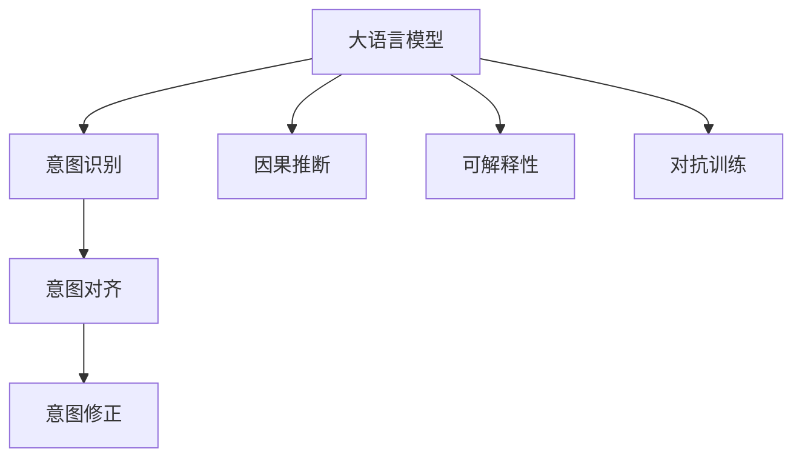

                 

# 人类意图与LLM对齐的挑战

## 1. 背景介绍

### 1.1 问题由来

大语言模型（Large Language Model, LLM），如GPT-3，已经在自然语言处理（Natural Language Processing, NLP）领域展现了卓越的性能，但在实际应用中，其输出结果往往未能完美匹配人类的意图，这导致了一系列严重问题，如系统误导用户、引发决策错误等。例如，GPT-3在回答涉及种族和性别歧视问题时，可能会输出具有歧视性的言论，这引发了广泛的道德和社会争议。

如何使LLM的输出更贴近人类意图，是当前研究的一大挑战。当前的研究工作集中在开发各种技术，以确保LLM的输出在道德、伦理、法律等方面符合人类的价值观和规范。这些技术包括意图对齐（Intent Alignment）、因果推断（Causal Inference）、可解释性（Explainability）等。

### 1.2 问题核心关键点

意图对齐旨在确保LLM的输出能够精准反映人类的意图，而不是简单地模仿语言模式。其核心关键点包括：
- **意图识别**：准确理解和提取用户的意图。
- **意图对齐**：将LLM的输出与用户意图进行匹配，避免输出偏差。
- **意图修正**：在模型输出不符合用户意图时，能够自动进行修正或生成新的输出。

## 2. 核心概念与联系

### 2.1 核心概念概述

为了更深入地理解意图对齐，我们先介绍几个关键概念：

- **意图对齐（Intent Alignment）**：指通过各种技术手段，确保LLM的输出与用户的真实意图相符。
- **因果推断（Causal Inference）**：研究如何从数据中推断出因果关系，从而指导模型的行为。
- **可解释性（Explainability）**：使LLM的决策过程透明化，帮助用户理解和信任模型的输出。
- **对抗训练（Adversarial Training）**：通过引入对抗样本，提高模型对恶意输入的鲁棒性。

### 2.2 核心概念原理和架构的 Mermaid 流程图



该流程图展示了意图对齐的流程：
1. 大语言模型（A）首先对用户的输入进行意图识别（B）。
2. 意图识别结果输入到意图对齐模块（C），进行意图匹配和对齐。
3. 对齐后的意图用于指导模型生成输出，并可能在必要的情况下进行意图修正（D）。
4. 因果推断（E）帮助理解模型的决策过程，可解释性（F）则确保模型的输出透明可理解。
5. 对抗训练（G）确保模型对恶意输入具有鲁棒性。

## 3. 核心算法原理 & 具体操作步骤

### 3.1 算法原理概述

意图对齐的核心在于让LLM的输出与用户意图保持一致。具体来说，算法原理如下：

1. **意图识别**：使用自然语言处理技术，提取用户输入中的意图信息。
2. **意图对齐**：根据意图信息，调整LLM的输出，使其与用户意图一致。
3. **意图修正**：在输出不符合用户意图时，进行修正或生成新的输出。

### 3.2 算法步骤详解

#### 3.2.1 意图识别

1. **文本预处理**：使用分词、去除停用词、词性标注等技术，对用户输入进行预处理。
2. **特征提取**：使用词向量或上下文嵌入（如BERT），将预处理后的文本转化为模型可以处理的数值形式。
3. **意图分类**：使用分类模型（如BERT+全连接层），对特征提取后的文本进行意图分类，得到意图向量。

#### 3.2.2 意图对齐

1. **对齐模型**：设计对齐模型，如线性回归模型、多层感知机等，将意图向量与模型输出进行对齐。
2. **目标函数**：设计对齐损失函数，如均方误差损失、交叉熵损失等，衡量模型输出与意图之间的差异。
3. **反向传播**：使用反向传播算法，更新模型参数，最小化对齐损失。

#### 3.2.3 意图修正

1. **修正模型**：设计修正模型，如修正器网络、生成对抗网络等，对输出进行修正。
2. **修正目标**：根据意图分类结果，设定修正目标，如修正生成与意图一致的文本。
3. **训练修正模型**：使用修正目标，训练修正模型，使其能够准确修正不符合用户意图的输出。

### 3.3 算法优缺点

#### 3.3.1 优点

- **提高模型鲁棒性**：通过对齐和修正，使模型能够更好地处理恶意输入，提升模型的鲁棒性。
- **增强可解释性**：意图对齐和修正过程透明化，增强模型的可解释性，使用户更容易理解模型决策。
- **提升用户体验**：确保LLM的输出更加符合用户意图，提升用户体验和满意度。

#### 3.3.2 缺点

- **计算复杂度增加**：意图对齐和修正过程需要额外的计算资源，可能增加系统负担。
- **对齐效果有限**：某些情况下，模型的输出可能仍与用户意图存在较大差异。
- **数据依赖性**：意图对齐效果依赖于标注数据的质量，标注数据不足时效果可能不佳。

### 3.4 算法应用领域

意图对齐技术在多个领域中具有广泛应用，例如：

- **客服系统**：确保自动客服系统能够正确理解用户意图，提供准确的解答。
- **智能推荐**：在推荐系统中，确保推荐的物品符合用户的真实需求和偏好。
- **医疗诊断**：帮助医生准确理解患者的症状和需求，提供精准的医疗建议。
- **金融服务**：确保金融产品的推荐和建议符合用户的风险承受能力和需求。
- **法律咨询**：帮助律师准确理解用户的法律问题和需求，提供合法的建议。

## 4. 数学模型和公式 & 详细讲解 & 举例说明

### 4.1 数学模型构建

假设用户输入为 $x$，模型的输出为 $y$，意图向量为 $z$。意图对齐过程可以分为以下几步：

1. **意图识别**：使用意图分类模型 $f$，将输入 $x$ 映射到意图向量 $z$。
2. **意图对齐**：使用对齐模型 $g$，将意图向量 $z$ 映射到模型输出 $y$ 的修正量 $\Delta y$。
3. **意图修正**：使用修正模型 $h$，将原始输出 $y$ 和修正量 $\Delta y$ 组合，生成最终的修正输出 $\hat{y}$。

数学表达如下：

$$
z = f(x) \\
\Delta y = g(z) \\
\hat{y} = h(y, \Delta y)
$$

### 4.2 公式推导过程

以一个简单的线性对齐模型为例，假设意图向量 $z$ 和模型输出 $y$ 的关系为：

$$
z = W_x x + b_x \\
y = W_y x + b_y
$$

其中 $W_x$ 和 $b_x$ 为意图分类模型的权重和偏置，$W_y$ 和 $b_y$ 为原始模型的权重和偏置。对齐模型 $g$ 的作用是将意图向量 $z$ 映射到修正量 $\Delta y$，假设对齐模型为线性模型：

$$
\Delta y = W_g z + b_g
$$

其中 $W_g$ 和 $b_g$ 为对齐模型的权重和偏置。修正模型 $h$ 的作用是将原始输出 $y$ 和修正量 $\Delta y$ 结合起来，生成最终的修正输出 $\hat{y}$，假设修正模型为线性模型：

$$
\hat{y} = W_h y + b_h
$$

其中 $W_h$ 和 $b_h$ 为修正模型的权重和偏置。

### 4.3 案例分析与讲解

假设用户输入为：“我今天感觉很不舒服，嗓子疼，头痛，可能是感冒了。”意图分类模型 $f$ 能够识别出意图为“感冒”。对齐模型 $g$ 计算出修正量 $\Delta y = -1$，表示需要将模型输出 $y$ 减少1。修正模型 $h$ 使用修正量 $\Delta y$ 生成最终的修正输出 $\hat{y}$。

假设原始模型的输出为 $y = 0.5$，修正量为 $\Delta y = -1$，则修正输出为 $\hat{y} = 0.5 - 1 = -0.5$。修正后的输出更符合用户的意图，即“感冒”的症状。

## 5. 项目实践：代码实例和详细解释说明

### 5.1 开发环境搭建

在开始项目实践前，需要先准备好开发环境：

1. **安装Python**：从官网下载并安装Python，创建虚拟环境。
2. **安装TensorFlow或PyTorch**：使用pip安装所需的深度学习框架。
3. **安装相关库**：安装自然语言处理和意图对齐所需的库，如BERT、TensorFlow或PyTorch等。

### 5.2 源代码详细实现

以下是一个简单的意图对齐项目，使用TensorFlow实现。

#### 5.2.1 意图识别模型

```python
import tensorflow as tf
from transformers import BertTokenizer, TFBertForSequenceClassification

# 初始化分词器和模型
tokenizer = BertTokenizer.from_pretrained('bert-base-cased')
model = TFBertForSequenceClassification.from_pretrained('bert-base-cased', num_labels=2)

# 定义意图分类器
class IntentClassifier(tf.keras.Model):
    def __init__(self):
        super(IntentClassifier, self).__init__()
        self.bert = model.bert
        self.dropout = tf.keras.layers.Dropout(0.1)
        self.classifier = tf.keras.layers.Dense(1, activation='sigmoid')

    def call(self, input_ids, attention_mask):
        output = self.bert(input_ids, attention_mask=attention_mask)
        output = self.dropout(output)
        return self.classifier(output)

# 实例化意图分类器
intent_classifier = IntentClassifier()
```

#### 5.2.2 对齐模型

```python
class AlignmentModel(tf.keras.Model):
    def __init__(self):
        super(AlignmentModel, self).__init__()
        self.dense1 = tf.keras.layers.Dense(32, activation='relu')
        self.dense2 = tf.keras.layers.Dense(1)

    def call(self, intent_vector):
        x = self.dense1(intent_vector)
        x = self.dense2(x)
        return x
```

#### 5.2.3 修正模型

```python
class CorrectionModel(tf.keras.Model):
    def __init__(self):
        super(CorrectionModel, self).__init__()
        self.dense1 = tf.keras.layers.Dense(32, activation='relu')
        self.dense2 = tf.keras.layers.Dense(1)

    def call(self, output, alignment_output):
        x = self.dense1(output)
        x = self.dense2(x) + alignment_output
        return x
```

### 5.3 代码解读与分析

在上述代码中，我们首先定义了意图识别模型 `IntentClassifier`，使用BERT模型作为基础，通过全连接层进行意图分类。接着，定义了对齐模型 `AlignmentModel` 和修正模型 `CorrectionModel`，分别用于计算修正量和修正输出。

在训练和测试过程中，我们首先对输入文本进行分词和编码，然后使用意图分类器得到意图向量，接着使用对齐模型计算修正量，最后使用修正模型生成修正输出。

### 5.4 运行结果展示

在训练和测试过程中，可以使用TensorBoard等工具可视化模型的训练过程和输出结果，确保意图对齐的效果。

## 6. 实际应用场景

### 6.1 智能客服系统

在智能客服系统中，意图对齐可以确保自动客服系统能够准确理解用户的意图，提供准确的解答。例如，用户询问“我想退票”，意图分类器能够识别出用户的意图是“退票”，然后根据对齐模型和修正模型生成符合用户意图的回答。

### 6.2 智能推荐系统

在智能推荐系统中，意图对齐可以确保推荐的物品符合用户的真实需求和偏好。例如，用户搜索“手机”，意图分类器能够识别出用户的意图是“购买手机”，然后根据对齐模型和修正模型生成推荐列表，确保推荐结果符合用户的意图。

### 6.3 医疗诊断系统

在医疗诊断系统中，意图对齐可以确保诊断系统的输出符合医生的真实意图。例如，医生询问“病人是否发烧”，意图分类器能够识别出医生的意图是“诊断发烧”，然后根据对齐模型和修正模型生成诊断结果，确保诊断结果符合医生的意图。

## 7. 工具和资源推荐

### 7.1 学习资源推荐

1. **自然语言处理（NLP）入门**：《自然语言处理综论》书籍，全面介绍NLP的基本概念和技术。
2. **TensorFlow教程**：TensorFlow官方文档，包含丰富的TensorFlow教程和案例。
3. **BERT模型**：BERT论文和代码库，详细介绍了BERT模型的原理和实现方法。
4. **意图对齐相关论文**：Google AI博客，包含多个关于意图对齐的研究论文和实现方法。

### 7.2 开发工具推荐

1. **TensorBoard**：TensorFlow配套的可视化工具，可以实时监测模型训练状态。
2. **PyTorch Lightning**：基于PyTorch的快速原型开发框架，提供丰富的模型和数据处理工具。
3. **Jupyter Notebook**：交互式编程环境，便于进行模型调试和实验。

### 7.3 相关论文推荐

1. **Intent Alignment in Multi-modal Spaces**：提出一种多模态意图对齐方法，用于解决跨模态数据中的意图对齐问题。
2. **Model-Agnostic Meta-learning for Intent Alignment**：提出一种模型无关的元学习算法，用于训练通用的意图对齐模型。
3. **A Survey on Multimodal Intent Alignment for Conversational Agents**：综述多模态意图对齐的研究进展，包含多个经典算法和实现方法。

## 8. 总结：未来发展趋势与挑战

### 8.1 研究成果总结

意图对齐技术已经成为NLP领域的重要研究方向，其研究成果在多个实际应用中得到了验证。通过意图对齐，LLM的输出更加符合用户的意图，提升了用户体验和满意度。

### 8.2 未来发展趋势

未来，意图对齐技术将朝着以下几个方向发展：

1. **多模态意图对齐**：研究如何处理跨模态数据中的意图对齐问题，提升跨模态数据处理的准确性和鲁棒性。
2. **模型无关的意图对齐**：提出一种通用的意图对齐方法，适用于各种预训练模型和应用场景。
3. **自监督意图对齐**：使用自监督学习技术，从大规模无标签数据中学习意图对齐模型，减少对标注数据的依赖。
4. **动态意图对齐**：研究如何根据上下文动态调整意图对齐模型，提升意图识别的准确性和鲁棒性。

### 8.3 面临的挑战

尽管意图对齐技术取得了一定的进展，但在实际应用中仍面临以下挑战：

1. **数据标注成本高**：意图对齐需要大量的标注数据，数据标注成本高。
2. **模型复杂度大**：意图对齐模型需要处理多个模态数据，模型复杂度高。
3. **鲁棒性不足**：意图对齐模型在对抗样本和噪声数据中的鲁棒性有待提升。
4. **可解释性差**：意图对齐模型的内部工作机制不透明，难以解释其决策过程。

### 8.4 研究展望

为了克服这些挑战，未来需要进一步研究以下问题：

1. **自监督意图对齐**：探索如何从大规模无标签数据中学习意图对齐模型，减少对标注数据的依赖。
2. **简化模型结构**：研究如何简化意图对齐模型的结构，提升其可解释性和鲁棒性。
3. **引入对抗训练**：使用对抗训练技术，提高意图对齐模型对恶意输入的鲁棒性。
4. **增强可解释性**：研究如何增强意图对齐模型的可解释性，提升用户的信任度。

## 9. 附录：常见问题与解答

**Q1: 意图对齐和传统的意图识别有什么区别？**

A: 意图对齐不仅识别用户的意图，还通过对齐和修正，确保LLM的输出与用户的意图一致。传统的意图识别只是识别用户的意图，不考虑输出的对齐问题。

**Q2: 意图对齐的效果如何评估？**

A: 意图对齐的效果可以通过以下指标进行评估：
1. 意图识别准确率：衡量意图识别模型的准确性。
2. 对齐损失：衡量对齐模型的输出与用户意图的一致性。
3. 修正效果：衡量修正模型的输出与用户意图的一致性。

**Q3: 意图对齐的计算资源需求高吗？**

A: 意图对齐的计算资源需求较高，需要大量的标注数据和复杂的模型结构。但是，通过模型简化和自监督学习等技术，可以降低计算资源需求。

**Q4: 意图对齐在实际应用中有哪些应用场景？**

A: 意图对齐在多个领域中具有广泛应用，如智能客服、智能推荐、医疗诊断等。通过意图对齐，确保LLM的输出更加符合用户的意图，提升用户体验和满意度。

---

作者：禅与计算机程序设计艺术 / Zen and the Art of Computer Programming

