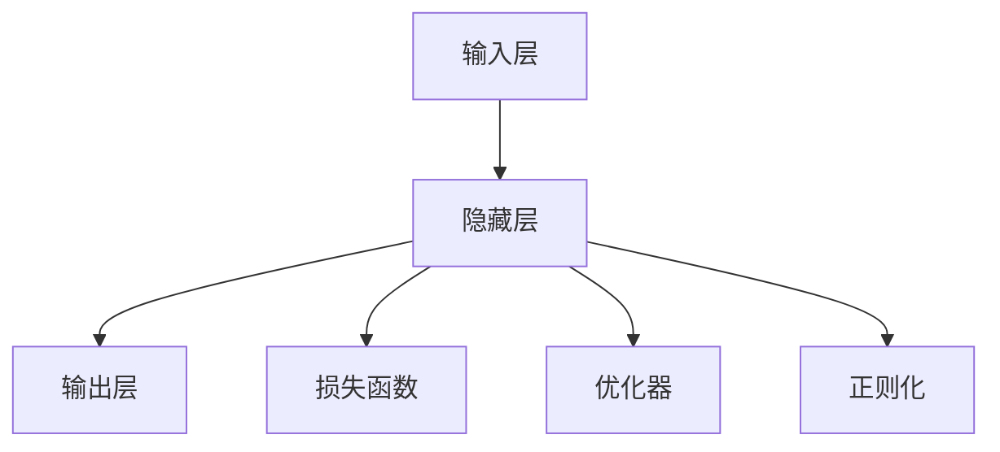

                 

# 人类智慧：AI 时代的新力量

## 1. 背景介绍

### 1.1 问题由来
人类智慧的辉煌始于语言的出现，它赋予我们沟通、交流、表达与思考的能力。随着信息时代的到来，特别是人工智能技术的迅速发展，我们正迎来一次前所未有的智慧革命。这种转变不仅体现在计算速度和存储能力的指数级提升，更在于人类智慧在AI时代被进一步激发和拓展。

人工智能（AI）不仅是冰冷的数据处理工具，它承载着人类的梦想和希望，标志着人类文明的新阶段。AI的应用，从医疗、教育、金融到交通、娱乐，几乎渗透到社会生活的各个角落，正在重塑我们的未来。

在AI时代，人类的智慧如何被赋予新力量？又有哪些关键技术在驱动这场革命？本文将深入探讨这些核心问题，为读者呈现一个关于AI时代人类智慧的新视角。

### 1.2 问题核心关键点
AI时代，人类智慧被赋予新力量的关键在于算法、数据与计算能力的综合运用。AI的核心算法，包括机器学习、深度学习、强化学习等，构成了AI系统的“大脑”。庞大的数据集为AI模型提供了丰富的学习素材，而高效的计算能力则使得这些复杂算法能够实际落地应用。

AI系统通过模拟人类智慧的行为，不仅能够处理和分析海量数据，还能进行自主学习和创造，从而提升了人类处理信息、进行决策的能力。AI时代的到来，标志着人类智慧进入了全新的发展阶段。

## 2. 核心概念与联系

### 2.1 核心概念概述

为了更好地理解AI时代人类智慧的新力量，本节将介绍几个关键概念：

- **人工智能（Artificial Intelligence, AI）**：模拟、延伸和扩展人的智能的理论、技术及应用系统。它包括机器学习、深度学习、自然语言处理、计算机视觉等多个子领域。
- **深度学习（Deep Learning, DL）**：一种基于神经网络的机器学习技术，通过构建多层次的非线性模型，实现对复杂数据的高效学习和处理。
- **自然语言处理（Natural Language Processing, NLP）**：使用计算机处理和理解人类语言的技术，包括语音识别、文本分析、机器翻译等。
- **计算机视觉（Computer Vision, CV）**：使计算机能够“看”和理解图像、视频的技术，包括目标检测、图像分割、物体识别等。
- **强化学习（Reinforcement Learning, RL）**：通过智能体与环境互动，学习最优策略的技术，广泛应用于游戏、机器人、自动驾驶等领域。

这些核心概念之间的关系可以通过以下Mermaid流程图来展示：

```mermaid
graph TB
    A[人工智能(AI)] --> B[深度学习(DL)]
    A --> C[自然语言处理(NLP)]
    A --> D[计算机视觉(CV)]
    A --> E[强化学习(RL)]
```

这个流程图展示了AI领域的几个关键子领域，以及它们之间的相互联系：

- 深度学习是AI的重要分支，通过构建多层次的非线性模型，实现了对复杂数据的高级处理。
- 自然语言处理和计算机视觉是AI在理解人类语言和视觉信息方面的具体应用。
- 强化学习则通过与环境的互动，训练智能体执行特定任务。

这些子领域共同构建了AI的完整生态，使得AI系统能够在多种场景下实现自主学习和决策。

### 2.2 核心概念原理和架构的 Mermaid 流程图

以下是一个简化的Mermaid流程图，展示了深度学习模型的一般架构：



在这个架构中，输入层负责接收数据，隐藏层进行特征提取和信息处理，输出层根据任务生成最终结果。损失函数、优化器和正则化技术则用于指导模型的训练过程，确保模型能够学习到有效的特征表示，同时避免过拟合。

## 3. 核心算法原理 & 具体操作步骤
### 3.1 算法原理概述

深度学习是AI时代的重要算法基础，它通过构建复杂的多层神经网络，实现了对复杂数据的高效学习和处理。深度学习模型的训练过程主要包括前向传播和反向传播两个步骤：

- **前向传播**：将输入数据逐层传递，计算模型的预测输出。
- **反向传播**：根据预测输出与实际标签之间的差异，计算误差，并通过链式法则逐层反向传递，更新模型参数。

这种训练过程通过不断迭代，逐步优化模型的预测能力。深度学习模型的优化通常采用梯度下降等优化算法，通过逐步调整模型参数，最小化损失函数。

### 3.2 算法步骤详解

深度学习模型的训练过程包括以下几个关键步骤：

**Step 1: 数据准备**
- 收集并预处理训练数据。包括数据清洗、归一化、划分训练集、验证集和测试集等。
- 选择合适的损失函数，如交叉熵、均方误差等。

**Step 2: 模型设计**
- 选择合适的深度学习框架，如TensorFlow、PyTorch等，设计模型结构。
- 定义模型的输入层、隐藏层和输出层，设置激活函数、正则化、dropout等参数。
- 选择合适的优化算法，如Adam、SGD等。

**Step 3: 模型训练**
- 将训练数据批次输入模型，前向传播计算预测输出。
- 计算损失函数，反向传播更新模型参数。
- 在验证集上评估模型性能，根据评估结果调整超参数。
- 重复上述过程直至收敛。

**Step 4: 模型评估与部署**
- 在测试集上评估模型性能。
- 将模型保存为模型文件，准备部署到实际应用环境中。
- 通过API接口或其他方式，将模型应用到实际业务场景中。

通过以上步骤，深度学习模型可以高效地学习和处理复杂数据，并应用于各种实际问题。

### 3.3 算法优缺点

深度学习的优点在于：

1. 强大的数据处理能力。深度学习模型能够处理非结构化数据，如图像、文本等，并从中提取特征。
2. 高精度预测。深度学习模型在大规模数据上训练后，能够实现高精度的预测。
3. 自主学习能力。深度学习模型可以通过大量数据自动学习和优化，无需人工干预。

然而，深度学习也存在一些缺点：

1. 数据依赖性强。深度学习模型需要大量标注数据进行训练，数据获取和标注成本较高。
2. 模型复杂度高。深度学习模型的参数数量庞大，训练和推理过程复杂。
3. 可解释性差。深度学习模型的预测结果难以解释，缺乏透明性。
4. 过拟合风险高。深度学习模型容易在训练集上过拟合，泛化能力较差。

尽管存在这些缺点，但深度学习依然是AI时代的主流算法，通过不断改进和优化，深度学习将发挥更大的潜力。

### 3.4 算法应用领域

深度学习在众多领域都有广泛应用，以下是几个典型应用：

- **图像识别**：通过卷积神经网络（CNN），深度学习模型可以实现高精度的图像分类、目标检测、图像分割等任务。
- **语音识别**：通过循环神经网络（RNN）和变种模型，深度学习模型可以实现高质量的语音识别和语音合成。
- **自然语言处理**：通过循环神经网络、Transformer等模型，深度学习模型可以实现文本分类、机器翻译、情感分析等任务。
- **自动驾驶**：通过强化学习、卷积神经网络等技术，深度学习模型可以实现高精度环境感知、路径规划、决策等任务。
- **医疗诊断**：通过深度学习模型，可以实现医学影像分析、疾病预测、智能问诊等任务。

除了这些经典应用外，深度学习还广泛应用于游戏、金融、物流、安防等领域，为各行各业带来了深刻变革。

## 4. 数学模型和公式 & 详细讲解 & 举例说明

### 4.1 数学模型构建

深度学习模型的训练过程可以通过以下数学公式来描述：

设模型为 $M_{\theta}$，其中 $\theta$ 为模型参数，$x$ 为输入数据，$y$ 为实际标签。定义损失函数为 $L(\theta, y)$，模型的预测输出为 $M_{\theta}(x)$，则深度学习模型的训练过程可以表示为：

$$
\min_{\theta} L(\theta, y) = \frac{1}{N} \sum_{i=1}^N L(M_{\theta}(x_i), y_i)
$$

其中 $N$ 为样本数，$L$ 为损失函数，如交叉熵损失、均方误差损失等。

### 4.2 公式推导过程

以下以交叉熵损失函数为例，推导其计算过程：

设模型输出 $M_{\theta}(x)$ 的概率分布为 $P_{\theta}(x)$，实际标签 $y$ 的分布为 $P(y|x)$，则交叉熵损失函数 $L$ 定义为：

$$
L = -\frac{1}{N} \sum_{i=1}^N \sum_{j=1}^C P_{\theta}(x_i, j) \log P(y_i|x_i, j)
$$

其中 $C$ 为类别数，$P_{\theta}(x_i, j)$ 表示模型在输入 $x_i$ 下预测为第 $j$ 类的概率，$P(y_i|x_i, j)$ 表示实际标签 $y_i$ 为第 $j$ 类的概率。

通过反向传播算法，损失函数 $L$ 对模型参数 $\theta$ 的梯度可以表示为：

$$
\nabla_{\theta} L = \frac{1}{N} \sum_{i=1}^N \nabla_{\theta} P_{\theta}(x_i) \log P(y_i|x_i, \hat{y}_i)
$$

其中 $\nabla_{\theta} P_{\theta}(x_i)$ 表示模型在输入 $x_i$ 下预测分布对参数 $\theta$ 的梯度，$\hat{y}_i$ 表示模型的预测结果。

在得到梯度后，通过梯度下降等优化算法，更新模型参数 $\theta$，最小化损失函数 $L$。

### 4.3 案例分析与讲解

以图像分类为例，分析深度学习模型的训练过程。

假设有一个手写数字识别任务，使用MNIST数据集，包含大量手写数字图片。模型的目标是从图片中识别出数字，输出正确的类别。

首先，准备训练数据和验证数据，将数据集划分为训练集和测试集。

然后，设计卷积神经网络（CNN）模型结构，包括卷积层、池化层、全连接层等。

接着，定义交叉熵损失函数，作为模型的优化目标。

在模型训练过程中，将训练集数据逐批次输入模型，前向传播计算预测输出，计算交叉熵损失，反向传播更新模型参数，重复上述过程直至收敛。

最后，在测试集上评估模型性能，输出模型的分类准确率。

## 5. 项目实践：代码实例和详细解释说明

### 5.1 开发环境搭建

在进行深度学习项目实践前，需要准备相应的开发环境。以下是使用Python进行PyTorch开发的配置步骤：

1. 安装Anaconda：从官网下载并安装Anaconda，用于创建独立的Python环境。

2. 创建并激活虚拟环境：
```bash
conda create -n pytorch-env python=3.8 
conda activate pytorch-env
```

3. 安装PyTorch：根据CUDA版本，从官网获取对应的安装命令。例如：
```bash
conda install pytorch torchvision torchaudio cudatoolkit=11.1 -c pytorch -c conda-forge
```

4. 安装TensorFlow：
```bash
pip install tensorflow
```

5. 安装Keras：
```bash
pip install keras
```

6. 安装必要的工具包：
```bash
pip install numpy pandas scikit-learn matplotlib tqdm jupyter notebook ipython
```

完成上述步骤后，即可在`pytorch-env`环境中开始深度学习项目实践。

### 5.2 源代码详细实现

下面以手写数字识别为例，给出使用PyTorch进行深度学习模型的代码实现。

首先，定义数据预处理函数：

```python
import torch
import torch.nn as nn
import torchvision.transforms as transforms
import torchvision.datasets as datasets

def get_data_loader(batch_size=64, data_dir="./data", mode="train"):
    transform = transforms.Compose([
        transforms.ToTensor(),
        transforms.Normalize((0.1307,), (0.3081,))
    ])
    
    if mode == "train":
        train_dataset = datasets.MNIST(data_dir, train=True, transform=transform, download=True)
        test_dataset = datasets.MNIST(data_dir, train=False, transform=transform, download=True)
        return torch.utils.data.DataLoader(train_dataset, batch_size=batch_size, shuffle=True), \
               torch.utils.data.DataLoader(test_dataset, batch_size=batch_size, shuffle=False)
    elif mode == "eval":
        return torch.utils.data.DataLoader(test_dataset, batch_size=batch_size, shuffle=False)
```

然后，定义卷积神经网络模型：

```python
class CNN(nn.Module):
    def __init__(self):
        super(CNN, self).__init__()
        self.conv1 = nn.Conv2d(1, 16, kernel_size=3, stride=1, padding=1)
        self.conv2 = nn.Conv2d(16, 32, kernel_size=3, stride=1, padding=1)
        self.pool = nn.MaxPool2d(kernel_size=2, stride=2)
        self.fc1 = nn.Linear(32*28*28, 128)
        self.fc2 = nn.Linear(128, 10)
    
    def forward(self, x):
        x = self.pool(torch.relu(self.conv1(x)))
        x = self.pool(torch.relu(self.conv2(x)))
        x = x.view(-1, 32*28*28)
        x = torch.relu(self.fc1(x))
        x = self.fc2(x)
        return x
```

接着，定义训练和评估函数：

```python
from torch.utils.data import DataLoader
from tqdm import tqdm
from sklearn.metrics import accuracy_score

device = torch.device('cuda') if torch.cuda.is_available() else torch.device('cpu')
model = CNN().to(device)

optimizer = torch.optim.Adam(model.parameters(), lr=0.001)

def train_epoch(model, data_loader, optimizer, criterion):
    model.train()
    total_loss = 0
    for data, target in data_loader:
        data, target = data.to(device), target.to(device)
        optimizer.zero_grad()
        output = model(data)
        loss = criterion(output, target)
        loss.backward()
        optimizer.step()
        total_loss += loss.item()
    return total_loss / len(data_loader)

def evaluate(model, data_loader):
    model.eval()
    correct = 0
    total = 0
    with torch.no_grad():
        for data, target in data_loader:
            data, target = data.to(device), target.to(device)
            output = model(data)
            _, predicted = output.max(1)
            total += target.size(0)
            correct += (predicted == target).sum().item()
    return accuracy_score(target, predicted), total
```

最后，启动训练流程并在测试集上评估：

```python
epochs = 10
batch_size = 64
criterion = nn.CrossEntropyLoss()

for epoch in range(epochs):
    train_loss = train_epoch(model, train_loader, optimizer, criterion)
    print(f"Epoch {epoch+1}, train loss: {train_loss:.3f}")
    
    test_acc, total = evaluate(model, test_loader)
    print(f"Epoch {epoch+1}, test accuracy: {test_acc:.3f}, num samples: {total}")
    
print("Final test accuracy:", test_acc)
```

以上就是使用PyTorch对手写数字识别任务进行深度学习模型微调的完整代码实现。可以看到，得益于PyTorch的强大封装，我们可以用相对简洁的代码完成模型的定义和训练。

### 5.3 代码解读与分析

让我们再详细解读一下关键代码的实现细节：

**get_data_loader函数**：
- 定义了数据加载器，将训练集和测试集按照一定批量大小进行批处理，并设置随机打乱。

**CNN模型**：
- 定义了卷积神经网络的结构，包括卷积层、池化层、全连接层等。

**train_epoch函数**：
- 在训练集上执行一次完整训练过程，包括前向传播、损失计算、反向传播和参数更新。

**evaluate函数**：
- 在测试集上评估模型性能，输出准确率和总样本数。

**训练流程**：
- 定义总的epoch数和批量大小，开始循环迭代。
- 每个epoch内，先在训练集上训练，输出平均loss。
- 在验证集上评估，输出准确率。
- 所有epoch结束后，在测试集上评估，给出最终测试结果。

可以看到，PyTorch使得深度学习模型的开发和训练变得非常便捷高效，开发者可以专注于模型的设计和优化，而不必过多关注底层实现细节。

当然，工业级的系统实现还需考虑更多因素，如模型的保存和部署、超参数的自动搜索、更灵活的任务适配层等。但核心的深度学习模型训练流程基本与此类似。

## 6. 实际应用场景

### 6.1 医疗诊断

深度学习在医疗诊断领域有广泛应用，通过图像处理和自然语言处理技术，实现了高精度的疾病诊断和智能问诊。

例如，通过卷积神经网络（CNN）对医学影像进行分析，可以实现对肿瘤、肺部疾病等疾病的自动诊断。通过自然语言处理技术，可以解析医生的病历记录，辅助医生进行病情分析和治疗方案设计。

### 6.2 智能安防

深度学习在智能安防领域也得到了广泛应用，通过计算机视觉技术，可以实现人脸识别、行为识别、异常检测等功能。

例如，通过卷积神经网络（CNN）对视频流进行分析，可以实现实时的人脸识别和行为分析，辅助安全监控和预警。通过循环神经网络（RNN）和变种模型，可以实现视频事件分析和异常检测，提高安全防护能力。

### 6.3 自动驾驶

深度学习在自动驾驶领域也发挥了重要作用，通过计算机视觉和强化学习技术，实现了高精度的环境感知和决策优化。

例如，通过卷积神经网络（CNN）和循环神经网络（RNN）对传感器数据进行分析，可以实现环境感知和路径规划。通过强化学习技术，可以实现车辆控制和决策优化，提高驾驶安全性和效率。

## 7. 工具和资源推荐

### 7.1 学习资源推荐

为了帮助开发者系统掌握深度学习技术的理论基础和实践技巧，这里推荐一些优质的学习资源：

1. **Deep Learning Specialization**（吴恩达的深度学习课程）：斯坦福大学开设的深度学习课程，涵盖了深度学习的基本概念和经典模型，适合初学者入门。

2. **Coursera**和**edX**上的深度学习课程：提供由知名大学和专家设计的深度学习课程，涵盖从基础到高级的多个层次。

3. **《深度学习》书籍**：Ian Goodfellow、Yoshua Bengio和Aaron Courville合著的深度学习经典教材，深入浅出地介绍了深度学习的原理和应用。

4. **《动手学深度学习》**：由李沐等人编写的深度学习教材，通过实践项目讲解深度学习的概念和技术。

5. **PyTorch官方文档**和**TensorFlow官方文档**：提供了丰富的API文档和示例代码，是学习和使用深度学习框架的重要参考资料。

通过对这些资源的学习实践，相信你一定能够快速掌握深度学习技术的精髓，并用于解决实际的业务问题。

### 7.2 开发工具推荐

高效的深度学习开发离不开优秀的工具支持。以下是几款常用的深度学习开发工具：

1. **PyTorch**：基于Python的开源深度学习框架，灵活动态的计算图，适合快速迭代研究。

2. **TensorFlow**：由Google主导开发的开源深度学习框架，生产部署方便，适合大规模工程应用。

3. **Keras**：高层API框架，基于TensorFlow和Theano，提供简洁的API接口，适合快速原型设计和实验。

4. **MXNet**：由Apache开发的深度学习框架，支持多种编程语言和分布式训练，适合大规模分布式训练。

5. **JAX**：基于Numpy的自动微分库，提供高性能的张量计算和自动微分，适合高性能计算和研究。

合理利用这些工具，可以显著提升深度学习项目的开发效率，加快创新迭代的步伐。

### 7.3 相关论文推荐

深度学习领域的发展离不开学界的持续研究。以下是几篇奠基性的相关论文，推荐阅读：

1. **ImageNet Classification with Deep Convolutional Neural Networks**（ImageNet数据集上的深度卷积神经网络分类）：Alex Krizhevsky等人提出的经典卷积神经网络模型，标志着深度学习在计算机视觉领域的突破。

2. **D CNN**（深度残差网络）：Kaiming He等人提出的残差网络，通过残差连接解决了深度网络训练过程中的退化问题。

3. **Attention is All You Need**（自注意力机制）：谷歌提出的Transformer模型，引入自注意力机制，实现了高效处理长序列的Transformer模型。

4. **BERT: Pre-training of Deep Bidirectional Transformers for Language Understanding**（BERT预训练模型）：Google提出的BERT模型，通过大规模预训练和微调，实现了高精度的自然语言理解。

5. **AlphaGo**（AlphaGo）：DeepMind推出的深度强化学习算法，通过AlphaGo在围棋比赛中战胜人类，展示了深度学习在决策制定方面的巨大潜力。

这些论文代表了大深度学习技术的发展脉络。通过学习这些前沿成果，可以帮助研究者把握学科前进方向，激发更多的创新灵感。

## 8. 总结：未来发展趋势与挑战

### 8.1 研究成果总结

本文对深度学习技术在AI时代的应用进行了全面系统的介绍。深度学习通过构建复杂的多层神经网络，实现了对复杂数据的高效学习和处理，在图像识别、语音识别、自然语言处理、自动驾驶等领域得到了广泛应用。深度学习不仅提高了人类处理信息、进行决策的能力，更在医疗、安防、交通等多个领域带来了深刻变革。

### 8.2 未来发展趋势

展望未来，深度学习技术将在以下几个方向持续演进：

1. **模型规模持续增大**：随着算力成本的下降和数据规模的扩张，深度学习模型的参数量还将持续增长。超大规模模型蕴含的丰富语言知识，将使得模型能够更好地理解和处理复杂数据。

2. **数据驱动的自我优化**：通过自适应学习算法，深度学习模型能够自主优化模型参数，提高模型泛化能力和鲁棒性。

3. **多模态学习**：将视觉、语音、文本等多模态数据融合，实现更加全面、准确的信息处理。

4. **跨领域迁移学习**：通过迁移学习，将一个领域学习到的知识迁移到另一个领域，实现知识共享和模型复用。

5. **联邦学习**：在分布式环境中，通过模型参数的联邦聚合，实现隐私保护和高效分布式训练。

6. **自动化机器学习**：通过自动化机器学习（AutoML），实现模型的自动化设计和优化，降低开发门槛，提高模型效率。

### 8.3 面临的挑战

尽管深度学习技术在AI时代发挥了重要作用，但在其发展的过程中也面临诸多挑战：

1. **计算资源消耗大**：深度学习模型通常需要大量的计算资源，对于普通硬件设备难以应对。

2. **数据依赖性强**：深度学习模型需要大量标注数据进行训练，数据获取和标注成本较高。

3. **可解释性差**：深度学习模型通常被视为"黑盒"，难以解释其内部工作机制和决策逻辑。

4. **过拟合风险高**：深度学习模型容易在训练集上过拟合，泛化能力较差。

5. **安全性和隐私保护**：深度学习模型需要大量的数据进行训练，数据的隐私和安全问题亟需解决。

6. **伦理道德问题**：深度学习模型可能学习到有偏见、有害的信息，给实际应用带来安全隐患。

### 8.4 研究展望

面对深度学习面临的诸多挑战，未来的研究需要在以下几个方面寻求新的突破：

1. **低成本、高效能的深度学习**：开发低成本、高效能的深度学习框架和算法，使得深度学习技术更容易普及和应用。

2. **自适应深度学习**：开发自适应学习算法，使得深度学习模型能够自主优化模型参数，提高模型泛化能力和鲁棒性。

3. **跨领域知识融合**：将符号化的先验知识，如知识图谱、逻辑规则等，与神经网络模型进行融合，实现更加全面、准确的信息处理。

4. **自动化机器学习**：通过自动化机器学习（AutoML），实现模型的自动化设计和优化，降低开发门槛，提高模型效率。

5. **联邦学习和隐私保护**：通过联邦学习等技术，实现分布式环境下的高效训练，同时保护数据隐私和安全。

6. **伦理和安全性研究**：在深度学习模型训练和应用过程中，加强伦理和安全性研究，确保模型输出的透明性和可解释性，保障数据和模型安全。

通过这些研究方向的探索，相信深度学习技术能够不断突破现有局限，发挥更大的潜力，为构建智能、安全和可靠的系统铺平道路。面向未来，深度学习技术还将与其他人工智能技术进行更深入的融合，共同推动自然语言理解和智能交互系统的进步。

## 9. 附录：常见问题与解答

**Q1：深度学习模型是否适用于所有数据集？**

A: 深度学习模型能够处理非结构化数据，如图像、文本等，但处理结构化数据（如表格数据）的效果相对较差。因此，对于需要处理结构化数据的场景，需要结合其他技术（如传统机器学习）进行处理。

**Q2：深度学习模型需要多少数据进行训练？**

A: 深度学习模型通常需要大量的标注数据进行训练，数据量越大，模型的泛化能力越强。但在一些特定领域，如少样本学习、弱监督学习等，深度学习模型也能在少量数据上进行良好的训练。

**Q3：如何避免深度学习模型的过拟合？**

A: 避免过拟合的方法包括数据增强、正则化、dropout等。数据增强可以通过旋转、裁剪、噪声添加等方式扩充训练集，防止模型在训练集上过拟合。正则化可以通过L1、L2正则、Dropout等方式减少模型复杂度，防止过拟合。Dropout可以在训练过程中随机丢弃部分神经元，防止模型对某些特征的过度依赖。

**Q4：深度学习模型的训练过程中需要注意哪些问题？**

A: 深度学习模型的训练过程中，需要注意以下几个问题：
1. 选择合适的损失函数和优化器。
2. 设置合适的学习率和迭代轮数。
3. 避免过拟合，可以通过数据增强、正则化等方式进行优化。
4. 定期在验证集上评估模型性能，及时调整超参数。
5. 避免灾难性遗忘，可以通过知识蒸馏等方法进行迁移学习。

这些步骤能够帮助深度学习模型在训练过程中保持稳定性和有效性，从而在实际应用中取得良好的效果。

---

作者：禅与计算机程序设计艺术 / Zen and the Art of Computer Programming

