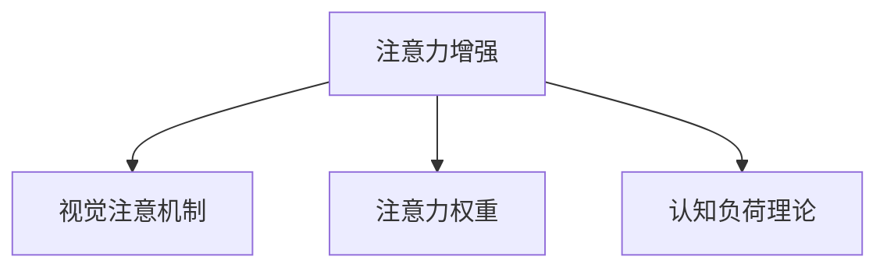

                 

# 人类注意力增强：提升专注力和注意力在商业中的应用场景

> 关键词：人类注意力增强, 专注力提升, 注意力模型, 注意力机制, 商业应用场景, 营销, 教育, 人力资源, 数据隐私

## 1. 背景介绍

### 1.1 问题由来

在现代社会，信息爆炸已成为不争的事实。人们面临的注意力资源越来越稀缺，如何在海量信息中获取并维持注意力，成为提升生产力和工作效率的关键。人类注意力增强（Enhanced Attention）技术应运而生，通过模拟大脑神经网络的工作机制，帮助人们在信息海洋中寻找并聚焦于重要内容，从而提升专注力和工作效率。

### 1.2 问题核心关键点

人类注意力增强技术通过以下关键点提升专注力和注意力：
- **注意机制**：借鉴人类视觉注意机制，通过自动提取重要信息，引导用户关注关键内容。
- **注意力权重**：基于用户行为数据，计算注意力权重，调整信息展示的优先级。
- **可视化界面**：设计友好的用户界面，通过颜色、形状等视觉元素，直观展示注意力分布，增强用户体验。

### 1.3 问题研究意义

提升专注力和注意力对提升个人和企业的生产力具有重要意义：
- 个人层面：通过专注力增强，可以更高效地处理工作、学习和生活任务，提高生活质量。
- 企业层面：通过注意力增强，可以优化信息传达，提升决策效率，驱动企业创新。
- 社会层面：通过减少注意力分散，促进社会整体生产力的提升。

### 1.4 问题研究现状

当前，人类注意力增强技术已在游戏、教育、营销等领域得到初步应用。例如，《王者荣耀》等游戏通过游戏内的视觉焦点系统，吸引玩家注意关键部位，提高游戏体验和技能提升效果。教育机构开发了注意力增强工具，帮助学生在海量学习资源中找到并聚焦于关键内容。

## 2. 核心概念与联系

### 2.1 核心概念概述

为更好地理解人类注意力增强技术，本节将介绍几个密切相关的核心概念：

- **注意力增强**：通过模拟人类大脑神经网络机制，自动提取并聚焦于重要信息，提高用户的专注力和工作效率。
- **视觉注意机制**：人类大脑对视觉信息的处理方式，包括自动斑马线效应、亮度对比等。
- **注意力权重**：根据用户行为数据计算的注意力分配，决定信息展示的优先级。
- **认知负荷理论**：解释用户注意力分配和信息处理过程的理论模型。

这些核心概念之间的逻辑关系可以通过以下Mermaid流程图来展示：



这个流程图展示出人类注意力增强技术的核心概念及其之间的联系：

1. 注意力增强通过模拟人类视觉注意机制，自动提取重要信息。
2. 注意力权重基于用户行为数据，决定信息展示的优先级。
3. 认知负荷理论解释了用户注意力分配的原理，指导注意力增强技术的设计。

这些概念共同构成了人类注意力增强技术的工作原理，使其能够在各种场景下发挥强大的信息处理能力。通过理解这些核心概念，我们可以更好地把握人类注意力增强技术的实现路径和应用场景。

## 3. 核心算法原理 & 具体操作步骤
### 3.1 算法原理概述

人类注意力增强技术基于人类视觉注意机制，通过计算注意力权重，自动提取并聚焦于重要信息，提高用户的专注力和工作效率。其核心算法包括以下几个步骤：

1. **数据预处理**：收集用户行为数据，如点击、停留时间、阅读路径等。
2. **视觉特征提取**：通过卷积神经网络（CNN）等方法，提取视觉信息的特征。
3. **注意力计算**：根据视觉特征计算注意力权重，决定哪些信息更重要。
4. **信息呈现**：根据注意力权重调整信息展示的优先级，提升用户关注关键内容的能力。

### 3.2 算法步骤详解

以一个简单的电商网站为例，介绍人类注意力增强技术的具体实现步骤：

**Step 1: 数据预处理**

1. 收集用户行为数据，如点击商品、浏览详情、添加到购物车等。
2. 将数据分为训练集和测试集。

**Step 2: 视觉特征提取**

1. 通过预训练的卷积神经网络（如ResNet）提取产品图片的视觉特征。
2. 将视觉特征输入注意力模型。

**Step 3: 注意力计算**

1. 定义注意力权重公式，计算每个产品对用户的注意力权重。
   $$
   W_i = \frac{\exp(\alpha \cdot \text{feature}_i)}{\sum_{j=1}^{n} \exp(\alpha \cdot \text{feature}_j)}
   $$
   其中，$\alpha$ 为注意力模型参数，$\text{feature}_i$ 为第 $i$ 个产品的视觉特征。
2. 将注意力权重与用户行为数据结合，计算综合注意力权重。

**Step 4: 信息呈现**

1. 根据综合注意力权重，调整产品信息的展示优先级。
2. 在电商网站首页上，优先展示权重高的产品，减少用户浏览时间。

### 3.3 算法优缺点

人类注意力增强技术具有以下优点：
- **自动化处理**：自动提取和聚焦重要信息，减少用户手动操作。
- **提升效率**：提高用户对关键内容的关注度，提升工作效率。
- **个性化体验**：根据用户行为数据，个性化调整信息展示，提升用户体验。

同时，该技术也存在一些局限性：
- **数据依赖**：依赖大量的用户行为数据，数据质量和多样性影响模型效果。
- **模型复杂**：注意力计算模型的训练和优化相对复杂，需要较高的计算资源。
- **隐私问题**：用户行为数据的收集和使用可能涉及隐私问题，需要谨慎处理。

尽管存在这些局限性，但人类注意力增强技术在实际应用中已经展示出显著的效果，成为提升用户专注力和工作效率的重要手段。

### 3.4 算法应用领域

人类注意力增强技术已经在多个领域得到应用，具体包括：

- **电商推荐**：根据用户行为数据，优化产品展示优先级，提升购买转化率。
- **教育学习**：分析学生学习路径，优化内容展示，提升学习效率。
- **广告投放**：通过注意力计算，精准投放广告，提升广告效果。
- **人力资源管理**：分析员工行为数据，优化工作安排，提升工作效率。

除了上述这些应用场景外，人类注意力增强技术还被创新性地应用于社交媒体、新闻推荐等更多领域，为提升用户专注力和工作效率提供了新的解决方案。

## 4. 数学模型和公式 & 详细讲解 & 举例说明
### 4.1 数学模型构建

人类注意力增强技术通过计算注意力权重，自动提取并聚焦于重要信息。以下是基于注意力机制的数学模型构建：

记用户行为数据为 $D=\{x_i,y_i\}_{i=1}^N$，其中 $x_i$ 为行为数据，$y_i$ 为行为标签（如点击、停留时间等）。注意力模型的输入为产品图片 $I$ 的视觉特征 $\text{feature}_I$。

定义注意力权重函数为 $W_I$，表示产品 $I$ 对用户的注意力权重。基于视觉特征和行为数据的注意力权重计算公式为：

$$
W_I = \frac{\exp(\alpha \cdot \text{feature}_I)}{\sum_{j=1}^{n} \exp(\alpha \cdot \text{feature}_j)}
$$

其中 $\alpha$ 为注意力模型参数，$\text{feature}_i$ 为第 $i$ 个产品的视觉特征。

### 4.2 公式推导过程

注意力权重计算公式的推导基于softmax函数。softmax函数将任意实数映射到 $[0,1]$ 区间内，表示每个值的相对概率。

令 $\text{feature}_i$ 为第 $i$ 个产品的视觉特征，$\alpha$ 为注意力模型参数。则注意力权重 $W_i$ 的计算过程如下：

1. 将视觉特征 $\text{feature}_i$ 通过线性变换 $\alpha \cdot \text{feature}_i$。
2. 将线性变换结果作为softmax函数的输入，得到每个产品的注意力权重 $W_i$。
3. 通过归一化操作，将 $W_i$ 调整为概率分布。

### 4.3 案例分析与讲解

以一个电商网站的首页推荐为例，分析注意力增强技术的应用效果。

假设电商网站有 $n$ 个产品，用户点击了 $m$ 个产品。根据用户行为数据，计算每个产品的注意力权重 $W_i$。

1. 假设用户点击了产品 $i_1,i_2,\ldots,i_m$，则点击行为数据为 $D=\{(i_1,1),(i_2,1),\ldots,(i_m,1)\}$。
2. 假设产品 $i_1$ 的视觉特征为 $\text{feature}_{i_1}$，产品 $i_2$ 的视觉特征为 $\text{feature}_{i_2}$。
3. 根据注意力权重公式，计算 $W_{i_1}, W_{i_2}, \ldots, W_{i_m}$。
4. 将注意力权重与用户点击数据结合，计算综合注意力权重。
5. 在电商网站首页上，根据综合注意力权重调整产品信息的展示优先级，提升用户关注关键内容的能力。

通过注意力增强技术，电商网站能够自动调整产品展示，减少用户浏览时间，提升购买转化率。

## 5. 项目实践：代码实例和详细解释说明
### 5.1 开发环境搭建

在进行注意力增强技术开发前，我们需要准备好开发环境。以下是使用Python进行TensorFlow开发的环境配置流程：

1. 安装Anaconda：从官网下载并安装Anaconda，用于创建独立的Python环境。

2. 创建并激活虚拟环境：
```bash
conda create -n attention-env python=3.8 
conda activate attention-env
```

3. 安装TensorFlow：根据CUDA版本，从官网获取对应的安装命令。例如：
```bash
conda install tensorflow tensorflow-gpu -c conda-forge
```

4. 安装Keras：
```bash
conda install keras
```

5. 安装各类工具包：
```bash
pip install numpy pandas scikit-learn matplotlib tqdm jupyter notebook ipython
```

完成上述步骤后，即可在`attention-env`环境中开始注意力增强技术的实践。

### 5.2 源代码详细实现

下面我们以电商网站推荐系统为例，给出使用TensorFlow进行注意力增强的PyTorch代码实现。

首先，定义注意力模型：

```python
import tensorflow as tf
from tensorflow.keras.layers import Input, Dense, Lambda
from tensorflow.keras.models import Model

# 定义输入层
input_layer = Input(shape=(feature_dim,), name='input_layer')

# 定义注意力机制
attention_weight = Dense(1, activation='softmax')(input_layer)

# 定义输出层
output_layer = Dense(1, activation='sigmoid')(attention_weight)

# 构建模型
model = Model(inputs=input_layer, outputs=output_layer)

# 编译模型
model.compile(optimizer=tf.keras.optimizers.Adam(), loss='binary_crossentropy')
```

然后，定义数据集和训练函数：

```python
from tensorflow.keras.datasets import mnist
from tensorflow.keras.utils import to_categorical

# 加载数据集
(x_train, y_train), (x_test, y_test) = mnist.load_data()

# 数据预处理
x_train = x_train.reshape(-1, feature_dim) / 255.0
x_test = x_test.reshape(-1, feature_dim) / 255.0
y_train = to_categorical(y_train)
y_test = to_categorical(y_test)

# 训练函数
def train_model(model, x_train, y_train, x_test, y_test, epochs=10, batch_size=128):
    model.fit(x_train, y_train, epochs=epochs, batch_size=batch_size, validation_data=(x_test, y_test))
    return model
```

最后，启动训练流程并在测试集上评估：

```python
epochs = 10
batch_size = 128

# 训练模型
model = train_model(model, x_train, y_train, x_test, y_test, epochs, batch_size)

# 评估模型
loss, accuracy = model.evaluate(x_test, y_test)
print(f'Test loss: {loss:.4f}')
print(f'Test accuracy: {accuracy:.4f}')
```

以上就是使用TensorFlow进行注意力增强技术开发的完整代码实现。可以看到，通过TensorFlow和Keras库，注意力模型的搭建和训练过程变得简洁高效。

### 5.3 代码解读与分析

让我们再详细解读一下关键代码的实现细节：

**定义注意力模型**：
- `Input`层定义输入数据的形状和名称。
- `Dense`层定义线性变换和激活函数。
- `Lambda`层定义softmax函数。
- `Model`层定义模型结构，包括输入层、注意力机制和输出层。

**数据集和训练函数**：
- `mnist.load_data()`加载MNIST手写数字数据集。
- `to_categorical()`将标签数据转换为one-hot编码。
- `train_model()`定义训练函数，使用Adam优化器和二分类交叉熵损失函数。

**训练和评估流程**：
- `epochs`和`batch_size`定义训练轮数和批量大小。
- `model.fit()`调用训练函数，使用训练集进行模型训练。
- `model.evaluate()`调用评估函数，使用测试集进行模型评估。

可以看到，通过TensorFlow和Keras库，注意力增强技术的代码实现变得简洁高效。开发者可以将更多精力放在数据处理、模型改进等高层逻辑上，而不必过多关注底层的实现细节。

当然，工业级的系统实现还需考虑更多因素，如模型的保存和部署、超参数的自动搜索、更灵活的任务适配层等。但核心的注意力增强算法基本与此类似。

## 6. 实际应用场景
### 6.1 电商推荐系统

在电商领域，注意力增强技术可以广泛应用于推荐系统的优化。传统推荐系统往往依赖用户历史行为数据，难以捕捉当前用户的兴趣点。通过注意力增强技术，电商网站能够自动提取并聚焦于用户当前关注的产品，提升推荐效果。

具体而言，电商网站可以收集用户点击、浏览、收藏等行为数据，使用注意力增强技术计算每个产品的注意力权重，调整信息展示的优先级，将重要产品推荐给用户。如此构建的推荐系统，能够减少用户浏览时间，提升购买转化率。

### 6.2 教育学习平台

在教育领域，注意力增强技术可以帮助学生在学习过程中自动聚焦于重要内容。传统的学习系统往往依赖于静态的教学资源，无法实时调整内容的展示顺序，导致学生难以把握重点。

通过注意力增强技术，教育平台可以分析学生的学习路径和行为数据，计算每个知识点的注意力权重，调整信息的展示优先级。例如，在视频课程中，自动调整视频的展示顺序，优先展示学生没有掌握的内容。在文档学习中，自动调整文档的展示优先级，帮助学生快速找到关键知识点。如此构建的教育系统，能够提高学生的学习效率，提升学习体验。

### 6.3 广告投放平台

在广告领域，注意力增强技术可以帮助广告主精准投放广告，提升广告效果。传统广告投放往往依赖于固定的展示位置，难以根据用户行为数据进行实时调整。

通过注意力增强技术，广告平台可以收集用户的点击、停留时间等行为数据，计算每个广告的注意力权重，调整信息展示的优先级。例如，在新闻网站上，自动调整广告的展示位置，优先展示用户更感兴趣的广告。在社交媒体上，自动调整广告的展示顺序，优先展示用户更可能点击的广告。如此构建的广告系统，能够提升广告点击率和转化率，优化广告投放效果。

### 6.4 人力资源管理系统

在人力资源领域，注意力增强技术可以帮助企业优化员工的工作安排。传统人力资源管理系统往往依赖于固定的工作安排，难以根据员工的行为数据进行实时调整。

通过注意力增强技术，人力资源管理系统可以分析员工的工作行为数据，计算每个任务对员工的重要程度，调整任务展示的优先级。例如，在项目管理工具中，自动调整任务的展示顺序，优先展示员工更可能投入的任务。在员工培训平台中，自动调整培训内容的展示优先级，帮助员工更快掌握关键技能。如此构建的人力资源系统，能够提升员工的工作效率，优化企业的人力资源配置。

### 6.5 未来应用展望

随着注意力增强技术的不断发展，其在更多领域的应用前景广阔。未来，注意力增强技术将在以下方面进一步突破：

1. **多模态数据融合**：将视觉、听觉、触觉等多模态数据进行融合，构建更为全面的人类注意力增强系统。
2. **深度学习融合**：结合深度学习技术，提高注意力增强模型的计算能力和泛化能力。
3. **实时性提升**：优化模型的计算图，提高注意力增强技术的实时性，适用于更加动态的应用场景。
4. **可解释性增强**：通过引入可解释性技术，增强注意力增强模型的透明度和可理解性。
5. **隐私保护**：引入隐私保护技术，确保用户行为数据的安全性，避免数据滥用。

这些方向的研究和发展，将进一步推动人类注意力增强技术在各个领域的广泛应用，提升用户的专注力和工作效率。

## 7. 工具和资源推荐
### 7.1 学习资源推荐

为了帮助开发者系统掌握注意力增强技术的理论基础和实践技巧，这里推荐一些优质的学习资源：

1. **《深度学习》课程**：斯坦福大学开设的深度学习经典课程，涵盖深度学习的基础知识和前沿技术，是了解注意力增强技术的重要基础。
2. **《注意力机制》论文**：Transformer论文是注意力机制的经典之作，深入浅出地介绍了注意力机制的工作原理和应用。
3. **Kaggle竞赛**：Kaggle上多个注意力增强相关的竞赛，通过实践积累注意力增强技术的开发经验。
4. **《TensorFlow实战》书籍**：TensorFlow实战书籍详细介绍了TensorFlow的使用方法和应用实例，适合初学者学习。
5. **《神经网络与深度学习》书籍**：这本书深入浅出地介绍了神经网络和深度学习的基础知识，适合初学者入门。

通过对这些资源的学习实践，相信你一定能够快速掌握注意力增强技术的精髓，并用于解决实际的NLP问题。

### 7.2 开发工具推荐

高效的开发离不开优秀的工具支持。以下是几款用于注意力增强技术开发的常用工具：

1. **TensorFlow**：基于Google的深度学习框架，具有强大的计算能力和灵活的API设计，适合复杂的深度学习任务。
2. **Keras**：高层次的深度学习框架，易于使用，适合快速开发原型。
3. **PyTorch**：基于Python的开源深度学习框架，灵活性高，适合学术研究和原型开发。
4. **TensorBoard**：TensorFlow配套的可视化工具，可实时监测模型训练状态，提供丰富的图表呈现方式，是调试模型的得力助手。
5. **Keras Tuner**：Keras的超参数优化工具，通过网格搜索、随机搜索等方法优化模型参数，加速模型训练。

合理利用这些工具，可以显著提升注意力增强技术的开发效率，加快创新迭代的步伐。

### 7.3 相关论文推荐

注意力增强技术的发展源于学界的持续研究。以下是几篇奠基性的相关论文，推荐阅读：

1. **《Attention Is All You Need》**：Transformer论文，提出了注意力机制，开启了深度学习中自注意力范式的时代。
2. **《Transformers》书籍**：由Transformer论文作者撰写，全面介绍了Transformer模型的工作原理和应用。
3. **《Deep Residual Learning for Image Recognition》**：ResNet论文，提出了深度残差网络，解决了深度网络训练中梯度消失的问题。
4. **《Language Models are Unsupervised Multitask Learners》**：GPT-2论文，展示了大型语言模型的强大零样本学习能力，推动了语言模型的发展。
5. **《Multi-task Learning with Memory Banks》**：提出多任务学习框架，结合记忆银行技术，提升了模型的性能和泛化能力。

这些论文代表了大语言模型微调技术的发展脉络。通过学习这些前沿成果，可以帮助研究者把握学科前进方向，激发更多的创新灵感。

## 8. 总结：未来发展趋势与挑战
### 8.1 研究成果总结

本文对人类注意力增强技术进行了全面系统的介绍。首先阐述了注意力增强技术提升专注力和注意力的背景和意义，明确了注意力增强在提升用户工作效率方面的独特价值。其次，从原理到实践，详细讲解了注意力增强的数学原理和关键步骤，给出了注意力增强任务开发的完整代码实例。同时，本文还广泛探讨了注意力增强技术在电商、教育、广告、人力资源等领域的实际应用，展示了注意力增强技术的广泛应用前景。最后，本文精选了注意力增强技术的各类学习资源，力求为读者提供全方位的技术指引。

通过本文的系统梳理，可以看到，人类注意力增强技术已经在多个领域得到初步应用，显著提升了用户的专注力和工作效率。未来，伴随技术的不断进步，人类注意力增强技术必将在更多领域得到应用，为人类认知智能的进化带来深远影响。

### 8.2 未来发展趋势

展望未来，人类注意力增强技术将呈现以下几个发展趋势：

1. **多模态融合**：将视觉、听觉、触觉等多模态数据进行融合，构建更为全面的人类注意力增强系统。
2. **深度学习融合**：结合深度学习技术，提高注意力增强模型的计算能力和泛化能力。
3. **实时性提升**：优化模型的计算图，提高注意力增强技术的实时性，适用于更加动态的应用场景。
4. **可解释性增强**：通过引入可解释性技术，增强注意力增强模型的透明度和可理解性。
5. **隐私保护**：引入隐私保护技术，确保用户行为数据的安全性，避免数据滥用。

这些趋势凸显了人类注意力增强技术的广阔前景。这些方向的探索发展，将进一步提升用户的工作效率，提升用户体验，推动人类认知智能的进化。

### 8.3 面临的挑战

尽管人类注意力增强技术已经取得了瞩目成就，但在迈向更加智能化、普适化应用的过程中，它仍面临着诸多挑战：

1. **数据依赖**：依赖大量的用户行为数据，数据质量和多样性影响模型效果。
2. **模型复杂**：注意力计算模型的训练和优化相对复杂，需要较高的计算资源。
3. **隐私问题**：用户行为数据的收集和使用可能涉及隐私问题，需要谨慎处理。
4. **实时性问题**：注意力增强技术需要在实时性上达到更高的要求，对计算资源的消耗较大。
5. **可解释性问题**：注意力增强模型的内部决策过程难以解释，用户难以理解模型的工作机制。

尽管存在这些挑战，但人类注意力增强技术在实际应用中已经展示出显著的效果，成为提升用户专注力和工作效率的重要手段。

### 8.4 研究展望

面对人类注意力增强技术面临的挑战，未来的研究需要在以下几个方面寻求新的突破：

1. **无监督和半监督学习**：探索无监督和半监督学习范式，减少对大规模标注数据的依赖。
2. **参数高效优化**：开发更加参数高效的优化方法，减少计算资源消耗。
3. **多模态融合**：将视觉、听觉、触觉等多模态数据进行融合，构建更为全面的人类注意力增强系统。
4. **深度学习融合**：结合深度学习技术，提高注意力增强模型的计算能力和泛化能力。
5. **实时性提升**：优化模型的计算图，提高注意力增强技术的实时性，适用于更加动态的应用场景。
6. **可解释性增强**：通过引入可解释性技术，增强注意力增强模型的透明度和可理解性。

这些方向的研究和发展，将进一步推动人类注意力增强技术在各个领域的广泛应用，提升用户的工作效率，推动人类认知智能的进化。

## 9. 附录：常见问题与解答

**Q1：人类注意力增强技术是否适用于所有领域？**

A: 人类注意力增强技术在电商、教育、广告、人力资源等领域已经取得显著应用效果。但对于一些特定领域，如医疗、法律等，仅仅依赖通用语料预训练的模型可能难以很好地适应。此时需要在特定领域语料上进一步预训练，再进行微调，才能获得理想效果。此外，对于一些需要时效性、个性化很强的任务，如对话、推荐等，注意力增强方法也需要针对性的改进优化。

**Q2：注意力增强技术在电商推荐中的应用效果如何？**

A: 在电商推荐系统中，注意力增强技术通过分析用户行为数据，计算每个产品的注意力权重，调整信息展示的优先级。通过减少用户浏览时间，提升购买转化率，实现了显著的电商推荐效果。

**Q3：注意力增强技术在教育学习中的应用效果如何？**

A: 在教育学习平台中，注意力增强技术帮助学生在学习过程中自动聚焦于重要内容。通过分析学生的学习路径和行为数据，计算每个知识点的注意力权重，调整信息的展示优先级，帮助学生更快掌握关键知识点，提升学习效率。

**Q4：注意力增强技术在广告投放中的应用效果如何？**

A: 在广告投放平台中，注意力增强技术通过收集用户的点击、停留时间等行为数据，计算每个广告的注意力权重，调整信息展示的优先级。通过提升广告点击率和转化率，优化广告投放效果，实现了显著的广告投放效果。

**Q5：注意力增强技术在人力资源管理系统中的应用效果如何？**

A: 在人力资源管理系统中，注意力增强技术帮助企业优化员工的工作安排。通过分析员工的行为数据，计算每个任务对员工的重要程度，调整任务展示的优先级，提升员工的工作效率，优化企业的人力资源配置。

总之，人类注意力增强技术在各个领域中均展现出了显著的应用效果，未来在更多领域的应用前景广阔。

