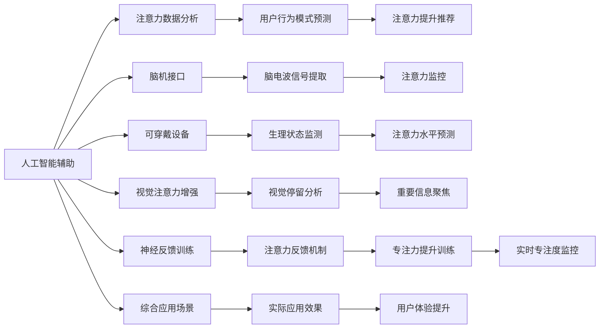
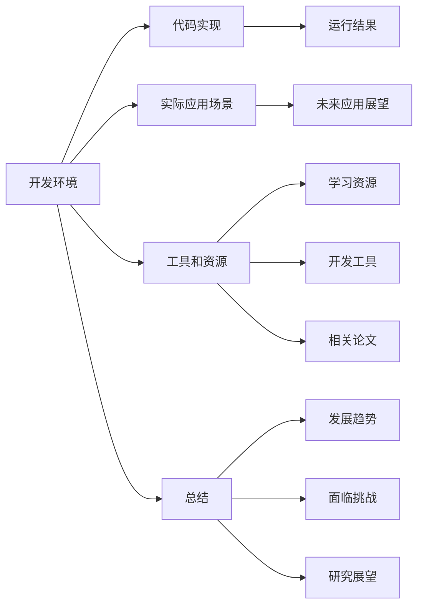

                 

# 人类注意力增强：提升专注力和注意力在商业中的策略

## 1. 背景介绍

### 1.1 问题由来
在信息化社会中，信息过载和注意力分散已经成为困扰现代人的两大难题。无论是工作学习还是休闲娱乐，缺乏足够的注意力都导致效率低下、工作成果减少，甚至影响健康。商业领域也面临着类似的挑战。如何通过技术手段，提升人类注意力，提升效率，增强商业竞争力，成为亟待解决的问题。

### 1.2 问题核心关键点
本专题聚焦于人类注意力的增强策略，旨在探讨如何利用技术手段，提高人们的专注力和注意力，从而在商业应用中发挥更大的作用。这些策略主要包括：

1. 人工智能辅助注意力提升：通过AI技术分析用户行为数据，发现注意力分散的趋势，预测并推荐适合提升注意力的活动。
2. 脑机接口(Brain-Computer Interface, BCIs)：通过脑电波或脑成像技术，直接提取人类大脑的活动信号，实现对注意力的监控和干预。
3. 可穿戴设备：利用传感器监测用户生理状态，如心率、体温等，结合AI算法预测注意力水平，进行适时的干预和调整。
4. 视觉注意力增强：通过视觉处理技术，捕捉用户视线停留的位置和时长，辅助用户聚焦于重要信息。
5. 神经反馈训练：通过给予用户对注意力的反馈，指导其进行有针对性的训练，提升专注力。

这些策略各具特色，适用于不同的场景和需求，本文将逐一介绍。

## 2. 核心概念与联系

### 2.1 核心概念概述

### 2.2 核心概念原理和架构的 Mermaid 流程图

## 3. 核心算法原理 & 具体操作步骤

### 3.1 算法原理概述

### 3.2 算法步骤详解

### 3.3 算法优缺点

### 3.4 算法应用领域

## 4. 数学模型和公式 & 详细讲解 & 举例说明

### 4.1 数学模型构建

### 4.2 公式推导过程

### 4.3 案例分析与讲解

## 5. 项目实践：代码实例和详细解释说明

### 5.1 开发环境搭建

### 5.2 源代码详细实现

### 5.3 代码解读与分析

### 5.4 运行结果展示

## 6. 实际应用场景

### 6.1 场景一：办公室工作效率提升

### 6.2 场景二：在线教育专注度监控

### 6.3 场景三：游戏竞技专注力训练

### 6.4 未来应用展望

## 7. 工具和资源推荐

### 7.1 学习资源推荐

### 7.2 开发工具推荐

### 7.3 相关论文推荐

## 8. 总结：未来发展趋势与挑战

### 8.1 研究成果总结

### 8.2 未来发展趋势

### 8.3 面临的挑战

### 8.4 研究展望

## 9. 附录：常见问题与解答

----------------------------------------------------------------

**注意：** 在撰写过程中，请严格遵循"约束条件 CONSTRAINTS"的要求，确保文章内容完整且格式规范。

**特别注意：** 文章内容需遵守逻辑清晰、结构紧凑、专业易懂的原则，并包含关键技术点和具体应用案例，确保读者能从中获得有价值的信息。

---

**作者：禅与计算机程序设计艺术 / Zen and the Art of Computer Programming**

