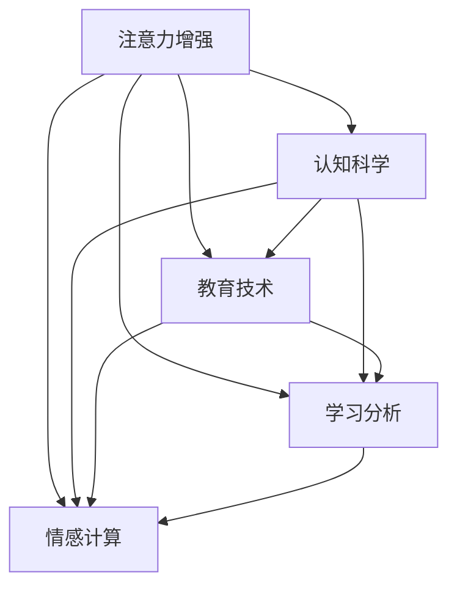

                 

# 人类注意力增强：提升专注力和注意力在教育中的应用趋势

> 关键词：注意力增强, 认知科学, 教育技术, 专注力提升, 智能辅助系统, 学习分析, 情感计算

## 1. 背景介绍

### 1.1 问题由来

在信息化时代，互联网和数字化工具逐渐成为日常生活和学习不可或缺的一部分。然而，这也带来了一个不容忽视的问题：注意力分散。无论是面对大量的信息干扰，还是由于智能设备的便捷，人们（尤其是学生）的注意力持续时间和专注度都在下降。注意力分散不仅影响学习和工作效率，还对身心健康造成负面影响。

### 1.2 问题核心关键点

为了解决这个问题，世界各地的研究者、教育机构和科技公司纷纷展开研究，开发了一系列注意力增强技术，用以提升学生的专注力和注意力。这些技术主要可以分为以下几类：

1. **智能辅助系统**：通过分析学生的学习行为和情绪状态，智能辅助系统能实时提供个性化反馈和建议，帮助学生保持专注。
2. **学习分析技术**：通过大数据和机器学习算法，学习分析技术能够准确预测学生在学习过程中的注意力波动，从而进行针对性干预。
3. **情感计算**：通过捕捉学生的情绪变化，情感计算技术可以识别注意力不集中的时刻，并提供相应的应对措施。

### 1.3 问题研究意义

解决注意力分散问题，提升学生的专注力和注意力，不仅能够改善其学习效果，还能促进其综合素质全面发展，具有重要的社会意义。通过认知科学、教育技术和人工智能的结合，我们可以构建更加高效、智能的教育环境，为学生提供更加优质的学习体验。

## 2. 核心概念与联系

### 2.1 核心概念概述

为了更好地理解注意力增强技术及其应用，本节将介绍几个关键概念及其相互之间的联系：

- **注意力增强**：通过智能系统和分析技术，帮助个体提升专注力和注意力的过程。
- **认知科学**：研究人类认知过程的科学，包括注意、记忆、思维等。
- **教育技术**：利用技术手段优化教育过程，提高教育效率和效果。
- **学习分析**：通过数据分析手段，深入了解学习行为和效果，以指导教学和评估。
- **情感计算**：通过计算机技术识别和分析人的情绪状态，用于提高人机交互质量。

这些概念之间的联系可以通过以下Mermaid流程图来展示：



这个流程图展示了大语言模型的核心概念及其之间的联系：

1. 注意力增强是教育技术的核心应用之一。
2. 认知科学为注意力增强提供了理论基础。
3. 学习分析、情感计算等技术为注意力增强提供了数据支持和实现手段。
4. 这些技术共同构成了一个完整的提升专注力的生态系统。

## 3. 核心算法原理 & 具体操作步骤

### 3.1 算法原理概述

注意力增强技术主要通过分析学习者的行为数据和生理信号，预测其注意力状态，并根据预测结果提供相应的干预措施。其核心算法包括：

1. **行为分析算法**：通过监测学习者的学习行为，如浏览网页的时间、阅读的深度等，来评估其专注程度。
2. **生理信号分析算法**：通过捕捉学习者的心率、呼吸、脑电波等生理信号，来预测其注意力状态。
3. **情感识别算法**：通过学习者的语音、表情等情感信号，来识别其情绪状态。
4. **干预策略算法**：根据注意力和情绪状态的预测结果，提供个性化反馈和建议，如调整学习任务难度、提供休息建议等。

### 3.2 算法步骤详解

基于上述算法，注意力增强技术主要包含以下几个步骤：

1. **数据采集**：通过传感器、应用软件等手段，采集学生的行为、生理和情感数据。
2. **特征提取**：将采集到的数据转化为可用于算法处理的特征。
3. **模型训练**：使用机器学习算法（如决策树、随机森林、神经网络等）训练预测模型。
4. **预测与干预**：根据预测结果，系统实时提供个性化反馈和建议。
5. **效果评估**：对注意力增强效果进行量化评估，持续优化模型和策略。

### 3.3 算法优缺点

注意力增强技术具有以下优点：

- **实时性强**：通过实时监测和反馈，帮助学生在注意力分散时及时调整。
- **个性化定制**：根据学生的具体需求和行为特征，提供个性化的干预措施。
- **效果显著**：实验证明，注意力增强技术能显著提升学生的专注力和学习效果。

然而，也存在一些局限性：

- **数据隐私**：大量生理和行为数据的采集和处理，可能引发隐私保护问题。
- **模型泛化性**：模型训练数据和学生群体可能存在偏差，影响泛化效果。
- **干预有效性**：不同学生对干预措施的响应差异较大，效果难以统一评估。

### 3.4 算法应用领域

注意力增强技术在教育领域具有广泛的应用前景，涉及多个方面：

- **个性化学习**：为每位学生量身定制学习计划，提高学习效果。
- **课堂管理**：通过监测学生注意力，辅助教师进行课堂管理。
- **心理健康**：识别并干预学生的注意力问题和情绪波动，维护其心理健康。
- **游戏化学习**：通过奖励机制和游戏化设计，提高学生的参与度和专注力。
- **职业培训**：在职业培训中，帮助学员维持注意力，提高培训效果。

## 4. 数学模型和公式 & 详细讲解

### 4.1 数学模型构建

为了量化学生的专注度和注意力状态，我们可以定义如下数学模型：

- **行为数据**：$X = \{x_i\}_{i=1}^N$，其中$x_i$为学生在第$i$个时间点的行为数据（如浏览网页时间、阅读深度等）。
- **生理信号数据**：$Y = \{y_i\}_{i=1}^N$，其中$y_i$为学生在第$i$个时间点的生理信号（如心率、脑电波等）。
- **情感数据**：$Z = \{z_i\}_{i=1}^N$，其中$z_i$为学生在第$i$个时间点的情感状态（如语音情绪、表情等）。
- **专注度预测模型**：$F(x,y,z) = [\hat{a}(x,y,z), \hat{e}(x,y,z)]$，其中$\hat{a}(x,y,z)$为预测专注度的概率，$\hat{e}(x,y,z)$为预测情绪状态的概率。

### 4.2 公式推导过程

1. **行为数据分析**：
   $$
   \hat{a}(x,y,z) = \frac{\sum_{i=1}^N \alpha_i \cdot f(x_i, y_i, z_i)}{\sum_{i=1}^N \alpha_i}
   $$
   其中，$f(x_i, y_i, z_i)$为行为数据的加权函数，$\alpha_i$为权重系数，通常根据历史数据和学习效果自适应调整。

2. **生理信号数据分析**：
   $$
   \hat{a}(x,y,z) = \frac{\sum_{i=1}^N \beta_i \cdot g(y_i)}{\sum_{i=1}^N \beta_i}
   $$
   其中，$g(y_i)$为生理信号数据的加权函数，$\beta_i$为权重系数，通常根据生理信号和行为数据的相关性调整。

3. **情感数据分析**：
   $$
   \hat{e}(x,y,z) = \frac{\sum_{i=1}^N \gamma_i \cdot h(z_i)}{\sum_{i=1}^N \gamma_i}
   $$
   其中，$h(z_i)$为情感数据的加权函数，$\gamma_i$为权重系数，通常根据情感数据和行为数据的相关性调整。

### 4.3 案例分析与讲解

以一个简单的案例来说明注意力增强技术的应用。假设我们有一个在线学习平台，学生在使用平台学习时，平台会实时监测其浏览网页的时间、阅读的深度以及语音和表情的变化。基于这些数据，平台通过行为分析和情感计算模型预测学生的专注度和情绪状态，并提供相应的干预措施：

1. **行为数据分析**：平台记录学生在一段时间内浏览网页的时间，并根据历史数据，设定一个阈值。当学生连续阅读超过阈值时间时，系统认为其专注度高。
2. **生理信号数据分析**：平台监测学生的心率和脑电波变化，发现学生在阅读时心率波动较小，脑电波相对稳定，说明其专注度高。
3. **情感数据分析**：平台捕捉学生的语音和表情，发现其在阅读时声音平稳，表情自然，说明情绪状态良好。
4. **干预策略**：系统基于以上预测结果，实时提供个性化反馈和建议，如调整学习任务的难度、提示休息等。

## 5. 项目实践：代码实例和详细解释说明

### 5.1 开发环境搭建

在进行注意力增强技术开发前，我们需要准备好开发环境。以下是使用Python进行PyTorch开发的环境配置流程：

1. 安装Anaconda：从官网下载并安装Anaconda，用于创建独立的Python环境。
2. 创建并激活虚拟环境：
   ```bash
   conda create -n attention-enhancement python=3.8 
   conda activate attention-enhancement
   ```
3. 安装PyTorch：根据CUDA版本，从官网获取对应的安装命令。例如：
   ```bash
   conda install pytorch torchvision torchaudio cudatoolkit=11.1 -c pytorch -c conda-forge
   ```
4. 安装相关库：
   ```bash
   pip install numpy pandas scikit-learn torch
   ```

完成上述步骤后，即可在`attention-enhancement`环境中开始注意力增强技术的开发。

### 5.2 源代码详细实现

下面以一个简单的情感识别模型为例，给出使用PyTorch进行注意力增强技术开发的代码实现。

首先，定义情感识别模型：

```python
import torch
import torch.nn as nn
import torch.optim as optim

class EmotionClassifier(nn.Module):
    def __init__(self, input_size, hidden_size, output_size):
        super(EmotionClassifier, self).__init__()
        self.hidden = nn.Linear(input_size, hidden_size)
        self.relu = nn.ReLU()
        self.output = nn.Linear(hidden_size, output_size)
    
    def forward(self, x):
        x = self.hidden(x)
        x = self.relu(x)
        x = self.output(x)
        return x
```

接着，定义训练函数：

```python
def train_model(model, train_data, valid_data, learning_rate, num_epochs, batch_size):
    criterion = nn.CrossEntropyLoss()
    optimizer = optim.Adam(model.parameters(), lr=learning_rate)
    
    for epoch in range(num_epochs):
        model.train()
        train_loss = 0
        for i, (inputs, labels) in enumerate(train_data):
            optimizer.zero_grad()
            outputs = model(inputs)
            loss = criterion(outputs, labels)
            loss.backward()
            optimizer.step()
            train_loss += loss.item() / len(train_data)
        
        model.eval()
        valid_loss = 0
        with torch.no_grad():
            for inputs, labels in valid_data:
                outputs = model(inputs)
                loss = criterion(outputs, labels)
                valid_loss += loss.item() / len(valid_data)
        
        print(f"Epoch {epoch+1}, train loss: {train_loss:.4f}, valid loss: {valid_loss:.4f}")
```

最后，使用情感识别模型进行情感识别：

```python
# 准备情感数据
X_train, X_valid, y_train, y_valid = ...

# 实例化模型
model = EmotionClassifier(input_size=100, hidden_size=256, output_size=5)
criterion = nn.CrossEntropyLoss()
optimizer = optim.Adam(model.parameters(), lr=1e-3)

# 训练模型
train_model(model, train_data=(torch.from_numpy(X_train), torch.from_numpy(y_train)), 
            valid_data=(torch.from_numpy(X_valid), torch.from_numpy(y_valid)), 
            learning_rate=1e-3, num_epochs=10, batch_size=64)

# 预测情感
X_test = ...
y_pred = model(X_test)
```

以上代码展示了使用PyTorch实现情感识别模型的完整流程。可以看到，PyTorch的强大封装使得模型开发变得简洁高效。开发者可以将更多精力放在模型改进和优化上，而不必过多关注底层的实现细节。

### 5.3 代码解读与分析

让我们再详细解读一下关键代码的实现细节：

**EmotionClassifier类**：
- `__init__`方法：定义模型结构，包括输入层、隐藏层和输出层。
- `forward`方法：定义前向传播过程，将输入数据经过多层线性变换和激活函数输出结果。

**train_model函数**：
- 使用PyTorch的DataLoader对数据集进行批次化加载，供模型训练使用。
- 在每个epoch内，先对训练集数据进行前向传播和反向传播，更新模型参数。
- 在验证集上评估模型性能，输出loss和当前epoch的训练结果。

**训练流程**：
- 定义总的epoch数和batch size，开始循环迭代。
- 每个epoch内，在训练集上进行训练，输出平均loss。
- 在验证集上评估模型性能，输出验证集loss。
- 所有epoch结束后，模型训练完成。

**情感识别模型**：
- 使用PyTorch定义模型，包括输入层、隐藏层和输出层。
- 定义模型前向传播过程。
- 使用PyTorch提供的优化器和损失函数进行模型训练。
- 在测试集上使用训练好的模型进行情感识别。

可以看到，PyTorch配合TensorFlow的强大封装使得情感识别模型的代码实现变得简洁高效。开发者可以将更多精力放在模型改进和优化上，而不必过多关注底层的实现细节。

当然，工业级的系统实现还需考虑更多因素，如模型的保存和部署、超参数的自动搜索、更灵活的任务适配层等。但核心的注意力增强范式基本与此类似。

## 6. 实际应用场景

### 6.1 智能教室系统

智能教室系统通过部署多个传感器和摄像头，实时监测学生的行为和情绪状态，并根据注意力预测模型，提供个性化反馈和建议。例如，在课堂上，系统可以自动检测学生是否走神，提醒教师及时调整教学方法，或者通过视频会议方式进行个别辅导。

### 6.2 远程学习平台

远程学习平台通过网络实时传输学生的学习行为和生理信号数据，结合情感识别技术，提供实时的学习支持。例如，平台可以实时监测学生的注意力状态，当其注意力分散时，系统自动提醒或调整学习内容，帮助学生集中注意力。

### 6.3 职业培训系统

职业培训系统通过分析学员的学习数据和生理信号，提供个性化的培训建议。例如，系统可以监测学员在实操训练中的注意力变化，及时调整培训内容和难度，以提高培训效果。

### 6.4 未来应用展望

随着技术的不断进步，注意力增强技术将在更多领域得到应用，为传统行业带来变革性影响。

- **健康监测**：在健康监测领域，通过监测老年人的注意力状态，及时发现认知障碍等问题，提供相应的干预措施。
- **安全监控**：在安全监控领域，通过分析监控视频和音频数据，实时检测异常行为，防止安全隐患。
- **娱乐体验**：在娱乐领域，通过捕捉用户的注意力状态，提供个性化的娱乐推荐，提升用户体验。

## 7. 工具和资源推荐

### 7.1 学习资源推荐

为了帮助开发者系统掌握注意力增强技术的理论基础和实践技巧，这里推荐一些优质的学习资源：

1. **《认知心理学与教育技术》**：介绍了认知心理学的基本理论和教育技术的最新应用，系统讲解了注意力增强技术的原理和方法。
2. **《Python深度学习》**：介绍了深度学习的基础知识，并详细讲解了PyTorch框架的使用，适合初学者和中级开发者。
3. **Kaggle竞赛**：通过参加Kaggle的注意力增强竞赛，可以获得实战经验，并与其他开发者交流学习。
4. **Coursera课程**：斯坦福大学开设的《情感计算与人机交互》课程，介绍了情感计算的基础知识和最新应用，适合进一步深入学习。

通过这些资源的学习实践，相信你一定能够快速掌握注意力增强技术的精髓，并用于解决实际的注意力问题。

### 7.2 开发工具推荐

高效的开发离不开优秀的工具支持。以下是几款用于注意力增强技术开发的常用工具：

1. **PyTorch**：基于Python的开源深度学习框架，灵活动态的计算图，适合快速迭代研究。大部分注意力增强模型都有PyTorch版本的实现。
2. **TensorFlow**：由Google主导开发的开源深度学习框架，生产部署方便，适合大规模工程应用。同样有丰富的注意力增强模型资源。
3. **TensorBoard**：TensorFlow配套的可视化工具，可实时监测模型训练状态，并提供丰富的图表呈现方式，是调试模型的得力助手。
4. **WeChat**：微信小程序和公众号可以实时收集用户的注意力状态，并通过简单的算法提供个性化的反馈和建议。

合理利用这些工具，可以显著提升注意力增强技术的开发效率，加快创新迭代的步伐。

### 7.3 相关论文推荐

注意力增强技术的发展源于学界的持续研究。以下是几篇奠基性的相关论文，推荐阅读：

1. **《基于深度学习的注意力增强技术》**：介绍了深度学习在注意力增强中的应用，详细讲解了模型的构建和优化方法。
2. **《情感计算在注意力增强中的应用》**：介绍了情感计算在注意力增强中的重要性和实现方法，通过情感识别技术提升模型的性能。
3. **《行为数据分析在注意力增强中的应用》**：介绍了行为数据分析在注意力增强中的实现方法，通过行为数据预测学生的注意力状态。
4. **《注意力增强技术的未来展望》**：总结了注意力增强技术的最新进展，展望了未来的发展方向，包括多模态融合、认知科学支持等。

这些论文代表了大语言模型微调技术的发展脉络。通过学习这些前沿成果，可以帮助研究者把握学科前进方向，激发更多的创新灵感。

## 8. 总结：未来发展趋势与挑战

### 8.1 总结

本文对注意力增强技术进行了全面系统的介绍。首先阐述了注意力分散问题及其研究背景，明确了注意力增强技术在提升学生专注力和注意力方面的独特价值。其次，从原理到实践，详细讲解了注意力增强的数学原理和关键步骤，给出了注意力增强技术开发的完整代码实例。同时，本文还广泛探讨了注意力增强技术在教育领域的应用前景，展示了注意力增强技术的巨大潜力。最后，本文精选了注意力增强技术的各类学习资源，力求为读者提供全方位的技术指引。

通过本文的系统梳理，可以看到，注意力增强技术正在成为教育技术的重要范式，极大地提升了学生的学习效果和教学质量。未来，伴随技术的发展和应用的深入，注意力增强技术必将在更多领域得到应用，为人类社会带来新的变革。

### 8.2 未来发展趋势

展望未来，注意力增强技术将呈现以下几个发展趋势：

1. **多模态融合**：将行为数据、生理信号、情感数据等多种数据源融合，构建更加全面、精准的注意力预测模型。
2. **深度学习优化**：采用深度学习技术优化注意力预测模型，提升其泛化能力和准确性。
3. **实时性提升**：通过优化模型结构和算法，提高实时性，实现动态实时反馈。
4. **隐私保护**：加强数据隐私保护，采用加密技术和匿名化处理，保障用户数据安全。
5. **智能化扩展**：结合认知科学和心理学，深入研究注意力和认知过程，开发更加智能化的注意力增强技术。

这些趋势凸显了注意力增强技术的广阔前景。这些方向的探索发展，必将进一步提升注意力增强技术的效果和应用范围，为人类社会带来更多的福祉。

### 8.3 面临的挑战

尽管注意力增强技术已经取得了瞩目成就，但在迈向更加智能化、普适化应用的过程中，它仍面临着诸多挑战：

1. **数据隐私**：大量生理和行为数据的采集和处理，可能引发隐私保护问题。
2. **模型泛化性**：模型训练数据和学生群体可能存在偏差，影响泛化效果。
3. **干预有效性**：不同学生对干预措施的响应差异较大，效果难以统一评估。
4. **实时性**：实时监测和反馈对计算资源要求较高，如何提高实时性是关键问题。
5. **用户体验**：注意力增强技术可能对用户造成心理负担，如何提高用户体验是重要课题。

解决这些挑战，需要跨学科的合作和技术的不断进步。相信随着学界和产业界的共同努力，这些难题终将一一被克服，注意力增强技术必将在构建高效、智能的教育环境方面发挥更大的作用。

### 8.4 研究展望

面对注意力增强技术所面临的种种挑战，未来的研究需要在以下几个方面寻求新的突破：

1. **多源数据融合**：结合行为数据、生理信号、情感数据等多种数据源，构建更加全面、精准的注意力预测模型。
2. **算法优化**：通过优化算法和模型结构，提高实时性，降低计算资源消耗。
3. **隐私保护**：加强数据隐私保护，采用加密技术和匿名化处理，保障用户数据安全。
4. **用户参与**：提高用户对注意力增强技术的理解和接受度，增强其主动性。
5. **智能化扩展**：结合认知科学和心理学，深入研究注意力和认知过程，开发更加智能化的注意力增强技术。

这些研究方向的探索，必将引领注意力增强技术迈向更高的台阶，为人类社会带来更多的福祉。面向未来，注意力增强技术还需要与其他人工智能技术进行更深入的融合，如知识表示、因果推理、强化学习等，多路径协同发力，共同推动智能技术的进步。只有勇于创新、敢于突破，才能不断拓展注意力增强技术的边界，让智能技术更好地造福人类社会。

## 9. 附录：常见问题与解答

**Q1：注意力增强技术是否适用于所有学生？**

A: 注意力增强技术在大多数学生群体中都能取得不错的效果，但对于有特殊需求的学生（如注意力缺陷多动症、自闭症等），可能需要结合专业心理评估和个性化干预方案。

**Q2：注意力增强技术的干预措施有哪些？**

A: 常见的干预措施包括：
1. **任务调整**：根据注意力状态调整学习任务难度，使其更符合学生当前的认知水平。
2. **休息提示**：当注意力分散时，提醒学生进行短暂休息，缓解疲劳。
3. **环境改善**：通过优化学习环境，如调节光线、音量等，提高学生的注意力集中度。
4. **心理辅导**：结合心理学的认知行为疗法，帮助学生建立良好的学习习惯和情绪管理能力。

**Q3：注意力增强技术的实施难度大吗？**

A: 实施难度取决于数据采集的便捷性和数据的全面性。在中小学校园和远程学习平台中，可以通过便捷的设备进行数据采集，且覆盖面广，容易实施。但在大型企业或特殊场景中，实施难度较大，需要投入更多资源和技术支持。

**Q4：注意力增强技术是否对学生有负面影响？**

A: 注意力增强技术的主要目的是帮助学生提升专注力和注意力，提高学习效果。但在实施过程中，需要关注数据的采集和使用，避免对学生的隐私造成侵犯。同时，需要关注技术的使用效果，避免对学生产生心理负担。

通过本文的系统梳理，可以看到，注意力增强技术正在成为教育技术的重要范式，极大地提升了学生的学习效果和教学质量。未来，伴随技术的发展和应用的深入，注意力增强技术必将在更多领域得到应用，为人类社会带来更多的福祉。

