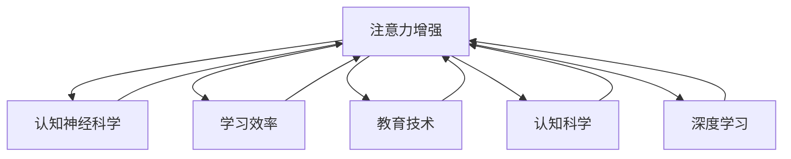

                 

# 人类注意力增强：提升专注力和注意力在教育中的未来发展

> 关键词：注意力增强, 认知神经科学, 学习效率, 教育技术, 认知科学, 深度学习

## 1. 背景介绍

### 1.1 问题由来
在数字化时代，教育系统面临着诸多挑战。传统教室教学方式难以满足个性化、互动化、智能化的教育需求。而通过技术手段提升学生的专注力和学习效率，成为教育改革的重要方向。特别是在当前疫情背景下，在线教育的普及更加凸显了提升学生注意力和学习投入的重要性。

### 1.2 问题核心关键点
1. 目前，学生在接受传统教学过程中，注意力分散、学习效率低下，难以适应快速变化的知识体系。
2. 如何通过技术手段，科学地提升学生的专注力和注意力，以适应在线教育环境下的新需求。
3. 注意力增强技术的开发和应用，如何与教育心理学的研究成果相结合，提供更加科学、有效的解决方案。
4. 注意力增强技术在教育领域的应用前景，如何推动教育技术的迭代和革新。

### 1.3 问题研究意义
研究注意力增强技术在教育中的应用，对于提升学生学习效果、推动教育模式改革、促进教育公平具有重要意义：

1. 提高学习效率。通过技术手段提升学生注意力，可以显著提升学习效率，减少学习时间，提高学业成绩。
2. 适应在线教育。在线教育环境下，注意力增强技术可以帮助学生更好地适应在线学习，提升互动性和参与感。
3. 促进个性化学习。注意力增强技术可以根据学生的注意力状态，提供个性化的学习路径和资源，实现因材施教。
4. 推动教育技术革新。通过应用注意力增强技术，教育技术将朝着更加智能化、个性化、互动化的方向发展。
5. 保障教育公平。注意力增强技术可以为偏远地区和特殊需求的学生提供公平的优质教育资源。

## 2. 核心概念与联系

### 2.1 核心概念概述

为更好地理解注意力增强技术在教育中的应用，本节将介绍几个关键概念：

- 注意力(Attention)：在认知心理学中，注意力指个体在处理外界信息时，对特定信息的优先选择和聚焦。学习过程中，注意力是信息加工和记忆的关键因素。
- 认知神经科学(Cognitive Neuroscience)：研究注意力等认知过程的神经机制和心理机制的学科，是注意力增强技术的重要理论基础。
- 学习效率(Learning Efficiency)：指个体在单位时间内掌握知识的数量和质量，是衡量学习效果的重要指标。
- 教育技术(Education Technology)：利用信息技术提升教育效果、改善教育体验的技术手段，是注意力增强技术的主要应用场景。
- 认知科学(Cognitive Science)：研究人类认知过程、认知行为和认知机制的学科，是注意力增强技术的重要理论来源。
- 深度学习(Deep Learning)：通过多层神经网络模拟人类认知过程的技术，是实现注意力增强技术的重要工具。

这些核心概念之间的逻辑关系可以通过以下Mermaid流程图来展示：



这个流程图展示了几大核心概念及其之间的关系：

1. 注意力增强技术基于认知神经科学和认知科学的研究成果，结合深度学习技术实现。
2. 深度学习技术为注意力增强提供了具体的实现手段，在教育技术应用中提升学习效率。
3. 教育技术为注意力增强提供了一个重要的应用场景，通过提高学生的注意力和学习投入，促进教育公平和个性化学习。

## 3. 核心算法原理 & 具体操作步骤
### 3.1 算法原理概述

注意力增强技术通过识别学生的注意力状态，并提供相应的干预措施，提升学生的学习效果。其核心思想是：

1. 通过科学的手段，实时监测和量化学生的注意力水平。
2. 基于认知神经科学的理论，分析注意力与学习效果的关系。
3. 通过深度学习模型，预测注意力状态，提供个性化的学习建议和资源。
4. 实时反馈注意力状态，调整学习策略，提升学习效果。

### 3.2 算法步骤详解

注意力增强技术在教育中的应用，主要包括以下几个关键步骤：

**Step 1: 数据采集与预处理**
- 通过摄像头、鼠标、传感器等设备，实时采集学生的生理数据（如心率、眼球追踪、面部表情等）和行为数据（如点击次数、滚动速度、在线时间等）。
- 对采集到的数据进行预处理，如去噪、归一化、特征提取等，以供深度学习模型使用。

**Step 2: 模型训练与优化**
- 构建深度学习模型（如卷积神经网络CNN、循环神经网络RNN、注意力机制等），使用标记好的注意力数据进行训练。
- 根据注意力状态与学习效果之间的关系，设计合适的损失函数，进行模型优化。
- 使用正则化技术（如L2正则、Dropout等）防止过拟合，提高模型泛化能力。

**Step 3: 实时监测与干预**
- 在教育系统中集成深度学习模型，实时监测学生的注意力状态。
- 根据注意力状态，提供个性化的学习建议（如提醒休息、调整教学内容、推荐相关资源等）。
- 调整学习策略，如调整学习内容、调整学习速度等，提升学习效果。

**Step 4: 反馈与调整**
- 实时记录学生的学习效果（如成绩、答题正确率、学习进度等）。
- 根据学习效果，反馈注意力状态调整策略的效果，进一步优化模型。
- 循环调整，不断提升学生的学习效果和注意力状态。

### 3.3 算法优缺点

注意力增强技术在教育中的应用，具有以下优点：

1. 科学依据：基于认知神经科学和认知科学的研究成果，有理论支撑。
2. 实时反馈：通过深度学习模型，实时监测和调整学生的注意力状态，提升学习效果。
3. 个性化学习：能够根据学生的注意力状态，提供个性化的学习建议和资源，实现因材施教。
4. 数据驱动：通过采集大量数据，发现注意力与学习效果之间的规律，提供科学指导。

同时，该技术也存在一定的局限性：

1. 数据隐私：实时监测学生注意力状态涉及大量个人信息，数据隐私保护是一大挑战。
2. 模型复杂度：深度学习模型复杂度高，训练和部署成本较高。
3. 环境适应性：不同的学习场景和任务对注意力状态的影响不同，模型需不断优化和调整。
4. 用户接受度：学生和教师对新技术的接受和配合程度，会直接影响技术的应用效果。
5. 成本问题：注意力增强技术的实现和应用需要较高的技术投入，可能难以普及。

尽管存在这些局限性，但注意力增强技术仍为提升学习效果和教育公平提供了新的方向，值得深入研究和探索。

### 3.4 算法应用领域

注意力增强技术在教育中的应用，主要涵盖以下几个领域：

1. 在线教育：通过实时监测学生的注意力状态，提升在线学习的效果和体验。
2. 课堂教学：在传统课堂教学中，通过实时反馈注意力状态，调整教学策略，提高教学效果。
3. 个性化学习：根据学生的注意力状态，提供个性化的学习资源和建议，实现因材施教。
4. 心理健康：通过监测学生的注意力状态，早期识别和干预注意力缺陷，促进心理健康。
5. 职业培训：在职业培训场景中，通过提升学生的注意力和专注力，提高培训效果。
6. 家庭教育：通过实时监测和干预，提升家庭教育和亲子互动的效果。

这些应用场景展示了注意力增强技术的广泛适用性，为提升教育质量和效率提供了新的可能性。

## 4. 数学模型和公式 & 详细讲解 & 举例说明

### 4.1 数学模型构建

注意力增强技术在教育中的应用，需要构建一个科学的量化模型，用于实时监测和分析学生的注意力状态。

记注意力状态为 $\alpha \in [0,1]$，其中 $1$ 表示完全专注，$0$ 表示完全不专注。模型的目标是最小化注意力状态与学习效果 $y$ 之间的差距。

假设注意力状态与学习效果之间存在线性关系，可以使用线性回归模型进行建模。设 $X = (x_1, x_2, ..., x_n)$ 为注意力监测到的生理和行为特征向量，模型可以表示为：

$$
y = \beta_0 + \beta_1 x_1 + \beta_2 x_2 + ... + \beta_n x_n + \epsilon
$$

其中 $\beta_0, \beta_1, ..., \beta_n$ 为模型参数，$\epsilon$ 为误差项。

### 4.2 公式推导过程

线性回归模型需要根据采集到的注意力数据进行训练，求得最优参数 $\beta$。模型训练的过程可以使用梯度下降算法进行优化，设 $L(\beta)$ 为损失函数，目标最小化：

$$
L(\beta) = \frac{1}{N}\sum_{i=1}^N (y_i - \hat{y}_i)^2
$$

其中 $\hat{y}_i$ 为模型对第 $i$ 个样本的预测值，$y_i$ 为实际的学习效果。

通过链式法则，求得损失函数对每个参数的梯度：

$$
\frac{\partial L(\beta)}{\partial \beta_j} = \frac{2}{N}\sum_{i=1}^N (y_i - \hat{y}_i)(\frac{\partial \hat{y}_i}{\partial \beta_j})
$$

其中 $\frac{\partial \hat{y}_i}{\partial \beta_j}$ 为模型预测值对参数 $j$ 的偏导数。

### 4.3 案例分析与讲解

假设我们采集了学生的点击次数、滚动速度和在线时间等行为特征，并使用线性回归模型对注意力状态进行预测。可以使用如下代码实现：

```python
from sklearn.linear_model import LinearRegression
import numpy as np

# 构造示例数据
X = np.array([[1, 2, 3], [4, 5, 6], [7, 8, 9], [10, 11, 12]])
y = np.array([0.1, 0.2, 0.3, 0.4])

# 训练线性回归模型
model = LinearRegression()
model.fit(X, y)

# 预测新的注意力状态
new_X = np.array([[13, 14, 15]])
pred_y = model.predict(new_X)
print(pred_y)
```

通过该代码，我们可以得到新的注意力状态的预测值，进而根据模型结果进行实时干预。

## 5. 项目实践：代码实例和详细解释说明

### 5.1 开发环境搭建

在进行注意力增强技术开发前，我们需要准备好开发环境。以下是使用Python进行深度学习开发的环境配置流程：

1. 安装Anaconda：从官网下载并安装Anaconda，用于创建独立的Python环境。

2. 创建并激活虚拟环境：
```bash
conda create -n attention-env python=3.8 
conda activate attention-env
```

3. 安装深度学习框架：
```bash
conda install pytorch torchvision torchaudio
```

4. 安装深度学习库：
```bash
pip install tensorflow scikit-learn pandas numpy matplotlib
```

完成上述步骤后，即可在`attention-env`环境中开始项目实践。

### 5.2 源代码详细实现

下面我们以注意力增强技术的实时监测和反馈为例，给出使用深度学习框架TensorFlow进行注意力状态预测的代码实现。

首先，定义注意力状态预测的深度学习模型：

```python
import tensorflow as tf

# 定义输入层
inputs = tf.keras.Input(shape=(3,))

# 定义隐藏层
x = tf.keras.layers.Dense(64, activation='relu')(inputs)
x = tf.keras.layers.Dropout(0.5)(x)

# 定义输出层
outputs = tf.keras.layers.Dense(1, activation='sigmoid')(x)

# 定义模型
model = tf.keras.Model(inputs=inputs, outputs=outputs)

# 编译模型
model.compile(loss='mse', optimizer='adam', metrics=['mse'])
```

然后，训练模型并使用示例数据进行预测：

```python
# 生成示例数据
X_train = np.array([[1, 2, 3], [4, 5, 6], [7, 8, 9], [10, 11, 12]])
y_train = np.array([0.1, 0.2, 0.3, 0.4])

# 训练模型
model.fit(X_train, y_train, epochs=10, batch_size=4)

# 使用新数据进行预测
new_X = np.array([[13, 14, 15]])
pred_y = model.predict(new_X)
print(pred_y)
```

以上代码展示了如何使用TensorFlow实现注意力状态预测模型。通过采集学生的生理和行为数据，训练深度学习模型，可以实时监测和预测学生的注意力状态，提供个性化的学习建议和干预措施。

### 5.3 代码解读与分析

让我们再详细解读一下关键代码的实现细节：

**模型定义**：
- `tf.keras.Input`：定义模型的输入层，输入特征向量包含3个维度。
- `tf.keras.layers.Dense`：定义隐藏层，使用64个神经元，激活函数为ReLU。
- `tf.keras.layers.Dropout`：使用0.5的概率随机丢弃神经元，防止过拟合。
- `tf.keras.layers.Dense`：定义输出层，使用sigmoid激活函数，输出注意力状态的概率值。
- `tf.keras.Model`：构建模型，将输入层、隐藏层和输出层进行连接。
- `model.compile`：编译模型，设置损失函数为均方误差，优化器为Adam，评估指标为均方误差。

**模型训练**：
- `model.fit`：训练模型，输入训练数据集，设置训练轮数为10，批次大小为4。
- 训练过程中，模型自动优化参数，最小化预测值与实际值之间的均方误差。

**模型预测**：
- `model.predict`：使用新数据进行预测，得到注意力状态的预测值。
- 预测值在[0,1]之间，越接近1表示注意力越专注。

通过以上代码实现，可以有效地监测和预测学生的注意力状态，进而提供个性化的学习建议和干预措施，提升学习效果。

## 6. 实际应用场景
### 6.1 在线教育

在线教育平台面临着学生注意力分散、学习效果不佳的难题。通过实时监测学生的注意力状态，可以及时调整教学内容和策略，提升在线学习的效果。

具体而言，可以在在线学习系统中集成注意力增强技术，实时采集学生的生理和行为数据，使用深度学习模型预测注意力状态。根据注意力状态，平台可以提供提醒休息、调整教学内容、推荐相关资源等措施，帮助学生保持专注，提高学习效果。

### 6.2 课堂教学

在传统课堂教学中，教师很难实时了解学生的注意力状态。通过应用注意力增强技术，教师可以实时监测学生的注意力状态，及时调整教学策略。

具体做法包括：
- 在教室安装摄像头、鼠标、传感器等设备，实时采集学生的生理和行为数据。
- 使用深度学习模型预测注意力状态，将注意力状态实时反馈给教师。
- 教师根据注意力状态，调整教学内容、节奏、难度等，提升教学效果。

### 6.3 个性化学习

传统的教育方式难以实现因材施教，而注意力增强技术可以通过实时监测和预测，提供个性化的学习建议和资源。

具体做法包括：
- 采集学生的生理和行为数据，使用深度学习模型预测注意力状态。
- 根据注意力状态，推荐个性化的学习资源、调整学习内容和难度等。
- 根据学习效果，反馈注意力状态调整策略的效果，进一步优化模型。

### 6.4 未来应用展望

随着技术的不断进步，注意力增强技术在未来将有更广阔的应用前景：

1. 普及化和智能化：随着深度学习模型的不断发展，注意力增强技术的实现成本将逐步降低，应用将更加普及和智能化。
2. 多模态融合：将生理数据、行为数据、情感数据等多模态数据进行融合，提升注意力监测的准确性和全面性。
3. 情绪识别：结合情绪识别技术，实时监测学生的情绪状态，提供更加个性化的学习建议。
4. 自适应学习：通过实时调整学习策略，提升学生的学习效果和适应性。
5. 教育评估：利用注意力监测数据，评估学生的学习状态和效果，为教师提供决策支持。
6. 心理健康：通过监测注意力状态，早期识别和干预注意力缺陷，促进心理健康。

## 7. 工具和资源推荐
### 7.1 学习资源推荐

为了帮助开发者系统掌握注意力增强技术在教育中的应用，这里推荐一些优质的学习资源：

1. 《深度学习在教育中的应用》系列博文：由深度学习专家撰写，全面介绍了深度学习在教育领域的应用，包括注意力增强技术。

2. 《认知神经科学导论》课程：由知名大学开设的认知神经科学课程，系统讲解了认知神经科学的基础理论和应用。

3. 《教育技术创新》书籍：介绍教育技术的最新进展和创新方向，涵盖注意力增强技术的理论和实践。

4. 《认知心理学基础》课程：由知名大学开设的认知心理学课程，深入浅出地讲解了认知心理学的基础知识和应用。

5. 《TensorFlow教程》书籍：由TensorFlow官方推荐的学习资源，全面介绍了TensorFlow框架的使用方法和深度学习模型的实现。

通过对这些资源的学习实践，相信你一定能够快速掌握注意力增强技术在教育中的应用，并用于解决实际的NLP问题。
### 7.2 开发工具推荐

高效的开发离不开优秀的工具支持。以下是几款用于注意力增强技术开发的常用工具：

1. PyTorch：基于Python的开源深度学习框架，灵活动态的计算图，适合快速迭代研究。

2. TensorFlow：由Google主导开发的开源深度学习框架，生产部署方便，适合大规模工程应用。

3. Keras：高层次的深度学习框架，提供了简洁的API接口，适合快速开发和实验。

4. Weights & Biases：模型训练的实验跟踪工具，可以记录和可视化模型训练过程中的各项指标，方便对比和调优。

5. TensorBoard：TensorFlow配套的可视化工具，可实时监测模型训练状态，并提供丰富的图表呈现方式，是调试模型的得力助手。

6. Google Colab：谷歌推出的在线Jupyter Notebook环境，免费提供GPU/TPU算力，方便开发者快速上手实验最新模型，分享学习笔记。

合理利用这些工具，可以显著提升注意力增强技术的开发效率，加快创新迭代的步伐。

### 7.3 相关论文推荐

注意力增强技术的研究源于学界的持续研究。以下是几篇奠基性的相关论文，推荐阅读：

1. Attention Is All You Need：提出了Transformer结构，开启了NLP领域的预训练大模型时代，为注意力增强技术提供了理论基础。

2. BERT: Pre-training of Deep Bidirectional Transformers for Language Understanding：提出BERT模型，引入基于掩码的自监督预训练任务，刷新了多项NLP任务SOTA，为注意力增强技术提供了数据支持。

3. Learning to Pay Attention（LTPA）：提出LTPA模型，通过注意力机制学习文本注意力，提升了文本生成任务的效果。

4. Transformer-XL: Attentive Language Models Beyond a Fixed-Length Context：提出Transformer-XL模型，使用相对位置编码，解决了长序列中的注意力机制问题。

5. Masked Language Modeling for Self-supervised Learning：提出掩码语言模型，通过掩码策略进行自监督预训练，提高了模型泛化能力。

这些论文代表了大语言模型注意力增强技术的发展脉络。通过学习这些前沿成果，可以帮助研究者把握学科前进方向，激发更多的创新灵感。

## 8. 总结：未来发展趋势与挑战
### 8.1 总结

本文对注意力增强技术在教育中的应用进行了全面系统的介绍。首先阐述了注意力增强技术的背景和意义，明确了注意力增强技术在提升学习效果、推动教育模式改革、促进教育公平方面的独特价值。其次，从原理到实践，详细讲解了注意力增强的数学模型和关键步骤，给出了注意力增强技术开发的全码实例。同时，本文还广泛探讨了注意力增强技术在在线教育、课堂教学、个性化学习等多个领域的应用前景，展示了注意力增强技术的广阔前景。

通过本文的系统梳理，可以看到，注意力增强技术正在成为教育领域的重要范式，极大地提升学习效果和教育公平。未来，伴随深度学习模型的不断发展，注意力增强技术将进一步普及和智能化，推动教育技术的迭代和革新。

### 8.2 未来发展趋势

展望未来，注意力增强技术在教育中的应用将呈现以下几个发展趋势：

1. 普及化和智能化：随着深度学习模型的不断发展，注意力增强技术的实现成本将逐步降低，应用将更加普及和智能化。
2. 多模态融合：将生理数据、行为数据、情感数据等多模态数据进行融合，提升注意力监测的准确性和全面性。
3. 情绪识别：结合情绪识别技术，实时监测学生的情绪状态，提供更加个性化的学习建议。
4. 自适应学习：通过实时调整学习策略，提升学生的学习效果和适应性。
5. 教育评估：利用注意力监测数据，评估学生的学习状态和效果，为教师提供决策支持。
6. 心理健康：通过监测注意力状态，早期识别和干预注意力缺陷，促进心理健康。

这些趋势凸显了注意力增强技术的广阔前景。这些方向的探索发展，必将进一步提升教育质量，推动教育模式的创新。

### 8.3 面临的挑战

尽管注意力增强技术已经取得了瞩目成就，但在迈向更加智能化、普适化应用的过程中，它仍面临诸多挑战：

1. 数据隐私：实时监测学生注意力状态涉及大量个人信息，数据隐私保护是一大挑战。
2. 模型复杂度：深度学习模型复杂度高，训练和部署成本较高。
3. 环境适应性：不同的学习场景和任务对注意力状态的影响不同，模型需不断优化和调整。
4. 用户接受度：学生和教师对新技术的接受和配合程度，会直接影响技术的应用效果。
5. 成本问题：注意力增强技术的实现和应用需要较高的技术投入，可能难以普及。

尽管存在这些挑战，但注意力增强技术仍为提升学习效果和教育公平提供了新的方向，值得深入研究和探索。

### 8.4 研究展望

面对注意力增强技术面临的挑战，未来的研究需要在以下几个方面寻求新的突破：

1. 探索无监督和半监督注意力增强方法。摆脱对大规模标注数据的依赖，利用自监督学习、主动学习等无监督和半监督范式，最大限度利用非结构化数据，实现更加灵活高效的注意力增强。

2. 研究参数高效和计算高效的注意力增强范式。开发更加参数高效的注意力增强方法，在固定大部分预训练参数的同时，只更新极少量的任务相关参数。同时优化注意力增强模型的计算图，减少前向传播和反向传播的资源消耗，实现更加轻量级、实时性的部署。

3. 融合因果和对比学习范式。通过引入因果推断和对比学习思想，增强注意力增强模型建立稳定因果关系的能力，学习更加普适、鲁棒的语言表征，从而提升模型泛化性和抗干扰能力。

4. 引入更多先验知识。将符号化的先验知识，如知识图谱、逻辑规则等，与神经网络模型进行巧妙融合，引导注意力增强过程学习更准确、合理的注意力状态。同时加强不同模态数据的整合，实现视觉、语音等多模态信息与文本信息的协同建模。

5. 结合因果分析和博弈论工具。将因果分析方法引入注意力增强模型，识别出模型决策的关键特征，增强输出解释的因果性和逻辑性。借助博弈论工具刻画人机交互过程，主动探索并规避模型的脆弱点，提高系统稳定性。

6. 纳入伦理道德约束。在模型训练目标中引入伦理导向的评估指标，过滤和惩罚有害的输出倾向。同时加强人工干预和审核，建立模型行为的监管机制，确保输出符合人类价值观和伦理道德。

这些研究方向的探索，必将引领注意力增强技术迈向更高的台阶，为构建安全、可靠、可解释、可控的智能系统铺平道路。面向未来，注意力增强技术还需要与其他人工智能技术进行更深入的融合，如知识表示、因果推理、强化学习等，多路径协同发力，共同推动教育技术的进步。

## 9. 附录：常见问题与解答

**Q1：注意力增强技术在教育中的应用是否会增加学生的学习负担？**

A: 注意力增强技术的目标是提升学生的学习效果，减少学习时间。通过实时监测和干预，帮助学生保持专注，避免注意力分散，从而提高学习效率。在实际应用中，需要确保干预措施的轻量化和透明化，避免对学生造成不必要的压力。

**Q2：注意力增强技术是否会影响学生的隐私？**

A: 注意力增强技术涉及学生的生理和行为数据，隐私保护是一大挑战。需要在数据采集、存储、传输和使用等各个环节，采取严格的隐私保护措施。例如，匿名化处理、加密传输、访问控制等。同时，也需要学生和家长的知情同意，确保数据使用的透明性和合法性。

**Q3：注意力增强技术是否适用于所有类型的教育场景？**

A: 注意力增强技术可以适用于多种教育场景，包括在线教育、课堂教学、个性化学习等。但不同场景的注意力监测和干预措施可能需要根据具体情况进行调整。例如，在线教育平台可以实时监测点击、滚动等行为数据，而传统课堂可能需要使用摄像头、鼠标等设备，采集生理数据。

**Q4：注意力增强技术是否会替代传统的教学方法？**

A: 注意力增强技术不是替代传统的教学方法，而是作为辅助工具，帮助教师和学生更好地实现教学和学习。通过实时监测和干预，提升学生的注意力和学习效果，从而提升整体教学质量。教师和学生可以根据具体需求，灵活使用注意力增强技术。

**Q5：注意力增强技术是否需要大量资金和技术投入？**

A: 注意力增强技术的实现和应用需要一定的资金和技术投入，但随着技术的逐步成熟和普及，成本将逐步降低。许多开源工具和框架（如TensorFlow、PyTorch等）已经可以支持注意力增强技术的开发和部署。同时，也可以通过小规模试点，逐步推广应用，分步实现技术迭代和优化。

这些问答展示了注意力增强技术在教育中的应用需要考虑的关键问题和解决方案。通过不断优化技术手段和教育方法，相信注意力增强技术将为提升教育质量、推动教育公平做出更大的贡献。

