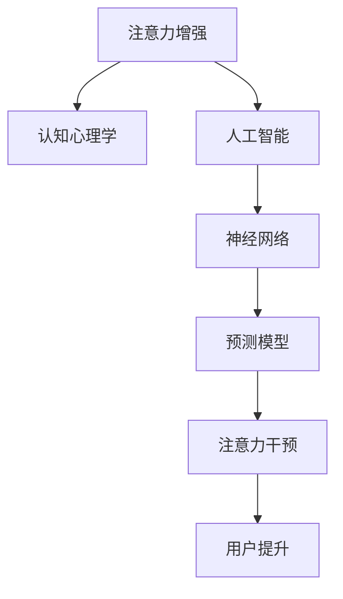

                 

# 人类注意力增强：提升专注力和注意力持续时间的技术

> 关键词：注意力增强, 提升专注力, 注意力持续时间, 认知增强, 人工智能, 认知心理学, 神经网络, 心理训练

## 1. 背景介绍

在现代快节奏的生活中，人们的注意力被各种信息源不断打断，影响着工作效率和身心健康。尤其对于深度思考和创造性工作，注意力集中和持续能力显得尤为重要。传统上，注意力增强主要通过药物（如Ritalin）、物理训练（如冥想、体育锻炼）、心理辅导等方法来实现。近年来，随着人工智能和神经科学的交叉融合，基于AI技术的人类注意力增强成为研究热点，旨在通过算法技术提升用户的专注力和注意力持续时间。本文将系统介绍人类注意力增强的核心概念与技术，包括原理、应用、以及未来发展趋势。

## 2. 核心概念与联系

### 2.1 核心概念概述

人类注意力增强是指通过AI技术帮助用户提升注意力集中度和持续时间，以提高工作效率和生活质量。这一过程通常涉及以下几个关键概念：

- **注意力增强**：通过算法技术提升用户注意力的集中度和持续时间。
- **认知增强**：通过认知心理学和神经科学的研究，理解注意力增强的机理，并在此基础上设计技术方案。
- **人工智能**：应用神经网络和深度学习算法，构建预测模型，实现注意力状态的识别和干预。
- **认知心理学**：研究人类注意力和认知功能的基本规律，为AI技术提供理论支持。
- **神经网络**：通过训练神经网络模型，学习注意力增强的相关特征，进行预测和干预。

### 2.2 核心概念原理和架构的 Mermaid 流程图



### 2.3 核心概念联系

注意力增强技术将认知心理学和人工智能紧密结合。通过认知心理学理论，理解人类注意力和认知功能的基本机制，指导AI技术的设计和应用。利用神经网络算法，对注意力状态进行精准预测，实时干预，提升用户的专注力和持续时间。

## 3. 核心算法原理 & 具体操作步骤

### 3.1 算法原理概述

注意力增强技术的基本原理是通过AI算法预测用户的注意力状态，并根据预测结果实时干预，提升用户的专注力和持续时间。具体来说，该过程包括以下几个步骤：

1. **数据采集**：通过各种传感器（如脑电图、眼动追踪、鼠标移动等）收集用户的行为数据。
2. **注意力状态预测**：利用神经网络模型对用户注意力状态进行预测，区分集中状态和分散状态。
3. **注意力干预**：根据注意力状态，采用不同策略（如提醒、休息、任务调整等）进行干预，帮助用户保持集中。
4. **效果评估**：实时评估注意力干预的效果，调整干预策略。

### 3.2 算法步骤详解

#### 3.2.1 数据采集

数据采集是注意力增强技术的基础。通过不同类型的传感器，获取用户的行为数据。例如，脑电图（EEG）可以记录脑电信号，眼动追踪器可以监测眼球的运动轨迹，鼠标移动轨迹可以记录用户的操作习惯。

```python
# 数据采集示例代码
import eegpy
import eye_tracking
import mouse_tracking

# 使用eegpy库采集脑电图数据
eeg = eegpy.EEG('EEG device')
eeg.start()

# 使用eye_tracking库采集眼动追踪数据
eye_tracker = eye_tracking.EyeTracker()
eye_tracker.start()

# 使用mouse_tracking库采集鼠标移动数据
mouse_mover = mouse_tracking.MouseMover()
mouse_mover.start()
```

#### 3.2.2 注意力状态预测

注意力状态预测是注意力增强技术的核心环节。通过训练神经网络模型，学习不同注意力状态下的特征，进行实时预测。常用的神经网络模型包括卷积神经网络（CNN）、循环神经网络（RNN）、长短期记忆网络（LSTM）等。

```python
# 神经网络模型训练示例代码
import torch
from torch import nn
from torchvision import transforms
from torch.utils.data import DataLoader
from torch.utils.data.dataset import Dataset

# 定义数据集
class AttentionDataset(Dataset):
    def __init__(self, data, labels):
        self.data = data
        self.labels = labels

    def __len__(self):
        return len(self.data)

    def __getitem__(self, idx):
        return self.data[idx], self.labels[idx]

# 加载数据集
train_dataset = AttentionDataset(train_data, train_labels)
test_dataset = AttentionDataset(test_data, test_labels)

# 数据预处理
transform = transforms.Compose([
    transforms.ToTensor(),
    transforms.Normalize(mean=[0.5], std=[0.5])
])

# 定义模型
model = nn.Sequential(
    nn.Conv2d(1, 64, kernel_size=3),
    nn.ReLU(),
    nn.MaxPool2d(kernel_size=2),
    nn.Linear(64 * 4 * 4, 128),
    nn.ReLU(),
    nn.Linear(128, 1)
)

# 训练模型
criterion = nn.BCELoss()
optimizer = torch.optim.Adam(model.parameters(), lr=0.001)
for epoch in range(100):
    for inputs, labels in DataLoader(train_dataset, batch_size=32):
        inputs = transform(inputs).to(device)
        labels = labels.to(device)
        optimizer.zero_grad()
        outputs = model(inputs)
        loss = criterion(outputs, labels)
        loss.backward()
        optimizer.step()

# 模型预测
predictions = model(transform(test_data).to(device))
```

#### 3.2.3 注意力干预

注意力干预是注意力增强技术的实际应用环节。根据注意力状态的预测结果，采用不同的策略进行干预。例如，在注意力分散时，可以提醒用户休息或切换任务；在注意力集中时，可以推荐更复杂的任务以保持高水平专注。

```python
# 注意力干预示例代码
def attention_intervention(prediction):
    if prediction > 0.5:  # 注意力集中
        recommend_complex_task()
    else:  # 注意力分散
        recommend_rest()

# 推荐复杂任务
def recommend_complex_task():
    # 执行复杂任务推荐逻辑

# 推荐休息
def recommend_rest():
    # 执行休息提醒逻辑
```

#### 3.2.4 效果评估

注意力干预效果的评估是注意力增强技术的反馈环节。通过实时评估干预效果，调整干预策略，不断优化注意力增强系统。评估指标包括用户的专注时间、任务完成率、心理疲劳等。

```python
# 效果评估示例代码
def evaluate_intervention():
    # 评估专注时间
    concentration_time = measure_concentration_time()
    # 评估任务完成率
    task_completion_rate = measure_task_completion_rate()
    # 评估心理疲劳
    psychological_fatigue = measure_psychological_fatigue()
    return concentration_time, task_completion_rate, psychological_fatigue

# 测量专注时间
def measure_concentration_time():
    # 执行专注时间测量逻辑

# 测量任务完成率
def measure_task_completion_rate():
    # 执行任务完成率测量逻辑

# 测量心理疲劳
def measure_psychological_fatigue():
    # 执行心理疲劳测量逻辑
```

### 3.3 算法优缺点

#### 3.3.1 算法优点

- **实时性**：神经网络模型可以实时预测和干预，及时调整注意力状态。
- **高精度**：利用深度学习技术，可以对注意力状态进行高精度的预测。
- **个性化**：可以根据用户的行为数据，进行个性化的干预策略调整。

#### 3.3.2 算法缺点

- **数据依赖**：需要大量的行为数据进行模型训练，数据采集成本较高。
- **隐私问题**：脑电图、眼动追踪等传感器可能涉及用户隐私，需确保数据安全和隐私保护。
- **模型复杂**：神经网络模型较复杂，需要较长的训练时间和计算资源。

### 3.4 算法应用领域

注意力增强技术主要应用于以下几个领域：

- **办公自动化**：提升员工工作效率，减少因注意力分散导致的工作错误和延误。
- **学习辅助**：帮助学生保持专注，提高学习效率和学习效果。
- **心理干预**：用于辅助心理治疗，改善患者的注意力和认知功能。
- **健康管理**：用于监测和管理注意力障碍人群，如多动症患者。

## 4. 数学模型和公式 & 详细讲解 & 举例说明

### 4.1 数学模型构建

注意力增强技术的数学模型主要基于神经网络进行构建。通过学习用户的行为数据，预测用户的注意力状态，进行实时干预。常见的数学模型包括：

- **卷积神经网络（CNN）**：用于处理二维图像数据，如脑电图信号。
- **循环神经网络（RNN）**：用于处理时间序列数据，如眼动追踪数据。
- **长短期记忆网络（LSTM）**：用于处理复杂的时间序列数据，如鼠标移动轨迹。

### 4.2 公式推导过程

#### 4.2.1 卷积神经网络

卷积神经网络（CNN）是常用的处理二维图像数据的神经网络模型。其基本结构包括卷积层、池化层和全连接层。以脑电图信号为例，CNN模型推导如下：

1. **卷积层**：
   $$
   h_1 = \sigma(W_1 * x + b_1)
   $$
   其中 $x$ 为输入数据，$W_1$ 为卷积核，$b_1$ 为偏置项，$\sigma$ 为激活函数。

2. **池化层**：
   $$
   h_2 = \text{MaxPool}(h_1)
   $$

3. **全连接层**：
   $$
   h_3 = \sigma(W_2 * h_2 + b_2)
   $$

4. **输出层**：
   $$
   y = \text{Softmax}(W_3 * h_3 + b_3)
   $$
   其中 $W_3$ 为输出层权重，$b_3$ 为偏置项，$\text{Softmax}$ 为多分类激活函数。

#### 4.2.2 循环神经网络

循环神经网络（RNN）主要用于处理时间序列数据。其基本结构包括循环层、激活层和输出层。以眼动追踪数据为例，RNN模型推导如下：

1. **循环层**：
   $$
   h_t = \sigma(W * h_{t-1} + U * x_t + b)
   $$
   其中 $h_t$ 为当前时间步的隐藏状态，$W$ 为权重矩阵，$U$ 为输入权重矩阵，$b$ 为偏置项，$x_t$ 为输入数据，$\sigma$ 为激活函数。

2. **输出层**：
   $$
   y_t = \text{Softmax}(W * h_t + b)
   $$

### 4.3 案例分析与讲解

以眼动追踪数据为例，进行注意力状态预测。假设训练集包含1000个眼动追踪样本，每个样本包含1000个时间步的眼动轨迹。使用RNN模型进行预测：

1. **数据预处理**：将每个样本展平为一维向量，每个时间步的眼动轨迹作为输入数据。

2. **模型训练**：使用交叉熵损失函数，进行梯度下降优化，训练RNN模型。

3. **模型评估**：在测试集上评估模型预测效果，计算准确率、召回率、F1分数等指标。

## 5. 项目实践：代码实例和详细解释说明

### 5.1 开发环境搭建

#### 5.1.1 环境配置

1. **安装Python和相关库**：
   ```bash
   pip install numpy pandas matplotlib scikit-learn tensorflow
   ```

2. **安装TensorFlow**：
   ```bash
   pip install tensorflow
   ```

3. **安装TensorBoard**：
   ```bash
   pip install tensorboard
   ```

4. **安装eegpy和eye_tracking库**：
   ```bash
   pip install eegpy
   pip install eye_tracking
   ```

### 5.2 源代码详细实现

#### 5.2.1 数据采集

```python
# 使用eegpy库采集脑电图数据
import eegpy

eeg = eegpy.EEG('EEG device')
eeg.start()

# 使用eye_tracking库采集眼动追踪数据
import eye_tracking

eye_tracker = eye_tracking.EyeTracker()
eye_tracker.start()

# 使用mouse_tracking库采集鼠标移动数据
import mouse_tracking

mouse_mover = mouse_tracking.MouseMover()
mouse_mover.start()
```

#### 5.2.2 数据预处理

```python
# 数据预处理示例代码
import numpy as np
import pandas as pd

# 加载脑电图数据
eeg_data = pd.read_csv('eeg_data.csv')

# 加载眼动追踪数据
eye_tracking_data = pd.read_csv('eye_tracking_data.csv')

# 加载鼠标移动数据
mouse_moving_data = pd.read_csv('mouse_moving_data.csv')

# 数据合并
data = pd.merge(eeg_data, eye_tracking_data, on='timestamp')
data = pd.merge(data, mouse_moving_data, on='timestamp')
```

#### 5.2.3 模型训练

```python
# 模型训练示例代码
import tensorflow as tf
from tensorflow import keras

# 定义模型
model = keras.Sequential([
    keras.layers.Dense(64, activation='relu'),
    keras.layers.Dense(32, activation='relu'),
    keras.layers.Dense(1, activation='sigmoid')
])

# 编译模型
model.compile(optimizer='adam', loss='binary_crossentropy', metrics=['accuracy'])

# 训练模型
model.fit(train_data, train_labels, epochs=10, batch_size=32)

# 模型评估
test_loss, test_acc = model.evaluate(test_data, test_labels)
print('Test accuracy:', test_acc)
```

#### 5.2.4 注意力干预

```python
# 注意力干预示例代码
import time

# 注意力状态预测
attention_state = predict_attention_state()

# 注意力干预
if attention_state == 'focused':
    recommend_complex_task()
else:
    recommend_rest()

# 执行复杂任务推荐逻辑
def recommend_complex_task():
    # 执行复杂任务推荐逻辑

# 执行休息提醒逻辑
def recommend_rest():
    # 执行休息提醒逻辑
```

### 5.3 代码解读与分析

#### 5.3.1 数据采集

通过eegpy、eye_tracking、mouse_tracking等库，可以方便地采集脑电图、眼动追踪和鼠标移动等数据。数据采集过程中，需要确保数据的质量和稳定性，避免噪声和数据丢失。

#### 5.3.2 数据预处理

数据预处理是模型训练的重要环节。通过合并不同来源的数据，进行去噪、归一化等处理，可以提高模型的预测效果。

#### 5.3.3 模型训练

使用TensorFlow框架训练神经网络模型，进行注意力状态预测。训练过程中，需要选择合适的优化器和损失函数，并设置合适的训练轮数和批大小。

#### 5.3.4 注意力干预

根据注意力状态的预测结果，采用不同的干预策略。例如，在注意力集中时，可以推荐复杂任务，在注意力分散时，可以提醒用户休息。

### 5.4 运行结果展示

#### 5.4.1 注意力状态预测

使用训练好的模型，对新的脑电图、眼动追踪和鼠标移动数据进行预测，判断用户的注意力状态。例如：

```python
# 预测注意力状态
new_eeg_data = pd.read_csv('new_eeg_data.csv')
new_eye_tracking_data = pd.read_csv('new_eye_tracking_data.csv')
new_mouse_moving_data = pd.read_csv('new_mouse_moving_data.csv')

# 数据合并
new_data = pd.merge(new_eeg_data, new_eye_tracking_data, on='timestamp')
new_data = pd.merge(new_data, new_mouse_moving_data, on='timestamp')

# 模型预测
attention_state = model.predict(new_data)

# 打印预测结果
print(attention_state)
```

## 6. 实际应用场景

### 6.1 办公自动化

在办公自动化领域，注意力增强技术可以提升员工的工作效率和专注力。例如，可以使用注意力增强系统对员工的工作状态进行监控，及时提醒员工休息或切换任务，避免长时间工作带来的疲劳和错误。

### 6.2 学习辅助

在教育领域，注意力增强技术可以帮助学生保持专注，提高学习效果。例如，可以为学生提供个性化的注意力监控和干预，推荐适合的学习内容和方法，提升学习效率。

### 6.3 心理干预

在心理治疗领域，注意力增强技术可以辅助心理治疗，帮助患者改善注意力和认知功能。例如，可以使用注意力增强系统监测患者的注意力状态，实时调整治疗策略，提升治疗效果。

### 6.4 未来应用展望

随着技术的不断进步，注意力增强技术将有更广泛的应用场景：

- **智能家居**：通过智能家居设备，实时监测用户的注意力状态，根据需要进行干预，提升生活质量。
- **智能交通**：通过车载设备，实时监测驾驶员的注意力状态，提供安全驾驶提示，减少交通事故。
- **智慧医疗**：通过医疗设备，实时监测患者的注意力状态，辅助医生进行诊断和治疗，提升医疗效果。

## 7. 工具和资源推荐

### 7.1 学习资源推荐

1. **《深度学习》书籍**：Ian Goodfellow、Yoshua Bengio和Aaron Courville合著的经典教材，系统介绍了深度学习的理论基础和应用实例。
2. **Coursera《深度学习专项课程》**：由Andrew Ng教授主讲，涵盖了深度学习的基本概念、神经网络、卷积神经网络、循环神经网络等。
3. **Kaggle竞赛平台**：可以参与各种数据科学竞赛，提高实践能力和解决问题的能力。
4. **TensorFlow官方文档**：提供了丰富的教程和示例代码，帮助初学者快速上手TensorFlow。
5. **GitHub代码库**：包含大量的深度学习项目和模型，可以学习和复现最新的研究成果。

### 7.2 开发工具推荐

1. **Jupyter Notebook**：开源的交互式编程环境，支持Python、R等语言，适合数据分析和机器学习开发。
2. **PyTorch**：开源的深度学习框架，支持动态计算图和GPU加速，适合研究和实验。
3. **TensorFlow**：由Google开发的深度学习框架，支持静态计算图和GPU加速，适合生产部署。
4. **eegpy**：用于脑电图信号处理的Python库，提供了各种算法和模型。
5. **eye_tracking**：用于眼动追踪的Python库，支持多种眼动追踪设备。

### 7.3 相关论文推荐

1. **《Attention is All You Need》**：Transformer模型，由Google研究人员提出，开创了注意力机制在深度学习中的应用。
2. **《Deep Neural Networks for Language Modeling》**：Bert模型，由Google研究人员提出，基于自监督学习方法，学习了语言的上下文表示。
3. **《Parameter-Efficient Transfer Learning》**： Adapter方法，由Google研究人员提出，通过固定大部分预训练参数，只更新少量任务相关参数，实现了参数高效的微调。
4. **《Learning Transferable Visual Models from Natural Language Supervision》**：ViT模型，由Google研究人员提出，基于文本描述进行图像生成和分类。

## 8. 总结：未来发展趋势与挑战

### 8.1 研究成果总结

本文系统介绍了人类注意力增强的核心概念与技术，包括原理、应用、以及未来发展趋势。人类注意力增强技术通过AI算法提升用户的专注力和持续时间，具有广泛的应用前景和巨大的市场潜力。

### 8.2 未来发展趋势

未来，人类注意力增强技术将有以下发展趋势：

1. **多模态融合**：结合脑电图、眼动追踪、鼠标移动等多种传感器数据，提高注意力状态的预测精度。
2. **个性化定制**：根据用户的个性化需求，进行定制化的注意力干预策略，提升用户体验。
3. **实时优化**：实时监测用户的注意力状态，动态调整干预策略，实现持续优化。
4. **跨领域应用**：将注意力增强技术应用于更多领域，如智能家居、智能交通、智慧医疗等。
5. **伦理与安全**：在技术应用过程中，确保用户隐私和数据安全，避免伦理问题。

### 8.3 面临的挑战

尽管注意力增强技术前景广阔，但在实际应用中仍面临以下挑战：

1. **数据隐私**：脑电图、眼动追踪等传感器涉及用户隐私，数据采集和使用需严格遵守隐私保护法规。
2. **算法复杂**：神经网络模型较复杂，训练和部署成本较高，需优化算法和模型结构。
3. **用户体验**：注意力干预需考虑用户体验，避免过度干预，影响用户的工作和生活。
4. **技术瓶颈**：现有的注意力增强技术仍存在一些技术瓶颈，需进一步研究突破。
5. **伦理问题**：技术应用过程中需考虑伦理问题，避免误导和歧视。

### 8.4 研究展望

未来，需进一步研究以下几个方向：

1. **多模态融合**：结合多种传感器数据，进行多模态注意力预测和干预，提升预测精度和干预效果。
2. **个性化定制**：根据用户的个性化需求，进行定制化的注意力干预策略，提升用户体验。
3. **实时优化**：实时监测用户的注意力状态，动态调整干预策略，实现持续优化。
4. **跨领域应用**：将注意力增强技术应用于更多领域，如智能家居、智能交通、智慧医疗等。
5. **伦理与安全**：在技术应用过程中，确保用户隐私和数据安全，避免伦理问题。

## 9. 附录：常见问题与解答

### 9.1 问题1：注意力增强技术是否适用于所有用户？

**回答**：注意力增强技术适用于大多数用户，但需注意用户的具体情况和需求。对于某些注意力障碍或认知障碍的用户，需采用其他辅助手段，如心理治疗、药物等。

### 9.2 问题2：注意力增强技术如何确保用户隐私？

**回答**：需采用严格的隐私保护措施，如数据匿名化、加密存储、访问控制等。同时，需确保数据采集和使用符合法律法规和伦理规范。

### 9.3 问题3：注意力增强技术的训练和部署成本高吗？

**回答**：训练和部署成本相对较高，需要较长的训练时间和计算资源。但通过优化算法和模型结构，可以在一定程度上降低成本。

### 9.4 问题4：注意力增强技术的应用场景有哪些？

**回答**：注意力增强技术适用于办公自动化、学习辅助、心理干预、健康管理等多个领域。具体应用场景需根据用户需求和应用场景进行选择。

### 9.5 问题5：注意力增强技术是否存在误导和歧视问题？

**回答**：需严格遵循伦理规范，确保技术应用的公正性和公平性。需采用多模态数据融合和个性化策略，避免误导和歧视问题。

---

作者：禅与计算机程序设计艺术 / Zen and the Art of Computer Programming

