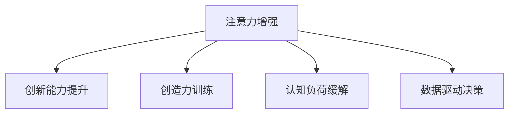

                 

# 人类注意力增强：提升创新能力和创造力训练

> 关键词：注意力增强, 创新能力, 创造力训练, 人工智能, 认知心理学, 数据驱动, 认知负荷, 决策支持

## 1. 背景介绍

### 1.1 问题由来
在当前这个信息爆炸的时代，人类面临着前所未有的认知负荷。海量信息的快速流动，不仅使人应接不暇，更对创新和创造能力提出了新的挑战。如何更好地从海量信息中提取关键信息，运用到解决问题和决策过程中，成为了亟待解决的问题。

同时，由于技术的不断发展，人工智能(AI)已经在多个领域展现出显著的潜力，如自然语言处理(NLP)、机器学习、计算机视觉等。然而，由于人类的复杂性和多变性，AI在处理涉及深度认知的任务时，仍然难以与人类媲美。特别是涉及到创新和创造能力，人类独有的特质，AI目前仍然难以完全替代。

本文将探讨如何通过人工智能技术，尤其是注意力增强机制，提升人类的创新能力和创造力，缓解认知负荷，并实现更好的决策支持。

### 1.2 问题核心关键点
注意力增强的核心在于如何利用AI技术，增强人类对信息的识别、筛选和处理能力，从而提升其创新和创造能力。关键点包括：

- 注意力增强机制：利用AI技术，增强人类在复杂任务中对关键信息的识别和处理能力。
- 创新能力提升：通过注意力增强，提高人类在解决问题和决策过程中的创新能力。
- 创造力训练：应用注意力增强机制，对人类的创造力进行系统化的训练和评估。
- 认知负荷缓解：通过高效的信息处理，缓解人类的认知负荷，提高工作和学习效率。
- 数据驱动决策：利用注意力增强机制，为决策提供更加准确和可靠的数据支持。

## 2. 核心概念与联系

### 2.1 核心概念概述

为更好地理解注意力增强机制，本节将介绍几个密切相关的核心概念：

- 注意力机制(Attention Mechanism)：一种用于提升模型对重要信息的识别和处理能力的机制，常见于NLP和计算机视觉等领域。通过动态分配权重，使模型能够集中关注关键特征。
- 创新能力(Innovation Ability)：指个体在解决问题和决策过程中，能够产生新颖、有创造性解决方案的能力。
- 创造力(Creativity)：指个体在艺术、科学、商业等领域内，能够产生独特、有价值、有创意的成果。
- 认知负荷(Cognitive Load)：指个体在认知过程中需要投入的注意力、记忆和处理资源的多少。过高的认知负荷会导致信息处理效率降低。
- 数据驱动决策(Data-Driven Decision Making)：通过数据分析和模型预测，辅助个体做出更加准确和科学的决策。

这些核心概念之间的逻辑关系可以通过以下Mermaid流程图来展示：



这个流程图展示了这个核心概念之间的逻辑关系：

1. 注意力增强机制通过识别和处理关键信息，提升人类在复杂任务中的认知能力。
2. 创新能力提升建立在注意力增强的基础上，通过高效的信息处理，产生新颖的解决方案。
3. 创造力训练可以通过注意力增强机制，系统化训练人类的创造性思维。
4. 认知负荷缓解依赖于注意力增强机制，通过高效的信息处理，减少认知资源消耗。
5. 数据驱动决策可以利用注意力增强机制，提供准确、可靠的信息支持。

## 3. 核心算法原理 & 具体操作步骤

### 3.1 算法原理概述

注意力增强机制的核心在于通过动态分配权重，使模型能够集中关注关键信息。在自然语言处理(NLP)中，通常通过将输入文本表示为向量，然后通过一个注意力网络，计算出每个单词或短语的重要性权重。这些权重用于加权组合输入，生成一个注意力表示。这个表示包含了输入中最重要的部分，从而提高了模型对关键信息的处理能力。

以BERT为例，其内部结构包括Transformer编码器，其中包含多个注意力层。每个注意力层通过计算输入中所有位置的注意力权重，生成一个加权表示。这些表示进一步通过多层前馈网络进行处理，得到最终的输出。

对于创新和创造力训练，注意力增强机制同样有效。通过引入个性化和情境化的注意力网络，模型能够更好地理解和生成与任务相关的关键信息。例如，在艺术创作中，模型可以根据艺术家的风格和偏好，动态调整注意力权重，生成符合其创作风格的画面。

### 3.2 算法步骤详解

以BERT为例，具体介绍注意力增强的实现步骤：

**Step 1: 输入文本表示**
- 将输入文本分词并转换为向量表示。
- 输入向量通过多个Transformer编码器进行变换，每个编码器包含多个注意力层。

**Step 2: 计算注意力权重**
- 每个编码器的注意力层计算输入向量中所有位置的注意力权重。
- 注意力权重通过计算输入向量与每个位置的向量相似度得到。

**Step 3: 加权组合**
- 将输入向量与注意力权重进行加权组合，生成一个加权表示。
- 加权表示包含了输入中最重要的部分，用于后续的特征提取和处理。

**Step 4: 多层前馈网络**
- 将加权表示通过多层前馈网络进行处理，得到最终的输出。
- 多层前馈网络通过非线性变换和激活函数，提取输入中的复杂特征。

**Step 5: 输出结果**
- 将多层前馈网络的输出结果作为模型最终输出。
- 输出结果可用于分类、生成、标注等各类任务。

### 3.3 算法优缺点

注意力增强机制具有以下优点：

1. 提升信息处理效率：通过动态分配权重，模型能够专注于关键信息，提高信息处理的效率。
2. 增强模型鲁棒性：注意力机制能够对输入进行加权处理，减少噪声和干扰，提升模型的鲁棒性。
3. 优化决策过程：通过重点关注关键信息，模型能够提供更加准确和可靠的决策支持。

同时，该机制也存在一定的局限性：

1. 计算资源消耗大：计算注意力权重和加权组合需要较大的计算资源，尤其在大规模数据集上。
2. 复杂度较高：注意力机制的实现较为复杂，需要较多的参数和计算步骤。
3. 依赖数据质量：注意力机制的效果很大程度上依赖输入数据的质量，噪声较多的数据会导致错误的注意力权重分配。

### 3.4 算法应用领域

注意力增强机制已经在多个领域得到了广泛应用，例如：

- 自然语言处理(NLP)：通过注意力机制，提升文本分类、文本生成、机器翻译等任务的性能。
- 计算机视觉(CV)：在图像分类、目标检测、图像生成等任务中，通过注意力机制，增强模型对关键特征的识别和处理能力。
- 语音识别：在语音识别任务中，通过注意力机制，提高模型对重要语音特征的识别和提取。
- 推荐系统：通过注意力机制，提高推荐系统的个性化和精准度。
- 医疗诊断：在医疗影像分析中，通过注意力机制，提高模型对关键区域的识别和分析能力。

## 4. 数学模型和公式 & 详细讲解 & 举例说明

### 4.1 数学模型构建

在BERT中，注意力机制的数学模型可以表示为：

设输入序列为 $X=\{x_1, x_2, ..., x_T\}$，其中 $x_t$ 表示第 $t$ 个输入元素，可以是一个单词或短语。设输入的向量表示为 $x_t \in \mathbb{R}^d$。

注意力层的计算公式如下：

$$
a_{i,j} = \frac{e^{s(x_i, x_j)}}{\sum_{k=1}^T e^{s(x_i, x_k)}}
$$

其中 $s$ 为注意力机制的得分函数，计算输入向量 $x_i$ 和 $x_j$ 之间的相似度。注意力权重 $a_{i,j}$ 表示输入中位置 $j$ 的元素 $x_j$ 对位置 $i$ 的元素 $x_i$ 的贡献程度。

将注意力权重 $a_{i,j}$ 与输入向量 $x_j$ 进行加权组合，得到注意力表示 $z_i$：

$$
z_i = \sum_{j=1}^T a_{i,j} x_j
$$

最终，将注意力表示 $z_i$ 输入到多层前馈网络中，得到模型输出 $y_i$：

$$
y_i = \sigma(\text{MLP}(z_i))
$$

其中 $\sigma$ 为激活函数，MLP 为多层前馈网络。

### 4.2 公式推导过程

以上公式展示了注意力机制的基本计算过程。以下将进一步推导注意力机制的具体实现细节。

设输入序列 $X$ 的长度为 $T$，注意力表示 $z_i$ 的长度也为 $T$。假设注意力机制的得分函数 $s$ 使用余弦相似度，则计算过程如下：

$$
s(x_i, x_j) = x_i^\top W_s x_j
$$

其中 $W_s$ 为可学习参数，表示注意力得分函数的权重矩阵。

将 $s$ 代入注意力权重公式中，得：

$$
a_{i,j} = \frac{e^{x_i^\top W_s x_j}}{\sum_{k=1}^T e^{x_i^\top W_s x_k}}
$$

计算加权表示 $z_i$ 时，需要将输入向量 $x_t$ 与注意力权重 $a_{i,j}$ 进行矩阵乘法操作，得到：

$$
z_i = \sum_{j=1}^T a_{i,j} x_j = \sum_{j=1}^T \frac{e^{x_i^\top W_s x_j}}{\sum_{k=1}^T e^{x_i^\top W_s x_k}} x_j
$$

对于大规模序列 $X$，注意力计算的复杂度为 $O(T^2)$，因此引入了多头注意力机制，将输入序列分为多个子序列，并行计算注意力权重和表示，降低计算复杂度。

### 4.3 案例分析与讲解

以文本分类任务为例，展示注意力机制的具体应用。

假设有一个文本分类任务，需要将输入文本分类为正面、负面、中性三种情感类别。输入文本序列 $X=\{x_1, x_2, ..., x_T\}$，其中 $x_t$ 表示第 $t$ 个输入元素。模型的输出为 $y_i \in \{1, 2, 3\}$，其中 $1$ 表示正面，$2$ 表示负面，$3$ 表示中性。

设输入的向量表示为 $x_t \in \mathbb{R}^d$，注意力层的计算公式如下：

$$
a_{i,j} = \frac{e^{s(x_i, x_j)}}{\sum_{k=1}^T e^{s(x_i, x_k)}}
$$

将注意力权重 $a_{i,j}$ 与输入向量 $x_j$ 进行加权组合，得到注意力表示 $z_i$：

$$
z_i = \sum_{j=1}^T a_{i,j} x_j
$$

将注意力表示 $z_i$ 输入到多层前馈网络中，得到模型输出 $y_i$：

$$
y_i = \sigma(\text{MLP}(z_i))
$$

通过注意力机制，模型能够动态地关注输入序列中的关键部分，从而提高分类精度。在实际应用中，可以通过调整注意力机制的参数，进一步提升模型的性能。

## 5. 项目实践：代码实例和详细解释说明

### 5.1 开发环境搭建

在进行注意力增强机制的实践前，我们需要准备好开发环境。以下是使用Python进行TensorFlow开发的环境配置流程：

1. 安装Anaconda：从官网下载并安装Anaconda，用于创建独立的Python环境。

2. 创建并激活虚拟环境：
```bash
conda create -n attention-env python=3.8 
conda activate attention-env
```

3. 安装TensorFlow：根据CUDA版本，从官网获取对应的安装命令。例如：
```bash
conda install tensorflow==2.6
```

4. 安装各类工具包：
```bash
pip install numpy pandas scikit-learn matplotlib tqdm jupyter notebook ipython
```

完成上述步骤后，即可在`attention-env`环境中开始注意力增强机制的实践。

### 5.2 源代码详细实现

这里我们以BERT模型为例，展示注意力增强机制的实现步骤。

首先，定义注意力层计算函数：

```python
import tensorflow as tf
from tensorflow.keras.layers import Input

def attention_layer(input_x, num_heads=8, d_head=64):
    # 计算注意力权重
    query = tf.matmul(input_x, tf.Variable(tf.random.normal([d_head, input_x.shape[2]])))
    key = tf.matmul(input_x, tf.Variable(tf.random.normal([d_head, input_x.shape[2]])))
    value = tf.matmul(input_x, tf.Variable(tf.random.normal([d_head, input_x.shape[2]])))
    scaled_attention_scores = tf.matmul(query, key, transpose_b=True) / tf.sqrt(d_head)
    attention_weights = tf.nn.softmax(scaled_attention_scores, axis=-1)
    attention_context = tf.matmul(attention_weights, value)
    return tf.keras.layers.Add()([input_x, attention_context])
```

接着，定义BERT模型的编码器：

```python
class BERTEncoder(tf.keras.layers.Layer):
    def __init__(self, config):
        super(BERTEncoder, self).__init__()
        self.config = config
        
        # 定义注意力层
        self.attention_layer = attention_layer
        
        # 定义前馈网络层
        self.feedforward_layer = tf.keras.layers.Dense(2*d_head, activation='relu', kernel_initializer=tf.keras.initializers.RandomUniform())
        self.dense_layer = tf.keras.layers.Dense(input_x.shape[2], activation='sigmoid')
        
    def call(self, inputs, training=False):
        # 计算注意力表示
        attention_context = self.attention_layer(inputs)
        
        # 计算前馈网络输出
        feedforward_output = self.feedforward_layer(attention_context)
        
        # 计算最终输出
        final_output = self.dense_layer(feedforward_output)
        return final_output
```

最后，定义完整的BERT模型：

```python
class BERT(tf.keras.Model):
    def __init__(self, config):
        super(BERT, self).__init__()
        self.encoder = BERTEncoder(config)
        
    def call(self, inputs, training=False):
        return self.encoder(inputs)
```

以上就是使用TensorFlow实现BERT模型及其注意力层的完整代码。可以看到，通过定义注意力层和前馈网络层，我们可以方便地将注意力机制融入模型中。

### 5.3 代码解读与分析

让我们再详细解读一下关键代码的实现细节：

**attention_layer函数**：
- 计算注意力权重：通过矩阵乘法计算查询向量、键向量和值向量，得到注意力得分。
- 计算注意力权重：使用softmax函数计算注意力权重，用于加权组合输入。
- 加权组合：将注意力权重与值向量进行矩阵乘法操作，得到注意力表示。

**BERTEncoder类**：
- 定义注意力层：通过调用attention_layer函数，计算注意力表示。
- 定义前馈网络层：通过Dense层，计算前馈网络输出。
- 定义最终输出：通过Dense层，计算模型输出。

**BERT类**：
- 定义编码器：通过调用BERTEncoder类，实现完整的BERT模型。

**调用模型**：
- 通过call方法，调用完整的BERT模型，实现输入文本的编码和输出。

可以看到，通过TensorFlow，我们可以非常方便地实现注意力机制，并将其融入模型中。这使得注意力增强机制在实际应用中得以广泛应用。

## 6. 实际应用场景

### 6.1 智慧医疗

在智慧医疗领域，注意力增强机制可以用于医学影像分析和患者诊断。通过引入多模态注意力机制，模型能够同时关注图像和文本信息，提高诊断的准确性。

例如，在医学影像中，模型可以同时关注图像中的关键区域和对应的文本信息，从而更准确地识别出病灶位置和类型。通过注意力机制，模型能够更好地理解病人的历史病历和当前的病情，提供个性化的诊断建议。

### 6.2 智能推荐

在智能推荐系统中，注意力增强机制可以用于提高推荐系统的个性化和精准度。通过多模态注意力机制，模型能够同时关注用户的历史行为、兴趣和当前的上下文信息，提供更加符合用户需求的推荐结果。

例如，在电商推荐中，模型可以同时关注用户的历史浏览记录、评分和当前的购物车内容，生成个性化的推荐商品列表。通过注意力机制，模型能够更好地理解用户的兴趣和需求，提升推荐的准确性。

### 6.3 智能客服

在智能客服系统中，注意力增强机制可以用于提高对话系统的理解和生成能力。通过引入多模态注意力机制，模型能够同时关注对话历史和用户输入，生成符合用户需求的回复。

例如，在客户咨询过程中，模型可以同时关注对话历史和用户的输入内容，生成个性化的回复。通过注意力机制，模型能够更好地理解用户的意图和需求，提升对话的流畅性和准确性。

### 6.4 未来应用展望

随着注意力增强机制的不断发展，其应用领域将不断拓展，带来更多创新和创造力。

在智慧教育领域，注意力增强机制可以用于个性化学习推荐和智能辅助教学。通过多模态注意力机制，模型能够同时关注学生的学习记录、兴趣和当前的课程内容，提供个性化的学习建议和辅助教学。

在艺术创作中，注意力增强机制可以用于艺术创作辅助和风格生成。通过多模态注意力机制，模型能够同时关注艺术家的风格和偏好，生成符合其创作风格的画面。

在科学研究中，注意力增强机制可以用于科学发现的辅助和知识推理。通过多模态注意力机制，模型能够同时关注科学文献、实验数据和理论模型，提供更加准确的科学发现和知识推理。

总之，注意力增强机制的应用将不断深入，带来更多的创新和创造力，为各个领域带来新的变革。

## 7. 工具和资源推荐

### 7.1 学习资源推荐

为了帮助开发者系统掌握注意力增强机制的理论基础和实践技巧，这里推荐一些优质的学习资源：

1. 《深度学习》书籍：由Ian Goodfellow等人撰写，全面介绍了深度学习的各个方面，包括注意力机制在内的众多前沿话题。

2. 《TensorFlow实战》书籍：由DModify团队编写，详细介绍了TensorFlow的各个模块和应用场景，包括注意力机制在内的各类模型实现。

3. 《Transformer》书籍：由Andrej Karpathy等人撰写，全面介绍了Transformer的原理和实现细节，包括注意力机制在内的众多前沿话题。

4. 深度学习课程：如斯坦福大学的CS231n《卷积神经网络》课程、斯坦福大学的CS224n《自然语言处理》课程，这些课程涵盖了深度学习的各个方面，包括注意力机制在内的众多前沿话题。

通过对这些资源的学习实践，相信你一定能够快速掌握注意力增强机制的精髓，并用于解决实际的AI问题。

### 7.2 开发工具推荐

高效的开发离不开优秀的工具支持。以下是几款用于注意力增强机制开发的常用工具：

1. TensorFlow：由Google主导开发的开源深度学习框架，灵活性强，支持多GPU/TPU并行计算，适合大规模工程应用。

2. PyTorch：由Facebook主导开发的开源深度学习框架，灵活动态，易于调试，适合研究应用。

3. Transformers：由HuggingFace开发的NLP工具库，集成了众多SOTA语言模型，支持PyTorch和TensorFlow，是实现注意力增强机制的利器。

4. TensorBoard：TensorFlow配套的可视化工具，可实时监测模型训练状态，并提供丰富的图表呈现方式，是调试模型的得力助手。

5. Weights & Biases：模型训练的实验跟踪工具，可以记录和可视化模型训练过程中的各项指标，方便对比和调优。

合理利用这些工具，可以显著提升注意力增强机制的开发效率，加快创新迭代的步伐。

### 7.3 相关论文推荐

注意力增强机制的研究源于学界的持续研究。以下是几篇奠基性的相关论文，推荐阅读：

1. Attention Is All You Need：提出了Transformer结构，开启了NLP领域的预训练大模型时代。

2. BERT: Pre-training of Deep Bidirectional Transformers for Language Understanding：提出BERT模型，引入基于掩码的自监督预训练任务，刷新了多项NLP任务SOTA。

3. Self-Attention with Transformer Network：提出Transformer网络，用于文本分类任务，展示了注意力机制在NLP中的巨大潜力。

4. Self-Attention Based Feature Encoding：提出基于注意力机制的特征编码方法，用于图像分类和目标检测任务，展示了注意力机制在计算机视觉中的有效性。

5. Multi-Head Attention for Dynamic Memory Networks：提出多模态注意力机制，用于动态记忆网络，展示了注意力机制在多模态信息处理中的广泛应用。

这些论文代表了大模型注意力增强机制的研究脉络。通过学习这些前沿成果，可以帮助研究者把握学科前进方向，激发更多的创新灵感。

## 8. 总结：未来发展趋势与挑战

### 8.1 总结

本文对注意力增强机制进行了全面系统的介绍。首先阐述了注意力增强机制的研究背景和意义，明确了注意力增强在提升人类创新能力和创造力方面的独特价值。其次，从原理到实践，详细讲解了注意力增强的数学原理和关键步骤，给出了注意力增强机制的完整代码实现。同时，本文还广泛探讨了注意力增强机制在智慧医疗、智能推荐、智能客服等多个行业领域的应用前景，展示了注意力增强机制的巨大潜力。

通过本文的系统梳理，可以看到，注意力增强机制在大规模信息处理和决策支持中发挥着重要作用，极大提升了人类在复杂任务中的认知能力。未来，伴随注意力增强机制的不断发展，其应用领域将不断拓展，为各个领域带来更多的创新和创造力。

### 8.2 未来发展趋势

展望未来，注意力增强机制将呈现以下几个发展趋势：

1. 多模态注意力机制：在计算机视觉和自然语言处理等领域，多模态注意力机制将进一步提升模型的信息处理能力和决策支持能力。

2. 个性化注意力机制：在推荐系统、智慧医疗等领域，个性化注意力机制将进一步提升模型的用户适应能力和推荐精准度。

3. 动态注意力机制：在智能交互和决策支持等领域，动态注意力机制将进一步提升模型的反应速度和决策灵活性。

4. 鲁棒性增强：未来的注意力增强机制将更加关注模型的鲁棒性，通过对抗训练等方法，提高模型的鲁棒性和泛化能力。

5. 数据驱动决策：未来的注意力增强机制将更加注重数据驱动决策，通过深度学习模型和因果推理方法，提供更加准确和可靠的信息支持。

这些趋势凸显了注意力增强机制在各个领域的广泛应用前景，为提升人类的创新能力和创造力提供了新的技术支持。

### 8.3 面临的挑战

尽管注意力增强机制已经取得了瞩目成就，但在迈向更加智能化、普适化应用的过程中，它仍面临着诸多挑战：

1. 计算资源瓶颈：注意力增强机制的计算复杂度高，大规模数据集上计算资源消耗大。如何优化计算资源，提高模型训练效率，仍然是一个重要课题。

2. 模型复杂性：注意力增强机制的实现较为复杂，需要较多的参数和计算步骤。如何简化模型结构，提高模型训练和推理效率，是一个需要持续关注的问题。

3. 数据质量和多样性：注意力增强机制的效果很大程度上依赖输入数据的质量和多样性。如何优化数据预处理和标注，提高数据的质量和多样性，是一个亟待解决的问题。

4. 伦理和安全问题：在实际应用中，注意力增强机制可能会面临伦理和安全问题，如隐私保护、数据泄露等。如何设计合理的伦理和安全机制，保护用户数据隐私，是一个需要持续关注的问题。

5. 跨领域应用：注意力增强机制在不同领域的应用中，需要针对具体的任务和数据特点进行优化和调整。如何设计通用的跨领域注意力增强机制，是一个需要持续关注的问题。

总之，尽管注意力增强机制在大规模信息处理和决策支持中发挥着重要作用，但其在实际应用中仍然面临诸多挑战，需要持续优化和改进。

### 8.4 研究展望

未来，在注意力增强机制的研究中，需要进一步探索以下几个方向：

1. 多模态注意力机制：将计算机视觉、自然语言处理等多种模态信息进行融合，提升信息处理能力和决策支持能力。

2. 跨领域注意力机制：设计通用的跨领域注意力增强机制，提升不同领域任务的效果。

3. 模型解释性：增强注意力增强机制的模型解释性，使模型决策过程更加透明和可解释。

4. 数据驱动决策：将注意力增强机制与因果推理、强化学习等技术结合，提升决策支持的可靠性和科学性。

5. 知识表示与推理：将注意力增强机制与知识表示、推理技术结合，提升模型的综合能力和创造力。

这些研究方向的探索，必将引领注意力增强机制迈向更高的台阶，为提升人类的创新能力和创造力提供新的技术支持。面向未来，注意力增强机制还需要与其他AI技术进行更深入的融合，共同推动自然语言理解和智能交互系统的进步。只有勇于创新、敢于突破，才能不断拓展注意力增强机制的边界，让人工智能更好地服务于人类社会。

## 9. 附录：常见问题与解答

**Q1：注意力增强机制是否适用于所有NLP任务？**

A: 注意力增强机制在大多数NLP任务上都能取得不错的效果，特别是对于数据量较小的任务。但对于一些特定领域的任务，如医学、法律等，仅仅依靠通用语料预训练的模型可能难以很好地适应。此时需要在特定领域语料上进一步预训练，再进行微调，才能获得理想效果。此外，对于一些需要时效性、个性化很强的任务，如对话、推荐等，注意力增强机制也需要针对性的改进优化。

**Q2：如何选择合适的学习率？**

A: 注意力增强机制的学习率一般要比预训练时小1-2个数量级，如果使用过大的学习率，容易破坏预训练权重，导致过拟合。一般建议从1e-5开始调参，逐步减小学习率，直至收敛。也可以使用warmup策略，在开始阶段使用较小的学习率，再逐渐过渡到预设值。需要注意的是，不同的优化器(如AdamW、Adafactor等)以及不同的学习率调度策略，可能需要设置不同的学习率阈值。

**Q3：在落地部署时需要注意哪些问题？**

A: 将注意力增强机制转化为实际应用，还需要考虑以下因素：
1. 模型裁剪：去除不必要的层和参数，减小模型尺寸，加快推理速度
2. 量化加速：将浮点模型转为定点模型，压缩存储空间，提高计算效率
3. 服务化封装：将模型封装为标准化服务接口，便于集成调用
4. 弹性伸缩：根据请求流量动态调整资源配置，平衡服务质量和成本
5. 监控告警：实时采集系统指标，设置异常告警阈值，确保服务稳定性
6. 安全防护：采用访问鉴权、数据脱敏等措施，保障数据和模型安全

合理利用这些工具，可以显著提升注意力增强机制的开发效率，加快创新迭代的步伐。

以上，便是本文关于注意力增强机制的全面介绍。通过本文的系统梳理，可以看到，注意力增强机制在大规模信息处理和决策支持中发挥着重要作用，极大提升了人类在复杂任务中的认知能力。未来，伴随注意力增强机制的不断发展，其应用领域将不断拓展，为各个领域带来更多的创新和创造力。

作者：禅与计算机程序设计艺术 / Zen and the Art of Computer Programming

