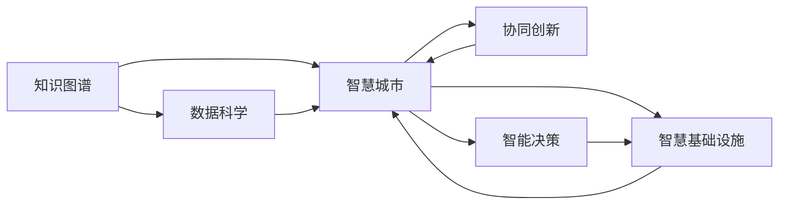

                 

# 人类知识的集体智慧：众智成城的力量

> 关键词：集体智慧、众智成城、知识图谱、智慧城市、城市治理、大数据、AI、机器学习、数据科学、协同创新、智慧基础设施、智能决策

## 1. 背景介绍

### 1.1 问题由来
在现代社会，城市化进程不断推进，人类社会的知识总量呈指数级增长。如何高效、全面地利用这些知识，以提升城市治理、促进城市可持续发展，成为了一个重要课题。信息孤岛、数据烟囱等问题限制了知识的共享与利用，迫切需要一种新型的知识管理方法，使城市成为众智汇聚的智慧之城。

### 1.2 问题核心关键点
本节旨在深入探讨如何将人类的集体智慧转化为城市治理的强大力量。具体核心关键点包括：

1. **知识图谱**：作为知识表示和组织的标准化方法，知识图谱能够将复杂信息网络化，使知识更具可检索性、可复用性。

2. **智慧城市**：智慧城市是一种城市发展的高级形态，依赖于数据、计算和通信技术的深度融合，使城市治理更加高效、智能。

3. **数据科学**：通过数据收集、处理、分析和可视化的全链条操作，数据科学为城市决策提供了有力的支撑。

4. **协同创新**：在城市治理中，各部门、机构、市民之间需要紧密协作，共同推动城市的可持续发展。

5. **智慧基础设施**：建设智能化的基础设施，为城市提供智能感知、智能决策、智能服务。

6. **智能决策**：利用AI和机器学习等技术，实现城市运营的智能化，提升决策效率和质量。

### 1.3 问题研究意义
智慧城市的建设依赖于集体的智慧和技术的支撑。本节将探讨如何将人类的集体智慧转化为城市治理的强大力量，并通过案例和理论分析，展示智慧城市建设的实践路径。

## 2. 核心概念与联系

### 2.1 核心概念概述

智慧城市建设离不开数据驱动和知识融合，因此，需要深刻理解以下几个核心概念：

- **知识图谱**：知识图谱是由节点和边组成的图形结构，其中节点表示实体，边表示实体之间的关系。通过知识图谱，可以构建一个知识网络，使得各类知识资源更加可检索、可利用。

- **智慧城市**：智慧城市是基于物联网、云计算、大数据、人工智能等技术，通过全面感知、全方位连接、深度融合，实现城市运行管理智能化、精准化、精细化。

- **数据科学**：数据科学是关于数据处理、分析和可视化的学科，旨在从数据中提取有用信息，支持决策制定和优化。

- **协同创新**：协同创新是指不同主体、组织、部门之间，通过合作、交流、融合，共同推动某一目标的实现。在智慧城市建设中，协同创新能够促进各方资源、知识的共享和优化配置。

- **智慧基础设施**：智慧基础设施包括智能交通、智能电网、智能水务等各类智能系统，是智慧城市的基础和支撑。

- **智能决策**：智能决策是基于数据、模型和算法，通过自动化、智能化手段，支持高效、精确的决策过程。

这些概念之间相互关联，共同构成了智慧城市建设的核心框架。通过深入理解这些概念，可以更好地设计和实施智慧城市。

### 2.2 核心概念原理和架构的 Mermaid 流程图



该流程图展示了智慧城市建设中各个核心概念之间的联系和相互作用：

1. **知识图谱**：为数据科学提供结构化的知识，使其能够更好地分析和利用数据。
2. **数据科学**：基于知识图谱和智慧基础设施收集的数据，通过分析挖掘，支持智慧城市的各个方面。
3. **智慧城市**：将数据科学和智能决策的结果应用到城市管理的各个领域，实现智慧化的城市运营。
4. **协同创新**：促进知识图谱、数据科学和智能决策的融合，形成跨领域、跨部门的知识网络。
5. **智慧基础设施**：为数据科学和智能决策提供技术支撑，使各类智能系统互联互通。
6. **智能决策**：通过数据科学和知识图谱提供的信息，实现自动化、智能化的决策过程。

### 2.3 关键节点和技术手段

在智慧城市建设中，以下关键节点和技术手段尤为重要：

- **数据收集与整合**：通过物联网设备、传感器、人工智能等技术手段，全面收集城市运行中的各类数据。
- **数据处理与分析**：利用大数据、机器学习等技术，对数据进行清洗、预处理、分析和可视化，形成可用的信息。
- **知识图谱构建**：将收集到的各类数据和信息，通过知识图谱的方式组织起来，形成知识网络。
- **智能决策支持**：基于知识图谱和数据科学，构建智能决策系统，辅助城市管理决策。

## 3. 核心算法原理 & 具体操作步骤

### 3.1 算法原理概述

智慧城市建设的核心在于知识的融合和利用，因此，需要通过算法将各类数据和信息有机结合。具体来说，主要包括以下几个步骤：

1. **数据收集与预处理**：通过传感器、监控设备、智能终端等，全面收集城市运行中的各类数据。
2. **数据清洗与整合**：对收集到的数据进行清洗、去重、整合等处理，确保数据的完整性和一致性。
3. **知识图谱构建**：利用知识图谱技术，将清洗后的数据组织成知识网络，形成结构化的知识库。
4. **数据分析与挖掘**：利用机器学习、数据挖掘等技术，对知识图谱进行分析，提取有用信息。
5. **智能决策支持**：基于分析结果，构建智能决策系统，辅助城市管理决策。

### 3.2 算法步骤详解

**Step 1: 数据收集与预处理**

1. **数据收集**：通过城市内的各类传感器、智能设备、公共数据接口等手段，全面收集城市运行中的各类数据。例如，交通流量、气象数据、公共服务数据等。
2. **数据预处理**：对收集到的数据进行清洗、去重、标准化等处理，确保数据的准确性和一致性。

**Step 2: 知识图谱构建**

1. **实体抽取与识别**：利用自然语言处理技术，从各类文本数据中抽取实体，如人名、地名、组织机构名等。
2. **关系抽取与建模**：根据实体之间的关系，构建知识图谱的边，如“位于”、“服务”、“关联”等关系。
3. **图谱存储与管理**：使用图数据库或知识图谱管理系统，存储和管理构建好的知识图谱。

**Step 3: 数据分析与挖掘**

1. **特征提取**：利用机器学习技术，从知识图谱中提取有用的特征，如实体的属性、关系类型、图谱的拓扑结构等。
2. **模式识别**：基于特征提取结果，使用数据挖掘技术，识别出各类模式和规律，如交通流量规律、公共服务需求等。
3. **预测与决策**：利用预测模型，对未来事件进行预测，支持城市管理决策。

**Step 4: 智能决策支持**

1. **决策规则设计**：根据城市管理的目标和需求，设计决策规则和策略，如交通流量控制、应急响应等。
2. **模型训练与优化**：使用机器学习算法，对决策模型进行训练和优化，确保模型的高效性和准确性。
3. **决策执行与反馈**：将训练好的模型应用到实际的城市管理中，并根据反馈数据不断调整和优化模型。

### 3.3 算法优缺点

智慧城市建设的算法方法有以下优点：

1. **高效性**：通过算法处理，可以高效地收集、整合和分析城市运行中的各类数据。
2. **结构化**：知识图谱提供了结构化的知识表示，使得各类信息更加可检索、可利用。
3. **智能化**：利用机器学习技术，实现自动化的数据分析和决策，提高管理效率和质量。
4. **可扩展性**：算法方法可以灵活扩展，适应各种智慧城市场景。

但同时也存在一些局限性：

1. **数据依赖性**：算法的有效性依赖于数据的质量和数量，数据不足或质量不高会影响算法效果。
2. **复杂性**：构建和维护知识图谱、决策模型等，需要较高技术和资源投入。
3. **安全性**：算法处理的数据涉及城市运行各个方面，必须确保数据和决策的安全性。

### 3.4 算法应用领域

智慧城市建设的算法方法在多个领域都有广泛应用，例如：

1. **交通管理**：利用数据分析和智能决策，优化交通流量、提高交通效率。
2. **公共安全**：通过实时监控和智能分析，提升城市公共安全水平。
3. **能源管理**：利用智能电网和数据分析，优化能源分配和利用，降低能耗和成本。
4. **环保监测**：通过智能传感器和数据分析，实现城市环境监测和治理。
5. **城市规划**：利用城市数据分析和知识图谱，支持城市规划和建设。
6. **公共服务**：通过智能分析，优化公共服务资源配置，提升服务效率和质量。

## 4. 数学模型和公式 & 详细讲解  
### 4.1 数学模型构建

知识图谱构建和数据分析是智慧城市建设的重要环节，其数学模型主要涉及图结构和数据挖掘。

**知识图谱模型**：
知识图谱由节点和边组成，节点表示实体，边表示实体之间的关系。可以表示为：
$$
G=(V, E)
$$
其中 $V$ 表示节点集合，$E$ 表示边集合。

**数据分析模型**：
数据分析主要涉及特征提取和模式识别，常见的数学模型包括：
- **线性回归模型**：用于预测连续型变量，公式为：
$$
y = \beta_0 + \beta_1 x_1 + \cdots + \beta_n x_n + \epsilon
$$
- **决策树模型**：用于分类和预测，公式为：
$$
T=\{r=\left\lfloor \frac{x_1}{k_1} \right\rfloor, \left\lfloor \frac{x_2}{k_2} \right\rfloor, \cdots, \left\lfloor \frac{x_n}{k_n} \right\rfloor\}
$$
- **随机森林模型**：结合多棵决策树，提升预测准确性，公式为：
$$
f(x) = \frac{1}{N} \sum_{i=1}^N f_i(x)
$$

### 4.2 公式推导过程

以线性回归模型为例，进行公式推导。

假设有一组数据 $(x_1, y_1), (x_2, y_2), \cdots, (x_n, y_n)$，其中 $x_i$ 为自变量，$y_i$ 为因变量。线性回归模型的目标是最小化均方误差：
$$
\min \sum_{i=1}^n (y_i - \beta_0 - \beta_1 x_1 - \cdots - \beta_n x_n)^2
$$
利用最小二乘法求解上述问题，可以得到模型参数的估计值：
$$
\hat{\beta}_0 = \frac{\sum_{i=1}^n y_i - \beta_1 \sum_{i=1}^n x_i}{\sum_{i=1}^n x_i^2 - 2\beta_1 \sum_{i=1}^n x_i y_i + \beta_1^2 \sum_{i=1}^n y_i^2}
$$
$$
\hat{\beta}_1 = \frac{\sum_{i=1}^n x_i y_i - \beta_0 \sum_{i=1}^n x_i}{\sum_{i=1}^n x_i^2 - 2\beta_0 \sum_{i=1}^n x_i y_i + \beta_0^2 \sum_{i=1}^n y_i^2}
$$

### 4.3 案例分析与讲解

**交通流量预测**：
通过智能传感器收集交通流量数据，利用线性回归模型预测未来的交通流量。具体步骤如下：
1. **数据收集**：利用智能传感器和数据接口，收集交通流量数据。
2. **数据预处理**：对数据进行清洗、去重、标准化等处理。
3. **特征提取**：提取影响交通流量的关键因素，如天气、时间、节假日等。
4. **模型训练**：使用历史交通流量数据，训练线性回归模型。
5. **预测与优化**：根据训练好的模型，预测未来的交通流量，并根据预测结果优化交通管理。

**智能电网调度**：
通过数据分析和智能决策，优化智能电网的运行，提高电力供应的稳定性和效率。具体步骤如下：
1. **数据收集**：利用智能电网设备和监控系统，收集电力运行数据。
2. **数据预处理**：对数据进行清洗、去重、标准化等处理。
3. **特征提取**：提取影响电网运行的关键因素，如负荷、温度、风力等。
4. **模式识别**：通过数据分析，识别出电力负荷的变化规律。
5. **智能调度**：利用智能决策模型，优化电网的运行，确保电力供应的稳定性和效率。

## 5. 项目实践：代码实例和详细解释说明
### 5.1 开发环境搭建

智慧城市建设的开发环境搭建主要涉及数据收集、存储、处理和分析等环节，以下是一个典型的开发环境配置流程：

1. **数据收集与存储**：
   - 使用Hadoop、Spark等大数据技术，搭建分布式数据存储平台。
   - 通过物联网设备、智能传感器等手段，全面收集城市运行中的各类数据。
   - 使用数据库管理系统，如MySQL、PostgreSQL等，存储和管理数据。

2. **数据分析与处理**：
   - 安装Python环境，使用Pandas、NumPy等工具，进行数据清洗、预处理和分析。
   - 使用Scikit-learn、TensorFlow等机器学习库，构建和训练决策模型。
   - 使用知识图谱工具，如Neo4j、Eclipse GraphX等，构建和管理知识图谱。

3. **智能决策支持**：
   - 搭建Web服务架构，使用Django、Flask等框架，开发智能决策系统。
   - 使用Kubernetes、Docker等容器技术，实现系统的高可用性和扩展性。
   - 使用Elasticsearch、Kafka等大数据技术，实现数据的实时处理和分析。

### 5.2 源代码详细实现

以下是一个智慧城市交通流量预测项目的代码实现，包括数据预处理、模型训练和预测等环节。

**数据预处理**：
```python
import pandas as pd
from sklearn.model_selection import train_test_split
from sklearn.preprocessing import StandardScaler

# 读取数据
data = pd.read_csv('traffic_data.csv')

# 数据清洗
data = data.dropna()

# 特征提取
X = data[['weather', 'time', 'holiday']]
y = data['flow']

# 数据分割
X_train, X_test, y_train, y_test = train_test_split(X, y, test_size=0.2)

# 数据标准化
scaler = StandardScaler()
X_train = scaler.fit_transform(X_train)
X_test = scaler.transform(X_test)
```

**模型训练**：
```python
from sklearn.linear_model import LinearRegression

# 训练模型
model = LinearRegression()
model.fit(X_train, y_train)

# 预测
y_pred = model.predict(X_test)
```

**智能决策系统**：
```python
from flask import Flask, request, jsonify

app = Flask(__name__)

@app.route('/predict', methods=['POST'])
def predict():
    data = request.json
    data = pd.DataFrame(data)
    data = scaler.transform(data)
    result = model.predict(data)
    result = jsonify({'result': result})
    return result

if __name__ == '__main__':
    app.run(host='0.0.0.0', port=5000)
```

### 5.3 代码解读与分析

**数据预处理**：
- 通过Pandas库读取交通流量数据，并进行数据清洗和特征提取。
- 使用train_test_split方法将数据集分割为训练集和测试集。
- 使用StandardScaler进行数据标准化，确保模型训练的稳定性。

**模型训练**：
- 使用Scikit-learn库中的LinearRegression模型，对训练集进行拟合。
- 利用训练好的模型，对测试集进行预测，得到预测结果。

**智能决策系统**：
- 使用Flask框架搭建Web服务，提供API接口。
- 在API接口中，接收输入数据，进行预处理和预测，返回预测结果。
- 通过API接口，可以实现智能决策系统的部署和调用。

## 6. 实际应用场景
### 6.1 智能交通管理

智能交通管理是智慧城市建设的重要环节，通过数据分析和智能决策，可以实现交通流量的优化管理。

**应用场景**：
- 实时交通流量监控：通过智能传感器和摄像头，实时监测交通流量，及时发现拥堵和异常情况。
- 交通信号优化：利用数据分析，优化交通信号灯的控制，减少交通拥堵。
- 事故预警与处理：通过智能分析和监控，及时发现交通事故，并提供预警和处理建议。

**技术实现**：
- 使用知识图谱技术，构建交通网络，分析交通流量变化规律。
- 利用机器学习算法，预测交通流量和事故发生概率。
- 搭建智能决策系统，优化交通信号灯控制和事故处理流程。

**实际案例**：
- **上海智能交通系统**：通过大数据和智能算法，优化交通信号灯控制，有效缓解高峰期交通拥堵。
- **深圳智能交通平台**：利用人工智能技术，实时监测交通流量和事故，提供精准的交通管理方案。

### 6.2 城市能源管理

智慧城市建设中，能源管理是另一个重要环节，通过数据分析和智能决策，可以实现能源供应的优化管理。

**应用场景**：
- 智能电网管理：通过智能电网设备和数据分析，优化电力供应的稳定性和效率。
- 能源消耗监测：实时监测城市能源消耗情况，优化能源分配。
- 可再生能源利用：利用数据分析，优化太阳能、风能等可再生能源的利用。

**技术实现**：
- 使用知识图谱技术，构建能源网络，分析能源消耗规律。
- 利用机器学习算法，预测能源消耗和供应情况。
- 搭建智能决策系统，优化能源分配和利用，提高能源效率。

**实际案例**：
- **北京智能电网系统**：通过智能电网设备和数据分析，优化电力供应的稳定性和效率，降低能耗和成本。
- **德国智慧能源项目**：利用人工智能技术，实时监测能源消耗和供应，优化可再生能源利用，提高能源利用效率。

### 6.3 城市环保监测

智慧城市建设中，环保监测是另一个重要环节，通过数据分析和智能决策，可以实现城市环境的优化管理。

**应用场景**：
- 空气质量监测：实时监测城市空气质量，提供精准的空气质量预测和预警。
- 水质监测：实时监测城市水质，及时发现污染源，提供预警和处理建议。
- 垃圾分类管理：利用数据分析，优化垃圾分类和处理流程，提高垃圾处理效率。

**技术实现**：
- 使用知识图谱技术，构建环境网络，分析环境变化规律。
- 利用机器学习算法，预测环境污染和变化情况。
- 搭建智能决策系统，优化环境监测和管理流程，提高环境治理效率。

**实际案例**：
- **南京空气质量监测系统**：通过智能传感器和数据分析，实时监测城市空气质量，提供精准的空气质量预测和预警。
- **深圳智慧环保平台**：利用人工智能技术，实时监测城市水质，及时发现污染源，提供预警和处理建议，优化垃圾分类和处理流程。

### 6.4 未来应用展望

随着智慧城市建设的不断推进，未来的应用场景将更加广泛和深入，以下是一些未来应用展望：

1. **智慧医疗**：通过数据分析和智能决策，实现智慧医院的建设，提升医疗服务质量。
2. **智慧教育**：利用数据分析和智能决策，优化教育资源的配置，提升教育质量。
3. **智慧公共服务**：通过数据分析和智能决策，优化公共服务资源的配置，提升服务效率和质量。
4. **智慧公共安全**：利用智能监控和数据分析，提升城市公共安全水平，预防和应对各类安全事件。

## 7. 工具和资源推荐
### 7.1 学习资源推荐

为了帮助开发者系统掌握智慧城市建设的理论基础和实践技巧，这里推荐一些优质的学习资源：

1. **《智慧城市建设指南》**：全面介绍智慧城市建设的理论基础、技术架构和应用案例，适合入门学习和项目实践。
2. **《大数据与人工智能》**：详细介绍大数据和人工智能技术在智慧城市建设中的应用，适合深入学习和技术研究。
3. **《城市数据科学与智慧城市》**：结合城市数据科学和智慧城市建设，深入探讨数据驱动的城市治理，适合进阶学习。
4. **《Python数据科学手册》**：详细讲解Python在数据科学和智慧城市建设中的应用，适合技术实践和开发。
5. **《机器学习实战》**：结合实际案例，详细介绍机器学习算法在智慧城市建设中的应用，适合实战学习和项目实践。

通过对这些资源的学习实践，相信你一定能够快速掌握智慧城市建设的核心技术和方法，并用于解决实际的智慧城市问题。

### 7.2 开发工具推荐

高效的开发离不开优秀的工具支持。以下是几款用于智慧城市建设开发的常用工具：

1. **Hadoop、Spark**：大数据处理和分析工具，支持大规模数据存储和处理。
2. **Elasticsearch**：实时数据处理和搜索工具，支持大规模数据查询和分析。
3. **TensorFlow**：深度学习框架，支持大规模深度学习模型的训练和部署。
4. **Flask、Django**：Web框架，支持快速开发和部署Web服务。
5. **Neo4j、Eclipse GraphX**：知识图谱工具，支持知识图谱的构建和管理。
6. **Kafka**：实时数据流处理工具，支持大规模数据的实时处理和分析。

合理利用这些工具，可以显著提升智慧城市建设任务的开发效率，加快创新迭代的步伐。

### 7.3 相关论文推荐

智慧城市建设的持续发展离不开学界的持续研究。以下是几篇奠基性的相关论文，推荐阅读：

1. **《智慧城市：从概念到实践》**：全面介绍智慧城市建设的基本概念、技术和应用案例，为智慧城市建设提供了理论基础。
2. **《基于知识图谱的城市数据建模与分析》**：利用知识图谱技术，对城市数据进行建模和分析，提高了城市管理的效率和质量。
3. **《大数据驱动的城市智能决策》**：结合大数据和人工智能技术，构建智能决策系统，支持城市管理的智能化。
4. **《智能交通系统：技术发展与未来展望》**：详细介绍智能交通系统的技术发展，为智能交通管理提供了技术支持。
5. **《智慧能源：技术、应用与挑战》**：探讨智慧能源技术在智慧城市建设中的应用，为能源管理提供了技术支撑。
6. **《智慧城市的数据科学与人工智能》**：结合数据科学和人工智能技术，支持智慧城市的建设和发展。

这些论文代表了大智慧城市建设的发展脉络。通过学习这些前沿成果，可以帮助研究者把握学科前进方向，激发更多的创新灵感。

## 8. 总结：未来发展趋势与挑战

### 8.1 总结

智慧城市建设是大数据和人工智能技术的典型应用，其核心在于知识图谱的构建和数据分析。通过智慧城市建设，可以有效整合各类数据资源，提升城市治理的智能化水平，促进城市可持续发展。本文系统介绍了智慧城市建设的核心技术和方法，并通过案例分析，展示了智慧城市建设的实际应用和效果。

### 8.2 未来发展趋势

展望未来，智慧城市建设将呈现以下几个发展趋势：

1. **数据驱动**：随着数据量的不断增加，智慧城市建设将更加依赖数据驱动，通过数据挖掘和智能决策，优化城市管理。
2. **知识图谱**：知识图谱将成为智慧城市建设的核心工具，通过结构化的知识表示，提高数据的可检索性和可利用性。
3. **人工智能**：人工智能技术将在智慧城市建设中发挥越来越重要的作用，支持智能决策、智能监控和智能服务。
4. **协同创新**：智慧城市建设需要多方协同，通过跨领域、跨部门的合作，形成更加全面、高效的智慧城市系统。
5. **智慧基础设施**：智慧基础设施建设将成为智慧城市建设的重要支撑，提供智能感知、智能决策、智能服务。

### 8.3 面临的挑战

尽管智慧城市建设已经取得了显著成果，但在迈向更加智能化、普适化应用的过程中，仍面临诸多挑战：

1. **数据隐私和安全**：智慧城市建设涉及大量敏感数据，必须确保数据的安全性和隐私保护。
2. **数据质量和一致性**：数据质量和一致性直接影响智慧城市的建设效果，必须通过严格的数据清洗和标准化处理。
3. **技术复杂性**：智慧城市建设涉及多领域的交叉技术，技术实现复杂度高，需要跨学科的深度合作。
4. **经济投入**：智慧城市建设需要大量的技术投入和资金支持，必须平衡经济效益和社会效益。
5. **社会认知和接受度**：智慧城市建设需要全社会的认知和支持，必须通过宣传和教育，提升公众对智慧城市的接受度。

### 8.4 研究展望

未来的研究应在以下几个方面寻求新的突破：

1. **跨领域知识图谱**：构建跨领域的知识图谱，实现不同领域知识的高效整合和利用。
2. **数据质量提升**：利用大数据技术和机器学习算法，提升数据的质量和一致性，保障智慧城市建设的效果。
3. **智能决策优化**：结合人工智能技术和智慧基础设施，优化智能决策流程，提升决策效率和质量。
4. **多模态数据融合**：融合图像、语音、视频等多模态数据，提升智慧城市建设的信息量和应用范围。
5. **协同创新平台**：构建跨部门、跨领域的协同创新平台，促进智慧城市建设的协同创新。
6. **智能服务体系**：利用人工智能技术和智慧基础设施，构建智能服务体系，提升城市管理和服务水平。

## 9. 附录：常见问题与解答

**Q1：智慧城市建设是否适合所有城市？**

A: 智慧城市建设并不是适合所有城市，需要根据城市的实际情况进行评估。一般而言，智慧城市建设适合经济较发达、信息化水平较高的城市，能够提供充足的技术投入和数据支持。但对于资源相对不足的城市，智慧城市建设仍可以通过渐进式、分阶段的方式进行。

**Q2：智慧城市建设需要哪些技术支持？**

A: 智慧城市建设需要以下技术支持：
1. **大数据技术**：支持大规模数据收集、存储和处理。
2. **人工智能技术**：支持智能决策、智能监控和智能服务。
3. **知识图谱技术**：支持结构化的知识表示和数据分析。
4. **物联网技术**：支持智能设备的互联互通。
5. **云计算技术**：支持大规模分布式计算和存储。
6. **安全技术**：支持数据隐私和安全保护。

**Q3：智慧城市建设的主要难点是什么？**

A: 智慧城市建设的主要难点包括：
1. **数据隐私和安全**：智慧城市建设涉及大量敏感数据，必须确保数据的安全性和隐私保护。
2. **技术复杂性**：智慧城市建设涉及多领域的交叉技术，技术实现复杂度高，需要跨学科的深度合作。
3. **经济投入**：智慧城市建设需要大量的技术投入和资金支持，必须平衡经济效益和社会效益。
4. **社会认知和接受度**：智慧城市建设需要全社会的认知和支持，必须通过宣传和教育，提升公众对智慧城市的接受度。

**Q4：智慧城市建设有哪些实际案例？**

A: 智慧城市建设已经在国内多个城市取得了显著成果，以下是一些实际案例：
1. **北京智慧城市**：通过大数据和人工智能技术，优化交通流量、提升公共服务水平，成为国内领先的智慧城市。
2. **上海智能交通系统**：通过智能传感器和数据分析，优化交通信号灯控制，有效缓解高峰期交通拥堵，提升交通管理效率。
3. **深圳智慧城市**：通过智能监控和数据分析，提升城市公共安全水平，预防和应对各类安全事件，优化城市治理。
4. **成都智慧医疗**：通过智慧医疗平台，优化医疗资源的配置，提升医疗服务质量和效率，实现智慧医疗。

**Q5：智慧城市建设有哪些应用场景？**

A: 智慧城市建设在多个领域都有广泛应用，以下是一些典型应用场景：
1. **智能交通管理**：通过数据分析和智能决策，优化交通流量、提升交通效率。
2. **城市能源管理**：通过数据分析和智能决策，优化电力供应的稳定性和效率。
3. **城市环保监测**：通过智能监控和数据分析，提升城市环保水平，优化城市治理。
4. **智慧医疗**：通过数据分析和智能决策，优化医疗资源的配置，提升医疗服务质量和效率。
5. **智慧公共服务**：通过数据分析和智能决策，优化公共服务资源的配置，提升服务效率和质量。

**Q6：智慧城市建设有哪些挑战？**

A: 智慧城市建设在实际推进中面临以下挑战：
1. **数据隐私和安全**：智慧城市建设涉及大量敏感数据，必须确保数据的安全性和隐私保护。
2. **技术复杂性**：智慧城市建设涉及多领域的交叉技术，技术实现复杂度高，需要跨学科的深度合作。
3. **经济投入**：智慧城市建设需要大量的技术投入和资金支持，必须平衡经济效益和社会效益。
4. **社会认知和接受度**：智慧城市建设需要全社会的认知和支持，必须通过宣传和教育，提升公众对智慧城市的接受度。

**Q7：智慧城市建设有哪些未来展望？**

A: 智慧城市建设的未来展望包括：
1. **跨领域知识图谱**：构建跨领域的知识图谱，实现不同领域知识的高效整合和利用。
2. **数据质量提升**：利用大数据技术和机器学习算法，提升数据的质量和一致性，保障智慧城市建设的效果。
3. **智能决策优化**：结合人工智能技术和智慧基础设施，优化智能决策流程，提升决策效率和质量。
4. **多模态数据融合**：融合图像、语音、视频等多模态数据，提升智慧城市建设的信息量和应用范围。
5. **协同创新平台**：构建跨部门、跨领域的协同创新平台，促进智慧城市建设的协同创新。
6. **智能服务体系**：利用人工智能技术和智慧基础设施，构建智能服务体系，提升城市管理和服务水平。

---

作者：禅与计算机程序设计艺术 / Zen and the Art of Computer Programming

