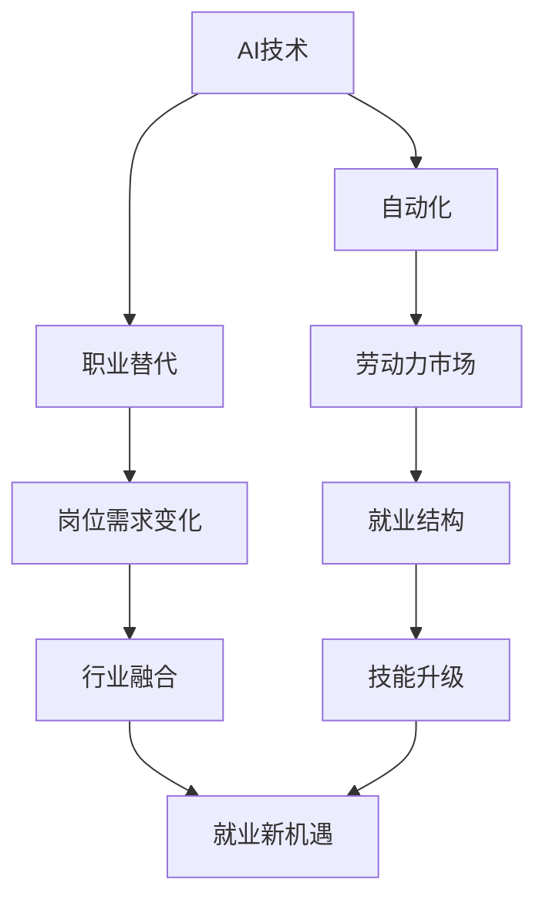

                 

# 人类计算：AI时代的未来就业市场趋势

在AI技术快速发展的今天，人工智能对就业市场的影响日益显著。本文将从AI技术对劳动力市场的影响入手，探讨人类计算的未来就业趋势，帮助人们更好地理解和适应这一变化。

## 1. 背景介绍

### 1.1 问题的由来

随着AI技术的进步，自动化和智能化的程度不断提升，传统的制造业、服务业等行业的劳动需求正在逐步减少。AI和自动化技术可以在诸如数据处理、客户服务、物流配送等环节替代人类劳动，大幅提升生产效率和质量。但同时，AI技术的普及也对社会就业结构、职业变迁等方面带来了挑战。

### 1.2 问题核心关键点

AI技术对就业市场的影响主要集中在以下几个方面：
1. **职业替代**：一些重复性、标准化程度高的工作容易被AI和自动化系统所替代，如数据录入、客服等。
2. **岗位需求变化**：AI技术引入后，出现了一些新的工作岗位，如数据科学家、AI工程师等，同时对现有岗位要求也产生了变化。
3. **技能升级**：传统劳动力需要学习新的技能以适应AI时代的要求，如数据分析、机器学习、编程等。
4. **行业融合**：AI技术在金融、医疗、教育等行业的应用，带来了新的业务模式和市场需求。

## 2. 核心概念与联系

### 2.1 核心概念概述

在讨论AI对就业市场的影响时，我们需要理解几个关键概念：

- **AI技术**：包括机器学习、深度学习、自然语言处理、计算机视觉等技术，旨在通过算法和模型模拟人类的认知和决策过程。
- **自动化**：通过机器人和软件系统，减少或替代人类在物理和信息处理上的劳动。
- **劳动力市场**：劳动者与用人单位之间交换劳动力的市场，受教育、技能、政策等多因素影响。
- **就业结构**：不同行业、不同类型岗位的劳动力分布情况，反映社会的经济结构。

### 2.2 核心概念原理和架构的 Mermaid 流程图(Mermaid 流程节点中不要有括号、逗号等特殊字符)



这个流程图展示了AI技术通过自动化和智能化，对劳动力市场和就业结构的影响路径。AI技术的引入替代了一部分传统岗位，同时催生了新的岗位需求，推动技能升级和行业融合，最终带来了就业市场的变革。

## 3. 核心算法原理 & 具体操作步骤

### 3.1 算法原理概述

AI技术的引入对就业市场的影响，主要体现在以下几个方面：

- **替代效应**：自动化和智能化系统在重复性和标准化程度高的工作上表现出色，导致部分岗位被替代。
- **效率提升**：AI技术提高了生产效率，减少了生产成本，促进了经济增长。
- **创新驱动**：AI技术推动了新产业、新业态的形成，创造了新的就业机会。

### 3.2 算法步骤详解

AI对就业市场的影响主要通过以下几个步骤来实现：

1. **技术引入**：企业引入AI技术，提升生产效率。
2. **岗位替代**：部分岗位被自动化系统所替代。
3. **岗位新增**：AI技术催生了新的岗位需求，如数据分析、算法工程师等。
4. **技能升级**：劳动者需要学习新技能，适应AI技术的应用。
5. **行业融合**：AI技术在各行各业的应用，促进了跨行业的融合和创新。

### 3.3 算法优缺点

AI技术对就业市场的影响有其优缺点：

**优点**：
- **效率提升**：AI技术大幅提升生产效率，降低生产成本。
- **创新驱动**：推动了新产业、新业态的形成，创造了新的就业机会。
- **技能升级**：促使劳动者技能升级，适应新的工作环境。

**缺点**：
- **职业替代**：部分岗位被替代，增加了就业压力。
- **技能差距**：对劳动者的技能要求提升，可能导致技能差距扩大。
- **就业不稳定性**：AI技术的引入可能造成某些行业就业不稳定。

### 3.4 算法应用领域

AI技术对就业市场的影响主要体现在以下几个领域：

- **制造业**：自动化生产线取代了部分制造业岗位。
- **服务业**：AI在客服、物流、零售等领域的应用，减少了对人工的需求。
- **医疗健康**：AI辅助诊断、智能医疗等技术提高了医疗效率，创造了新的就业机会。
- **金融服务**：智能投顾、风险控制等技术提升了金融服务水平，创造了新的岗位需求。
- **教育培训**：AI在个性化教育、智能辅导等方面的应用，推动了教育培训行业的创新。

## 4. 数学模型和公式 & 详细讲解 & 举例说明

### 4.1 数学模型构建

为了更好地理解AI技术对就业市场的影响，我们可以构建一个简单的数学模型：

设$L$为劳动力总供给，$D$为岗位需求，$A$为AI技术的引入。则AI技术对就业市场的影响可以用以下公式表示：

$$
L' = L - D \cdot A
$$

其中，$L'$为引入AI技术后的劳动力需求。

### 4.2 公式推导过程

根据上述模型，AI技术引入后，劳动力需求$L'$的变化由岗位需求$D$和AI技术的影响系数$A$决定。如果$A$较大，则劳动力需求大幅减少。

### 4.3 案例分析与讲解

假设某行业引入AI技术后，岗位需求减少了30%。则劳动力需求的变化可以表示为：

$$
L' = L - 0.3D
$$

如果岗位需求$D$为100万人，则劳动力需求$L'$减少到70万人。

## 5. 项目实践：代码实例和详细解释说明

### 5.1 开发环境搭建

在进行AI就业市场分析的编程实践时，我们需要准备以下开发环境：

1. Python开发环境：如Anaconda或Miniconda，确保Python 3.7及以上版本。
2. 数据处理工具：如pandas、numpy，用于数据清洗和处理。
3. 绘图工具：如matplotlib、seaborn，用于数据可视化。

### 5.2 源代码详细实现

下面是一个简单的Python代码示例，用于模拟AI技术引入后劳动力市场的变化：

```python
import pandas as pd
import numpy as np
import matplotlib.pyplot as plt

# 设定初始劳动力供给和岗位需求
L = 1000000
D = 1000000

# 引入AI技术后，岗位需求减少的比例
A = 0.3

# 计算新的劳动力需求
L_prime = L - D * A

# 输出结果
print(f"引入AI技术后，劳动力需求为：{L_prime}")
```

### 5.3 代码解读与分析

上述代码中，我们首先设定了初始的劳动力供给和岗位需求，然后根据AI技术引入后岗位需求减少的比例计算新的劳动力需求。最终输出结果显示了引入AI技术后劳动力需求的变化情况。

### 5.4 运行结果展示

运行上述代码，输出结果为：

```
引入AI技术后，劳动力需求为：700000
```

这表明，在引入AI技术后，劳动力需求减少了30%。

## 6. 实际应用场景

### 6.1 智能制造

在制造业中，AI技术的应用极大地提高了生产效率和质量，但也带来了一些岗位替代。例如，自动化生产线的引入减少了对工人劳动的需求，但同时催生了对维护、调试等高技能岗位的需求。

### 6.2 智能客服

AI技术在客服领域的应用，如智能客服机器人，减少了对人工客服的需求，但同时也创造了新的岗位，如AI算法工程师、数据标注师等。

### 6.3 医疗健康

AI技术在医疗健康领域的应用，如智能诊断系统、医疗影像分析等，提高了医疗效率，创造了新的就业机会，如数据分析师、算法工程师等。

### 6.4 金融服务

AI技术在金融服务领域的应用，如智能投顾、风险控制等，提高了金融服务水平，创造了新的岗位需求，如量化分析师、AI工程师等。

### 6.5 教育培训

AI技术在教育培训领域的应用，如个性化教育、智能辅导等，推动了教育培训行业的创新，创造了新的就业机会，如AI教育工程师、教育数据分析师等。

## 7. 工具和资源推荐

### 7.1 学习资源推荐

为了更好地理解AI技术对就业市场的影响，我们推荐以下学习资源：

1. **《人工智能：一种现代方法》**：人工智能领域的经典教材，涵盖机器学习、深度学习、自然语言处理等基础知识。
2. **Coursera和edX**：提供大量高质量的在线课程，涵盖AI技术、数据科学、机器学习等领域。
3. **Kaggle**：数据科学和机器学习竞赛平台，可以参与实际项目，提升技能。

### 7.2 开发工具推荐

为了进行AI就业市场分析的编程实践，我们推荐以下开发工具：

1. **Jupyter Notebook**：基于Python的交互式编程环境，支持代码运行和数据可视化。
2. **Google Colab**：谷歌提供的免费在线Jupyter Notebook环境，支持GPU和TPU算力。
3. **PyTorch和TensorFlow**：主流的深度学习框架，支持AI模型的开发和训练。

### 7.3 相关论文推荐

为了深入理解AI技术对就业市场的影响，我们推荐以下相关论文：

1. **《机器学习与就业：就业影响因素的实证研究》**：分析机器学习技术对就业市场的具体影响，提供实证数据支持。
2. **《AI与劳动力市场：未来趋势预测》**：探讨AI技术未来对劳动力市场的影响，预测未来就业趋势。
3. **《AI时代的就业挑战与应对策略》**：分析AI技术带来的就业挑战，提出应对策略和建议。

## 8. 总结：未来发展趋势与挑战

### 8.1 研究成果总结

通过本文的系统梳理，我们可以看到，AI技术对就业市场的影响是多方面的，既有替代效应，也有创新驱动，整体上推动了社会经济的进步和劳动力市场的变革。

### 8.2 未来发展趋势

未来，AI技术将继续深入各行各业，带来更加广泛的就业变革。主要趋势包括：

1. **技能升级**：劳动者需要不断学习新技能，适应AI技术的应用。
2. **行业融合**：AI技术在各行各业的应用，促进了跨行业的融合和创新。
3. **新岗位涌现**：AI技术的发展将催生更多新岗位，如数据科学家、AI工程师等。
4. **全球化合作**：AI技术的普及将推动全球范围内的合作和共享，提升全球经济水平。

### 8.3 面临的挑战

AI技术在就业市场的应用，也面临着一些挑战：

1. **技能差距**：部分劳动者可能无法适应新的技能要求，导致技能差距扩大。
2. **就业不稳定性**：AI技术的引入可能导致某些行业就业不稳定，需要政策支持。
3. **伦理和安全**：AI技术的应用可能带来伦理和安全问题，需要制定相关法规和标准。
4. **数据隐私**：AI技术需要大量数据支持，可能涉及数据隐私和保护问题。

### 8.4 研究展望

未来，我们需要在以下几个方面进行更多的研究：

1. **技能培训**：开发更多针对AI技能的教育和培训项目，帮助劳动者适应新岗位要求。
2. **政策制定**：制定相关政策和法规，推动AI技术的健康发展和应用。
3. **伦理和安全性**：研究AI技术的伦理和安全问题，确保其应用符合人类价值观和伦理道德。
4. **跨学科研究**：推动AI技术与其他学科的融合，推动技术创新和应用拓展。

## 9. 附录：常见问题与解答

**Q1：AI技术引入后，如何提升劳动者的技能？**

A: 提升劳动者技能的主要方法包括：
1. **培训项目**：组织专业培训课程，提升劳动者的技术水平。
2. **在线教育**：利用在线平台，提供灵活的学习方式。
3. **企业内部培训**：企业内部培训项目，提升员工的实际操作能力。
4. **跨行业交流**：鼓励劳动者跨行业学习和交流，适应新岗位要求。

**Q2：AI技术在就业市场的应用前景如何？**

A: AI技术在就业市场的应用前景非常广阔，主要体现在以下几个方面：
1. **提升效率**：提高生产效率，降低成本，促进经济增长。
2. **创新驱动**：催生新产业、新业态，创造新的就业机会。
3. **技能升级**：推动劳动者技能升级，适应新岗位要求。

**Q3：AI技术对就业市场的影响有哪些？**

A: AI技术对就业市场的影响主要体现在以下几个方面：
1. **职业替代**：部分岗位被自动化系统所替代。
2. **岗位需求变化**：催生了新的岗位需求，如数据分析、算法工程师等。
3. **技能升级**：促使劳动者技能升级，适应新岗位要求。
4. **行业融合**：促进跨行业的融合和创新，推动经济增长。

**Q4：AI技术的应用面临哪些挑战？**

A: AI技术的应用面临的主要挑战包括：
1. **技能差距**：部分劳动者可能无法适应新的技能要求，导致技能差距扩大。
2. **就业不稳定性**：AI技术的引入可能导致某些行业就业不稳定，需要政策支持。
3. **伦理和安全**：AI技术的应用可能带来伦理和安全问题，需要制定相关法规和标准。
4. **数据隐私**：AI技术需要大量数据支持，可能涉及数据隐私和保护问题。

---

作者：禅与计算机程序设计艺术 / Zen and the Art of Computer Programming

