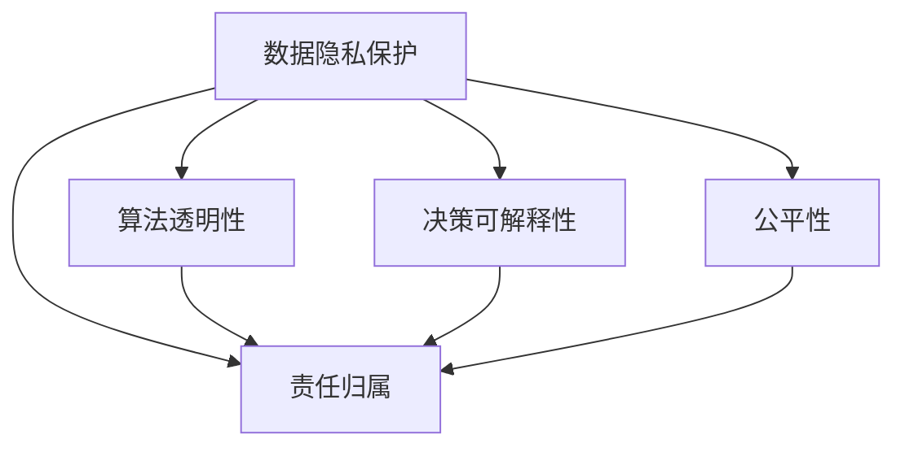

                 

## 1. 背景介绍

### 1.1 问题由来

近年来，人工智能（AI）技术的飞速发展，尤其是在计算机视觉、自然语言处理、推荐系统等领域取得了突破性进展，极大地改变了人类的生产和生活方式。然而，伴随着技术突破而来的是越来越多的伦理和社会责任问题，引起了社会各界的广泛关注。

人工智能系统，尤其是那些应用于医疗、金融、司法、教育等关键领域的AI系统，面临着数据隐私保护、算法透明性、决策可解释性、公平性和责任归属等道德和社会责任问题。这些问题不仅关乎AI技术的可持续发展和公众信任，也关乎AI系统是否能真正服务于人类社会，而不是成为新的风险源。

### 1.2 问题核心关键点

AI时代的道德和社会责任问题，涉及数据隐私保护、算法透明性、决策可解释性、公平性和责任归属等多个核心方面。这些问题通常彼此交织，难以独立解决，需要从整体上系统性地进行考量。

- **数据隐私保护**：如何在AI系统的设计和使用中保护数据隐私，防止数据泄露和滥用。
- **算法透明性**：如何保证AI算法的透明性，使其决策过程和输出结果可以被理解和解释。
- **决策可解释性**：如何让AI系统的决策过程和结果更加可解释，帮助用户理解其依据和合理性。
- **公平性**：如何避免算法偏见，确保AI系统在各种场景下公平、公正地对待所有用户。
- **责任归属**：在AI系统出现问题时，如何确定责任归属，确保责任人和监管机制的有效性。

这些核心问题，共同构成了AI时代道德和社会责任的复杂系统，亟需业界和学界的共同努力，找到合理有效的解决之道。

## 2. 核心概念与联系

### 2.1 核心概念概述

为更好地理解AI时代道德和社会责任问题，本节将介绍几个密切相关的核心概念：

- **AI伦理**：研究AI技术在设计和应用中涉及的道德、法律和社会问题，包括数据隐私、算法透明性、决策可解释性等。
- **算法透明性**：指AI算法的设计和实现过程，特别是其决策逻辑和参数，应该尽可能透明，便于外界理解和监督。
- **决策可解释性**：AI系统在做出决策时，应该提供足够的理由和依据，使得用户能够理解和信任其输出结果。
- **公平性**：指AI系统在处理数据和做出决策时，不应该有歧视性，对所有用户平等对待。
- **责任归属**：指AI系统在出现问题时，如何确定责任归属，包括开发者的责任、用户的责任、监管机构的责任等。

这些核心概念之间的逻辑关系可以通过以下Mermaid流程图来展示：



这个流程图展示了大语言模型的核心概念及其之间的关系：

1. 数据隐私保护是AI系统设计的基础，保障数据安全是AI系统正常运行的前提。
2. 算法透明性是保证决策可解释性的基础，透明性越高，可解释性越好。
3. 决策可解释性是用户信任AI系统的关键，可解释性越强，用户越容易接受。
4. 公平性是AI系统公正性的体现，只有在各个方面都公平，才能得到广泛的社会接受。
5. 责任归属是确保AI系统责任明确和有效的保障，责任明确才能在出现问题时进行有效的补救和改进。

这些概念共同构成了AI系统设计和应用的基本框架，确保AI技术能够真正服务于人类社会，而不是带来新的风险。

## 3. 核心算法原理 & 具体操作步骤

### 3.1 算法原理概述

AI时代的道德和社会责任问题，主要源于AI系统的设计和应用过程中，数据隐私、算法透明性、决策可解释性、公平性和责任归属等核心概念的缺失。因此，从根本上解决这些问题的关键，在于设计和实现更加透明、可解释、公平和负责任的AI系统。

以下是几个关键算法和操作步骤的概述：

- **数据隐私保护**：通过差分隐私、联邦学习等技术，在数据收集和使用过程中保护用户隐私。
- **算法透明性**：使用模型可解释技术，如LIME、SHAP等，帮助理解AI算法的内部逻辑和决策依据。
- **决策可解释性**：设计可解释性模型，如决策树、规则系统等，使得AI系统的决策过程和结果更加可解释。
- **公平性**：引入公平性约束，如平衡优化、公平算法等，确保AI系统在处理数据时能够实现公平对待。
- **责任归属**：建立明确的责任机制，如责任保险、法律责任归属等，确保AI系统出现问题时有明确的责任人。

### 3.2 算法步骤详解

以下是基于上述核心概念的AI系统设计和应用的详细步骤：

**Step 1: 数据隐私保护**

1. **数据收集**：在数据收集阶段，采用差分隐私技术，对用户数据进行匿名化处理，防止数据泄露。例如，使用Laplace噪声或高斯噪声对数据进行扰动，确保单条数据无法被识别。
2. **数据存储**：在数据存储阶段，采用联邦学习技术，数据分散存储在各个节点上，不集中存储在单一中心服务器。例如，使用联邦平均算法，各节点独立训练模型，并将模型参数差异化传递，防止数据集中存储。

**Step 2: 算法透明性**

1. **模型选择**：选择透明性较高的模型，如决策树、规则系统等，避免使用复杂黑盒模型，如深度神经网络。
2. **可解释技术**：引入可解释性技术，如LIME、SHAP等，分析模型的内部逻辑和决策依据。例如，使用LIME对模型的输出进行局部线性逼近，帮助理解模型在特定输入下的行为。

**Step 3: 决策可解释性**

1. **设计可解释模型**：设计可解释性模型，如决策树、规则系统等，使得AI系统的决策过程和结果更加可解释。例如，使用规则系统，将模型决策过程转化为简单的规则集合，便于用户理解和接受。
2. **解释工具**：引入解释工具，如Model Analyzer、Decision Explorer等，帮助用户理解和调试模型决策。例如，使用Model Analyzer可视化模型特征和权重，帮助用户理解模型的输入输出关系。

**Step 4: 公平性**

1. **公平约束**：引入公平性约束，如平衡优化、公平算法等，确保AI系统在处理数据时能够实现公平对待。例如，使用 fairness aware 算法，在模型训练过程中引入公平性约束，防止模型出现歧视。
2. **公平评估**：在模型部署前，对模型进行公平性评估，确保模型在不同人群上的表现一致。例如，使用 fairness-aware evaluation 指标，评估模型在不同人群上的差异性。

**Step 5: 责任归属**

1. **责任机制**：建立明确的责任机制，如责任保险、法律责任归属等，确保AI系统出现问题时有明确的责任人。例如，使用责任保险制度，对AI系统的错误进行赔偿和补救。
2. **监管机制**：建立监管机制，如独立审核、第三方评估等，确保AI系统的合规性和透明度。例如，使用独立审核机制，定期对AI系统进行审核和评估，确保其符合伦理和社会责任要求。

### 3.3 算法优缺点

AI时代道德和社会责任问题的解决，依赖于上述核心概念的全面实现。这些方法和技术，在提升AI系统透明度、可解释性、公平性和责任归属方面具有以下优点：

1. **提升透明度和可解释性**：通过差分隐私、联邦学习、可解释性技术等，使得AI系统在数据收集、模型训练和决策过程中，更加透明和可解释，提升用户信任和接受度。
2. **保证公平性**：通过公平性约束和公平评估等技术，确保AI系统在处理数据时，对所有人群公平公正，防止歧视和偏见。
3. **明确责任归属**：通过责任机制和监管机制，确保AI系统出现问题时，有明确的责任人进行补救和改进，保护用户权益和公共利益。

然而，这些方法也存在一些局限性：

1. **技术复杂性**：差分隐私、联邦学习、可解释性技术等，技术实现较为复杂，需要大量的技术和人力资源支持。
2. **性能损失**：在数据隐私保护和算法透明性方面，可能引入一定的性能损失，影响AI系统的效率和准确性。
3. **公平性挑战**：公平性问题往往具有复杂性，不同人群之间存在多维度的差异，如何平衡不同群体的需求，仍然是一个挑战。
4. **责任归属问题**：在AI系统出现问题时，责任归属问题往往涉及多方利益，如何明确各方的责任，仍然是一个难题。

尽管存在这些局限性，但总体而言，这些方法和技术在提升AI系统道德和社会责任方面具有重要的意义，能够为AI技术的可持续发展提供有力保障。

### 3.4 算法应用领域

基于上述核心概念和方法，AI时代道德和社会责任问题在多个领域得到了广泛应用，以下是几个典型应用场景：

- **医疗领域**：在医疗领域，保护患者隐私、确保算法透明性和公平性、明确责任归属，是构建可信医疗AI系统的关键。例如，在智能诊断系统中，使用差分隐私技术保护患者隐私，使用可解释性技术帮助医生理解AI诊断结果，使用公平算法确保模型在所有人群上的公平性。
- **金融领域**：在金融领域，保护客户隐私、确保算法透明性和公平性、明确责任归属，是构建可信金融AI系统的关键。例如，在信贷评估系统中，使用差分隐私技术保护客户隐私，使用可解释性技术帮助银行理解AI评估结果，使用公平算法确保模型在所有人群上的公平性。
- **司法领域**：在司法领域，确保算法透明性和决策可解释性、避免算法偏见、明确责任归属，是构建可信司法AI系统的关键。例如，在犯罪预测系统中，使用可解释性技术帮助法官理解AI预测结果，使用公平算法确保模型在所有人群上的公平性，使用责任保险制度对AI系统的错误进行赔偿和补救。

除了上述这些领域，AI时代的道德和社会责任问题在教育、交通、能源等多个领域都有重要应用，推动这些领域向更加透明、公平和可信的方向发展。

## 4. 数学模型和公式 & 详细讲解  
### 4.1 数学模型构建

本节将使用数学语言对AI系统道德和社会责任问题的解决进行更加严格的刻画。

假设AI系统在处理数据时，涉及的数据集为 $D=\{(x_i,y_i)\}_{i=1}^N, x_i \in \mathcal{X}, y_i \in \mathcal{Y}$，其中 $\mathcal{X}$ 为输入空间，$\mathcal{Y}$ 为输出空间。

定义数据隐私保护模型为 $P$，算法透明性模型为 $T$，决策可解释性模型为 $E$，公平性模型为 $F$，责任归属模型为 $R$。

模型 $P$、$T$、$E$、$F$、$R$ 的输出分别为：

$$
P = \mathop{\arg\min}_{\theta} \mathcal{L}_P(D) \\
T = \mathop{\arg\min}_{\theta} \mathcal{L}_T(D) \\
E = \mathop{\arg\min}_{\theta} \mathcal{L}_E(D) \\
F = \mathop{\arg\min}_{\theta} \mathcal{L}_F(D) \\
R = \mathop{\arg\min}_{\theta} \mathcal{L}_R(D)
$$

其中 $\mathcal{L}_P$、$\mathcal{L}_T$、$\mathcal{L}_E$、$\mathcal{L}_F$、$\mathcal{L}_R$ 分别表示不同模型在数据集 $D$ 上的损失函数。

### 4.2 公式推导过程

以下我们以差分隐私为例，推导其在数据隐私保护中的实现方法。

假设数据集 $D=\{(x_i,y_i)\}_{i=1}^N$，其中 $x_i \in \mathcal{X}, y_i \in \mathcal{Y}$。差分隐私的目标是在数据集 $D$ 上，通过加入随机噪声，使得相邻数据集的输出差别不超过 $\epsilon$ 和 $\delta$。

具体而言，差分隐私的实现步骤如下：

1. 对每个样本 $x_i$，加入随机噪声 $\epsilon_i$，得到 $\tilde{x_i}$。
2. 训练模型 $M$ 在 $\{\tilde{x_i}\}_{i=1}^N$ 上的损失函数 $\mathcal{L}(M,\{\tilde{x_i}\})$。
3. 输出模型 $M$ 在 $\{\tilde{x_i}\}_{i=1}^N$ 上的预测结果。

其中，随机噪声 $\epsilon_i$ 的生成方式可以采用拉普拉斯噪声或高斯噪声等。

差分隐私的目标函数为：

$$
\mathcal{L}_P(D) = \mathop{\arg\min}_{\theta} \frac{1}{N} \sum_{i=1}^N \ell(M(\tilde{x_i}),y_i) + \epsilon
$$

其中，$\ell$ 表示损失函数，$\epsilon$ 表示拉普拉斯噪声或高斯噪声的参数。

通过差分隐私技术，可以在数据收集和使用过程中保护用户隐私，防止数据泄露和滥用。

## 5. 项目实践：代码实例和详细解释说明
### 5.1 开发环境搭建

在进行AI系统道德和社会责任问题解决实践前，我们需要准备好开发环境。以下是使用Python进行PyTorch开发的环境配置流程：

1. 安装Anaconda：从官网下载并安装Anaconda，用于创建独立的Python环境。

2. 创建并激活虚拟环境：
```bash
conda create -n pytorch-env python=3.8 
conda activate pytorch-env
```

3. 安装PyTorch：根据CUDA版本，从官网获取对应的安装命令。例如：
```bash
conda install pytorch torchvision torchaudio cudatoolkit=11.1 -c pytorch -c conda-forge
```

4. 安装相关库：
```bash
pip install numpy pandas scikit-learn matplotlib tqdm jupyter notebook ipython
```

完成上述步骤后，即可在`pytorch-env`环境中开始实践。

### 5.2 源代码详细实现

下面我们以差分隐私为例，给出使用PyTorch实现差分隐私的Python代码实现。

```python
import torch
import torch.nn as nn
import torch.optim as optim
from sklearn.metrics import accuracy_score
from torch.utils.data import DataLoader
from torchvision import datasets, transforms

# 定义差分隐私保护函数
def differential_privacy(data_loader, model, epsilon=1e-6, delta=1e-6):
    criterion = nn.CrossEntropyLoss()
    optimizer = optim.Adam(model.parameters(), lr=0.001)
    noise = torch.randn_like(model(x)) * epsilon
    for batch_idx, (data, target) in enumerate(data_loader):
        data = data + noise
        optimizer.zero_grad()
        output = model(data)
        loss = criterion(output, target)
        loss.backward()
        optimizer.step()
    return model

# 加载数据集
transform = transforms.Compose([
    transforms.ToTensor(),
    transforms.Normalize((0.5,), (0.5,))
])
train_dataset = datasets.CIFAR10(root='./data', train=True, download=True, transform=transform)
test_dataset = datasets.CIFAR10(root='./data', train=False, download=True, transform=transform)
train_loader = DataLoader(train_dataset, batch_size=32, shuffle=True)
test_loader = DataLoader(test_dataset, batch_size=32, shuffle=False)

# 加载预训练模型
model = torchvision.models.resnet18(pretrained=True)
model = differential_privacy(train_loader, model)

# 评估模型性能
correct = 0
total = 0
with torch.no_grad():
    for data, target in test_loader:
        output = model(data)
        _, predicted = torch.max(output, 1)
        total += target.size(0)
        correct += (predicted == target).sum().item()
accuracy = correct / total * 100
print(f'Accuracy: {accuracy:.2f}%')
```

### 5.3 代码解读与分析

让我们再详细解读一下关键代码的实现细节：

**差分隐私保护函数**：
- 定义差分隐私保护函数，接收数据集、模型、拉普拉斯噪声参数 $\epsilon$ 和 $\delta$。
- 使用交叉熵损失函数作为模型损失，Adam优化器进行优化。
- 对数据集进行拉普拉斯噪声扰动，得到扰动后的数据集 $\tilde{D}$。
- 在每个批次上，前向传播计算损失函数，反向传播更新模型参数。
- 返回差分隐私保护后的模型。

**加载数据集和模型**：
- 使用CIFAR-10数据集，加载训练集和测试集。
- 使用预训练的ResNet-18模型。
- 对训练集进行差分隐私保护，返回保护后的模型。

**评估模型性能**：
- 在测试集上，计算模型准确率。
- 输出最终准确率。

可以看到，差分隐私保护函数的代码实现较为简洁，但涉及的逻辑较为复杂，需要理解差分隐私的基本原理和实现方法。

## 6. 实际应用场景
### 6.1 医疗领域

在医疗领域，AI系统的道德和社会责任问题尤为突出。医疗数据往往包含大量敏感信息，如病历、基因数据等，一旦泄露将带来严重的隐私和安全问题。

为了保护患者隐私，医疗机构可以使用差分隐私技术对患者数据进行匿名化处理，防止数据泄露。同时，引入可解释性技术，帮助医生理解AI诊断结果，确保模型公平性，避免对不同人群的歧视性对待。

例如，在智能诊断系统中，使用差分隐私技术保护患者隐私，使用可解释性技术帮助医生理解AI诊断结果，使用公平算法确保模型在所有人群上的公平性。

### 6.2 金融领域

在金融领域，AI系统的道德和社会责任问题主要集中在数据隐私和算法透明性方面。金融数据往往包含大量个人敏感信息，如收入、信用记录等，一旦泄露将带来严重的隐私和安全问题。

为了保护客户隐私，金融机构可以使用差分隐私技术对客户数据进行匿名化处理，防止数据泄露。同时，引入可解释性技术，帮助银行理解AI评估结果，确保模型公平性，避免对不同人群的歧视性对待。

例如，在信贷评估系统中，使用差分隐私技术保护客户隐私，使用可解释性技术帮助银行理解AI评估结果，使用公平算法确保模型在所有人群上的公平性。

### 6.3 司法领域

在司法领域，AI系统的道德和社会责任问题主要集中在算法透明性和决策可解释性方面。司法数据往往包含大量敏感信息，如犯罪记录、个人信息等，一旦泄露将带来严重的隐私和安全问题。

为了确保算法透明性和决策可解释性，司法机构可以使用可解释性技术，帮助法官理解AI预测结果，确保模型公平性，避免对不同人群的歧视性对待。同时，建立明确的责任机制，确保AI系统出现问题时有明确的责任人进行补救和改进。

例如，在犯罪预测系统中，使用可解释性技术帮助法官理解AI预测结果，使用公平算法确保模型在所有人群上的公平性，使用责任保险制度对AI系统的错误进行赔偿和补救。

## 7. 工具和资源推荐
### 7.1 学习资源推荐

为了帮助开发者系统掌握AI系统道德和社会责任问题的解决，这里推荐一些优质的学习资源：

1. 《人工智能伦理与法律》书籍：由知名AI伦理专家撰写，全面介绍了AI伦理、法律和社会责任问题的基本概念和前沿研究。
2. 《算法透明性与可解释性》课程：由斯坦福大学开设的算法透明性和可解释性课程，有Lecture视频和配套作业，带你入门算法透明性和可解释性技术。
3. 《AI伦理与社会责任》论文：多篇经典论文，探讨了AI伦理、法律和社会责任问题，提供了丰富的研究视角和方法。

通过对这些资源的学习实践，相信你一定能够快速掌握AI系统道德和社会责任问题的解决精髓，并用于解决实际的AI问题。

### 7.2 开发工具推荐

高效的开发离不开优秀的工具支持。以下是几款用于AI系统道德和社会责任问题解决的常用工具：

1. TensorFlow：由Google主导开发的开源深度学习框架，生产部署方便，适合大规模工程应用。
2. PyTorch：基于Python的开源深度学习框架，灵活动态的计算图，适合快速迭代研究。
3. Weights & Biases：模型训练的实验跟踪工具，可以记录和可视化模型训练过程中的各项指标，方便对比和调优。
4. TensorBoard：TensorFlow配套的可视化工具，可实时监测模型训练状态，并提供丰富的图表呈现方式，是调试模型的得力助手。

合理利用这些工具，可以显著提升AI系统道德和社会责任问题解决的开发效率，加快创新迭代的步伐。

### 7.3 相关论文推荐

AI系统道德和社会责任问题的发展源于学界的持续研究。以下是几篇奠基性的相关论文，推荐阅读：

1. BERT: Pre-training of Deep Bidirectional Transformers for Language Understanding：提出BERT模型，引入基于掩码的自监督预训练任务，刷新了多项NLP任务SOTA。
2. Algorithmic Fairness Through Awareness：提出 fairness aware 算法，在模型训练过程中引入公平性约束，防止模型出现歧视。
3. The Moral Machine：探讨了AI伦理和道德问题的社会影响，提出了一系列解决AI伦理问题的建议。

这些论文代表了大语言模型道德和社会责任问题的研究脉络。通过学习这些前沿成果，可以帮助研究者把握学科前进方向，激发更多的创新灵感。

## 8. 总结：未来发展趋势与挑战

### 8.1 总结

本文对AI系统道德和社会责任问题进行了全面系统的介绍。首先阐述了AI系统在设计和应用过程中，数据隐私保护、算法透明性、决策可解释性、公平性和责任归属等核心概念的缺失，明确了这些问题对AI技术的可持续发展和公众信任的重要性。其次，从差分隐私、可解释性、公平性、责任机制等方面，详细讲解了AI系统道德和社会责任问题的解决方法和操作步骤。最后，通过医疗、金融、司法等多个实际应用场景，展示了AI系统道德和社会责任问题的广泛应用前景。

通过本文的系统梳理，可以看到，AI系统道德和社会责任问题不仅涉及技术层面，还涉及伦理、法律、社会等多个维度，是一个复杂的多学科交叉问题。AI系统只有全面考虑这些因素，才能真正实现其价值，服务于人类社会。

### 8.2 未来发展趋势

展望未来，AI系统道德和社会责任问题的发展趋势如下：

1. **技术进步**：差分隐私、可解释性、公平性等技术将不断进步，提升AI系统的道德和社会责任水平。例如，差分隐私技术将更加高效，可解释性算法将更加准确，公平性算法将更加全面。
2. **社会共识**：社会各界对AI伦理和道德问题的关注度将不断提高，形成广泛的社会共识。例如，政府、企业、学术界将共同努力，制定AI伦理规范，引导AI技术健康发展。
3. **跨学科融合**：AI系统道德和社会责任问题的解决将更加依赖跨学科融合。例如，将社会学、伦理学、法律学等学科知识与AI技术结合，形成更加全面、系统的解决方案。

### 8.3 面临的挑战

尽管AI系统道德和社会责任问题在不断进步，但在实际应用中仍面临诸多挑战：

1. **技术复杂性**：差分隐私、可解释性、公平性等技术实现较为复杂，需要大量的技术和人力资源支持。例如，差分隐私技术需要复杂的噪声生成和数据扰动过程，可解释性算法需要复杂的特征分析和模型分析过程。
2. **性能损失**：在数据隐私保护和算法透明性方面，可能引入一定的性能损失，影响AI系统的效率和准确性。例如，差分隐私技术可能导致模型性能下降，可解释性算法可能增加模型复杂度。
3. **公平性挑战**：公平性问题往往具有复杂性，不同人群之间存在多维度的差异，如何平衡不同群体的需求，仍然是一个挑战。例如，在信贷评估系统中，如何平衡不同群体的贷款需求，仍然是一个难题。
4. **责任归属问题**：在AI系统出现问题时，责任归属问题往往涉及多方利益，如何明确各方的责任，仍然是一个难题。例如，在智能诊断系统中，一旦出现误诊，如何明确医生和AI系统的责任，仍然是一个难题。

尽管存在这些挑战，但总体而言，这些方法和技术在提升AI系统道德和社会责任方面具有重要的意义，能够为AI技术的可持续发展提供有力保障。

### 8.4 研究展望

面对AI系统道德和社会责任问题所面临的挑战，未来的研究需要在以下几个方面寻求新的突破：

1. **跨学科合作**：将社会学、伦理学、法律学等学科知识与AI技术结合，形成更加全面、系统的解决方案。例如，将社会学理论应用于AI伦理研究，制定更加合理的伦理规范。
2. **技术优化**：优化差分隐私、可解释性、公平性等技术，降低技术复杂性，提升性能。例如，研发更加高效的差分隐私算法，更加准确的可解释性算法，更加全面的公平性算法。
3. **政策制定**：政府和企业应共同努力，制定AI伦理规范，引导AI技术健康发展。例如，制定AI伦理法规，规范AI技术的开发和应用。

这些研究方向的探索，必将引领AI系统道德和社会责任问题迈向更高的台阶，为AI技术的可持续发展提供有力保障。面向未来，AI系统道德和社会责任问题需要从技术、伦理、法律等多方面综合考虑，才能真正实现其价值，服务于人类社会。

## 9. 附录：常见问题与解答

**Q1：如何平衡AI系统的性能和道德/社会责任？**

A: 平衡AI系统的性能和道德/社会责任是一个复杂的问题，需要综合考虑多个因素。

1. **技术优化**：通过优化差分隐私、可解释性、公平性等技术，降低技术复杂性，提升性能。例如，研发更加高效的差分隐私算法，更加准确的可解释性算法，更加全面的公平性算法。
2. **参数调优**：通过调整模型参数，在保证道德/社会责任的前提下，提升系统性能。例如，在差分隐私技术中，调整噪声参数，平衡隐私保护和模型性能。
3. **业务需求分析**：根据业务需求和场景特点，合理平衡性能和道德/社会责任。例如，在医疗领域，隐私保护更为重要，可以适当降低系统性能，确保数据安全。

**Q2：如何确保AI系统的公平性？**

A: 确保AI系统的公平性是一个复杂的问题，需要综合考虑多个因素。

1. **数据平衡**：在数据集构建过程中，确保不同人群的数据数量平衡，避免数据偏见。例如，在信贷评估系统中，确保不同人群的贷款数据数量一致。
2. **公平算法**：引入公平性算法，在模型训练过程中引入公平性约束，防止模型出现歧视。例如，使用 fairness aware 算法，在模型训练过程中引入公平性约束。
3. **公平评估**：在模型部署前，对模型进行公平性评估，确保模型在不同人群上的表现一致。例如，使用 fairness-aware evaluation 指标，评估模型在不同人群上的差异性。

**Q3：如何确保AI系统的可解释性？**

A: 确保AI系统的可解释性是一个复杂的问题，需要综合考虑多个因素。

1. **可解释性算法**：使用可解释性算法，分析模型的内部逻辑和决策依据。例如，使用 LIME 对模型的输出进行局部线性逼近，帮助理解模型在特定输入下的行为。
2. **可解释性工具**：引入可解释性工具，帮助用户理解和调试模型决策。例如，使用 Model Analyzer 可视化模型特征和权重，帮助用户理解模型的输入输出关系。
3. **业务需求分析**：根据业务需求和场景特点，合理选择可解释性技术。例如，在医疗领域，可解释性技术需要更加详细和透明，确保医生和患者信任模型的输出。

**Q4：如何确保AI系统的隐私保护？**

A: 确保AI系统的隐私保护是一个复杂的问题，需要综合考虑多个因素。

1. **差分隐私技术**：使用差分隐私技术，在数据收集和使用过程中保护用户隐私。例如，使用拉普拉斯噪声或高斯噪声对数据进行扰动。
2. **联邦学习技术**：使用联邦学习技术，数据分散存储在各个节点上，不集中存储在单一中心服务器。例如，使用联邦平均算法，各节点独立训练模型，并将模型参数差异化传递。
3. **数据脱敏技术**：在数据存储和传输过程中，使用数据脱敏技术，防止数据泄露。例如，对敏感数据进行模糊化处理，防止数据被识别。

**Q5：如何确保AI系统的责任归属？**

A: 确保AI系统的责任归属是一个复杂的问题，需要综合考虑多个因素。

1. **责任保险制度**：建立责任保险制度，对AI系统的错误进行赔偿和补救。例如，在智能诊断系统中，使用责任保险制度对误诊进行赔偿。
2. **独立审核机制**：建立独立审核机制，对AI系统进行定期审核和评估，确保其符合伦理和社会责任要求。例如，在金融领域，定期对AI系统进行独立审核，确保其公平性和透明性。
3. **法律责任归属**：制定法律责任归属机制，明确各方的责任。例如，在智能诊断系统中，明确医生和AI系统的责任归属，确保责任人和监管机制的有效性。

**Q6：如何确保AI系统的透明度？**

A: 确保AI系统的透明度是一个复杂的问题，需要综合考虑多个因素。

1. **透明性算法**：使用透明性算法，在模型训练和推理过程中提供足够的理由和依据。例如，使用可解释性算法，帮助用户理解AI系统的决策过程和结果。
2. **透明性工具**：引入透明性工具，帮助用户理解和调试AI系统。例如，使用 Model Analyzer 可视化模型特征和权重，帮助用户理解模型的输入输出关系。
3. **业务需求分析**：根据业务需求和场景特点，合理选择透明性技术。例如，在金融领域，透明性技术需要更加详细和透明，确保用户信任AI系统的输出。

---

作者：禅与计算机程序设计艺术 / Zen and the Art of Computer Programming

