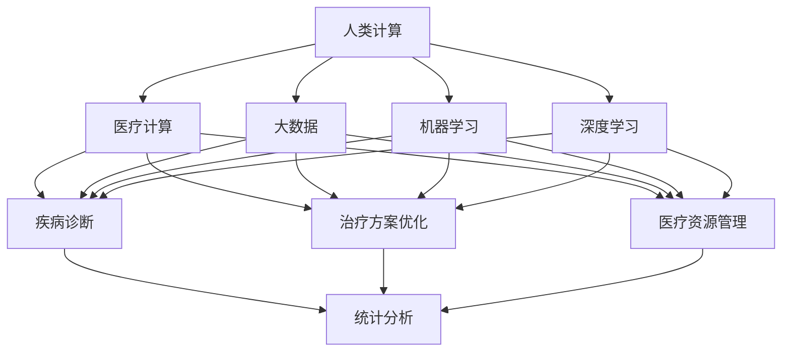

                 

# 人类计算：医疗保健领域的应用

## 1. 背景介绍

在当今数字化、智能化的浪潮中，计算技术已经深入各行各业，成为推动社会进步的关键力量。医疗保健领域也不例外。随着人工智能（AI）、大数据、云计算等技术的广泛应用，医疗计算正在迅速崛起，成为医疗创新的一大引擎。本文将深入探讨人类计算在医疗保健领域的应用，展示其在疾病诊断、治疗方案优化、医疗资源管理等方面的巨大潜力，并探讨未来发展的趋势与挑战。

## 2. 核心概念与联系

### 2.1 核心概念概述

为更好地理解人类计算在医疗保健中的应用，我们先介绍几个核心概念：

- **人类计算（Human Computing）**：指通过非人类计算系统（如计算机、AI等）辅助或替代人类完成计算任务，以提高计算效率和质量的技术和实践。
- **医疗计算（Medical Computing）**：指在医疗领域应用计算技术，提升诊断、治疗、管理等各个环节的效率和准确性的技术和方法。
- **大数据（Big Data）**：指规模庞大、多样性丰富、更新速度快的数据集，常用于医疗计算中的统计分析、模式识别、预测建模等。
- **机器学习（Machine Learning）**：指通过数据训练算法模型，使计算机能够自动学习、推理和决策的技术。
- **深度学习（Deep Learning）**：指通过多层神经网络构建的高级机器学习模型，用于复杂模式识别、自然语言处理等任务。
- **计算伦理学（Computational Ethics）**：指在计算技术应用中考虑伦理道德问题，如数据隐私、算法公正性、算法透明性等。

这些核心概念之间的联系可以通过以下Mermaid流程图来展示：



这个流程图展示了大数据、机器学习、深度学习等计算技术如何支撑医疗计算的各个环节，以及人类计算在医疗领域的多方面应用。

## 3. 核心算法原理 & 具体操作步骤
### 3.1 算法原理概述

人类计算在医疗保健领域的应用，主要依赖于先进的计算技术和数据分析方法。以下是几个关键算法原理：

1. **机器学习算法**：通过历史数据训练模型，预测疾病发生概率、分析病情趋势等。
2. **深度学习算法**：处理复杂的非线性关系，进行图像识别、自然语言处理等。
3. **自然语言处理（NLP）**：从文本数据中提取关键信息，用于诊断、问诊、电子病历分析等。
4. **模拟与建模**：利用数学模型模拟疾病传播、药物作用等过程，辅助决策。

### 3.2 算法步骤详解

以疾病诊断为例，说明基于人类计算的算法步骤：

1. **数据收集**：收集历史病例数据、实验室检查结果、影像数据等。
2. **数据预处理**：清洗、归一化、特征提取等，确保数据质量。
3. **模型训练**：选择合适的算法模型，如随机森林、神经网络等，在标注数据上训练。
4. **模型评估**：使用测试集评估模型性能，调整参数以提高准确率。
5. **模型应用**：将训练好的模型应用于新病例的诊断。

### 3.3 算法优缺点

人类计算在医疗保健领域的应用具有以下优点：

- **高效性**：快速处理大量数据，提高诊断和治疗效率。
- **准确性**：利用复杂算法，提高诊断和治疗的准确性。
- **可扩展性**：算法模型可部署在多台计算设备上，实现并行处理。

但同时也存在以下缺点：

- **数据质量要求高**：模型训练依赖高质量的标注数据，数据偏差可能导致误诊。
- **算法复杂度高**：复杂的算法需要较高的计算资源和时间。
- **解释性不足**：深度学习等算法通常是"黑箱"模型，难以解释其决策过程。

### 3.4 算法应用领域

人类计算在医疗保健领域的应用领域广泛，包括但不限于：

- **疾病诊断**：利用机器学习模型进行影像诊断、病理分析等。
- **治疗方案优化**：结合基因数据、影像数据等，优化治疗方案。
- **医疗资源管理**：通过数据分析，优化医院资源配置、患者流量管理等。
- **药物研发**：利用计算模拟，加速新药研发过程。

## 4. 数学模型和公式 & 详细讲解 & 举例说明
### 4.1 数学模型构建

以疾病诊断为例，构建数学模型：

设 $X = (x_1, x_2, \ldots, x_n)$ 为患者的历史病例数据，$Y$ 为疾病标签。构建模型 $f: X \rightarrow Y$，通过历史数据 $(x_1, y_1), (x_2, y_2), \ldots, (x_m, y_m)$ 训练模型，使得模型在新的病例数据 $(x_{m+1}, \ldots, x_{m+n})$ 上能够准确预测 $Y$。

### 4.2 公式推导过程

假设使用随机森林模型进行疾病诊断，其推导过程如下：

1. **数据集划分**：将数据集分为训练集 $D_{train}$ 和测试集 $D_{test}$。
2. **特征选择**：从 $X$ 中选择 $k$ 个特征 $(x_1, x_2, \ldots, x_k)$。
3. **树模型训练**：构建 $n$ 棵决策树，对 $D_{train}$ 进行训练。
4. **结果集成**：对 $D_{test}$ 上的每个新样本 $x_{m+1}$，利用 $n$ 棵树的预测结果进行集成，得到最终诊断结果 $y$。

### 4.3 案例分析与讲解

假设有一个乳腺癌诊断系统，利用历史病例数据训练随机森林模型，并在新病例上进行预测。通过特征选择，选择了 $k=5$ 个关键特征，构建了 $n=100$ 棵决策树，模型训练后，对新病例 $x_{m+1}$ 的预测结果为 $y$。

## 5. 项目实践：代码实例和详细解释说明
### 5.1 开发环境搭建

为了进行人类计算在医疗保健领域的实践，我们需要准备好开发环境。以下是使用Python进行医疗计算的开发环境配置流程：

1. 安装Anaconda：从官网下载并安装Anaconda，用于创建独立的Python环境。
2. 创建并激活虚拟环境：
```bash
conda create -n medical-env python=3.8 
conda activate medical-env
```

3. 安装必要的库：
```bash
conda install pandas numpy scikit-learn matplotlib jupyter notebook
```

4. 安装医疗计算相关的库：
```bash
pip install biopython medpy scikit-image
```

完成上述步骤后，即可在`medical-env`环境中开始医疗计算的实践。

### 5.2 源代码详细实现

以下是一个使用Python和Scikit-learn库进行疾病诊断的代码实现。

```python
import pandas as pd
import numpy as np
from sklearn.ensemble import RandomForestClassifier
from sklearn.model_selection import train_test_split
from sklearn.metrics import accuracy_score

# 数据准备
data = pd.read_csv('medical_data.csv')
X = data.iloc[:, :-1]
y = data.iloc[:, -1]

# 数据预处理
X_train, X_test, y_train, y_test = train_test_split(X, y, test_size=0.2, random_state=42)

# 模型训练
clf = RandomForestClassifier(n_estimators=100, random_state=42)
clf.fit(X_train, y_train)

# 模型评估
y_pred = clf.predict(X_test)
accuracy = accuracy_score(y_test, y_pred)
print('Accuracy:', accuracy)
```

### 5.3 代码解读与分析

让我们再详细解读一下关键代码的实现细节：

**数据准备**：
- `pandas`用于读取和处理医疗数据，`numpy`用于数组计算。
- 将数据集分为特征矩阵 $X$ 和标签 $y$。

**数据预处理**：
- 使用`train_test_split`将数据集分为训练集和测试集。
- 使用随机森林模型 `RandomForestClassifier` 进行训练。

**模型评估**：
- 使用 `accuracy_score` 计算模型在测试集上的准确率。

### 5.4 运行结果展示

运行上述代码后，可以得到模型在测试集上的准确率，具体数值根据数据集和模型参数的不同而有所差异。

## 6. 实际应用场景
### 6.1 智能诊断系统

基于人类计算的医疗智能诊断系统，可以大幅提升诊断效率和准确性。传统医疗诊断依赖于医生的经验和直觉，容易出现误诊或漏诊。而使用计算模型进行辅助诊断，能够利用大数据和先进算法，快速分析海量数据，提供精准的诊断建议。

在技术实现上，可以收集历史病历、实验室检查结果、影像数据等，构建模型进行训练。微调模型后的诊断系统，能够实时接收医生输入的病历，自动分析诊断，并提供治疗建议，辅助医生进行决策。

### 6.2 治疗方案优化

治疗方案优化是医疗计算的重要应用之一。传统治疗方法往往基于经验和临床试验结果，难以应对复杂病情。利用计算模型，可以对多种治疗方案进行评估和优化，找到最优的治疗路径。

具体而言，可以构建多个治疗方案的数学模型，利用大数据进行训练和评估，得出每个方案的效果和副作用。医生可以根据计算结果，选择最优的治疗方案，避免不必要的试验和误差。

### 6.3 医疗资源管理

医疗资源管理是另一个关键应用领域。医院的资源（如医生、床位、设备等）管理往往存在资源浪费和短缺并存的问题。通过计算模型，可以实时监控和管理医院资源，优化资源配置，提高利用效率。

具体实现上，可以利用传感器和监控设备收集医院资源数据，构建模型进行分析和预测，制定合理的资源分配策略，减少等待时间和资源浪费。

### 6.4 未来应用展望

随着计算技术的不断进步，基于人类计算的医疗计算将拓展到更多领域：

1. **远程医疗**：通过计算模型和大数据，实现远程诊疗和诊断，提升偏远地区医疗资源的可及性。
2. **个性化医疗**：利用计算模型进行基因分析和个体化治疗，提高治疗效果和患者满意度。
3. **医疗数据分析**：通过计算模型进行疾病预测、流行病学研究，提供公共卫生决策支持。
4. **智能健康管理**：利用计算模型进行健康监测、风险评估，提供个性化健康管理建议。

未来，人类计算将在医疗保健领域发挥越来越重要的作用，为医疗创新和进步提供强大助力。

## 7. 工具和资源推荐
### 7.1 学习资源推荐

为了帮助开发者系统掌握人类计算在医疗保健中的应用，这里推荐一些优质的学习资源：

1. **《医疗大数据分析与挖掘》**：讲解医疗数据收集、清洗、分析和建模的技术，涵盖机器学习和深度学习算法。
2. **《医学人工智能》**：介绍人工智能在医学中的应用，包括图像识别、自然语言处理、模拟与建模等。
3. **Coursera医疗计算课程**：斯坦福大学等名校开设的在线课程，涵盖医疗计算的理论和实践。
4. **Kaggle医疗数据集**：全球最大的数据科学竞赛平台，提供大量医疗领域的数据集和案例。
5. **IEEE医疗计算期刊**：权威期刊，定期发布最新的医疗计算研究和技术进展。

通过对这些资源的学习实践，相信你一定能够快速掌握人类计算在医疗保健中的应用精髓，并用于解决实际的医疗问题。

### 7.2 开发工具推荐

高效的开发离不开优秀的工具支持。以下是几款用于医疗计算开发的常用工具：

1. **Python**：作为数据分析和机器学习的主流语言，适合开发各种医疗计算应用。
2. **R语言**：适合统计分析和可视化，常用于医疗数据分析。
3. **Jupyter Notebook**：提供交互式编程环境，方便实时调试和展示代码。
4. **TensorFlow**：谷歌主导的深度学习框架，适合复杂计算模型的开发。
5. **PyTorch**：Facebook开发的深度学习框架，灵活高效，适合医疗计算应用的实现。
6. **Hadoop**：适合大规模医疗数据的存储和处理，常用于医疗大数据的计算。

合理利用这些工具，可以显著提升医疗计算的开发效率，加快创新迭代的步伐。

### 7.3 相关论文推荐

人类计算在医疗保健领域的研究源于学界的持续探索。以下是几篇奠基性的相关论文，推荐阅读：

1. **《医疗大数据挖掘技术研究综述》**：综述了医疗大数据挖掘的研究进展和应用场景。
2. **《基于深度学习的医学影像分析》**：介绍深度学习在医学影像分析中的应用，如病变检测、分割等。
3. **《人工智能在医学中的伦理挑战》**：探讨人工智能在医疗中的应用伦理问题，如数据隐私、算法透明性等。
4. **《医学知识图谱构建与应用》**：介绍医学知识图谱的构建和应用，如疾病诊断、治疗方案优化等。
5. **《机器学习在医疗中的应用》**：介绍机器学习在医疗中的各种应用，如疾病预测、治疗方案优化等。

这些论文代表了大数据和计算技术在医疗领域的研究方向和进展，通过学习这些前沿成果，可以帮助研究者把握学科前进方向，激发更多的创新灵感。

## 8. 总结：未来发展趋势与挑战
### 8.1 总结

本文对人类计算在医疗保健领域的应用进行了全面系统的介绍。首先阐述了人类计算和医疗计算的研究背景和意义，明确了计算技术在提升医疗效率和质量方面的独特价值。其次，从原理到实践，详细讲解了人类计算在疾病诊断、治疗方案优化、医疗资源管理等环节的算法原理和具体操作步骤。同时，本文还广泛探讨了人类计算在医疗保健领域的应用前景，展示了其巨大的潜力。最后，本文精选了人类计算的相关学习资源，力求为读者提供全方位的技术指引。

通过本文的系统梳理，可以看到，人类计算在医疗保健领域的应用前景广阔，有望显著提升医疗服务的效率和质量，为医疗创新和进步提供强大助力。

### 8.2 未来发展趋势

展望未来，人类计算在医疗保健领域的应用将呈现以下几个发展趋势：

1. **计算模型更加精细化**：随着计算模型的不断优化和训练数据的增加，模型的预测能力和准确性将进一步提升。
2. **多模态计算融合**：利用多种计算技术（如图像、声音、文本等）进行综合分析，提高诊断和治疗的全面性和准确性。
3. **人工智能与传统医学结合**：结合传统医学知识和先进计算技术，提供更加精准和个性化的医疗服务。
4. **可解释性和透明性提升**：通过改进算法设计，增强模型的可解释性和透明性，提升医生和患者的信任感。
5. **伦理和法律问题重视**：随着计算技术的应用深入，计算伦理和法律问题也将成为关注的重点，确保计算技术的公平、公正和安全。

以上趋势凸显了人类计算在医疗保健领域的巨大前景。这些方向的探索发展，必将进一步提升医疗计算的性能和应用范围，为医疗创新和进步提供强大助力。

### 8.3 面临的挑战

尽管人类计算在医疗保健领域的应用已经取得了显著进展，但在迈向更加智能化、普适化应用的过程中，它仍面临着诸多挑战：

1. **数据隐私和安全**：医疗数据的敏感性和隐私问题，如何确保数据的安全和隐私保护，是亟待解决的问题。
2. **算法透明性和可解释性**：计算模型的"黑箱"特性，如何提高模型的透明性和可解释性，增强医生和患者的信任。
3. **医疗伦理和法律问题**：计算技术的应用可能带来伦理和法律上的争议，如何制定合理的政策和规范，保障医疗计算的健康发展。
4. **计算资源的限制**：医疗计算需要大量的计算资源和时间，如何优化计算模型和算法，降低计算成本。
5. **跨领域融合的挑战**：医疗计算需要与医学知识、临床实践等多领域知识进行融合，如何构建跨领域知识图谱和模型，是未来的一个重要课题。

这些挑战需要研究者和开发者共同努力，积极应对并寻求突破，才能确保人类计算在医疗保健领域的健康发展和广泛应用。

### 8.4 研究展望

未来的研究需要在以下几个方面寻求新的突破：

1. **跨领域知识图谱的构建**：构建跨领域的知识图谱，融合医学知识、临床实践和计算模型，提供更加全面和准确的知识支持。
2. **计算模型的伦理设计**：在计算模型设计中引入伦理约束，确保模型的公正性和透明性，避免偏见和歧视。
3. **计算伦理和法律规范**：制定计算伦理和法律规范，确保计算技术的应用符合伦理标准和社会价值观。
4. **计算资源的高效管理**：优化计算模型和算法，提高计算效率和资源利用率，降低计算成本。
5. **计算技术的可解释性增强**：改进算法设计，提高计算模型的透明性和可解释性，增强医生和患者的信任感。

这些研究方向的探索，必将引领人类计算在医疗保健领域迈向更高的台阶，为医疗创新和进步提供强大助力。面向未来，人类计算需要与其他人工智能技术进行更深入的融合，共同推动医疗计算的创新和发展。

## 9. 附录：常见问题与解答
**Q1: 什么是人类计算？**

A: 人类计算是指通过非人类计算系统（如计算机、AI等）辅助或替代人类完成计算任务，以提高计算效率和质量的技术和实践。

**Q2: 人类计算在医疗保健领域的应用有哪些？**

A: 人类计算在医疗保健领域的应用非常广泛，包括疾病诊断、治疗方案优化、医疗资源管理、药物研发等。

**Q3: 人类计算在医疗保健领域面临的主要挑战是什么？**

A: 数据隐私和安全、算法透明性和可解释性、医疗伦理和法律问题、计算资源的限制、跨领域融合的挑战等。

**Q4: 人类计算在医疗保健领域的发展趋势是什么？**

A: 计算模型更加精细化、多模态计算融合、人工智能与传统医学结合、可解释性和透明性提升、伦理和法律问题重视。

**Q5: 如何提高人类计算在医疗保健领域的应用效果？**

A: 构建跨领域知识图谱、计算模型的伦理设计、制定计算伦理和法律规范、优化计算模型和算法、增强计算模型的透明性和可解释性。

---

作者：禅与计算机程序设计艺术 / Zen and the Art of Computer Programming

