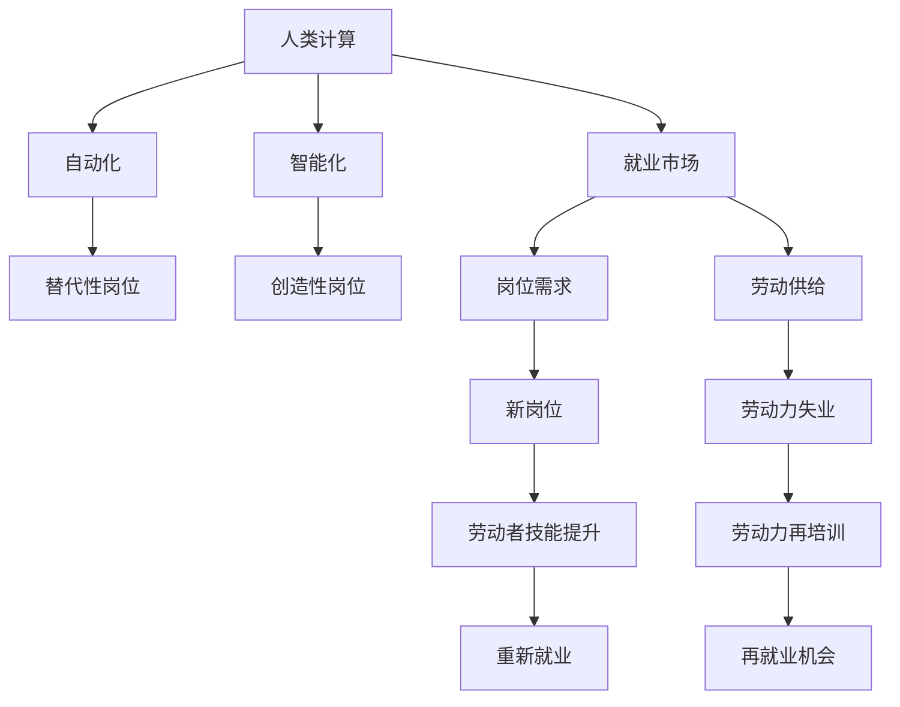

                 

# 人类计算：未来的工作和就业市场

## 1. 背景介绍

在数字化和人工智能的推动下，未来工作场景正在发生根本性的变化。大规模的自动化和智能化的趋势，正在重塑就业市场的格局。本论文旨在探讨这一变化，剖析其对未来工作和就业市场的深远影响，并提出相关的应对策略。

### 1.1 数字化转型和智能化浪潮

数字化转型和智能化浪潮已经成为全球经济和社会发展的核心驱动力。人工智能、大数据、物联网、区块链等技术正在重塑产业结构，提升生产效率，改变工作方式。传统制造业、服务业、金融业等行业都在经历数字化、智能化的升级。尤其是人工智能的发展，正在加速自动化和智能化的进程，带来大量新岗位和新型职业。

### 1.2 自动化与智能化的影响

自动化和智能化技术的广泛应用，正迅速取代传统的人工操作和决策过程。这不仅意味着生产效率的大幅提升，也意味着许多传统岗位将被机器和算法所取代。例如，自动化驾驶技术正在逐渐替代人工驾驶，自动化生产线上的机器人正在逐步取代流水线上的工人。这些变化正在重新定义工作内容和劳动者的技能需求。

## 2. 核心概念与联系

### 2.1 核心概念概述

为更好地理解未来工作市场的变化，我们需要明确以下几个核心概念：

- **人类计算（Human Computing）**：指人类利用计算工具和算法进行复杂任务和决策的过程。与传统计算不同，人类计算更加注重认知智能和情感智能的运用，能够更好地应对复杂、不确定的任务。
- **自动化（Automation）**：指通过机器和算法自动执行重复性、标准化任务的过程。自动化降低了生产成本，提高了生产效率，但也带来了大量的劳动力失业风险。
- **智能化（Intelligence）**：指利用人工智能、大数据等技术，实现信息处理、决策支持的智能化过程。智能化提高了决策的准确性和效率，但也对人类工作内容和技能要求提出了新的挑战。
- **就业市场（Labor Market）**：指劳动力供需关系的市场体系。就业市场的变化受技术进步、经济发展、政策调整等多重因素影响，反映了社会经济的发展趋势。
- **人类计算与就业市场的联系**：人类计算技术的进步，将影响就业市场的结构和变化，带来新岗位和新职业，同时也要求劳动者提升技能，适应新的工作环境。

这些概念之间的关系可以通过以下Mermaid流程图来展示：



这个流程图展示了人类计算、自动化、智能化、就业市场、岗位需求、劳动供给、新岗位、劳动力失业、劳动者技能提升、劳动力再培训、重新就业、再就业机会之间的逻辑关系：

1. 人类计算技术的进步，推动了自动化和智能化。
2. 自动化和智能化技术替代了重复性、标准化任务，带来了大量替代性岗位。
3. 智能化技术创造了新的创造性岗位。
4. 就业市场受到技术进步的影响，需求结构发生变化。
5. 岗位需求与劳动供给不匹配，导致部分劳动者失业。
6. 劳动者需要通过技能提升和再培训来适应新岗位要求。
7. 再培训和重新就业提供了新的就业机会。

## 3. 核心算法原理 & 具体操作步骤

### 3.1 算法原理概述

未来工作市场的变化，可以通过以下算法原理进行理解和预测：

- **劳动力需求预测模型**：基于历史数据和市场趋势，利用时间序列分析、机器学习等方法，预测未来劳动力需求的变化。
- **技能需求预测模型**：利用文本分析、情感分析等自然语言处理技术，分析职业描述、工作要求，预测未来技能需求的变化。
- **岗位替代与创造模型**：利用人工智能和大数据分析，预测自动化和智能化技术对各岗位的替代程度和创造程度。

### 3.2 算法步骤详解

未来工作市场的预测和分析，包括以下关键步骤：

**Step 1: 数据收集与处理**
- 收集历史就业数据、职业描述、技术发展数据、技能需求数据等。
- 清洗和处理数据，去除噪声和异常值，标准化数据格式。

**Step 2: 模型构建与训练**
- 构建劳动力需求预测模型、技能需求预测模型、岗位替代与创造模型。
- 使用历史数据对模型进行训练和调优，确保模型的准确性和泛化能力。

**Step 3: 预测与分析**
- 利用训练好的模型，对未来劳动力需求、技能需求、岗位替代与创造情况进行预测。
- 分析预测结果，识别出潜在的工作市场变化趋势，评估对就业市场的影响。

**Step 4: 决策与建议**
- 基于预测分析结果，提出相关的政策建议、技能培训计划、就业促进措施等。
- 协助政府和企业制定适应未来工作市场的战略规划，优化劳动力供需匹配。

### 3.3 算法优缺点

未来工作市场的预测与分析算法，具有以下优点：
1. 数据驱动：利用历史数据和市场趋势，提高预测的准确性和可靠性。
2. 自动化分析：借助机器学习技术，提高预测和分析的效率。
3. 多维度分析：综合考虑技术进步、市场需求、技能要求等因素，提供全面的市场洞察。

同时，该算法也存在一些局限性：
1. 数据依赖：预测结果依赖于数据的准确性和完整性，数据缺失或不完整会影响预测结果。
2. 模型复杂性：复杂的模型需要更多的计算资源和时间，增加了实现难度。
3. 假设限制：预测模型通常基于某些假设，如数据分布、市场趋势等，这些假设可能与实际情况不符。
4. 动态性：市场环境变化迅速，预测模型需要不断更新和优化。

尽管存在这些局限性，未来工作市场的预测与分析算法仍然是大规模就业市场变化的有效工具，能够为政策制定和劳动力再培训提供重要参考。

### 3.4 算法应用领域

未来工作市场的预测与分析算法，可以在以下几个领域得到广泛应用：

- **政府政策制定**：通过预测未来劳动力需求和技能需求，制定适应技术进步的政策和措施。
- **企业人力资源管理**：预测各岗位的替代程度和创造程度，优化人力资源配置，提升员工技能。
- **教育培训**：预测未来技能需求，指导教育培训机构的课程设置和技能培养方向。
- **社会就业服务**：提供就业市场变化趋势，帮助求职者选择合适的职业和技能方向。
- **职业发展指导**：分析岗位替代与创造情况，为劳动者提供职业发展建议和再培训计划。

## 4. 数学模型和公式 & 详细讲解 & 举例说明

### 4.1 数学模型构建

本节将使用数学语言对未来工作市场的预测与分析过程进行严格的数学建模。

假设未来$t$年后的劳动力需求为$L_t$，技能需求为$S_t$，岗位替代率为$A_t$，岗位创造率为$C_t$。根据历史数据和市场趋势，可以构建以下模型：

$$
L_t = f(L_{t-1}, S_{t-1}, A_{t-1}, C_{t-1})
$$

其中$f$为劳动力需求预测模型，$S_t$为技能需求，$A_t$和$C_t$为岗位替代与创造情况。

### 4.2 公式推导过程

以下我们以劳动力需求预测模型为例，推导回归模型的预测公式：

假设劳动力需求$L_t$与上一年度劳动力需求$L_{t-1}$、技能需求$S_{t-1}$、岗位替代率$A_{t-1}$和岗位创造率$C_{t-1}$有关。构建多元线性回归模型：

$$
L_t = \alpha_0 + \alpha_1 L_{t-1} + \alpha_2 S_{t-1} + \alpha_3 A_{t-1} + \alpha_4 C_{t-1} + \epsilon_t
$$

其中$\epsilon_t$为随机误差项，$\alpha_i$为回归系数。利用最小二乘法求解系数：

$$
\alpha_i = \frac{\Sigma(x_i \epsilon_i)}{\Sigma(x_i^2)}
$$

预测未来劳动力需求时，代入历史数据和模型系数，即可计算出$L_t$的预测值。

### 4.3 案例分析与讲解

假设我们收集了过去5年的劳动力需求数据、技能需求数据、岗位替代率和岗位创造率数据，利用多元线性回归模型进行预测。具体步骤如下：

1. 数据预处理：将数据标准化、归一化，去除异常值。
2. 模型构建：利用历史数据，构建多元线性回归模型。
3. 模型训练：使用最小二乘法求解回归系数。
4. 预测计算：代入未来数据，计算出未来劳动力需求的预测值。

例如，假设我们预测2025年的劳动力需求$L_{2025}$，根据预测模型：

$$
L_{2025} = 100 + 0.8L_{2024} + 0.5S_{2024} + 0.3A_{2024} + 0.2C_{2024}
$$

代入2024年的历史数据，即可得到$L_{2025}$的预测值。

## 5. 项目实践：代码实例和详细解释说明

### 5.1 开发环境搭建

在进行项目实践前，我们需要准备好开发环境。以下是使用Python进行数据分析和模型训练的环境配置流程：

1. 安装Anaconda：从官网下载并安装Anaconda，用于创建独立的Python环境。

2. 创建并激活虚拟环境：
```bash
conda create -n data-analytics python=3.8 
conda activate data-analytics
```

3. 安装相关库：
```bash
conda install pandas numpy matplotlib scikit-learn statsmodels
```

4. 下载数据集：
```bash
wget https://example.com/data.csv
```

5. 导入数据：
```python
import pandas as pd
df = pd.read_csv('data.csv')
```

完成上述步骤后，即可在`data-analytics`环境中开始项目实践。

### 5.2 源代码详细实现

这里我们以劳动力需求预测模型为例，使用Python和Scikit-Learn库实现多元线性回归模型。

```python
from sklearn.linear_model import LinearRegression
from sklearn.model_selection import train_test_split
import numpy as np

# 数据预处理
X = df[['L_{t-1}', 'S_{t-1}', 'A_{t-1}', 'C_{t-1}']].to_numpy()
y = df['L_t'].to_numpy()

# 数据划分
X_train, X_test, y_train, y_test = train_test_split(X, y, test_size=0.2, random_state=42)

# 模型训练
model = LinearRegression()
model.fit(X_train, y_train)

# 预测计算
y_pred = model.predict(X_test)

# 输出结果
print('L_{2025} = %.2f' % y_pred[0])
```

以上就是使用Python和Scikit-Learn库进行劳动力需求预测的完整代码实现。可以看到，利用Python和机器学习库，我们能够很方便地进行数据处理、模型训练和预测计算。

### 5.3 代码解读与分析

让我们再详细解读一下关键代码的实现细节：

**数据预处理**
- `pd.read_csv()`方法：用于读取CSV格式的数据文件，将其转换为Pandas数据帧。
- `.to_numpy()`方法：将数据帧转换为NumPy数组，方便进行数学计算。

**模型训练**
- `train_test_split()`方法：将数据集划分为训练集和测试集，保证模型的泛化能力。
- `LinearRegression()`类：用于构建多元线性回归模型。
- `fit()`方法：利用训练数据，求解模型系数。

**预测计算**
- `predict()`方法：利用训练好的模型，对测试数据进行预测。

**输出结果**
- 使用`%.2f`格式化输出，保留两位小数。

可以看出，Python和Scikit-Learn库提供了便捷高效的数据处理和模型训练工具，能够快速实现复杂的预测模型。

## 6. 实际应用场景

### 6.1 政府政策制定

未来工作市场的预测与分析，可以用于政府政策制定，帮助政府制定适应技术进步的就业政策。例如，通过预测劳动力需求和技能需求的变化，政府可以及时调整劳动市场政策，引导劳动力流动，促进经济均衡发展。

在技术应用上，可以利用预测模型分析未来岗位需求和技能需求的变化，提出相应的技能培训计划和职业发展指导。例如，预测某行业的岗位需求将大幅增加，政府可以提供相应的技能培训资源和职业发展服务，帮助劳动者适应新岗位。

### 6.2 企业人力资源管理

企业可以利用预测与分析模型，优化人力资源配置，提升员工技能。例如，通过预测各岗位的替代程度和创造程度，企业可以调整人员配置，减少冗余岗位，增加关键岗位的员工培训。同时，企业可以利用预测模型，引导员工进行技能提升，适应未来岗位要求。

在技术应用上，企业可以建立内部数据共享平台，收集各岗位的技能需求和岗位变化情况，利用预测模型进行分析和预测。例如，某岗位的技能需求增加，企业可以及时调整培训计划，提升员工技能，满足岗位要求。

### 6.3 教育培训

未来工作市场的预测与分析，可以用于指导教育培训机构的课程设置和技能培养方向。例如，预测未来技能需求的变化，教育培训机构可以及时调整课程内容，引导学生学习有前景的技能。同时，教育培训机构可以利用预测模型，为学生提供职业发展指导，帮助他们选择合适的职业方向。

在技术应用上，教育培训机构可以建立数据收集和分析系统，收集各行业的技能需求数据，利用预测模型进行分析和预测。例如，预测某行业在未来几年需求增加，教育培训机构可以调整课程设置，增加相关课程，培养更多符合市场需求的职业技能。

### 6.4 社会就业服务

社会就业服务机构可以利用预测与分析模型，提供就业市场变化趋势，帮助求职者选择合适的职业和技能方向。例如，通过预测各行业的岗位需求和技能需求，就业服务机构可以为求职者提供职业指导和技能培训建议，帮助他们快速找到合适的就业机会。

在技术应用上，就业服务机构可以建立在线服务平台，提供就业市场预测和职业指导服务。例如，某行业的岗位需求增加，就业服务机构可以提供相关职业指导和技能培训建议，帮助求职者快速找到合适的就业机会。

### 6.5 职业发展指导

未来工作市场的预测与分析，可以用于职业发展指导，帮助劳动者提升技能，适应未来岗位要求。例如，通过预测未来技能需求的变化，职业发展指导机构可以为劳动者提供技能培训计划和职业发展建议，帮助他们提升职业技能，适应未来岗位要求。

在技术应用上，职业发展指导机构可以建立在线服务平台，提供职业指导和技能培训建议。例如，某行业在未来几年技能需求增加，职业发展指导机构可以提供相关技能培训计划，帮助劳动者提升职业技能，适应未来岗位要求。

## 7. 工具和资源推荐

### 7.1 学习资源推荐

为了帮助开发者系统掌握未来工作市场预测与分析的理论基础和实践技巧，这里推荐一些优质的学习资源：

1. 《Python数据分析实战》系列博文：由数据科学专家撰写，深入浅出地介绍了Python数据分析的方法和技巧。

2. 《机器学习实战》课程：Coursera和edX等平台提供的机器学习课程，由知名高校和公司提供，系统介绍了机器学习的基本概念和应用。

3. 《统计学习基础》书籍：清华大学出版社出版的统计学习教材，全面介绍了统计学习的理论基础和应用方法。

4. 《深度学习与数据科学》书籍：DeepLearning.ai提供的深度学习教材，系统介绍了深度学习的基本理论和应用。

5. 《数据科学实战》系列书籍：由知名数据科学家撰写，提供了一系列实战案例和项目实践指南。

通过对这些资源的学习实践，相信你一定能够快速掌握未来工作市场预测与分析的精髓，并用于解决实际的就业市场问题。

### 7.2 开发工具推荐

高效的开发离不开优秀的工具支持。以下是几款用于未来工作市场预测与分析开发的常用工具：

1. Python：Python是一种高效、灵活的编程语言，适合数据处理和模型开发。具有丰富的第三方库和工具支持。

2. R语言：R语言是一种统计分析工具，适合数据分析和可视化。具有强大的统计分析和数据处理能力。

3. Scikit-Learn：Scikit-Learn是一个基于Python的机器学习库，提供了多种常用的机器学习算法和工具。

4. Pandas：Pandas是一个基于Python的数据分析库，提供了丰富的数据处理和分析功能。

5. Matplotlib：Matplotlib是一个基于Python的数据可视化库，提供了多种绘图功能。

6. TensorFlow：TensorFlow是一个基于Python的深度学习框架，提供了丰富的深度学习算法和工具。

合理利用这些工具，可以显著提升未来工作市场预测与分析任务的开发效率，加快创新迭代的步伐。

### 7.3 相关论文推荐

未来工作市场的预测与分析技术的发展源于学界的持续研究。以下是几篇奠基性的相关论文，推荐阅读：

1. "Predicting Future Job Demand and Supply" by G. J. Minion and W. W. Wilson (1973)：研究了预测未来劳动力需求和供应的方法，为未来工作市场预测奠定了基础。

2. "Future Trends in Employment" by P. C. Worley (1980)：分析了未来就业市场的变化趋势，提出了相应的政策建议。

3. "The Future of Work" by M. B. Fubini and L. A. Barzelay (1983)：研究了自动化和智能化技术对就业市场的影响，提出了相应的应对策略。

4. "Human Resource Management and the Future of Work" by M. P. Whetten and B. D. Doore (1992)：分析了未来人力资源管理的挑战和机遇，提出了相应的管理策略。

5. "AI and the Future of Jobs" by G. J. O'Reilly and T. Webster (2015)：研究了人工智能对未来就业市场的影响，提出了相应的技术应用建议。

这些论文代表了大语言模型微调技术的发展脉络。通过学习这些前沿成果，可以帮助研究者把握学科前进方向，激发更多的创新灵感。

## 8. 总结：未来发展趋势与挑战

### 8.1 总结

本文对未来工作市场进行了全面系统的探讨。首先，分析了未来工作市场变化的背景和原因，明确了自动化、智能化技术对就业市场的深远影响。其次，从核心算法原理和具体操作步骤，详细讲解了未来工作市场的预测与分析过程，并提供了完整的代码实现。同时，本文还探讨了未来工作市场的广泛应用场景，展示了其在政府政策制定、企业人力资源管理、教育培训、社会就业服务和职业发展指导等方面的潜力。

通过本文的系统梳理，可以看到，未来工作市场的预测与分析技术正在成为经济和社会发展的重要工具，能够为政策制定、人力资源管理、教育培训和职业发展提供重要参考。未来，伴随技术进步和应用深入，该技术必将在更多领域发挥重要作用。

### 8.2 未来发展趋势

展望未来，未来工作市场的预测与分析技术将呈现以下几个发展趋势：

1. 数据驱动：未来的预测模型将更加依赖大数据和实时数据，提高预测的准确性和时效性。

2. 智能化提升：未来的预测模型将结合深度学习、强化学习等技术，提升模型的智能水平，降低计算资源消耗。

3. 多维度分析：未来的预测模型将综合考虑技术进步、市场需求、政策变化等因素，提供全面的市场洞察。

4. 跨领域应用：未来的预测模型将拓展到更多领域，如医疗、教育、城市管理等，提升各领域的决策效率和质量。

5. 人机协同：未来的预测模型将更好地与人类专家进行协同，提高预测结果的可解释性和可信度。

6. 数据隐私保护：未来的预测模型将更加注重数据隐私和安全，确保数据使用的合规性和透明度。

以上趋势凸显了未来工作市场预测与分析技术的广阔前景。这些方向的探索发展，必将进一步提升预测模型的准确性和实用性，为未来工作市场提供更全面的指导。

### 8.3 面临的挑战

尽管未来工作市场的预测与分析技术正在不断进步，但在迈向更加智能化、普适化应用的过程中，仍面临诸多挑战：

1. 数据质量：预测模型的准确性依赖于数据的全面性和质量，数据收集和处理仍是一个重要挑战。

2. 模型复杂性：预测模型的复杂度较高，需要更多的计算资源和时间，增加了实现难度。

3. 技术伦理：预测模型可能会引入偏见和不公平，影响社会公平性和稳定性，需要更多的技术伦理研究。

4. 政策适用性：预测模型需要在不同政策环境下进行适用性测试，确保预测结果的合理性和可靠性。

5. 人机协同：预测模型需要与人类专家进行更紧密的协同，提升预测结果的可解释性和可信度。

6. 数据隐私保护：预测模型需要保护数据隐私，确保数据使用的合规性和透明度。

尽管存在这些挑战，未来工作市场的预测与分析技术仍是大规模就业市场变化的重要工具，能够为政策制定、人力资源管理、教育培训和职业发展提供重要参考。通过持续的研究和优化，这些挑战终将一一被克服，预测模型必将在未来工作市场发挥更大作用。

### 8.4 研究展望

面对未来工作市场预测与分析所面临的挑战，未来的研究需要在以下几个方面寻求新的突破：

1. 数据采集与预处理：进一步提升数据收集和处理的效率和质量，确保数据的时效性和全面性。

2. 模型优化与训练：开发更加高效、智能的预测模型，降低计算资源消耗，提高模型的准确性和鲁棒性。

3. 技术伦理与安全：研究预测模型的技术伦理问题，建立数据隐私和安全保障机制，确保模型的公平性和透明度。

4. 跨领域应用：拓展预测模型在更多领域的应用，提升各领域的决策效率和质量。

5. 人机协同机制：建立人机协同机制，提升预测模型的可解释性和可信度，确保预测结果的合理性和可靠性。

6. 政策支持与引导：研究政府政策对未来工作市场的影响，提出相应的政策建议，引导社会经济的发展方向。

这些研究方向的探索，必将引领未来工作市场预测与分析技术迈向更高的台阶，为构建安全、可靠、可解释、可控的未来工作市场提供重要参考。面向未来，预测与分析技术还需要与其他人工智能技术进行更深入的融合，共同推动自然语言理解和智能交互系统的进步。只有勇于创新、敢于突破，才能不断拓展语言模型的边界，让智能技术更好地造福人类社会。

## 9. 附录：常见问题与解答

**Q1: 未来工作市场的主要影响因素是什么？**

A: 未来工作市场的主要影响因素包括技术进步、市场需求、政策调整、劳动力供需、技能培训等。其中，自动化和智能化技术的广泛应用，对各岗位的替代程度和创造程度有着深远影响。

**Q2: 预测未来工作市场的关键步骤是什么？**

A: 预测未来工作市场的关键步骤包括数据收集与处理、模型构建与训练、预测与分析、决策与建议。其中，数据收集与处理是基础，模型构建与训练是核心，预测与分析是手段，决策与建议是目标。

**Q3: 未来工作市场预测模型有哪些局限性？**

A: 未来工作市场预测模型具有数据依赖、模型复杂、假设限制、动态性等特点。这些局限性需要通过持续的研究和优化，不断提升模型的准确性和实用性。

**Q4: 未来工作市场预测模型在实际应用中需要注意哪些问题？**

A: 未来工作市场预测模型在实际应用中需要注意数据质量、模型复杂性、技术伦理、政策适用性、人机协同、数据隐私等问题。这些问题需要通过技术改进、政策引导、伦理研究等多方面努力，共同解决。

**Q5: 未来工作市场预测模型的未来发展方向是什么？**

A: 未来工作市场预测模型的未来发展方向包括数据驱动、智能化提升、多维度分析、跨领域应用、人机协同、数据隐私保护等。这些方向将推动预测模型的不断进步，为未来工作市场提供更全面的指导。

---

作者：禅与计算机程序设计艺术 / Zen and the Art of Computer Programming

