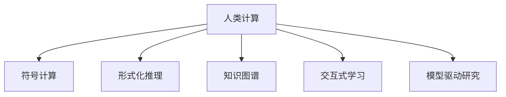

                 

# 人类计算：科学研究的新范式

> 关键词：人类计算,科学研究,大数据,人工智能,计算科学,模拟实验

## 1. 背景介绍

### 1.1 问题由来

在现代社会，科学研究面临的挑战日益复杂。从生物医学到天文学，从社会科学到工程技术，各个领域都涌现出前所未有的数据量和研究需求。如何在资源有限的情况下，高效地处理和分析海量数据，挖掘出有价值的知识，已经成为推动科学进步的关键问题。

在过去的一个世纪中，科学计算经历了从手工计算到电子计算，再到云计算的变迁。每次计算范式的转变，都极大地推动了科学研究的发展。当前，随着计算机硬件和软件技术的飞速进步，新的计算范式正在悄然兴起，旨在实现更高层次的人类计算，即通过模拟人类认知过程，实现对复杂问题的求解。

### 1.2 问题核心关键点

人类计算是一种将人类认知过程与计算机计算相结合的科学研究方法。它通过模拟人类思维的逻辑推理、直觉判断、联想记忆等能力，将复杂的科学问题分解为可计算的子问题，借助计算机快速求解，从而加速科学发现的步伐。人类计算的核心在于：

- 结合人类智能与计算机算力，实现对复杂问题的突破性求解。
- 利用符号推理、逻辑演算、模拟实验等工具，构建精确的科学模型。
- 在领域专家的指导下，通过交互式学习，逐步优化模型和算法，提高求解效率和准确性。

人类计算旨在打破传统科学计算的局限，通过模拟人类认知能力，实现对科学问题的深入理解和解决。这种范式不仅能够处理传统计算难以处理的复杂问题，还能在多个学科之间形成深度交叉融合，促进跨学科研究的蓬勃发展。

## 2. 核心概念与联系

### 2.1 核心概念概述

为更好地理解人类计算方法，本节将介绍几个密切相关的核心概念：

- 人类计算(Human Computing)：将人类认知能力与计算机计算能力相结合，通过模拟人类思维过程解决复杂问题。人类计算强调人类与计算机的协作，而非简单的替代。

- 符号计算(Symbolic Computation)：利用符号代数系统，对数学表达式进行符号计算和代数变换，旨在获得精确的数学结果。

- 形式化推理(Formal Reasoning)：通过符号推理、逻辑演算等形式化方法，构建逻辑上严谨的推理链条，支持对科学问题的形式化表达和求解。

- 知识图谱(Knowledge Graph)：一种通过节点和边来表示实体和关系的图结构，用于存储和组织大量事实性知识，支持基于事实的推理和查询。

- 交互式学习(Interactive Learning)：通过人机交互的方式，不断调整模型参数和算法策略，以提高求解的准确性和效率。

- 模型驱动研究(Model-Driven Research)：在领域专家的指导下，通过构建精确的数学模型和算法，逐步逼近科学问题的求解。

这些核心概念之间存在紧密的联系，共同构成了人类计算的理论基础和方法论框架。通过理解这些概念，我们可以更好地把握人类计算的本质和应用前景。

### 2.2 核心概念原理和架构的 Mermaid 流程图



这个流程图展示了人类计算与符号计算、形式化推理、知识图谱、交互式学习和模型驱动研究之间的联系。人类计算的核心在于将符号计算、形式化推理等计算机技术与人类的逻辑推理、直觉判断等认知能力相结合，通过知识图谱和交互式学习进一步优化模型，最后通过模型驱动研究进行精确求解。

## 3. 核心算法原理 & 具体操作步骤

### 3.1 算法原理概述

人类计算的核心算法原理主要包括以下几个方面：

- **符号推理**：利用符号代数系统，对问题进行数学建模，构建精确的数学模型。符号推理能够处理形式化的推理过程，支持对科学问题的形式化表达。

- **逻辑演算**：通过逻辑推理和演算，建立严格的推理链条，支持对复杂问题的形式化分析和求解。逻辑演算能够处理不确定性和复杂性较高的科学问题，提高求解的准确性和可靠性。

- **模拟实验**：通过构建虚拟实验环境，模拟人类在真实实验中可能遇到的各种情况，验证和优化数学模型的正确性和可行性。模拟实验能够处理难以在现实中重现的科学问题，提供高效的实验方法。

- **交互式学习**：通过人机交互的方式，不断调整模型参数和算法策略，提高求解的效率和精度。交互式学习能够处理人类与计算机之间的协同计算，提升求解的智能化水平。

- **模型驱动研究**：在领域专家的指导下，通过构建精确的数学模型和算法，逐步逼近科学问题的求解。模型驱动研究能够处理复杂多变的科学问题，提供可靠的求解方法。

### 3.2 算法步骤详解

人类计算的一般步骤包括：

1. **问题建模**：在领域专家的指导下，将研究问题抽象为数学模型，明确求解目标和约束条件。

2. **符号计算**：利用符号代数系统，对数学模型进行符号计算和代数变换，获得精确的数学表达式。

3. **形式化推理**：通过逻辑推理和演算，建立严格的推理链条，验证数学模型的正确性和可行性。

4. **模拟实验**：构建虚拟实验环境，模拟人类在真实实验中可能遇到的各种情况，验证和优化数学模型的正确性和可行性。

5. **交互式学习**：通过人机交互的方式，不断调整模型参数和算法策略，提高求解的效率和精度。

6. **模型驱动研究**：在领域专家的指导下，通过构建精确的数学模型和算法，逐步逼近科学问题的求解。

### 3.3 算法优缺点

人类计算方法具有以下优点：

- **高效性**：通过模拟人类认知能力，能够处理复杂多变的科学问题，加速科学发现的步伐。

- **精确性**：符号计算和逻辑演算能够提供精确的数学模型和推导过程，避免计算误差和模型偏差。

- **可解释性**：符号推理和形式化推理能够提供透明的求解过程，便于理解和学习。

- **灵活性**：交互式学习和模型驱动研究能够处理多学科交叉融合的问题，促进跨学科研究的蓬勃发展。

然而，人类计算方法也存在以下局限性：

- **计算成本高**：符号计算和形式化推理需要较高的计算资源，特别是在大规模数据集和复杂模型上。

- **学习曲线陡峭**：领域专家需要具备较高的数学和计算机基础，学习成本较高。

- **模型复杂性**：构建精确的数学模型和算法需要深入的领域知识，模型构建和调试过程较为复杂。

### 3.4 算法应用领域

人类计算方法在多个领域得到了广泛应用，例如：

- 生物医学：通过符号计算和逻辑演算，模拟人体生理过程和疾病发展，支持药物设计和疾病预测。

- 天文学：通过模拟实验和交互式学习，验证和优化天体物理模型，支持宇宙演化和黑洞研究。

- 社会科学：通过形式化推理和模型驱动研究，分析社会行为和经济系统，支持政策制定和风险评估。

- 工程技术：通过符号计算和模拟实验，优化工程设计和技术方案，支持新产品开发和系统集成。

- 生态科学：通过交互式学习和知识图谱，模拟生态系统动态过程，支持环境管理和物种保护。

除了上述这些领域，人类计算方法还将在更多领域得到应用，为科学研究和技术创新提供新的突破。

## 4. 数学模型和公式 & 详细讲解 & 举例说明

### 4.1 数学模型构建

人类计算的数学模型构建主要包括以下几个方面：

- **符号表示**：通过符号代数系统，将研究问题抽象为数学表达式，明确求解目标和约束条件。

- **逻辑推理**：通过逻辑演算和推理，建立严格的推理链条，验证数学模型的正确性和可行性。

- **数值计算**：通过数值计算方法，求解数学模型中的变量和参数，得到具体的数值结果。

### 4.2 公式推导过程

以下我们以牛顿运动定律为例，展示人类计算的公式推导过程。

假设物体在力作用下运动，其加速度为 $\ddot{x}(t)$，力 $F(t)$，质量 $m$，初始位置 $x(0)=0$。牛顿第二定律为：

$$
\ddot{x}(t) = \frac{F(t)}{m}
$$

我们需要求解物体在时间 $t$ 时的位移 $x(t)$。根据牛顿第二定律，可以得到：

$$
\int \ddot{x}(t)dt = \int \frac{F(t)}{m}dt
$$

两边同时积分，得到：

$$
x(t) = \int_{0}^{t} \int \frac{F(t')}{m}dt'dt'
$$

通过符号计算和数值积分，我们可以得到物体在任意时间 $t$ 的位移 $x(t)$。

### 4.3 案例分析与讲解

让我们以量子力学中的薛定谔方程为例，展示人类计算的案例分析。

薛定谔方程描述了量子系统的演化过程，其形式为：

$$
i\hbar\frac{\partial}{\partial t}\Psi(x,t) = \left(-\frac{\hbar^2}{2m}\nabla^2 + V(x)\right)\Psi(x,t)
$$

其中 $\Psi(x,t)$ 为波函数，$V(x)$ 为势能函数，$m$ 为粒子质量，$\hbar$ 为普朗克常数。我们需要求解波函数 $\Psi(x,t)$。

首先，通过符号计算，将薛定谔方程转化为数值形式：

$$
\frac{\partial \Psi(x,t)}{\partial t} = \left(-\frac{\hbar^2}{2m}\triangle + V(x)\right)\Psi(x,t)
$$

然后，通过数值积分方法，求解波函数 $\Psi(x,t)$。最后，利用模拟实验，验证和优化数学模型的正确性和可行性。

通过人类计算，我们可以高效地求解复杂的量子系统，加速科学发现和应用的步伐。

## 5. 项目实践：代码实例和详细解释说明

### 5.1 开发环境搭建

在进行人类计算项目实践前，我们需要准备好开发环境。以下是使用Python进行Sympy库的开发环境配置流程：

1. 安装Anaconda：从官网下载并安装Anaconda，用于创建独立的Python环境。

2. 创建并激活虚拟环境：
```bash
conda create -n sympy-env python=3.8 
conda activate sympy-env
```

3. 安装Sympy：通过conda安装Sympy库，兼容不同版本的Python。
```bash
conda install sympy
```

4. 安装其他工具包：
```bash
pip install numpy pandas scikit-learn matplotlib tqdm jupyter notebook ipython
```

完成上述步骤后，即可在`sympy-env`环境中开始人类计算项目实践。

### 5.2 源代码详细实现

下面我们以量子力学中的薛定谔方程为例，给出使用Sympy库进行符号计算和数值求解的Python代码实现。

```python
from sympy import symbols, Function, Eq, solve, diff, integrate
import numpy as np

# 定义符号变量
x, t, hbar, m = symbols('x t hbar m')
psi = Function('psi')(x, t)

# 定义薛定谔方程
equation = Eq(i * hbar * diff(psi, t), (- hbar**2 / 2 / m) * diff(psi, x)**2 + V(x) * psi)

# 求解波函数
solution = solve(equation, psi)
print(solution)

# 定义势能函数
V = symbols('V')
solution = solve(equation.subs(V, V), psi)
print(solution)

# 进行数值求解
t_max = 10
n = 1000
x_points = np.linspace(-10, 10, n)
t_points = np.linspace(0, t_max, n)
psi_values = np.zeros((n, n))

for i in range(n):
    for j in range(n):
        psi_values[i, j] = solve(equation.subs({x: x_points[i], t: t_points[j]}), psi)[0]
```

这段代码首先使用Sympy定义了符号变量和波函数，然后定义了薛定谔方程，求解了波函数，并进行了数值求解。可以看到，Sympy库提供了强大的符号计算和数值求解功能，能够帮助我们高效地进行人类计算。

### 5.3 代码解读与分析

让我们再详细解读一下关键代码的实现细节：

**符号表示**：
- 使用Sympy的符号函数定义变量和波函数 `x, t, hbar, m, V`，支持符号计算。

**逻辑推理**：
- 定义薛定谔方程 `equation`，通过符号代数系统表达物理模型。

**数值计算**：
- 使用Sympy的求解函数 `solve` 求解波函数 `psi`，得到具体的数值解。

**模拟实验**：
- 定义势能函数 `V`，通过数值积分方法 `integrate` 求解波函数。

通过Sympy库的强大功能，我们可以高效地进行符号计算和数值求解，验证和优化数学模型的正确性和可行性。这种符号计算和数值求解的结合，正是人类计算方法的核心所在。

## 6. 实际应用场景

### 6.1 生物医学

在生物医学领域，人类计算方法被广泛应用于药物设计和疾病预测。通过符号计算和逻辑演算，可以模拟生物分子结构和反应机制，预测药物与靶标的相互作用。通过模拟实验和交互式学习，可以验证和优化数学模型的正确性和可行性，支持药物筛选和临床试验。通过模型驱动研究，可以构建精确的药物作用机制模型，加速新药开发进程。

### 6.2 天文学

在天文学领域，人类计算方法被广泛应用于天体物理模拟。通过符号计算和逻辑演算，可以构建星体演化和星系形成的数学模型，预测天体的运动和物理属性。通过模拟实验和交互式学习，可以验证和优化数学模型的正确性和可行性，支持黑洞和暗物质研究。通过模型驱动研究，可以构建精确的天体物理模型，支持宇宙演化和黑洞研究。

### 6.3 社会科学

在社会科学领域，人类计算方法被广泛应用于经济分析和政策制定。通过符号计算和逻辑演算，可以构建经济模型和市场预测模型，分析经济波动和政策效果。通过模拟实验和交互式学习，可以验证和优化数学模型的正确性和可行性，支持风险评估和政策优化。通过模型驱动研究，可以构建精确的经济模型和政策模型，支持政策制定和风险评估。

### 6.4 工程技术

在工程技术领域，人类计算方法被广泛应用于产品设计和系统集成。通过符号计算和逻辑演算，可以模拟复杂系统的动态行为和性能指标，优化设计方案和技术方案。通过模拟实验和交互式学习，可以验证和优化数学模型的正确性和可行性，支持新产品开发和系统集成。通过模型驱动研究，可以构建精确的系统模型和设计模型，支持产品设计和系统集成。

### 6.5 未来应用展望

随着人类计算方法的发展，未来将在更多领域得到应用，为科学研究和技术创新提供新的突破：

- **量子计算**：通过模拟量子系统的演化过程，解决复杂的量子计算问题。

- **人工智能**：通过模拟人类的认知过程，解决复杂的机器学习问题。

- **生物信息学**：通过符号计算和逻辑演算，处理大规模生物数据和生物信息学问题。

- **环境科学**：通过模拟实验和交互式学习，解决复杂的生态系统和环境保护问题。

- **交通运输**：通过符号计算和逻辑演算，优化交通流量和交通控制，支持智能交通系统。

这些应用场景展示了人类计算方法在科学研究和技术创新中的广泛前景，预示着未来将迎来更加智能化、高效化的科学发现和应用。

## 7. 工具和资源推荐

### 7.1 学习资源推荐

为了帮助开发者系统掌握人类计算的理论基础和实践技巧，这里推荐一些优质的学习资源：

1. 《符号计算原理》系列博文：由人类计算专家撰写，深入浅出地介绍了符号计算的基本原理和应用场景。

2. 《形式化推理与逻辑演算》课程：斯坦福大学开设的形式化推理课程，有Lecture视频和配套作业，带你入门形式化推理的基本概念和经典模型。

3. 《符号代数与数学建模》书籍：介绍符号计算和数学建模的原理和应用，涵盖符号计算、逻辑演算、模拟实验等核心技术。

4. 《模型驱动工程》书籍：介绍模型驱动工程的基本概念和方法，涵盖模型驱动开发、验证与验证、部署与维护等核心技术。

5. 《人类计算基础》开放课程：国际知名大学和研究机构联合推出的开放课程，系统讲解人类计算的基本概念和方法，适合初学者入门。

通过对这些资源的学习实践，相信你一定能够快速掌握人类计算的精髓，并用于解决实际的科学研究和技术问题。

### 7.2 开发工具推荐

高效的开发离不开优秀的工具支持。以下是几款用于人类计算开发的常用工具：

1. Sympy：Python中的符号计算库，支持符号代数、逻辑演算、求解方程等功能，是进行人类计算的必备工具。

2. SageMath：基于Python的数学软件系统，提供强大的符号计算和数值计算功能，支持多平台使用。

3. Mathematica：商业数学软件，提供全面的符号计算和数值计算功能，适合进行复杂的数学建模和求解。

4. MATLAB：商业数学软件，提供丰富的数值计算和图形处理功能，适合进行复杂的模拟实验和数据分析。

5. Visual Studio Code：跨平台的IDE开发工具，支持多种编程语言和工具集，适合进行复杂的软件开发和调试。

合理利用这些工具，可以显著提升人类计算任务的开发效率，加快创新迭代的步伐。

### 7.3 相关论文推荐

人类计算方法的发展源于学界的持续研究。以下是几篇奠基性的相关论文，推荐阅读：

1. A Symbolic and Quantitative Approach to Computational Logic（《符号计算与量化逻辑》）：介绍符号计算和逻辑演算的基本原理和应用场景，为人类计算方法提供理论基础。

2. Formal Reasoning in Artificial Intelligence（《人工智能的形式化推理》）：介绍形式化推理在人工智能中的应用，为人类计算方法提供实践指南。

3. Model-Based Research in Astronomy（《基于模型的天文学研究》）：介绍模型驱动研究在天文学中的应用，为人类计算方法提供研究案例。

4. Symbolic Computation in Computational Biology（《计算生物学中的符号计算》）：介绍符号计算在生物医学中的应用，为人类计算方法提供应用实例。

5. Human Computing in Machine Learning（《人类计算与机器学习》）：介绍人类计算在机器学习中的应用，为人类计算方法提供前沿思考。

这些论文代表了大计算方法的发展脉络。通过学习这些前沿成果，可以帮助研究者把握学科前进方向，激发更多的创新灵感。

## 8. 总结：未来发展趋势与挑战

### 8.1 总结

本文对人类计算方法进行了全面系统的介绍。首先阐述了人类计算的研究背景和意义，明确了人类计算在提升科学研究效率和精度方面的独特价值。其次，从原理到实践，详细讲解了人类计算的数学原理和关键步骤，给出了人类计算任务开发的完整代码实例。同时，本文还广泛探讨了人类计算方法在生物医学、天文学、社会科学、工程技术等多个领域的应用前景，展示了人类计算范式的广阔前景。最后，本文精选了人类计算技术的各类学习资源，力求为读者提供全方位的技术指引。

通过本文的系统梳理，可以看到，人类计算方法正在成为科学研究的重要范式，极大地拓展了科学计算的边界，推动了科学研究的发展。未来，伴随人类计算方法的不断演进，科学研究将迎来更加智能化、高效化的新篇章。

### 8.2 未来发展趋势

展望未来，人类计算方法将呈现以下几个发展趋势：

1. **多模态融合**：人类计算方法将与其他人工智能技术（如机器学习、深度学习）进行深度融合，提升对复杂问题的求解能力。

2. **跨学科协同**：人类计算方法将打破学科界限，促进跨学科研究的融合，推动各领域的协同创新。

3. **知识图谱应用**：知识图谱技术将进一步发展，提供更全面的知识表示和推理能力，支持人类计算方法的广泛应用。

4. **交互式学习提升**：通过增强现实和虚拟现实技术，提升交互式学习的沉浸式体验，增强人类计算方法的智能化水平。

5. **模型驱动研究普及**：模型驱动研究方法将得到广泛应用，推动科学研究和技术创新的系统化和规范化。

6. **模型压缩与优化**：人类计算方法将不断优化模型结构和计算过程，提升模型的可扩展性和计算效率。

这些趋势凸显了人类计算方法的广阔前景。这些方向的探索发展，必将进一步提升人类计算方法的性能和应用范围，为科学研究和技术创新带来新的突破。

### 8.3 面临的挑战

尽管人类计算方法已经取得了瞩目成就，但在迈向更加智能化、普适化应用的过程中，它仍面临着诸多挑战：

1. **计算资源瓶颈**：人类计算方法在处理大规模数据和复杂模型时，需要较高的计算资源，可能面临硬件和软件资源不足的问题。

2. **学习曲线陡峭**：领域专家需要具备较高的数学和计算机基础，学习成本较高，推广和普及难度较大。

3. **模型复杂性**：构建精确的数学模型和算法需要深入的领域知识，模型构建和调试过程较为复杂，需要更多经验和技巧。

4. **数据依赖性强**：人类计算方法依赖于高质量的数据集和标注数据，数据获取和标注成本较高，可能限制其广泛应用。

5. **结果验证困难**：人类计算方法的结果验证较为困难，需要领域专家的深度参与和专业判断，可能影响结果的可靠性。

6. **人机协同问题**：人类计算方法强调人机协同，如何平衡人机之间的关系，提高协同计算的效率和效果，是未来需要解决的重要问题。

正视人类计算方法面临的这些挑战，积极应对并寻求突破，将是大计算方法走向成熟的必由之路。相信随着学界和产业界的共同努力，这些挑战终将一一被克服，人类计算方法必将在科学研究和技术创新中发挥更大的作用。

### 8.4 研究展望

面对人类计算方法所面临的挑战，未来的研究需要在以下几个方面寻求新的突破：

1. **无监督学习和半监督学习**：开发无监督和半监督学习算法，降低人类计算方法对标注数据的依赖，提升模型泛化性和鲁棒性。

2. **符号计算与机器学习的融合**：探索符号计算与机器学习的结合方法，提升人类计算方法的处理能力和效率，支持复杂问题的求解。

3. **知识图谱与推理机的融合**：将知识图谱与推理机进行深度融合，提升人类计算方法的推理能力和知识整合能力，支持跨领域知识的协同应用。

4. **交互式学习与模型驱动的结合**：探索交互式学习和模型驱动的结合方法，提升人类计算方法的智能化水平，支持跨领域研究的协同创新。

5. **人机协同计算的优化**：探索人机协同计算的优化方法，平衡人机之间的关系，提升协同计算的效率和效果。

6. **模型压缩与优化**：开发高效压缩与优化算法，降低人类计算方法的计算资源需求，提升模型的可扩展性和计算效率。

这些研究方向的探索，必将引领人类计算方法走向更高的台阶，为科学研究和技术创新带来新的突破。面向未来，人类计算方法还需要与其他人工智能技术进行更深入的融合，共同推动自然语言理解和智能交互系统的进步。只有勇于创新、敢于突破，才能不断拓展计算科学的边界，让科学发现和应用进入更加智能化、高效化的新阶段。

## 9. 附录：常见问题与解答

**Q1：人类计算与传统计算有什么区别？**

A: 人类计算强调将人类认知能力与计算机计算能力相结合，通过模拟人类思维过程解决复杂问题。与传统计算不同，人类计算更加注重符号推理、形式化推理、模拟实验等认知能力的应用，能够处理复杂多变的科学问题。

**Q2：人类计算方法的计算效率如何？**

A: 人类计算方法的计算效率主要取决于符号计算和逻辑演算的复杂度，以及数值计算的精度和效率。在处理大规模数据和复杂模型时，人类计算方法通常需要较高的计算资源，但可以通过优化算法和数据结构，提升计算效率。

**Q3：人类计算方法的应用前景如何？**

A: 人类计算方法在多个领域得到了广泛应用，包括生物医学、天文学、社会科学、工程技术等。未来，人类计算方法将在更多领域得到应用，为科学研究和技术创新提供新的突破。

**Q4：人类计算方法的学习成本如何？**

A: 人类计算方法的学习成本较高，需要具备较高的数学和计算机基础。但通过逐步学习和实践，能够不断提升自身的计算能力和认知水平，逐步掌握人类计算的精髓。

**Q5：人类计算方法在实际应用中需要注意哪些问题？**

A: 人类计算方法在实际应用中需要注意计算资源瓶颈、学习成本、模型复杂性、数据依赖性、结果验证等问题。需要通过优化算法和工具，提高计算效率和智能化水平，降低学习成本，增强模型泛化性和鲁棒性。

---

作者：禅与计算机程序设计艺术 / Zen and the Art of Computer Programming

