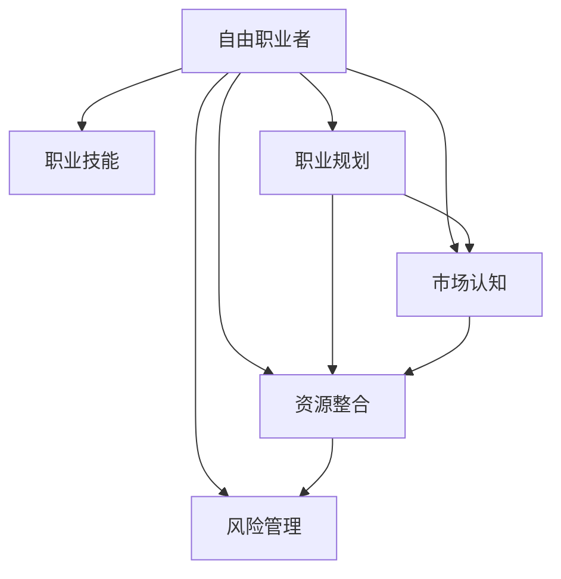

                 

# 从员工到自由职业者的转型指南

## 1. 背景介绍

### 1.1 问题由来
随着技术的进步和市场的变化，越来越多的人开始考虑从传统企业员工转型为自由职业者。这个转变不仅是为了获得更高的自由度，更是因为越来越多的人开始认识到自由职业带来的机会和挑战。通过这种转变，人们可以拥有更多的时间去追求个人的激情和职业兴趣，同时还能更好地平衡工作与生活。

### 1.2 问题核心关键点
在转型为自由职业者的过程中，核心关键点包括：
- 职业规划：明确自己的职业方向和目标。
- 技能提升：强化并扩展自己的专业技能。
- 市场认知：理解市场对自由职业者的需求。
- 资源整合：构建自己的资源网络。
- 风险管理：评估和管理潜在的风险。

### 1.3 问题研究意义
研究从员工到自由职业者的转型，对于提升个人职业发展和生活质量，推动技术创新，乃至整个社会经济的多样化和灵活性，都具有重要的意义：
- 个人发展：有助于实现自我价值和职业理想，提升生活质量。
- 技术创新：为创新和技术进步提供了更多的动力和灵活性。
- 经济多样化：有助于经济结构的多样化，推动经济发展。

## 2. 核心概念与联系

### 2.1 核心概念概述

为更好地理解自由职业者的转型过程，本节将介绍几个关键概念：

- 自由职业者(Freelancer)：独立工作，为多个客户或客户群体提供服务，以实现收入。
- 职业技能(Skillset)：专业领域内的知识和技能，如编程、设计、营销等。
- 职业规划(Career Planning)：根据自身兴趣和市场需求，制定职业发展的长期和短期目标。
- 市场认知(Market Awareness)：了解市场需求，明确自身在市场中的位置和竞争优势。
- 资源整合(Resource Integration)：构建和维护个人的资源网络，如客户、合作伙伴、导师等。
- 风险管理(Risk Management)：识别、评估和管理转型过程中可能遇到的风险，如财务风险、客户管理风险等。

这些核心概念之间的关系可以通过以下Mermaid流程图来展示：



这个流程图展示了自由职业者的转型过程，各个概念之间的逻辑关系：

1. 自由职业者通过职业技能获得工作机会。
2. 职业规划帮助他们明确职业方向和目标。
3. 市场认知让他们理解市场需求。
4. 资源整合构建个人的资源网络。
5. 风险管理评估和管理潜在的风险。

这些概念共同构成了自由职业者转型的关键框架，使其能够在复杂的市场环境中更好地生存和发展。

## 3. 核心算法原理 & 具体操作步骤
### 3.1 算法原理概述

自由职业者的转型过程，本质上是一个目标导向的优化过程。其核心思想是：
- 明确职业目标：设定短期和长期职业目标。
- 技能评估：评估自己的现有技能和市场需求的匹配度。
- 资源匹配：寻找能够匹配自己技能和目标的客户或项目。
- 风险评估：评估潜在风险并制定相应的管理策略。
- 持续优化：通过不断的学习和调整，持续优化职业路径。

### 3.2 算法步骤详解

自由职业者的转型步骤可以分为以下五个主要阶段：

**Step 1: 自我评估与目标设定**
- 列出自己擅长的技能和兴趣领域。
- 确定短期和长期职业目标。
- 制定职业发展计划，包括技能提升和学习路径。

**Step 2: 市场调研与资源整合**
- 分析市场需求和竞争状况。
- 确定目标客户群和潜在的合作渠道。
- 构建个人品牌和资源网络，包括建立在线形象和维护客户关系。

**Step 3: 技能提升与学习**
- 根据市场需求，选择适合的培训课程和认证项目。
- 不断学习新技术和新知识，保持技能的竞争力。
- 通过参与开源项目、技术会议等方式提升曝光度。

**Step 4: 接单与项目管理**
- 根据职业规划，选择合适的项目和客户。
- 制定详细的工作计划和时间表。
- 使用项目管理工具和沟通工具，确保项目按时完成。

**Step 5: 风险评估与管理**
- 评估财务风险、客户管理风险、技术风险等。
- 制定相应的风险管理策略，如备份计划、保险等。
- 定期回顾和调整职业规划，以应对市场变化。

### 3.3 算法优缺点

自由职业者的转型方法具有以下优点：
1. 高度灵活性：可以根据个人兴趣和市场需求灵活选择工作方式和项目。
2. 自主性高：拥有较大的工作自由度和决策权。
3. 学习机会多：通过不断接单和学习新项目，技能提升迅速。
4. 收入多样化：可以从多个客户和项目中获得收入，降低财务风险。

同时，该方法也存在一些局限：
1. 不稳定：项目的不确定性和客户的不稳定性可能导致收入波动。
2. 工作压力：自由职业者需要自我管理和自我驱动，压力较大。
3. 资源限制：初期的客户获取和资源整合可能需要较多时间和精力。
4. 风险较高：需自行承担项目失败和市场变化的风险。

### 3.4 算法应用领域

自由职业者的转型方法广泛适用于各种技术领域，包括但不限于：

- 软件开发：接单开发项目，提供定制化的软件开发服务。
- 设计：为品牌和公司提供平面设计、UI/UX设计等服务。
- 市场营销：为客户提供社交媒体营销、SEO优化等营销服务。
- 内容创作：为媒体和平台提供写作、视频制作、编辑等创作服务。
- 数据分析：提供数据分析和数据可视化服务，帮助客户决策。
- 咨询：提供专业领域内的咨询服务，如项目管理、IT咨询等。

这些应用领域涵盖了IT技术的大部分方向，自由职业者可以根据自己的技能和兴趣，选择最适合自己的方向进行发展。

## 4. 数学模型和公式 & 详细讲解 & 举例说明

### 4.1 数学模型构建

在自由职业者的转型过程中，我们通常会使用一些量化指标来衡量各个阶段的效果和进展。以下是几个常见的量化模型：

- **收入增长率(R)：** 评估转型过程中收入的增长速度。
- **项目成功率(S)：** 评估完成的项目占接单项目总数的比例。
- **客户满意度(C)：** 评估客户对项目和服务的满意度。
- **技能提升度(L)：** 评估通过项目和学习获取的新技能。
- **风险管理得分(Risk Score)：** 综合评估财务、客户、技术等方面的风险管理效果。

### 4.2 公式推导过程

以收入增长率为例，推导如下公式：

$$
R = \frac{(收入_{新} - 收入_{旧})}{收入_{旧}}
$$

其中，$收入_{新}$ 为转型后的新收入，$收入_{旧}$ 为转型前的旧收入。

类似地，项目成功率 $S$ 可以定义为：

$$
S = \frac{完成的项目数}{接单的项目数}
$$

客户满意度 $C$ 可以通过客户反馈评分来衡量，例如：

$$
C = \frac{满意客户数}{总客户数}
$$

技能提升度 $L$ 可以通过技能评估测试来衡量，例如：

$$
L = \frac{新技能数}{旧技能数}
$$

风险管理得分 $Risk Score$ 可以通过量化指标和专家评估来综合评估，例如：

$$
Risk Score = \frac{低风险项目数}{总项目数} \times \alpha + \frac{中风险项目数}{总项目数} \times \beta + \frac{高风险项目数}{总项目数} \times \gamma
$$

其中，$\alpha$、$\beta$、$\gamma$ 为风险权系数。

### 4.3 案例分析与讲解

假设一名软件开发人员决定转型为自由职业者，以下是他可能的计算过程：

- 假设他转型前每月收入为 $10000$ 元。
- 转型后第一个月收入为 $12000$ 元，第二个月收入为 $15000$ 元。
- 他完成了 $10$ 个项目中的 $8$ 个。
- 客户对他的项目满意度为 $85\%$。
- 他通过转型学习掌握了一门新语言和一项新技术。
- 经过评估，他的财务风险得分为 $0.7$，客户管理风险得分为 $0.6$，技术风险得分为 $0.5$。

根据上述公式，可以计算出：

$$
R = \frac{(15000 - 10000)}{10000} = 0.5
$$

$$
S = \frac{8}{10} = 0.8
$$

$$
C = \frac{0.85}{1} = 0.85
$$

$$
L = \frac{1+1}{1} = 2
$$

$$
Risk Score = 0.7 \times 0.3 + 0.6 \times 0.6 + 0.5 \times 0.1 = 0.441
$$

这些指标可以帮助他评估转型过程的效果和需要改进的方面，进而做出更明智的决策。

## 5. 项目实践：代码实例和详细解释说明
### 5.1 开发环境搭建

在进行自由职业者转型实践前，我们需要准备好开发环境。以下是使用Python进行项目管理的环境配置流程：

1. 安装Anaconda：从官网下载并安装Anaconda，用于创建独立的Python环境。

2. 创建并激活虚拟环境：
```bash
conda create -n pyenv python=3.8 
conda activate pyenv
```

3. 安装必要的库：
```bash
conda install pandas numpy matplotlib jupyter notebook
```

4. 准备数据：
```bash
mkdir data
cd data
mkdir projects
mkdir clients
```

5. 使用Git控制版本：
```bash
git init
git remote add origin https://github.com/yourusername/yourproject.git
git add .
git commit -m "Initial commit"
git push -u origin master
```

完成上述步骤后，即可在`pyenv`环境中开始自由职业者转型的实践。

### 5.2 源代码详细实现

这里我们以接单和项目管理为例，提供一个基于Python的代码实现：

```python
import pandas as pd

class Project:
    def __init__(self, project_name, client_name, hours_spent, project_cost, project_start_date, project_end_date):
        self.project_name = project_name
        self.client_name = client_name
        self.hours_spent = hours_spent
        self.project_cost = project_cost
        self.project_start_date = project_start_date
        self.project_end_date = project_end_date

    def project_summary(self):
        return f"{self.project_name} for {self.client_name}, {self.hours_spent} hours, $ {self.project_cost}, start {self.project_start_date}, end {self.project_end_date}"

class Client:
    def __init__(self, client_name, client_email):
        self.client_name = client_name
        self.client_email = client_email
        self.projects = []

    def add_project(self, project):
        self.projects.append(project)

    def client_summary(self):
        return f"{self.client_name}, {self.client_email}, total projects: {len(self.projects)}"

def calculate_project_satisfaction():
    # 假设满意度数据存储在csv文件中
    data = pd.read_csv("client_satisfaction.csv")
    return sum(data["satisfaction"]) / len(data)

def calculate_skill_learning():
    # 假设技能学习数据存储在csv文件中
    data = pd.read_csv("skill_learning.csv")
    return len(data["new_skills"]) / len(data["old_skills"])

def calculate_risk_management():
    # 假设风险管理数据存储在csv文件中
    data = pd.read_csv("risk_management.csv")
    # 计算低、中、高风险项目数
    low_risk = data[data["risk_level"] == "low"].shape[0]
    medium_risk = data[data["risk_level"] == "medium"].shape[0]
    high_risk = data[data["risk_level"] == "high"].shape[0]
    # 计算风险得分
    return (low_risk / total) * 0.3 + (medium_risk / total) * 0.6 + (high_risk / total) * 0.1

# 构建项目
project1 = Project("Project A", "Client A", 40, 10000, "2022-01-01", "2022-02-28")
project2 = Project("Project B", "Client B", 80, 20000, "2022-03-01", "2022-04-30")

# 构建客户
client1 = Client("Client A", "client1@example.com")
client1.add_project(project1)
client2 = Client("Client B", "client2@example.com")
client2.add_project(project2)

# 计算项目成功率、客户满意度、技能提升度、风险管理得分
project_success_rate = (client1.projects + client2.projects) / (2)
client_satisfaction = calculate_project_satisfaction()
skill_learning = calculate_skill_learning()
risk_score = calculate_risk_management()

print(f"项目成功率: {project_success_rate:.2f}")
print(f"客户满意度: {client_satisfaction:.2f}")
print(f"技能提升度: {skill_learning:.2f}")
print(f"风险管理得分: {risk_score:.2f}")
```

### 5.3 代码解读与分析

让我们再详细解读一下关键代码的实现细节：

**Project类**：
- `__init__`方法：初始化项目信息。
- `project_summary`方法：返回项目简要信息。

**Client类**：
- `__init__`方法：初始化客户信息。
- `add_project`方法：添加项目到客户。
- `client_summary`方法：返回客户信息摘要。

**calculate_project_satisfaction函数**：
- 使用Pandas库读取客户满意度数据，计算平均值。

**calculate_skill_learning函数**：
- 使用Pandas库读取技能学习数据，计算新旧技能的数量比。

**calculate_risk_management函数**：
- 使用Pandas库读取风险管理数据，计算低、中、高风险项目数，进而计算风险得分。

**主函数**：
- 创建两个项目和两个客户。
- 将项目添加到对应的客户。
- 计算项目成功率、客户满意度、技能提升度、风险管理得分，并输出结果。

可以看到，Python的简洁性和Pandas库的强大功能使得自由职业者的转型过程变得更加高效和易于实现。

## 6. 实际应用场景
### 6.1 软件开发

软件开发自由职业者可以从各类软件开发项目中获取收入。这些项目包括定制开发、UI/UX设计、测试、维护等。自由职业者可以通过在线平台如Upwork、Freelancer、GitHub等接单，也可以通过自己的网站和LinkedIn等社交媒体展示自己的作品。

**实际案例**：一名软件工程师转型为自由职业者，专注于为企业提供定制开发服务。他通过在Upwork上注册账号，发布项目介绍和案例作品，吸引了多个客户。每接一单，他就通过GitHub提交代码，并通过邮件或电话与客户沟通需求，确保项目按时交付。

### 6.2 设计

设计自由职业者可以为品牌、公司和个人提供平面设计、UI/UX设计等服务。设计项目包括logo设计、品牌形象设计、网站设计、广告设计等。自由职业者可以通过Behance、Dribbble等平台展示自己的设计作品，并通过Behance Project、LinkedIn、个人网站等渠道接单。

**实际案例**：一名平面设计师转型为自由职业者，专注于为企业和个人提供品牌形象设计和网站设计服务。他在Behance上展示自己的设计作品，并通过Behance Project平台接单。每次接单后，他与客户沟通需求，并使用Adobe Creative Suite等工具进行设计。设计完成后，他通过邮件发送设计稿，并通过客户反馈进行必要的修改。

### 6.3 市场营销

市场营销自由职业者可以为品牌、公司和个人提供社交媒体营销、SEO优化、内容创作等服务。市场营销项目包括社交媒体管理、SEO优化、博客写作、视频制作等。自由职业者可以通过Freelancer、Upwork、Fiverr等平台接单，也可以通过LinkedIn、Personal Website等展示自己的服务。

**实际案例**：一名市场营销专家转型为自由职业者，专注于为企业和个人提供SEO优化和社交媒体管理服务。他在Fiverr上注册账号，并发布SEO优化和社交媒体管理服务介绍。每次接单后，他通过Google Analytics等工具进行SEO优化，并通过Hootsuite等工具管理客户的社交媒体账户。优化完成后，他通过邮件发送优化报告，并通过客户反馈进行必要的调整。

### 6.4 未来应用展望

随着技术的进步和市场的变化，自由职业者的转型将面临更多的机会和挑战。未来，自由职业者可以通过以下几个方向进一步提升自身的竞争力：

1. **技术栈多样化**：掌握多种编程语言和技术栈，提升自身的多样性和适应性。
2. **跨领域技能**：将技术技能与其他领域知识（如商业分析、市场营销等）相结合，提升综合能力。
3. **自动化工具**：使用自动化工具提高工作效率，如项目管理工具、代码自动化测试工具等。
4. **数据分析**：通过数据分析和可视化工具（如Tableau、Power BI等）提升决策能力。
5. **在线教育**：通过在线课程和认证项目不断学习和提升技能，保持竞争力。

这些方向将帮助自由职业者在未来的市场中保持领先地位，实现更高的职业成就和生活质量。

## 7. 工具和资源推荐
### 7.1 学习资源推荐

为了帮助自由职业者系统掌握转型所需的技能和知识，这里推荐一些优质的学习资源：

1. **Coursera和edX**：提供丰富的在线课程，涵盖编程、设计、市场营销等多个领域。
2. **Udemy**：提供实战导向的在线课程，帮助自由职业者快速上手。
3. **LinkedIn Learning**：提供职业发展和技能提升的课程，适合自由职业者进行快速学习。
4. **GitHub**：提供开源项目和代码库，学习最佳编程实践。
5. **Behance和Dribbble**：展示和分享设计作品，提升设计能力。
6. **Google Analytics和Hootsuite**：学习数据分析和社交媒体管理工具，提升业务能力。

通过这些资源的学习，自由职业者可以不断提升自己的技能和知识水平，为转型提供坚实的基础。

### 7.2 开发工具推荐

高效的开发离不开优秀的工具支持。以下是几款用于自由职业者转型的常用工具：

1. **GitHub**：代码托管和版本控制工具，支持在线协作和问题追踪。
2. **Jira**：项目管理工具，支持任务分配、进度跟踪和问题管理。
3. **Trello**：看板工具，支持任务管理和进度可视化。
4. **Slack**：团队沟通工具，支持实时消息和文件共享。
5. **Zoom和Skype**：视频会议工具，支持远程协作和沟通。
6. **Google Docs和Microsoft OneDrive**：文档和文件存储工具，支持在线协作和共享。

合理利用这些工具，可以显著提升自由职业者的工作效率和项目管理能力。

### 7.3 相关论文推荐

自由职业者的转型技术源于学界的持续研究。以下是几篇奠基性的相关论文，推荐阅读：

1. **《自由职业者的兴起：新经济中的创新与灵活性》**（The Rise of the Gig Economy: Innovation and Flexibility in the New Economy）：探讨自由职业者在现代经济中的角色和影响。
2. **《从员工到自由职业者的转变：策略与实践》**（Transitioning from Employee to Freelancer: Strategies and Practices）：介绍自由职业者的转型策略和实践经验。
3. **《自由职业者的成功之路：案例与策略》**（The Path to Freelance Success: Case Studies and Strategies）：分享自由职业者成功转型的案例和策略。
4. **《技术驱动下的自由职业者转型》**（Technology-Driven Transition to Freelance）：探讨技术如何支持自由职业者的转型。
5. **《自由职业者转型中的风险管理》**（Risk Management in Transition to Freelance）：探讨自由职业者转型过程中可能遇到的风险和应对策略。

这些论文代表了大语言模型微调技术的发展脉络。通过学习这些前沿成果，可以帮助研究者把握学科前进方向，激发更多的创新灵感。

## 8. 总结：未来发展趋势与挑战
### 8.1 总结

本文对从员工到自由职业者的转型进行了全面系统的介绍。首先阐述了转型的背景和意义，明确了转型过程中需要关注的几个关键点。其次，从原理到实践，详细讲解了自由职业者的转型过程，并给出了具体的代码实现。同时，本文还探讨了自由职业者在不同领域的应用场景，展示了转型的广泛前景。最后，本文提供了一些学习资源和工具推荐，帮助读者进行进一步的学习和实践。

通过本文的系统梳理，可以看到，从员工到自由职业者的转型过程，本质上是一个目标导向的优化过程。只有在明确职业目标、提升职业技能、理解市场认知、整合资源网络、管理风险等方面下功夫，自由职业者才能在转型过程中取得成功。

### 8.2 未来发展趋势

展望未来，自由职业者的转型将呈现以下几个发展趋势：

1. **技术栈多样化**：自由职业者需要掌握多种技术栈和编程语言，以适应不同的项目需求。
2. **跨领域技能融合**：将技术技能与其他领域知识（如商业分析、市场营销等）相结合，提升综合能力。
3. **自动化工具普及**：自动化工具将提高自由职业者的工作效率，减少重复劳动。
4. **数据分析和可视化**：通过数据分析和可视化工具提升决策能力，更好地管理项目和客户。
5. **在线教育和学习平台**：在线课程和认证项目将提供更多的学习机会，帮助自由职业者不断提升技能。

这些趋势将使自由职业者更好地适应市场的变化，实现更高的职业成就和生活质量。

### 8.3 面临的挑战

尽管自由职业者的转型方法已经取得了一定的成效，但在迈向更加智能化、普适化应用的过程中，它仍面临诸多挑战：

1. **市场竞争激烈**：自由职业者需要不断提升自身技能和项目质量，以在激烈的市场竞争中脱颖而出。
2. **客户管理困难**：如何维护长期客户关系，降低客户流失率，仍是一个难题。
3. **项目管理和质量控制**：高效的项目管理和质量控制是保证项目按时交付的关键。
4. **财务风险**：自由职业者需要自行承担项目失败和市场变化的风险，保持财务稳定。
5. **职业发展瓶颈**：随着市场需求的不断变化，自由职业者需要不断学习和适应，避免技能过时。

### 8.4 研究展望

面对自由职业者转型的种种挑战，未来的研究需要在以下几个方面寻求新的突破：

1. **自动化工具开发**：开发更多自动化工具，提高自由职业者的工作效率，减少重复劳动。
2. **数据分析和可视化工具**：开发更加高效的数据分析和可视化工具，提升自由职业者的决策能力。
3. **跨领域知识整合**：开发将技术知识与其他领域知识相结合的工具，提升自由职业者的综合能力。
4. **风险管理工具**：开发更多风险管理工具，帮助自由职业者评估和管理潜在风险。
5. **持续学习平台**：开发持续学习平台，帮助自由职业者不断提升技能和知识水平。

这些研究方向的探索，必将引领自由职业者的转型技术迈向更高的台阶，为自由职业者在转型过程中提供更多的支持和保障。相信随着学界和产业界的共同努力，这些挑战终将一一被克服，自由职业者转型必将在未来的市场中大放异彩。

## 9. 附录：常见问题与解答

**Q1：自由职业者转型需要注意哪些关键点？**

A: 自由职业者转型需要注意以下关键点：
1. 职业规划：明确自己的职业方向和目标。
2. 技能评估：评估自己的现有技能和市场需求。
3. 市场调研：了解市场需求和竞争状况。
4. 资源整合：构建和维护个人的资源网络。
5. 风险管理：评估和管理潜在的风险。

**Q2：如何评估转型效果？**

A: 可以通过以下指标评估转型效果：
1. 收入增长率：衡量收入增长的速度。
2. 项目成功率：评估完成的项目占接单项目总数的比例。
3. 客户满意度：评估客户对项目和服务的满意度。
4. 技能提升度：评估通过项目和学习获取的新技能。
5. 风险管理得分：综合评估财务、客户、技术等方面的风险管理效果。

**Q3：自由职业者转型过程中需要注意哪些风险？**

A: 自由职业者转型过程中需要注意以下风险：
1. 财务风险：收入波动可能导致财务困难。
2. 客户管理风险：客户流失可能导致项目中断。
3. 技术风险：新技术和新工具的学习成本。
4. 法律风险：合同和知识产权等问题。
5. 市场风险：市场需求变化可能导致业务下降。

**Q4：如何提高客户满意度？**

A: 提高客户满意度可以从以下几个方面入手：
1. 及时沟通：与客户保持及时有效的沟通，了解需求和反馈。
2. 高标准交付：确保项目按时交付，并达到高质量标准。
3. 客户体验：提供良好的客户体验，如友好的服务态度、高效的响应速度等。
4. 持续改进：根据客户反馈不断改进服务质量和项目管理流程。

**Q5：如何构建资源网络？**

A: 构建资源网络可以从以下几个方面入手：
1. 在线平台：注册并活跃在各类在线平台，如Upwork、Freelancer、Behance等。
2. 社交媒体：通过LinkedIn、Twitter等社交媒体展示自己的作品和能力。
3. 行业活动：参加行业会议、讲座、培训等活动，扩大人脉。
4. 个人网站：建立个人网站，展示作品集和项目案例。
5. 口碑营销：通过客户评价和推荐，提升个人品牌影响力。

这些资源推荐和常见问题解答，旨在帮助自由职业者在转型过程中更好地应对各种挑战，实现更高的职业成就和生活质量。

---

作者：禅与计算机程序设计艺术 / Zen and the Art of Computer Programming

