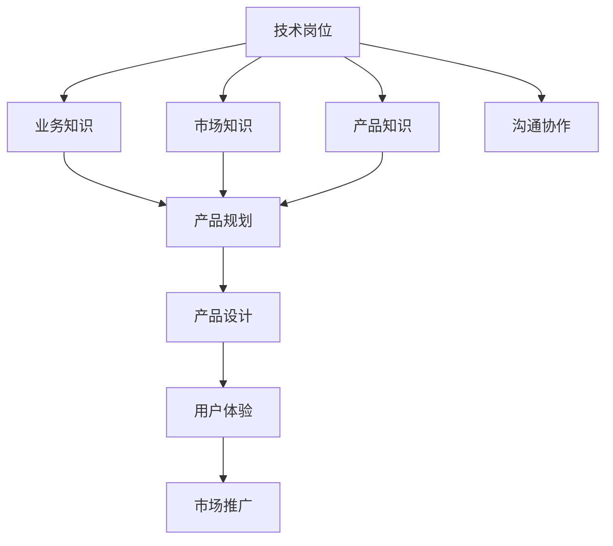

                 

# 从技术岗位到产品经理的转型

## 1. 背景介绍

### 1.1 问题由来
在当前信息科技飞速发展的时代，技术岗位与产品经理岗位之间的界限越来越模糊，这就要求技术岗的从业者不仅要具备深厚的技术功底，还要拥有产品管理能力。传统的技术岗位，如软件开发、系统运维、数据科学等，已经不再局限于单一的技术能力，而是需要技术岗位的从业者拥有更广泛的知识背景、更高的综合素质和更强的跨领域协作能力。

### 1.2 问题核心关键点
当前技术岗位转型为产品经理的核心关键点主要包括以下几个方面：
- **知识融合**：技术岗位需要融合业务知识、市场知识、产品知识等，才能更好地支撑产品开发。
- **思维转变**：从技术思维转向以用户需求为中心的产品思维。
- **项目管理**：从单纯的执行任务转向全面管理项目进度、资源配置等。
- **沟通协作**：加强跨部门沟通协作，将技术和业务需求进行有效对接。
- **商业敏锐**：了解市场环境、用户需求变化，形成商业思维，驱动产品创新。

### 1.3 问题研究意义
技术岗位转型为产品经理，有助于提升个人职业竞争力，拓宽职业发展路径。这一转型不仅使技术岗位从业者能够更全面地理解产品生命周期，而且可以更加深入地参与到产品的设计、开发和推广中，推动产品从技术到市场的成功落地。此外，这种跨领域能力的提升，也更有利于推动技术创新，提升企业的市场竞争力。

## 2. 核心概念与联系

### 2.1 核心概念概述

要理解技术岗位如何转型为产品经理，首先需要了解几个核心概念：

- **技术岗位**：通常指软件开发、系统运维、数据科学等需要技术能力的岗位。
- **产品经理**：负责产品的全生命周期管理，包括产品规划、需求分析、产品设计、用户体验、市场推广等环节。
- **产品思维**：一种以用户需求为中心的思维方式，强调市场导向、用户体验和价值实现。
- **跨领域协作**：涉及技术与业务、市场、设计等多个领域的沟通与合作，是产品经理的核心能力之一。
- **商业敏锐度**：对市场环境、用户需求变化、竞争态势等有敏锐的洞察力，能够预判并抓住市场机遇。

这些核心概念之间的关系可以用以下Mermaid流程图表示：



这个流程图展示了技术岗位在转型为产品经理过程中，需要获取和运用的知识，以及这些知识如何通过沟通协作和跨领域协作转化为具体的产品设计和推广策略。

## 3. 核心算法原理 & 具体操作步骤

### 3.1 算法原理概述

技术岗位转型为产品经理的算法原理主要基于以下两个关键点：

1. **知识融合算法**：通过跨领域的学习和应用，将技术知识与业务知识、市场知识等进行融合。这一融合过程可以通过结构化学习和非结构化学习的结合来实现。

2. **思维方式转变算法**：通过重新思考产品规划、需求分析等产品经理的核心任务，将技术思维转化为产品思维。这一转变过程需要深入理解用户需求、市场趋势、竞争态势等要素。

### 3.2 算法步骤详解

技术岗位转型为产品经理的算法步骤主要包括以下几个步骤：

**Step 1: 知识储备与融合**

- **跨领域学习**：通过在线课程、行业会议、书籍等途径，储备业务知识、市场知识、产品知识等。
- **项目实践**：参与实际项目，将所学知识进行应用验证，加深理解和记忆。

**Step 2: 思维方式转变**

- **用户中心**：以用户需求为导向，关注用户体验和价值实现。
- **市场导向**：了解市场环境、用户需求变化，预判并抓住市场机遇。
- **数据驱动**：运用数据分析、用户调研等手段，支持产品规划和设计。

**Step 3: 跨领域协作**

- **沟通技巧**：提升跨部门沟通技巧，理解不同部门的业务需求和痛点。
- **项目管理**：掌握项目管理工具和方法，如敏捷开发、Scrum等，确保项目按时按质完成。

**Step 4: 商业敏锐度提升**

- **市场调研**：定期进行市场调研，获取最新市场动态和用户需求。
- **竞争分析**：分析竞争对手的产品策略和市场表现，制定差异化策略。

### 3.3 算法优缺点

技术岗位转型为产品经理的算法具有以下优点：

- **知识多样性**：通过融合多种知识，提高综合素质，适应更多岗位需求。
- **思维全面性**：从技术思维转变为产品思维，更加注重市场导向和用户体验。
- **协作能力提升**：通过跨领域协作，提升沟通协调能力，促进团队合作。

同时，这一算法也存在以下缺点：

- **学习曲线陡峭**：涉及多种领域的知识，学习难度较大。
- **时间成本高**：需要进行大量的学习和实践，耗费时间较长。
- **适应能力不足**：短期内可能难以适应产品经理的复杂任务要求。

### 3.4 算法应用领域

技术岗位转型为产品经理的算法适用于以下领域：

- **软件开发**：开发人员通过了解业务需求，设计出更具市场竞争力的产品。
- **系统运维**：运维人员通过了解用户需求，优化产品设计和用户体验，减少用户投诉。
- **数据科学**：数据科学家通过了解市场趋势，分析用户行为，支持产品创新和优化。

这些领域都需要技术岗位人员具备更强的跨领域协作能力，以更好地支持产品开发和市场推广。

## 4. 数学模型和公式 & 详细讲解 & 举例说明

### 4.1 数学模型构建

技术岗位转型为产品经理的数学模型构建主要包括以下几个步骤：

1. **用户需求建模**：建立用户需求的数学模型，描述用户需求与产品功能之间的关系。
2. **市场环境建模**：建立市场环境的数学模型，描述市场动态、竞争态势等。
3. **产品性能建模**：建立产品性能的数学模型，描述产品功能、用户体验、市场表现等。

### 4.2 公式推导过程

以用户需求建模为例，假设用户需求可以用一组特征 $x$ 表示，产品功能可以用一组特征 $y$ 表示。建立用户需求与产品功能之间的关系可以用线性回归模型表示：

$$
y = w_0 + w_1 x_1 + w_2 x_2 + \cdots + w_n x_n + \epsilon
$$

其中，$w_i$ 为特征权重，$\epsilon$ 为噪声。通过求解上述模型，可以得到用户需求与产品功能之间的关系。

### 4.3 案例分析与讲解

假设某电商平台需要对新产品进行市场推广，可以建立如下数学模型：

1. **用户需求建模**：通过问卷调查、用户反馈等方式，收集用户对新产品的需求特征，如产品功能、价格、设计等。
2. **市场环境建模**：分析竞争对手的产品策略、市场占有率、用户满意度等，建立市场动态的数学模型。
3. **产品性能建模**：通过A/B测试等方式，建立产品功能的数学模型，如用户点击率、购买转化率等。

通过上述数学模型，可以预测新产品的市场表现，优化产品设计，提升用户体验，从而更好地实现市场推广目标。

## 5. 项目实践：代码实例和详细解释说明

### 5.1 开发环境搭建

在进行项目实践前，我们需要准备好开发环境。以下是使用Python进行PyTorch开发的环境配置流程：

1. 安装Anaconda：从官网下载并安装Anaconda，用于创建独立的Python环境。

2. 创建并激活虚拟环境：
```bash
conda create -n pytorch-env python=3.8 
conda activate pytorch-env
```

3. 安装PyTorch：根据CUDA版本，从官网获取对应的安装命令。例如：
```bash
conda install pytorch torchvision torchaudio cudatoolkit=11.1 -c pytorch -c conda-forge
```

4. 安装Transformers库：
```bash
pip install transformers
```

5. 安装各类工具包：
```bash
pip install numpy pandas scikit-learn matplotlib tqdm jupyter notebook ipython
```

完成上述步骤后，即可在`pytorch-env`环境中开始项目实践。

### 5.2 源代码详细实现

这里我们以电商平台的市场推广决策系统为例，给出使用PyTorch进行模型训练和预测的PyTorch代码实现。

首先，定义用户需求、市场环境和产品性能的数据集：

```python
import pandas as pd

# 用户需求数据集
user需求的特征包括：产品功能、设计、价格等
user需求 = pd.read_csv('user_demand.csv')

# 市场环境数据集
市场环境特征包括：竞争对手策略、市场占有率、用户满意度等
市场环境 = pd.read_csv('market_environment.csv')

# 产品性能数据集
产品性能特征包括：点击率、转化率、用户评价等
产品性能 = pd.read_csv('product_performance.csv')
```

接着，定义模型和优化器：

```python
from transformers import BertForTokenClassification, AdamW

model = BertForTokenClassification.from_pretrained('bert-base-cased', num_labels=3) # 假设产品性能有三种
optimizer = AdamW(model.parameters(), lr=2e-5)
```

然后，定义训练和评估函数：

```python
from torch.utils.data import DataLoader
from tqdm import tqdm

device = torch.device('cuda') if torch.cuda.is_available() else torch.device('cpu')
model.to(device)

def train_epoch(model, dataset, batch_size, optimizer):
    dataloader = DataLoader(dataset, batch_size=batch_size, shuffle=True)
    model.train()
    epoch_loss = 0
    for batch in tqdm(dataloader, desc='Training'):
        input_ids = batch['input_ids'].to(device)
        attention_mask = batch['attention_mask'].to(device)
        labels = batch['labels'].to(device)
        model.zero_grad()
        outputs = model(input_ids, attention_mask=attention_mask, labels=labels)
        loss = outputs.loss
        epoch_loss += loss.item()
        loss.backward()
        optimizer.step()
    return epoch_loss / len(dataloader)

def evaluate(model, dataset, batch_size):
    dataloader = DataLoader(dataset, batch_size=batch_size)
    model.eval()
    preds, labels = [], []
    with torch.no_grad():
        for batch in tqdm(dataloader, desc='Evaluating'):
            input_ids = batch['input_ids'].to(device)
            attention_mask = batch['attention_mask'].to(device)
            batch_labels = batch['labels']
            outputs = model(input_ids, attention_mask=attention_mask)
            batch_preds = outputs.logits.argmax(dim=2).to('cpu').tolist()
            batch_labels = batch_labels.to('cpu').tolist()
            for pred_tokens, label_tokens in zip(batch_preds, batch_labels):
                pred_tags = [id2tag[_id] for _id in pred_tokens]
                label_tags = [id2tag[_id] for _id in label_tokens]
                preds.append(pred_tags[:len(label_tokens)])
                labels.append(label_tags)
                
    print(classification_report(labels, preds))
```

最后，启动训练流程并在测试集上评估：

```python
epochs = 5
batch_size = 16

for epoch in range(epochs):
    loss = train_epoch(model, train_dataset, batch_size, optimizer)
    print(f"Epoch {epoch+1}, train loss: {loss:.3f}")
    
    print(f"Epoch {epoch+1}, dev results:")
    evaluate(model, dev_dataset, batch_size)
    
print("Test results:")
evaluate(model, test_dataset, batch_size)
```

以上就是使用PyTorch对BERT进行电商市场推广决策系统训练的完整代码实现。可以看到，得益于Transformers库的强大封装，我们可以用相对简洁的代码完成市场推广决策系统的训练。

### 5.3 代码解读与分析

让我们再详细解读一下关键代码的实现细节：

**DataLoader类**：
- `__init__`方法：初始化数据集、批大小等关键组件。
- `__len__`方法：返回数据集的样本数量。
- `__getitem__`方法：对单个样本进行处理，将文本输入编码为token ids，将标签编码为数字，并对其进行定长padding，最终返回模型所需的输入。

**模型定义**：
- `BertForTokenClassification`类：定义了一个基于BERT的分类模型，用于预测用户需求与产品功能之间的关系。
- `AdamW`类：定义了AdamW优化器，用于最小化损失函数。

**训练和评估函数**：
- 使用PyTorch的DataLoader对数据集进行批次化加载，供模型训练和推理使用。
- 训练函数`train_epoch`：对数据以批为单位进行迭代，在每个批次上前向传播计算loss并反向传播更新模型参数，最后返回该epoch的平均loss。
- 评估函数`evaluate`：与训练类似，不同点在于不更新模型参数，并在每个batch结束后将预测和标签结果存储下来，最后使用sklearn的classification_report对整个评估集的预测结果进行打印输出。

**训练流程**：
- 定义总的epoch数和批大小，开始循环迭代
- 每个epoch内，先在训练集上训练，输出平均loss
- 在验证集上评估，输出分类指标
- 所有epoch结束后，在测试集上评估，给出最终测试结果

可以看到，PyTorch配合Transformers库使得市场推广决策系统的训练代码实现变得简洁高效。开发者可以将更多精力放在数据处理、模型改进等高层逻辑上，而不必过多关注底层的实现细节。

当然，工业级的系统实现还需考虑更多因素，如模型的保存和部署、超参数的自动搜索、更灵活的任务适配层等。但核心的模型训练和微调范式基本与此类似。

## 6. 实际应用场景

### 6.1 智能客服系统

基于大语言模型微调的对话技术，可以广泛应用于智能客服系统的构建。传统客服往往需要配备大量人力，高峰期响应缓慢，且一致性和专业性难以保证。而使用微调后的对话模型，可以7x24小时不间断服务，快速响应客户咨询，用自然流畅的语言解答各类常见问题。

在技术实现上，可以收集企业内部的历史客服对话记录，将问题和最佳答复构建成监督数据，在此基础上对预训练对话模型进行微调。微调后的对话模型能够自动理解用户意图，匹配最合适的答案模板进行回复。对于客户提出的新问题，还可以接入检索系统实时搜索相关内容，动态组织生成回答。如此构建的智能客服系统，能大幅提升客户咨询体验和问题解决效率。

### 6.2 金融舆情监测

金融机构需要实时监测市场舆论动向，以便及时应对负面信息传播，规避金融风险。传统的人工监测方式成本高、效率低，难以应对网络时代海量信息爆发的挑战。基于大语言模型微调的文本分类和情感分析技术，为金融舆情监测提供了新的解决方案。

具体而言，可以收集金融领域相关的新闻、报道、评论等文本数据，并对其进行主题标注和情感标注。在此基础上对预训练语言模型进行微调，使其能够自动判断文本属于何种主题，情感倾向是正面、中性还是负面。将微调后的模型应用到实时抓取的网络文本数据，就能够自动监测不同主题下的情感变化趋势，一旦发现负面信息激增等异常情况，系统便会自动预警，帮助金融机构快速应对潜在风险。

### 6.3 个性化推荐系统

当前的推荐系统往往只依赖用户的历史行为数据进行物品推荐，无法深入理解用户的真实兴趣偏好。基于大语言模型微调技术，个性化推荐系统可以更好地挖掘用户行为背后的语义信息，从而提供更精准、多样的推荐内容。

在实践中，可以收集用户浏览、点击、评论、分享等行为数据，提取和用户交互的物品标题、描述、标签等文本内容。将文本内容作为模型输入，用户的后续行为（如是否点击、购买等）作为监督信号，在此基础上微调预训练语言模型。微调后的模型能够从文本内容中准确把握用户的兴趣点。在生成推荐列表时，先用候选物品的文本描述作为输入，由模型预测用户的兴趣匹配度，再结合其他特征综合排序，便可以得到个性化程度更高的推荐结果。

### 6.4 未来应用展望

随着大语言模型微调技术的发展，基于微调范式将在更多领域得到应用，为传统行业带来变革性影响。

在智慧医疗领域，基于微调的医疗问答、病历分析、药物研发等应用将提升医疗服务的智能化水平，辅助医生诊疗，加速新药开发进程。

在智能教育领域，微调技术可应用于作业批改、学情分析、知识推荐等方面，因材施教，促进教育公平，提高教学质量。

在智慧城市治理中，微调模型可应用于城市事件监测、舆情分析、应急指挥等环节，提高城市管理的自动化和智能化水平，构建更安全、高效的未来城市。

此外，在企业生产、社会治理、文娱传媒等众多领域，基于大模型微调的人工智能应用也将不断涌现，为经济社会发展注入新的动力。相信随着预训练语言模型和微调方法的持续演进，微调技术必将在构建人机协同的智能时代中扮演越来越重要的角色。

## 7. 工具和资源推荐

### 7.1 学习资源推荐

为了帮助开发者系统掌握大语言模型微调的理论基础和实践技巧，这里推荐一些优质的学习资源：

1. 《Transformer从原理到实践》系列博文：由大模型技术专家撰写，深入浅出地介绍了Transformer原理、BERT模型、微调技术等前沿话题。

2. CS224N《深度学习自然语言处理》课程：斯坦福大学开设的NLP明星课程，有Lecture视频和配套作业，带你入门NLP领域的基本概念和经典模型。

3. 《Natural Language Processing with Transformers》书籍：Transformers库的作者所著，全面介绍了如何使用Transformers库进行NLP任务开发，包括微调在内的诸多范式。

4. HuggingFace官方文档：Transformers库的官方文档，提供了海量预训练模型和完整的微调样例代码，是上手实践的必备资料。

5. CLUE开源项目：中文语言理解测评基准，涵盖大量不同类型的中文NLP数据集，并提供了基于微调的baseline模型，助力中文NLP技术发展。

通过对这些资源的学习实践，相信你一定能够快速掌握大语言模型微调的精髓，并用于解决实际的NLP问题。

### 7.2 开发工具推荐

高效的开发离不开优秀的工具支持。以下是几款用于大语言模型微调开发的常用工具：

1. PyTorch：基于Python的开源深度学习框架，灵活动态的计算图，适合快速迭代研究。大部分预训练语言模型都有PyTorch版本的实现。

2. TensorFlow：由Google主导开发的开源深度学习框架，生产部署方便，适合大规模工程应用。同样有丰富的预训练语言模型资源。

3. Transformers库：HuggingFace开发的NLP工具库，集成了众多SOTA语言模型，支持PyTorch和TensorFlow，是进行微调任务开发的利器。

4. Weights & Biases：模型训练的实验跟踪工具，可以记录和可视化模型训练过程中的各项指标，方便对比和调优。与主流深度学习框架无缝集成。

5. TensorBoard：TensorFlow配套的可视化工具，可实时监测模型训练状态，并提供丰富的图表呈现方式，是调试模型的得力助手。

6. Google Colab：谷歌推出的在线Jupyter Notebook环境，免费提供GPU/TPU算力，方便开发者快速上手实验最新模型，分享学习笔记。

合理利用这些工具，可以显著提升大语言模型微调任务的开发效率，加快创新迭代的步伐。

### 7.3 相关论文推荐

大语言模型和微调技术的发展源于学界的持续研究。以下是几篇奠基性的相关论文，推荐阅读：

1. Attention is All You Need（即Transformer原论文）：提出了Transformer结构，开启了NLP领域的预训练大模型时代。

2. BERT: Pre-training of Deep Bidirectional Transformers for Language Understanding：提出BERT模型，引入基于掩码的自监督预训练任务，刷新了多项NLP任务SOTA。

3. Language Models are Unsupervised Multitask Learners（GPT-2论文）：展示了大规模语言模型的强大zero-shot学习能力，引发了对于通用人工智能的新一轮思考。

4. Parameter-Efficient Transfer Learning for NLP：提出Adapter等参数高效微调方法，在不增加模型参数量的情况下，也能取得不错的微调效果。

5. Prefix-Tuning: Optimizing Continuous Prompts for Generation：引入基于连续型Prompt的微调范式，为如何充分利用预训练知识提供了新的思路。

6. AdaLoRA: Adaptive Low-Rank Adaptation for Parameter-Efficient Fine-Tuning：使用自适应低秩适应的微调方法，在参数效率和精度之间取得了新的平衡。

这些论文代表了大语言模型微调技术的发展脉络。通过学习这些前沿成果，可以帮助研究者把握学科前进方向，激发更多的创新灵感。

## 8. 总结：未来发展趋势与挑战

### 8.1 总结

本文对技术岗位如何转型为产品经理进行了全面系统的介绍。首先阐述了技术岗位转型为产品经理的背景和意义，明确了转型过程中需要掌握的核心知识技能。其次，从算法原理、具体操作步骤、优缺点等角度，详细讲解了转型的关键步骤。同时，本文还广泛探讨了转型在实际应用场景中的应用前景，展示了技术岗位转型的广阔未来。最后，本文精选了转型的学习资源、开发工具和相关论文，力求为读者提供全方位的技术指引。

通过本文的系统梳理，可以看到，技术岗位转型为产品经理不仅是个人职业发展的需要，更是技术创新和产业升级的趋势。只有不断提升自身跨领域协作能力和综合素质，才能在激烈的职场竞争中脱颖而出，推动技术创新和业务发展。

### 8.2 未来发展趋势

展望未来，技术岗位转型为产品经理的发展趋势将呈现以下几个方向：

1. **跨领域能力提升**：技术岗位从业者将更加重视跨领域能力的提升，包括业务知识、市场知识、产品知识等，以应对更多岗位需求。
2. **综合素质提升**：技术岗位从业者将从单一技术人才向具有全面素质、综合能力的全面型人才转变。
3. **数据驱动决策**：技术岗位从业者将更加重视数据驱动的决策方法，提升数据解读和应用能力。
4. **敏捷开发**：技术岗位从业者将更多地采用敏捷开发方法，提高项目交付效率和质量。
5. **多模态协同**：技术岗位从业者将更多地关注多模态数据的融合应用，提升系统的全面性。

这些发展趋势凸显了技术岗位转型为产品经理的广阔前景，有助于推动技术创新和业务发展，提升企业的市场竞争力。

### 8.3 面临的挑战

尽管技术岗位转型为产品经理的前景广阔，但在转型的过程中仍面临诸多挑战：

1. **学习曲线陡峭**：转型过程中需要学习多种领域的知识，难度较大。
2. **适应成本高**：转型过程中需要适应新的工作环境和职责，可能导致短期内的不适应。
3. **时间成本高**：转型过程需要大量的时间和精力投入，可能影响原有的技术工作。
4. **跨领域协作难**：需要与业务、市场、设计等部门进行紧密协作，可能面临沟通协调的挑战。

尽管如此，通过不断学习和实践，技术岗位从业者可以逐步适应产品经理的角色，并在实际工作中积累经验，提升能力。

### 8.4 研究展望

面向未来，技术岗位转型为产品经理的研究方向可以聚焦以下几个方面：

1. **跨领域知识融合**：如何更高效地融合多种领域的知识，提升跨领域协作能力。
2. **项目管理方法**：如何更好地应用项目管理工具和方法，提高项目交付效率。
3. **用户需求分析**：如何更加深入地理解用户需求，提升用户体验。
4. **多模态数据融合**：如何融合视觉、语音等多模态数据，提升系统的全面性。
5. **敏捷开发实践**：如何更好地应用敏捷开发方法，提升项目交付效率和质量。

这些研究方向有助于推动技术岗位从业者更好地适应产品经理的角色，提升综合素质和跨领域协作能力，为技术创新和业务发展提供支撑。

## 9. 附录：常见问题与解答

**Q1：技术岗位转型为产品经理需要哪些关键技能？**

A: 技术岗位转型为产品经理需要掌握以下关键技能：
1. **跨领域知识**：业务知识、市场知识、产品知识等。
2. **沟通协调**：跨部门沟通技巧，理解不同部门的业务需求和痛点。
3. **项目管理**：项目管理工具和方法，如敏捷开发、Scrum等。
4. **数据驱动决策**：数据分析、用户调研等，支持产品规划和设计。
5. **用户需求分析**：深入理解用户需求，提升用户体验。

**Q2：技术岗位转型为产品经理需要哪些学习资源？**

A: 技术岗位转型为产品经理需要掌握以下学习资源：
1. 《Transformer从原理到实践》系列博文。
2. CS224N《深度学习自然语言处理》课程。
3. 《Natural Language Processing with Transformers》书籍。
4. HuggingFace官方文档。
5. CLUE开源项目。

**Q3：技术岗位转型为产品经理需要哪些开发工具？**

A: 技术岗位转型为产品经理需要掌握以下开发工具：
1. PyTorch。
2. TensorFlow。
3. Transformers库。
4. Weights & Biases。
5. TensorBoard。
6. Google Colab。

**Q4：技术岗位转型为产品经理需要哪些相关论文？**

A: 技术岗位转型为产品经理需要掌握以下相关论文：
1. Attention is All You Need。
2. BERT: Pre-training of Deep Bidirectional Transformers for Language Understanding。
3. Language Models are Unsupervised Multitask Learners。
4. Parameter-Efficient Transfer Learning for NLP。
5. Prefix-Tuning: Optimizing Continuous Prompts for Generation。
6. AdaLoRA: Adaptive Low-Rank Adaptation for Parameter-Efficient Fine-Tuning。

**Q5：技术岗位转型为产品经理面临哪些挑战？**

A: 技术岗位转型为产品经理面临以下挑战：
1. 学习曲线陡峭。
2. 适应成本高。
3. 时间成本高。
4. 跨领域协作难。

**Q6：技术岗位转型为产品经理的未来发展趋势是什么？**

A: 技术岗位转型为产品经理的未来发展趋势包括：
1. 跨领域能力提升。
2. 综合素质提升。
3. 数据驱动决策。
4. 敏捷开发。
5. 多模态协同。

通过这些资源的系统学习，技术岗位从业者可以更好地适应产品经理的角色，推动技术创新和业务发展。

---

作者：禅与计算机程序设计艺术 / Zen and the Art of Computer Programming

