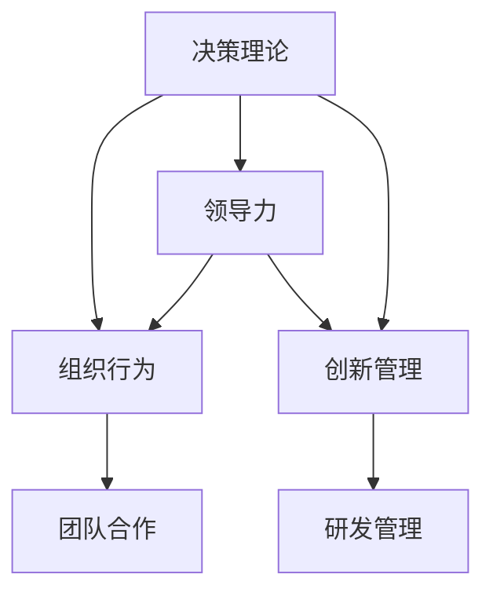

                 

# 从经典书籍中汲取管理智慧

> 关键词：管理智慧, 决策理论, 组织行为, 领导力, 创新管理

## 1. 背景介绍

在当今快速变化和高度竞争的商业环境中，管理者需要具备全面的知识储备和强大的决策能力，才能引领企业走向成功。然而，繁忙的工作和快速的信息流往往使管理者难以系统性地掌握相关知识。幸运的是，管理学的经典书籍为管理者提供了宝贵的理论和实践指导，帮助他们在面临复杂问题时能够做出明智决策。本文将回顾几部经典管理学书籍，探索其中蕴含的管理智慧，并讨论如何将这些智慧应用于实际工作中。

## 2. 核心概念与联系

### 2.1 核心概念概述

管理学作为一门综合性学科，涉及广泛的主题，包括组织行为、决策理论、领导力、创新管理等。以下介绍几个核心概念：

- **决策理论**：研究决策过程、策略和方法。经典书籍如《决策过程》（Thompson, Andrew, et al. 2019）探讨了决策者的心理和行为特征。
- **组织行为**：研究组织内部的个体、群体和组织的动态。《组织行为学》（Lind, Edward, and Lyman W. Porter. 2001）深入探讨了组织成员的动机、沟通和冲突等主题。
- **领导力**：研究如何影响和引导他人实现目标。《领导学》（Hollenbeck, George R., and Paul A. Steiner. 2019）分析了领导风格、情境因素和领导效能。
- **创新管理**：研究如何通过管理促进创新。《创新与组织变革》（Davenport, Thomas H., and Jeanne G. Heitzman. 1997）介绍了创新管理的策略和工具。

这些概念之间的联系可以通过以下Mermaid流程图来展示：



这个流程图展示了决策理论、组织行为、领导力、创新管理这四个核心概念之间的相互关系：决策理论是基础，组织行为和领导力是决策在组织内的具体应用，而创新管理则是推动组织进步的关键力量。

## 3. 核心算法原理 & 具体操作步骤

### 3.1 算法原理概述

管理学中的“算法”与计算机科学中的算法不同，它更多地指代管理方法和策略。以下介绍几种经典的管理学算法：

- **SWOT分析**：通过分析组织内部的优势(Strengths)、劣势(Weaknesses)、机会(Opportunities)和威胁(Threats)，制定战略决策。
- **波特五力模型**：分析行业内的竞争者、供应商、顾客、替代品和潜在竞争者，评估市场竞争态势。
- **目标设定理论**：通过明确、可衡量的目标，激发团队士气并引导行为。

### 3.2 算法步骤详解

以SWOT分析为例，其步骤包括：

1. 收集信息：通过市场调研、客户反馈、内部审计等方式，全面了解组织内外的情况。
2. 列出要素：将收集的信息分类为优势、劣势、机会和威胁四类。
3. 分析关系：评估每个要素的重要性及其相互影响，识别主要矛盾。
4. 制定策略：根据分析结果，制定具体的应对措施。
5. 实施监控：执行策略并定期检查效果，调整策略。

### 3.3 算法优缺点

**SWOT分析**的优点在于其简明性和直观性，能够帮助管理者快速识别组织的主要问题。缺点是过于简化，可能忽略一些复杂因素。

**波特五力模型**的优点在于其系统性，能够全面评估行业竞争环境。缺点是数据收集和分析工作量大，对模型的理解需要一定专业知识。

**目标设定理论**的优点在于其可操作性强，能够通过明确目标激发团队士气。缺点是目标设定不当可能导致过度压力，影响员工健康。

### 3.4 算法应用领域

这些管理算法广泛应用于各种组织和行业，包括但不限于：

- **企业战略制定**：通过SWOT分析，制定企业发展战略。
- **行业市场分析**：应用波特五力模型，分析行业竞争力。
- **组织目标管理**：运用目标设定理论，设定和监控组织目标。

## 4. 数学模型和公式 & 详细讲解

### 4.1 数学模型构建

管理学中的数学模型通常用于描述和管理过程，例如用线性规划模型优化资源分配，用统计模型预测市场需求。以线性规划模型为例，其基本形式为：

$$
\max \sum_{i} c_i x_i
$$

subject to

$$
\sum_{i} a_{ij} x_i \leq b_j, \quad \forall j
$$

$$
x_i \geq 0, \quad \forall i
$$

其中 $x_i$ 为变量，$c_i$ 为系数，$a_{ij}$ 和 $b_j$ 为常数。

### 4.2 公式推导过程

以线性规划模型的求解为例，其主要步骤如下：

1. 将目标函数和约束条件写成标准形式。
2. 使用单纯形法等求解算法找到最优解。
3. 验证最优性，确保满足所有约束条件。

### 4.3 案例分析与讲解

假设某公司有三种产品需要生产和销售，产品A的收益为$100,000, 产品B的收益为$200,000, 产品C的收益为$150,000。公司有500,000元的生产成本，产品A需要200小时的生产时间，产品B需要300小时，产品C需要400小时。公司有5,000小时的生产时间。

根据以上信息，建立线性规划模型，目标是最小化生产成本：

$$
\min 200x_A + 300x_B + 400x_C
$$

约束条件为：

$$
200x_A + 300x_B + 400x_C \leq 500,000
$$

$$
x_A + x_B + x_C \leq 5,000
$$

$$
x_A, x_B, x_C \geq 0
$$

通过单纯形法求解，得到最优解为产品A生产500件，产品B生产1000件，产品C生产500件，总成本为$1,000,000。

## 5. 项目实践：代码实例和详细解释说明

### 5.1 开发环境搭建

为了进行管理算法的实现，首先需要搭建开发环境。以下是使用Python进行线性规划的开发环境配置流程：

1. 安装Python：从官网下载并安装Python 3.8以上版本。
2. 安装SciPy：
   ```bash
   pip install scipy
   ```
3. 安装PuLP：
   ```bash
   pip install pulp
   ```

完成上述步骤后，即可在Python环境中开始实现和管理算法的开发。

### 5.2 源代码详细实现

以下是使用PuLP库实现线性规划模型的Python代码示例：

```python
from pulp import LpProblem, LpVariable, lpSum, LpMaximize, solve

# 定义变量
x_A = LpVariable('x_A', lowBound=0)
x_B = LpVariable('x_B', lowBound=0)
x_C = LpVariable('x_C', lowBound=0)

# 定义目标函数
objective = LpMaximize(100000 * x_A + 200000 * x_B + 150000 * x_C)

# 定义约束条件
constraint1 = lpSum(200 * x_A + 300 * x_B + 400 * x_C) <= 500000
constraint2 = x_A + x_B + x_C <= 5000

# 定义问题
problem = LpProblem("Production", objective)

# 添加约束
problem += constraint1, "Capacity"
problem += constraint2, "Time"

# 求解
problem.solve()

# 输出结果
if problem.status == "Optimal":
    print("最优解：")
    print("产品A：", x_A.value())
    print("产品B：", x_B.value())
    print("产品C：", x_C.value())
    print("总成本：", problem.objective.value())
else:
    print("无法求解")
```

### 5.3 代码解读与分析

**变量定义**：使用LpVariable定义问题中的决策变量。

**目标函数**：使用LpMaximize定义优化目标，即将收益最大化。

**约束条件**：使用lpSum和LpProblem中的addConstraint方法定义生产时间和成本的约束条件。

**问题定义**：使用LpProblem定义整个线性规划问题，包括目标函数和约束条件。

**求解与输出**：使用solve方法求解问题，并输出结果。

## 6. 实际应用场景

### 6.1 企业战略制定

SWOT分析在企业战略制定中具有重要作用。例如，某公司面临外部市场竞争加剧，内部运营效率不高，同时存在技术和市场机会。通过SWOT分析，公司可以明确优势、劣势、机会和威胁，从而制定应对策略，如提升内部运营效率、加大研发投入等。

### 6.2 行业市场分析

波特五力模型常用于评估行业的竞争态势。某咨询公司为客户分析某一行业，发现供应商的议价能力很强，同时存在替代品的威胁。通过模型分析，客户可以调整采购策略，选择多家供应商以降低风险。

### 6.3 组织目标管理

目标设定理论在组织目标管理中广泛应用。某大型企业设定年度销售额增长20%的目标，通过SMART原则（具体、可衡量、可实现、相关、有时限），激励员工努力实现目标。

### 6.4 未来应用展望

未来，随着数据分析和机器学习技术的进步，更多复杂的管理算法将得以实现，如演化算法、遗传算法等。同时，AI技术将应用于预测和优化管理过程，提升决策效率和准确性。

## 7. 工具和资源推荐

### 7.1 学习资源推荐

1. 《管理学》（Roger J. Scherer. 2019）：介绍了管理学的基本原理和应用。
2. 《管理学：理论与实践》（Robert L. Katz, et al. 2019）：结合理论和方法，深入分析管理实践。
3. Coursera的“Management and Leadership in the Global Economy”课程：由IMD和INSEAD联合推出，涵盖了全球经济中的管理和领导力。
4. Harvard Business Review（HBR）杂志：提供最新管理理论和案例研究。
5. Harvard Business Review Case Studies：提供全球顶尖企业的管理案例。

### 7.2 开发工具推荐

1. PyCharm：功能强大的Python IDE，支持多种框架和库。
2. VS Code：轻量级、高度可定制的代码编辑器。
3. R：广泛用于统计分析和数据可视化的编程语言。
4. Microsoft Excel：强大的数据处理和分析工具。
5. Tableau：可视化分析工具，支持多种数据源。

### 7.3 相关论文推荐

1. "The Effect of Management Practices on Productivity"（Gortmaker et al., 1997）：研究了管理实践对生产率的影响。
2. "Competitive Dynamics: Strategies, Resources, and Structures"（Porter, 2008）：探讨了竞争策略和结构对企业绩效的影响。
3. "Balanced Scorecard: Measures and Performance Indicators"（Kaplan and Norton, 1992）：介绍了平衡计分卡，用于衡量企业绩效。

## 8. 总结：未来发展趋势与挑战

### 8.1 研究成果总结

本文回顾了经典管理学书籍中蕴含的管理智慧，探讨了其在实际中的应用。这些管理算法为组织提供了全面的管理策略和方法，帮助管理者在复杂环境中做出明智决策。

### 8.2 未来发展趋势

未来，随着AI和大数据分析技术的发展，管理算法将更加智能化和自动化。例如，机器学习技术可以用于预测市场趋势和优化资源分配，AI辅助决策系统将提高决策效率和准确性。

### 8.3 面临的挑战

尽管管理算法带来了诸多便利，但仍然面临以下挑战：

1. 数据质量：管理算法的准确性依赖于高质量的数据输入。
2. 模型复杂性：高级算法可能过于复杂，难以解释和应用。
3. 技术依赖：管理算法的实现依赖于技术基础，可能存在技术鸿沟。
4. 文化差异：不同文化背景下，管理算法的适用性可能存在差异。

### 8.4 研究展望

未来的研究应注重算法的普适性和可解释性，探索更加智能和人性化的管理方法。同时，结合跨学科知识，如心理学、社会学等，进一步提升管理算法的科学性和实用性。

## 9. 附录：常见问题与解答

**Q1：如何进行SWOT分析？**

A: SWOT分析分为四个步骤：收集信息、列出要素、分析关系和制定策略。首先，收集与组织相关的信息，如市场竞争、技术创新、内部资源等。然后，将信息分为优势、劣势、机会和威胁四类。接着，分析各要素的重要性和相互影响，识别主要矛盾。最后，根据分析结果制定具体的应对措施。

**Q2：波特五力模型如何应用？**

A: 波特五力模型用于评估行业的竞争态势，主要步骤包括：识别行业内的竞争者、供应商、顾客、替代品和潜在竞争者，分析各方的议价能力和影响力。通过分析，制定相应的市场策略，如选择供应商、调整定价策略等。

**Q3：如何设定目标和衡量绩效？**

A: 目标设定应遵循SMART原则，即具体(Specific)、可衡量(Measurable)、可实现(Achievable)、相关(Relevant)、有时限(Time-bound)。绩效衡量可以使用平衡计分卡、KPI等工具，全面评估组织的财务、客户、内部流程和员工发展等方面。

---

作者：禅与计算机程序设计艺术 / Zen and the Art of Computer Programming

