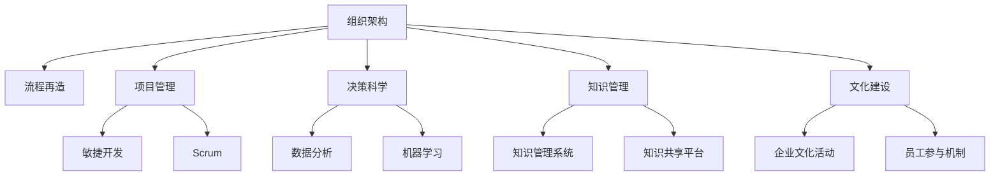

                 

# 从经典到实践：管理理论的落地

> 关键词：管理理论, 组织架构, 项目管理, 决策科学, 业务流程, 数据驱动, 知识管理, 文化建设

## 1. 背景介绍

### 1.1 问题由来
随着数字化转型的加速和互联网的广泛应用，企业的管理模式和运营方式发生了深刻的变化。传统的管理学理论在应对这些变化时，逐渐显得力不从心。如何在快速变化的商业环境中，持续优化管理方法，构建高效的组织架构，是当今管理学家和企业家们面临的共同挑战。

### 1.2 问题核心关键点
本节将从以下几个方面深入分析管理理论在实践中的应用：
1. **组织架构的设计**：如何将管理学理论应用于构建和优化组织架构，以提升组织的运营效率和创新能力。
2. **项目管理的方法**：如何结合现代技术手段，如敏捷开发、Scrum等，优化项目管理流程，提升项目执行的效率和质量。
3. **决策科学的应用**：如何将数据驱动的方法引入决策过程，提高决策的科学性和准确性。
4. **业务流程的再造**：如何在数字化时代，通过流程优化和业务再造，实现业务流程的自动化和智能化，提升企业竞争力。
5. **知识管理的实践**：如何利用知识管理系统，促进组织内部的知识共享和创新，提高企业的整体竞争力。
6. **文化建设的策略**：如何在数字化时代，构建具有创新力和适应力的企业文化，增强员工的凝聚力和归属感。

### 1.3 问题研究意义
管理理论的落地实践，对于提升企业的运营效率、增强企业的创新能力、提高企业的市场竞争力具有重要的意义：

1. **提升运营效率**：通过优化组织架构、流程再造等措施，企业可以大幅提升内部运营效率，减少资源浪费。
2. **增强创新能力**：通过项目管理、决策科学、知识管理等手段，企业可以更好地激发员工的创新潜力，加速产品迭代和市场响应。
3. **提高市场竞争力**：通过数据驱动的决策、敏捷的项目管理，企业可以快速适应市场变化，抢占市场先机。
4. **构建品牌价值**：通过文化建设，企业可以塑造独特的品牌形象，增强品牌忠诚度和市场信任度。

## 2. 核心概念与联系

### 2.1 核心概念概述
为了更好地理解管理理论在实践中的应用，本节将介绍几个密切相关的核心概念：

1. **组织架构**：指企业的正式结构，包括部门划分、职责分工、汇报关系等。
2. **项目管理**：指在特定时间、预算和资源限制下，规划、执行和控制项目以实现特定目标的过程。
3. **决策科学**：指通过数据、模型和算法，帮助决策者做出基于事实的决策过程。
4. **业务流程再造(BPR)**：指对企业的核心业务流程进行根本性的重新思考和彻底的再设计，以提高效率和响应速度。
5. **知识管理**：指通过系统的管理方法，使知识成为组织中最有价值的资产。
6. **文化建设**：指通过一系列活动和策略，构建一个具有共同价值观和行为准则的企业文化。

这些核心概念之间的逻辑关系可以通过以下Mermaid流程图来展示：



这个流程图展示了大管理理论在实践中的应用框架：

1. 组织架构通过流程再造、项目管理等手段，优化企业运营效率。
2. 决策科学通过数据分析和机器学习，提升决策的科学性。
3. 知识管理通过知识管理系统和共享平台，促进知识流动和创新。
4. 文化建设通过企业文化活动和员工参与机制，增强企业的凝聚力和适应力。

## 3. 核心算法原理 & 具体操作步骤
### 3.1 算法原理概述

管理理论在实践中落地，主要通过以下几个关键步骤：

1. **组织架构设计**：根据企业的战略目标和业务需求，设计合理的组织架构，明确部门和岗位的职责和关系。
2. **项目管理实施**：结合敏捷开发、Scrum等方法，优化项目管理的流程，提高项目执行的效率和质量。
3. **决策科学应用**：利用数据分析和机器学习技术，构建数据驱动的决策支持系统，提升决策的科学性和准确性。
4. **业务流程再造**：通过业务流程的重新设计和优化，实现业务流程的自动化和智能化，提升企业的运营效率和市场响应速度。
5. **知识管理实践**：建立知识管理系统和共享平台，促进组织内部的知识共享和创新，提升企业的整体竞争力。
6. **文化建设策略**：通过企业文化活动和员工参与机制，构建具有创新力和适应力的企业文化，增强员工的凝聚力和归属感。

### 3.2 算法步骤详解

#### 3.2.1 组织架构设计
组织架构设计的核心在于明确企业的战略目标和业务需求，设计合理的部门和岗位，确保职责和权限的清晰划分。具体步骤如下：

1. **确定战略目标**：明确企业的长期战略目标和短期业务需求。
2. **划分部门**：根据业务性质和功能，将企业划分为若干部门。
3. **定义职责**：明确每个部门和岗位的职责和权限。
4. **设计汇报关系**：确定各部门之间的汇报关系和沟通机制。

#### 3.2.2 项目管理实施
项目管理实施的核心在于通过敏捷开发、Scrum等方法，优化项目管理的流程，提高项目执行的效率和质量。具体步骤如下：

1. **制定项目计划**：明确项目的范围、目标、时间、资源和预算。
2. **组建项目团队**：根据项目需求，组建跨职能的项目团队。
3. **实施敏捷开发**：采用敏捷开发的方法，进行迭代开发和持续交付。
4. **应用Scrum框架**：引入Scrum框架，进行迭代、回测和持续改进。
5. **监控项目进展**：使用项目管理工具，如JIRA、Trello等，监控项目进展和任务分配。

#### 3.2.3 决策科学应用
决策科学应用的核心在于利用数据分析和机器学习技术，构建数据驱动的决策支持系统，提升决策的科学性和准确性。具体步骤如下：

1. **数据收集**：收集与决策相关的数据，包括内部业务数据、市场数据、客户反馈等。
2. **数据清洗**：对数据进行清洗、处理和预处理，确保数据的准确性和完整性。
3. **数据分析**：利用数据分析技术，如回归分析、聚类分析、时间序列分析等，进行数据挖掘和特征提取。
4. **模型构建**：构建机器学习模型，如回归模型、分类模型、聚类模型等，进行预测和分类。
5. **模型评估**：评估模型的性能和准确性，确保模型的可靠性和实用性。
6. **决策支持**：将模型集成到决策支持系统中，辅助决策者进行科学决策。

#### 3.2.4 业务流程再造
业务流程再造的核心在于通过重新设计和优化业务流程，实现业务流程的自动化和智能化，提升企业的运营效率和市场响应速度。具体步骤如下：

1. **流程识别**：识别企业当前的业务流程，找出其中的瓶颈和冗余环节。
2. **流程设计**：根据业务需求和目标，重新设计和优化业务流程。
3. **流程实施**：通过信息系统和自动化工具，实现业务流程的自动化和智能化。
4. **流程监控**：使用流程监控工具，实时监控业务流程的执行情况和性能指标。
5. **流程改进**：根据监控结果和反馈，持续改进和优化业务流程。

#### 3.2.5 知识管理实践
知识管理实践的核心在于建立知识管理系统和共享平台，促进组织内部的知识共享和创新，提升企业的整体竞争力。具体步骤如下：

1. **知识分类**：对企业的知识进行分类和整理，明确不同类型知识的存储和共享方式。
2. **知识收集**：通过文档、会议、培训等方式，收集和整理企业的知识资源。
3. **知识共享**：建立知识共享平台，促进组织内部知识的交流和传播。
4. **知识应用**：将知识应用于业务决策和创新实践中，提升企业的核心竞争力。
5. **知识保护**：采取适当的措施，保护企业的核心知识和知识产权。

#### 3.2.6 文化建设策略
文化建设策略的核心在于通过企业文化活动和员工参与机制，构建具有创新力和适应力的企业文化，增强员工的凝聚力和归属感。具体步骤如下：

1. **文化定义**：明确企业的核心价值观和文化理念。
2. **文化传播**：通过企业文化活动、内部培训等方式，传播企业的文化理念。
3. **员工参与**：鼓励员工参与企业文化建设，增强员工的认同感和归属感。
4. **文化评估**：定期评估企业文化建设的进展和效果，持续改进和优化。

### 3.3 算法优缺点

#### 3.3.1 优点
1. **提高效率**：通过优化组织架构、流程再造和项目管理，企业可以大幅提升运营效率，减少资源浪费。
2. **增强创新**：通过知识管理、决策科学和敏捷开发，企业可以更好地激发员工的创新潜力，加速产品迭代和市场响应。
3. **提升竞争力**：通过数据驱动的决策、业务流程再造和敏捷项目管理，企业可以快速适应市场变化，抢占市场先机。
4. **构建品牌**：通过文化建设，企业可以塑造独特的品牌形象，增强品牌忠诚度和市场信任度。

#### 3.3.2 缺点
1. **实施复杂**：管理理论在实践中的落地实施较为复杂，需要高层领导的支持和推动。
2. **资源消耗**：优化和再造流程、构建知识管理系统等，需要大量的资金和人力资源投入。
3. **员工抵触**：改变现有的工作方式和流程，可能会遭到部分员工的抵触和反对。
4. **效果滞后**：管理理论在实践中的效果往往需要较长时间才能显现，难以快速见效。

### 3.4 算法应用领域

管理理论的落地实践，在多个领域得到了广泛应用：

1. **制造业**：通过优化组织架构和业务流程，提升生产效率和产品质量。
2. **金融业**：通过敏捷开发和数据驱动决策，提高金融产品的创新能力和市场响应速度。
3. **医疗健康**：通过项目管理和文化建设，提升医疗服务的质量和效率。
4. **零售业**：通过流程再造和知识管理，优化供应链和提升客户满意度。
5. **教育培训**：通过项目管理和决策科学，提升教育培训的质量和效果。
6. **公共服务**：通过流程优化和文化建设，提升公共服务的效率和质量。

## 4. 数学模型和公式 & 详细讲解  
### 4.1 数学模型构建

在管理理论的实践中，涉及的数学模型主要包括：

1. **组织架构优化模型**：通过网络分析、层次分析法等，优化企业的组织架构。
2. **项目管理模型**：如PERT图、甘特图等，优化项目管理的流程和资源分配。
3. **决策科学模型**：如线性规划、非线性规划等，进行决策支持和优化。
4. **业务流程再造模型**：如BPR模型、敏捷开发模型等，进行流程设计和优化。
5. **知识管理模型**：如信息检索模型、知识网络模型等，促进知识的共享和应用。
6. **文化建设模型**：如员工满意度模型、组织认同模型等，评估和改进企业文化。

### 4.2 公式推导过程

以组织架构优化模型为例，其核心思想是通过网络分析法，评估组织架构的合理性，并进行优化。具体步骤如下：

1. **建立组织架构网络**：将企业组织架构表示为有向图，每个部门和岗位表示为节点，部门之间的汇报关系表示为边。
2. **计算网络指标**：通过计算网络指标，如中心度、连通性等，评估网络的整体性能和效率。
3. **优化网络结构**：根据网络指标，进行网络结构优化，如减少冗余节点、增加跨部门协作等。
4. **实施优化方案**：将优化后的网络结构应用到企业中，提升组织架构的合理性和效率。

### 4.3 案例分析与讲解

#### 4.3.1 案例背景
某大型制造企业，通过数据驱动的管理方法，优化其组织架构和业务流程，实现了生产效率的大幅提升。

#### 4.3.2 案例分析
1. **现状分析**：该企业原有的组织架构较为复杂，部门职责不清晰，汇报关系混乱。生产效率低下，产品品质不稳定。
2. **优化方案**：通过网络分析法，识别出冗余部门和瓶颈环节，进行了重新设计和优化。将部门重新划分为生产、研发、营销、财务等几个大部门，明确了各部门的职责和汇报关系。
3. **实施效果**：经过优化后，企业的生产效率提升了20%，产品品质显著提高。员工的工作满意度也得到了提升。
4. **经验总结**：通过网络分析法，能够客观地评估和优化组织架构，提升企业的运营效率和竞争力。

## 5. 项目实践：代码实例和详细解释说明
### 5.1 开发环境搭建

在进行管理理论的实践项目开发时，需要进行环境配置，具体步骤如下：

1. **安装Python环境**：从官网下载并安装Python，确保其版本与项目要求一致。
2. **安装依赖库**：使用pip命令安装所需的依赖库，如pandas、numpy、scikit-learn等。
3. **设置开发环境**：通过虚拟环境，隔离开发与生产环境，确保项目开发的安全性和稳定性。

### 5.2 源代码详细实现

以组织架构优化为例，给出使用Python进行网络分析的代码实现。

```python
import networkx as nx
import pandas as pd

# 读取组织架构数据
df = pd.read_csv('org_structure.csv')

# 构建网络图
G = nx.Graph()
for i, row in df.iterrows():
    G.add_node(row['name'])
    for child in row['children']:
        G.add_edge(row['name'], child)

# 计算中心度
centrality = nx.betweenness_centrality(G)

# 输出中心度高的节点
for node, centrality in centrality.items():
    print(f'{node}: {centrality}')
```

### 5.3 代码解读与分析

#### 5.3.1 代码解读
1. **导入库**：导入networkx和pandas库，分别用于构建网络和读取数据。
2. **数据读取**：使用pandas库读取组织架构数据，数据格式为CSV文件。
3. **构建网络图**：通过networkx库构建有向图，每个部门表示为一个节点，部门之间的汇报关系表示为边。
4. **计算中心度**：使用networkx库计算网络中各节点的中心度，即节点在网络中的重要性。
5. **输出结果**：输出中心度高的节点，并进行分析。

#### 5.3.2 分析
通过网络分析法，可以客观地评估组织架构的合理性，找出中心度高的部门和汇报关系，进行优化。在实践中，可以通过多次迭代和优化，逐步提升组织架构的效率和效果。

## 6. 实际应用场景
### 6.1 智能客服系统

#### 6.1.1 背景
智能客服系统通过管理理论的落地实践，实现了客户服务的智能化和自动化，提升了客户满意度和企业效率。

#### 6.1.2 实践方案
1. **组织架构设计**：构建跨部门的客户服务中心，明确各部门职责和协作机制。
2. **项目管理实施**：引入敏捷开发和Scrum方法，进行迭代开发和持续交付。
3. **决策科学应用**：利用客户数据和机器学习模型，优化客服策略和流程。
4. **业务流程再造**：通过流程自动化和智能化，提升客服处理的效率和质量。
5. **知识管理实践**：建立客户知识库和知识共享平台，促进客户服务经验的传播和应用。
6. **文化建设策略**：通过企业文化活动，增强客服人员的服务意识和责任感。

### 6.2 金融风控系统

#### 6.2.1 背景
金融风控系统通过管理理论的落地实践，提升了金融风险管理的科学性和准确性，降低了风险损失。

#### 6.2.2 实践方案
1. **组织架构设计**：构建风险控制部门和跨部门的协作机制。
2. **项目管理实施**：引入敏捷开发和Scrum方法，进行风险评估和监控。
3. **决策科学应用**：利用金融数据和机器学习模型，进行风险预测和分类。
4. **业务流程再造**：通过流程自动化和智能化，提升风险评估和监控的效率和质量。
5. **知识管理实践**：建立风险知识库和知识共享平台，促进风险评估经验的传播和应用。
6. **文化建设策略**：通过企业文化活动，增强风控人员的风险意识和责任感。

### 6.3 供应链管理系统

#### 6.3.1 背景
供应链管理系统通过管理理论的落地实践，实现了供应链管理的智能化和高效化，提升了企业的供应链效率和响应速度。

#### 6.3.2 实践方案
1. **组织架构设计**：构建跨部门的供应链管理部门，明确各部门职责和协作机制。
2. **项目管理实施**：引入敏捷开发和Scrum方法，进行供应链流程优化和改进。
3. **决策科学应用**：利用供应链数据和机器学习模型，进行供应链预测和优化。
4. **业务流程再造**：通过流程自动化和智能化，提升供应链管理的效率和质量。
5. **知识管理实践**：建立供应链知识库和知识共享平台，促进供应链管理经验的传播和应用。
6. **文化建设策略**：通过企业文化活动，增强供应链人员的协作意识和责任感。

### 6.4 未来应用展望

#### 6.4.1 数字化转型
数字化转型是管理理论落地实践的重要方向，通过数字化手段，可以实现业务流程的自动化和智能化，提升企业的运营效率和市场响应速度。

#### 6.4.2 数据驱动决策
数据驱动决策是管理理论落地实践的核心方法，通过数据分析和机器学习技术，构建数据驱动的决策支持系统，提升决策的科学性和准确性。

#### 6.4.3 敏捷项目管理
敏捷项目管理是管理理论落地实践的重要手段，通过敏捷开发和Scrum方法，优化项目管理的流程和资源分配，提高项目执行的效率和质量。

#### 6.4.4 流程优化与再造
流程优化与再造是管理理论落地实践的重要内容，通过重新设计和优化业务流程，实现业务流程的自动化和智能化，提升企业的运营效率和市场响应速度。

#### 6.4.5 知识管理与共享
知识管理与共享是管理理论落地实践的重要环节，通过知识管理系统和共享平台，促进组织内部的知识共享和创新，提升企业的整体竞争力。

#### 6.4.6 文化建设与创新
文化建设与创新是管理理论落地实践的重要保障，通过企业文化活动和员工参与机制，构建具有创新力和适应力的企业文化，增强员工的凝聚力和归属感。

## 7. 工具和资源推荐
### 7.1 学习资源推荐

为了帮助开发者系统掌握管理理论的落地实践，这里推荐一些优质的学习资源：

1. **《管理学原理》**：经典的管理学教材，系统介绍管理学的基本原理和实践方法。
2. **《敏捷项目管理》**：详细介绍敏捷开发和Scrum方法的实践应用，帮助企业提升项目管理效率。
3. **《数据驱动决策》**：介绍数据分析和机器学习技术在决策中的应用，提升决策的科学性和准确性。
4. **《流程再造》**：管理大师迈克尔·哈默的经典著作，详细介绍业务流程再造的方法和实践。
5. **《知识管理》**：管理大师汤姆·达文波特的经典著作，详细介绍知识管理的原理和实践方法。
6. **《企业文化》**：介绍企业文化建设的方法和实践，帮助企业构建具有创新力和适应力的企业文化。

通过对这些资源的学习实践，相信你一定能够快速掌握管理理论的落地实践，并用于解决实际的业务问题。

### 7.2 开发工具推荐

高效的开发离不开优秀的工具支持。以下是几款用于管理理论落地实践开发的常用工具：

1. **JIRA**：项目管理和问题跟踪工具，支持敏捷开发和Scrum方法，提高项目管理的效率和质量。
2. **Trello**：看板管理工具，支持敏捷开发和项目管理，直观展示任务进度和状态。
3. **Microsoft Power BI**：数据可视化和分析工具，支持数据驱动的决策支持系统，提升决策的科学性和准确性。
4. **Tableau**：数据可视化和分析工具，支持复杂的数据分析和报表生成，帮助企业进行业务分析和决策支持。
5. **Alteryx**：数据处理和分析工具，支持数据清洗、转换和分析，帮助企业进行数据驱动的决策和业务流程优化。
6. **Confluence**：知识管理和协作工具，支持知识共享和文档管理，促进组织内部的知识流动和应用。

合理利用这些工具，可以显著提升管理理论落地实践的开发效率，加快创新迭代的步伐。

### 7.3 相关论文推荐

管理理论的落地实践，离不开学界的持续研究。以下是几篇奠基性的相关论文，推荐阅读：

1. **《组织架构设计》**：介绍组织架构设计的理论和方法，帮助企业构建合理的组织架构。
2. **《项目管理》**：详细介绍敏捷开发和Scrum方法，提升项目管理的效率和质量。
3. **《决策科学》**：介绍数据驱动的决策方法和模型，提升决策的科学性和准确性。
4. **《业务流程再造》**：详细介绍业务流程再造的方法和实践，提升企业的运营效率和市场响应速度。
5. **《知识管理》**：介绍知识管理的原理和实践方法，促进组织内部的知识共享和创新。
6. **《文化建设》**：介绍企业文化建设的方法和策略，增强企业的凝聚力和适应力。

这些论文代表了大管理理论落地实践的发展脉络。通过学习这些前沿成果，可以帮助研究者把握学科前进方向，激发更多的创新灵感。

## 8. 总结：未来发展趋势与挑战
### 8.1 研究成果总结

管理理论的落地实践，对于提升企业的运营效率、增强企业的创新能力、提高企业的市场竞争力具有重要的意义：

1. **提升运营效率**：通过优化组织架构、流程再造和项目管理，企业可以大幅提升运营效率，减少资源浪费。
2. **增强创新**：通过知识管理、决策科学和敏捷开发，企业可以更好地激发员工的创新潜力，加速产品迭代和市场响应。
3. **提升竞争力**：通过数据驱动的决策、业务流程再造和敏捷项目管理，企业可以快速适应市场变化，抢占市场先机。
4. **构建品牌**：通过文化建设，企业可以塑造独特的品牌形象，增强品牌忠诚度和市场信任度。

### 8.2 未来发展趋势

展望未来，管理理论的落地实践将呈现以下几个发展趋势：

1. **数字化转型加速**：数字化手段的应用将更加广泛，推动业务流程的自动化和智能化，提升企业的运营效率和市场响应速度。
2. **数据驱动决策深入**：数据分析和机器学习技术将深入应用到决策过程中，提升决策的科学性和准确性。
3. **敏捷项目管理普及**：敏捷开发和Scrum方法将成为项目管理的主流方法，提升项目管理的效率和质量。
4. **流程优化与再造持续**：业务流程再造和优化将持续进行，通过不断的优化和改进，提升企业的运营效率和市场响应速度。
5. **知识管理与共享深化**：知识管理系统和共享平台将更加完善，促进组织内部的知识流动和应用，提升企业的整体竞争力。
6. **文化建设与创新加强**：通过企业文化活动和员工参与机制，构建具有创新力和适应力的企业文化，增强员工的凝聚力和归属感。

### 8.3 面临的挑战

尽管管理理论的落地实践取得了显著的成效，但在迈向更加智能化、普适化应用的过程中，仍然面临以下挑战：

1. **资源消耗**：优化和再造流程、构建知识管理系统等，需要大量的资金和人力资源投入。
2. **员工抵触**：改变现有的工作方式和流程，可能会遭到部分员工的抵触和反对。
3. **效果滞后**：管理理论在实践中的效果往往需要较长时间才能显现，难以快速见效。
4. **数据隐私**：在数据驱动的决策中，如何保护员工和客户的数据隐私，是一个重要的问题。
5. **技术复杂**：部分管理理论的落地实践需要复杂的技术手段，如流程再造、数据驱动决策等，需要较高的技术水平。

### 8.4 研究展望

未来，管理理论的落地实践需要在以下几个方面寻求新的突破：

1. **引入新技术**：引入最新的技术手段，如人工智能、区块链等，提升管理理论的落地实践效果。
2. **提升数据质量**：通过数据治理和数据清洗，提升数据的质量和可靠性，为数据驱动的决策提供更可靠的基础。
3. **优化流程设计**：通过优化和再造业务流程，提升企业的运营效率和市场响应速度。
4. **加强知识管理**：建立更加完善的知识管理系统和共享平台，促进组织内部的知识流动和应用。
5. **构建学习型组织**：通过持续学习和培训，提升员工的综合素质和创新能力，构建学习型组织。
6. **推动文化创新**：通过企业文化活动和员工参与机制，构建具有创新力和适应力的企业文化，增强员工的凝聚力和归属感。

通过不断优化和改进管理理论的落地实践，相信能够构建更加智能化、普适化的企业管理系统，实现企业的数字化转型和智能化升级。

