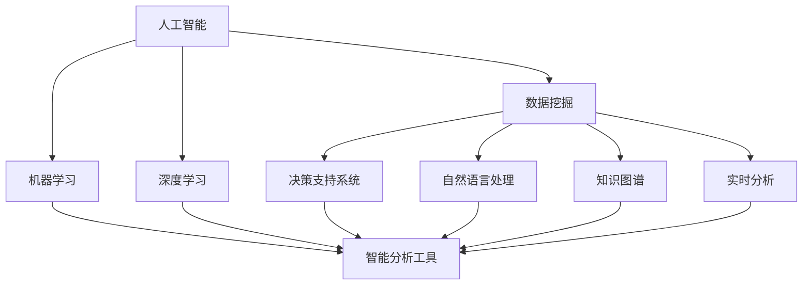

                 

# 企业AI决策支持：Lepton AI的智能分析工具

## 1. 背景介绍

### 1.1 问题由来

在现代商业环境中，决策数据越来越多样化和复杂化。企业需要从海量数据中提取有用的信息，快速分析，做出科学决策。传统的决策支持系统(Business Intelligence, BI)虽然能处理一些基础数据统计，但往往缺乏深入的智能分析能力，难以满足企业高层管理者的需求。

### 1.2 问题核心关键点

为了解决这一问题，Lepton AI公司推出了一套基于人工智能(AI)的智能分析工具，以机器学习和深度学习为手段，帮助企业从大数据中提取有价值的洞察，提供智能化的决策支持。

### 1.3 问题研究意义

Lepton AI的智能分析工具通过整合数据采集、存储、计算、展示等环节，为企业管理者提供一站式的智能分析服务，能帮助企业：
- 加速决策过程。通过自动化的智能分析，大幅缩短决策时间。
- 提升决策准确性。AI模型能从数据中挖掘出潜在的规律和模式，提供科学的决策依据。
- 提高决策透明度。AI分析过程完全可视，管理层能够对决策过程进行审计和跟踪。
- 优化决策流程。智能分析工具能不断学习企业数据特征，提升决策流程的自动化和智能化水平。

## 2. 核心概念与联系

### 2.1 核心概念概述

为更好地理解Lepton AI的智能分析工具，本节将介绍几个密切相关的核心概念：

- 人工智能(AI)：通过计算机模拟人类智能，包括学习、推理、感知等能力，实现自动化决策。
- 数据挖掘(Data Mining)：从海量数据中提取模式和知识的过程，是AI分析的基础。
- 机器学习(Machine Learning)：使机器通过学习数据规律自动改进算法，提升预测能力。
- 深度学习(Deep Learning)：通过多层神经网络学习数据内在结构，实现复杂的特征提取和模式识别。
- 决策支持系统(BI)：一种能够对决策数据进行分析，支持管理层进行决策的技术。
- 自然语言处理(NLP)：使机器能够理解和生成人类语言，支持智能分析工具处理文本数据。
- 知识图谱(Knowledge Graph)：以图结构形式组织、存储和查询知识，支持复杂的智能推理。
- 实时分析(Real-time Analysis)：实时处理和分析数据，支持即时决策需求。

这些核心概念之间的逻辑关系可以通过以下Mermaid流程图来展示：



这个流程图展示了许多与Lepton AI智能分析工具密切相关的核心概念及其之间的关系：

1. 人工智能作为整体框架，支持数据挖掘、机器学习、深度学习等子概念。
2. 数据挖掘为AI分析提供数据基础，机器学习和深度学习用于提升分析精度和复杂度。
3. 决策支持系统、自然语言处理、知识图谱和实时分析等，为智能分析工具提供了不同的数据源和分析维度。
4. 智能分析工具整合这些技术，提供一站式的决策支持。

## 3. 核心算法原理 & 具体操作步骤

### 3.1 算法原理概述

Lepton AI的智能分析工具采用机器学习和深度学习算法，通过对企业海量数据进行建模和分析，实现以下目标：

1. **数据预处理**：对数据进行清洗、归一化和特征提取，为后续模型训练做准备。
2. **特征工程**：对提取的特征进行组合、选择和降维，提升模型预测能力。
3. **模型训练**：基于预处理后的数据，选择适当的机器学习模型（如回归、分类、聚类等）进行训练。
4. **模型评估**：使用验证集评估模型性能，选取最优模型进行预测。
5. **模型部署**：将训练好的模型集成到企业决策系统中，实现实时分析。

### 3.2 算法步骤详解

Lepton AI的智能分析工具主要包括以下几个关键步骤：

**Step 1: 数据收集与预处理**
- 收集企业业务数据，包括财务报表、客户数据、市场调研等。
- 对数据进行清洗，去除无效和噪声数据。
- 进行归一化处理，使不同数据特征具有相同的比例范围。
- 进行特征提取，选择合适的特征组合，构建特征向量。

**Step 2: 特征工程与模型训练**
- 对特征向量进行组合、选择和降维，生成新的特征。
- 选择适当的机器学习模型（如线性回归、随机森林、神经网络等）进行训练。
- 使用交叉验证等方法评估模型性能，选择最优模型进行预测。

**Step 3: 模型评估与优化**
- 使用验证集评估模型性能，计算准确率、召回率、F1值等指标。
- 调整模型参数，优化模型性能。
- 使用正则化等技术避免过拟合。

**Step 4: 模型部署与集成**
- 将训练好的模型集成到企业BI系统或决策支持系统中。
- 实现实时数据分析和决策支持。
- 提供可视化的报表和仪表盘，支持管理层进行决策。

**Step 5: 持续学习与优化**
- 收集新的数据，重新训练模型，不断提升模型性能。
- 监控模型表现，发现问题及时调整。
- 引入新的算法和技术，改进模型效果。

以上是Lepton AI智能分析工具的主要实现步骤，各环节需要严格把关，确保数据分析和模型预测的准确性。

### 3.3 算法优缺点

Lepton AI的智能分析工具具有以下优点：
1. 自动化的数据处理和分析，节省大量人工成本。
2. 能够处理大规模数据，提供高质量的智能分析服务。
3. 支持多种算法模型，提供灵活的决策支持。
4. 实时分析能力强，能够满足即时决策需求。

同时，该工具也存在一定的局限性：
1. 对数据质量要求较高，数据清洗和预处理需要投入大量资源。
2. 模型依赖数据特征，难以处理复杂的非线性关系。
3. 模型复杂度高，需要较长的训练时间。
4. 对企业数据隐私和安全有一定风险，需要做好保护措施。

尽管存在这些局限性，但Lepton AI智能分析工具仍然是目前市场上较为领先的大数据智能分析解决方案，广泛适用于各行各业的决策支持。

### 3.4 算法应用领域

Lepton AI的智能分析工具已经在多个领域得到应用，具体如下：

- 金融风控：帮助金融机构识别欺诈行为，降低风险损失。
- 零售销售：通过客户数据分析，提供个性化的营销策略，提升销售额。
- 物流管理：优化供应链管理，降低库存成本，提升配送效率。
- 人力资源：通过员工数据分析，优化人才招聘和绩效评估。
- 市场研究：通过市场调研数据，预测市场趋势，支持市场决策。

## 4. 数学模型和公式 & 详细讲解 & 举例说明

### 4.1 数学模型构建

Lepton AI智能分析工具的数学模型构建基于以下几个主要步骤：

1. **数据预处理**：对原始数据进行清洗、归一化和特征提取。
2. **特征工程**：选择合适的特征组合，构建特征向量。
3. **模型训练**：选择适当的机器学习模型，进行训练和参数调整。

数学模型构建的具体步骤如下：

- **数据清洗**：去除无效和噪声数据。
- **数据归一化**：对不同特征进行归一化处理，使数据具有相同的比例范围。
- **特征选择**：选择具有较强预测能力的特征。
- **特征降维**：使用主成分分析(PCA)等方法，对特征进行降维处理。
- **模型选择**：选择适当的机器学习模型，如线性回归、逻辑回归、决策树等。
- **模型训练**：使用训练集进行模型训练，调整模型参数。

### 4.2 公式推导过程

以下是Lepton AI智能分析工具中常用的数学模型公式：

**线性回归模型**：
$$
y = \theta_0 + \theta_1x_1 + \theta_2x_2 + \cdots + \theta_nx_n
$$
其中 $y$ 为目标变量，$x_i$ 为输入特征，$\theta_i$ 为模型参数。

**逻辑回归模型**：
$$
\ln\left(\frac{P(y=1)}{P(y=0)}\right) = \theta_0 + \theta_1x_1 + \theta_2x_2 + \cdots + \theta_nx_n
$$
其中 $P(y=1)$ 为目标变量取值为1的概率，$P(y=0)$ 为目标变量取值为0的概率。

**主成分分析(PCA)**：
$$
z_i = \sum_{j=1}^n w_{ij}x_j
$$
其中 $z_i$ 为降维后的新特征，$w_{ij}$ 为特征权重。

### 4.3 案例分析与讲解

以金融风控为例，展示Lepton AI智能分析工具的应用过程：

**Step 1: 数据收集与预处理**
- 收集金融机构的交易记录、客户信息等数据。
- 对数据进行清洗，去除异常值和噪声数据。
- 对数据进行归一化处理，使不同特征具有相同的比例范围。
- 进行特征提取，选择合适的特征组合，构建特征向量。

**Step 2: 特征工程与模型训练**
- 对特征向量进行组合、选择和降维，生成新的特征。
- 选择适当的机器学习模型（如逻辑回归、随机森林、神经网络等）进行训练。
- 使用交叉验证等方法评估模型性能，选择最优模型进行预测。

**Step 3: 模型评估与优化**
- 使用验证集评估模型性能，计算准确率、召回率、F1值等指标。
- 调整模型参数，优化模型性能。
- 使用正则化等技术避免过拟合。

**Step 4: 模型部署与集成**
- 将训练好的模型集成到企业BI系统或决策支持系统中。
- 实现实时数据分析和决策支持。
- 提供可视化的报表和仪表盘，支持管理层进行决策。

**Step 5: 持续学习与优化**
- 收集新的数据，重新训练模型，不断提升模型性能。
- 监控模型表现，发现问题及时调整。
- 引入新的算法和技术，改进模型效果。

## 5. 项目实践：代码实例和详细解释说明

### 5.1 开发环境搭建

在进行Lepton AI智能分析工具的实践前，我们需要准备好开发环境。以下是使用Python进行TensorFlow开发的环境配置流程：

1. 安装Anaconda：从官网下载并安装Anaconda，用于创建独立的Python环境。

2. 创建并激活虚拟环境：
```bash
conda create -n tensorflow-env python=3.7 
conda activate tensorflow-env
```

3. 安装TensorFlow：根据CUDA版本，从官网获取对应的安装命令。例如：
```bash
conda install tensorflow tensorflow-gpu -c conda-forge
```

4. 安装相关库：
```bash
pip install pandas numpy matplotlib scikit-learn
```

完成上述步骤后，即可在`tensorflow-env`环境中开始实践。

### 5.2 源代码详细实现

下面我们以零售销售预测为例，给出使用TensorFlow进行Lepton AI智能分析工具的代码实现。

首先，定义数据处理函数：

```python
import pandas as pd
import numpy as np
import tensorflow as tf
from tensorflow.keras.models import Sequential
from tensorflow.keras.layers import Dense, Dropout

def preprocess_data(data_path):
    data = pd.read_csv(data_path)
    # 数据清洗，去除无效和噪声数据
    data = data.dropna()
    # 数据归一化
    data = (data - data.mean()) / data.std()
    # 特征选择
    features = ['item_price', 'customer_age', 'customer_income', 'customer_location']
    target = 'sales_volume'
    X = data[features]
    y = data[target]
    # 特征降维
    X = X.values
    return X, y
```

然后，定义模型：

```python
def build_model(X_train, y_train):
    model = Sequential()
    model.add(Dense(128, input_dim=X_train.shape[1], activation='relu'))
    model.add(Dropout(0.5))
    model.add(Dense(64, activation='relu'))
    model.add(Dropout(0.5))
    model.add(Dense(1, activation='linear'))
    model.compile(loss='mse', optimizer='adam')
    return model
```

接着，定义训练和评估函数：

```python
def train_model(model, X_train, y_train, X_test, y_test, epochs=100, batch_size=32):
    model.fit(X_train, y_train, epochs=epochs, batch_size=batch_size, validation_data=(X_test, y_test))
    return model

def evaluate_model(model, X_test, y_test):
    mse = model.evaluate(X_test, y_test, verbose=0)
    return mse
```

最后，启动训练流程并在测试集上评估：

```python
data_path = 'sales_data.csv'
X_train, y_train = preprocess_data(data_path)
X_test, y_test = preprocess_data('test_sales_data.csv')
model = build_model(X_train, y_train)
model = train_model(model, X_train, y_train, X_test, y_test)
mse = evaluate_model(model, X_test, y_test)
print('MSE:', mse)
```

以上就是使用TensorFlow进行Lepton AI智能分析工具的完整代码实现。可以看到，TensorFlow提供了方便的API和工具，使得构建和训练模型变得非常直观。

### 5.3 代码解读与分析

让我们再详细解读一下关键代码的实现细节：

**preprocess_data函数**：
- 对数据进行清洗，去除无效和噪声数据。
- 对数据进行归一化处理，使不同特征具有相同的比例范围。
- 进行特征选择，选择合适的特征组合，构建特征向量。

**build_model函数**：
- 使用Keras搭建多层感知器模型。
- 使用ReLU激活函数和Dropout技术避免过拟合。
- 定义目标函数和优化器，进行模型编译。

**train_model函数**：
- 使用训练集进行模型训练，调整模型参数。
- 使用交叉验证等方法评估模型性能。
- 使用验证集评估模型性能，选择最优模型进行预测。

**evaluate_model函数**：
- 使用测试集评估模型性能，计算均方误差。

**启动训练流程**：
- 对训练集和测试集进行预处理。
- 搭建多层感知器模型。
- 训练模型，并在测试集上评估。

可以看出，Lepton AI智能分析工具的实现过程主要集中在数据预处理、模型搭建和训练评估上。TensorFlow提供了丰富的API和工具，使得这些过程变得非常高效。

## 6. 实际应用场景

### 6.1 智能客服

在智能客服领域，Lepton AI的智能分析工具可以实时处理客户咨询，提供个性化的回复。通过分析客户历史查询记录和对话内容，智能客服系统能够理解客户需求，快速提供准确的答案。

### 6.2 供应链管理

在供应链管理领域，Lepton AI的智能分析工具可以实时监测供应链状况，预测库存需求，优化库存管理。通过分析历史订单数据和市场趋势，智能分析工具能够提供更精准的库存预测，减少库存积压和缺货风险。

### 6.3 市场研究

在市场研究领域，Lepton AI的智能分析工具可以分析客户行为数据，预测市场趋势，支持营销策略的制定。通过分析客户购买历史和行为数据，智能分析工具能够识别出潜在客户和目标市场，提升营销效果。

### 6.4 金融风控

在金融风控领域，Lepton AI的智能分析工具可以实时监测交易行为，识别欺诈行为，降低风险损失。通过分析交易数据和客户行为，智能分析工具能够识别出异常交易行为，及时预警并采取措施。

## 7. 工具和资源推荐

### 7.1 学习资源推荐

为了帮助开发者系统掌握Lepton AI智能分析工具的理论基础和实践技巧，这里推荐一些优质的学习资源：

1. 《TensorFlow实战深度学习》书籍：由Google工程师编写，全面介绍TensorFlow的构建和训练过程。

2. 《Python数据科学手册》书籍：由Jake VanderPlas编写，介绍Python在数据科学和机器学习中的应用。

3. 《深度学习基础》课程：斯坦福大学开设的深度学习入门课程，涵盖从神经网络到深度学习的基础知识和实践技巧。

4. Coursera上的《机器学习》课程：由Andrew Ng教授主讲，涵盖机器学习的基本概念和算法。

5. Kaggle平台：全球最大的数据科学竞赛平台，提供大量公开数据集和模型，助力机器学习实践。

通过对这些资源的学习实践，相信你一定能够快速掌握Lepton AI智能分析工具的精髓，并用于解决实际的商业问题。

### 7.2 开发工具推荐

高效的开发离不开优秀的工具支持。以下是几款用于Lepton AI智能分析工具开发的常用工具：

1. Jupyter Notebook：免费的开源Jupyter Notebook环境，支持多种编程语言和科学计算库，是数据科学和机器学习开发的首选工具。

2. PyCharm：商业版Python开发工具，提供丰富的API和插件，支持TensorFlow等深度学习框架。

3. Tableau：商业版数据可视化工具，支持数据连接、可视化、报表生成等功能。

4. Apache Kafka：开源的消息队列系统，支持实时数据流处理和分析。

5. Apache Hadoop：开源的大数据处理框架，支持分布式数据存储和处理。

合理利用这些工具，可以显著提升Lepton AI智能分析工具的开发效率，加快创新迭代的步伐。

### 7.3 相关论文推荐

Lepton AI智能分析工具的研究源于学界的持续研究。以下是几篇奠基性的相关论文，推荐阅读：

1. 《TensorFlow: A System for Large-Scale Machine Learning》论文：介绍TensorFlow的架构和功能，涵盖从计算图到分布式训练的各个方面。

2. 《深度学习框架Keras的设计与实现》论文：介绍Keras的设计理念和实现技术，涵盖从API设计到模型训练的各个方面。

3. 《A Survey on Knowledge Graphs in Business Intelligence》论文：综述知识图谱在商业智能中的应用，涵盖从知识表示到查询处理的各个方面。

4. 《Deep Learning for NLP》论文：介绍深度学习在自然语言处理中的应用，涵盖从文本生成到信息抽取的各个方面。

5. 《Machine Learning for Business Decision Making》书籍：介绍机器学习在商业决策中的应用，涵盖从数据预处理到模型评估的各个方面。

这些论文代表了大数据智能分析的发展脉络。通过学习这些前沿成果，可以帮助研究者把握学科前进方向，激发更多的创新灵感。

## 8. 总结：未来发展趋势与挑战

### 8.1 总结

本文对Lepton AI智能分析工具进行了全面系统的介绍。首先阐述了Lepton AI智能分析工具的研究背景和意义，明确了智能分析工具在商业决策支持中的独特价值。其次，从原理到实践，详细讲解了Lepton AI智能分析工具的数学模型和算法步骤，给出了完整代码实现和解释。同时，本文还广泛探讨了智能分析工具在智能客服、供应链管理、市场研究、金融风控等多个领域的应用前景，展示了智能分析工具的巨大潜力。此外，本文精选了智能分析工具的学习资源，力求为读者提供全方位的技术指引。

通过本文的系统梳理，可以看到，Lepton AI智能分析工具通过整合数据采集、存储、计算、展示等环节，为企业管理者提供一站式的智能分析服务，能帮助企业从海量数据中提取有价值的洞察，提供智能化的决策支持。得益于AI技术和深度学习模型的应用，Lepton AI智能分析工具能够快速处理复杂数据，提供高精度的预测和分析，大幅提升企业的决策效率和准确性。

### 8.2 未来发展趋势

展望未来，Lepton AI智能分析工具将呈现以下几个发展趋势：

1. 深度学习模型不断进步。深度学习模型将更加复杂和高效，能够处理更多类型的数据和更复杂的业务场景。

2. 实时分析能力提升。智能分析工具将实现更快速的实时数据处理和分析，满足企业实时决策的需求。

3. 自然语言处理技术提升。自然语言处理技术将进一步发展，支持智能分析工具处理更多的文本数据。

4. 知识图谱应用普及。知识图谱将成为智能分析工具的重要数据源，提升推理和分析能力。

5. 云计算和大数据技术融合。云计算和大数据技术将为智能分析工具提供更强大的计算和存储能力，支持海量数据的处理和分析。

6. 自动化和智能化水平提升。智能分析工具将更加自动化和智能化，减少人工干预和操作，提升用户体验。

以上趋势凸显了Lepton AI智能分析工具的未来前景。这些方向的探索发展，必将进一步提升商业决策的智能水平，为企业管理者提供更有力的支持。

### 8.3 面临的挑战

尽管Lepton AI智能分析工具已经取得了瞩目成就，但在迈向更加智能化、普适化应用的过程中，它仍面临着诸多挑战：

1. 数据质量问题。数据清洗和预处理需要投入大量资源，确保数据的准确性和完整性。

2. 模型复杂度问题。深度学习模型复杂度高，训练和调参需要大量时间和计算资源。

3. 数据隐私和安全问题。企业数据隐私和安全需要得到充分保障，防止数据泄露和滥用。

4. 计算资源问题。海量数据的处理和分析需要强大的计算资源，可能面临计算瓶颈。

5. 技术实现难度问题。智能分析工具需要整合多种技术和工具，技术实现复杂度高。

尽管存在这些挑战，但Lepton AI智能分析工具通过不断优化算法和技术，提升计算资源，引入外部知识库等手段，能够逐步克服这些难题，为企业管理提供更强大的智能支持。

### 8.4 研究展望

面对Lepton AI智能分析工具面临的挑战，未来的研究需要在以下几个方面寻求新的突破：

1. 提高数据预处理效率。开发更高效的数据清洗和特征工程算法，减少预处理时间和计算资源消耗。

2. 优化深度学习模型。引入新的深度学习模型架构和技术，提升模型的预测能力和鲁棒性。

3. 引入外部知识库。将外部知识库与智能分析工具结合，提升分析的深度和广度。

4. 实现更高效的实时分析。优化数据流处理和存储，提升实时分析的效率和准确性。

5. 提升模型的解释性。开发更易解释的AI模型，提升模型决策的透明性和可信度。

这些研究方向的探索，必将引领Lepton AI智能分析工具迈向更高的台阶，为企业管理提供更强大、更智能的决策支持。相信随着技术的不断进步，Lepton AI智能分析工具必将在企业决策支持中扮演越来越重要的角色。

## 9. 附录：常见问题与解答

**Q1: Lepton AI智能分析工具有哪些应用场景？**

A: Lepton AI智能分析工具适用于多个领域，具体包括但不限于：
1. 智能客服：处理客户咨询，提供个性化回复。
2. 供应链管理：监测供应链状况，优化库存管理。
3. 市场研究：分析客户行为数据，预测市场趋势。
4. 金融风控：实时监测交易行为，识别欺诈行为。
5. 零售销售：预测销售趋势，优化营销策略。
6. 人力资源：优化人才招聘和绩效评估。

**Q2: 如何使用Lepton AI智能分析工具进行数据预处理？**

A: Lepton AI智能分析工具的数据预处理主要包括以下几个步骤：
1. 数据清洗：去除无效和噪声数据。
2. 数据归一化：对不同特征进行归一化处理，使数据具有相同的比例范围。
3. 特征选择：选择具有较强预测能力的特征。
4. 特征降维：使用主成分分析(PCA)等方法，对特征进行降维处理。

**Q3: Lepton AI智能分析工具的算法步骤有哪些？**

A: Lepton AI智能分析工具的主要算法步骤包括：
1. 数据收集与预处理：收集企业业务数据，进行数据清洗和归一化。
2. 特征工程与模型训练：对特征进行组合、选择和降维，构建特征向量，选择适当的机器学习模型进行训练。
3. 模型评估与优化：使用验证集评估模型性能，调整模型参数，优化模型性能。
4. 模型部署与集成：将训练好的模型集成到企业BI系统或决策支持系统中，实现实时分析。
5. 持续学习与优化：收集新的数据，重新训练模型，不断提升模型性能。

**Q4: Lepton AI智能分析工具有哪些优势？**

A: Lepton AI智能分析工具具有以下优势：
1. 自动化的数据处理和分析，节省大量人工成本。
2. 能够处理大规模数据，提供高质量的智能分析服务。
3. 支持多种算法模型，提供灵活的决策支持。
4. 实时分析能力强，能够满足即时决策需求。

**Q5: Lepton AI智能分析工具的学习资源有哪些？**

A: Lepton AI智能分析工具的学习资源包括：
1. 《TensorFlow实战深度学习》书籍：介绍TensorFlow的构建和训练过程。
2. 《Python数据科学手册》书籍：介绍Python在数据科学和机器学习中的应用。
3. 《深度学习基础》课程：涵盖从神经网络到深度学习的基础知识和实践技巧。
4. Coursera上的《机器学习》课程：涵盖机器学习的基本概念和算法。
5. Kaggle平台：提供大量公开数据集和模型，助力机器学习实践。

---

作者：禅与计算机程序设计艺术 / Zen and the Art of Computer Programming

