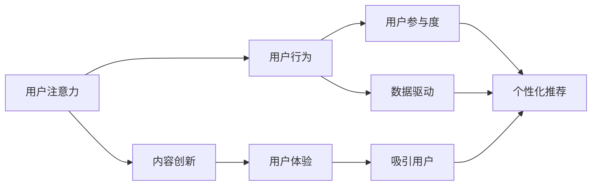

                 

## 1. 背景介绍

### 1.1 问题由来
随着互联网的发展和信息技术的进步，我们已进入一个注意力经济的时代。无论是消费产品、金融投资，还是内容制作、广告营销，“注意力” 成为稀缺的资源。谁能吸引用户的注意力，谁就能在竞争中脱颖而出，占据市场的主导地位。

在互联网商业化的早期，流量是王。各家企业纷纷通过烧钱的方式争夺用户，最终市场被少数巨头垄断。但随着流量红利的消失，用户注意力的争夺变得更加关键。企业需要深入理解注意力经济，掌握如何吸引、保持和利用用户注意力的策略，才能在激烈的市场竞争中脱颖而出。

### 1.2 问题核心关键点
企业如何吸引用户注意力的核心关键点包括：
- 用户需求：真正了解用户需求，提供精准、高效、个性化的内容和服务。
- 内容创新：通过创新内容形式和传播方式，吸引用户的目光。
- 数据驱动：利用数据分析技术，了解用户行为和偏好，精准推送。
- 用户体验：提供卓越的用户体验，增强用户粘性。
- 互动与参与：通过互动和参与机制，提升用户参与度和忠诚度。

通过精准了解和把握用户注意力，企业可以更好地进行产品和服务的设计与推广，进而赢得市场竞争。

## 2. 核心概念与联系

### 2.1 核心概念概述

为更好地理解注意力经济，本节将介绍几个密切相关的核心概念：

- 注意力经济（Attention Economy）：指的是在信息过载的互联网时代，注意力成为稀缺资源，掌握注意力的企业可以从中获得巨大的商业价值。
- 用户注意力（User Attention）：指用户在接触信息时所投入的关注程度，是用户行为的基础。
- 用户行为（User Behavior）：指用户与产品或服务互动的过程和结果，包括点击、停留时间、转化率等。
- 用户参与度（User Engagement）：指用户与产品或服务的互动程度，包括留言、分享、评论等行为。
- 数据驱动（Data-Driven）：利用数据技术，分析用户行为和偏好，指导产品和服务设计。
- 个性化推荐（Personalized Recommendation）：根据用户历史行为和偏好，推荐个性化的产品和服务。

这些核心概念之间紧密关联，共同构成了一个完整的信息价值链。企业需通过理解这些概念，构建全面的注意力经济模型，以便更好地吸引和利用用户注意力。

### 2.2 核心概念原理和架构的 Mermaid 流程图(Mermaid 流程节点中不要有括号、逗号等特殊字符)



这个流程图展示了用户注意力的整个价值链：首先通过内容创新和用户体验吸引用户注意力，然后利用数据驱动和个性化推荐保持和提升用户参与度。通过不断的循环迭代，企业可以持续吸引和留住用户，实现商业价值的最大化。

## 3. 核心算法原理 & 具体操作步骤
### 3.1 算法原理概述

企业吸引和利用用户注意力的核心算法原理包括：

- **内容推荐算法**：通过分析用户的历史行为和偏好，推荐个性化的内容，从而吸引用户注意力。
- **数据挖掘算法**：通过挖掘用户行为数据，了解用户兴趣和需求，优化内容和策略。
- **用户体验优化算法**：通过分析用户的使用数据，改进产品和服务设计，提升用户满意度。
- **互动与参与算法**：通过设计互动机制，增加用户参与度和忠诚度，建立稳定的用户关系。

这些算法通过算法原理指导，结合具体业务场景，构建出一套完整的吸引和利用用户注意力的体系。

### 3.2 算法步骤详解

以下是企业吸引和利用用户注意力的具体步骤：

**Step 1: 数据收集与分析**

1. 收集用户行为数据：包括用户在网站、应用上的点击、浏览、停留时间等行为数据。
2. 分析用户兴趣：利用数据分析技术，如K-means聚类、协同过滤、关联规则等算法，分析用户行为模式和兴趣点。
3. 识别用户需求：通过用户评论、反馈等文本数据，分析用户需求和期望。

**Step 2: 个性化推荐**

1. 设计推荐模型：根据用户行为数据，设计个性化推荐算法，如协同过滤、基于内容的推荐、深度学习等模型。
2. 训练推荐模型：在用户行为数据上训练推荐模型，优化推荐效果。
3. 实时推荐：根据用户实时行为，动态更新推荐结果，提升用户满意度。

**Step 3: 用户体验优化**

1. 监测用户体验：通过用户反馈、行为数据等，监测用户体验情况。
2. 优化产品设计：根据用户反馈和体验数据，改进产品功能和界面设计。
3. 提升用户粘性：通过个性化内容和互动机制，提升用户使用频率和忠诚度。

**Step 4: 互动与参与**

1. 设计互动机制：通过游戏、挑战、抽奖等方式，设计吸引用户参与的机制。
2. 增加用户参与度：通过互动机制，提升用户参与度，增强用户粘性。
3. 建立用户关系：通过社区、论坛等平台，建立用户关系，形成用户群体。

### 3.3 算法优缺点

企业吸引和利用用户注意力的算法具有以下优点：

- **个性化精准**：通过个性化推荐算法，能够精准匹配用户需求，提升用户满意度。
- **数据驱动优化**：利用数据挖掘算法，不断优化内容和策略，提升用户粘性。
- **互动增强**：通过互动与参与算法，增加用户参与度和忠诚度，建立稳定的用户关系。

同时，这些算法也存在一定的局限性：

- **数据隐私**：数据分析和个性化推荐需要大量的用户数据，如何保护用户隐私是个挑战。
- **算法复杂**：复杂的算法模型计算开销大，需要高性能计算资源。
- **用户适应**：部分用户可能对个性化推荐和互动机制不太适应，需要不断优化策略。

尽管存在这些局限性，但总体来说，这些算法是实现注意力经济目标的有效手段。企业需根据自身业务特点，合理选择和使用这些算法。

### 3.4 算法应用领域

基于注意力经济的算法已经在电商、社交、视频等多个领域得到了广泛应用，具体包括：

- **电商推荐**：通过分析用户购买历史和浏览行为，推荐个性化商品，提高转化率。
- **社交互动**：通过设计互动机制，增加用户参与度和忠诚度，增强用户粘性。
- **视频内容**：通过个性化推荐和内容创作，提升用户观看频率和满意度。
- **广告投放**：通过分析用户行为和兴趣，精准投放广告，提高广告效果和转化率。
- **在线教育**：通过个性化推荐和互动机制，提升学习效果和用户满意度。

除了这些传统应用场景外，注意力经济的思想和方法也正在被引入到更多新兴领域，如健康、旅游、游戏等，为这些领域带来全新的商业价值。

## 4. 数学模型和公式 & 详细讲解 & 举例说明

### 4.1 数学模型构建

基于注意力经济的算法通常涉及以下数学模型：

- 用户行为模型：$P(Y|X)$，表示用户在不同行为数据$X$下，产生某一行为$Y$的概率。
- 推荐模型：$P(Y|X,\theta)$，表示在用户行为数据$X$和模型参数$\theta$下，推荐某一产品$Y$的概率。
- 用户满意度模型：$S(X,Y)$，表示用户对某一产品$Y$在行为数据$X$下的满意度。

这些模型可以通过以下公式进行数学描述：

1. **用户行为模型**：
   $$
   P(Y|X) = \frac{e^{f(Y,X)}}{\sum_{Y'} e^{f(Y',X)}}
   $$
   其中$f(Y,X)$为特征函数，表示用户行为$Y$在行为数据$X$下的评分。

2. **推荐模型**：
   $$
   P(Y|X,\theta) = \frac{e^{f(Y,X;\theta)}}{\sum_{Y'} e^{f(Y',X;\theta)}}
   $$
   其中$\theta$为模型参数，$f(Y,X;\theta)$为推荐函数。

3. **用户满意度模型**：
   $$
   S(X,Y) = \sum_{i=1}^n a_i f_i(X,Y)
   $$
   其中$n$为用户满意度的维度，$f_i(X,Y)$为满意度维度$i$的评分函数。

### 4.2 公式推导过程

通过上述公式，可以对用户行为和推荐过程进行详细描述和推导。

1. **用户行为模型推导**：
   通过最大似然估计法，计算用户行为$Y$在行为数据$X$下的概率分布。

2. **推荐模型推导**：
   利用协同过滤、基于内容的推荐、深度学习等算法，将用户行为数据和模型参数结合，预测推荐结果的概率分布。

3. **用户满意度模型推导**：
   将用户满意度分解为多个维度，通过评分函数计算各维度的评分，并加权求和得到总体满意度。

### 4.3 案例分析与讲解

以电商平台个性化推荐为例，进行详细分析：

**案例背景**：某电商平台通过用户行为数据（如浏览记录、购买历史、点击率等），对用户进行个性化推荐。

**数据分析**：利用协同过滤算法，分析用户之间的行为相似度，找出与目标用户行为相似的其他用户。同时，利用内容关联算法，分析商品之间的关联关系，找出与目标用户购买记录相似的其他商品。

**推荐策略**：结合协同过滤和内容关联的结果，构建用户-商品推荐矩阵，利用深度学习模型（如DNN、RNN等）对推荐矩阵进行训练和预测，生成个性化推荐结果。

**结果验证**：在实时用户数据上验证推荐模型，通过A/B测试等方式，评估推荐效果，不断优化模型参数。

通过这一过程，电商平台能够根据用户行为和历史数据，精准推荐个性化的商品，提高用户满意度和转化率。

## 5. 项目实践：代码实例和详细解释说明

### 5.1 开发环境搭建

进行个性化推荐系统开发的第一步是搭建开发环境。以下是Python环境下，进行深度学习推荐系统开发的流程：

1. 安装Anaconda：从官网下载并安装Anaconda，用于创建独立的Python环境。

2. 创建并激活虚拟环境：
```bash
conda create -n recommendation-env python=3.8 
conda activate recommendation-env
```

3. 安装推荐系统常用库：
```bash
conda install numpy pandas scikit-learn torch torchvision torchaudio
```

4. 安装深度学习框架：
```bash
pip install tensorflow
```

5. 安装推荐算法库：
```bash
pip install lightfm
```

完成上述步骤后，即可在`recommendation-env`环境中开始开发推荐系统。

### 5.2 源代码详细实现

下面我们以协同过滤算法为例，给出使用TensorFlow构建个性化推荐系统的代码实现。

首先，定义协同过滤模型：

```python
import tensorflow as tf

# 定义协同过滤模型
class CollaborativeFiltering(tf.keras.Model):
    def __init__(self, num_users, num_items, latent_factors=10):
        super(CollaborativeFiltering, self).__init__()
        self.num_users = num_users
        self.num_items = num_items
        self.latent_factors = latent_factors
        self.user_factors = tf.Variable(tf.random.normal([num_users, latent_factors]))
        self.item_factors = tf.Variable(tf.random.normal([num_items, latent_factors]))
        self.user_bias = tf.Variable(tf.zeros([num_users]))
        self.item_bias = tf.Variable(tf.zeros([num_items]))
        
    def call(self, user_indices, item_indices):
        user_factors = tf.gather(self.user_factors, user_indices)
        item_factors = tf.gather(self.item_factors, item_indices)
        user_bias = tf.gather(self.user_bias, user_indices)
        item_bias = tf.gather(self.item_bias, item_indices)
        user_pred = tf.reduce_sum(tf.multiply(user_factors, item_factors), axis=1) + user_bias + item_bias
        return user_pred
```

接着，定义训练函数：

```python
# 定义训练函数
def train_model(model, train_data, batch_size, epochs):
    model.compile(optimizer=tf.keras.optimizers.Adam(learning_rate=0.001),
                  loss=tf.keras.losses.MeanSquaredError(),
                  metrics=[tf.keras.metrics.MeanSquaredError()])
    model.fit(train_data['user_indices'], train_data['item_indices'], epochs=epochs, batch_size=batch_size)
    return model
```

最后，启动训练流程：

```python
# 准备数据
train_data = load_train_data()

# 构建模型
model = CollaborativeFiltering(num_users, num_items)

# 训练模型
model = train_model(model, train_data, batch_size, epochs)

# 测试模型
test_data = load_test_data()
test_pred = model.predict(test_data['user_indices'], test_data['item_indices'])
```

以上就是使用TensorFlow实现协同过滤算法的完整代码实现。可以看到，借助TensorFlow，模型的构建、训练和测试变得相对简单高效。

### 5.3 代码解读与分析

让我们再详细解读一下关键代码的实现细节：

**CollaborativeFiltering类**：
- 继承自tf.keras.Model，定义了协同过滤模型的基本结构。
- `__init__`方法：初始化模型参数，包括用户向量、物品向量、用户偏差和物品偏差。
- `call`方法：根据输入的用户和物品索引，计算预测评分。

**train_model函数**：
- 使用Adam优化器，设定损失函数为均方误差，评估指标为均方误差。
- 在训练集上调用`fit`方法，不断更新模型参数。

**训练流程**：
- 加载训练数据。
- 构建协同过滤模型。
- 在训练集上训练模型。
- 在测试集上验证模型性能。

可以看出，TensorFlow使得构建和训练协同过滤模型变得非常简单。通过合理设计模型和损失函数，可以轻松实现个性化推荐。

## 6. 实际应用场景

### 6.1 电商推荐

电商推荐系统是注意力经济应用的一个典型案例。电商平台通过分析用户行为数据，构建推荐模型，实现个性化推荐，提升用户购买意愿和转化率。

**实际应用**：某电商平台利用协同过滤和深度学习算法，构建个性化推荐系统。系统通过分析用户历史行为，为用户推荐个性化商品，并根据实时数据动态更新推荐结果。结果显示，推荐系统的用户满意度和转化率均显著提升。

**优势**：电商推荐系统通过个性化推荐，提高了用户满意度，降低了用户的购物决策成本，提升了电商平台的转化率和营收。

### 6.2 在线视频推荐

在线视频平台通过个性化推荐，提升用户观看体验和留存率。视频推荐系统通常结合用户历史观看数据和视频内容特征，为用户推荐个性化的视频内容。

**实际应用**：某在线视频平台利用协同过滤和基于内容的推荐算法，构建个性化推荐系统。系统通过分析用户历史观看记录和视频内容标签，为用户推荐个性化的视频内容，并根据实时数据动态更新推荐结果。结果显示，推荐系统的用户观看时间和留存率均显著提升。

**优势**：视频推荐系统通过个性化推荐，提高了用户观看体验和留存率，增加了平台的用户粘性，提升了广告投放效果。

### 6.3 社交媒体互动

社交媒体平台通过互动和参与机制，增加用户参与度和粘性。社交推荐系统通常结合用户互动数据和社交网络结构，为用户推荐个性化的内容。

**实际应用**：某社交媒体平台利用基于图的协同过滤算法，构建个性化推荐系统。系统通过分析用户互动数据和社交网络结构，为用户推荐个性化的内容，并根据实时数据动态更新推荐结果。结果显示，推荐系统的用户互动率和粘性均显著提升。

**优势**：社交推荐系统通过个性化推荐和互动机制，提高了用户参与度和粘性，增加了平台的活跃度和用户留存率。

## 7. 工具和资源推荐

### 7.1 学习资源推荐

为了帮助开发者系统掌握注意力经济的理论和实践，这里推荐一些优质的学习资源：

1. 《推荐系统实践》书籍：详细介绍了推荐系统的基本原理和算法实现，适合初学者入门。
2. 《深度学习推荐系统：理论与算法》课程：由斯坦福大学教授讲授，深入浅出地介绍了深度学习在推荐系统中的应用。
3. 《推荐系统基础》论文：介绍了推荐系统的基本原理和算法，适合学术研究人员学习。
4. Kaggle推荐系统竞赛：通过实际比赛项目，练习推荐系统算法，积累经验。
5. 《推荐系统》在线课程：系统介绍推荐系统的理论和实践，适合进一步深入学习。

通过这些资源的学习实践，相信你一定能够快速掌握注意力经济的应用方法和技术实现。

### 7.2 开发工具推荐

高效的开发离不开优秀的工具支持。以下是几款用于注意力经济系统开发的常用工具：

1. Python：简单易学、开源的编程语言，广泛用于深度学习和数据分析。
2. TensorFlow：由Google开发的深度学习框架，支持分布式计算和GPU加速。
3. Scikit-Learn：Python上的机器学习库，提供各种经典的机器学习算法和工具。
4. Pandas：Python上的数据分析库，支持大规模数据处理和分析。
5. Apache Spark：支持分布式计算的大数据处理框架，适合大规模数据集的处理。
6. Hadoop：开源的大数据处理平台，适合大规模数据集的处理和分析。

合理利用这些工具，可以显著提升注意力经济系统的开发效率，加快创新迭代的步伐。

### 7.3 相关论文推荐

注意力经济的研究源于学界的持续研究。以下是几篇奠基性的相关论文，推荐阅读：

1. 《Trustworthy Personalized Recommendation: An Integrative Approach to Data, Models and Users》：介绍了如何构建可信的推荐系统，平衡数据隐私和用户信任。
2. 《The Attention is All you Need》：提出了Transformer结构，开启了NLP领域的预训练大模型时代，注意力机制是其核心。
3. 《Adaptive Collaborative Filtering》：提出了自适应协同过滤算法，利用用户反馈动态调整推荐策略。
4. 《Collaborative Filtering with Deep Neural Networks》：利用深度神经网络构建协同过滤模型，提升了推荐精度和泛化能力。
5. 《Neural Collaborative Filtering》：利用深度神经网络构建协同过滤模型，提升了推荐精度和泛化能力。

这些论文代表了大注意力经济的发展脉络。通过学习这些前沿成果，可以帮助研究者把握学科前进方向，激发更多的创新灵感。

## 8. 总结：未来发展趋势与挑战

### 8.1 总结

本文对基于注意力经济的推荐算法进行了全面系统的介绍。首先阐述了注意力经济的背景和意义，明确了推荐算法在吸引和利用用户注意力中的核心价值。其次，从原理到实践，详细讲解了推荐算法的数学模型和操作步骤，给出了推荐任务开发的完整代码实例。同时，本文还广泛探讨了推荐算法在电商、视频、社交等多个行业领域的应用前景，展示了推荐范式的巨大潜力。此外，本文精选了推荐算法的各类学习资源，力求为读者提供全方位的技术指引。

通过本文的系统梳理，可以看到，基于推荐算法的注意力经济模型正在成为互联网应用的重要范式，极大地拓展了企业吸引和利用用户注意力的边界，催生了更多的落地场景。得益于深度学习技术的进步，推荐系统能够在处理大规模数据、个性化推荐和实时更新等方面取得优异效果，为NLP技术在各领域的广泛应用提供了坚实的基础。未来，伴随推荐算法的持续演进，NLP技术必将在更广阔的应用领域大放异彩。

### 8.2 未来发展趋势

展望未来，基于推荐算法的注意力经济将呈现以下几个发展趋势：

1. **深度学习融合**：结合深度学习和协同过滤算法，构建更加精准的推荐系统。利用深度神经网络对用户行为进行建模，提升推荐效果。
2. **实时推荐系统**：通过流式计算和实时数据处理技术，构建实时推荐系统，实现即时响应。
3. **多模态推荐**：结合视觉、语音、文本等多种模态数据，构建多模态推荐系统，提升推荐精度和多样性。
4. **个性化推荐**：利用用户画像、行为数据等，构建个性化推荐系统，提升用户满意度。
5. **冷启动推荐**：通过利用用户历史行为、社交网络等，解决新用户推荐问题，提升推荐效果。

这些趋势凸显了推荐算法的广阔前景。这些方向的探索发展，必将进一步提升推荐系统的效果和应用范围，为互联网商业带来更多的商业价值。

### 8.3 面临的挑战

尽管推荐算法已经取得了瞩目成就，但在迈向更加智能化、普适化应用的过程中，它仍面临着诸多挑战：

1. **数据隐私**：推荐系统需要大量的用户数据，如何保护用户隐私是个重要挑战。数据泄露和滥用可能导致用户信任下降。
2. **算法复杂性**：推荐算法模型复杂，计算开销大，需要高性能计算资源。如何在保证算法效果的同时，提高计算效率，是亟待解决的问题。
3. **用户适应性**：部分用户可能对推荐算法不太适应，需要不断优化算法策略，以提高用户满意度。
4. **推荐效果波动**：推荐系统在面对新数据时，容易产生波动，如何提高模型的鲁棒性和泛化能力，是未来的重要研究方向。
5. **推荐内容多样性**：部分推荐系统容易出现内容同质化问题，如何提高推荐内容的丰富性和多样性，是未来的重要研究方向。

尽管存在这些挑战，但总体来说，推荐算法是实现注意力经济目标的有效手段。企业需根据自身业务特点，合理选择和使用这些算法。

### 8.4 研究展望

面对推荐算法面临的挑战，未来的研究需要在以下几个方面寻求新的突破：

1. **深度学习融合**：结合深度学习和协同过滤算法，构建更加精准的推荐系统。利用深度神经网络对用户行为进行建模，提升推荐效果。
2. **实时推荐系统**：通过流式计算和实时数据处理技术，构建实时推荐系统，实现即时响应。
3. **多模态推荐**：结合视觉、语音、文本等多种模态数据，构建多模态推荐系统，提升推荐精度和多样性。
4. **个性化推荐**：利用用户画像、行为数据等，构建个性化推荐系统，提升用户满意度。
5. **冷启动推荐**：通过利用用户历史行为、社交网络等，解决新用户推荐问题，提升推荐效果。

这些研究方向的探索，必将引领推荐算法迈向更高的台阶，为互联网商业带来更多的商业价值。未来，伴随推荐算法的持续演进，推荐系统必将在更广泛的领域得到应用，进一步提升用户的满意度和平台的用户粘性。

## 9. 附录：常见问题与解答

**Q1：推荐系统如何实现个性化推荐？**

A: 推荐系统通过分析用户历史行为和兴趣，利用协同过滤、基于内容的推荐、深度学习等算法，构建个性化推荐模型。在用户实时行为数据上，利用推荐模型进行预测，生成个性化推荐结果。

**Q2：推荐系统如何提升用户满意度？**

A: 推荐系统通过分析用户历史行为和兴趣，利用协同过滤、基于内容的推荐、深度学习等算法，构建个性化推荐模型。在用户实时行为数据上，利用推荐模型进行预测，生成个性化推荐结果。个性化推荐能够提高用户满意度和留存率，提升用户参与度和忠诚度。

**Q3：推荐系统如何应对新用户？**

A: 推荐系统可以通过利用用户历史行为、社交网络等，解决新用户推荐问题。利用协同过滤、基于内容的推荐、深度学习等算法，构建个性化推荐模型，提升新用户推荐效果。

**Q4：推荐系统如何提升推荐精度？**

A: 推荐系统可以通过深度学习融合、实时推荐系统、多模态推荐、个性化推荐等方法，提升推荐精度和泛化能力。利用深度神经网络对用户行为进行建模，结合实时数据处理技术，提升推荐精度和多样性。

**Q5：推荐系统如何应对推荐内容同质化问题？**

A: 推荐系统可以通过多模态推荐、个性化推荐等方法，提高推荐内容的丰富性和多样性。结合视觉、语音、文本等多种模态数据，构建多模态推荐系统，提升推荐效果。

综上所述，基于推荐算法的注意力经济技术正在引领互联网商业的发展。通过个性化推荐、深度学习融合、实时推荐系统等方法，推荐系统能够高效吸引和利用用户注意力，提升用户满意度和留存率，实现商业价值的最大化。企业在开发推荐系统时，需根据自身业务特点，合理选择和使用这些技术，不断优化推荐策略，才能在激烈的市场竞争中脱颖而出。未来，伴随推荐算法的持续演进，NLP技术必将在更广泛的领域得到应用，为互联网商业带来更多的商业价值。

