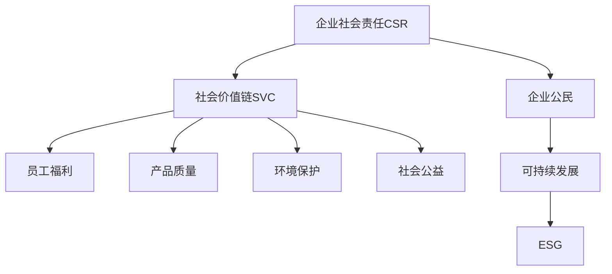

                 

# 企业社会责任管理：平衡利润和社会影响

## 1. 背景介绍

### 1.1 问题由来
随着全球化的发展，企业的社会责任（CSR）问题日益受到关注。企业不仅需要追求经济效益，还必须承担起对员工、客户、环境和社会的多重责任。如何有效平衡利润和社会影响，成为现代企业面临的重要挑战。本文旨在从技术和管理两个角度，探讨企业如何通过社会责任管理，在追求经济效益的同时，实现对社会和环境的积极影响。

### 1.2 问题核心关键点
企业社会责任管理的关键在于通过合理的技术手段和组织架构，确保企业在追求利润的同时，实现对员工、客户、环境和社会的积极影响。具体来说，需要关注以下几个方面：
- **员工福利**：关注员工的工作环境、健康、职业发展等，提升员工满意度和忠诚度。
- **产品质量**：确保产品质量安全可靠，减少对消费者造成的健康或安全风险。
- **环境保护**：采取节能减排、循环利用等措施，减少企业对环境的影响。
- **社会公益**：积极参与公益活动，回馈社区和公众。

## 2. 核心概念与联系

### 2.1 核心概念概述

为更好地理解企业社会责任管理，本节将介绍几个密切相关的核心概念：

- **企业社会责任（CSR）**：指企业在追求经济效益的同时，承担对员工、客户、环境和社会的多重责任。CSR强调企业不仅要追求经济利益，还必须关注其行为对社会和环境的影响。

- **社会价值链（SVC）**：描述企业在社会价值创造过程中各个环节的角色和责任。SVC强调企业应在其价值链中各个环节承担起相应的社会责任。

- **企业公民（Corporate Citizenship）**：指企业作为社会公民，应承担相应的社会责任，包括环境保护、公益慈善、员工福利等。

- **可持续发展（Sustainable Development）**：强调在满足当前需求的同时，不损害后代满足需求的能力。CSR和可持续发展紧密相关，强调企业应采取措施，实现长期的经济、社会和环境平衡。

- **ESG（环境、社会和公司治理）**：指评估企业环境、社会和公司治理的绩效。ESG是衡量企业社会责任的重要指标，通过ESG评价，可以更全面地了解企业对社会和环境的影响。

这些核心概念之间的逻辑关系可以通过以下Mermaid流程图来展示：



这个流程图展示了几大核心概念之间的联系：

1. 企业社会责任CSR通过社会价值链SVC，对员工福利、产品质量、环境保护和社会公益产生影响。
2. 企业公民强调企业作为社会公民的角色，是CSR的重要组成部分。
3. 可持续发展通过ESG评价，评估企业在经济、社会和环境方面的表现。

这些概念共同构成了企业社会责任管理的基本框架，有助于企业更好地平衡利润和社会影响。

## 3. 核心算法原理 & 具体操作步骤
### 3.1 算法原理概述

企业社会责任管理通过一系列技术手段和管理措施，确保企业在追求利润的同时，实现对员工、客户、环境和社会的积极影响。其主要算法原理包括：

- **数据采集与分析**：通过数据采集和分析，了解企业在社会价值链中各环节的表现。数据来源包括内部绩效评估、外部评级、第三方调查等。
- **建模与预测**：利用统计学和机器学习模型，对企业行为进行建模和预测。例如，通过预测模型，评估企业的社会责任风险。
- **优化与改进**：根据分析结果和预测模型，对企业的社会责任管理策略进行优化和改进。

### 3.2 算法步骤详解

企业社会责任管理的核心步骤如下：

**Step 1: 数据采集与预处理**
- 收集企业内部和外部的相关数据，如员工满意度调查、产品质量检测报告、环境排放数据等。
- 对数据进行清洗和预处理，确保数据的质量和一致性。

**Step 2: 建模与预测**
- 选择合适的统计学和机器学习模型，如回归模型、分类模型、聚类模型等。
- 使用历史数据对模型进行训练，评估模型的预测能力。
- 对模型的输出进行解释，理解模型的预测结果。

**Step 3: 优化与改进**
- 根据模型的预测结果，识别企业在社会责任管理中存在的问题和改进空间。
- 制定具体的优化方案，如改进员工福利、提高产品质量、减少环境排放等。
- 跟踪和评估优化效果，确保改进措施的有效性。

### 3.3 算法优缺点

企业社会责任管理的算法具有以下优点：
1. 系统化：通过数据采集、建模和预测，系统地评估企业社会责任表现。
2. 可量化：通过数据和模型，将企业的社会责任管理量化，便于比较和优化。
3. 前瞻性：通过预测模型，可以提前识别企业可能面临的社会责任风险，及时采取措施。

同时，该方法也存在一定的局限性：
1. 数据获取难度大：高质量的数据采集和处理需要大量人力和资源。
2. 模型复杂度高：复杂的统计和机器学习模型可能需要较多的计算资源。
3. 解释性不足：预测模型的输出结果可能难以解释，导致难以理解模型的决策逻辑。
4. 依赖历史数据：模型效果依赖于历史数据的准确性和完整性，难以适应变化多端的社会环境。

尽管存在这些局限性，但就目前而言，基于数据驱动的企业社会责任管理方法仍是大企业社会责任管理的有效手段。未来相关研究的重点在于如何进一步提高数据获取和处理效率，降低模型复杂度，增强模型的解释性，以及提高模型对未来社会环境变化的适应能力。

### 3.4 算法应用领域

企业社会责任管理算法在多个领域得到了广泛应用，例如：

- **人力资源管理**：通过员工满意度调查和预测模型，优化员工福利和工作环境。
- **产品质量控制**：利用产品质量检测数据和预测模型，提高产品质量和安全性。
- **环境管理**：通过环境排放数据和预测模型，减少企业对环境的影响。
- **社会责任报告**：基于企业社会责任数据的分析，撰写符合ESG标准的社会责任报告。
- **公益活动策划**：通过公益效果评估模型，优化公益活动的策划和执行。

这些应用领域展示了企业社会责任管理算法的广泛适用性，为企业在多方面提升社会责任管理水平提供了技术支持。

## 4. 数学模型和公式 & 详细讲解 & 举例说明
### 4.1 数学模型构建

企业社会责任管理的主要数学模型包括：

- **员工满意度模型**：通过问卷调查数据，建立员工满意度评分模型。
- **产品质量检测模型**：利用产品质量检测数据，建立产品质量评分模型。
- **环境影响评估模型**：根据企业环境排放数据，评估其对环境的影响。

这些模型的构建涉及统计学和机器学习的多种方法。

### 4.2 公式推导过程

以员工满意度模型为例，假设员工满意度数据为 $X=\{(x_1, y_1), (x_2, y_2), \ldots, (x_n, y_n)\}$，其中 $x_i$ 为员工反馈的评分，$y_i$ 为员工满意度。可以使用线性回归模型进行建模：

$$
y_i = \beta_0 + \beta_1 x_i + \epsilon_i
$$

其中 $\beta_0$ 和 $\beta_1$ 为模型参数，$\epsilon_i$ 为误差项。通过最小二乘法求解模型参数：

$$
\hat{\beta}_0 = \frac{\sum_{i=1}^n (x_i \bar{y} - \bar{x} \bar{y})}{\sum_{i=1}^n x_i^2 - n \bar{x}^2}
$$

$$
\hat{\beta}_1 = \frac{\sum_{i=1}^n (y_i - \bar{y})}{\sum_{i=1}^n x_i^2 - n \bar{x}^2}
$$

将求得的参数代入模型，即可进行员工满意度的预测。

### 4.3 案例分析与讲解

假设某公司希望通过员工满意度模型，优化员工福利和工作环境。公司收集了过去一年中员工对公司福利、工作环境等方面的满意度评分数据，并通过线性回归模型进行建模。模型预测结果显示，员工满意度评分与福利水平和工作环境密切相关，通过调整福利预算和改善工作条件，可以显著提高员工满意度。公司据此制定了新的福利政策，并通过跟踪调查发现，员工满意度和留存率显著提升。

## 5. 项目实践：代码实例和详细解释说明
### 5.1 开发环境搭建

在进行社会责任管理项目开发前，我们需要准备好开发环境。以下是使用Python进行PyTorch开发的环境配置流程：

1. 安装Anaconda：从官网下载并安装Anaconda，用于创建独立的Python环境。

2. 创建并激活虚拟环境：
```bash
conda create -n pytorch-env python=3.8 
conda activate pytorch-env
```

3. 安装PyTorch：根据CUDA版本，从官网获取对应的安装命令。例如：
```bash
conda install pytorch torchvision torchaudio cudatoolkit=11.1 -c pytorch -c conda-forge
```

4. 安装相关库：
```bash
pip install pandas numpy sklearn matplotlib scikit-learn
```

完成上述步骤后，即可在`pytorch-env`环境中开始项目开发。

### 5.2 源代码详细实现

下面以员工满意度模型为例，给出使用Python和PyTorch进行建模的代码实现。

```python
import pandas as pd
import torch
from torch import nn, optim
import numpy as np
from sklearn.model_selection import train_test_split

# 加载数据
data = pd.read_csv('employee_satisfaction.csv')

# 数据预处理
X = data[['福利水平', '工作环境']]
y = data['员工满意度']
X_train, X_test, y_train, y_test = train_test_split(X, y, test_size=0.2)

# 将数据转换为Tensor
X_train = torch.tensor(X_train.values, dtype=torch.float32)
y_train = torch.tensor(y_train.values, dtype=torch.float32)
X_test = torch.tensor(X_test.values, dtype=torch.float32)
y_test = torch.tensor(y_test.values, dtype=torch.float32)

# 定义模型
model = nn.Linear(X_train.shape[1], 1)

# 定义损失函数和优化器
criterion = nn.MSELoss()
optimizer = optim.SGD(model.parameters(), lr=0.01)

# 训练模型
epochs = 100
for epoch in range(epochs):
    optimizer.zero_grad()
    outputs = model(X_train)
    loss = criterion(outputs, y_train)
    loss.backward()
    optimizer.step()
    if epoch % 10 == 0:
        print(f'Epoch {epoch}, Loss: {loss.item()}')

# 测试模型
model.eval()
with torch.no_grad():
    test_outputs = model(X_test)
    test_loss = criterion(test_outputs, y_test)
    print(f'Test Loss: {test_loss.item()}')
```

### 5.3 代码解读与分析

让我们再详细解读一下关键代码的实现细节：

**数据加载与预处理**：
- `pd.read_csv`：使用pandas库加载员工满意度数据，并存储为DataFrame对象。
- `train_test_split`：将数据集划分为训练集和测试集，用于模型训练和测试。

**模型定义与训练**：
- `nn.Linear`：定义线性回归模型，输入维度为福利水平和工作环境，输出维度为员工满意度评分。
- `nn.MSELoss`：定义均方误差损失函数。
- `optim.SGD`：定义随机梯度下降优化器，学习率为0.01。
- `model.zero_grad()`：清空梯度，准备前向传播。
- `model(X_train)`：前向传播，计算输出。
- `loss = criterion(outputs, y_train)`：计算损失函数。
- `loss.backward()`：反向传播，计算梯度。
- `optimizer.step()`：更新模型参数。

**模型测试与评估**：
- `model.eval()`：将模型置于评估模式，不更新参数。
- `torch.no_grad()`：关闭梯度计算，提高测试速度。
- `test_outputs = model(X_test)`：前向传播，计算输出。
- `test_loss = criterion(test_outputs, y_test)`：计算测试损失。

通过这段代码，我们可以看到，使用Python和PyTorch进行员工满意度模型的训练和测试是相对简洁和高效的。开发者可以借助这一模型框架，快速实现类似的企业社会责任管理项目。

## 6. 实际应用场景
### 6.1 企业内部管理

企业可以通过内部社会责任管理模型，优化员工福利和工作环境，提升员工满意度和工作效率。例如，通过分析员工满意度评分和福利水平的关联，可以确定哪些福利措施最为有效，并根据员工需求进行调整和优化。

### 6.2 产品质量控制

产品质量控制是企业社会责任管理的重要环节，通过质量检测数据建模，可以及时发现生产中的质量问题，采取改进措施，提高产品质量和安全性。例如，通过分析产品质量评分和检测结果的关联，可以优化生产流程和质量控制措施。

### 6.3 环境管理

企业可以通过环境影响评估模型，评估其生产活动对环境的影响，采取节能减排、循环利用等措施，减少环境负担。例如，通过分析环境排放数据和相关政策，可以优化生产计划和环保措施，降低企业对环境的影响。

### 6.4 社会公益活动

企业可以通过公益效果评估模型，优化公益活动策划和执行，提升公益活动的效果和社会影响力。例如，通过分析公益活动效果和投入的关系，可以确定哪些公益活动最具社会价值，并调整公益策略和投入。

### 6.5 社会责任报告

企业可以通过社会责任数据建模，撰写符合ESG标准的社会责任报告，提升企业品牌形象和社会认可度。例如，通过分析员工福利、产品质量、环境影响等数据，可以全面展示企业的社会责任表现，赢得投资者和公众的信任。

## 7. 工具和资源推荐
### 7.1 学习资源推荐

为了帮助开发者系统掌握企业社会责任管理的理论基础和实践技巧，这里推荐一些优质的学习资源：

1. **《企业社会责任管理》课程**：由知名大学开设的线上课程，深入讲解CSR理论、SVC、ESG等相关概念。
2. **CSR百科全书**：提供全面的企业社会责任管理知识，涵盖CSR理论、实践案例、最佳实践等。
3. **ESG投资指南**：提供ESG投资的相关指南和资源，帮助投资者评估企业的社会责任表现。
4. **CSR工具和资源网站**：提供丰富的企业社会责任管理工具和资源，包括数据采集、分析、报告等。
5. **CSR研究报告**：提供最新的企业社会责任研究报告和分析，了解行业动态和趋势。

通过对这些资源的学习实践，相信你一定能够快速掌握企业社会责任管理的精髓，并用于解决实际的CSR问题。
###  7.2 开发工具推荐

高效的开发离不开优秀的工具支持。以下是几款用于企业社会责任管理开发的常用工具：

1. **Python**：作为一门功能强大的编程语言，适合进行数据分析和建模。企业社会责任管理项目中的数据处理和模型训练通常使用Python实现。
2. **PyTorch**：基于Python的开源深度学习框架，适合进行复杂的模型训练和优化。支持动态计算图和自动微分，适合快速迭代研究。
3. **Jupyter Notebook**：一个交互式的开发环境，支持Python代码的编写、执行和共享。适合快速开发和调试企业社会责任管理项目。
4. **TensorFlow**：由Google主导开发的开源深度学习框架，支持分布式计算和生产部署。适合大规模的企业社会责任管理项目。
5. **Visual Studio Code**：一个轻量级的开发工具，支持代码高亮、版本控制、调试等功能。适合企业社会责任管理项目开发。
6. **Git**：一个分布式版本控制系统，支持团队协作和代码管理。适合企业社会责任管理项目版本控制和协作。

合理利用这些工具，可以显著提升企业社会责任管理项目的开发效率，加快创新迭代的步伐。

### 7.3 相关论文推荐

企业社会责任管理的研究源于学界的持续研究。以下是几篇奠基性的相关论文，推荐阅读：

1. **《企业社会责任的经济学视角》**：提出企业社会责任的经济学理论，探讨企业社会责任的经济影响和优化策略。
2. **《企业的环境责任：理论、实践与挑战》**：分析企业在环境保护中的责任和挑战，提出相应的社会责任管理策略。
3. **《企业社会责任管理：框架与方法》**：提供企业社会责任管理的理论框架和方法，指导企业如何进行CSR管理。
4. **《企业社会责任的金融视角》**：探讨企业社会责任在金融领域的应用和影响，提出相关的ESG评估和投资策略。
5. **《企业社会责任与可持续发展的关系》**：研究企业社会责任与可持续发展的关系，提出相应的社会责任管理策略。

这些论文代表了大企业社会责任管理的发展脉络。通过学习这些前沿成果，可以帮助研究者把握学科前进方向，激发更多的创新灵感。

## 8. 总结：未来发展趋势与挑战
### 8.1 总结

本文对企业社会责任管理的核心概念和关键技术进行了全面系统的介绍。首先阐述了企业社会责任管理的背景和意义，明确了企业在追求经济效益的同时，实现对员工、客户、环境和社会的积极影响的重要性。其次，从技术和管理两个角度，详细讲解了企业社会责任管理的算法原理和具体操作步骤，给出了企业社会责任管理项目的完整代码实例。同时，本文还广泛探讨了企业社会责任管理在多个行业领域的应用前景，展示了企业社会责任管理的广阔前景。最后，本文精选了企业社会责任管理的各类学习资源，力求为读者提供全方位的技术指引。

通过本文的系统梳理，可以看到，企业社会责任管理是现代企业不可或缺的重要环节，不仅关乎企业的可持续发展，也关乎企业的社会责任感和公众信任度。未来，企业社会责任管理技术还需要与其他人工智能技术进行更深入的融合，如知识表示、因果推理、强化学习等，多路径协同发力，共同推动企业社会责任管理的进步。只有勇于创新、敢于突破，才能不断拓展企业社会责任管理的边界，让企业在追求经济效益的同时，实现对社会和环境的积极影响。

### 8.2 未来发展趋势

展望未来，企业社会责任管理技术将呈现以下几个发展趋势：

1. **数据驱动管理**：通过大规模数据采集和分析，实现企业社会责任管理的科学化和精确化。大数据和人工智能技术的结合，将使企业社会责任管理更加全面和动态。
2. **个性化管理**：通过分析个体员工和客户的需求，实现企业社会责任管理的个性化和精准化。利用机器学习和自然语言处理技术，理解员工和客户的反馈，优化管理策略。
3. **智能决策支持**：通过智能决策支持系统，辅助企业进行社会责任管理的决策。结合专家知识和数据驱动的模型，帮助企业制定更科学的社会责任管理策略。
4. **实时监控和优化**：通过实时监控和反馈机制，及时发现和解决企业社会责任管理中的问题。利用物联网和传感器技术，实现对企业社会责任管理的实时监控和优化。
5. **全球化管理**：随着企业国际化步伐的加快，企业社会责任管理也需要具备全球化视角。利用国际数据和全球化分析，提升企业在全球市场中的社会责任形象。

以上趋势凸显了企业社会责任管理技术的广阔前景。这些方向的探索发展，必将进一步提升企业社会责任管理水平，为企业的可持续发展和社会责任感的提升提供技术支持。

### 8.3 面临的挑战

尽管企业社会责任管理技术已经取得了瞩目成就，但在迈向更加智能化、普适化应用的过程中，它仍面临着诸多挑战：

1. **数据获取难度大**：高质量的数据采集和处理需要大量人力和资源。如何在成本和效率之间找到平衡，是企业社会责任管理技术需要解决的重要问题。
2. **模型复杂度高**：复杂的统计和机器学习模型可能需要较多的计算资源。如何在保持模型精度的同时，降低计算复杂度，是企业社会责任管理技术需要优化的方向。
3. **解释性不足**：预测模型的输出结果可能难以解释，导致难以理解模型的决策逻辑。如何增强模型的解释性和可理解性，是企业社会责任管理技术需要改进的关键点。
4. **依赖历史数据**：模型效果依赖于历史数据的准确性和完整性，难以适应变化多端的社会环境。如何在历史数据和实时数据之间找到平衡，是企业社会责任管理技术需要解决的重要问题。
5. **跨领域合作**：企业社会责任管理需要多个领域的协同合作，如人力资源、财务、环境等。如何在不同部门之间进行有效沟通和协作，是企业社会责任管理技术需要优化的方向。

尽管存在这些挑战，但企业社会责任管理技术的发展潜力巨大。通过技术创新和管理优化，相信企业社会责任管理将不断提升其科学性和智能化水平，为企业的可持续发展和社会责任感的提升提供有力支撑。

### 8.4 研究展望

面对企业社会责任管理面临的种种挑战，未来的研究需要在以下几个方面寻求新的突破：

1. **数据获取和处理优化**：通过自动化和高效的数据采集技术，提高数据获取的效率和质量。利用大数据和云计算技术，降低数据处理和存储的成本。
2. **模型简洁化和可解释性**：开发更加简洁、易于解释的模型，减少复杂度和计算资源消耗，增强模型的可解释性和可理解性。利用可解释性技术，提升模型的决策透明度和可信度。
3. **跨领域协作机制**：建立跨领域协作机制，促进不同部门之间的有效沟通和信息共享。利用协作平台和工具，实现跨领域、跨部门的协同管理。
4. **实时监控和反馈系统**：建立实时监控和反馈系统，及时发现和解决企业社会责任管理中的问题。利用物联网和传感器技术，实现对企业社会责任管理的实时监控和优化。
5. **全球化管理框架**：建立全球化管理框架，提升企业在全球市场中的社会责任形象。利用国际化数据和全球化分析，实现企业社会责任管理的全球化管理。

这些研究方向将推动企业社会责任管理技术的不断进步，为企业的可持续发展和社会责任感的提升提供技术保障。面向未来，企业社会责任管理技术需要与更多新兴技术相结合，如知识表示、因果推理、强化学习等，共同推动企业社会责任管理的创新和进步。

## 9. 附录：常见问题与解答

**Q1：企业社会责任管理是否适用于所有企业？**

A: 企业社会责任管理适用于各种规模和类型的企业，尤其是大型企业和上市公司。对于小型企业，也可以根据自身特点，选择部分关键指标进行管理。

**Q2：如何进行企业社会责任管理的绩效评估？**

A: 企业社会责任管理的绩效评估通常涉及多个指标，如员工满意度、产品质量、环境影响等。通过定量和定性的方法进行评估，综合考虑企业的实际表现和目标设定。

**Q3：企业社会责任管理对企业运营有哪些影响？**

A: 企业社会责任管理可以通过优化内部运营和外部关系，提升企业的整体绩效和品牌形象。例如，优化员工福利可以提高员工满意度和忠诚度，提升产品质量可以增强市场竞争力，减少环境排放可以提升企业形象和社会责任形象。

**Q4：企业社会责任管理是否需要大量的额外投入？**

A: 企业社会责任管理需要一定的投入，但相比直接成本和机会成本，其长期收益往往更大。通过优化管理策略，提高员工满意度和产品质量，可以降低运营成本，提升企业整体竞争力。

**Q5：企业社会责任管理的未来发展趋势是什么？**

A: 企业社会责任管理的未来发展趋势包括数据驱动管理、个性化管理、智能决策支持、实时监控和优化、全球化管理等。这些方向的发展将进一步提升企业社会责任管理的科学性和智能化水平，为企业的可持续发展和社会责任感的提升提供技术保障。

---

作者：禅与计算机程序设计艺术 / Zen and the Art of Computer Programming

