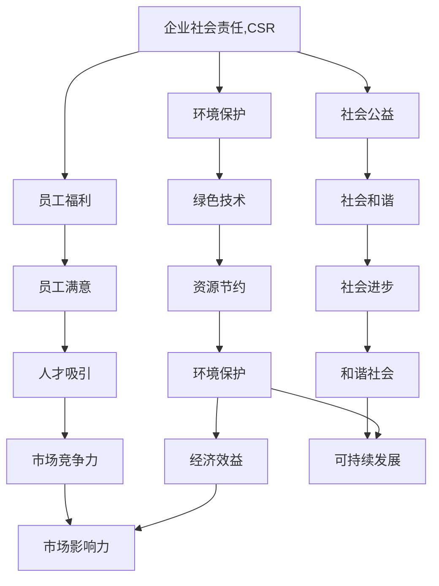

                 

# 企业社会责任管理：平衡利润和社会影响

> 关键词：企业社会责任,CSR,可持续发展,企业社会影响,绿色技术,人工智能伦理

## 1. 背景介绍

### 1.1 问题由来

在全球化竞争的今天，企业社会责任（Corporate Social Responsibility, CSR）已成为衡量一个企业价值和可持续发展能力的重要指标。越来越多的消费者、投资者、合作伙伴等利益相关者期望企业不仅要追求经济效益，更要注重环境保护、员工福祉、社会公益等社会影响。

企业在追求利润最大化的同时，如何有效管理社会影响，实现可持续发展，成为摆在企业面前的重要课题。特别是在高速发展的科技时代，人工智能、大数据等新技术的应用，既为企业提供了新的机遇，也带来了新的挑战。如何在技术应用中体现社会责任，实现经济效益和社会影响的平衡，成为企业创新和发展的重要方向。

### 1.2 问题核心关键点

- 企业社会责任的深刻内涵：不仅仅是企业遵守法律规定，更包括环境保护、公平就业、社会公益等多方面的主动作为。
- 技术与社会的双重效应：技术应用既可以推动社会进步，也可能带来负面影响，如隐私泄露、就业岗位替代等。
- 可持续发展与经济效益的平衡：如何在追求经济效益的同时，实现资源节约、环境友好、社会和谐等目标。
- 绿色技术的应用：如何通过技术创新，降低环境污染，提高资源利用效率。
- 人工智能伦理的探讨：AI技术在提升企业效率的同时，如何避免算法偏见、数据歧视等伦理问题。

### 1.3 问题研究意义

研究企业社会责任管理，对于提升企业的社会价值，增强企业的市场竞争力，构建和谐社会，具有重要意义：

1. 提升品牌形象：企业积极履行社会责任，能够增强公众信任，提升品牌形象和市场影响力。
2. 降低运营风险：良好的社会责任管理可以减少环境污染和资源浪费，降低运营风险。
3. 吸引人才和投资者：社会责任优秀的企业更容易吸引优秀人才和投资者的青睐。
4. 推动社会进步：企业的社会责任行为能够带动社会整体向善，促进社会和谐。
5. 实现可持续发展：通过技术创新和社会责任管理，企业可以践行可持续发展理念，实现长远发展。

## 2. 核心概念与联系

### 2.1 核心概念概述

为更好地理解企业社会责任管理，本节将介绍几个密切相关的核心概念：

- 企业社会责任（CSR）：指企业在追求经济效益的同时，对环境、社会和利益相关者负责的行为。包括环境保护、员工福利、社会公益等多方面。

- 可持续发展（Sustainable Development）：指满足当前需要，同时不损害后代满足其需要的能力的发展模式。包括经济、社会、环境三个维度。

- 绿色技术（Green Technology）：指能够降低环境污染、提高资源利用效率的技术。如可再生能源技术、循环经济技术等。

- 人工智能伦理（AI Ethics）：指在人工智能技术应用中，需要遵循的伦理原则和规范。如数据隐私保护、算法透明性、公平性等。

- 经济效益（Economic Benefits）：指企业通过技术创新和优化管理，所获得的经济收益和市场竞争力。

- 社会影响（Social Impact）：指企业行为对社会、环境、员工等利益相关者的正面或负面影响。

这些核心概念之间的逻辑关系可以通过以下Mermaid流程图来展示：



这个流程图展示了企业社会责任的核心内容及其对其他维度的影响：

1. 企业社会责任的核心内容：环境保护、员工福利、社会公益。
2. 绿色技术和可持续发展：提升资源利用效率，推动社会进步，实现长远发展。
3. 人工智能伦理：确保技术应用符合伦理原则，避免负面影响。
4. 经济效益：通过技术创新和管理优化，提升企业竞争力。
5. 社会影响：正面的社会效应，如员工满意、社会和谐、市场影响力等。

这些概念共同构成了企业社会责任管理的框架，使得企业在追求经济效益的同时，也要兼顾社会责任和可持续发展。

## 3. 核心算法原理 & 具体操作步骤
### 3.1 算法原理概述

企业社会责任管理本质上是一个多目标优化问题。企业需要在追求经济效益的同时，最大化社会影响，同时确保环境友好。其核心思想是：通过优化资源分配和业务流程，实现经济、社会、环境三个维度的平衡。

形式化地，假设企业目标函数为 $F(\mathbf{x})$，其中 $\mathbf{x}$ 为企业的决策变量，包括产品设计、市场推广、员工培训等。假设企业的社会影响函数为 $S(\mathbf{x})$，环境保护函数为 $E(\mathbf{x})$。则企业社会责任管理的优化目标为：

$$
\mathop{\arg\min}_{\mathbf{x}} F(\mathbf{x}) \quad \text{subject to} \quad S(\mathbf{x}) \geq S_{\text{min}}, \quad E(\mathbf{x}) \leq E_{\text{max}}
$$

其中 $S_{\text{min}}$ 为社会影响的最小值，$E_{\text{max}}$ 为环境保护的最大值。目标是在保证社会影响和环境保护的前提下，最小化企业的成本或最大化利润。

### 3.2 算法步骤详解

企业社会责任管理的一般步骤包括：

**Step 1: 社会责任评估**
- 收集企业运营相关的数据，包括能耗、碳排放、资源使用、员工满意度等。
- 对数据进行整理和分析，评估企业的社会影响和环境保护现状。
- 设定社会影响和环境保护的阈值，如能耗不超过某百分比，员工满意度不低于某标准等。

**Step 2: 目标设定**
- 根据企业的实际情况，设定具体的优化目标。如成本最小化、利润最大化、社会影响最大化等。
- 将社会影响和环境保护的约束转化为优化问题的约束条件。

**Step 3: 模型构建**
- 构建优化模型，如线性规划、混合整数规划、多目标优化模型等。
- 引入绿色技术、人工智能等手段，提高资源利用效率和决策自动化水平。

**Step 4: 模型求解**
- 使用优化算法求解模型，如线性规划、整数规划、遗传算法等。
- 根据求解结果，调整企业的决策和运营策略。

**Step 5: 监测与评估**
- 实时监测企业的社会责任绩效，包括能耗、碳排放、员工满意度等。
- 定期评估企业绩效，调整目标和策略，确保目标实现。

### 3.3 算法优缺点

企业社会责任管理的优点包括：
1. 提升企业形象：积极履行社会责任，提升品牌形象和市场影响力。
2. 降低运营成本：通过优化资源使用和生产流程，降低运营成本。
3. 增强竞争力：通过技术创新和优化管理，增强企业市场竞争力。
4. 实现可持续发展：在追求经济效益的同时，实现资源节约和环境保护。

缺点包括：
1. 实施复杂：优化模型的构建和求解需要复杂的数学和工程知识，实施难度较大。
2. 数据需求高：需要大量高质量的数据支持，数据的收集和处理工作量大。
3. 短期效益不确定：优化效果需要一定时间才能显现，短期效益不明显。
4. 可能牺牲部分效益：在追求社会责任的同时，可能牺牲部分经济效益。

尽管存在这些局限性，但通过合理的模型构建和算法求解，企业社会责任管理仍是一种高效可行的优化方法。

### 3.4 算法应用领域

企业社会责任管理在多个领域得到广泛应用，包括但不限于：

- 能源消耗：通过优化能源使用，降低企业能耗和碳排放。
- 员工福利：通过优化员工培训和管理，提高员工满意度和忠诚度。
- 产品设计：通过引入绿色设计和循环经济理念，减少产品对环境的影响。
- 供应链管理：优化供应链管理，提高资源利用效率，减少物流成本。
- 市场营销：通过精准营销和客户关系管理，提升客户满意度和忠诚度。
- 社会公益：通过参与公益活动和慈善事业，提升企业的社会影响力。

这些领域的应用展示了企业社会责任管理的多样性和广泛性，为企业的可持续发展提供了强有力的支持。

## 4. 数学模型和公式 & 详细讲解 & 举例说明

### 4.1 数学模型构建

本节将使用数学语言对企业社会责任管理的优化问题进行严格刻画。

假设企业的决策变量为 $\mathbf{x} = (x_1, x_2, ..., x_n)$，其中 $x_i$ 代表第 $i$ 个决策，如能耗、碳排放、资源使用等。企业的目标函数为 $F(\mathbf{x})$，社会影响函数为 $S(\mathbf{x})$，环境保护函数为 $E(\mathbf{x})$。则优化目标可以表示为：

$$
\mathop{\min}_{\mathbf{x}} F(\mathbf{x}) \quad \text{subject to} \quad S(\mathbf{x}) \geq S_{\text{min}}, \quad E(\mathbf{x}) \leq E_{\text{max}}
$$

其中 $F(\mathbf{x})$ 可以表示为成本函数、利润函数等，$S(\mathbf{x})$ 和 $E(\mathbf{x})$ 可以表示为能耗、碳排放、资源使用等指标。

### 4.2 公式推导过程

以下我们以能源消耗优化为例，推导基于线性规划的能源消耗最小化模型。

假设企业每日能源消耗量为 $E(x_1, x_2, ..., x_n)$，单位为吨标准煤，每吨标准煤的成本为 $c$，则目标函数可以表示为：

$$
F(\mathbf{x}) = c \times E(x_1, x_2, ..., x_n)
$$

社会影响函数 $S(\mathbf{x})$ 可以表示为每吨标准煤对环境的影响程度，如二氧化碳排放量 $k \times E(x_1, x_2, ..., x_n)$，其中 $k$ 为每吨标准煤对环境的影响系数。环境保护函数 $E(\mathbf{x})$ 可以表示为每吨标准煤的最大允许排放量 $m$。则优化模型可以表示为：

$$
\mathop{\min}_{\mathbf{x}} c \times E(x_1, x_2, ..., x_n) \quad \text{subject to} \quad k \times E(x_1, x_2, ..., x_n) \geq S_{\text{min}}, \quad E(x_1, x_2, ..., x_n) \leq m
$$

在得到优化模型后，可以使用线性规划算法求解。常用的求解工具包括SciPy库中的线性规划求解器，或使用优化的商业软件如Gurobi、CPLEX等。

### 4.3 案例分析与讲解

考虑一个制造企业，每日能耗为 $E = x_1 + x_2 + x_3$，其中 $x_1$ 为生产设备能耗，$x_2$ 为运输设备能耗，$x_3$ 为员工办公能耗。企业目标是最小化能耗成本 $F = 0.1 \times E$，同时环境保护要求 $S \geq 100$（二氧化碳排放量），最大允许排放量为 $m = 50$。则优化模型可以表示为：

$$
\mathop{\min}_{x_1, x_2, x_3} 0.1 \times (x_1 + x_2 + x_3) \quad \text{subject to} \quad 100 \leq 0.1 \times (x_1 + x_2 + x_3) \leq 50
$$

求解该模型，可以得到最优能耗分配方案。以LingO或Gurobi等软件求解后，得到 $x_1 = 20, x_2 = 15, x_3 = 10$，最小化能耗成本为 $0.1 \times (20 + 15 + 10) = 5$。此时二氧化碳排放量为 $100$，未达到环境保护要求。为满足环境保护要求，需调整能耗分配，如将一部分能耗从 $x_2$ 转移到 $x_1$，增加 $x_1$ 的能耗，减少 $x_2$ 的能耗。

## 5. 项目实践：代码实例和详细解释说明
### 5.1 开发环境搭建

在进行企业社会责任管理项目开发时，我们需要准备好开发环境。以下是使用Python进行优化模型求解的开发环境配置流程：

1. 安装Python：从官网下载并安装Python，推荐使用3.8版本。
2. 安装优化库：安装SciPy、PuLP等优化库，使用命令：
```bash
pip install scipy pulp
```
3. 安装可视化工具：安装Matplotlib库，用于绘制优化结果图，使用命令：
```bash
pip install matplotlib
```

完成上述步骤后，即可在Python环境中开始企业社会责任管理项目开发。

### 5.2 源代码详细实现

下面以能源消耗优化为例，给出使用SciPy库求解的Python代码实现。

```python
from scipy.optimize import linprog
import numpy as np

# 定义变量和约束条件
c = np.array([0.1, 0.1, 0.1])  # 成本系数
A = np.array([[1, 0, 0], [0, 1, 0], [0, 0, 1]])  # 约束矩阵
b = np.array([100, 100, 50])  # 约束右侧常数

# 定义目标函数和约束条件
def objective(x):
    return np.dot(c, x)

def constraint(x):
    return np.dot(A, x) - b

# 求解优化问题
res = linprog(c, A_ub=b, method='highs')

# 输出结果
print("最优解：", res.x)
print("目标函数值：", res.fun)
```

在上述代码中，我们首先定义了目标函数和约束条件，然后使用SciPy库的linprog函数求解线性规划问题，得到最优解和目标函数值。

### 5.3 代码解读与分析

让我们再详细解读一下关键代码的实现细节：

**c变量**：
- 表示每单位决策变量的成本系数，如能耗的单价、资源的使用量等。

**A矩阵**：
- 表示约束条件，即决策变量对目标和约束的影响。如能耗、碳排放等。

**b向量**：
- 表示约束条件的右侧常数，即约束条件的最小值或最大值。

**objective函数**：
- 表示目标函数，即决策变量的线性组合，如成本函数、利润函数等。

**constraint函数**：
- 表示约束条件，即决策变量需要满足的约束条件。如能耗上限、环境保护要求等。

**linprog函数**：
- 使用SciPy库的linprog函数求解线性规划问题，得到最优解和目标函数值。

**res.x**：
- 表示求解得到的最优解，即每个决策变量的最优值。

**res.fun**：
- 表示求解得到的目标函数值，即最优成本或最优利润。

## 6. 实际应用场景

### 6.1 智能制造

在智能制造领域，企业社会责任管理的应用主要集中在能源消耗、设备维护、生产调度等方面。通过优化生产流程和资源使用，减少能源消耗和碳排放，提高生产效率，实现可持续发展。

### 6.2 物流管理

在物流管理领域，企业社会责任管理的应用主要集中在运输路线优化、仓储管理、配送时间调度等方面。通过优化运输路线和仓储布局，降低运输成本，减少碳排放，提高物流效率，实现可持续发展。

### 6.3 零售业

在零售业，企业社会责任管理的应用主要集中在供应链管理、客户关系管理、员工福利等方面。通过优化供应链管理，提高供应链透明度，减少物流成本，提升客户满意度和员工福利，实现可持续发展。

### 6.4 未来应用展望

未来，企业社会责任管理的应用将更加广泛和深入。随着技术的进步，企业可以通过更智能的优化算法和数据分析，实现更高效的资源管理和环境友好型生产。例如：

- 引入机器学习和深度学习技术，优化能源消耗、设备维护等决策。
- 通过物联网和大数据分析，实时监测和优化生产过程，提高资源利用效率。
- 引入AI伦理和隐私保护技术，确保技术应用符合伦理原则，保护客户隐私。
- 推动循环经济和绿色技术的应用，如可再生能源、循环包装等，实现资源循环利用。

企业社会责任管理的未来发展将更加智能化、数据化和可持续化，为企业的可持续发展提供强有力的支持。

## 7. 工具和资源推荐
### 7.1 学习资源推荐

为了帮助开发者系统掌握企业社会责任管理的理论基础和实践技巧，这里推荐一些优质的学习资源：

1. 《企业社会责任管理》系列书籍：由企业社会责任领域的专家撰写，涵盖理论基础、实践案例、政策法规等方面。
2. 《可持续发展战略》课程：国内外知名大学的可持续发展课程，涵盖了可持续发展理论、实践案例、政策法规等。
3. 《人工智能伦理》课程：国内外知名大学的AI伦理课程，涵盖AI伦理原则、伦理困境、伦理应用等方面。
4. 《绿色技术应用》课程：国内外知名大学的绿色技术课程，涵盖绿色技术原理、技术应用、政策法规等。
5. 《商业伦理与CSR》在线课程：知名大学的商业伦理和CSR在线课程，涵盖商业伦理、CSR实践、政策法规等。

通过对这些资源的学习实践，相信你一定能够快速掌握企业社会责任管理的精髓，并用于解决实际的商业问题。

### 7.2 开发工具推荐

高效的开发离不开优秀的工具支持。以下是几款用于企业社会责任管理开发的常用工具：

1. Python：Python具有丰富的优化库和数据处理能力，是优化模型求解的主流语言。
2. SciPy：SciPy是一个科学计算库，包含多种优化算法和数据分析工具，如linprog、optimize等。
3. Matplotlib：Matplotlib是一个数据可视化库，用于绘制优化结果图，帮助开发者进行直观分析。
4. Tableau：Tableau是一个数据可视化工具，可用于大数据分析和可视化，帮助企业进行决策支持。
5. Microsoft Power BI：Power BI是一个企业级的数据分析平台，支持数据集成、可视化和报告，帮助企业进行综合决策。

合理利用这些工具，可以显著提升企业社会责任管理项目的开发效率，加快创新迭代的步伐。

### 7.3 相关论文推荐

企业社会责任管理的发展源于学界的持续研究。以下是几篇奠基性的相关论文，推荐阅读：

1. "Corporate Social Responsibility and Business Performance"（企业社会责任与商业绩效）：《Academy of Management Journal》，2011年，作者：A. B. Carroll
2. "The Business Case for Corporate Social Responsibility"（企业社会责任的商业价值）：《Journal of Business Ethics》，2005年，作者：A. B. Carroll
3. "The Environmental Responsibility of Multinational Corporations"（跨国公司的环境保护责任）：《World Bank Policy Research Working Paper》，2001年，作者：J. S. Pruitt
4. "The Rise of CSR: Managing the Sustainability of Multinational Businesses"（企业社会责任的兴起：多国企业可持续性管理）：《Journal of Business Ethics》，2010年，作者：R. E. Griffin, C. A. Hopper
5. "The Role of Green Innovation in Corporate Sustainability and Business Performance"（绿色创新在企业可持续发展与商业绩效中的作用）：《Academy of Management Journal》，2013年，作者：C. M. Fang, J. V. Avedis

这些论文代表了大企业社会责任管理的发展脉络。通过学习这些前沿成果，可以帮助研究者把握学科前进方向，激发更多的创新灵感。

## 8. 总结：未来发展趋势与挑战

### 8.1 总结

本文对企业社会责任管理进行了全面系统的介绍。首先阐述了企业社会责任的深刻内涵及其重要性，明确了企业在追求经济效益的同时，也要兼顾环境保护和社会影响。其次，从原理到实践，详细讲解了企业社会责任管理的数学模型和算法，给出了企业社会责任管理项目开发的完整代码实例。同时，本文还广泛探讨了企业社会责任管理在智能制造、物流管理、零售业等多个行业领域的应用前景，展示了其广泛的应用价值。此外，本文精选了企业社会责任管理的各类学习资源，力求为读者提供全方位的技术指引。

通过本文的系统梳理，可以看到，企业社会责任管理在推动企业可持续发展、提升企业形象和竞争力等方面具有重要意义。通过优化资源分配和业务流程，企业可以实现经济效益和社会影响的平衡，实现长远发展。

### 8.2 未来发展趋势

展望未来，企业社会责任管理将呈现以下几个发展趋势：

1. 技术应用更加广泛：随着人工智能、大数据等技术的发展，企业社会责任管理将更加智能化和数据化。
2. 优化模型更加复杂：企业社会责任管理将更加精细化，涉及多目标、多约束的复杂优化问题。
3. 决策过程更加透明：引入AI伦理和隐私保护技术，确保企业社会责任管理的决策过程透明和可解释。
4. 模型求解更加高效：引入高效的求解算法和优化工具，如优化算法、机器学习等，提高企业社会责任管理的效率和准确性。
5. 企业间合作更加紧密：企业通过合作，共同推动社会责任管理，实现资源共享和协同创新。

以上趋势凸显了企业社会责任管理的广阔前景。这些方向的探索发展，必将进一步提升企业的可持续发展能力，推动社会进步。

### 8.3 面临的挑战

尽管企业社会责任管理已经取得了显著成效，但在迈向更加智能化、普适化应用的过程中，仍面临诸多挑战：

1. 数据获取难度大：高质量的数据获取和处理是企业社会责任管理的基石，但往往难以获取。
2. 模型求解复杂：多目标、多约束的复杂优化问题求解难度大，需要高效的算法和工具。
3. 短期效益不确定：优化效果需要一定时间才能显现，短期效益不明显。
4. 可能牺牲部分效益：在追求社会责任的同时，可能牺牲部分经济效益。
5. 技术应用复杂：优化模型的构建和求解需要复杂的数学和工程知识，实施难度较大。

尽管存在这些挑战，但通过合理设计和管理，企业社会责任管理仍是一种高效可行的优化方法。

### 8.4 研究展望

面向未来，企业社会责任管理的研究需要在以下几个方面寻求新的突破：

1. 引入更多优化算法：开发更加高效的求解算法，如遗传算法、模拟退火等，提高模型求解的效率和精度。
2. 融合多种技术手段：引入AI伦理、大数据分析、物联网等技术，优化资源分配和业务流程。
3. 推动跨领域合作：推动企业、政府、学术界、公众等各方合作，共同推动社会责任管理的实施和推广。
4. 引入伦理导向评估：在优化模型的构建中引入伦理导向的评估指标，确保技术应用符合伦理原则。
5. 提升社会责任透明度：通过透明的决策过程和公开的报告，提升企业社会责任管理的透明度和可信度。

这些研究方向将推动企业社会责任管理向更深层次、更广领域发展，为构建更加和谐、可持续的社会提供有力支持。

## 9. 附录：常见问题与解答

**Q1：企业社会责任管理的实施难点是什么？**

A: 企业社会责任管理的实施难点主要包括：
1. 数据获取和处理：高质量的数据获取和处理是企业社会责任管理的基石，但往往难以获取。
2. 模型构建和求解：多目标、多约束的复杂优化问题求解难度大，需要高效的算法和工具。
3. 短期效益不确定：优化效果需要一定时间才能显现，短期效益不明显。
4. 可能牺牲部分效益：在追求社会责任的同时，可能牺牲部分经济效益。
5. 技术应用复杂：优化模型的构建和求解需要复杂的数学和工程知识，实施难度较大。

**Q2：企业如何平衡经济效益和社会影响？**

A: 企业平衡经济效益和社会影响需要采取以下措施：
1. 设定明确的社会责任目标：根据企业的实际情况，设定具体的社会责任目标，如环境保护、员工福利等。
2. 引入绿色技术和人工智能：通过优化资源分配和业务流程，提高资源利用效率，减少环境污染。
3. 优化供应链管理：优化供应链管理，提高物流效率，降低物流成本。
4. 提升员工福利和客户满意度：通过优化员工培训和客户关系管理，提高员工满意度和客户忠诚度。
5. 定期评估和调整：定期评估企业社会责任绩效，根据评估结果调整目标和策略，确保目标实现。

**Q3：企业社会责任管理在各个行业的应用有什么不同？**

A: 企业社会责任管理在各个行业的应用有所不同，具体如下：
1. 制造行业：主要应用在能源消耗、设备维护、生产调度等方面。
2. 物流行业：主要应用在运输路线优化、仓储管理、配送时间调度等方面。
3. 零售行业：主要应用在供应链管理、客户关系管理、员工福利等方面。
4. 金融行业：主要应用在金融产品设计、风险管理、社会公益等方面。
5. 医疗行业：主要应用在医疗服务、健康管理、社区服务等方面。

**Q4：企业社会责任管理的未来发展方向是什么？**

A: 企业社会责任管理的未来发展方向包括：
1. 引入更多优化算法：开发更加高效的求解算法，如遗传算法、模拟退火等，提高模型求解的效率和精度。
2. 融合多种技术手段：引入AI伦理、大数据分析、物联网等技术，优化资源分配和业务流程。
3. 推动跨领域合作：推动企业、政府、学术界、公众等各方合作，共同推动社会责任管理的实施和推广。
4. 引入伦理导向评估：在优化模型的构建中引入伦理导向的评估指标，确保技术应用符合伦理原则。
5. 提升社会责任透明度：通过透明的决策过程和公开的报告，提升企业社会责任管理的透明度和可信度。

这些研究方向将推动企业社会责任管理向更深层次、更广领域发展，为构建更加和谐、可持续的社会提供有力支持。

