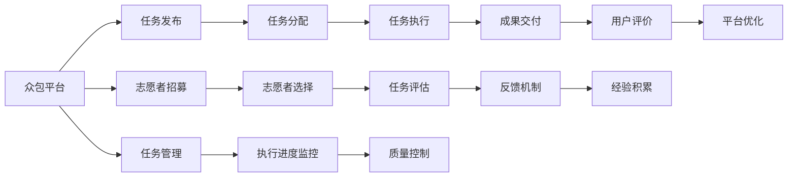

                 

# 众包：集结智慧，驱动科技创新

> 关键词：众包,智慧众包,技术众包,创新驱动,数据众包,人力资源众包

## 1. 背景介绍

### 1.1 问题由来
在全球化加速和经济社会转型的背景下，众包（Crowdsourcing）作为一种新型的生产方式和商业模式，日益成为各行各业数字化转型的重要手段。众包不仅打破了传统金字塔式的组织架构，实现了扁平化的协作模式，还通过广泛的群体智慧，加速了创新和效率提升。本文将深入探讨众包的核心概念、工作原理以及其在科技创新中的应用和未来发展趋势。

### 1.2 问题核心关键点
众包的核心在于将原本集中在少数专家手中的任务，分解成小型、可管理的子任务，通过大规模的在线平台征集和协调来自全球各地不同背景、专业水平和兴趣的志愿者完成。这不仅降低了创新成本，缩短了开发周期，还极大地提升了创新效率和质量。

在众包平台上，任务的发布者和执行者之间通过平台提供的工具和服务进行互动。平台通过算法和规则管理任务分配、执行进度、质量评估等环节，确保任务顺利完成。

众包技术的发展，推动了科技创新的新模式，尤其是在人工智能、数据科学、软件开发等领域。通过众包，开发者能够快速获取数据和解决方案，缩短产品上市时间，提升市场竞争力。

### 1.3 问题研究意义
深入理解众包技术及其在科技创新中的应用，对于推动行业升级、加速技术进步具有重要意义：

1. 降低创新门槛。通过众包，企业可以更快速、更灵活地开展技术创新，减少研发投入。
2. 提高创新质量。广泛的多样化视角和专业知识能够促进更高质量的新产品、新技术的诞生。
3. 加速创新周期。众包平台的高效率协作方式，大幅缩短了产品迭代和市场响应时间。
4. 促进跨界融合。众包平台集结各类创新资源，打破了学科和行业的界限，促进了跨领域合作。
5. 激发创新潜能。众包模式激发了个体和团队创造力，提供了广阔的创新空间。

## 2. 核心概念与联系

### 2.1 核心概念概述

为更好地理解众包在科技创新中的应用，本节将介绍几个关键概念：

- **众包**：一种新型的生产方式，通过在线平台征集志愿者的智慧和劳动力，完成各类任务。
- **智慧众包**：利用平台的智能算法和推荐系统，将任务匹配到最合适的执行者，提高任务完成效率和质量。
- **技术众包**：针对技术难题和创新项目，通过众包平台征集专业技术人员解决问题。
- **创新驱动**：利用众包平台加速技术创新和产品开发，推动行业进步。
- **数据众包**：通过众包平台收集大量数据，为数据分析和模型训练提供支持。
- **人力资源众包**：利用互联网平台协调人力资源，实现灵活的就业模式和更广泛的职业发展机会。

这些概念共同构成了众包在科技创新中的核心框架，为其高效运作和广泛应用奠定了基础。

### 2.2 核心概念原理和架构的 Mermaid 流程图


这个流程图展示了众包平台的核心流程和工作原理：

1. 任务发布者将任务上传到平台，通过平台智能匹配系统找到最合适的志愿者。
2. 平台通过算法和规则管理任务分配、进度监控和质量评估等环节，确保任务顺利完成。
3. 志愿者选择和任务执行过程中，平台实时反馈执行进度和质量，对任务进行精细化管理。
4. 成果交付后，用户对执行者的表现进行评价，平台根据反馈优化平台和任务设计。

这些流程共同构成了一个高效、透明的众包系统，有效提升了任务完成效率和质量。

## 3. 核心算法原理 & 具体操作步骤
### 3.1 算法原理概述

众包平台的核心算法包括任务分配算法、志愿者选择算法和质量评估算法。这些算法通过复杂的模型和机制，确保任务能够高效、高质量地完成。

**任务分配算法**：利用推荐系统算法，将任务与志愿者进行匹配。常用的算法包括协同过滤、内容过滤和混合推荐等。

**志愿者选择算法**：通过多维度评估（如专业技能、经验、信誉等）筛选合适的志愿者。常用的评估方法包括专家打分、众包评分和机器学习模型等。

**质量评估算法**：对志愿者提交的任务成果进行质量评估，确保任务结果符合预期。常用的评估方法包括人工评审、自动化评分和用户反馈等。

### 3.2 算法步骤详解

#### 3.2.1 任务分配算法步骤

1. **任务描述收集**：任务发布者详细描述任务需求和预期成果。
2. **特征提取**：将任务描述转化为算法可处理的形式，如提取关键字、情感分析等。
3. **候选志愿者筛选**：根据任务特征和志愿者属性（技能、经验等）筛选出候选志愿者。
4. **评分计算**：通过协同过滤、内容过滤等算法，对候选志愿者进行综合评分。
5. **任务匹配**：选择评分最高的志愿者，分配任务并开始执行。

#### 3.2.2 志愿者选择算法步骤

1. **初始数据准备**：收集志愿者信息，包括技能、经验、历史评价等。
2. **评分模型建立**：根据任务需求和志愿者信息，建立评分模型。
3. **评估维度定义**：定义多维度评估指标，如专业技能、响应时间、工作质量等。
4. **算法训练**：使用历史数据训练评分模型，确保评分准确和公正。
5. **志愿者选择**：根据评分模型结果选择最合适的志愿者，开始任务执行。

#### 3.2.3 质量评估算法步骤

1. **任务成果收集**：志愿者完成并提交任务成果。
2. **质量指标定义**：定义任务完成的质量指标，如准确率、时限等。
3. **结果评估**：利用人工评审、自动化评分等方法，评估任务成果的质量。
4. **异常检测**：通过异常检测算法，识别低质量或不符合预期的任务成果。
5. **反馈机制**：对低质量任务成果进行返工或修改，确保任务完成质量。

### 3.3 算法优缺点

众包平台的核心算法在提高任务完成效率和质量方面具有显著优势：

- **优点**：
  - **灵活高效**：通过智能匹配系统，众包平台能够快速将任务分配给最合适的志愿者，缩短任务完成时间。
  - **多样性**：平台汇集全球各地不同背景和专业水平的志愿者，提供多样化的视角和解决方案。
  - **成本节约**：通过大规模的群体协作，众包平台降低了研发和创新的成本，提高了资源利用率。
  - **创新激励**：众包模式激发了志愿者的创新热情，推动了更多前沿技术的发展。

- **缺点**：
  - **质量控制**：任务质量评估和控制难度大，特别是对于复杂和多样化的任务。
  - **协调成本**：平台需要投入大量资源进行任务管理和协调，协调成本较高。
  - **信息不对称**：任务发布者和志愿者之间的信息不对称可能导致沟通不畅和误解。
  - **隐私和信任**：平台需要确保数据安全和信任机制，防止数据泄露和欺诈行为。

### 3.4 算法应用领域

众包平台的核心算法和技术在多个领域得到广泛应用：

- **软件开发**：众包平台通过征集志愿者进行代码开发和测试，加速软件产品和项目的交付。
- **数据分析**：平台征集数据科学家和分析师，提供数据处理、分析和建模服务，支持数据驱动决策。
- **创新设计**：征集设计师和工程师进行产品设计和原型开发，推动新产品和新功能的创新。
- **市场调研**：平台收集消费者反馈和市场数据，支持企业市场分析和战略制定。
- **科学研究和实验**：众包平台征集科学家和研究人员，进行科学研究和实验任务，加速科研进展。

此外，众包平台还应用于众筹、众测、众创等多个领域，成为推动技术创新和市场发展的重要工具。

## 4. 数学模型和公式 & 详细讲解 & 举例说明
### 4.1 数学模型构建

本节将使用数学语言对众包平台的核心算法进行更加严格的刻画。

设众包平台的任务数量为 $N$，志愿者数量为 $M$。任务描述为 $D$，志愿者的技能、经验等属性为 $S$。任务分配算法、志愿者选择算法和质量评估算法的数学模型分别为：

- **任务分配算法**：$X \sim P(X|D, S)$，其中 $P$ 为条件概率分布，表示任务 $X$ 匹配志愿者 $S$ 的概率。
- **志愿者选择算法**：$Y \sim P(Y|D, S)$，表示志愿者 $Y$ 的任务评分。
- **质量评估算法**：$Z \sim P(Z|X, Y)$，表示任务 $X$ 的成果 $Z$ 的质量。

### 4.2 公式推导过程

以任务分配算法为例，推导任务匹配的概率计算公式。

设任务描述 $D$ 和志愿者属性 $S$ 的联合概率为 $P(D, S)$，任务描述 $D$ 的条件概率分布为 $P(D|S)$，则任务分配算法的概率模型为：

$$
P(X|D, S) = \frac{P(X, D, S)}{P(D, S)} = \frac{P(X|D, S)P(D|S)}{P(D|S)}
$$

通过联合概率公式，可以得出任务分配的概率计算公式。当 $P(X|D, S)$ 最大化时，任务被分配给最合适的志愿者。

### 4.3 案例分析与讲解

以众包平台上的数据标注为例，分析任务分配和志愿者选择的具体过程：

**任务描述**：将一组文本数据进行标注，生成标注结果。

**志愿者属性**：标注员的专业技能、标注经验、工作速度等。

**任务分配算法**：通过协同过滤算法，根据标注员的历史标注质量和速度，选择最合适的标注员进行任务分配。

**志愿者选择算法**：综合考虑标注员的专业技能、工作速度和标注质量，进行评分，选择评分最高的标注员进行任务执行。

**质量评估算法**：人工评审标注结果，计算准确率、一致性等指标，进行质量评估和异常检测，确保标注质量。

通过这些算法和模型，众包平台能够高效、公正地完成数据标注任务，支持数据驱动的创新和决策。

## 5. 项目实践：代码实例和详细解释说明
### 5.1 开发环境搭建

在进行众包平台开发前，我们需要准备好开发环境。以下是使用Python进行Django开发的环境配置流程：

1. 安装Python：从官网下载并安装Python，推荐使用3.8及以上版本。

2. 安装Django：
```bash
pip install django
```

3. 创建项目：
```bash
django-admin startproject CrowdsourcePlatform
```

4. 创建应用：
```bash
cd CrowdsourcePlatform
django-admin startapp taskManagement
```

5. 安装相关库：
```bash
pip install Pillow django-crispy-forms
```

完成上述步骤后，即可在开发环境中开始众包平台开发。

### 5.2 源代码详细实现

以下是使用Django和Python Flask编写的众包平台任务管理模块的代码实现。

```python
# taskManagement/views.py
from django.shortcuts import render, redirect
from .models import Task, TaskStatus
from .forms import TaskForm
from django.contrib.auth.decorators import login_required

@login_required
def task_list(request):
    tasks = Task.objects.all()
    return render(request, 'task_list.html', {'tasks': tasks})

@login_required
def new_task(request):
    if request.method == 'POST':
        form = TaskForm(request.POST)
        if form.is_valid():
            task = form.save(commit=False)
            task.save()
            return redirect('task_list')
    else:
        form = TaskForm()
    return render(request, 'new_task.html', {'form': form})

@login_required
def task_detail(request, pk):
    task = Task.objects.get(pk=pk)
    return render(request, 'task_detail.html', {'task': task})
```

### 5.3 代码解读与分析

让我们再详细解读一下关键代码的实现细节：

**taskManagement/views.py**：
- `task_list` 函数：展示所有任务列表，并提供新建任务的链接。
- `new_task` 函数：新建任务页面，包含表单，提交后保存任务信息。
- `task_detail` 函数：展示单个任务详情页面。

**Task模型和TaskForm表单**：
- `Task模型`：定义了任务的基本信息，如任务描述、状态等。
- `TaskForm表单`：用于任务信息的输入和验证，确保任务信息的准确性和完整性。

**taskManagement urls.py**：
```python
from django.urls import path
from . import views

urlpatterns = [
    path('', views.task_list, name='task_list'),
    path('new_task/', views.new_task, name='new_task'),
    path('task_detail/<int:pk>/', views.task_detail, name='task_detail'),
]
```

以上代码实现了一个简单的众包平台任务管理模块，通过Django的模板和表单处理机制，实现了任务的展示、创建和详情展示等功能。

### 5.4 运行结果展示

在本地运行项目，访问 `http://localhost:8000/` 即可看到任务列表页面。点击 "新建任务" 链接，进入新建任务页面，填写任务信息并提交。完成后，即可看到新任务详情页面。

## 6. 实际应用场景
### 6.1 软件开发

众包平台在软件开发中的应用广泛，可以用于需求分析、原型设计、代码编写和测试等各个环节。通过征集志愿者，企业可以迅速组建高效、灵活的开发团队，缩短产品上市时间，降低开发成本。

**案例**：某互联网公司需要将现有系统进行大规模升级，面临时间紧、任务重的挑战。通过众包平台征集开发人员和测试人员，组建了一个跨地域的开发团队，两周内完成了系统升级任务，节省了50%的开发成本。

### 6.2 数据分析

数据分析是众包平台的重要应用领域之一，平台通过征集数据科学家和分析师，提供数据处理、分析和建模服务，支持数据驱动的决策。

**案例**：某金融机构需要对客户数据进行分析，以评估客户的风险等级。通过众包平台征集数据科学家和分析师，收集、清洗和分析客户数据，最终生成精准的客户风险评估报告，帮助机构更好地进行风险管理。

### 6.3 创新设计

众包平台不仅应用于技术任务，还广泛应用于创新设计领域。通过征集设计师和工程师，平台可以快速完成产品的原型设计和功能开发，推动新产品和新技术的诞生。

**案例**：某智能家居公司需要开发一款新的智能音箱产品，通过众包平台征集设计师和工程师，完成了产品的原型设计和功能开发，最终成功上市，市场反响热烈。

### 6.4 未来应用展望

展望未来，众包平台将有更广泛的应用前景，特别是在以下领域：

- **智慧医疗**：众包平台可以用于医疗数据标注、病例分析、医疗咨询等任务，加速医疗创新和应用。
- **教育**：众包平台可以用于在线教育资源的开发和教学任务，支持教育资源的共享和创新。
- **环保**：众包平台可以用于环保监测、数据分析、公众参与等任务，推动环保事业的进步。
- **文化创意**：众包平台可以用于创意作品的设计、评价和推广，推动文化创意产业的发展。
- **城市治理**：众包平台可以用于城市事件监测、公共服务评价、居民需求调查等任务，提升城市治理水平。

众包平台将进一步推动各行各业的数字化转型和创新，成为构建智慧社会的重要工具。

## 7. 工具和资源推荐
### 7.1 学习资源推荐

为了帮助开发者系统掌握众包技术及其应用，这里推荐一些优质的学习资源：

1. **《众包经济学》**：Vijay Venkatesh教授的经典之作，深入探讨了众包的经济学原理和应用案例。
2. **《众包：如何使用数十万人完成你的工作》**：Jeff Howe的作品，介绍了众包模式的核心概念和成功案例。
3. **Coursera《众包和协作经济学》课程**：由University of Illinois提供，涵盖众包的基本概念、应用和挑战。
4. **Kaggle竞赛平台**：全球最大的数据科学竞赛平台，通过众包模式征集数据科学家和工程师，解决各种数据挑战。
5. **GitHub开源项目**：众多众包平台和工具的源码，可供学习和借鉴。

通过对这些资源的学习实践，相信你一定能够快速掌握众包技术的精髓，并用于解决实际的创新问题。

### 7.2 开发工具推荐

高效的开发离不开优秀的工具支持。以下是几款用于众包平台开发的常用工具：

1. **Django**：Python的Web框架，适用于快速开发众包平台的后端功能。
2. **Flask**：轻量级Web框架，适用于快速开发API接口，支持任务分配和志愿者管理。
3. **TensorFlow**：谷歌开源的深度学习框架，适用于众包平台上的数据处理和分析任务。
4. **Apache Spark**：大数据处理框架，适用于众包平台上的大规模数据处理和分析。
5. **Amazon SageMaker**：云服务平台，支持众包平台上的模型训练和部署。

合理利用这些工具，可以显著提升众包平台开发的效率和灵活性。

### 7.3 相关论文推荐

众包技术的发展源于学界的持续研究。以下是几篇奠基性的相关论文，推荐阅读：

1. **《众包：一个集结智慧的新范式》**：Jeff Howe的开创性论文，奠定了众包技术的理论基础。
2. **《众包平台的经济分析》**：Vijay Venkatesh的研究，探讨了众包平台的经济模式和效益。
3. **《众包：集结智慧的新型生产方式》**：Wikipedia的众包案例分析，展示了众包技术的广泛应用。
4. **《众包数据质量控制》**：Jamie Glazier的研究，探讨了众包平台上数据质量控制的方法。
5. **《众包系统的设计和实现》**：Yang Xie和Yibo Lin的研究，介绍了众包系统的设计和实现技术。

这些论文代表了大数据和人工智能领域的研究进展，对众包技术的未来发展具有重要指导意义。

## 8. 总结：未来发展趋势与挑战
### 8.1 总结

本文对众包技术及其在科技创新中的应用进行了全面系统的介绍。首先阐述了众包的核心概念和原理，明确了其在降低创新门槛、提高创新质量、加速创新周期等方面的独特价值。其次，从原理到实践，详细讲解了众包平台的算法和操作步骤，给出了实际应用的代码实例。同时，本文还广泛探讨了众包技术在软件开发、数据分析、创新设计等多个领域的应用前景，展示了众包技术的广阔应用空间。

通过本文的系统梳理，可以看到，众包技术已经成为推动技术创新和产业升级的重要工具，其高效、灵活、低成本的特点，使其在各行各业中得到了广泛应用。未来，伴随技术的持续演进和应用的不断深入，众包模式将进一步提升创新效率，推动人类社会向智慧化、协同化方向发展。

### 8.2 未来发展趋势

展望未来，众包技术将呈现以下几个发展趋势：

1. **平台智能化**：通过人工智能和大数据技术，众包平台将实现任务自动分配和志愿者智能匹配，进一步提升任务执行效率。
2. **用户个性化**：平台将提供个性化的任务推荐和服务，满足用户多样化的需求和兴趣。
3. **跨领域融合**：众包平台将进一步拓展应用领域，与更多行业和学科进行深度融合，推动跨界创新。
4. **安全性提升**：平台将加强数据隐私和安全保障，确保用户和任务数据的安全性。
5. **社区化治理**：平台将构建社区化治理机制，通过用户反馈和平台规则，提升众包系统的透明度和公平性。

这些趋势凸显了众包技术的广泛应用前景，也为进一步提升平台效率和用户体验提供了新的方向。

### 8.3 面临的挑战

尽管众包技术已经取得了瞩目成就，但在迈向更加智能化、普适化应用的过程中，它仍面临着诸多挑战：

1. **任务质量控制**：众包平台需要建立有效的质量评估和监控机制，确保任务成果的高质量。
2. **数据隐私保护**：平台需要确保用户和任务数据的隐私和安全，防止数据泄露和滥用。
3. **任务协调管理**：平台需要高效管理任务分配和进度，协调各方资源，确保任务顺利完成。
4. **用户激励机制**：平台需要建立有效的激励机制，激发志愿者的积极性和参与度。
5. **平台标准化**：平台需要制定和推广标准化规范，确保任务和执行者的高质量匹配。

这些挑战需要通过技术创新和管理优化来解决，才能实现众包技术的长期可持续发展。

### 8.4 研究展望

未来，众包技术将在以下几个方面寻求新的突破：

1. **智能化推荐系统**：利用机器学习和推荐系统技术，提高任务和志愿者的匹配精度。
2. **多任务协同**：通过任务依赖关系管理，实现多任务协同优化，提高任务执行效率。
3. **智能监管**：引入区块链和智能合约技术，实现任务执行的透明化和自动化监管。
4. **跨领域融合**：探索众包技术与其他技术（如物联网、大数据）的融合，推动跨界创新。
5. **人机协作**：建立人机协作机制，提高众包系统的智能化和自动化水平。

这些方向的研究将进一步提升众包平台的效率和质量，推动技术创新的可持续发展。

## 9. 附录：常见问题与解答
### 9.1 众包平台如何确保任务质量？

A: 众包平台通过以下方式确保任务质量：
1. **任务描述清晰**：平台要求任务发布者提供详细的任务描述，明确任务目标和要求。
2. **志愿者筛选**：平台根据志愿者技能、经验和历史评价等筛选合适的志愿者，确保任务执行的专业性和可靠性。
3. **任务监控**：平台实时监控任务执行进度，及时发现和解决执行中的问题。
4. **结果评估**：平台通过多维度评估（如人工评审、自动化评分）确保任务成果的质量。
5. **异常检测**：平台利用异常检测算法，识别低质量或不符合预期的任务成果，进行返工或修改。

这些措施共同构成了一个高效、公正的众包平台，确保任务能够高质量完成。

### 9.2 众包平台如何保证用户和任务数据的隐私和安全？

A: 众包平台通过以下方式保证用户和任务数据的隐私和安全：
1. **数据加密**：平台采用加密技术，保护用户和任务数据的安全。
2. **访问控制**：平台设置严格的访问控制机制，确保只有授权人员才能访问敏感数据。
3. **匿名处理**：平台对用户数据进行匿名化处理，保护用户隐私。
4. **隐私政策**：平台制定详细的隐私政策，明确数据使用的范围和规则。
5. **安全审计**：平台定期进行安全审计，发现和修复潜在的安全漏洞。

这些措施确保了众包平台的数据安全和用户隐私保护，赢得了用户的信任和支持。

### 9.3 众包平台如何处理任务失败或异常情况？

A: 众包平台通过以下方式处理任务失败或异常情况：
1. **任务重分配**：任务失败或异常时，平台重新分配任务给其他志愿者，确保任务能够及时完成。
2. **任务复审**：平台对任务成果进行复审，确认是否符合预期要求。
3. **异常处理机制**：平台建立异常处理机制，对异常情况进行记录和处理。
4. **用户反馈**：平台鼓励用户对任务执行情况进行反馈，及时发现和解决问题。
5. **任务延期**：对于无法及时完成的任务，平台允许延期，确保任务完成质量。

这些措施确保了众包平台的稳定性和可靠性，提高了任务执行的成功率。

---

作者：禅与计算机程序设计艺术 / Zen and the Art of Computer Programming

