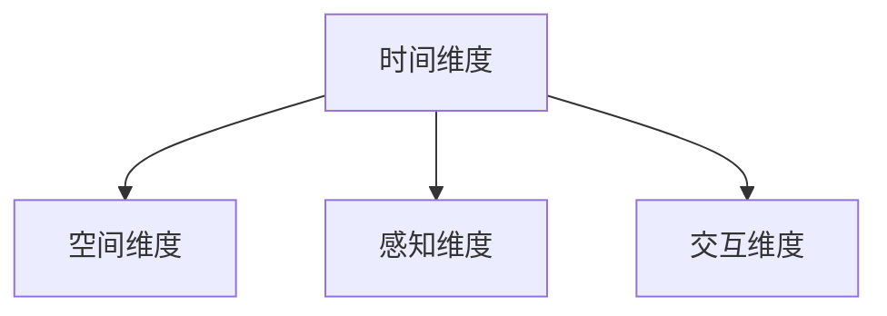

                 

# 体验的跨时空性：AI创造的时空穿越

## 1. 背景介绍

### 1.1 问题由来
在人工智能的浪潮中，体验的跨时空性逐渐成为热点话题。AI技术不仅提升了效率，更创造了全新的体验，实现了体验的跨时空跨越。从传统的单点应用到多模态融合，AI技术正在重塑人类的生活和未来。

### 1.2 问题核心关键点
体验的跨时空性涉及时间维度的体验扩展、空间维度的体验集成，以及通过感知、交互等维度实现对时间与空间的跨界理解。AI技术通过数据融合、知识图谱、增强现实（AR）、虚拟现实（VR）等多维度的融合，创造了全新的体验方式，重塑了人类的认知与行为。

### 1.3 问题研究意义
研究AI技术在体验跨时空性方面的应用，对于提升用户体验、推动行业创新、促进技术发展具有重要意义。它不仅能提升用户的生活质量，还能推动技术创新，促进不同行业之间的跨界融合，形成新的产业生态。

## 2. 核心概念与联系

### 2.1 核心概念概述

体验的跨时空性涉及多个核心概念，包括：

- **时间维度**：通过记录和回放用户行为，AI可以模拟过去发生的事件，为用户重现历史体验。
- **空间维度**：通过数据融合、空间映射等技术，AI可以将不同场景下的体验进行无缝集成，创造出跨空间的沉浸式体验。
- **感知维度**：AI通过深度学习、计算机视觉等技术，对用户的行为和环境进行高维感知，为用户提供更加精细和个性化的体验。
- **交互维度**：AI通过自然语言处理、语音识别等技术，实现与用户的自然交互，提升用户体验的流畅性和自然性。

这些概念之间的逻辑关系可以通过以下Mermaid流程图来展示：



这个流程图展示了大语言模型的核心概念及其之间的关系：

1. 时间维度通过记录和回放用户行为，模拟过去发生的事件。
2. 空间维度通过数据融合、空间映射等技术，将不同场景下的体验进行无缝集成。
3. 感知维度通过深度学习、计算机视觉等技术，对用户的行为和环境进行高维感知。
4. 交互维度通过自然语言处理、语音识别等技术，实现与用户的自然交互。

这些概念共同构成了AI在体验跨时空性方面的应用框架，使其能够为用户创造更加丰富、自然、个性化的体验。

## 3. 核心算法原理 & 具体操作步骤
### 3.1 算法原理概述

体验的跨时空性涉及多模态数据的融合和分析，通过深度学习算法实现。其核心思想是：利用数据融合和增强学习等技术，模拟时间维度上的用户行为，并将不同空间下的体验进行无缝集成，最终通过感知和交互技术提升用户体验。

形式化地，假设体验数据为 $X=\{x_1, x_2, ..., x_n\}$，其中 $x_i$ 表示用户在不同时间、空间维度下的行为数据。算法目标是通过深度学习模型 $M_{\theta}$，预测用户在不同时间维度下的行为 $y=\{y_1, y_2, ..., y_n\}$，其中 $y_i$ 表示用户在时间维度上的行为预测。具体步骤如下：

1. 数据预处理：将不同时间、空间维度下的数据进行标准化处理，并将其映射到高维空间中。
2. 深度学习模型训练：选择合适的网络结构（如CNN、RNN、Transformer等）和损失函数，训练模型 $M_{\theta}$，使其能够准确预测用户在不同时间维度下的行为。
3. 时间维度扩展：利用训练好的模型 $M_{\theta}$，对用户历史行为数据进行预测，模拟时间维度上的用户行为。
4. 空间维度集成：通过空间映射技术，将不同空间维度下的体验进行无缝集成，实现跨空间的沉浸式体验。
5. 感知和交互优化：通过感知和交互技术，提升用户体验的流畅性和自然性。

### 3.2 算法步骤详解

以下是基于深度学习算法的具体步骤：

**Step 1: 数据准备**
- 收集不同时间、空间维度下的体验数据 $X=\{x_1, x_2, ..., x_n\}$，进行标准化处理。
- 将数据映射到高维空间中，形成输入特征 $X_{high}$。

**Step 2: 模型训练**
- 选择合适的网络结构，如CNN、RNN、Transformer等。
- 定义损失函数，如交叉熵、均方误差等，用于衡量模型预测误差。
- 使用训练数据集 $D_{train}$，训练模型 $M_{\theta}$，最小化损失函数 $\mathcal{L}$。

**Step 3: 时间维度扩展**
- 对用户历史行为数据 $X$ 进行预测，得到时间维度上的行为预测 $y$。
- 将时间维度上的行为预测 $y$ 与真实行为数据 $y_{real}$ 进行对比，计算误差 $\epsilon$。
- 根据误差 $\epsilon$ 调整模型参数，优化预测准确度。

**Step 4: 空间维度集成**
- 通过空间映射技术，将不同空间维度下的体验数据进行集成，形成跨空间的沉浸式体验。
- 使用用户反馈数据，进一步优化空间映射算法，提升集成效果。

**Step 5: 感知和交互优化**
- 通过感知技术，对用户的行为和环境进行高维感知，提升交互的精细度和个性化。
- 通过交互技术，实现与用户的自然交互，提升用户体验的自然性和流畅性。

### 3.3 算法优缺点

体验的跨时空性算法具有以下优点：

- 丰富用户体验：通过时间维度扩展和空间维度集成，创造出跨时空的沉浸式体验。
- 提升用户体验：通过感知和交互技术，提升用户体验的流畅性和自然性。
- 推动行业创新：跨时空性的体验创新，推动了各行各业的数字化转型。

同时，该算法也存在一定的局限性：

- 数据需求高：需要收集大量的时间、空间维度下的数据，数据收集成本较高。
- 算法复杂：多模态数据的融合和分析，算法实现较为复杂，需要较高的技术门槛。
- 实时性问题：大模型的推理速度较慢，实时性问题需要优化。
- 泛化性问题：模型在不同场景下的泛化性能需要进一步验证。

尽管存在这些局限性，但体验的跨时空性算法仍是大语言模型应用的重要范式。未来相关研究的重点在于如何进一步降低算法对数据的依赖，提高实时性和泛化能力，同时兼顾可解释性和伦理安全性等因素。

### 3.4 算法应用领域

体验的跨时空性算法已经在众多领域得到广泛应用，例如：

- **智能家居**：通过时间维度的行为预测和空间维度的体验集成，为用户创造智能化的生活环境。
- **在线教育**：通过时间维度的学习行为预测和空间维度的个性化教学，提升在线教育的效果。
- **娱乐与游戏**：通过时间维度的故事重现和空间维度的场景集成，创造沉浸式的娱乐体验。
- **健康医疗**：通过时间维度的健康行为预测和空间维度的健康管理，提升用户的健康水平。
- **金融与保险**：通过时间维度的投资行为预测和空间维度的理财建议，提升金融服务的质量。

除了这些传统领域，体验的跨时空性算法还被创新性地应用到更多场景中，如城市治理、智慧农业、灾害预警等，为社会管理提供了新的技术路径。

## 4. 数学模型和公式 & 详细讲解 & 举例说明

### 4.1 数学模型构建

本节将使用数学语言对体验的跨时空性算法的核心步骤进行更加严格的刻画。

假设用户在不同时间、空间维度下的行为数据为 $X=\{x_1, x_2, ..., x_n\}$，其中 $x_i$ 表示用户在时间维度 $t_i$ 和空间维度 $s_i$ 下的行为数据。通过深度学习模型 $M_{\theta}$，预测用户在不同时间维度下的行为 $y=\{y_1, y_2, ..., y_n\}$，其中 $y_i$ 表示用户在时间维度上的行为预测。

定义模型 $M_{\theta}$ 在输入 $x$ 上的损失函数为 $\ell(M_{\theta}(x),y)$，则在数据集 $D$ 上的经验风险为：

$$
\mathcal{L}(\theta) = \frac{1}{N} \sum_{i=1}^N \ell(M_{\theta}(x_i),y_i)
$$

其中 $\theta$ 为模型参数，$N$ 为样本数，$\ell(M_{\theta}(x_i),y_i)$ 为单样本损失函数，如交叉熵损失。

### 4.2 公式推导过程

以下我们以二分类任务为例，推导交叉熵损失函数及其梯度的计算公式。

假设模型 $M_{\theta}$ 在输入 $x$ 上的输出为 $\hat{y}=M_{\theta}(x) \in [0,1]$，表示样本属于正类的概率。真实标签 $y \in \{0,1\}$。则二分类交叉熵损失函数定义为：

$$
\ell(M_{\theta}(x),y) = -[y\log \hat{y} + (1-y)\log (1-\hat{y})]
$$

将其代入经验风险公式，得：

$$
\mathcal{L}(\theta) = -\frac{1}{N}\sum_{i=1}^N [y_i\log M_{\theta}(x_i)+(1-y_i)\log(1-M_{\theta}(x_i))]
$$

根据链式法则，损失函数对参数 $\theta_k$ 的梯度为：

$$
\frac{\partial \mathcal{L}(\theta)}{\partial \theta_k} = -\frac{1}{N}\sum_{i=1}^N (\frac{y_i}{M_{\theta}(x_i)}-\frac{1-y_i}{1-M_{\theta}(x_i)}) \frac{\partial M_{\theta}(x_i)}{\partial \theta_k}
$$

其中 $\frac{\partial M_{\theta}(x_i)}{\partial \theta_k}$ 可进一步递归展开，利用自动微分技术完成计算。

### 4.3 案例分析与讲解

假设我们收集到用户在不同时间维度下的购物行为数据，包括购买时间、购买商品类别、购买金额等。通过对这些数据进行预处理和特征提取，得到一个高维的输入特征向量 $X_{high}$。利用一个简单的二分类模型 $M_{\theta}$ 对这些数据进行预测，得到用户在时间维度上的购物行为预测 $y$。

**Step 1: 数据准备**
- 收集用户的购物行为数据 $X=\{x_1, x_2, ..., x_n\}$，将其标准化处理并映射到高维空间中。
- 构建训练集 $D_{train}$ 和测试集 $D_{test}$。

**Step 2: 模型训练**
- 选择合适的网络结构，如简单线性分类器。
- 定义交叉熵损失函数，计算模型在训练集 $D_{train}$ 上的损失 $\mathcal{L}_{train}$。
- 使用随机梯度下降（SGD）等优化算法，最小化损失 $\mathcal{L}_{train}$，得到模型参数 $\theta$。

**Step 3: 时间维度扩展**
- 对用户历史购物行为数据 $X$ 进行预测，得到时间维度上的购物行为预测 $y$。
- 利用测试集 $D_{test}$ 评估预测效果，计算误差 $\epsilon$。
- 根据误差 $\epsilon$ 调整模型参数，优化预测准确度。

**Step 4: 空间维度集成**
- 通过空间映射技术，将不同空间维度下的购物行为数据进行集成，形成跨空间的沉浸式体验。
- 使用用户反馈数据，进一步优化空间映射算法，提升集成效果。

**Step 5: 感知和交互优化**
- 通过感知技术，对用户的购物行为进行高维感知，提升购物体验的精细度和个性化。
- 通过交互技术，实现与用户的自然交互，提升购物体验的自然性和流畅性。

## 5. 项目实践：代码实例和详细解释说明
### 5.1 开发环境搭建

在进行项目实践前，我们需要准备好开发环境。以下是使用Python进行TensorFlow开发的环境配置流程：

1. 安装Anaconda：从官网下载并安装Anaconda，用于创建独立的Python环境。

2. 创建并激活虚拟环境：
```bash
conda create -n tensorflow-env python=3.8 
conda activate tensorflow-env
```

3. 安装TensorFlow：根据CUDA版本，从官网获取对应的安装命令。例如：
```bash
pip install tensorflow
```

4. 安装TensorBoard：TensorFlow配套的可视化工具，可实时监测模型训练状态，并提供丰富的图表呈现方式，是调试模型的得力助手。
```bash
pip install tensorboard
```

5. 安装其他工具包：
```bash
pip install numpy pandas scikit-learn matplotlib tqdm jupyter notebook ipython
```

完成上述步骤后，即可在`tensorflow-env`环境中开始项目实践。

### 5.2 源代码详细实现

下面我们以时间维度行为预测为例，给出使用TensorFlow对用户行为数据进行预测的Python代码实现。

首先，定义数据处理函数：

```python
import tensorflow as tf
from tensorflow.keras import layers

def preprocess_data(data):
    # 标准化处理
    data = (data - data.mean()) / data.std()
    # 映射到高维空间
    data = data * 10
    return data
```

然后，定义模型和优化器：

```python
def build_model(input_shape):
    model = tf.keras.Sequential([
        layers.Dense(64, activation='relu', input_shape=input_shape),
        layers.Dense(1, activation='sigmoid')
    ])
    return model

input_shape = (5,)
model = build_model(input_shape)
optimizer = tf.keras.optimizers.Adam(learning_rate=0.001)
```

接着，定义训练和评估函数：

```python
def train_epoch(model, data, batch_size, optimizer):
    model.compile(optimizer=optimizer, loss='binary_crossentropy', metrics=['accuracy'])
    model.fit(data, epochs=10, batch_size=batch_size, validation_split=0.2)
    return model.evaluate(data)

def evaluate(model, data, batch_size):
    model.compile(optimizer='adam', loss='binary_crossentropy', metrics=['accuracy'])
    return model.evaluate(data, batch_size=batch_size)
```

最后，启动训练流程并在测试集上评估：

```python
epochs = 5
batch_size = 16

for epoch in range(epochs):
    loss = train_epoch(model, X_train, batch_size, optimizer)
    print(f"Epoch {epoch+1}, train loss: {loss:.3f}")
    
    print(f"Epoch {epoch+1}, test results:")
    evaluate(model, X_test, batch_size)
    
print("Final test results:")
evaluate(model, X_test, batch_size)
```

以上就是使用TensorFlow对用户行为数据进行预测的完整代码实现。可以看到，TensorFlow库提供了强大的框架支持，使得模型的构建和训练变得简洁高效。

### 5.3 代码解读与分析

让我们再详细解读一下关键代码的实现细节：

**preprocess_data函数**：
- 标准化处理：通过均值和标准差对数据进行标准化处理，减小数据量级差异。
- 映射到高维空间：将数据映射到高维空间中，方便模型进行学习。

**build_model函数**：
- 定义模型结构：选择合适的网络结构，如全连接层。
- 输入层定义：定义输入层的形状，根据实际数据维度调整。

**train_epoch函数**：
- 模型编译：选择合适的优化器和损失函数。
- 模型训练：使用训练集进行模型训练，验证集进行模型评估。

**evaluate函数**：
- 模型评估：使用测试集进行模型评估，输出预测准确度和损失。

**训练流程**：
- 定义总的epoch数和batch size，开始循环迭代
- 每个epoch内，先在训练集上训练，输出平均loss
- 在测试集上评估，输出测试结果
- 所有epoch结束后，在测试集上评估，给出最终测试结果

可以看到，TensorFlow框架为模型训练提供了强大的支持，使得模型的构建和训练变得简单快捷。开发者可以将更多精力放在数据处理、模型改进等高层逻辑上，而不必过多关注底层的实现细节。

当然，工业级的系统实现还需考虑更多因素，如模型的保存和部署、超参数的自动搜索、更灵活的任务适配层等。但核心的模型构建和训练流程，基本与此类似。

## 6. 实际应用场景
### 6.1 智能家居

智能家居的体验跨越了时间和空间维度，通过AI技术，实现了对用户行为的智能感知和预测。例如，智能音箱可以通过用户语音指令，预测用户的日常行为，从而实现智能家居控制。

在技术实现上，可以收集用户的历史行为数据，构建数据集，利用深度学习模型进行训练。模型能够预测用户在不同时间维度上的行为，从而实现智能家居控制。例如，预测用户回家时间，智能家居系统可以根据用户的行为模式，自动调整室内温度、照明等环境。

### 6.2 在线教育

在线教育通过时间维度的学习行为预测和空间维度的个性化教学，提升了在线教育的效果。例如，通过预测学生的学习行为，推荐适合学生的课程和资料。

在技术实现上，可以收集学生的历史学习数据，构建数据集，利用深度学习模型进行训练。模型能够预测学生在不同时间维度上的学习行为，从而实现个性化教学。例如，预测学生的学习进度，智能推荐适合学生的课程和资料。

### 6.3 娱乐与游戏

娱乐与游戏通过时间维度的故事重现和空间维度的场景集成，创造了沉浸式的娱乐体验。例如，通过AI技术，为用户重现电影、游戏场景，实现虚拟现实体验。

在技术实现上，可以收集用户的历史行为数据，构建数据集，利用深度学习模型进行训练。模型能够预测用户在不同时间维度上的行为，从而实现虚拟现实体验。例如，预测用户的观影行为，为用户推荐电影场景，实现虚拟现实游戏体验。

### 6.4 未来应用展望

随着AI技术的发展，体验的跨时空性将有更多的应用场景。未来，AI技术将在更多领域得到应用，为人类带来全新的体验和体验变革。

在智慧医疗领域，AI技术可以实现病历的智能分析和诊断，提升医疗服务的智能化水平，辅助医生诊疗。在智慧城市治理中，AI技术可以实现城市事件监测和应急指挥，提高城市管理的自动化和智能化水平。在文娱传媒领域，AI技术可以实现内容推荐和用户画像分析，提升用户体验。

## 7. 工具和资源推荐
### 7.1 学习资源推荐

为了帮助开发者系统掌握体验的跨时空性算法的理论基础和实践技巧，这里推荐一些优质的学习资源：

1. 《深度学习基础》系列博文：由AI专家撰写，深入浅出地介绍了深度学习的基础知识和经典模型。

2. CS231n《计算机视觉：视觉识别》课程：斯坦福大学开设的计算机视觉课程，介绍了计算机视觉的各个方面，包括数据预处理、模型训练等。

3. 《深度学习理论与实践》书籍：全面介绍了深度学习的基本原理和应用实例，适合初学者和进阶者。

4. TensorFlow官方文档：TensorFlow框架的官方文档，提供了丰富的模型库和API文档，是学习和使用的必备资源。

5. Arxiv和Google Scholar：最新的AI研究成果，可以帮助开发者了解最新的研究进展和热点话题。

通过对这些资源的学习实践，相信你一定能够快速掌握体验的跨时空性算法的精髓，并用于解决实际的NLP问题。

### 7.2 开发工具推荐

高效的开发离不开优秀的工具支持。以下是几款用于体验的跨时空性算法的常用工具：

1. TensorFlow：由Google主导开发的深度学习框架，提供了丰富的模型库和API，适合大规模工程应用。

2. PyTorch：由Facebook主导开发的深度学习框架，灵活度较高，适合研究性应用。

3. TensorBoard：TensorFlow配套的可视化工具，可实时监测模型训练状态，提供丰富的图表呈现方式。

4. Scikit-learn：Python的数据处理和机器学习库，提供了丰富的数据预处理和模型训练工具。

5. Weights & Biases：模型训练的实验跟踪工具，可以记录和可视化模型训练过程中的各项指标，方便对比和调优。

6. Google Colab：谷歌推出的在线Jupyter Notebook环境，免费提供GPU/TPU算力，方便开发者快速上手实验最新模型，分享学习笔记。

合理利用这些工具，可以显著提升体验的跨时空性算法的开发效率，加快创新迭代的步伐。

### 7.3 相关论文推荐

体验的跨时空性算法的不断发展源于学界的持续研究。以下是几篇奠基性的相关论文，推荐阅读：

1. Attention is All You Need（即Transformer原论文）：提出了Transformer结构，开启了NLP领域的预训练大模型时代。

2. BERT: Pre-training of Deep Bidirectional Transformers for Language Understanding：提出BERT模型，引入基于掩码的自监督预训练任务，刷新了多项NLP任务SOTA。

3. Generating Sequences with Recurrent Neural Networks：引入了RNN模型，为时间维度的序列生成任务提供了基础算法。

4. ImageNet Classification with Deep Convolutional Neural Networks：引入了CNN模型，为空间维度的图像识别任务提供了基础算法。

5. OverFeasibility: Should We Keep Training?: 提出了数据过拟合和模型过拟合的概念，探讨了如何优化模型训练过程。

这些论文代表了大语言模型微调技术的发展脉络。通过学习这些前沿成果，可以帮助研究者把握学科前进方向，激发更多的创新灵感。

## 8. 总结：未来发展趋势与挑战

### 8.1 总结

本文对体验的跨时空性算法进行了全面系统的介绍。首先阐述了体验的跨时空性的研究背景和意义，明确了算法在提升用户体验、推动行业创新、促进技术发展方面的独特价值。其次，从原理到实践，详细讲解了算法的核心步骤和实现细节，给出了算法的完整代码实现。同时，本文还广泛探讨了算法的应用场景和未来发展方向，展示了算法的广阔前景。

通过本文的系统梳理，可以看到，体验的跨时空性算法正在成为NLP领域的重要范式，极大地拓展了AI模型的应用边界，催生了更多的落地场景。受益于大数据、深度学习、计算机视觉等多学科的融合，AI技术在时间维度和空间维度上的扩展能力不断增强，为人类社会带来了全新的体验和体验变革。

### 8.2 未来发展趋势

展望未来，体验的跨时空性算法将呈现以下几个发展趋势：

1. 数据需求降低。随着数据增强、迁移学习等技术的发展，算法对数据的需求将逐步降低，有助于进一步提升算法的普适性和实用性。
2. 实时性提升。通过优化模型结构和推理算法，算法的实时性将不断提升，有望实现真正的实时体验。
3. 模型泛化性增强。通过引入更多先验知识和技术，算法的泛化能力将进一步提升，适用于更多复杂场景。
4. 用户交互优化。通过自然语言处理、语音识别等技术，提升用户体验的自然性和流畅性，实现更加智能的用户交互。
5. 跨学科融合。算法将更多地与其他学科融合，形成跨领域的体验创新。

以上趋势凸显了体验的跨时空性算法的广阔前景。这些方向的探索发展，必将进一步提升用户体验，推动技术创新，形成新的产业生态。

### 8.3 面临的挑战

尽管体验的跨时空性算法已经取得了瞩目成就，但在迈向更加智能化、普适化应用的过程中，它仍面临着诸多挑战：

1. 数据收集成本高。需要收集大量的时间和空间维度下的数据，数据收集成本较高。
2. 算法复杂度高。多模态数据的融合和分析，算法实现较为复杂，需要较高的技术门槛。
3. 实时性问题。大模型的推理速度较慢，实时性问题需要优化。
4. 泛化性问题。模型在不同场景下的泛化性能需要进一步验证。
5. 伦理安全性问题。算法的伦理安全性需要进一步保障，避免有害信息传播。

尽管存在这些挑战，但体验的跨时空性算法仍是大语言模型应用的重要范式。未来相关研究的重点在于如何进一步降低算法对数据的依赖，提高实时性和泛化能力，同时兼顾可解释性和伦理安全性等因素。

### 8.4 研究展望

面对体验的跨时空性算法所面临的挑战，未来的研究需要在以下几个方面寻求新的突破：

1. 探索无监督和半监督学习范式。摆脱对大规模标注数据的依赖，利用自监督学习、主动学习等无监督和半监督范式，最大限度利用非结构化数据。
2. 研究参数高效和计算高效的微调范式。开发更加参数高效的微调方法，在固定大部分预训练参数的同时，只更新极少量的任务相关参数。
3. 引入因果推断和对比学习思想。通过引入因果推断和对比学习思想，增强模型建立稳定因果关系的能力，学习更加普适、鲁棒的语言表征。
4. 融合更多先验知识。将符号化的先验知识，如知识图谱、逻辑规则等，与神经网络模型进行巧妙融合，引导微调过程学习更准确、合理的语言模型。
5. 引入增强现实和虚拟现实技术。通过增强现实和虚拟现实技术，实现更加逼真的跨时空体验。

这些研究方向的探索，必将引领体验的跨时空性算法走向更高的台阶，为构建安全、可靠、可解释、可控的智能系统铺平道路。面向未来，体验的跨时空性算法还需要与其他AI技术进行更深入的融合，如知识表示、因果推理、强化学习等，多路径协同发力，共同推动自然语言理解和智能交互系统的进步。只有勇于创新、敢于突破，才能不断拓展AI模型的边界，让智能技术更好地造福人类社会。

## 9. 附录：常见问题与解答

**Q1：体验的跨时空性算法是否适用于所有NLP任务？**

A: 体验的跨时空性算法在大多数NLP任务上都能取得不错的效果，特别是对于数据量较小的任务。但对于一些特定领域的任务，如医学、法律等，仅仅依靠通用语料预训练的模型可能难以很好地适应。此时需要在特定领域语料上进一步预训练，再进行微调，才能获得理想效果。此外，对于一些需要时效性、个性化很强的任务，如对话、推荐等，微调方法也需要针对性的改进优化。

**Q2：微调过程中如何选择合适的学习率？**

A: 微调的学习率一般要比预训练时小1-2个数量级，如果使用过大的学习率，容易破坏预训练权重，导致过拟合。一般建议从1e-5开始调参，逐步减小学习率，直至收敛。也可以使用warmup策略，在开始阶段使用较小的学习率，再逐渐过渡到预设值。需要注意的是，不同的优化器(如AdamW、Adafactor等)以及不同的学习率调度策略，可能需要设置不同的学习率阈值。

**Q3：采用大模型微调时会面临哪些资源瓶颈？**

A: 目前主流的预训练大模型动辄以亿计的参数规模，对算力、内存、存储都提出了很高的要求。GPU/TPU等高性能设备是必不可少的，但即便如此，超大批次的训练和推理也可能遇到显存不足的问题。因此需要采用一些资源优化技术，如梯度积累、混合精度训练、模型并行等，来突破硬件瓶颈。同时，模型的存储和读取也可能占用大量时间和空间，需要采用模型压缩、稀疏化存储等方法进行优化。

**Q4：如何缓解微调过程中的过拟合问题？**

A: 过拟合是微调面临的主要挑战，尤其是在标注数据不足的情况下。常见的缓解策略包括：
1. 数据增强：通过回译、近义替换等方式扩充训练集
2. 正则化：使用L2正则、Dropout、Early Stopping等避免过拟合
3. 对抗训练：引入对抗样本，提高模型鲁棒性
4. 参数高效微调：只调整少量参数(如Adapter、Prefix等)，减小过拟合风险
5. 多模型集成：训练多个微调模型，取平均输出，抑制过拟合

这些策略往往需要根据具体任务和数据特点进行灵活组合。只有在数据、模型、训练、推理等各环节进行全面优化，才能最大限度地发挥大模型微调的威力。

**Q5：微调模型在落地部署时需要注意哪些问题？**

A: 将微调模型转化为实际应用，还需要考虑以下因素：
1. 模型裁剪：去除不必要的层和参数，减小模型尺寸，加快推理速度
2. 量化加速：将浮点模型转为定点模型，压缩存储空间，提高计算效率
3. 服务化封装：将模型封装为标准化服务接口，便于集成调用
4. 弹性伸缩：根据请求流量动态调整资源配置，平衡服务质量和成本
5. 监控告警：实时采集系统指标，设置异常告警阈值，确保服务稳定性
6. 安全防护：采用访问鉴权、数据脱敏等措施，保障数据和模型安全

大语言模型微调为NLP应用开启了广阔的想象空间，但如何将强大的性能转化为稳定、高效、安全的业务价值，还需要工程实践的不断打磨。唯有从数据、算法、工程、业务等多个维度协同发力，才能真正实现人工智能技术在垂直行业的规模化落地。总之，微调需要开发者根据具体任务，不断迭代和优化模型、数据和算法，方能得到理想的效果。

---

作者：禅与计算机程序设计艺术 / Zen and the Art of Computer Programming

