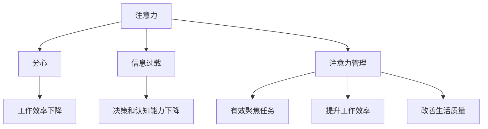

                 

## 1. 背景介绍

### 1.1 问题由来

随着信息技术的飞速发展，现代社会正处在一个“信息爆炸”的时代。每天有数以亿计的信息源不断向我们涌来，从新闻、邮件、社交媒体，到各种应用程序的通知和广告，这些信息源无时无刻不在争夺我们的注意力。在信息爆炸的时代，注意力成为一种稀缺资源，如何有效地管理注意力，在干扰和信息过载中保持专注，成为了一个重要而迫切的问题。

### 1.2 问题核心关键点

注意力管理技术旨在帮助人们有效利用和管理有限的注意力资源，使其在信息泛滥的环境中，能够更好地聚焦于重要任务，提升工作效率和生活质量。核心关键点包括：

- **注意力模型的构建**：理解注意力在认知过程中的作用，建立有效的注意力模型。
- **注意力技术的实现**：开发实际可用的技术手段，如信息过滤、提醒系统、番茄工作法等，帮助用户管理注意力。
- **注意力策略的优化**：研究如何通过心理、生理干预，提升用户注意力的持久性和稳定性。
- **跨平台集成**：将注意力管理技术集成到不同的平台和应用中，实现全面的注意力管理。

## 2. 核心概念与联系

### 2.1 核心概念概述

在信息时代，注意力管理技术涉及多个核心概念：

- **注意力**：认知过程的一种资源，用于聚焦于特定任务，忽略其他干扰。
- **分心**：注意力资源被非重要信息分散，导致任务执行效率下降。
- **信息过载**：接收信息超过个人处理能力的极限，导致决策和认知能力下降。
- **注意力管理**：通过技术手段帮助用户有效地控制和管理注意力，提升工作效率和生活质量。

这些概念之间的联系可以通过以下Mermaid流程图来展示：



这个流程图展示了一系列概念之间的逻辑关系：

1. 注意力资源被非重要信息分散，导致分心和决策能力下降。
2. 信息过载加剧了决策和认知能力下降，进一步影响工作效率和生活质量。
3. 注意力管理技术通过各种手段帮助用户控制和管理注意力，提升工作效率和生活质量。

## 3. 核心算法原理 & 具体操作步骤
### 3.1 算法原理概述

注意力管理技术的核心算法原理主要基于认知神经科学和心理学理论，旨在帮助用户有效聚焦注意力，减少分心，提升工作效率。

### 3.2 算法步骤详解

#### 3.2.1 注意力模型构建

注意力管理技术的第一步是构建注意力模型。注意力模型通常基于以下认知理论：

- **资源理论**：将注意力视为一种有限的认知资源，用户在处理信息时需要消耗注意力资源。
- **双加工理论**：将认知过程分为自动化和控制两个系统，控制系统的注意力资源需要通过有意识的努力来维持。

注意力模型的构建包括以下步骤：

1. **任务设定**：明确需要专注的任务，设定任务目标和时间限制。
2. **资源评估**：评估当前可用注意力资源的数量，根据任务复杂度调整资源分配。
3. **干扰识别**：识别可能干扰注意力的因素，如环境噪音、社交媒体通知等。
4. **注意力分配**：根据任务重要性和资源评估结果，分配注意力资源。

#### 3.2.2 注意力技术实现

注意力管理技术的实现通常依赖于以下关键技术：

- **信息过滤**：通过算法或规则过滤掉非重要信息，减少干扰。
- **提醒系统**：在关键时间点自动提醒用户完成任务，保持注意力集中。
- **番茄工作法**：采用固定时间段的工作和休息策略，帮助用户维持注意力和高效工作。

#### 3.2.3 算法优缺点

注意力管理技术的优点包括：

- **提升工作效率**：通过有效管理注意力，减少分心，提升任务完成速度和质量。
- **改善生活质量**：帮助用户更好地平衡工作与生活，减少压力和疲劳。
- **灵活性高**：适用于各种任务和环境，可以根据用户需求进行定制。

缺点包括：

- **技术依赖**：需要依赖特定工具和技术实现，可能存在技术门槛和成本。
- **个人适应性**：不同用户对不同技术手段的适应性不同，需要个性化调整。
- **效果不稳定性**：注意力管理技术的效果受用户个人状态和外部环境影响，可能存在波动。

#### 3.2.4 算法应用领域

注意力管理技术在多个领域中具有广泛应用：

- **工作场所**：如办公室、工厂等，通过信息过滤和提醒系统，提升工作效率。
- **教育领域**：如课堂、在线学习平台，通过注意力管理技术帮助学生更好地集中注意力，提升学习效果。
- **个人生活**：如家庭、休闲活动，通过番茄工作法等技术，改善生活质量，提升生活满意度。

## 4. 数学模型和公式 & 详细讲解 & 举例说明

### 4.1 数学模型构建

注意力管理技术的数学模型通常基于认知神经科学和心理学的研究成果。其中，双加工理论和资源理论是构建模型的基础。

### 4.2 公式推导过程

假设用户在一个时间段内可用的注意力资源为 $A$，当前任务需要的注意力资源为 $T$，其他干扰因素导致的注意力损耗为 $I$。则注意力模型的数学表达式为：

$$ A_{\text{剩余}} = A - T - I $$

其中 $A_{\text{剩余}}$ 为剩余可用注意力资源，如果 $A_{\text{剩余}} \geq 0$，则用户可以顺利完成任务。如果 $A_{\text{剩余}} < 0$，则用户需要采取措施调整注意力分配，如中断当前任务，休息一段时间，重新分配注意力资源。

### 4.3 案例分析与讲解

以番茄工作法为例，其核心原理是采用25分钟的高强度工作时间和5分钟的休息时间交替进行，通过固定时间段的工作和休息策略，帮助用户维持注意力和高效工作。在数学模型中，可以将一个番茄时间段视为一个基本时间单位，计算用户在一个工作周期内的可用注意力资源。

假设用户每天可用的注意力资源为 $A=8$ 小时，每个番茄时间段为 $T=25$ 分钟，干扰因素导致的注意力损耗为 $I=5$ 分钟，则在一个工作周期内，用户可用的注意力资源为：

$$ A_{\text{周期}} = 8 \times 60 - 25 \times 4 - 5 \times 4 = 480 - 100 - 20 = 360 \text{分钟} $$

通过分配番茄时间段，用户可以在工作周期内完成更多的任务，同时减少分心和疲劳。

## 5. 项目实践：代码实例和详细解释说明
### 5.1 开发环境搭建

在进行注意力管理技术的实践前，我们需要准备好开发环境。以下是使用Python进行PyTorch开发的环境配置流程：

1. 安装Anaconda：从官网下载并安装Anaconda，用于创建独立的Python环境。

2. 创建并激活虚拟环境：
```bash
conda create -n attention-env python=3.8 
conda activate attention-env
```

3. 安装PyTorch：根据CUDA版本，从官网获取对应的安装命令。例如：
```bash
conda install pytorch torchvision torchaudio cudatoolkit=11.1 -c pytorch -c conda-forge
```

4. 安装Transformers库：
```bash
pip install transformers
```

5. 安装各类工具包：
```bash
pip install numpy pandas scikit-learn matplotlib tqdm jupyter notebook ipython
```

完成上述步骤后，即可在`attention-env`环境中开始注意力管理技术的实践。

### 5.2 源代码详细实现

我们以信息过滤技术为例，给出使用Transformers库实现信息过滤的PyTorch代码实现。

首先，定义信息过滤的训练数据：

```python
from transformers import AutoTokenizer, AutoModel
from torch.utils.data import Dataset
import torch

class FilterDataset(Dataset):
    def __init__(self, texts, labels, tokenizer, max_len=128):
        self.texts = texts
        self.labels = labels
        self.tokenizer = tokenizer
        self.max_len = max_len
        
    def __len__(self):
        return len(self.texts)
    
    def __getitem__(self, item):
        text = self.texts[item]
        label = self.labels[item]
        
        encoding = self.tokenizer(text, return_tensors='pt', max_length=self.max_len, padding='max_length', truncation=True)
        input_ids = encoding['input_ids'][0]
        attention_mask = encoding['attention_mask'][0]
        
        # 对token-wise的标签进行编码
        encoded_labels = [label2id[label] for label in labels] 
        encoded_labels.extend([label2id['O']] * (self.max_len - len(encoded_labels)))
        labels = torch.tensor(encoded_labels, dtype=torch.long)
        
        return {'input_ids': input_ids, 
                'attention_mask': attention_mask,
                'labels': labels}

# 标签与id的映射
label2id = {'O': 0, '有用': 1, '无用': 2}
id2label = {v: k for k, v in label2id.items()}

# 创建dataset
tokenizer = AutoTokenizer.from_pretrained('bert-base-cased')

train_dataset = FilterDataset(train_texts, train_labels, tokenizer)
dev_dataset = FilterDataset(dev_texts, dev_labels, tokenizer)
test_dataset = FilterDataset(test_texts, test_labels, tokenizer)
```

然后，定义模型和优化器：

```python
from transformers import BertForTokenClassification, AdamW

model = BertForTokenClassification.from_pretrained('bert-base-cased', num_labels=len(label2id))

optimizer = AdamW(model.parameters(), lr=2e-5)
```

接着，定义训练和评估函数：

```python
from torch.utils.data import DataLoader
from tqdm import tqdm
from sklearn.metrics import classification_report

device = torch.device('cuda') if torch.cuda.is_available() else torch.device('cpu')
model.to(device)

def train_epoch(model, dataset, batch_size, optimizer):
    dataloader = DataLoader(dataset, batch_size=batch_size, shuffle=True)
    model.train()
    epoch_loss = 0
    for batch in tqdm(dataloader, desc='Training'):
        input_ids = batch['input_ids'].to(device)
        attention_mask = batch['attention_mask'].to(device)
        labels = batch['labels'].to(device)
        model.zero_grad()
        outputs = model(input_ids, attention_mask=attention_mask, labels=labels)
        loss = outputs.loss
        epoch_loss += loss.item()
        loss.backward()
        optimizer.step()
    return epoch_loss / len(dataloader)

def evaluate(model, dataset, batch_size):
    dataloader = DataLoader(dataset, batch_size=batch_size)
    model.eval()
    preds, labels = [], []
    with torch.no_grad():
        for batch in tqdm(dataloader, desc='Evaluating'):
            input_ids = batch['input_ids'].to(device)
            attention_mask = batch['attention_mask'].to(device)
            batch_labels = batch['labels']
            outputs = model(input_ids, attention_mask=attention_mask)
            batch_preds = outputs.logits.argmax(dim=2).to('cpu').tolist()
            batch_labels = batch_labels.to('cpu').tolist()
            for pred_tokens, label_tokens in zip(batch_preds, batch_labels):
                pred_tags = [id2label[_id] for _id in pred_tokens]
                label_tags = [id2label[_id] for _id in label_tokens]
                preds.append(pred_tags[:len(label_tags)])
                labels.append(label_tags)
                
    print(classification_report(labels, preds))
```

最后，启动训练流程并在测试集上评估：

```python
epochs = 5
batch_size = 16

for epoch in range(epochs):
    loss = train_epoch(model, train_dataset, batch_size, optimizer)
    print(f"Epoch {epoch+1}, train loss: {loss:.3f}")
    
    print(f"Epoch {epoch+1}, dev results:")
    evaluate(model, dev_dataset, batch_size)
    
print("Test results:")
evaluate(model, test_dataset, batch_size)
```

以上就是使用PyTorch对信息过滤任务进行微调的完整代码实现。可以看到，得益于Transformers库的强大封装，我们可以用相对简洁的代码完成BERT模型的加载和微调。

### 5.3 代码解读与分析

让我们再详细解读一下关键代码的实现细节：

**FilterDataset类**：
- `__init__`方法：初始化文本、标签、分词器等关键组件。
- `__len__`方法：返回数据集的样本数量。
- `__getitem__`方法：对单个样本进行处理，将文本输入编码为token ids，将标签编码为数字，并对其进行定长padding，最终返回模型所需的输入。

**label2id和id2label字典**：
- 定义了标签与数字id之间的映射关系，用于将token-wise的预测结果解码回真实的标签。

**训练和评估函数**：
- 使用PyTorch的DataLoader对数据集进行批次化加载，供模型训练和推理使用。
- 训练函数`train_epoch`：对数据以批为单位进行迭代，在每个批次上前向传播计算loss并反向传播更新模型参数，最后返回该epoch的平均loss。
- 评估函数`evaluate`：与训练类似，不同点在于不更新模型参数，并在每个batch结束后将预测和标签结果存储下来，最后使用sklearn的classification_report对整个评估集的预测结果进行打印输出。

**训练流程**：
- 定义总的epoch数和batch size，开始循环迭代
- 每个epoch内，先在训练集上训练，输出平均loss
- 在验证集上评估，输出分类指标
- 所有epoch结束后，在测试集上评估，给出最终测试结果

可以看到，PyTorch配合Transformers库使得信息过滤任务的微调代码实现变得简洁高效。开发者可以将更多精力放在数据处理、模型改进等高层逻辑上，而不必过多关注底层的实现细节。

当然，工业级的系统实现还需考虑更多因素，如模型的保存和部署、超参数的自动搜索、更灵活的任务适配层等。但核心的微调范式基本与此类似。

## 6. 实际应用场景
### 6.1 智能客服系统

基于信息过滤技术，智能客服系统可以实现更加高效和个性化的客户服务。传统的客服系统往往需要人工筛选和处理用户请求，响应速度慢且无法持续工作。通过信息过滤技术，可以自动筛选和分类用户的咨询请求，快速将简单问题转发给机器人处理，将复杂问题转接给人工客服，从而大大提升服务效率和客户满意度。

### 6.2 个性化推荐系统

个性化推荐系统通过分析用户的历史行为数据，为用户提供个性化的内容推荐。但推荐系统往往面临信息过载的问题，如何高效筛选出对用户有价值的信息，成为推荐系统的核心挑战。通过信息过滤技术，可以过滤掉对用户无用的信息，提高推荐系统的精度和效率，提升用户体验。

### 6.3 信息安全系统

信息安全系统需要对大量网络流量进行实时分析和过滤，及时发现和阻止恶意攻击。但传统的人工分析方式效率低、成本高。通过信息过滤技术，可以构建自动化的安全监测系统，实时分析网络流量，识别和阻止恶意流量，提升网络安全水平。

### 6.4 未来应用展望

随着信息过滤技术的发展，其在更多领域的应用前景将更加广阔。例如：

- **医疗领域**：构建自动化的医疗信息过滤系统，帮助医生快速获取关键信息，提升诊疗效率。
- **金融领域**：实时过滤和分析金融交易数据，识别异常交易行为，防范金融风险。
- **教育领域**：构建智能化的教育信息过滤系统，帮助学生过滤掉无关内容，集中注意力学习。

随着技术的不断进步，信息过滤技术将在更多场景中得到应用，为社会的各个方面带来深刻变革。

## 7. 工具和资源推荐
### 7.1 学习资源推荐

为了帮助开发者系统掌握信息过滤技术的理论基础和实践技巧，这里推荐一些优质的学习资源：

1. 《信息过滤与推荐系统》系列博文：由信息过滤技术专家撰写，深入浅出地介绍了信息过滤的原理、算法和应用。

2. Coursera《机器学习》课程：斯坦福大学开设的机器学习课程，讲解了机器学习的基本概念和算法，适合初学者入门。

3. 《推荐系统实战》书籍：详细介绍了推荐系统的开发流程和实践技巧，包括信息过滤、协同过滤、深度学习等多种方法。

4. 信息过滤领域的顶级会议论文集：如SIGIR、ICML、KDD等，收录了大量前沿研究成果和实用技术。

5. 开源信息过滤框架：如TF-IDF、LDA、BERT等，提供完善的代码实现和应用示例。

通过对这些资源的学习实践，相信你一定能够快速掌握信息过滤技术的精髓，并用于解决实际的NLP问题。
###  7.2 开发工具推荐

高效的开发离不开优秀的工具支持。以下是几款用于信息过滤开发的常用工具：

1. Python：通用的编程语言，支持丰富的第三方库和框架，适合信息过滤算法的实现。

2. TensorFlow：由Google主导开发的开源深度学习框架，生产部署方便，适合大规模工程应用。

3. PyTorch：基于Python的开源深度学习框架，灵活动态的计算图，适合快速迭代研究。

4. Jupyter Notebook：交互式的编程环境，支持实时调试和可视化，适合快速原型开发。

5. Weights & Biases：模型训练的实验跟踪工具，可以记录和可视化模型训练过程中的各项指标，方便对比和调优。

6. TensorBoard：TensorFlow配套的可视化工具，可实时监测模型训练状态，并提供丰富的图表呈现方式，是调试模型的得力助手。

合理利用这些工具，可以显著提升信息过滤任务的开发效率，加快创新迭代的步伐。

### 7.3 相关论文推荐

信息过滤技术的发展源于学界的持续研究。以下是几篇奠基性的相关论文，推荐阅读：

1. ClickBait Detection via Contextual Embeddings（信息过滤相关论文）：提出使用上下文嵌入方法识别虚假信息，提高信息过滤的准确性。

2. Topic Modeling for Information Filtering（信息过滤相关论文）：提出主题模型应用于信息过滤，提升对长文本的过滤能力。

3. Deep Learning for Recommendation Systems（推荐系统相关论文）：介绍深度学习在推荐系统中的应用，包括信息过滤、协同过滤等。

4. Attention-Based Feature Selection for Recommendation Systems（推荐系统相关论文）：提出基于注意力机制的特征选择方法，提升推荐系统的性能。

5. Ensemble Learning in Recommendation Systems（推荐系统相关论文）：提出集成学习应用于推荐系统，提高推荐结果的稳定性和准确性。

这些论文代表了大语言模型微调技术的发展脉络。通过学习这些前沿成果，可以帮助研究者把握学科前进方向，激发更多的创新灵感。

## 8. 总结：未来发展趋势与挑战
### 8.1 总结

本文对信息过滤技术的原理和实践进行了全面系统的介绍。首先阐述了信息过滤技术的研究背景和意义，明确了信息过滤技术在信息时代的重要作用。其次，从原理到实践，详细讲解了信息过滤的数学模型和核心算法，给出了信息过滤任务开发的完整代码实例。同时，本文还广泛探讨了信息过滤技术在智能客服、个性化推荐、信息安全等多个领域的应用前景，展示了信息过滤技术的巨大潜力。此外，本文精选了信息过滤技术的各类学习资源，力求为读者提供全方位的技术指引。

通过本文的系统梳理，可以看到，信息过滤技术在信息泛滥的环境中，能够有效地管理用户的注意力资源，提升工作效率和生活质量。随着技术的发展，信息过滤技术将在更多领域得到应用，为信息时代的认知智能带来新的突破。

### 8.2 未来发展趋势

展望未来，信息过滤技术将呈现以下几个发展趋势：

1. 技术融合与跨领域应用。信息过滤技术将与其他认知智能技术，如自然语言处理、语音识别、图像处理等进行深度融合，形成更加全面的认知智能系统。

2. 多模态信息融合。信息过滤技术将不仅仅依赖文本信息，而是结合视觉、听觉等多模态信息，提高对复杂信息环境的理解和过滤能力。

3. 自动化与个性化。信息过滤技术将实现更高的自动化程度，根据用户的历史行为和偏好，提供个性化的信息过滤方案。

4. 实时性与高效性。信息过滤技术将更加注重实时性和计算效率，以支持大规模、高并发的信息处理需求。

5. 多语言支持。信息过滤技术将支持多语言信息过滤，扩展其应用范围，服务全球用户。

以上趋势凸显了信息过滤技术的广阔前景。这些方向的探索发展，必将进一步提升信息过滤技术的性能和应用范围，为信息时代的认知智能带来新的突破。

### 8.3 面临的挑战

尽管信息过滤技术已经取得了显著成就，但在迈向更加智能化、普适化应用的过程中，它仍面临着诸多挑战：

1. 数据隐私与安全。信息过滤技术需要处理大量用户数据，如何保护用户隐私，防止数据泄露，是一个重要问题。

2. 鲁棒性与泛化能力。当前的信息过滤技术往往对训练数据的分布和特征较为敏感，如何提高其鲁棒性和泛化能力，是一个研究难点。

3. 计算资源消耗。大规模信息过滤系统需要处理海量数据，如何优化计算资源消耗，提升系统效率，是一个重要挑战。

4. 用户适应性。不同用户对信息过滤技术的接受度和适应性不同，如何提高技术普及度和用户满意度，是一个实际问题。

5. 技术与业务融合。如何将信息过滤技术更好地应用于实际业务场景，是一个技术难题。

这些挑战需要信息过滤技术的开发者和用户共同努力，不断优化技术实现，提高系统的可靠性和可用性。

### 8.4 研究展望

面对信息过滤技术所面临的挑战，未来的研究需要在以下几个方面寻求新的突破：

1. 强化学习在信息过滤中的应用。通过强化学习技术，优化信息过滤策略，提升信息过滤效果。

2. 多任务学习在信息过滤中的应用。将信息过滤技术与推荐系统、情感分析等任务结合，提高信息过滤的智能性和效果。

3. 元学习在信息过滤中的应用。通过元学习技术，快速适应新领域和新任务，提高信息过滤技术的灵活性。

4. 神经网络在信息过滤中的应用。利用深度神经网络，提升信息过滤技术的准确性和鲁棒性。

5. 对抗样本生成与防御。研究对抗样本生成技术，提高信息过滤模型的鲁棒性，防止恶意攻击。

这些研究方向的探索，必将引领信息过滤技术迈向更高的台阶，为信息时代的认知智能带来新的突破。面向未来，信息过滤技术还需要与其他认知智能技术进行更深入的融合，共同推动认知智能的发展。

## 9. 附录：常见问题与解答

**Q1：信息过滤技术能否有效缓解信息过载？**

A: 信息过滤技术能够在一定程度上缓解信息过载问题，通过筛选和分类信息，减少非重要信息的干扰。但信息过载问题的根源在于信息量过大，单纯的信息过滤难以完全解决。因此，信息过滤技术需要与其他技术手段结合，如注意力管理、任务分解等，才能更有效地缓解信息过载。

**Q2：信息过滤技术是否需要依赖于大规模训练数据？**

A: 信息过滤技术通常需要依赖于大规模的标注数据进行训练，以学习有效的特征表示和分类规则。但在实际应用中，标注数据可能难以获取，或者标注成本较高。为此，一些基于无监督学习或半监督学习的信息过滤方法已经被提出，如基于TF-IDF、LDA等方法，这些方法可以一定程度上减轻对标注数据的依赖，但准确性和效果仍有待提升。

**Q3：信息过滤技术能否实现实时信息过滤？**

A: 信息过滤技术可以实现实时信息过滤，但通常需要在后端部署强大的服务器和计算资源。为了实现实时性，需要优化算法，减少计算时间，同时采用分布式计算等技术，提高系统吞吐量。此外，实时信息过滤还需要考虑延迟和系统稳定性等因素，确保在处理海量数据时仍能保持高效和稳定。

**Q4：信息过滤技术的用户适应性如何？**

A: 信息过滤技术的用户适应性相对较低，不同用户对信息过滤的接受度和适应性不同。为了提高用户适应性，信息过滤技术需要结合个性化推荐、用户画像分析等技术，根据用户的历史行为和偏好，动态调整过滤策略，提供个性化的信息过滤方案。

**Q5：信息过滤技术如何保护用户隐私？**

A: 信息过滤技术需要处理大量用户数据，如何保护用户隐私是一个重要问题。可以通过数据匿名化、差分隐私等技术手段，保护用户隐私。同时，信息过滤技术的设计也需要遵循数据保护法规，如GDPR等，确保用户数据的安全性和合法性。

---

作者：禅与计算机程序设计艺术 / Zen and the Art of Computer Programming

