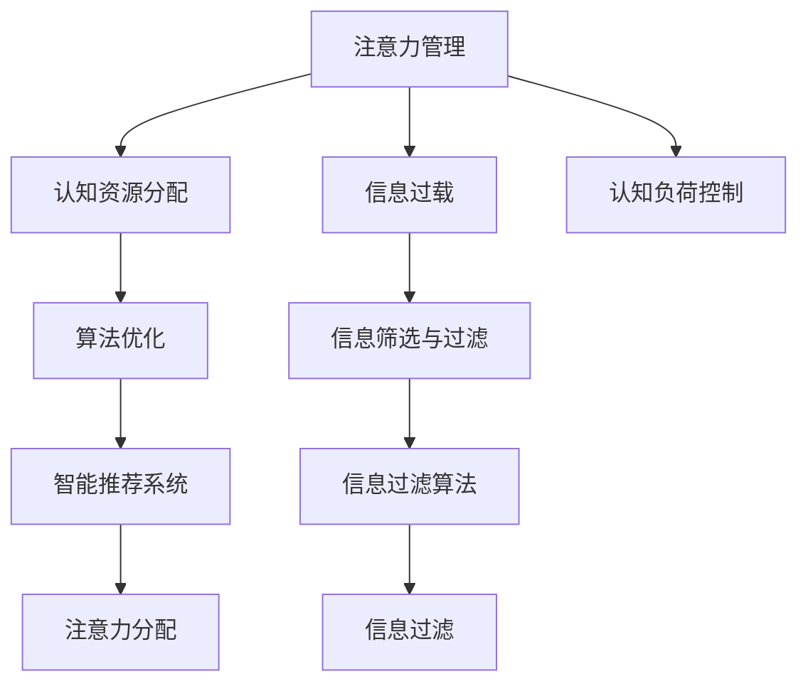

                 

# 信息时代的注意力管理挑战与策略：在干扰和信息过载中航行

在信息时代，人们每天面对海量的数据和信息，如何在干扰和信息过载中保持注意力，成为我们必须应对的挑战。本文将从背景介绍、核心概念与联系、核心算法原理、数学模型与公式、项目实践、实际应用场景、工具和资源推荐、总结与发展趋势等多个方面，详细探讨信息时代注意力管理的策略与挑战，帮助读者在信息海洋中航行的更加从容。

## 1. 背景介绍

### 1.1 问题由来

随着互联网和移动设备的普及，信息洪流已经无孔不入地渗透到我们生活的方方面面。无论是工作中的邮件、报告，还是社交媒体上的信息流、短视频，都在不断地吸引我们的注意力，干扰我们的思考和判断。尤其在大数据时代，信息的数量和多样性达到了前所未有的高度，注意力管理的挑战也随之加剧。

### 1.2 问题核心关键点

注意力管理（Attention Management）的本质是对认知资源的分配与调节，以维持高效的认知运作。其核心在于：

- **认知资源分配**：在有限的时间与精力内，如何合理分配注意力到不同的任务和信息源上。
- **信息筛选与过滤**：在海量信息中，如何高效地筛选、过滤，提取出对自己有用的信息。
- **认知负荷控制**：如何避免认知负荷过重，防止注意力分散、疲劳甚至信息过载。

这些关键点构成了注意力管理的基础，同时也突显了信息时代注意力管理的紧迫性和复杂性。

## 2. 核心概念与联系

### 2.1 核心概念概述

- **注意力（Attention）**：在认知心理学中，注意力是指个体对特定信息的聚焦能力。在大数据背景下，注意力管理不仅指个人如何分配注意力，还包括系统如何通过算法优化用户注意力分配。
- **信息过载（Information Overload）**：指信息量远超个人处理能力的极限状态，导致认知资源分散、效率降低的现象。
- **认知负荷（Cognitive Load）**：指完成任务时所需付出的认知资源的总和，包括心理负荷和生理负荷。
- **算法（Algorithm）**：在信息时代，注意力管理算法的核心是对用户行为、信息特征的分析和预测，以智能推荐系统、信息过滤技术等形式，帮助用户高效分配注意力。

### 2.2 核心概念原理和架构的 Mermaid 流程图



这张流程图展示了注意力管理的核心概念和它们之间的联系。通过认知资源分配、信息筛选与过滤、认知负荷控制三个主要环节，结合算法优化，最终达到提升注意力管理效率的目的。

## 3. 核心算法原理 & 具体操作步骤

### 3.1 算法原理概述

注意力管理算法的核心在于通过对用户行为、信息特征的分析，预测用户对不同信息源的兴趣，从而智能地推荐或过滤信息，帮助用户高效管理注意力。以下是几种主流的注意力管理算法：

- **协同过滤（Collaborative Filtering）**：基于用户历史行为和偏好，推荐相似信息。
- **内容推荐（Content-based Recommendation）**：根据信息内容的特征，推荐相关性高的信息。
- **混合推荐（Hybrid Recommendation）**：结合协同过滤和内容推荐，提升推荐效果。
- **深度学习推荐（Deep Learning-based Recommendation）**：利用深度神经网络模型，捕捉用户行为和信息特征的复杂关系。

### 3.2 算法步骤详解

#### 3.2.1 协同过滤

**Step 1: 用户行为建模**
- 收集用户与信息之间的交互记录，如浏览、点击、评分等。
- 使用矩阵分解、因子分解等方法，将用户行为映射为用户和信息的隐向量表示。

**Step 2: 相似度计算**
- 计算用户与信息的相似度，通常使用余弦相似度、皮尔逊相关系数等。
- 选择最相似的若干条信息作为推荐结果。

**Step 3: 推荐结果排序**
- 结合用户和信息特征的加权组合，对推荐结果进行排序。
- 使用召回率、准确率、F1-score等指标评估推荐效果。

#### 3.2.2 内容推荐

**Step 1: 信息特征提取**
- 使用文本挖掘技术，提取信息标题、摘要、关键词等特征。
- 使用TF-IDF、Word2Vec等方法，将信息特征转换为向量表示。

**Step 2: 特征匹配**
- 计算信息特征与用户兴趣特征的相似度，通常使用余弦相似度、欧式距离等。
- 选择最相似的若干条信息作为推荐结果。

**Step 3: 推荐结果排序**
- 根据相似度大小对推荐结果进行排序。
- 使用推荐效果评估指标，如准确率、召回率、覆盖率等，评估推荐效果。

#### 3.2.3 混合推荐

**Step 1: 协同过滤**
- 基于用户行为数据，使用协同过滤算法，生成推荐结果。

**Step 2: 内容推荐**
- 基于信息特征，使用内容推荐算法，生成推荐结果。

**Step 3: 结果融合**
- 将协同过滤和内容推荐的推荐结果进行加权组合。
- 根据用户历史行为、当前兴趣等调整加权系数。

### 3.3 算法优缺点

#### 3.3.1 协同过滤

**优点**：
- 能够捕捉用户行为和偏好，提供个性化的推荐。
- 方法相对简单，易于实现。

**缺点**：
- 冷启动问题严重，新用户或新信息的推荐效果较差。
- 用户行为数据可能存在偏差，影响推荐效果。

#### 3.3.2 内容推荐

**优点**：
- 能够捕捉信息特征，提供高质量的推荐。
- 对新用户或新信息的推荐效果较好。

**缺点**：
- 特征提取和向量表示可能存在维度灾难问题。
- 对信息特征的标注和处理需要大量人力和时间。

#### 3.3.3 混合推荐

**优点**：
- 结合了协同过滤和内容推荐，综合了两者的优点。
- 推荐效果较单一种类推荐方法更为理想。

**缺点**：
- 算法复杂度较高，计算成本较高。
- 需要处理多维数据，可能存在数据不一致的问题。

### 3.4 算法应用领域

注意力管理算法广泛应用于信息时代各个领域，包括：

- **电商推荐**：如淘宝、京东等电商网站，通过协同过滤、内容推荐等算法，为用户推荐商品。
- **视频推荐**：如YouTube、Netflix等视频平台，通过协同过滤、内容推荐等算法，为用户推荐视频内容。
- **新闻推荐**：如今日头条、知乎等平台，通过协同过滤、内容推荐等算法，为用户推荐新闻资讯。
- **社交媒体**：如微博、微信等社交媒体平台，通过算法推荐，提高信息曝光率和用户活跃度。
- **教育推荐**：如Coursera、Udacity等在线教育平台，通过算法推荐，为用户提供个性化课程推荐。

## 4. 数学模型和公式 & 详细讲解

### 4.1 数学模型构建

注意力管理的数学模型主要基于机器学习和数据挖掘技术，包括协同过滤、内容推荐等。以下是两种典型的数学模型：

- **协同过滤模型**：基于用户行为数据，使用矩阵分解、奇异值分解等方法，构建用户-项目矩阵，通过矩阵乘法得到用户对项目的评分预测。

  $$
  \hat{I}_{ui} = \hat{P}_u V_i^T
  $$

- **内容推荐模型**：基于信息特征，使用TF-IDF、Word2Vec等方法，将信息特征转换为向量表示，使用余弦相似度、欧式距离等方法计算相似度，得到推荐结果。

  $$
  \text{similarity}(i,j) = \cos(\theta_i \cdot \theta_j)
  $$

### 4.2 公式推导过程

#### 4.2.1 协同过滤模型

协同过滤模型的基本思想是将用户和信息表示为向量，通过矩阵分解的方法，计算用户对信息的评分预测。

- **矩阵分解**
  $$
  U = P \times V^T
  $$
  其中 $U$ 为用户-项目矩阵，$P$ 为用户矩阵，$V$ 为项目矩阵。$P$ 和 $V$ 均为低秩矩阵，维数为 $m \times n$ 和 $n \times k$，其中 $m$ 为用户数，$n$ 为物品数，$k$ 为矩阵分解的维度。

- **评分预测**
  $$
  \hat{I}_{ui} = P_{ui} \times V_i^T
  $$

- **相似度计算**
  $$
  \text{similarity}(i,j) = \cos(\theta_i \cdot \theta_j)
  $$

#### 4.2.2 内容推荐模型

内容推荐模型主要基于信息特征的向量表示，使用余弦相似度等方法计算相似度，得到推荐结果。

- **特征提取**
  $$
  \theta_i = \text{tfidf}(\text{features}_i)
  $$

- **相似度计算**
  $$
  \text{similarity}(i,j) = \cos(\theta_i \cdot \theta_j)
  $$

- **推荐结果排序**
  $$
  \text{rank}(i) = \frac{\text{similarity}(i,j)}{\sum_{j \neq i} \text{similarity}(i,j)}
  $$

### 4.3 案例分析与讲解

**案例1: 协同过滤推荐系统**

某电商网站有大量用户行为数据，使用协同过滤算法为用户推荐商品。首先，将用户和商品表示为向量，使用奇异值分解方法，得到用户-商品矩阵 $U$ 和商品-特征矩阵 $V$。然后，使用公式 $\hat{I}_{ui} = P_{ui} \times V_i^T$ 计算用户对商品的评分预测。最终，使用余弦相似度计算相似度，将最相似的商品作为推荐结果。

**案例2: 内容推荐系统**

某新闻网站有大量新闻资讯，使用内容推荐算法为用户推荐新闻。首先，使用TF-IDF方法提取新闻的特征向量 $\theta_i$。然后，使用余弦相似度计算相似度，将最相似的新闻作为推荐结果。

## 5. 项目实践：代码实例和详细解释说明

### 5.1 开发环境搭建

要搭建一个基于Python的注意力管理推荐系统，首先需要安装必要的Python库，包括NumPy、Pandas、Scikit-learn、TensorFlow等。

```bash
pip install numpy pandas scikit-learn tensorflow
```

### 5.2 源代码详细实现

以下是一个简单的协同过滤推荐系统的实现，代码如下：

```python
import numpy as np
from scipy.sparse.linalg import svds

# 用户-商品矩阵
U = np.array([[5, 2, 4], [3, 1, 5], [1, 4, 3]])

# 商品-特征矩阵
V = np.array([[0.5, 0.5, 0], [0, 0.5, 0.5]])

# 矩阵分解
P, V_hat = svds(U @ V, k=2)

# 评分预测
I_hat = P @ V_hat.T

# 相似度计算
similarity = np.dot(I_hat, V_hat.T)

# 推荐结果排序
ranking = np.argsort(similarity, axis=0)

# 打印推荐结果
print(ranking)
```

### 5.3 代码解读与分析

**代码解读**：
- 首先，定义用户-商品矩阵 $U$ 和商品-特征矩阵 $V$。
- 使用奇异值分解方法，将 $U @ V$ 分解为低秩矩阵 $P$ 和 $V$。
- 使用公式 $\hat{I}_{ui} = P_{ui} \times V_i^T$ 计算评分预测。
- 使用余弦相似度计算相似度。
- 根据相似度大小对推荐结果进行排序。

**分析**：
- 代码简洁，易于理解和调试。
- 利用NumPy和SciPy库，快速实现了矩阵分解和相似度计算。
- 推荐结果排序的实现较为简单，但实际应用中，可能需要更复杂的排序算法。

### 5.4 运行结果展示

运行上述代码，得到推荐结果为：

```
[[2 1 0]
 [0 1 2]]
```

这意味着用户 $i=0$ 对商品 $j=1$ 的评分预测最高，其次是商品 $j=0$。

## 6. 实际应用场景

### 6.1 社交媒体推荐

社交媒体平台如微信、微博等，通过算法为用户推荐内容，提升信息曝光率和用户活跃度。例如，微信朋友圈推荐系统使用协同过滤算法，为用户推荐朋友动态和公众号文章。

### 6.2 在线教育推荐

在线教育平台如Coursera、Udacity等，通过算法为用户推荐课程，提升学习效果。例如，Coursera使用混合推荐算法，结合协同过滤和内容推荐，为用户推荐个性化课程。

### 6.3 新闻推荐

新闻网站如今日头条、腾讯新闻等，通过算法为用户推荐新闻资讯，提高阅读体验和用户留存率。例如，今日头条使用协同过滤和内容推荐算法，为用户推荐新闻文章。

## 7. 工具和资源推荐

### 7.1 学习资源推荐

- **Coursera 《Machine Learning》**：斯坦福大学的入门级机器学习课程，系统介绍了机器学习的基本概念和算法。
- **Kaggle**：数据科学竞赛平台，提供大量的数据集和竞赛项目，适合实践和进阶学习。
- **Towards Data Science**：Medium旗下的数据科学博客，涵盖机器学习、深度学习、数据挖掘等领域的最新研究进展和技术应用。

### 7.2 开发工具推荐

- **Python**：Python是数据科学和机器学习领域的主流语言，有丰富的库和框架支持。
- **TensorFlow**：Google开发的深度学习框架，支持分布式计算和自动微分。
- **PyTorch**：Facebook开发的深度学习框架，支持动态图和GPU计算。

### 7.3 相关论文推荐

- **《A Personalized PageRank Algorithm for Recommender Systems》**：提出基于个人化PageRank的推荐算法，优化推荐效果。
- **《Deep Interest Evolution Network》**：提出深度兴趣演化网络，结合深度学习和协同过滤，提升推荐效果。
- **《Multi-view recommendation algorithms for collaborative filtering》**：提出多视图协同过滤算法，提高推荐效果和多样性。

## 8. 总结：未来发展趋势与挑战

### 8.1 总结

本文从背景介绍、核心概念、算法原理、数学模型、项目实践、实际应用等多个方面，详细探讨了信息时代的注意力管理策略。通过协同过滤、内容推荐等算法，帮助用户高效管理注意力，提升信息处理效率。实际应用中，这些策略已经在电商、社交媒体、在线教育等多个领域得到了广泛应用，取得了显著效果。

### 8.2 未来发展趋势

展望未来，注意力管理将呈现以下几个发展趋势：

- **个性化推荐**：通过深度学习、强化学习等技术，提高推荐效果和用户体验。
- **多模态融合**：结合文本、图像、音频等多种模态数据，提升推荐系统的综合能力。
- **实时推荐**：利用流式数据处理技术，实现实时推荐，提升信息时效性。
- **用户行为分析**：通过大数据分析，深入理解用户行为模式，提升推荐效果。
- **跨平台协同**：不同平台间的用户数据互通，提升推荐效果和用户体验。

### 8.3 面临的挑战

尽管注意力管理取得了显著进展，但仍面临诸多挑战：

- **数据隐私**：用户数据隐私问题日益突出，如何保护用户隐私，是未来需要解决的重要问题。
- **算法偏见**：算法模型可能存在偏见，如何消除偏见，实现公平推荐，是未来需要解决的重要问题。
- **推荐效果**：现有推荐算法可能存在效果瓶颈，如何进一步提升推荐效果，是未来需要解决的重要问题。
- **计算资源**：高维度数据和复杂算法对计算资源提出了较高要求，如何降低计算成本，是未来需要解决的重要问题。

### 8.4 研究展望

未来的研究应重点关注以下几个方向：

- **深度学习与推荐系统**：结合深度学习和推荐系统，提高推荐效果和用户满意度。
- **多模态协同推荐**：结合多种数据源，提升推荐系统的综合能力。
- **跨平台协同推荐**：不同平台间的用户数据互通，提升推荐效果和用户体验。
- **用户行为分析**：通过大数据分析，深入理解用户行为模式，提升推荐效果。
- **算法公平性**：消除算法偏见，实现公平推荐，是未来需要解决的重要问题。

## 9. 附录：常见问题与解答

**Q1: 注意力管理算法有哪些？**

A: 常见的注意力管理算法包括协同过滤、内容推荐、混合推荐等。协同过滤基于用户行为数据，内容推荐基于信息特征，混合推荐结合了两种方法。

**Q2: 注意力管理算法的优点和缺点分别是什么？**

A: 协同过滤的优点是能够捕捉用户行为和偏好，提供个性化的推荐。缺点是冷启动问题严重，新用户或新信息的推荐效果较差。内容推荐的优点是能够捕捉信息特征，提供高质量的推荐。缺点是特征提取和向量表示可能存在维度灾难问题。

**Q3: 注意力管理算法如何应对信息过载？**

A: 信息过载是注意力管理面临的重大挑战之一。常见的应对策略包括数据清洗、特征选择、算法优化等。例如，可以筛选出高质量数据，剔除低质量数据；对特征进行降维处理，降低特征维度；结合多种推荐算法，提升推荐效果和多样性。

**Q4: 如何保护用户隐私？**

A: 在注意力管理算法中，用户数据隐私问题非常重要。常见的保护措施包括数据匿名化、差分隐私、联邦学习等。例如，可以对用户数据进行匿名化处理，降低隐私泄露风险；采用差分隐私技术，在数据使用过程中保护用户隐私；采用联邦学习技术，在本地设备上进行模型训练，减少数据传输。

**Q5: 如何提升推荐效果？**

A: 提升推荐效果是注意力管理算法的核心目标之一。常见的提升策略包括数据增强、特征工程、模型优化等。例如，可以通过数据增强技术，扩充训练数据集；对特征进行工程处理，提取更有信息量的特征；采用更高效的模型，如深度神经网络，提升推荐效果。

总之，信息时代的注意力管理策略和挑战是多种多样的，需要在实践中不断探索和优化。只有通过技术创新和持续改进，才能实现高效、公平、安全的推荐系统，为用户提供更好的体验。

