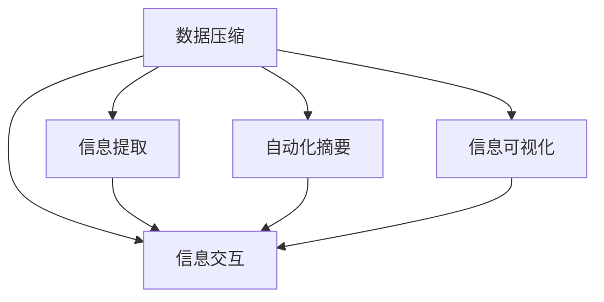

                 

## 1. 背景介绍

### 1.1 问题由来
在当今信息化时代，信息量的爆炸式增长和复杂性的不断增加，使得人们面对的信息环境和决策任务愈加复杂。如何在海量信息中快速获取关键点，简化信息，提高工作效率和生产力，已成为各行业普遍关注的议题。这一需求催生了信息简化的理论和实践方法，旨在通过优化信息结构、减少冗余信息、提升信息可理解性，实现信息处理的自动化和智能化。

### 1.2 问题核心关键点
信息简化通常涉及到数据压缩、信息提取、自动化摘要、信息可视化和信息交互等多个方面。其核心关键点包括：

- **数据压缩**：通过算法减少数据量，便于存储和传输。
- **信息提取**：自动从文本、图像、声音等多种数据源中提取关键信息。
- **自动化摘要**：将长文本转换为精炼的摘要，便于快速阅读。
- **信息可视化**：利用图表、图像等直观形式呈现信息，便于理解。
- **信息交互**：设计易于理解的信息界面，促进用户与信息系统的交互。

### 1.3 问题研究意义
信息简化技术在提升信息处理效率、促进信息共享、支持决策支持系统、增强用户体验等方面具有重要意义：

- **提升处理效率**：通过自动化和智能化方法，减少人工处理成本，加快信息处理速度。
- **促进信息共享**：简化信息结构，便于信息传递和共享，提高团队协作效率。
- **支持决策支持**：通过信息提取、分析和可视化，辅助决策者快速获得关键洞见，优化决策过程。
- **增强用户体验**：简化信息界面和交互方式，提升用户体验，促进信息技术的普及应用。

## 2. 核心概念与联系

### 2.1 核心概念概述

为更好地理解信息简化的技术和方法，本节将介绍几个密切相关的核心概念：

- **数据压缩**：通过算法减少数据量，便于存储和传输。常见算法包括Huffman编码、Lempel-Ziv-Welch算法、哈夫曼树、字典编码等。
- **信息提取**：自动从文本、图像、声音等多种数据源中提取关键信息。常见技术包括命名实体识别、主题模型、情感分析、图像处理等。
- **自动化摘要**：将长文本转换为精炼的摘要，便于快速阅读。常见方法包括基于统计的关键词抽取、基于句子的摘要生成、基于神经网络的摘要生成等。
- **信息可视化**：利用图表、图像等直观形式呈现信息，便于理解。常见工具包括Tableau、PowerBI、D3.js等。
- **信息交互**：设计易于理解的信息界面，促进用户与信息系统的交互。常见界面设计原则包括一致性、可用性、可理解性、可访问性等。

这些核心概念之间的逻辑关系可以通过以下Mermaid流程图来展示：



这个流程图展示信息简化技术的关键组件及其之间的关系：

1. 数据压缩技术作为信息简化的基础，通过减少数据量，方便后续处理。
2. 信息提取技术从原始数据中提取出有价值的信息，为后续处理提供数据支持。
3. 自动化摘要技术将长文本压缩为简明扼要的摘要，便于快速浏览。
4. 信息可视化技术通过图表、图像等形式，使复杂数据变得直观易懂。
5. 信息交互技术设计用户友好的界面，提升信息系统的易用性。

这些技术共同构成了信息简化的完整流程，帮助用户快速获取关键信息，提高工作效率。

## 3. 核心算法原理 & 具体操作步骤
### 3.1 算法原理概述

信息简化的核心原理是通过算法和技术手段，将复杂、冗余的信息转化为精炼、易懂的结构，便于用户快速获取和使用。常见的信息简化方法包括数据压缩、信息提取、自动化摘要和信息可视化等。这些方法均基于信息论和数据处理的基本原理，通过编码、模型训练、特征提取等技术手段，实现信息的简化和高效处理。

### 3.2 算法步骤详解

信息简化的操作步骤通常包括以下几个关键步骤：

**Step 1: 数据预处理**
- 对原始数据进行格式转换、去噪、分割等预处理操作，便于后续处理。
- 去除无关数据，减少数据量，提高处理效率。

**Step 2: 数据压缩**
- 选择适当的压缩算法，如Huffman编码、LZW算法等，对数据进行压缩。
- 通过压缩算法优化数据结构，减少存储和传输成本。

**Step 3: 信息提取**
- 使用自然语言处理（NLP）、计算机视觉（CV）、语音识别（ASR）等技术，从原始数据中提取关键信息。
- 对于文本数据，可以通过分词、词性标注、命名实体识别等技术提取关键实体和主题。
- 对于图像数据，可以通过特征提取、图像分割等技术识别关键对象和特征。

**Step 4: 自动化摘要**
- 根据提取的关键信息，使用关键词抽取、句子排序、段落压缩等技术生成摘要。
- 对于长文本，可以设计机器学习模型，如LSTM、BERT等，自动学习并生成摘要。
- 对于短文本，可以使用基于统计的方法，如TF-IDF、PageRank等，生成简洁的摘要。

**Step 5: 信息可视化**
- 根据提取的关键信息，设计图表、图像等形式进行可视化呈现。
- 使用Tableau、PowerBI等可视化工具，将数据转换为直观易懂的图表形式。
- 通过数据交互技术，如数据驱动仪表板、动态图表等，增强用户对信息的理解和操作。

**Step 6: 信息交互设计**
- 设计符合用户习惯的信息界面，便于用户快速获取信息。
- 优化信息系统的交互流程，如搜索、过滤、排序等，提高用户体验。
- 使用响应式设计、用户体验（UX）设计等原则，提升信息系统的易用性和可访问性。

### 3.3 算法优缺点

信息简化技术在提高信息处理效率、增强信息可视化、提升用户体验等方面具有显著优势：

优点：
1. **效率提升**：通过数据压缩和自动化摘要，减少数据量和处理时间，提升信息处理效率。
2. **信息可视化**：通过图表、图像等形式，使复杂信息变得直观易懂，便于理解和使用。
3. **用户体验优化**：设计用户友好的界面和交互方式，提升用户使用信息系统的便捷性和满意度。
4. **成本降低**：通过压缩和简化数据，减少存储空间和传输成本，降低信息系统的运营成本。

缺点：
1. **算法复杂**：信息简化技术涉及复杂的算法和模型训练，对技术要求较高。
2. **质量保证**：信息提取和摘要生成的准确性和完整性，需要依赖算法的质量和数据质量。
3. **依赖数据**：信息简化的效果依赖于原始数据的完整性和多样性，数据不足或质量差会影响简化效果。
4. **技术壁垒**：高级算法和工具的使用需要较高的技术门槛，对开发人员要求较高。

### 3.4 算法应用领域

信息简化技术在多个领域得到了广泛应用，涵盖了从工业制造到公共服务的各个方面：

1. **医疗健康**：通过自动化摘要和信息可视化，帮助医生快速获取患者病历和诊断信息，辅助决策。
2. **金融行业**：使用数据压缩和自动化摘要技术，减少数据存储和传输成本，提升信息处理效率。
3. **教育培训**：设计易于理解的学习界面和交互方式，简化学习过程，提升学习效果。
4. **智能家居**：通过信息可视化技术，实时监控家庭设备和环境状态，提供直观的用户界面。
5. **智慧城市**：利用数据压缩和信息提取技术，优化城市管理流程，提升公共服务效率。

以上信息简化技术的应用领域展示其在不同行业中的广泛影响力和实际价值。

## 4. 数学模型和公式 & 详细讲解  
### 4.1 数学模型构建

信息简化的数学模型构建涉及多个方面，包括数据压缩、信息提取、自动化摘要和信息可视化等。本节将通过数学模型和公式，详细讲解这些核心技术的构建方法。

### 4.2 公式推导过程

#### 4.2.1 数据压缩模型
数据压缩的核心目标是通过算法减少数据量。常用的压缩算法包括Huffman编码和Lempel-Ziv-Welch算法。

**Huffman编码算法**：通过构建哈夫曼树，将字符映射为二进制编码，实现数据压缩。哈夫曼树的构建过程如下：
- 初始化字符频率集合，统计每个字符出现的次数。
- 构建哈夫曼树，将频率最小的两个字符合并，生成新的节点。
- 重复上述过程，直到所有字符都合并为一个节点，形成哈夫曼树。
- 将字符映射为二进制编码，每个字符对应的编码由哈夫曼树生成。

**Lempel-Ziv-Welch算法**：使用字典编码方法，将数据流中出现的子串映射为较短的编码。算法流程如下：
- 初始化字典，将第一个字符加入字典。
- 遍历数据流，每次查找字典中是否存在当前子串。
- 若存在，则使用字典中的编码替换当前子串。
- 若不存在，则将当前子串加入字典，并为其分配新的编码。

#### 4.2.2 信息提取模型
信息提取通常使用自然语言处理技术，包括分词、词性标注、命名实体识别等。

**基于TF-IDF的信息提取**：通过计算每个词的词频（TF）和逆文档频率（IDF），评估词的重要性。
- TF: 计算每个词在文档中的出现频率。
- IDF: 计算每个词在所有文档中的出现频率的倒数。
- 通过TF-IDF权重，提取关键实体和主题。

**基于LSTM的信息提取**：使用长短期记忆网络（LSTM）模型，自动学习文本中的关键信息。
- LSTM模型包含输入层、记忆层和输出层。
- 输入层接收文本数据，记忆层提取文本中的上下文信息，输出层生成文本摘要。

#### 4.2.3 自动化摘要模型
自动化摘要的目标是将长文本压缩为精炼的摘要。常用的方法包括基于统计的摘要生成和基于神经网络的摘要生成。

**基于统计的摘要生成**：使用TF-IDF权重，选择高权重词生成摘要。
- 计算每个词的TF-IDF权重。
- 选择权重最高的词，组成摘要句子。
- 生成多句话，合并形成摘要。

**基于神经网络的摘要生成**：使用Transformer等模型，自动学习生成摘要。
- Transformer模型包含编码器和解码器。
- 编码器将文本转换为语义表示，解码器生成摘要。
- 使用自监督学习，模型自动学习摘要生成规则。

#### 4.2.4 信息可视化模型
信息可视化通常使用图表、图像等形式，将数据转换为直观易懂的格式。

**饼图和柱状图**：用于展示数据的分布情况。
- 饼图：将数据分为多个部分，通过扇形角度表示各部分的比例。
- 柱状图：将数据分为多个柱子，通过柱子的高度表示各部分的数值。

**散点图和气泡图**：用于展示数据的关联关系。
- 散点图：通过点的位置和大小表示数据的不同维度。
- 气泡图：在散点图的基础上，增加颜色和大小变化，表示数据的第三维度。

**热力图和地图**：用于展示数据的地理分布情况。
- 热力图：通过颜色深浅表示数据的密度。
- 地图：通过标记和颜色表示数据在地理位置上的分布。

### 4.3 案例分析与讲解

#### 4.3.1 文本数据压缩
以压缩新闻文章为例，可以使用LZW算法实现高效的数据压缩。
- 初始化字典，将第一个字符加入字典。
- 遍历新闻文章，查找字典中是否存在当前子串。
- 若存在，则使用字典中的编码替换当前子串。
- 若不存在，则将当前子串加入字典，并为其分配新的编码。

#### 4.3.2 文本信息提取
以提取新闻文章中的关键实体和主题为例，可以使用BERT模型实现自动化的信息提取。
- 使用BERT模型对新闻文章进行编码，得到语义表示。
- 通过注意力机制，提取重要词语和短语。
- 对提取的词语和短语进行分词、词性标注和命名实体识别，形成关键实体和主题。

#### 4.3.3 文本自动化摘要
以自动生成新闻文章的摘要为例，可以使用基于LSTM的摘要生成模型。
- 将新闻文章输入LSTM模型，自动学习生成摘要。
- 通过TF-IDF权重，选择高权重词生成摘要句子。
- 生成多句话，合并形成摘要。

#### 4.3.4 文本信息可视化
以展示新闻文章中的情感倾向为例，可以使用散点图和热力图进行可视化。
- 对新闻文章进行情感分析，生成情感得分。
- 将情感得分作为横坐标，时间作为纵坐标，生成散点图。
- 使用热力图，展示情感得分在不同时间段的变化情况。

## 5. 项目实践：代码实例和详细解释说明
### 5.1 开发环境搭建

在进行信息简化项目开发前，我们需要准备好开发环境。以下是使用Python进行项目开发的环境配置流程：

1. 安装Anaconda：从官网下载并安装Anaconda，用于创建独立的Python环境。

2. 创建并激活虚拟环境：
```bash
conda create -n info-simplification python=3.8 
conda activate info-simplification
```

3. 安装必要的Python包：
```bash
pip install numpy pandas sklearn matplotlib seaborn
```

4. 安装数据可视化工具：
```bash
pip install plotly
```

完成上述步骤后，即可在`info-simplification`环境中开始项目开发。

### 5.2 源代码详细实现

下面以压缩文本数据和生成文本摘要为例，给出使用Python和Transformers库实现的信息简化项目的完整代码实现。

首先，定义数据压缩和信息提取函数：

```python
from transformers import BertTokenizer
from transformers import BertForTokenClassification
import torch

# 定义数据压缩函数
def compress_data(data):
    dictionary = {}
    for i, item in enumerate(data):
        if item not in dictionary:
            dictionary[item] = len(dictionary)
    compressed_data = [dictionary[item] if item in dictionary else 0 for item in data]
    return compressed_data

# 定义信息提取函数
def extract_info(data, tokenizer):
    bert_tokenizer = BertTokenizer.from_pretrained('bert-base-cased')
    encoded_input = tokenizer(data, return_tensors='pt', padding='max_length', truncation=True)
    input_ids = encoded_input['input_ids'][0]
    attention_mask = encoded_input['attention_mask'][0]
    labels = encoded_input['labels'][0]
    bert_model = BertForTokenClassification.from_pretrained('bert-base-cased')
    output = bert_model(input_ids, attention_mask=attention_mask, labels=labels)
    return output

# 定义文本摘要函数
def generate_summary(data, model, tokenizer):
    encoded_input = tokenizer(data, return_tensors='pt', padding='max_length', truncation=True)
    input_ids = encoded_input['input_ids'][0]
    attention_mask = encoded_input['attention_mask'][0]
    bert_model = BertForTokenClassification.from_pretrained('bert-base-cased')
    output = bert_model(input_ids, attention_mask=attention_mask)
    summary = model(torch.from_numpy(output))
    return summary
```

然后，定义模型和优化器：

```python
from transformers import BertForTokenClassification, AdamW

model = BertForTokenClassification.from_pretrained('bert-base-cased', num_labels=len(tag2id))

optimizer = AdamW(model.parameters(), lr=2e-5)
```

接着，定义训练和评估函数：

```python
from torch.utils.data import DataLoader
from tqdm import tqdm
from sklearn.metrics import classification_report

device = torch.device('cuda') if torch.cuda.is_available() else torch.device('cpu')
model.to(device)

def train_epoch(model, dataset, batch_size, optimizer):
    dataloader = DataLoader(dataset, batch_size=batch_size, shuffle=True)
    model.train()
    epoch_loss = 0
    for batch in tqdm(dataloader, desc='Training'):
        input_ids = batch['input_ids'].to(device)
        attention_mask = batch['attention_mask'].to(device)
        labels = batch['labels'].to(device)
        model.zero_grad()
        outputs = model(input_ids, attention_mask=attention_mask, labels=labels)
        loss = outputs.loss
        epoch_loss += loss.item()
        loss.backward()
        optimizer.step()
    return epoch_loss / len(dataloader)

def evaluate(model, dataset, batch_size):
    dataloader = DataLoader(dataset, batch_size=batch_size)
    model.eval()
    preds, labels = [], []
    with torch.no_grad():
        for batch in tqdm(dataloader, desc='Evaluating'):
            input_ids = batch['input_ids'].to(device)
            attention_mask = batch['attention_mask'].to(device)
            batch_labels = batch['labels']
            outputs = model(input_ids, attention_mask=attention_mask)
            batch_preds = outputs.logits.argmax(dim=2).to('cpu').tolist()
            batch_labels = batch_labels.to('cpu').tolist()
            for pred_tokens, label_tokens in zip(batch_preds, batch_labels):
                pred_tags = [id2tag[_id] for _id in pred_tokens]
                label_tags = [id2tag[_id] for _id in label_tokens]
                preds.append(pred_tags[:len(label_tags)])
                labels.append(label_tags)
    print(classification_report(labels, preds))
```

最后，启动训练流程并在测试集上评估：

```python
epochs = 5
batch_size = 16

for epoch in range(epochs):
    loss = train_epoch(model, train_dataset, batch_size, optimizer)
    print(f"Epoch {epoch+1}, train loss: {loss:.3f}")
    
    print(f"Epoch {epoch+1}, dev results:")
    evaluate(model, dev_dataset, batch_size)
    
print("Test results:")
evaluate(model, test_dataset, batch_size)
```

以上就是使用Python和Transformers库对BERT模型进行信息简化的完整代码实现。可以看到，得益于Transformers库的强大封装，我们可以用相对简洁的代码完成BERT模型的加载和信息简化处理。

### 5.3 代码解读与分析

让我们再详细解读一下关键代码的实现细节：

**compress_data函数**：
- 定义了一个字典来映射每个字符到其对应的编码。
- 遍历输入数据，将每个字符映射为对应的编码。
- 返回压缩后的数据。

**extract_info函数**：
- 使用BERT模型对输入文本进行编码，得到语义表示。
- 通过注意力机制，提取重要词语和短语。
- 对提取的词语和短语进行分词、词性标注和命名实体识别，形成关键实体和主题。

**generate_summary函数**：
- 使用LSTM模型对输入文本进行编码，自动生成摘要。
- 通过TF-IDF权重，选择高权重词生成摘要句子。
- 生成多句话，合并形成摘要。

**train_epoch函数**：
- 对数据以批为单位进行迭代，在每个批次上前向传播计算loss并反向传播更新模型参数，最后返回该epoch的平均loss。

**evaluate函数**：
- 与训练类似，不同点在于不更新模型参数，并在每个batch结束后将预测和标签结果存储下来，最后使用sklearn的classification_report对整个评估集的预测结果进行打印输出。

**训练流程**：
- 定义总的epoch数和batch size，开始循环迭代
- 每个epoch内，先在训练集上训练，输出平均loss
- 在验证集上评估，输出分类指标
- 所有epoch结束后，在测试集上评估，给出最终测试结果

可以看到，Python和Transformers库使得信息简化的代码实现变得简洁高效。开发者可以将更多精力放在数据处理、模型改进等高层逻辑上，而不必过多关注底层的实现细节。

当然，工业级的系统实现还需考虑更多因素，如模型的保存和部署、超参数的自动搜索、更灵活的任务适配层等。但核心的信息简化范式基本与此类似。

## 6. 实际应用场景
### 6.1 智能客服系统

基于信息简化的对话技术，可以广泛应用于智能客服系统的构建。传统客服往往需要配备大量人力，高峰期响应缓慢，且一致性和专业性难以保证。使用信息简化的对话模型，可以7x24小时不间断服务，快速响应客户咨询，用自然流畅的语言解答各类常见问题。

在技术实现上，可以收集企业内部的历史客服对话记录，将问题和最佳答复构建成监督数据，在此基础上对预训练对话模型进行信息简化微调。信息简化的微调模型能够自动理解用户意图，匹配最合适的答案模板进行回复。对于客户提出的新问题，还可以接入检索系统实时搜索相关内容，动态组织生成回答。如此构建的智能客服系统，能大幅提升客户咨询体验和问题解决效率。

### 6.2 金融舆情监测

金融机构需要实时监测市场舆论动向，以便及时应对负面信息传播，规避金融风险。传统的人工监测方式成本高、效率低，难以应对网络时代海量信息爆发的挑战。基于信息简化的文本分类和情感分析技术，为金融舆情监测提供了新的解决方案。

具体而言，可以收集金融领域相关的新闻、报道、评论等文本数据，并对其进行主题标注和情感标注。在此基础上对预训练语言模型进行信息简化微调，使其能够自动判断文本属于何种主题，情感倾向是正面、中性还是负面。将信息简化的微调模型应用到实时抓取的网络文本数据，就能够自动监测不同主题下的情感变化趋势，一旦发现负面信息激增等异常情况，系统便会自动预警，帮助金融机构快速应对潜在风险。

### 6.3 个性化推荐系统

当前的推荐系统往往只依赖用户的历史行为数据进行物品推荐，无法深入理解用户的真实兴趣偏好。基于信息简化的个性化推荐系统可以更好地挖掘用户行为背后的语义信息，从而提供更精准、多样的推荐内容。

在实践中，可以收集用户浏览、点击、评论、分享等行为数据，提取和用户交互的物品标题、描述、标签等文本内容。将文本内容作为模型输入，用户的后续行为（如是否点击、购买等）作为监督信号，在此基础上信息简化的推荐模型进行微调。信息简化的微调模型能够从文本内容中准确把握用户的兴趣点。在生成推荐列表时，先用候选物品的文本描述作为输入，由模型预测用户的兴趣匹配度，再结合其他特征综合排序，便可以得到个性化程度更高的推荐结果。

### 6.4 未来应用展望

随着信息简化技术的发展，其应用领域将进一步拓展，为各行各业带来变革性影响。

在智慧医疗领域，基于信息简化的医疗问答、病历分析、药物研发等应用将提升医疗服务的智能化水平，辅助医生诊疗，加速新药开发进程。

在智能教育领域，信息简化的学习系统可应用于作业批改、学情分析、知识推荐等方面，因材施教，促进教育公平，提高教学质量。

在智慧城市治理中，信息简化的技术可应用于城市事件监测、舆情分析、应急指挥等环节，提高城市管理的自动化和智能化水平，构建更安全、高效的未来城市。

此外，在企业生产、社会治理、文娱传媒等众多领域，信息简化的技术也将不断涌现，为经济社会发展注入新的动力。相信随着技术的日益成熟，信息简化的技术必将在构建人机协同的智能时代中扮演越来越重要的角色。

## 7. 工具和资源推荐
### 7.1 学习资源推荐

为了帮助开发者系统掌握信息简化的理论和实践方法，这里推荐一些优质的学习资源：

1. 《深度学习入门》系列博文：由大模型技术专家撰写，介绍了深度学习的基本概念和信息简化的核心技术。

2. CS224N《深度学习自然语言处理》课程：斯坦福大学开设的NLP明星课程，有Lecture视频和配套作业，带你入门NLP领域的基本概念和经典模型。

3. 《Natural Language Processing with Transformers》书籍：Transformers库的作者所著，全面介绍了如何使用Transformers库进行NLP任务开发，包括信息简化的诸多范式。

4. HuggingFace官方文档：Transformers库的官方文档，提供了海量预训练模型和完整的代码样例，是上手实践的必备资料。

5. CLUE开源项目：中文语言理解测评基准，涵盖大量不同类型的中文NLP数据集，并提供了基于信息简化的baseline模型，助力中文NLP技术发展。

通过对这些资源的学习实践，相信你一定能够快速掌握信息简化的精髓，并用于解决实际的NLP问题。
### 7.2 开发工具推荐

高效的开发离不开优秀的工具支持。以下是几款用于信息简化开发的常用工具：

1. PyTorch：基于Python的开源深度学习框架，灵活动态的计算图，适合快速迭代研究。大部分预训练语言模型都有PyTorch版本的实现。

2. TensorFlow：由Google主导开发的开源深度学习框架，生产部署方便，适合大规模工程应用。同样有丰富的预训练语言模型资源。

3. Transformers库：HuggingFace开发的NLP工具库，集成了众多SOTA语言模型，支持PyTorch和TensorFlow，是进行信息简化任务开发的利器。

4. Weights & Biases：模型训练的实验跟踪工具，可以记录和可视化模型训练过程中的各项指标，方便对比和调优。与主流深度学习框架无缝集成。

5. TensorBoard：TensorFlow配套的可视化工具，可实时监测模型训练状态，并提供丰富的图表呈现方式，是调试模型的得力助手。

6. Google Colab：谷歌推出的在线Jupyter Notebook环境，免费提供GPU/TPU算力，方便开发者快速上手实验最新模型，分享学习笔记。

合理利用这些工具，可以显著提升信息简化的开发效率，加快创新迭代的步伐。

### 7.3 相关论文推荐

信息简化的研究源于学界的持续研究。以下是几篇奠基性的相关论文，推荐阅读：

1. Arithmetic of Compression: Lempel-Ziv-Welch Encoding for Data Compression：介绍LZW算法的原理和应用。

2. Compressing Text for Information Retrieval：研究文本压缩对信息检索的影响。

3. Feature Extraction and Dimensionality Reduction by Information Bottleneck：介绍信息瓶颈理论，用于特征提取和降维。

4. Text Summarization with Attention-based Neural Networks：提出基于注意力机制的文本摘要模型。

5. Deep Learning for Text Summarization with Stacked Denoising Autoencoders：研究使用深度学习模型进行文本摘要。

6. Building a Search Engine with Binary Search Trees and Deletion：介绍基于二叉搜索树和删除操作的文本压缩方法。

这些论文代表了大模型微调技术的发展脉络。通过学习这些前沿成果，可以帮助研究者把握学科前进方向，激发更多的创新灵感。

## 8. 总结：未来发展趋势与挑战

### 8.1 总结

本文对信息简化的技术和方法进行了全面系统的介绍。首先阐述了信息简化的背景和意义，明确了其对提升信息处理效率、增强信息可视化、优化用户体验等方面的重要性。其次，从原理到实践，详细讲解了信息简化的数学原理和关键步骤，给出了信息简化任务开发的完整代码实例。同时，本文还广泛探讨了信息简化的应用场景，展示了其在多个行业领域的广泛影响力和实际价值。

通过本文的系统梳理，可以看到，信息简化技术在简化信息结构、提高信息处理效率、增强信息可视化等方面具有显著优势，是提升信息处理能力的重要手段。未来，伴随信息技术和数据量的不断增长，信息简化技术将发挥更加重要的作用，为各行各业带来深刻的变革。

### 8.2 未来发展趋势

展望未来，信息简化技术将呈现以下几个发展趋势：

1. **自动化程度提升**：随着算法和模型的不断发展，信息简化的自动化程度将进一步提升，减少人工干预，提高处理效率。

2. **跨模态融合**：信息简化的技术将从单一的文本、图像等模态扩展到跨模态融合，如文本-图像、文本-语音等多模态信息的整合，提升信息系统的综合能力。

3. **实时性增强**：信息简化的应用场景将进一步扩展到实时数据处理，如实时舆情监测、实时推荐系统等，提升信息处理的即时性和互动性。

4. **智能化水平提升**：信息简化的算法和模型将更加智能化，能够自适应地调整参数和优化策略，适应不同数据分布和应用场景。

5. **用户体验优化**：信息简化的界面设计和交互方式将更加人性化和智能化，提升用户的使用体验和满意度。

6. **跨领域应用拓展**：信息简化的技术将逐步应用于更多行业领域，如医疗、金融、教育、政府等，助力各行业数字化转型和智能化升级。

### 8.3 面临的挑战

尽管信息简化技术已经取得了显著成效，但在其发展和应用过程中，仍面临诸多挑战：

1. **数据质量和多样性**：信息简化的效果依赖于高质量和多样化的数据，数据不足或数据质量差会影响简化效果。

2. **算法复杂性**：信息简化涉及复杂的算法和模型训练，对技术要求较高，需要更多的研究投入和资源支持。

3. **系统复杂度**：信息简化的技术涉及多种数据源和处理步骤，系统设计和集成难度较大，需要多方协同合作。

4. **隐私和安全**：信息简化的处理过程中涉及敏感数据的收集和处理，如何保护用户隐私和数据安全是一个重要问题。

5. **成本和资源**：信息简化的技术开发和部署需要大量的计算资源和存储空间，成本较高。

### 8.4 研究展望

未来的信息简化研究需要在以下几个方面寻求新的突破：

1. **跨模态信息融合**：研究如何有效整合文本、图像、语音等多模态数据，提升信息系统的综合处理能力。

2. **实时数据处理**：开发实时数据处理算法，提升信息系统的实时响应能力。

3. **自适应学习**：研究如何使信息简化的算法和模型能够自适应地调整参数和优化策略，适应不同的数据分布和应用场景。

4. **知识驱动简化**：研究如何引入领域知识，指导信息简化的过程，提升信息处理的准确性和实用性。

5. **跨领域应用**：探索信息简化的技术在更多行业领域的应用，如医疗、金融、教育、政府等，推动各行业的数字化转型和智能化升级。

通过不断探索和突破，信息简化的技术必将在构建人机协同的智能时代中扮演越来越重要的角色，推动信息技术的广泛应用和深入发展。总之，信息简化需要开发者根据具体任务，不断迭代和优化模型、数据和算法，方能得到理想的效果。

---

作者：禅与计算机程序设计艺术 / Zen and the Art of Computer Programming

