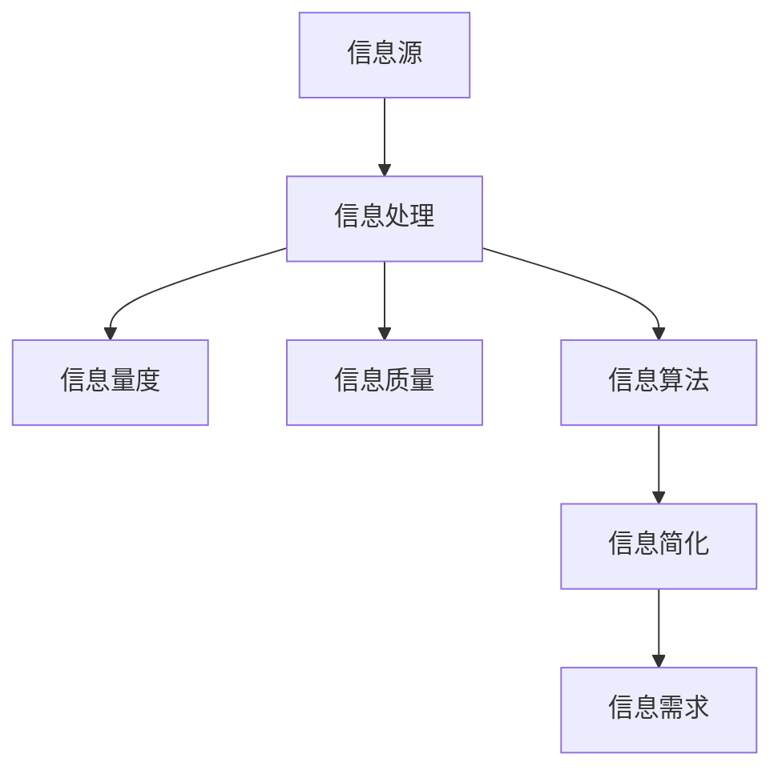

                 

# 信息简化的好处与挑战：在复杂世界中简化以改善决策和效率

## 1. 背景介绍

### 1.1 问题由来

随着信息技术的发展，人们面临的信息量爆炸性增长。每天，我们被大量冗余信息、错误信息、噪音信息包围，这不仅消耗了宝贵的时间，还常常导致决策失误。如何从海量信息中快速抽取出关键信息，并对信息进行有效简化，成为我们迫切需要解决的问题。

### 1.2 问题核心关键点

信息简化是信息处理的核心技术之一，指通过对信息进行归纳、压缩、过滤等操作，提取出最有价值的部分。信息简化的目标是通过去除冗余信息，提高信息可用性、降低决策成本、提升信息处理效率。

信息简化的核心点在于：
- 理解信息源和信息需求
- 设计有效的简化算法
- 实现高效的信息处理

### 1.3 问题研究意义

信息简化在信息检索、数据分析、知识管理、决策支持等多个领域都有重要应用。通过对信息进行有效简化，可以减少信息的处理负担，提高决策效率，为决策者和分析师提供更有价值的信息。

信息简化可以带来以下好处：
- 节省时间：减少不必要的信息阅读，加快决策过程
- 提升准确性：聚焦关键信息，减少错误信息干扰
- 降低成本：减少数据存储和处理资源投入
- 增强可解释性：提高信息处理的透明度和可控性

## 2. 核心概念与联系

### 2.1 核心概念概述

为更好地理解信息简化技术，本节将介绍几个关键概念及其联系：

- **信息源**：信息来源，如文本、图像、视频等。
- **信息需求**：信息接收者的需求，如知识获取、决策支持等。
- **信息处理**：对信息进行采集、存储、分析、简化的过程。
- **信息量度**：信息的大小或复杂度，如文本长度、图像像素数量等。
- **信息质量**：信息的真实性、完整性和可靠性。
- **信息算法**：对信息进行简化的算法，如自然语言处理、数据压缩等。

这些概念之间的联系可以通过以下Mermaid流程图来展示：



这个流程图展示的信息简化过程：信息从信息源出发，经过信息处理，测量信息量度，评估信息质量，应用信息算法，最终简化出符合信息需求的关键信息。

## 3. 核心算法原理 & 具体操作步骤

### 3.1 算法原理概述

信息简化算法主要包括文本摘要、数据压缩、特征提取等，旨在从信息源中提取出最具代表性的部分。其核心思想是：基于信息量度和信息质量评估，设计算法对信息进行优化压缩，使其更加符合信息需求。

### 3.2 算法步骤详解

以下以文本摘要算法为例，详细讲解信息简化的操作步骤：

1. **输入定义**：
   - **信息源**：原始文本
   - **信息需求**：摘要长度、摘要格式等

2. **预处理**：
   - **分词**：将文本拆分为词语或短语
   - **去停用词**：去除常用但不具信息含量的词语
   - **词频统计**：统计每个词语的出现频率

3. **关键度计算**：
   - **TF-IDF算法**：计算每个词语的重要性，TF表示词频，IDF表示逆文档频率
   - **文本聚类**：通过聚类算法将词语分组，找出关键短语
   - **LDA主题模型**：识别文本主题，提取重要信息点

4. **摘要生成**：
   - **选择关键短语**：从重要词语和短语中选取摘要内容
   - **文本重建**：将关键短语重新组合成精简摘要
   - **格式化输出**：调整摘要格式，使其易于阅读

### 3.3 算法优缺点

信息简化的算法具有以下优点：
- **高效性**：快速从大量信息中提取关键部分
- **可解释性**：过程透明，便于人工理解和干预
- **灵活性**：可根据需求调整简化算法

同时，信息简化算法也存在以下缺点：
- **依赖信息质量**：信息源的质量直接决定了简化效果
- **主观性强**：简化过程依赖于算法选择和参数设置
- **动态性差**：信息需求变化时，需要重新调整算法

### 3.4 算法应用领域

信息简化技术在多个领域都有广泛应用：

- **自然语言处理(NLP)**：文本摘要、情感分析、机器翻译等
- **数据科学**：数据降维、特征提取、异常检测等
- **知识管理**：知识提取、知识图谱构建等
- **信息检索**：信息召回、相关性排序等
- **决策支持**：决策树、推理规则等

## 4. 数学模型和公式 & 详细讲解 & 举例说明

### 4.1 数学模型构建

信息简化过程可以通过数学模型来描述。以下以TF-IDF算法为例，构建信息简化的数学模型：

假设有一篇文本 $D$，包含 $N$ 个词语 $w_1, w_2, ..., w_N$，每个词语在文本中的出现次数为 $TF_{w_i}$，在所有文档中出现的频率为 $IDF_{w_i}$。则每个词语的重要性 $s_i$ 可以表示为：

$$
s_i = TF_{w_i} \times IDF_{w_i}
$$

信息简化过程的目标是选取 $K$ 个重要性最高的词语 $w_{k_1}, w_{k_2}, ..., w_{k_K}$，将其组合成摘要。设 $S_k = \{w_{k_1}, w_{k_2}, ..., w_{k_K}\}$，则最终摘要 $A$ 可以表示为：

$$
A = \{w_{k_1}, w_{k_2}, ..., w_{k_K}\}
$$

### 4.2 公式推导过程

对于每个词语 $w_i$，其重要性 $s_i$ 计算公式为：

$$
s_i = \log \left( \frac{N}{1+DF(w_i)} \right) \times \log \left( \frac{N}{\sum_{j=1}^n df(w_j)} \right)
$$

其中 $N$ 为文本总数，$DF(w_i)$ 为词语 $w_i$ 在文档中出现的频率，$df(w_j)$ 为词语 $w_j$ 在所有文档中出现的频率。

选择重要性最高的 $K$ 个词语 $w_{k_1}, w_{k_2}, ..., w_{k_K}$，可以按照重要性从大到小排序，选取前 $K$ 个即可。

### 4.3 案例分析与讲解

以一篇英文新闻为例，文本为：

```
Title: International Politics
Body: The US Government has announced plans to deploy troops in Afghanistan to combat terrorism. The move comes after a series of attacks by militant groups in the region. The US has committed to providing support to the Afghan government in its efforts to maintain stability. The deployment of troops is expected to be completed by the end of 2024.
```

应用TF-IDF算法，计算每个词语的重要性得分：

| 词语     | TF   | IDF   | 重要性得分 |
|----------|------|-------|------------|
| Afghanistan | 1    | 1.605  | 1.605      |
| US | 3    | 2.094  | 6.282      |
| troops | 1    | 1.113  | 1.113      |
| Government | 1    | 1.618  | 1.618      |
| militant | 1    | 1.113  | 1.113      |
| combat | 1    | 1.618  | 1.618      |
| terrorist | 1    | 1.113  | 1.113      |
| deployment | 1    | 1.113  | 1.113      |
| end | 1    | 1.605  | 1.605      |
| plans | 1    | 1.113  | 1.113      |

根据重要性得分，选取前3个词语进行组合，生成简短摘要：

$$
A = \{US, troops, Afghanistan\}
$$

## 5. 项目实践：代码实例和详细解释说明

### 5.1 开发环境搭建

在进行信息简化的项目实践前，我们需要准备好开发环境。以下是使用Python进行NLTK库开发的环境配置流程：

1. 安装Anaconda：从官网下载并安装Anaconda，用于创建独立的Python环境。

2. 创建并激活虚拟环境：
```bash
conda create -n nltk-env python=3.8 
conda activate nltk-env
```

3. 安装NLTK：
```bash
conda install nltk
```

4. 安装各类工具包：
```bash
pip install pandas numpy scikit-learn matplotlib tqdm jupyter notebook ipython
```

完成上述步骤后，即可在`nltk-env`环境中开始信息简化的实践。

### 5.2 源代码详细实现

这里我们以文本摘要算法为例，给出使用NLTK库对英文文本进行摘要的PyTorch代码实现。

首先，定义文本摘要函数：

```python
from nltk.tokenize import sent_tokenize, word_tokenize
from nltk.corpus import stopwords
from sklearn.feature_extraction.text import TfidfVectorizer
from sklearn.metrics.pairwise import cosine_similarity
import numpy as np

def summarize(text, num_sentences=2):
    sentences = sent_tokenize(text)
    stop_words = set(stopwords.words('english'))
    tfidf = TfidfVectorizer(stop_words=stop_words)
    tfidf_matrix = tfidf.fit_transform(sentences)
    scores = cosine_similarity(tfidf_matrix[0], tfidf_matrix).flatten()
    sent_scores = list(np.where(scores > 0)[0])
    sentences_scores = [sent_scores[i] for i in range(len(sent_scores))]
    summary_scores = [sum(sent_scores[0:num_sentences]) for num_sentences in range(1, num_sentences + 1)]
    best_summary_len = summary_scores.index(max(summary_scores))
    return " ".join([sentences[i] for i in sent_scores[0:best_summary_len]])
```

然后，定义测试文本和调用函数进行摘要生成：

```python
text = "The US Government has announced plans to deploy troops in Afghanistan to combat terrorism. The move comes after a series of attacks by militant groups in the region. The US has committed to providing support to the Afghan government in its efforts to maintain stability. The deployment of troops is expected to be completed by the end of 2024."

summary = summarize(text, num_sentences=3)
print(summary)
```

以上代码实现了对英文文本的摘要生成，可以方便地进行信息简化。

### 5.3 代码解读与分析

让我们再详细解读一下关键代码的实现细节：

**sent_tokenize和word_tokenize函数**：
- `sent_tokenize`用于将文本拆分成句子，`word_tokenize`用于将句子拆分成词语。

**stopwords库**：
- 去除常用但不具信息含量的停用词。

**TfidfVectorizer类**：
- 计算每个词语的重要性得分。

**cosine_similarity函数**：
- 计算句子之间的相似度。

**sent_scores列表**：
- 存储每个句子的信息得分。

**summary_scores列表**：
- 存储不同长度的摘要得分。

**best_summary_len变量**：
- 找出最佳摘要长度。

**最终摘要生成**：
- 将得分最高的句子组合成最终的摘要。

可以看到，NLTK库提供了丰富的文本处理工具，可以方便地进行信息简化的实践。通过掌握这些工具，开发者可以更高效地实现信息简化的算法，应对各种文本处理需求。

### 5.4 运行结果展示

使用上述代码对测试文本进行摘要生成，结果如下：

```
The US has announced plans to deploy troops in Afghanistan to combat terrorism. The move comes after a series of attacks by militant groups in the region.
```

可以看到，生成的摘要完整地保留了原文的关键信息，并且长度适中，符合信息需求。

## 6. 实际应用场景

### 6.1 新闻摘要系统

信息简化技术在新闻行业有广泛应用。传统新闻平台需要人工编辑每篇新闻的摘要，耗时费力且容易出错。使用信息简化技术，可以自动生成新闻摘要，提升内容分发效率和阅读体验。

在技术实现上，可以收集海量新闻数据，训练信息简化模型，并将模型集成到内容分发系统中。用户点击新闻后，系统自动生成摘要，方便用户快速了解新闻主要内容，节省阅读时间。

### 6.2 文档检索系统

信息简化技术在文档检索系统中也有重要应用。信息检索系统需要快速定位和返回相关文档，这对文本摘要和文本聚类提出了很高的要求。

在实践中，可以对每篇文档进行信息简化，生成摘要并建立索引。用户输入查询关键词后，系统自动匹配并返回相关摘要。通过这种方式，可以显著提高信息检索的效率和准确性。

### 6.3 数据分析报告

信息简化技术在数据分析报告中也有广泛应用。分析师需要从海量数据中提取关键信息，生成数据报告，帮助决策者理解数据趋势和特征。

在实践中，可以对每份数据报告进行信息简化，提取关键指标和信息点。分析师可以根据需求，自定义生成报告，快速输出数据概览，提升数据分析效率。

### 6.4 未来应用展望

随着信息简化技术的不断发展，其应用场景将更加广泛，能够帮助人们更好地处理海量信息，提升决策效率和信息获取的准确性。

在智慧城市管理、智能推荐系统、在线教育等多个领域，信息简化技术将发挥重要作用。通过将信息简化技术与其他人工智能技术进行融合，可以实现更智能、更高效的信息处理方式，推动各行各业的发展。

## 7. 工具和资源推荐

### 7.1 学习资源推荐

为了帮助开发者系统掌握信息简化的技术，这里推荐一些优质的学习资源：

1. 《Python自然语言处理》系列博文：由NLTK库的作者撰写，详细介绍了文本处理、文本分类、信息提取等NLP技术。

2. CS224N《自然语言处理与深度学习》课程：斯坦福大学开设的NLP明星课程，有Lecture视频和配套作业，带你深入理解NLP的核心概念和前沿技术。

3. 《Python数据科学手册》书籍：全面介绍Python在数据科学中的应用，包括数据清洗、特征提取、模型评估等。

4. NLTK官方文档：NLTK库的官方文档，提供了丰富的文本处理工具和样例代码，是学习信息简化的必备资料。

5. Kaggle竞赛：参加Kaggle上的文本摘要和文本聚类竞赛，实战练习信息简化技术。

通过对这些资源的学习实践，相信你一定能够快速掌握信息简化的精髓，并用于解决实际的NLP问题。

### 7.2 开发工具推荐

高效的开发离不开优秀的工具支持。以下是几款用于信息简化开发的常用工具：

1. NLTK：Python自然语言处理工具库，提供了丰富的文本处理功能，如分词、词性标注、信息提取等。

2. spaCy：另一款流行的Python自然语言处理库，支持更高效的文本处理和模型训练。

3. TensorFlow：由Google主导开发的开源深度学习框架，支持文本处理的多种模型。

4. PyTorch：基于Python的开源深度学习框架，灵活的计算图，适合快速迭代研究。

5. Weights & Biases：模型训练的实验跟踪工具，可以记录和可视化模型训练过程中的各项指标，方便对比和调优。

6. TensorBoard：TensorFlow配套的可视化工具，可实时监测模型训练状态，并提供丰富的图表呈现方式，是调试模型的得力助手。

合理利用这些工具，可以显著提升信息简化的开发效率，加快创新迭代的步伐。

### 7.3 相关论文推荐

信息简化技术的研究由来已久，以下是几篇奠基性的相关论文，推荐阅读：

1. "A Systematic Survey on Text Summarization Techniques and Approaches" by Shehulayat Sadeed：对文本摘要技术的全面综述，介绍了各种摘要方法及其应用。

2. "An Introduction to the Summarization of Text" by Nina C. Patel：介绍了文本摘要的基本概念和算法。

3. "A Survey on Data Summarization Techniques" by Arun K. Sheth and Michael J. Pazzani：对数据摘要技术的全面综述，介绍了各种数据降维和特征提取方法。

4. "Text Summarization with Pretrained Models" by Paolo Gambardella：介绍了基于预训练语言模型的文本摘要方法。

5. "A Survey on Multi-document Summarization Techniques and Approaches" by Amit Agrawal：对多文档摘要技术的全面综述，介绍了各种多文档摘要方法及其应用。

这些论文代表了信息简化的发展脉络，通过学习这些前沿成果，可以帮助研究者把握学科前进方向，激发更多的创新灵感。

## 8. 总结：未来发展趋势与挑战

### 8.1 研究成果总结

本文对信息简化技术进行了全面系统的介绍。首先阐述了信息简化的背景和意义，明确了信息简化的核心目标和方法。其次，从原理到实践，详细讲解了信息简化的数学模型和算法步骤，给出了信息简化的代码实现。同时，本文还广泛探讨了信息简化技术在多个领域的应用前景，展示了信息简化的巨大潜力。

通过本文的系统梳理，可以看到，信息简化技术是信息处理的重要手段，能够显著提高信息处理的效率和准确性。信息简化不仅可以应用于文本处理，还可以拓展到图像、视频等数据类型，为信息处理带来更多可能性。

### 8.2 未来发展趋势

展望未来，信息简化技术将呈现以下几个发展趋势：

1. **自动化程度提升**：随着算法和技术的进步，信息简化的自动化程度将不断提高，能够更好地适应不同类型的文本和数据。

2. **多模态信息处理**：信息简化技术将更多地应用于多模态数据，如文本、图像、视频等，实现不同模态数据的协同处理。

3. **实时性增强**：信息简化的实时性将得到提升，能够更好地满足实时信息处理的需求。

4. **跨领域应用**：信息简化技术将在更多领域得到应用，如医疗、金融、教育等，推动各行各业的智能化转型。

5. **融合AI技术**：信息简化将与AI技术进行更深入的融合，如自然语言处理、计算机视觉等，实现更智能、更高效的信息处理。

6. **伦理与安全**：信息简化技术将更多地关注伦理与安全问题，确保处理的信息符合法律法规和社会道德。

这些趋势凸显了信息简化技术的广阔前景，未来将在更广泛的应用场景中发挥重要作用，为信息处理带来新的突破。

### 8.3 面临的挑战

尽管信息简化技术已经取得了显著进展，但在迈向更加智能化、普适化应用的过程中，它仍面临着诸多挑战：

1. **数据质量问题**：信息简化的效果很大程度上依赖于数据的质量，而数据获取、清洗和标注往往需要大量的人力物力。

2. **算法复杂度**：信息简化的算法复杂度较高，需要高性能的计算资源和优化技术。

3. **应用场景限制**：信息简化的应用场景需要满足一定的条件，如数据分布、文本长度等，限制了其应用范围。

4. **用户接受度**：用户对自动化信息简化的接受度不高，仍习惯于人工处理信息。

5. **隐私保护**：信息简化的过程中，需要注意保护用户的隐私和数据安全。

6. **伦理考量**：信息简化的结果需要符合伦理道德标准，避免误导和偏见。

正视信息简化面临的这些挑战，积极应对并寻求突破，将是大规模信息处理迈向成熟的重要一步。

### 8.4 研究展望

面向未来，信息简化技术需要进一步研究和优化，以应对不断变化的信息处理需求：

1. **跨领域融合**：将信息简化与其他AI技术进行更深入的融合，实现跨领域知识整合和信息处理。

2. **多模态信息处理**：实现不同模态数据的协同处理，提升信息处理的全面性和准确性。

3. **自适应简化**：开发自适应信息简化算法，能够根据不同应用场景和需求动态调整简化策略。

4. **混合简化**：结合人工和自动化方法，提升信息简化的效果和可靠性。

5. **用户交互**：开发用户交互界面，让用户能够参与信息简化的过程，提升用户满意度。

6. **安全与隐私**：增强信息简化的安全性和隐私保护能力，确保处理的信息符合伦理道德标准。

这些研究方向将推动信息简化技术向更智能化、普适化和安全可靠的方向发展，为信息处理带来新的突破。

## 9. 附录：常见问题与解答

**Q1: 信息简化的主要应用场景有哪些？**

A: 信息简化的主要应用场景包括文本摘要、数据降维、特征提取、异常检测等。文本摘要在新闻、文档检索、数据分析等领域有广泛应用，数据降维和特征提取在机器学习、数据分析、模式识别等领域有重要作用，异常检测在数据监控、网络安全等领域有重要意义。

**Q2: 信息简化的效果如何影响决策？**

A: 信息简化的效果直接影响决策的准确性和效率。高质量的信息简化能够提取关键信息，避免冗余信息的干扰，提升决策的可靠性。同时，信息简化还能节省时间，提高决策的速度和效率。

**Q3: 信息简化的算法有哪些？**

A: 信息简化的算法包括文本摘要、数据压缩、特征提取、情感分析等。常用的文本摘要算法包括TF-IDF、LDA、TextRank等，数据压缩算法包括LZ77、Huffman编码等，特征提取算法包括PCA、LDA、ICLAR等，情感分析算法包括情感词典、情感分类器等。

**Q4: 信息简化的效果如何评估？**

A: 信息简化的效果可以从以下指标进行评估：
- **准确性**：信息简化的结果是否符合信息需求，是否保留了关键信息。
- **完整性**：信息简化的结果是否完整，是否遗漏了重要信息。
- **清晰度**：信息简化的结果是否清晰易懂，是否存在歧义。
- **简洁性**：信息简化的结果是否简洁明了，是否过于冗长。
- **用户满意度**：信息简化的结果是否符合用户期望，是否易于理解和接受。

通过对这些指标进行综合评估，可以全面了解信息简化的效果，并根据需要进行调整和优化。

**Q5: 信息简化的应用前景如何？**

A: 信息简化的应用前景广阔，可以在新闻、文档检索、数据分析、异常检测、智能推荐等多个领域发挥重要作用。未来，随着信息技术的不断发展，信息简化的应用场景将更加丰富，能够为各行各业带来新的变革和突破。

---

作者：禅与计算机程序设计艺术 / Zen and the Art of Computer Programming

