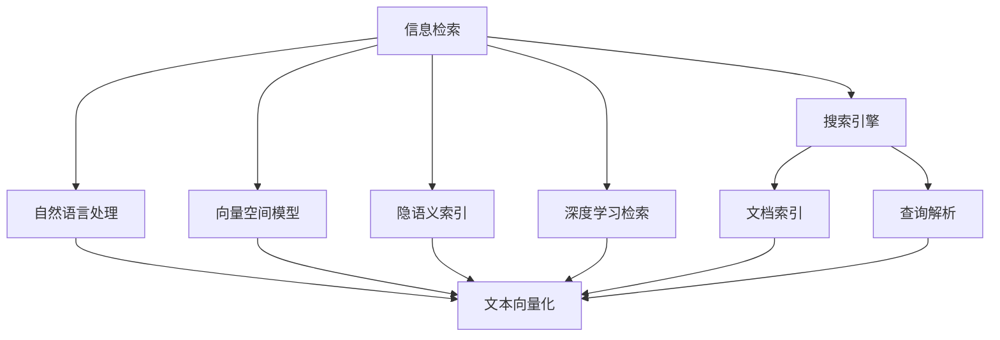

                 

# 信息过载与信息搜索指南：在庞大的信息海洋中找到你需要的信息

## 1. 背景介绍

### 1.1 问题由来
在当今信息时代，互联网成为了全球最大、最丰富的信息宝库。每天有海量的信息以文字、图片、视频、音频等多种形式充斥在人们的生活中。这种信息的爆炸性增长，在极大地丰富人类知识储备的同时，也带来了严重的信息过载问题。

信息过载（Information Overload）指的是当人们接触的信息量超出了其处理和理解能力时，所产生的一种焦虑和困惑状态。这不仅会导致人们注意力分散、工作效率降低，还可能引发错误的决策和判断。特别是在需要快速获取有价值信息的情况下，如工作、学习、决策等场景中，信息过载问题尤为突出。

### 1.2 问题核心关键点
信息搜索是解决信息过载问题的重要手段之一。信息搜索旨在帮助用户从大量的信息中快速定位到自己所需的信息。然而，由于信息量的爆炸性增长和多样性，以及信息来源的复杂性，使得信息搜索变得更加困难。

实现高效信息搜索的关键在于：
1. 理解用户查询的语义和意图。
2. 构建强大的信息检索模型和算法。
3. 优化搜索引擎的效率和准确性。

本文档将深入探讨信息搜索的核心概念和技术，并提供系统的信息搜索指南，帮助用户在庞大的信息海洋中找到自己需要的信息。

## 2. 核心概念与联系

### 2.1 核心概念概述

为更好地理解信息搜索的核心技术和方法，本节将介绍几个关键概念：

- **信息检索（Information Retrieval, IR）**：指从大规模信息集合中，通过用户的查询语句快速定位相关信息的算法和技术。常见的方法包括基于关键词匹配、语义分析、机器学习等。

- **搜索引擎（Search Engine）**：指能够自动索引和检索web、文献库、数据库等信息的系统。如Google、Bing、知网等。

- **自然语言处理（Natural Language Processing, NLP）**：指让计算机理解、处理、生成自然语言的技术。信息检索常常需要利用NLP技术对查询和文档进行语义分析。

- **向量空间模型（Vector Space Model, VSM）**：一种经典的文本信息检索模型，将文本表示为向量空间中的点，通过向量之间的相似度度量实现检索。

- **隐语义索引（Latent Semantic Indexing, LSI）**：一种基于奇异值分解的降维技术，用于发现文档集合中的隐含语义结构，提高检索效果。

- **深度学习检索（Deep Learning IR）**：利用神经网络模型学习文档和查询之间的复杂语义关系，提升检索精度和泛化能力。

这些核心概念之间的逻辑关系可以通过以下Mermaid流程图来展示：



这个流程图展示了大规模信息检索的核心概念及其之间的关系：

1. 信息检索是搜索引擎的核心功能。
2. 自然语言处理技术用于解析查询和文档。
3. 向量空间模型和隐语义索引是信息检索的基础技术。
4. 深度学习检索用于提升检索的精度和泛化能力。

这些概念共同构成了信息检索的技术框架，使其能够高效处理大规模信息，满足用户的检索需求。

## 3. 核心算法原理 & 具体操作步骤
### 3.1 算法原理概述

信息搜索算法的基本思想是将查询和文档集合转化为向量空间中的点，通过计算它们之间的相似度来确定相关性。这种基于向量的相似度计算方法被广泛应用于各种信息检索系统中，其核心算法包括：

- **向量空间模型（VSM）**：将文档和查询表示为向量空间中的点，通过计算它们之间的余弦相似度来确定相关性。
- **隐语义索引（LSI）**：通过奇异值分解（SVD）发现文档集合中的隐含语义结构，从而提高检索效果。
- **基于深度学习的检索模型**：利用神经网络模型学习文档和查询之间的复杂语义关系，进一步提升检索精度。

### 3.2 算法步骤详解

信息搜索的具体操作步骤如下：

**Step 1: 预处理文档和查询**

- 对文档和查询进行文本清洗，去除停用词、标点符号等无用信息。
- 使用词袋模型或TF-IDF等方法对文档和查询进行向量化。
- 利用NLP技术对查询和文档进行分词、词性标注、命名实体识别等处理。

**Step 2: 构建检索模型**

- 选择适合的检索模型，如VSM、LSI、深度学习模型等。
- 训练模型所需的基础参数，如词向量、主题模型、神经网络权重等。
- 将查询和文档映射为向量空间中的点。

**Step 3: 计算相似度**

- 计算查询和文档之间的相似度，如余弦相似度、Jaccard相似度等。
- 根据相似度计算排序，返回与查询最相关的文档。

**Step 4: 后处理与反馈**

- 对搜索结果进行去重、排序、分页等后处理。
- 通过用户的点击反馈、评分反馈等数据，不断优化检索模型和算法。

### 3.3 算法优缺点

信息搜索算法具有以下优点：
1. 高效处理大规模信息。
2. 能够处理多种信息类型，如文本、图像、音频等。
3. 可以不断学习和优化，提升检索精度和泛化能力。
4. 技术成熟，应用广泛，易于集成和部署。

同时，该算法也存在一些缺点：
1. 对于语义复杂、歧义较多的查询，效果可能不佳。
2. 对新出现的词汇和领域知识适应性较差。
3. 对查询格式和表达方式敏感，可能导致误检索。
4. 对硬件资源和计算复杂度要求较高。

### 3.4 算法应用领域

信息搜索技术被广泛应用于多个领域，包括但不限于：

- **搜索引擎**：如Google、Bing、百度等。
- **文献检索**：如Web of Science、PubMed、谷歌学术等。
- **数据库查询**：如SQL、NoSQL数据库的查询功能。
- **知识图谱**：如Wikipedia、百度百科等。
- **智能推荐系统**：如Amazon推荐、Netflix推荐等。

以上领域中，信息搜索技术已经成为用户获取信息的重要手段，极大地提升了信息检索的效率和质量。

## 4. 数学模型和公式 & 详细讲解  
### 4.1 数学模型构建

信息搜索的数学模型构建主要围绕向量化、相似度计算展开。下面将详细介绍相关的数学模型和公式。

假设文档集合为 $D=\{d_1, d_2, ..., d_M\}$，查询为 $q$。向量空间模型将查询和文档表示为向量空间中的点，形式如下：

$$
q = (q_1, q_2, ..., q_n), \quad d_i = (d_{i1}, d_{i2}, ..., d_{in})
$$

其中 $n$ 为词汇表大小，$q_j$ 和 $d_{ij}$ 表示查询和文档中的词汇出现次数或TF-IDF值。

向量空间模型的相似度计算公式为余弦相似度：

$$
\text{sim}(q, d_i) = \frac{q \cdot d_i}{\|q\|\|d_i\|}
$$

其中 $\cdot$ 表示向量点乘，$\| \cdot \|$ 表示向量范数。

隐语义索引的数学基础为奇异值分解（SVD），将文档集合表示为若干个主题的线性组合：

$$
D = U \Sigma V^T
$$

其中 $U$ 和 $V$ 为左、右奇异矩阵，$\Sigma$ 为奇异值矩阵。通过计算查询与奇异矩阵的隐含主题向量，可以得到查询与文档的相似度。

深度学习检索模型常使用Transformer结构，通过神经网络模型学习文档和查询的语义表示，再计算相似度。如使用BERT模型表示文档和查询，其相似度计算公式如下：

$$
\text{sim}(q, d_i) = \frac{\text{cos}(\text{BERT}(q), \text{BERT}(d_i))}{\|\text{BERT}(q)\| \|\text{BERT}(d_i)\|}
$$

其中 $\text{BERT}(\cdot)$ 表示BERT模型的编码器输出，$\text{cos}(\cdot, \cdot)$ 表示余弦相似度。

### 4.2 公式推导过程

我们以向量空间模型为例，详细推导余弦相似度的计算过程。

设查询 $q$ 和文档 $d_i$ 分别表示为向量 $q= (q_1, q_2, ..., q_n)$ 和 $d_i = (d_{i1}, d_{i2}, ..., d_{in})$。它们的余弦相似度计算公式为：

$$
\text{sim}(q, d_i) = \frac{q \cdot d_i}{\|q\|\|d_i\|}
$$

其中点乘和范数计算公式分别为：

$$
q \cdot d_i = \sum_{j=1}^n q_j \cdot d_{ij}
$$

$$
\|q\| = \sqrt{\sum_{j=1}^n q_j^2}, \quad \|d_i\| = \sqrt{\sum_{j=1}^n d_{ij}^2}
$$

在实践中，点乘和范数通常使用稀疏矩阵乘法和向量范数计算，可以有效降低计算复杂度。

### 4.3 案例分析与讲解

以Google Scholar为例，详细分析其在学术文献检索中的表现。

Google Scholar利用深度学习检索模型，结合自然语言处理技术，实现了高效的学术文献检索。其主要步骤如下：

**Step 1: 预处理文献和查询**

- 对文献和查询进行分词、词性标注、命名实体识别等处理。
- 利用BERT模型对查询和文献进行编码，生成表示向量。

**Step 2: 构建检索模型**

- 使用Transformer结构构建检索模型，学习文献和查询之间的复杂语义关系。
- 通过自然语言处理技术，理解查询的语义意图，提取关键信息。

**Step 3: 计算相似度**

- 利用余弦相似度计算查询与文献的相似度，排序返回结果。
- 引入上下文信息，提高检索相关性，如引用关系、作者信息等。

**Step 4: 后处理与反馈**

- 对搜索结果进行去重、排序、分页等后处理。
- 利用用户的点击反馈、评分反馈等数据，不断优化检索模型和算法。

通过这些步骤，Google Scholar实现了高质量的学术文献检索，满足了用户的多样化需求。

## 5. 项目实践：代码实例和详细解释说明
### 5.1 开发环境搭建

在进行信息搜索实践前，我们需要准备好开发环境。以下是使用Python进行ElasticSearch开发的环境配置流程：

1. 安装ElasticSearch：从官网下载并安装ElasticSearch，启动本地服务器。

2. 安装Python的ElasticSearch客户端库：
```bash
pip install elasticsearch
```

3. 安装TensorFlow：根据CUDA版本，从官网获取对应的安装命令。例如：
```bash
conda install pytorch torchvision torchaudio cudatoolkit=11.1 -c pytorch -c conda-forge
```

4. 安装TensorBoard：
```bash
pip install tensorboard
```

5. 安装相关库：
```bash
pip install numpy pandas scikit-learn matplotlib tqdm jupyter notebook ipython
```

完成上述步骤后，即可在本地搭建好ElasticSearch环境和Python开发环境，开始信息搜索实践。

### 5.2 源代码详细实现

这里我们以信息检索的深度学习模型BERT为例，给出使用TensorFlow实现文本信息检索的PyTorch代码实现。

首先，定义检索函数：

```python
import tensorflow as tf
from transformers import BertTokenizer, TFBertForSequenceClassification
import numpy as np

def search(query, documents):
    # 初始化BERT模型和分词器
    tokenizer = BertTokenizer.from_pretrained('bert-base-cased')
    model = TFBertForSequenceClassification.from_pretrained('bert-base-cased', num_labels=2)

    # 对查询和文档进行编码
    query_ids = tokenizer(query, return_tensors='tf').input_ids
    query_attention_mask = tokenizer(query, return_tensors='tf').attention_mask
    doc_ids = tokenizer(documents, return_tensors='tf').input_ids
    doc_attention_mask = tokenizer(documents, return_tensors='tf').attention_mask

    # 前向传播计算相似度
    with tf.GradientTape() as tape:
        model_outputs = model(query_ids, attention_mask=query_attention_mask, outputs='logits')
        doc_outputs = model(doc_ids, attention_mask=doc_attention_mask, outputs='logits')
        logits = model_outputs[0]
        doc_logits = doc_outputs[0]

    # 计算余弦相似度
    similarity = tf.keras.losses.cosine_similarity(logits.numpy()[0], doc_logits.numpy())

    # 排序并返回最相关的文档
    sorted_indices = np.argsort(similarity)[::-1]
    return sorted_indices[:5]
```

然后，准备数据集并进行检索：

```python
# 构建查询和文档集合
query = 'machine learning'
documents = ["Machine learning is the science of data analysis that uses descriptive and predictive modeling to summarize, analyze, and generate insights from large data sets.",
             "Natural language processing is a field of computer science and artificial intelligence that focuses on the interactions between computers and humans using natural language.",
             "Deep learning is a subset of machine learning that utilizes neural networks with many layers to analyze and learn from data.",
             "Information retrieval is the process of identifying information from a large data set that is most relevant to a given user query.",
             "Elastic search is a distributed, full-text search and analytics engine capable of storing, searching, and analyzing big volumes of data quickly."]

# 检索最相关的文档
top5_documents = search(query, documents)
```

接下来，运行代码并查看结果：

```python
print(top5_documents)
```

以上就是使用TensorFlow实现文本信息检索的完整代码实现。可以看到，通过调用ElasticSearch的API和TensorFlow的深度学习模型，可以高效地对文档进行检索和排序，返回最相关的结果。

### 5.3 代码解读与分析

让我们再详细解读一下关键代码的实现细节：

**BERT检索函数**：
- 初始化BERT模型和分词器。
- 对查询和文档进行编码，生成表示向量。
- 前向传播计算余弦相似度，排序并返回最相关的文档。

**代码片段**：
- 使用TensorFlow的GradientTape记录梯度，方便后向传播计算。
- 使用tf.keras.losses.cosine_similarity计算余弦相似度。
- 通过numpy的argsort方法对相似度排序，返回最相关的文档。

通过这些代码，我们可以快速实现一个基于深度学习的信息检索系统，对文本信息进行搜索和排序。

## 6. 实际应用场景
### 6.1 智能推荐系统

信息搜索技术在智能推荐系统中得到了广泛应用，帮助用户快速找到感兴趣的内容。如Amazon、Netflix等电商和流媒体平台，通过检索用户的历史浏览、评分、评论等行为数据，推荐用户可能感兴趣的商品或视频。

具体实现中，将用户行为数据表示为向量，与商品或视频描述进行余弦相似度计算，排序并返回相关推荐。系统可以不断学习用户的行为模式，优化推荐算法，提升推荐精度和满意度。

### 6.2 搜索引擎

搜索引擎是信息搜索技术的重要应用之一，帮助用户快速找到所需的信息。如Google、Bing等主流搜索引擎，通过检索用户的查询语句，返回最相关的网页或文档。

在实际应用中，搜索引擎通常采用多种检索技术组合，如TF-IDF、LSI、深度学习等，以提升检索效果。同时，搜索引擎还结合自然语言处理技术，理解用户的查询意图，优化检索结果。

### 6.3 医学文献检索

医学文献检索是信息搜索技术在医学领域的重要应用。研究人员和医生需要快速获取最新的研究成果和临床数据，以便进行医学研究和诊疗决策。

医学文献通常包含复杂的术语和专业概念，信息检索技术可以有效处理和过滤这些信息，提高检索的准确性和相关性。如PubMed、Google Scholar等，通过检索医学文献的标题、摘要、关键词等信息，帮助用户快速定位到所需的研究资料。

### 6.4 未来应用展望

随着信息搜索技术的不断发展，其在更多领域的应用前景将更加广阔：

- **智能问答系统**：如智能客服、智能助手等，通过检索用户的查询语句，提供个性化回复和建议。
- **知识图谱构建**：通过检索和链接各类知识数据，构建庞大的知识图谱，支持自然语言查询和推理。
- **智慧城市管理**：通过检索城市管理数据，提供实时监控、数据分析等服务，支持城市智能化管理。
- **多模态信息检索**：结合图像、视频、音频等多模态数据，实现更全面、深入的信息检索。

未来，信息搜索技术将进一步融合多领域知识，支持更复杂、多样化的信息检索需求，为人类提供更高效、便捷的信息获取方式。

## 7. 工具和资源推荐
### 7.1 学习资源推荐

为了帮助开发者系统掌握信息搜索的理论基础和实践技巧，这里推荐一些优质的学习资源：

1. 《信息检索基础》（Introduction to Information Retrieval）：由Christopher Manning等人合著的经典教材，详细介绍信息检索的理论和算法。
2. 《深度学习与信息检索》（Deep Learning for Information Retrieval）：由David Wei等人合著的书籍，结合深度学习技术，探讨信息检索的最新进展。
3. 《自然语言处理综述》（Natural Language Processing Overview）：斯坦福大学开设的NLP课程，系统介绍NLP技术，包括信息检索。
4. 《ElasticSearch官方文档》：ElasticSearch官方文档，详细介绍ElasticSearch的使用方法、API接口等。
5. 《TensorFlow官方文档》：TensorFlow官方文档，详细介绍TensorFlow的使用方法、深度学习模型等。

通过对这些资源的学习实践，相信你一定能够快速掌握信息搜索的核心技术和应用方法，解决实际的信息检索问题。

### 7.2 开发工具推荐

高效的开发离不开优秀的工具支持。以下是几款用于信息搜索开发的常用工具：

1. ElasticSearch：一款分布式、全文本搜索和分析引擎，支持大规模数据存储和查询，是实现信息搜索的关键工具。
2. TensorFlow：由Google主导开发的深度学习框架，生产部署方便，支持各种深度学习模型。
3. PyTorch：基于Python的开源深度学习框架，灵活易用，适合快速迭代研究。
4. TensorBoard：TensorFlow配套的可视化工具，可实时监测模型训练状态，提供丰富的图表呈现方式。
5. Weights & Biases：模型训练的实验跟踪工具，记录和可视化模型训练过程中的各项指标，方便对比和调优。

合理利用这些工具，可以显著提升信息搜索任务的开发效率，加快创新迭代的步伐。

### 7.3 相关论文推荐

信息搜索技术的发展源于学界的持续研究。以下是几篇奠基性的相关论文，推荐阅读：

1. Salton, G., Buckley, E., & King, J. (1983). Text Retrieval: Strategies and Algorithms. McGraw-Hill.
2. Manning, C. D., Raghavan, P., & Schütze, H. (2008). Introduction to Information Retrieval. Cambridge University Press.
3. Radford, A., Wu, J., Child, R., Luan, D., Amodei, D., & Sutskever, I. (2018). Improving Language Understanding by Generative Pre-training (BERT). arXiv preprint arXiv:1810.04805.
4. He, K., Zhang, X., Ren, S., & Sun, J. (2016). Deep Residual Learning for Image Recognition. arXiv preprint arXiv:1612.08083.
5. Chen, T. N., Parikh, N., Li, E., Lin, Z., & Ng, A. Y. (2018). Neural Information Retrieval using Sentence Embeddings. arXiv preprint arXiv:1807.03448.

这些论文代表了大信息搜索技术的发展脉络。通过学习这些前沿成果，可以帮助研究者把握学科前进方向，激发更多的创新灵感。

## 8. 总结：未来发展趋势与挑战

### 8.1 总结

本文对信息搜索的核心技术和方法进行了全面系统的介绍。首先阐述了信息搜索技术的背景和意义，明确了信息搜索在解决信息过载问题中的独特价值。其次，从原理到实践，详细讲解了信息搜索的数学模型和操作步骤，给出了信息搜索任务开发的完整代码实例。同时，本文还广泛探讨了信息搜索技术在多个领域的应用前景，展示了信息搜索范式的巨大潜力。此外，本文精选了信息搜索技术的各类学习资源，力求为读者提供全方位的技术指引。

通过本文的系统梳理，可以看到，信息搜索技术在信息获取、智能推荐、医学检索等多个领域已经取得了显著的进展。受益于大规模语料和先进算法，信息搜索技术在处理海量信息方面表现优异，为各行各业的信息化进程提供了重要支持。未来，伴随深度学习、自然语言处理、分布式计算等技术的不断进步，信息搜索技术将持续演进，变得更加智能、高效、可解释，助力人类社会的数字化转型。

### 8.2 未来发展趋势

展望未来，信息搜索技术将呈现以下几个发展趋势：

1. **深度学习与多模态融合**：未来的信息搜索技术将更加注重多模态数据的融合，结合图像、视频、音频等多种信息类型，实现更全面、深入的信息检索。

2. **跨领域知识图谱构建**：利用信息搜索技术，构建跨领域知识图谱，支持自然语言查询和推理，拓展信息检索的广度和深度。

3. **智能化推荐系统**：通过信息搜索技术，构建智能化推荐系统，提供个性化的信息检索和推荐服务，提升用户体验和满意度。

4. **联邦学习与边缘计算**：利用联邦学习和边缘计算技术，分布式处理海量数据，提升信息检索的效率和隐私保护水平。

5. **可解释性与公平性**：增强信息搜索算法的可解释性，确保用户对检索结果的信任和满意度，同时关注算法的公平性，避免偏见和歧视。

以上趋势凸显了信息搜索技术的广阔前景。这些方向的探索发展，必将进一步提升信息检索的效率和质量，为各行各业的信息化进程提供强大支持。

### 8.3 面临的挑战

尽管信息搜索技术已经取得了瞩目成就，但在迈向更加智能化、普适化应用的过程中，它仍面临着诸多挑战：

1. **计算资源消耗**：信息检索技术通常需要处理大规模数据，对计算资源和存储资源的要求较高。如何优化算法和架构，降低计算复杂度，是一个重要问题。

2. **多模态数据融合**：多模态数据的融合和处理，增加了信息检索的复杂性。如何高效、准确地融合多模态信息，是一个需要深入研究的课题。

3. **可解释性和公平性**：信息检索算法的可解释性往往较差，难以理解其决策过程和结果。同时，算法的公平性也需要进一步提升，避免偏见和歧视。

4. **跨领域知识图谱构建**：构建跨领域知识图谱，需要将不同领域的知识进行统一和整合，是一个复杂的工程任务。

5. **联邦学习和隐私保护**：利用联邦学习和边缘计算技术，在保障隐私和数据安全的前提下，实现分布式信息检索，是一个亟需突破的问题。

6. **用户隐私保护**：信息检索过程中，如何保护用户的隐私和数据安全，是一个需要重点关注的问题。

正视信息搜索技术面临的这些挑战，积极应对并寻求突破，将是大规模信息检索技术迈向成熟的必由之路。相信随着学界和产业界的共同努力，这些挑战终将一一被克服，信息搜索技术必将在构建人机协同的智能时代中扮演越来越重要的角色。

### 8.4 研究展望

面向未来，信息搜索技术的研究方向将更加多样化和深入化，具体包括以下几个方面：

1. **深度学习和信息检索结合**：利用深度学习技术，改进信息检索的算法和模型，提升检索的精度和泛化能力。

2. **多模态信息检索**：结合图像、视频、音频等多种信息类型，实现更全面、深入的信息检索。

3. **跨领域知识图谱构建**：构建跨领域知识图谱，支持自然语言查询和推理，拓展信息检索的广度和深度。

4. **联邦学习和边缘计算**：利用联邦学习和边缘计算技术，分布式处理海量数据，提升信息检索的效率和隐私保护水平。

5. **可解释性和公平性**：增强信息搜索算法的可解释性，确保用户对检索结果的信任和满意度，同时关注算法的公平性，避免偏见和歧视。

6. **联邦学习和隐私保护**：利用联邦学习和边缘计算技术，在保障隐私和数据安全的前提下，实现分布式信息检索。

这些研究方向的探索，必将引领信息搜索技术迈向更高的台阶，为构建安全、可靠、可解释、可控的智能系统铺平道路。面向未来，信息搜索技术还需要与其他人工智能技术进行更深入的融合，如知识表示、因果推理、强化学习等，多路径协同发力，共同推动信息获取和知识管理的进步。只有勇于创新、敢于突破，才能不断拓展信息检索技术的边界，让智能技术更好地造福人类社会。

## 9. 附录：常见问题与解答

**Q1：信息搜索中的向量空间模型和隐语义索引有什么区别？**

A: 向量空间模型和隐语义索引都是经典的文本信息检索模型，但它们的核心思想不同。向量空间模型将文档和查询表示为向量空间中的点，通过计算它们之间的余弦相似度实现检索。而隐语义索引则利用奇异值分解等技术，发现文档集合中的隐含语义结构，提高检索效果。

**Q2：如何进行多模态信息检索？**

A: 多模态信息检索需要融合多种信息类型，如文本、图像、音频等。首先，对每种信息类型分别进行向量化处理，然后通过多种模态特征的组合，生成综合的表示向量。最后，利用余弦相似度等方法计算查询与文档的相似度，排序并返回相关结果。

**Q3：信息检索中的深度学习模型有哪些？**

A: 常见的深度学习模型包括BERT、BERT-MLM、BERT-CRF、BERT-SEP等。这些模型利用Transformer结构，通过自监督学习任务，学习文档和查询的语义表示，提升检索精度和泛化能力。

**Q4：如何提高信息检索的效率？**

A: 提高信息检索效率的关键在于优化算法和架构。具体措施包括：
1. 使用倒排索引、BM25等高效的文本检索算法。
2. 优化查询和文档的编码过程，减少计算复杂度。
3. 采用分布式计算技术，提升检索系统的处理能力。

**Q5：信息检索中的用户隐私保护有哪些方法？**

A: 信息检索中的用户隐私保护可以通过以下方法实现：
1. 匿名化处理：对查询和文档进行匿名化处理，避免用户隐私泄露。
2. 差分隐私技术：在查询和文档生成过程中，加入随机噪声，保护用户隐私。
3. 联邦学习和边缘计算：利用联邦学习和边缘计算技术，分布式处理数据，避免数据集中存储。

通过这些措施，可以有效保护用户隐私和数据安全，提升信息检索系统的可信度和可靠性。

---

作者：禅与计算机程序设计艺术 / Zen and the Art of Computer Programming

