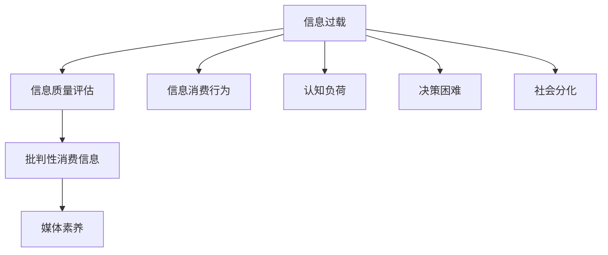

                 

# 信息过载与信息质量评估：批判性消费信息和媒体的指南

在当今信息爆炸的时代，我们被源源不断的信息所包围，从社交媒体到新闻网站，从短视频平台到博客文章，每时每刻都有海量数据流入我们的视野。这种“信息过载”现象，既带来了便利，也带来了挑战。如何有效筛选信息，辨别信息质量，成为了信息消费者和媒体从业者面临的重大课题。本文将深入探讨信息过载的本质、信息质量评估的原理，以及批判性消费信息和媒体的指南，旨在帮助读者更好地在信息洪流中航行，做出明智的选择。

## 1. 背景介绍

### 1.1 信息过载的成因

信息过载（Information Overload）指的是个体在面对信息量远远超出其处理能力时，无法有效吸收、处理和利用信息的现象。信息过载的成因包括但不限于以下几点：

1. **技术进步**：互联网、智能手机、大数据等技术的发展，使得信息获取和传播变得更加便捷和广泛。
2. **内容生产爆发**：自媒体、社交网络等平台的兴起，使得内容生产成本大幅降低，内容数量急剧增加。
3. **用户注意力分散**：短视频、即时消息等形式的内容，对用户注意力的争夺加剧，导致深度信息消费减少。

### 1.2 信息过载的后果

信息过载不仅影响个人的生活质量和决策效率，还对社会产生深远影响：

1. **认知负荷**：过度信息输入可能导致认知负担增加，影响记忆、注意力和学习能力。
2. **决策困难**：面对海量信息，用户难以快速判断信息真假和价值，决策过程变得复杂和耗时。
3. **社会分化**：信息茧房和回音室效应加剧，不同群体间的认知鸿沟和隔阂加深。

## 2. 核心概念与联系

### 2.1 核心概念概述

为了更好地理解信息过载与信息质量评估，我们先回顾一些核心概念：

- **信息过载**：指个体面临的信息量超过其处理能力，导致信息处理效率降低的现象。
- **信息质量评估**：指通过一系列标准和方法，评估信息内容是否真实、有用、可靠的过程。
- **批判性消费信息**：指消费者在获取和处理信息时，运用逻辑推理和批判性思维，主动筛选和评估信息的过程。
- **媒体素养**：指个体具备的媒体识别、分析、评估和利用媒体信息的能力。

### 2.2 核心概念的联系

信息过载、信息质量评估和批判性消费信息之间存在着紧密的联系。信息过载为信息质量评估提出了紧迫需求，而有效的信息质量评估是批判性消费信息的基础。媒体素养则是提升信息质量评估和批判性消费信息能力的核心工具。通过加强媒体素养，个体可以更有效地应对信息过载，做出明智的信息消费决策。

以下是一个Mermaid流程图，展示这些概念之间的联系：



## 3. 核心算法原理 & 具体操作步骤

### 3.1 算法原理概述

信息质量评估的核心在于构建一套系统化的评估标准和方法，基于这些标准和方法对信息内容进行打分或分类。一般而言，信息质量评估包括真实性、可靠性、相关性、完整性和有用性等多个维度。

信息质量评估的基本算法流程如下：

1. **数据收集**：收集待评估信息内容。
2. **特征提取**：从信息内容中提取关键特征，如关键词、引用源、作者背景等。
3. **模型训练**：基于提取的特征，训练一个或多个人工智能模型，用于对信息质量进行打分或分类。
4. **评估结果输出**：根据训练好的模型，对信息内容进行评估，输出评估结果。

### 3.2 算法步骤详解

以下详细介绍信息质量评估的具体步骤：

**Step 1: 数据收集**

信息质量评估的第一步是收集待评估的信息内容。这些内容可以来自新闻网站、博客、社交媒体、研究报告等多个渠道。

**Step 2: 特征提取**

从收集的信息内容中提取关键特征。特征提取的目的是将非结构化的文本内容转化为结构化的数据，供后续分析使用。常见的特征包括：

- **关键词**：反映信息内容的核心主题。
- **引用源**：评估信息可靠性的重要指标。
- **作者背景**：作者的专业背景、出版历史等，影响信息可信度。
- **时间戳**：信息发布时间，反映时效性。
- **媒体类型**：新闻、评论、研究等，不同类型媒体的信息质量不同。

**Step 3: 模型训练**

使用机器学习或深度学习方法，训练一个评估模型。常见的模型包括支持向量机(SVM)、随机森林、卷积神经网络(CNN)、循环神经网络(RNN)等。

**Step 4: 评估结果输出**

根据训练好的模型，对新的信息内容进行评估，输出其质量得分或分类标签。这些评估结果可以帮助用户快速判断信息的真实性和可靠性。

### 3.3 算法优缺点

信息质量评估算法具有以下优点：

1. **客观性**：通过训练好的模型，信息质量评估具有较高的客观性，减少了人为偏见的影响。
2. **效率高**：自动化评估过程可以显著提高信息筛选和处理的效率。
3. **可扩展性**：算法可以应用于不同类型的信息内容，具有较高的泛化能力。

然而，信息质量评估算法也存在一些缺点：

1. **数据依赖**：模型性能高度依赖于训练数据的数量和质量，数据不足可能导致评估结果偏差。
2. **特征选择**：特征提取和选择的质量对模型性能有重要影响，需要专业知识进行优化。
3. **模型复杂度**：复杂模型可能需要较高的计算资源和时间进行训练和部署，增加了成本。
4. **动态适应性**：模型需要定期更新，以适应信息内容的变化，增加了维护成本。

### 3.4 算法应用领域

信息质量评估算法在多个领域有广泛应用：

1. **新闻业**：评估新闻报道的真实性和可靠性，提高媒体透明度。
2. **科研领域**：评估学术论文和报告的质量，筛选高质量研究。
3. **公共政策**：评估政策声明和报告的真实性和客观性。
4. **商业决策**：评估市场数据和分析报告的可靠性，支持决策过程。
5. **教育**：评估教育内容的准确性和科学性，确保教育质量。

## 4. 数学模型和公式 & 详细讲解

### 4.1 数学模型构建

信息质量评估通常基于以下数学模型：

1. **文本分类模型**：将信息内容分类为正面、中立、负面等类别，反映信息情绪倾向。
2. **布尔模型**：将信息内容分为真实、假信息和不确定三类，反映信息真实性。
3. **多标签分类模型**：将信息内容分为多个标签，反映信息的多维度特征。

### 4.2 公式推导过程

以文本分类模型为例，其推导过程如下：

**假设**：信息内容 $x$，分类标签 $y$，特征向量 $f(x)$。

**目标**：最大化分类器在训练集上的准确率，即 $P(y|x)$。

**损失函数**：使用交叉熵损失函数，表达模型预测与真实标签之间的差异。

$$
\mathcal{L} = -\frac{1}{N} \sum_{i=1}^N y_i\log P(y_i|x_i) + (1-y_i)\log (1-P(y_i|x_i))
$$

其中 $N$ 为训练集大小。

**优化算法**：使用梯度下降等优化算法，最小化损失函数，更新模型参数。

### 4.3 案例分析与讲解

以评估新闻报道的真实性为例，我们可以使用布尔模型。假设模型已经训练完成，对于一条新闻报道 $x$，其真实性 $y$ 的概率计算如下：

$$
P(y=1|x) = f(x; \theta)
$$

其中 $f(x; \theta)$ 为模型的预测函数，$\theta$ 为模型参数。若 $P(y=1|x) \geq 0.5$，则认为该报道为真实报道，否则为假报道。

## 5. 项目实践：代码实例和详细解释说明

### 5.1 开发环境搭建

在信息质量评估项目中，我们通常使用Python进行开发。以下是一个简单的Python环境搭建过程：

1. 安装Python：确保Python版本在3.7以上。
2. 安装相关库：使用pip安装numpy、scikit-learn、TensorFlow等库。
3. 配置环境：使用conda管理虚拟环境，确保项目依赖隔离。

### 5.2 源代码详细实现

以下是一个使用Scikit-learn进行文本分类评估的Python代码示例：

```python
from sklearn.feature_extraction.text import TfidfVectorizer
from sklearn.svm import SVC
from sklearn.metrics import accuracy_score

# 数据集
train_data = ["报道1", "报道2", "报道3", "报道4", "报道5"]
train_labels = [1, 1, 1, 0, 0]
test_data = ["报道6", "报道7", "报道8", "报道9", "报道10"]
test_labels = [0, 0, 1, 1, 1]

# 特征提取
vectorizer = TfidfVectorizer()
train_features = vectorizer.fit_transform(train_data)
test_features = vectorizer.transform(test_data)

# 模型训练
svm = SVC()
svm.fit(train_features, train_labels)

# 评估结果输出
test_pred = svm.predict(test_features)
accuracy = accuracy_score(test_labels, test_pred)
print("Accuracy:", accuracy)
```

### 5.3 代码解读与分析

上述代码实现了使用支持向量机(SVM)进行文本分类评估的过程。具体步骤如下：

1. **数据准备**：准备训练数据和测试数据，以及对应的标签。
2. **特征提取**：使用TF-IDF方法将文本内容转化为特征向量。
3. **模型训练**：使用SVM模型训练分类器。
4. **评估结果**：在测试集上评估分类器性能，输出准确率。

### 5.4 运行结果展示

运行上述代码，输出准确率。若准确率高，说明模型对真实性和虚假性的分类效果较好。

## 6. 实际应用场景

### 6.1 新闻媒体

新闻媒体面临着大量信息的传播和筛选，信息质量评估可以帮助媒体从业人员快速识别真实、可靠的新闻报道。例如，通过分析新闻报道的引用源、作者背景、时间戳等特征，评估其真实性和可靠性，提高媒体透明度和公信力。

### 6.2 科学研究

科学研究中，信息质量评估可以帮助科研人员筛选高质量的学术论文和研究报告。通过评估论文的引用次数、作者背景、研究方法等特征，判断其科学性和可信度，避免科研资源的浪费。

### 6.3 商业决策

商业决策中，信息质量评估可以帮助企业筛选有价值的市场数据和分析报告。通过评估数据的来源、更新频率、分析方法等特征，判断其可靠性和实用性，支持企业决策过程。

## 7. 工具和资源推荐

### 7.1 学习资源推荐

1. **《信息检索与信息检索系统》**：详细介绍信息检索的基本原理和算法。
2. **《人工智能伦理》**：探讨人工智能技术的伦理问题，包括信息质量评估的伦理考量。
3. **Coursera课程《机器学习》**：涵盖机器学习基本概念和算法，为信息质量评估提供技术支持。
4. **Kaggle竞赛**：参加Kaggle数据科学竞赛，提升信息质量评估的实践能力。
5. **Google Scholar**：获取最新的信息质量评估研究成果，了解前沿进展。

### 7.2 开发工具推荐

1. **Jupyter Notebook**：一个强大的交互式编程环境，适合信息质量评估的数据分析和模型训练。
2. **TensorFlow**：一个流行的深度学习框架，支持复杂的模型构建和训练。
3. **Scikit-learn**：一个易于使用的机器学习库，适合信息质量评估的基本算法实现。
4. **NLTK**：一个自然语言处理库，提供丰富的文本处理和特征提取工具。

### 7.3 相关论文推荐

1. **《信息检索：理论与技术》**：一本经典的自然语言处理书籍，详细介绍了信息检索的技术和算法。
2. **《深度学习与信息检索》**：探讨深度学习在信息检索中的应用，包括信息质量评估。
3. **《基于机器学习的信息质量评估研究综述》**：总结了机器学习在信息质量评估中的应用，提供了丰富的理论和技术支持。

## 8. 总结：未来发展趋势与挑战

### 8.1 研究成果总结

本文详细探讨了信息过载与信息质量评估的基本原理和实际操作，通过批判性消费信息和媒体的指南，帮助读者在信息洪流中做出明智的选择。信息质量评估技术的发展，为信息消费提供了有力工具，但在应用过程中仍面临诸多挑战。

### 8.2 未来发展趋势

信息质量评估的未来发展趋势包括：

1. **自动化程度提高**：随着AI技术的发展，信息质量评估将更加自动化，减少人工干预。
2. **跨领域应用拓展**：信息质量评估技术将应用于更多领域，如金融、医疗、教育等，提高信息消费质量。
3. **多模态信息融合**：结合文本、图像、视频等多种模态的信息，提升信息质量评估的全面性和准确性。
4. **动态更新机制**：信息质量评估模型将具备动态更新能力，实时适应信息内容的变化。

### 8.3 面临的挑战

尽管信息质量评估技术取得显著进展，但仍面临以下挑战：

1. **数据质量**：高质量训练数据获取困难，影响模型性能。
2. **模型复杂性**：复杂模型需要较高的计算资源，增加了部署成本。
3. **隐私保护**：在评估信息质量时，如何保护用户隐私，是重要的伦理问题。
4. **用户接受度**：用户对信息质量评估结果的接受程度和信任度，需进一步提升。

### 8.4 研究展望

未来，信息质量评估技术将朝着更高效、更全面、更智能的方向发展。通过以下几个方向的研究，我们可以进一步提升信息消费体验：

1. **多源数据融合**：整合不同来源的信息，构建更全面的信息质量评估体系。
2. **弱监督学习**：利用弱标注数据训练模型，减少对大量标注数据的依赖。
3. **跨模态评估**：结合文本、图像、视频等多种模态，提升评估模型的综合能力。
4. **伦理与安全**：建立信息质量评估的伦理和安全保障机制，确保评估结果的公正性和可信度。

## 9. 附录：常见问题与解答

### 9.1 常见问题

**Q1: 什么是信息过载？**

A: 信息过载指的是个体面临的信息量超过其处理能力，导致信息处理效率降低的现象。

**Q2: 信息质量评估的目的是什么？**

A: 信息质量评估的目的是通过一系列标准和方法，评估信息内容是否真实、有用、可靠。

**Q3: 批判性消费信息的方法有哪些？**

A: 批判性消费信息的方法包括：主动筛选信息源、质疑信息内容、交叉验证信息、利用多角度信息等。

**Q4: 信息质量评估算法的优点和缺点是什么？**

A: 信息质量评估算法的优点包括客观性、效率高、可扩展性。缺点包括数据依赖、特征选择、模型复杂度、动态适应性等。

通过上述分析，我们深入理解了信息过载与信息质量评估的基本原理和实际操作，以及批判性消费信息和媒体的指南。希望这些知识能够帮助你在信息洪流中航行，做出明智的信息消费决策。

---

作者：禅与计算机程序设计艺术 / Zen and the Art of Computer Programming

