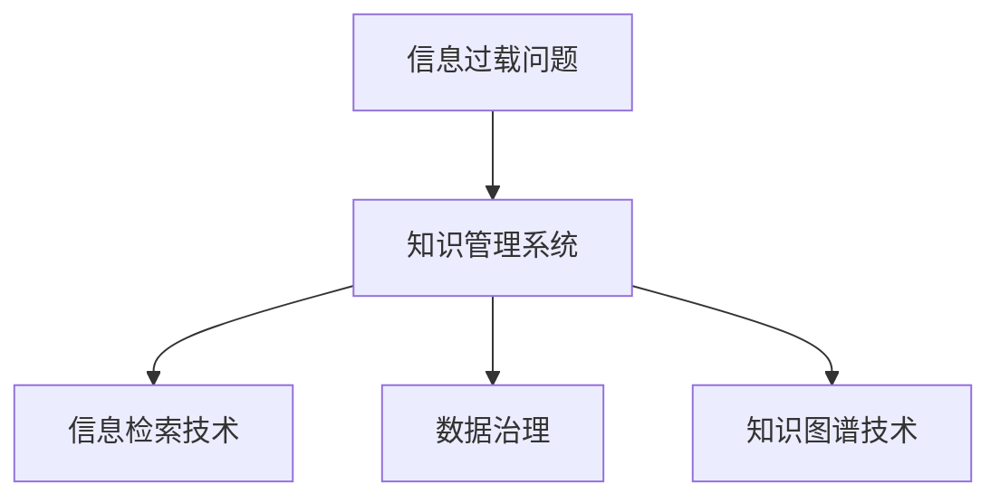
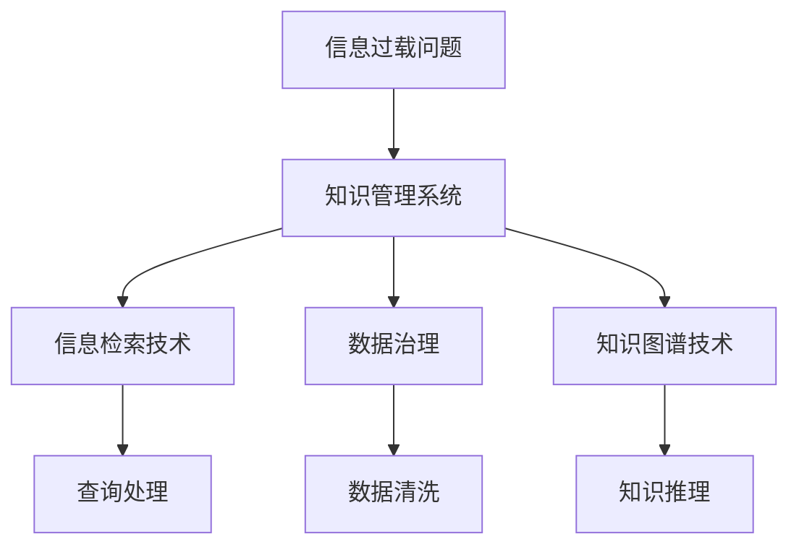

                 

# 信息过载与知识管理系统实施指南：有效组织和检索信息

> 关键词：信息过载,知识管理,信息检索,数据治理,知识图谱

## 1. 背景介绍

### 1.1 问题由来
在信息时代，知识呈现爆炸式增长，企业、组织和个人每天都面临大量的信息输入。这使得信息过载问题日益严重，难以有效管理和利用，降低了知识工作者的工作效率，影响决策质量。为了解决这一问题，知识管理系统（KMS）应运而生，成为信息时代的重要工具。

### 1.2 问题核心关键点
- 信息过载问题：在数据量爆炸的背景下，如何高效管理、存储和利用信息？
- 知识管理系统的定义：实现知识捕获、分类、组织、检索和重用的系统。
- 信息检索技术：如何快速、准确地从海量数据中检索出有用信息。
- 数据治理：保证数据的准确性、完整性和一致性，以便更好地利用。
- 知识图谱技术：构建知识网络，实现更深入的语义理解和知识推理。

这些核心概念之间的逻辑关系可以通过以下Mermaid流程图来展示：



这个流程图展示了解决信息过载问题的几个关键步骤和工具。

## 2. 核心概念与联系

### 2.1 核心概念概述

为更好地理解知识管理系统的实施和信息检索技术，本节将介绍几个密切相关的核心概念：

- **知识管理系统（KMS）**：利用计算机技术对知识进行管理、共享和重用的系统。包含知识库、文档管理系统、工作流引擎等功能模块。
- **信息检索**：从海量数据中快速、准确地获取相关信息的技术。
- **数据治理**：保证数据质量的管理活动，包括数据标准、数据安全和数据质量等。
- **知识图谱**：将知识表示为图结构的系统，用于语义搜索、知识推理和智能推荐。

这些核心概念之间的联系和依赖关系可以通过以下Mermaid流程图来展示：



这个流程图展示了解决信息过载问题时各个技术之间的联系和依赖关系。

## 3. 核心算法原理 & 具体操作步骤
### 3.1 算法原理概述

知识管理系统通过信息检索技术快速定位所需知识，通过数据治理保证数据质量，通过知识图谱实现语义搜索和知识推理。这些技术的核心算法原理如下：

- **信息检索算法**：利用倒排索引、向量空间模型、深度学习等技术，实现快速的信息查找和定位。
- **数据治理算法**：包括数据清洗、数据转换、数据质量控制等步骤，保证数据的准确性和一致性。
- **知识图谱算法**：通过实体关系抽取、图谱构建、知识推理等技术，构建知识网络，实现更深入的语义理解和知识推理。

### 3.2 算法步骤详解

知识管理系统的实施通常包括以下几个关键步骤：

**Step 1: 数据收集和预处理**
- 从不同来源收集数据，包括结构化数据（如数据库）、半结构化数据（如XML、JSON）和非结构化数据（如文本、图片）。
- 对数据进行预处理，包括数据清洗、数据转换、数据标注等。

**Step 2: 知识分类和组织**
- 利用分类算法（如K-means、决策树等）对数据进行初步分类。
- 构建知识分类体系，如文档分类、主题分类等。
- 利用元数据（如标题、摘要、标签等）进一步细化知识组织。

**Step 3: 信息检索技术应用**
- 构建倒排索引，快速定位相关文档。
- 利用向量空间模型或深度学习算法进行相似性计算。
- 提供全文搜索、高级搜索等功能。

**Step 4: 数据治理实践**
- 制定数据标准和规范，保证数据质量。
- 建立数据质量控制机制，定期监控数据质量。
- 实施数据备份和恢复策略，保证数据安全。

**Step 5: 知识图谱构建**
- 通过实体关系抽取技术，识别和抽取文档中的实体和关系。
- 利用图谱构建技术，将抽取的知识组织为知识图谱。
- 实施知识推理引擎，实现基于图谱的语义搜索和知识推理。

### 3.3 算法优缺点

知识管理系统的实施具有以下优点：
- 提高信息查找效率，节省时间。
- 保障数据质量，避免因数据错误导致的决策失误。
- 构建知识网络，实现更深入的语义理解和知识推理。

同时，该方法也存在一定的局限性：
- 需要大量的前期投入和专业知识。
- 对于非结构化数据处理和复杂数据治理，需要较高的技术难度。
- 系统的构建和维护成本较高，可能不适合小型企业和初创公司。

尽管存在这些局限性，但知识管理系统的实施仍是解决信息过载问题的有效途径。未来相关研究的重点在于如何进一步简化系统构建过程，提升系统的灵活性和易用性，同时兼顾数据安全和知识共享。

### 3.4 算法应用领域

知识管理系统的实施在多个领域得到了广泛应用，例如：

- **企业知识管理**：帮助企业构建知识库、文档管理系统，实现知识共享和重用。
- **政府信息管理**：构建政府信息资源目录，实现信息公开和信息检索。
- **教育知识管理**：构建在线教育平台，实现教学资源共享和知识管理。
- **科学研究**：构建科研知识库，实现科研成果的共享和交流。

这些应用领域展示了知识管理系统的广泛适用性和巨大潜力。

## 4. 数学模型和公式 & 详细讲解  
### 4.1 数学模型构建

知识管理系统的实施涉及多个数学模型，包括信息检索模型、数据治理模型和知识图谱模型。以向量空间模型为例，其数学模型构建如下：

假设有一个文本集合 $T=\{t_1, t_2, ..., t_n\}$，每个文本 $t_i$ 由 $d$ 个单词构成，记为 $t_i = (w_{i1}, w_{i2}, ..., w_{id})$。则文本向量的表示为：

$$
v(t_i) = (f(w_{i1}), f(w_{i2}), ..., f(w_{id}))
$$

其中 $f(w_i)$ 表示单词 $w_i$ 的特征向量，通常采用TF-IDF或word2vec等技术。

### 4.2 公式推导过程

假设要检索查询词 $q$，对应的向量为 $v(q)$，则信息检索的向量空间模型如下：

$$
r(q) = \frac{v(q) \cdot v(t_i)}{\|v(t_i)\| \cdot \|v(q)\|}
$$

其中 $r(q)$ 表示文本 $t_i$ 与查询词 $q$ 的相似度，$v(t_i) \cdot v(q)$ 表示向量点积，$\|v(t_i)\|$ 和 $\|v(q)\|$ 分别表示向量范数。

### 4.3 案例分析与讲解

假设查询词为 "人工智能"，对应的向量为 $v(q) = (1, 0, 0, ..., 1)$，文本集合中有一篇文档 $t_1 = (1, 1, 1, ..., 0)$，则该文档与查询词的相似度为：

$$
r(q) = \frac{1 \cdot 1 + 0 \cdot 1 + 0 \cdot 1 + 1 \cdot 0}{\sqrt{1^2 + 1^2 + 1^2 + 0^2} \cdot \sqrt{1^2 + 0^2 + 0^2 + 1^2}} = \frac{2}{\sqrt{3} \cdot 1} = \frac{2}{\sqrt{3}} \approx 0.94
$$

表示该文档与查询词 "人工智能" 的相似度较高。

## 5. 项目实践：代码实例和详细解释说明
### 5.1 开发环境搭建

在进行知识管理系统的实施前，我们需要准备好开发环境。以下是使用Python进行ELK Stack（Elasticsearch, Logstash, Kibana）开发的环境配置流程：

1. 安装Elasticsearch：从官网下载并安装Elasticsearch，建议选择 stable 版本。
2. 安装Logstash：从官网下载并安装Logstash，建议选择 stable 版本。
3. 安装Kibana：从官网下载并安装Kibana，建议选择 stable 版本。
4. 配置Elasticsearch和Logstash，并使其能够互相通信。
5. 配置Kibana，使其能够访问Elasticsearch。

完成上述步骤后，即可在Elasticsearch上搭建知识管理系统。

### 5.2 源代码详细实现

我们使用Elasticsearch作为知识管理系统的核心，以进行知识分类和组织。以下是一个简单的Python代码示例，用于在Elasticsearch中创建索引和文档：

```python
from elasticsearch import Elasticsearch

# 连接Elasticsearch
es = Elasticsearch(['localhost:9200'])

# 创建索引
es.indices.create(index='my_index', body={'settings': {'mappings': {
    'properties': {
        'title': {'type': 'text'},
        'content': {'type': 'text'}
    }
}}})

# 插入文档
doc = {
    'title': 'My First Document',
    'content': 'This is my first document in Elasticsearch.'
}
res = es.index(index='my_index', doc_type='my_doc', body=doc)
print(res['result'])
```

### 5.3 代码解读与分析

**Elasticsearch索引和文档的创建**：
- 使用 `es.indices.create()` 方法创建索引。
- 定义索引设置，包括字段类型和映射关系。
- 使用 `es.index()` 方法插入文档。

**数据治理实践**：
- 利用Elasticsearch的内置数据治理功能，可以方便地进行数据清洗和质量控制。
- 利用Elasticsearch的聚合和查询功能，可以实时监控数据质量，定期生成数据质量报告。
- 利用Elasticsearch的备份和恢复功能，可以保证数据的安全性和可靠性。

**知识图谱构建**：
- 利用Elasticsearch的文本分析工具，可以方便地进行实体关系抽取。
- 利用Elasticsearch的MapReduce功能，可以构建知识图谱。
- 利用Elasticsearch的查询处理引擎，可以实现基于图谱的语义搜索和知识推理。

## 6. 实际应用场景
### 6.1 企业知识管理

企业知识管理系统通常用于管理企业内部的文档、技术文档、专利等知识资源。通过构建知识分类体系，企业可以快速检索相关知识，提升工作效率。

在技术实现上，可以收集企业内部的文档、技术文档、专利等文本数据，并对其进行分类、组织和检索。利用Elasticsearch等搜索引擎技术，可以方便地实现知识检索和管理。

### 6.2 政府信息管理

政府信息管理系统通常用于管理政府公开信息、法律法规、政策文件等。通过构建信息分类体系，政府可以快速获取所需信息，提高信息公开效率。

在技术实现上，可以收集政府公开信息、法律法规、政策文件等文本数据，并对其进行分类、组织和检索。利用Elasticsearch等搜索引擎技术，可以方便地实现信息检索和管理。

### 6.3 教育知识管理

教育知识管理系统通常用于管理教学资源、科研成果、学术文献等。通过构建知识分类体系，教育机构可以快速检索相关知识，提升教学科研水平。

在技术实现上，可以收集教学资源、科研成果、学术文献等文本数据，并对其进行分类、组织和检索。利用Elasticsearch等搜索引擎技术，可以方便地实现知识检索和管理。

### 6.4 科学研究

科学研究管理系统通常用于管理科研成果、实验数据、研究论文等。通过构建知识分类体系，科研机构可以快速检索相关知识，促进科研合作和知识共享。

在技术实现上，可以收集科研成果、实验数据、研究论文等文本数据，并对其进行分类、组织和检索。利用Elasticsearch等搜索引擎技术，可以方便地实现知识检索和管理。

## 7. 工具和资源推荐
### 7.1 学习资源推荐

为了帮助开发者系统掌握知识管理系统的理论和实践，这里推荐一些优质的学习资源：

1. Elasticsearch官方文档：Elasticsearch的官方文档，包含详细的API和使用指南，是Elasticsearch学习的必备资料。
2. Kibana官方文档：Kibana的官方文档，包含详细的配置和使用指南，是Kibana学习的必备资料。
3. Logstash官方文档：Logstash的官方文档，包含详细的API和使用指南，是Logstash学习的必备资料。
4. 《Elasticsearch官方指南》：Elasticsearch官方指南，详细介绍了Elasticsearch的使用和最佳实践，适合初学者和中级用户。
5. 《Elasticsearch高级用户指南》：Elasticsearch高级用户指南，介绍了Elasticsearch的高级功能和最佳实践，适合高级用户。
6. 《Kibana官方指南》：Kibana官方指南，详细介绍了Kibana的使用和最佳实践，适合初学者和中级用户。
7. 《Kibana高级用户指南》：Kibana高级用户指南，介绍了Kibana的高级功能和最佳实践，适合高级用户。

通过对这些资源的学习实践，相信你一定能够快速掌握Elasticsearch、Logstash和Kibana的使用，并用于实现知识管理系统的各个功能模块。

### 7.2 开发工具推荐

高效的开发离不开优秀的工具支持。以下是几款用于知识管理系统开发的常用工具：

1. Python：Python是一种流行的编程语言，具有强大的数据处理和机器学习能力，是Elasticsearch、Logstash和Kibana的主要开发语言。
2. Elasticsearch：一种高性能的全文搜索引擎，支持多语言、高可用性、可扩展性等特性，是构建知识管理系统的核心工具。
3. Logstash：一种数据收集、处理和发送的日志工具，支持多种数据源和目标，是构建知识管理系统的数据处理引擎。
4. Kibana：一种基于Web的数据可视化工具，支持实时数据监控和报告生成，是构建知识管理系统的可视化界面。
5. Jupyter Notebook：一种交互式的编程环境，支持Python、R等多种编程语言，是数据分析和可视化的常用工具。
6. Apache NiFi：一种数据流处理平台，支持多种数据源和目标，是构建知识管理系统数据处理的常用工具。
7. Apache Kafka：一种高性能的消息队列系统，支持实时数据流处理和存储，是构建知识管理系统数据处理的常用工具。

合理利用这些工具，可以显著提升知识管理系统开发的速度和效率，加快创新迭代的步伐。

### 7.3 相关论文推荐

知识管理系统和Elasticsearch等搜索引擎技术的发展源于学界的持续研究。以下是几篇奠基性的相关论文，推荐阅读：

1. "An Analysis of the English Wikipedia's Link Structure"（维基百科链接结构分析）：GloVe等词向量模型的先驱工作。
2. "The Emergence of Google's Search Engine"（Google搜索引擎的崛起）：Elasticsearch等搜索引擎技术的起源。
3. "A Survey of Text Mining Techniques and Applications"（文本挖掘技术综述）：介绍文本分类、信息检索、情感分析等文本挖掘技术。
4. "The Role of Web and Social Media in Information Security"（网络与社交媒体在信息安全中的作用）：介绍信息检索技术在信息安全中的应用。
5. "Knowledge Graphs: Creating, Publishing and Querying Knowledge Bases"（知识图谱：创建、发布和查询知识库）：介绍知识图谱技术的理论和方法。
6. "A Survey of Deep Learning Techniques for Text Mining"（深度学习技术在文本挖掘中的应用综述）：介绍深度学习技术在信息检索、文本分类、情感分析等任务中的应用。

这些论文代表了大语言模型微调技术的发展脉络。通过学习这些前沿成果，可以帮助研究者把握学科前进方向，激发更多的创新灵感。

## 8. 总结：未来发展趋势与挑战

### 8.1 总结

本文对知识管理系统的实施和信息检索技术进行了全面系统的介绍。首先阐述了信息过载问题的背景和知识管理系统的定义，明确了信息检索技术、数据治理和知识图谱技术在知识管理中的重要作用。其次，从原理到实践，详细讲解了知识管理系统的实施步骤和具体技术。同时，本文还广泛探讨了知识管理系统在企业、政府、教育、科学研究等多个领域的应用前景，展示了知识管理系统的巨大潜力。

通过本文的系统梳理，可以看到，知识管理系统的实施和大规模信息检索技术是解决信息过载问题的有效途径。这些技术的不断发展和优化，必将进一步提升企业、政府等机构的效率和竞争力，推动社会的全面数字化转型。

### 8.2 未来发展趋势

展望未来，知识管理系统的实施和大规模信息检索技术将呈现以下几个发展趋势：

1. 智能推荐引擎：利用机器学习和深度学习技术，根据用户行为和偏好，提供个性化推荐服务。
2. 多模态数据融合：将文本、图像、视频等多模态数据进行融合，实现更全面、更深入的知识理解。
3. 实时数据处理：利用流式处理技术，实时处理和分析数据，提升信息检索和知识管理的效率。
4. 知识图谱扩展：构建更丰富、更准确的知识图谱，支持更深入的语义搜索和知识推理。
5. 数据隐私保护：引入数据隐私保护技术，保障数据安全和用户隐私。
6. 数据质量自动监控：利用自动化技术，实时监控数据质量，提高数据治理的效率。

这些趋势将进一步提升知识管理系统和大规模信息检索技术的性能和应用范围，为社会的数字化转型提供更强大的技术支持。

### 8.3 面临的挑战

尽管知识管理系统的实施和大规模信息检索技术已经取得了显著成就，但在迈向更加智能化、普适化应用的过程中，它们仍面临诸多挑战：

1. 数据隐私和安全：大规模数据处理和分析可能涉及敏感信息，如何保护用户隐私和数据安全成为一大难题。
2. 数据质量控制：数据质量和数据治理需要复杂的技术和大量的人力投入，如何降低成本和提高效率是关键问题。
3. 多模态数据融合：不同模态数据之间的融合和理解需要更加复杂的技术，如何实现高效、准确的融合仍然是一个难题。
4. 实时数据处理：实时数据处理需要高性能计算资源，如何在保证效率的同时，降低成本是一个挑战。
5. 数据隐私保护：如何在保障数据隐私的前提下，实现数据的有效利用和共享，是一个重要的研究方向。
6. 数据质量自动监控：自动监控数据质量需要更加精确和高效的算法，如何提高监控效率和准确性仍然是一个难题。

这些挑战将进一步推动知识管理系统和大规模信息检索技术的创新和优化，促使这些技术向更加智能、高效、安全的方向发展。

### 8.4 研究展望

面向未来，知识管理系统和大规模信息检索技术的研究方向将包括以下几个方面：

1. 引入更多先验知识：将符号化的先验知识，如知识图谱、逻辑规则等，与神经网络模型进行巧妙融合，引导知识管理系统的微调过程学习更准确、合理的知识表示。
2. 研究多模态数据融合技术：将文本、图像、视频等多模态数据进行融合，实现更全面、更深入的知识理解。
3. 引入因果分析和博弈论工具：将因果分析方法引入知识管理系统的微调过程，识别知识管理系统的决策关键特征，增强系统输出解释的因果性和逻辑性。
4. 研究知识图谱扩展技术：构建更丰富、更准确的知识图谱，支持更深入的语义搜索和知识推理。
5. 研究数据隐私保护技术：引入数据隐私保护技术，保障数据安全和用户隐私。
6. 研究实时数据处理技术：利用流式处理技术，实时处理和分析数据，提升信息检索和知识管理的效率。
7. 研究知识管理系统自动化技术：利用自动化技术，降低知识管理系统的维护和运营成本，提高系统效率。

这些研究方向将进一步推动知识管理系统和大规模信息检索技术的创新和发展，为社会的数字化转型提供更强大的技术支持。

## 9. 附录：常见问题与解答

**Q1：如何选择合适的知识分类体系？**

A: 知识分类体系的选择应该根据具体应用场景和数据特征进行。一般可以选择行业标准、领域专家推荐或自定义分类体系。在选择分类体系时，需要考虑数据量和数据复杂度，选择合适的大小和层级。

**Q2：如何评估知识管理系统的性能？**

A: 知识管理系统的性能评估可以从以下几个方面进行：
1. 检索效率：评估系统检索相关文档的速度和准确性。
2. 数据质量：评估系统的数据清洗和质量控制能力。
3. 数据可视化：评估系统的数据可视化和报告生成能力。
4. 用户体验：评估系统的易用性和用户满意度。

**Q3：知识管理系统的实施需要注意哪些问题？**

A: 知识管理系统的实施需要注意以下几个问题：
1. 数据来源和质量：确保数据来源可靠，数据质量高。
2. 数据标准和规范：制定数据标准和规范，保证数据一致性和可用性。
3. 数据安全和隐私：确保数据安全和用户隐私。
4. 系统性能和可扩展性：确保系统性能高、可扩展性强。
5. 用户培训和支持：提供用户培训和支持，确保用户能够顺利使用系统。

**Q4：知识管理系统的应用场景有哪些？**

A: 知识管理系统的应用场景包括：
1. 企业知识管理：帮助企业构建知识库、文档管理系统，实现知识共享和重用。
2. 政府信息管理：构建政府信息资源目录，实现信息公开和信息检索。
3. 教育知识管理：构建在线教育平台，实现教学资源共享和知识管理。
4. 科学研究：构建科研知识库，实现科研成果的共享和交流。

**Q5：知识管理系统的数据治理策略有哪些？**

A: 知识管理系统的数据治理策略包括：
1. 数据清洗：清洗脏数据，保证数据质量。
2. 数据转换：将不同格式的数据进行转换，实现统一数据格式。
3. 数据标注：对数据进行标注，便于后续分析和处理。
4. 数据质量控制：实时监控数据质量，定期生成数据质量报告。
5. 数据备份和恢复：建立数据备份和恢复机制，保证数据安全。

通过本文的系统梳理，可以看到，知识管理系统和大规模信息检索技术是解决信息过载问题的有效途径。这些技术的不断发展和优化，必将进一步提升企业、政府等机构的效率和竞争力，推动社会的全面数字化转型。

