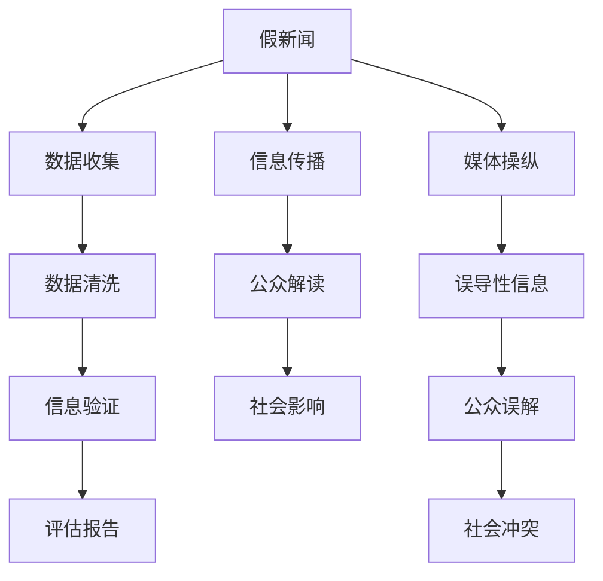

                 

# 信息验证和在线媒体素养：为假新闻和媒体操纵做好准备

## 1. 背景介绍

在现代社会，信息传播的途径和速度都发生了革命性的变化。互联网和社交媒体让信息传播更加迅速和广泛，但也带来了假新闻、误导性信息和媒体操纵的挑战。随着技术的进步，尤其是人工智能和大数据技术的发展，这些挑战变得更加复杂和隐蔽。如何提升公众的信息素养，特别是对假新闻的辨识能力，成为当前亟需解决的重要问题。本文将探讨信息验证和在线媒体素养的原理、算法、操作步骤，并提供详细的代码实例和应用场景分析。

## 2. 核心概念与联系

### 2.1 核心概念概述

在讨论信息验证和在线媒体素养之前，我们需要了解一些核心概念：

- **假新闻(Fake News)**：指通过捏造事实、断章取义、夸大或缩小信息等手段，误导公众的虚假新闻报道。假新闻不仅误导受众，还可能引发恐慌、分化和冲突。
- **信息素养(Information Literacy)**：指公众获取、评估、整合和应用信息的能力。信息素养高的个体能够识别可靠信息，辨别假新闻，并批判性地思考信息的真实性和相关性。
- **媒体操纵(Media Manipulation)**：指利用技术手段，对信息进行有意误导、夸大或隐瞒，以达到特定目的的行为。媒体操纵可能包括假新闻、选择性报道、数据操纵等。

### 2.2 核心概念原理和架构的 Mermaid 流程图



这个流程图展示了假新闻、媒体操纵、信息传播和公众解读之间的关系。假新闻通过数据收集和清洗产生，通过媒体操纵被传播出去，并影响公众解读，最终可能导致社会冲突。

## 3. 核心算法原理 & 具体操作步骤

### 3.1 算法原理概述

信息验证的核心算法包括自然语言处理(NLP)、文本分类、实体识别和事实核查等。这些算法通过分析文本内容、识别关键信息、验证事实等方式，帮助识别和辨别假新闻。

### 3.2 算法步骤详解

#### 3.2.1 数据收集

数据收集是信息验证的第一步。这包括从各种来源收集文本数据，如新闻文章、社交媒体帖子、论坛评论等。数据收集需要确保数据的全面性和多样性，覆盖不同的主题和观点。

#### 3.2.2 数据清洗

数据清洗是去除噪声、纠正错误和规范数据格式的过程。这包括去除重复内容、纠正拼写错误、统一格式等。清洗后的数据能够更准确地进行后续的分析和验证。

#### 3.2.3 信息验证

信息验证是识别假新闻的核心步骤。这包括文本分类、实体识别和事实核查。

- **文本分类**：通过机器学习模型将文本分为真新闻和假新闻两类。
- **实体识别**：识别文本中的关键实体，如人名、地名、机构名等，以验证其真实性。
- **事实核查**：使用事实核查数据库，验证文本中的事实陈述是否真实。

#### 3.2.4 评估报告

评估报告是对信息验证结果的总结和分析。这包括识别假新闻的来源、方法和传播路径，以及分析假新闻对公众和社会的影响。评估报告可以帮助公众和媒体更好地理解假新闻的本质和危害。

### 3.3 算法优缺点

**优点：**
- 自动化流程，提高效率。
- 覆盖大规模数据，减少人为偏见。
- 多维度分析，提供全面的评估。

**缺点：**
- 模型可能存在偏差，影响准确性。
- 依赖于数据质量，数据不全或错误将影响结果。
- 无法替代人类判断，需要结合人工审查。

### 3.4 算法应用领域

信息验证和在线媒体素养的应用领域广泛，包括但不限于：

- 新闻媒体：用于检测和阻止假新闻的传播。
- 政府机构：用于公共事务中的信息监控和预警。
- 教育系统：提升公众的信息素养和媒体识别能力。
- 企业营销：用于识别和应对假新闻和误导性信息。

## 4. 数学模型和公式 & 详细讲解 & 举例说明

### 4.1 数学模型构建

信息验证的数学模型主要包括文本分类模型、实体识别模型和事实核查模型。

#### 4.1.1 文本分类模型

文本分类模型的目标是将文本分为真新闻和假新闻两类。常用的模型包括朴素贝叶斯、支持向量机、深度学习模型（如卷积神经网络CNN、循环神经网络RNN和Transformer）。

以Transformer模型为例，其结构如下：

$$
\text{Transformer} = \text{Encoder} + \text{Decoder} + \text{Softmax}
$$

其中，Encoder和Decoder是自注意力机制，Softmax是输出层。

#### 4.1.2 实体识别模型

实体识别模型用于识别文本中的关键实体。常用的模型包括条件随机场（CRF）、递归神经网络（RNN）和BERT模型。

以BERT模型为例，其结构如下：

$$
\text{BERT} = \text{Embedding} + \text{Transformer} + \text{LayerNorm} + \text{Softmax}
$$

其中，Embedding将输入文本转换为向量表示，Transformer进行自注意力机制，LayerNorm进行归一化，Softmax输出实体类别。

#### 4.1.3 事实核查模型

事实核查模型用于验证文本中的事实陈述是否真实。常用的模型包括逻辑推理、知识图谱和基于大规模语料的事实核查数据库。

以FactCheckNet为例，其结构如下：

$$
\text{FactCheckNet} = \text{Fact-Check} + \text{Knowledge Graph} + \text{DB}
$$

其中，Fact-Check进行事实核查，Knowledge Graph进行知识推理，DB是事实核查数据库。

### 4.2 公式推导过程

#### 4.2.1 文本分类模型的损失函数

假设文本分类模型有$n$个类别，训练样本为$(x_i, y_i)$，其中$x_i$为文本，$y_i$为类别标签。分类模型的目标是最小化交叉熵损失函数：

$$
L(x_i, y_i) = -y_i \log P(y_i|x_i) - (1-y_i) \log (1-P(y_i|x_i))
$$

其中，$P(y_i|x_i)$是模型对$x_i$属于类别$y_i$的概率估计。

#### 4.2.2 实体识别模型的损失函数

假设实体识别模型有$k$个实体类别，训练样本为$(x_i, y_i)$，其中$x_i$为文本，$y_i$为实体标签序列。实体识别模型的目标是最小化交叉熵损失函数：

$$
L(x_i, y_i) = -\sum_{j=1}^n \log P(y_j|x_i)
$$

其中，$P(y_j|x_i)$是模型对$x_i$中第$j$个实体为$y_j$的概率估计。

#### 4.2.3 事实核查模型的损失函数

假设事实核查模型有$m$个事实陈述，训练样本为$(x_i, y_i)$，其中$x_i$为文本，$y_i$为事实标签序列。事实核查模型的目标是最小化损失函数：

$$
L(x_i, y_i) = \sum_{j=1}^m (y_{ij} \log P(y_{ij}|x_i) + (1-y_{ij}) \log (1-P(y_{ij}|x_i)))
$$

其中，$P(y_{ij}|x_i)$是模型对$x_i$中第$j$个事实陈述为$y_{ij}$的概率估计。

### 4.3 案例分析与讲解

以CNN-LSTM模型为例，其结构如下：

$$
\text{CNN-LSTM} = \text{CNN} + \text{LSTM} + \text{Softmax}
$$

其中，CNN用于提取文本特征，LSTM用于序列建模，Softmax用于分类。

以假新闻检测为例，训练过程如下：

1. **数据预处理**：将文本转换为数值向量，进行归一化和截断。
2. **模型训练**：将预处理后的数据输入CNN-LSTM模型，计算损失函数，更新模型参数。
3. **模型评估**：在测试集上评估模型性能，计算准确率、召回率和F1分数。

## 5. 项目实践：代码实例和详细解释说明

### 5.1 开发环境搭建

1. 安装Python：
   ```bash
   sudo apt-get update
   sudo apt-get install python3-pip
   ```

2. 安装TensorFlow：
   ```bash
   pip install tensorflow
   ```

3. 安装Keras：
   ```bash
   pip install keras
   ```

### 5.2 源代码详细实现

以下是一个简单的文本分类模型的实现，用于判断新闻文本是真新闻还是假新闻。

```python
from tensorflow.keras.models import Sequential
from tensorflow.keras.layers import Embedding, Conv1D, MaxPooling1D, Flatten, Dense
from tensorflow.keras.preprocessing.text import Tokenizer
from tensorflow.keras.preprocessing.sequence import pad_sequences
import numpy as np

# 数据预处理
sentences = ['This is a real news article.', 'This is a fake news article.']
labels = [0, 1]

# 分词
tokenizer = Tokenizer(num_words=1000)
tokenizer.fit_on_texts(sentences)
sequences = tokenizer.texts_to_sequences(sentences)

# 填充
maxlen = 20
padded_sequences = pad_sequences(sequences, maxlen=maxlen)

# 模型构建
model = Sequential()
model.add(Embedding(1000, 100, input_length=maxlen))
model.add(Conv1D(128, 5, activation='relu'))
model.add(MaxPooling1D(pool_size=4))
model.add(Flatten())
model.add(Dense(1, activation='sigmoid'))

# 模型编译
model.compile(loss='binary_crossentropy', optimizer='adam', metrics=['accuracy'])

# 模型训练
model.fit(padded_sequences, np.array(labels), epochs=10, batch_size=1)

# 模型评估
test_sequences = ['This is another real news article.', 'This is another fake news article.']
test_sequences = tokenizer.texts_to_sequences(test_sequences)
test_padded_sequences = pad_sequences(test_sequences, maxlen=maxlen)
predictions = model.predict(test_padded_sequences)
```

### 5.3 代码解读与分析

1. **数据预处理**：将文本转换为数值向量，并进行填充，确保所有文本长度相同。
2. **模型构建**：使用CNN和LSTM进行特征提取和序列建模，最后通过全连接层进行分类。
3. **模型编译**：设置损失函数、优化器和评估指标。
4. **模型训练**：在训练集上训练模型，更新参数。
5. **模型评估**：在测试集上评估模型性能，输出预测结果。

## 6. 实际应用场景

### 6.1 新闻媒体

新闻媒体是假新闻的主要传播渠道。通过信息验证技术，新闻媒体可以检测和阻止假新闻的传播，提升媒体公信力。

### 6.2 政府机构

政府机构需要监控和预警假新闻，以维护公共秩序和社会稳定。信息验证技术可以辅助政府机构进行信息监控和舆论引导。

### 6.3 教育系统

教育系统可以提升学生的媒体素养和信息识别能力。通过信息验证技术，学生可以学习如何辨别假新闻，增强信息素养。

### 6.4 企业营销

企业营销需要识别和应对假新闻和误导性信息，保护品牌形象。信息验证技术可以辅助企业进行舆论监测和危机管理。

## 7. 工具和资源推荐

### 7.1 学习资源推荐

1. **《信息验证与在线媒体素养》**：详细介绍了信息验证和在线媒体素养的基本概念和最新进展。
2. **Coursera上的《自然语言处理》课程**：涵盖文本分类、实体识别、事实核查等关键技术。
3. **Kaggle上的数据集和竞赛**：提供真实世界的数据集和竞赛，用于实践和评估。

### 7.2 开发工具推荐

1. **TensorFlow**：强大的深度学习框架，支持多种模型和算法。
2. **Keras**：易于使用的深度学习框架，提供了高层次的API。
3. **PyTorch**：灵活的深度学习框架，支持动态图和静态图。

### 7.3 相关论文推荐

1. **假新闻检测：一种基于深度学习的框架**：详细介绍了深度学习在假新闻检测中的应用。
2. **自然语言处理中的事实核查技术**：介绍了事实核查技术的最新进展和应用。
3. **媒体素养教育与信息验证**：探讨了媒体素养教育中信息验证的重要性。

## 8. 总结：未来发展趋势与挑战

### 8.1 研究成果总结

信息验证和在线媒体素养技术已经取得了显著进展，但仍有诸多挑战需要克服。未来需要在以下几个方面继续探索：

1. **模型精度和鲁棒性**：提高模型的准确率和鲁棒性，减少误报和漏报。
2. **数据多样性和质量**：增加数据多样性，提升数据质量，减少数据偏见。
3. **用户参与和反馈**：引入用户参与和反馈机制，增强模型的实用性和可信度。
4. **多模态信息融合**：融合文本、图像、视频等多种信息，提升信息验证的全面性。

### 8.2 未来发展趋势

1. **深度学习和大数据**：深度学习和大数据技术将继续推动信息验证和在线媒体素养的进展。
2. **多模态信息融合**：融合文本、图像、视频等多种信息，提升信息验证的全面性。
3. **用户参与和反馈**：引入用户参与和反馈机制，增强模型的实用性和可信度。

### 8.3 面临的挑战

1. **数据偏见**：数据偏见可能导致模型对某些群体或观点的误判。
2. **模型鲁棒性**：模型可能对新出现的假新闻和误导性信息缺乏鲁棒性。
3. **用户接受度**：用户可能对信息验证技术持怀疑态度，缺乏信任感。

### 8.4 研究展望

未来需要从以下几个方面进行深入研究：

1. **公平性和可解释性**：提升模型的公平性和可解释性，减少数据偏见和误判。
2. **人机协作**：探索人机协作模式，结合人工审查和机器学习，提升信息验证的效果。
3. **跨领域应用**：将信息验证技术应用于更多领域，如医疗、金融等，提升应用范围。

## 9. 附录：常见问题与解答

**Q1: 信息验证和在线媒体素养技术的核心是什么？**

A: 信息验证和在线媒体素养技术的核心是自然语言处理和文本分类，通过深度学习模型对文本进行分类和验证，提升公众的信息素养。

**Q2: 信息验证和在线媒体素养技术的局限性有哪些？**

A: 信息验证和在线媒体素养技术的局限性包括数据偏见、模型鲁棒性不足、用户接受度低等。

**Q3: 如何提升信息验证和在线媒体素养技术的效果？**

A: 提升信息验证和在线媒体素养技术的效果需要增加数据多样性、提高模型精度和鲁棒性、引入用户参与和反馈机制等。

**Q4: 信息验证和在线媒体素养技术有哪些应用场景？**

A: 信息验证和在线媒体素养技术的应用场景包括新闻媒体、政府机构、教育系统、企业营销等。

---

作者：禅与计算机程序设计艺术 / Zen and the Art of Computer Programming

