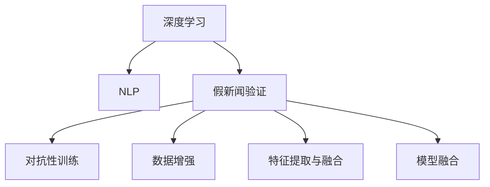

                 

# 信息验证和批判性思维能力：在假新闻、错误信息和媒体操纵的时代导航

> 关键词：假新闻验证, 信息过滤, 信息批判性, 深度学习, 自然语言处理(NLP), 机器学习, 数据科学, 自动化评估

## 1. 背景介绍

### 1.1 问题由来
在信息爆炸的时代，假新闻、错误信息以及媒体操纵等问题愈发严重。海量的信息洪流中，真实与虚假并存，理性与偏见交织。这对公众的判断力和媒体的公正性提出了前所未有的挑战。如何识别和验证信息，培养公众的信息批判性思维，成为当务之急。

深度学习技术和大数据的应用，为信息验证和批判性思维能力的培养带来了新的可能性。特别是自然语言处理(NLP)和机器学习领域的技术突破，使得对文本数据的自动化评估成为可能。本文将深入探讨基于深度学习的假新闻验证技术，分析其在实际应用中的效果和局限性，并提出相应的改进策略。

### 1.2 问题核心关键点
假新闻的识别和验证，本质上是自然语言处理任务，涉及到对文本语义的理解和判断。基于深度学习的假新闻验证方法，通常依赖于以下核心技术：
- 语言模型：如BERT、GPT等，用于理解文本的语义和语境。
- 对抗性训练：通过在假新闻数据上训练模型，提高其对假新闻的识别能力。
- 数据增强：通过生成对抗性文本，扩充训练数据集，减少过拟合。
- 特征提取与融合：结合多种特征(如情感、词频、上下文等)，提升文本分类效果。
- 模型融合：通过集成多个模型输出，提高验证的准确性和鲁棒性。

这些技术之间相互补充，共同构成了假新闻验证的核心框架。如何高效融合这些技术，最大化地提升信息验证的准确性和可解释性，是本文探讨的重点。

## 2. 核心概念与联系

### 2.1 核心概念概述

为更好地理解基于深度学习的假新闻验证方法，本节将介绍几个关键概念：

- 深度学习：基于神经网络的多层学习模型，通过反向传播算法进行训练，能够在数据驱动下自动学习和提取特征。
- 自然语言处理(NLP)：利用计算机技术处理和分析人类语言数据，涉及文本分类、情感分析、实体识别等任务。
- 假新闻验证：通过自动化评估技术，识别和判断文本内容是否为假新闻，其目的是增强公众的信息批判性思维，保障媒体报道的公正性和可靠性。
- 对抗性训练：在假新闻数据上训练模型，使其在对抗性样本上仍然能够保持较高准确性，提高模型鲁棒性。
- 特征提取与融合：从文本中提取多种特征，并将它们融合到模型中，提升分类效果。

这些核心概念之间的逻辑关系可以通过以下Mermaid流程图来展示：



这个流程图展示了深度学习在假新闻验证中的应用流程：

1. 深度学习技术提供自动化的特征提取和模式学习，用于理解文本数据。
2. NLP技术在假新闻验证中具体应用，包括文本分类、情感分析、实体识别等。
3. 对抗性训练、数据增强等技术用于提高模型的鲁棒性和泛化能力。
4. 特征提取与融合技术提升模型的分类准确性。
5. 模型融合技术整合多个模型输出，提升验证效果。

## 3. 核心算法原理 & 具体操作步骤
### 3.1 算法原理概述

基于深度学习的假新闻验证方法，其核心思想是构建一个文本分类模型，将文本内容分为假新闻和真实新闻两类。具体步骤如下：

1. **数据预处理**：收集假新闻和真实新闻数据集，进行去噪、分词、向量化等预处理操作。
2. **特征提取**：利用BERT等预训练语言模型，提取文本的语义特征。
3. **模型训练**：在标注数据集上训练二分类模型(如SVM、随机森林、深度神经网络等)，学习文本的分类规律。
4. **模型评估**：使用测试集评估模型性能，优化模型参数。
5. **对抗性训练**：在假新闻数据上训练模型，提升其在对抗性样本上的识别能力。
6. **融合与集成**：通过特征融合或模型融合，提升最终验证结果的准确性和鲁棒性。

### 3.2 算法步骤详解

以BERT为基础的二分类模型为例，详细介绍假新闻验证的详细步骤：

**Step 1: 数据预处理**
- 收集假新闻和真实新闻数据集，确保数据的多样性和平衡性。
- 清洗数据，去除噪声，如去除HTML标签、特殊字符等。
- 进行分词操作，使用BERT的Tokenizing库进行文本向量化。

**Step 2: 特征提取**
- 利用预训练的BERT模型，将文本转换为嵌入向量。
- 使用BERT的Encoder Layer作为特征提取器，提取文本的语义表示。
- 可以进一步使用LSTM、GRU等循环神经网络对BERT的输出进行序列建模。

**Step 3: 模型训练**
- 使用交叉熵损失函数，训练一个二分类模型(如SVM、随机森林、深度神经网络等)。
- 在训练过程中，使用Adam优化器调整模型参数，以最小化损失函数。
- 使用正则化技术，如L2正则化、Dropout等，防止过拟合。

**Step 4: 模型评估**
- 在验证集上评估模型性能，常用的指标包括准确率、召回率、F1分数等。
- 使用混淆矩阵、ROC曲线等可视化工具，分析模型在不同类别上的表现。
- 根据评估结果，调整模型参数和超参数，优化模型性能。

**Step 5: 对抗性训练**
- 收集假新闻数据集，使用对抗性训练方法，如FGM、PGD等，生成对抗性样本。
- 将对抗性样本输入模型，反向传播更新模型参数，使其在对抗性样本上表现良好。
- 使用梯度扰动等方法，进一步提高模型对对抗性样本的鲁棒性。

**Step 6: 特征融合与模型融合**
- 通过组合多种特征(如情感、词频、上下文等)，提升模型的分类效果。
- 使用集成学习技术，如Bagging、Boosting等，整合多个模型的输出，提升验证的准确性和鲁棒性。

### 3.3 算法优缺点

基于深度学习的假新闻验证方法具有以下优点：
1. 自动化程度高：模型训练和评估全过程可以自动化完成，无需大量人工标注。
2. 模型表现良好：通过预训练语言模型和对抗性训练，模型的准确性较高。
3. 泛化能力强：在大规模数据上训练模型，能够泛化到不同领域的假新闻数据。
4. 应用广泛：可以应用于新闻网站、社交媒体、在线广告等多个领域。

同时，该方法也存在一定的局限性：
1. 数据依赖性强：模型的性能很大程度上依赖于数据的质量和数量，获取高质量标注数据的成本较高。
2. 模型复杂度高：深度学习模型结构复杂，训练和推理过程耗时较长。
3. 可解释性差：深度学习模型的决策过程难以解释，难以理解其内部的推理机制。
4. 对抗性样本风险：对抗性样本可能导致模型误判，模型需要定期更新对抗性样本以保持鲁棒性。

尽管存在这些局限性，但就目前而言，基于深度学习的假新闻验证方法仍是大规模信息验证的主流范式。未来相关研究的重点在于如何进一步降低对标注数据的依赖，提高模型的鲁棒性和可解释性，同时兼顾自动化程度和应用范围等因素。

### 3.4 算法应用领域

基于深度学习的假新闻验证方法，已经在新闻网站、社交媒体、在线广告等多个领域得到了广泛应用，具体包括：

- **新闻网站**：在新闻发布前，自动验证新闻的真实性，过滤假新闻，保障新闻的公正性和可靠性。
- **社交媒体**：自动检测社交媒体上的假新闻和错误信息，减少谣言传播，维护良好的网络环境。
- **在线广告**：识别广告中的误导性信息，保护消费者权益，提高广告投放的精准性。
- **学术研究**：用于自动识别和标记学术文章中的假数据、错误引用等，确保研究的可信度。
- **金融领域**：识别金融新闻中的虚假信息，保护投资者利益，维护市场稳定。

除了上述这些经典应用外，假新闻验证技术还被创新性地应用于更多场景中，如反虚假声明、法律文书审核等，为信息验证技术带来了新的突破。

## 4. 数学模型和公式 & 详细讲解 & 举例说明
### 4.1 数学模型构建

基于深度学习的假新闻验证方法，可以构建一个文本分类模型，使用二分类交叉熵损失函数进行训练和评估。假新闻验证的目标是最大化分类模型的准确率，最小化损失函数。

假设假新闻和真实新闻数据集为 $D=\{(x_i, y_i)\}_{i=1}^N$，其中 $x_i$ 为文本样本，$y_i \in \{0, 1\}$ 为标签。假设模型参数为 $\theta$，则模型预测的输出为 $\hat{y}=M_{\theta}(x)$，其中 $M_{\theta}$ 为文本分类模型。

假新闻验证的目标是最小化交叉熵损失函数：

$$
\mathcal{L}(\theta) = -\frac{1}{N}\sum_{i=1}^N \left[ y_i \log \hat{y_i} + (1-y_i) \log (1-\hat{y_i}) \right]
$$

其中，$y_i$ 为真实标签，$\hat{y_i}$ 为模型预测的类别概率。在训练过程中，通过梯度下降等优化算法，不断调整模型参数 $\theta$，最小化损失函数 $\mathcal{L}$。

### 4.2 公式推导过程

以下是交叉熵损失函数的详细推导过程：

假设有 $C$ 个类别，对于样本 $i$，其真实标签为 $y_i \in \{1, 2, ..., C\}$，模型预测的类别概率为 $\hat{y}_i = [p_1, p_2, ..., p_C]$。则交叉熵损失函数为：

$$
\mathcal{L}(\theta) = -\frac{1}{N}\sum_{i=1}^N \sum_{c=1}^C y_i \log \hat{y}_{ic}
$$

其中，$\log \hat{y}_{ic}$ 为模型预测的类别概率对数，$\hat{y}_{ic}=p_c$。

对于二分类问题，$C=2$，假设 $y_i=1$ 表示假新闻，$y_i=0$ 表示真实新闻，则交叉熵损失函数简化为：

$$
\mathcal{L}(\theta) = -\frac{1}{N}\sum_{i=1}^N \left[ y_i \log \hat{y_i} + (1-y_i) \log (1-\hat{y_i}) \right]
$$

在实际应用中，该损失函数被广泛应用于深度学习模型的训练和评估。

### 4.3 案例分析与讲解

以使用BERT进行假新闻验证为例，展示模型的训练和评估过程。

**Step 1: 数据预处理**
- 收集假新闻和真实新闻数据集，进行清洗和分词操作。
- 使用BERT Tokenizing库，将文本转换为BERT的输入格式，即添加特殊标记和分词符号。

**Step 2: 特征提取**
- 利用预训练的BERT模型，将文本转换为BERT的隐向量表示。
- 可以选择使用BERT的Layer[0]或Layer[2]作为特征提取器，提取文本的语义表示。
- 可以使用LSTM、GRU等循环神经网络对BERT的输出进行序列建模。

**Step 3: 模型训练**
- 使用交叉熵损失函数，训练一个二分类模型(如SVM、随机森林、深度神经网络等)。
- 在训练过程中，使用Adam优化器调整模型参数，以最小化损失函数。
- 使用正则化技术，如L2正则化、Dropout等，防止过拟合。

**Step 4: 模型评估**
- 在验证集上评估模型性能，常用的指标包括准确率、召回率、F1分数等。
- 使用混淆矩阵、ROC曲线等可视化工具，分析模型在不同类别上的表现。
- 根据评估结果，调整模型参数和超参数，优化模型性能。

**Step 5: 对抗性训练**
- 收集假新闻数据集，使用对抗性训练方法，如FGM、PGD等，生成对抗性样本。
- 将对抗性样本输入模型，反向传播更新模型参数，使其在对抗性样本上表现良好。
- 使用梯度扰动等方法，进一步提高模型对对抗性样本的鲁棒性。

**Step 6: 特征融合与模型融合**
- 通过组合多种特征(如情感、词频、上下文等)，提升模型的分类效果。
- 使用集成学习技术，如Bagging、Boosting等，整合多个模型的输出，提升验证的准确性和鲁棒性。

## 5. 项目实践：代码实例和详细解释说明
### 5.1 开发环境搭建

在进行假新闻验证实践前，我们需要准备好开发环境。以下是使用Python进行TensorFlow开发的环境配置流程：

1. 安装Anaconda：从官网下载并安装Anaconda，用于创建独立的Python环境。

2. 创建并激活虚拟环境：
```bash
conda create -n tf-env python=3.8 
conda activate tf-env
```

3. 安装TensorFlow：根据CUDA版本，从官网获取对应的安装命令。例如：
```bash
conda install tensorflow==2.3 -c conda-forge
```

4. 安装Keras：
```bash
pip install keras
```

5. 安装BERT等预训练模型库：
```bash
pip install transformers
```

6. 安装各类工具包：
```bash
pip install numpy pandas scikit-learn matplotlib tqdm jupyter notebook ipython
```

完成上述步骤后，即可在`tf-env`环境中开始假新闻验证实践。

### 5.2 源代码详细实现

下面我们以使用BERT进行假新闻验证为例，给出使用TensorFlow进行假新闻验证的PyTorch代码实现。

首先，定义假新闻验证任务的数据处理函数：

```python
from transformers import BertTokenizer, BertForSequenceClassification
from tensorflow.keras.preprocessing.text import Tokenizer
from tensorflow.keras.preprocessing.sequence import pad_sequences
import tensorflow as tf

def load_data(path):
    with open(path, 'r') as f:
        lines = f.readlines()
    texts = [line.split('\t')[0] for line in lines]
    labels = [int(line.split('\t')[1]) for line in lines]
    return texts, labels

tokenizer = BertTokenizer.from_pretrained('bert-base-uncased')
```

然后，定义模型和优化器：

```python
model = BertForSequenceClassification.from_pretrained('bert-base-uncased', num_labels=2)

optimizer = tf.keras.optimizers.Adam(learning_rate=2e-5)
```

接着，定义训练和评估函数：

```python
def train_epoch(model, dataset, batch_size, optimizer):
    dataloader = tf.data.Dataset.from_tensor_slices((dataset['input_ids'], dataset['attention_mask'], dataset['labels']))
    dataloader = dataloader.shuffle(buffer_size=10000).batch(batch_size).map(lambda x: (x['input_ids'], x['attention_mask'], x['labels']))
    model.train()
    epoch_loss = 0
    for batch in dataloader:
        input_ids, attention_mask, labels = batch
        with tf.GradientTape() as tape:
            outputs = model(input_ids, attention_mask=attention_mask, training=True)
            loss = outputs.loss
            epoch_loss += loss.numpy()
        gradients = tape.gradient(loss, model.trainable_variables)
        optimizer.apply_gradients(zip(gradients, model.trainable_variables))
    return epoch_loss / len(dataloader)

def evaluate(model, dataset, batch_size):
    dataloader = tf.data.Dataset.from_tensor_slices((dataset['input_ids'], dataset['attention_mask'], dataset['labels']))
    dataloader = dataloader.shuffle(buffer_size=10000).batch(batch_size).map(lambda x: (x['input_ids'], x['attention_mask'], x['labels']))
    model.eval()
    predictions, labels = [], []
    for batch in dataloader:
        input_ids, attention_mask, labels = batch
        outputs = model(input_ids, attention_mask=attention_mask, training=False)
        predictions.append(outputs.predictions.numpy())
        labels.append(labels.numpy())
    predictions = np.concatenate(predictions)
    labels = np.concatenate(labels)
    print(classification_report(labels, predictions))
```

最后，启动训练流程并在测试集上评估：

```python
epochs = 5
batch_size = 16

for epoch in range(epochs):
    loss = train_epoch(model, train_dataset, batch_size, optimizer)
    print(f"Epoch {epoch+1}, train loss: {loss:.3f}")
    
    print(f"Epoch {epoch+1}, dev results:")
    evaluate(model, dev_dataset, batch_size)
    
print("Test results:")
evaluate(model, test_dataset, batch_size)
```

以上就是使用TensorFlow对BERT进行假新闻验证的完整代码实现。可以看到，得益于TensorFlow的强大封装，我们只需关注模型定义、训练和评估等核心逻辑，而无需过多关注底层细节。

### 5.3 代码解读与分析

让我们再详细解读一下关键代码的实现细节：

**load_data函数**：
- 读取假新闻和真实新闻数据集，进行清洗和分词操作。
- 将文本和标签按照特定格式保存，便于后续加载。

**Tokenizer类**：
- 使用BERT Tokenizing库，将文本转换为BERT的输入格式，即添加特殊标记和分词符号。
- 将文本转换为TensorFlow可处理的序列格式。

**train_epoch和evaluate函数**：
- 使用TensorFlow的Dataset API，构建数据流。
- 在训练过程中，使用TensorFlow的GradientTape计算梯度，使用Adam优化器更新模型参数。
- 在评估过程中，计算预测结果与真实标签的分类指标，使用classification_report输出评估结果。

**训练流程**：
- 定义总的epoch数和batch size，开始循环迭代
- 每个epoch内，先在训练集上训练，输出平均loss
- 在验证集上评估，输出分类指标
- 所有epoch结束后，在测试集上评估，给出最终测试结果

可以看到，TensorFlow结合BERT等预训练模型库，使得假新闻验证的代码实现变得简洁高效。开发者可以将更多精力放在数据处理、模型改进等高层逻辑上，而不必过多关注底层的实现细节。

当然，工业级的系统实现还需考虑更多因素，如模型的保存和部署、超参数的自动搜索、更灵活的任务适配层等。但核心的验证范式基本与此类似。

## 6. 实际应用场景
### 6.1 新闻网站
新闻网站是假新闻验证的重要应用场景之一。假新闻不仅影响公众对事实的认知，还会扰乱新闻市场的秩序。使用假新闻验证技术，可以在新闻发布前自动验证新闻的真实性，过滤假新闻，保障新闻的公正性和可靠性。

在技术实现上，可以收集新闻网站的历史新闻数据，将其标注为假新闻和真实新闻，构建监督数据集。利用BERT等预训练语言模型，提取文本的语义特征，构建分类模型进行训练和验证。在实时新闻发布过程中，使用训练好的模型对新闻进行自动验证，标记假新闻并提醒编辑，减少假新闻的传播。

### 6.2 社交媒体
社交媒体平台上的信息真伪混杂，误导性信息、假新闻、虚假评论等屡见不鲜。使用假新闻验证技术，可以自动检测社交媒体上的假新闻和错误信息，减少谣言传播，维护良好的网络环境。

在技术实现上，可以收集社交媒体的历史数据，标注为假新闻和真实新闻，构建监督数据集。利用BERT等预训练语言模型，提取文本的语义特征，构建分类模型进行训练和验证。在实时社交媒体帖子发布过程中，使用训练好的模型对帖子进行自动验证，标记假新闻并提醒用户，减少误导性信息的传播。

### 6.3 在线广告
在线广告中的误导性信息会导致消费者权益受损，降低广告的投放效果。使用假新闻验证技术，可以识别广告中的误导性信息，保护消费者权益，提高广告投放的精准性。

在技术实现上，可以收集广告的历史数据，标注为误导性信息和真实信息，构建监督数据集。利用BERT等预训练语言模型，提取文本的语义特征，构建分类模型进行训练和验证。在广告发布过程中，使用训练好的模型对广告进行自动验证，标记误导性信息并提醒广告商，优化广告投放策略。

### 6.4 未来应用展望
随着假新闻验证技术的不断发展，未来的应用场景将更加多样化，为信息验证技术带来新的突破。

在智慧媒体领域，假新闻验证技术将广泛应用于新闻编辑、社交媒体审核、在线广告筛选等多个环节，提升信息验证的自动化水平。

在教育领域，假新闻验证技术可以用于自动识别和标记学术文章中的假数据、错误引用等，确保学术研究的可信度。

在金融领域，假新闻验证技术可以用于识别金融新闻中的虚假信息，保护投资者利益，维护市场稳定。

此外，在企业内部、医疗健康、公共政策等众多领域，假新闻验证技术也将不断涌现，为信息验证技术带来新的应用场景。相信随着技术的日益成熟，假新闻验证将成为信息验证技术的重要范式，推动信息验证技术迈向新的高度。

## 7. 工具和资源推荐
### 7.1 学习资源推荐

为了帮助开发者系统掌握假新闻验证的理论基础和实践技巧，这里推荐一些优质的学习资源：

1. 《Natural Language Processing with Python》书籍：Python语言下的NLP教程，涵盖文本分类、情感分析、实体识别等基础任务，是入门NLP的必备资料。

2. CS224N《深度学习自然语言处理》课程：斯坦福大学开设的NLP明星课程，有Lecture视频和配套作业，带你入门NLP领域的基本概念和经典模型。

3. 《Deep Learning for Natural Language Processing》书籍：深度学习在NLP领域的应用详解，介绍了BERT、GPT等预训练语言模型的应用，适合进阶学习。

4. HuggingFace官方文档：Transformers库的官方文档，提供了海量预训练模型和完整的假新闻验证样例代码，是上手实践的必备资料。

5. CLUE开源项目：中文语言理解测评基准，涵盖大量不同类型的中文NLP数据集，并提供了基于假新闻验证的baseline模型，助力中文NLP技术发展。

通过对这些资源的学习实践，相信你一定能够快速掌握假新闻验证的精髓，并用于解决实际的NLP问题。

### 7.2 开发工具推荐

高效的开发离不开优秀的工具支持。以下是几款用于假新闻验证开发的常用工具：

1. TensorFlow：基于Python的开源深度学习框架，生产部署方便，适合大规模工程应用。同样有丰富的预训练语言模型资源。

2. Keras：基于TensorFlow的高层API，提供简单易用的接口，适合快速迭代研究。

3. PyTorch：基于Python的开源深度学习框架，灵活动态的计算图，适合快速迭代研究。

4. Weights & Biases：模型训练的实验跟踪工具，可以记录和可视化模型训练过程中的各项指标，方便对比和调优。与主流深度学习框架无缝集成。

5. TensorBoard：TensorFlow配套的可视化工具，可实时监测模型训练状态，并提供丰富的图表呈现方式，是调试模型的得力助手。

6. Google Colab：谷歌推出的在线Jupyter Notebook环境，免费提供GPU/TPU算力，方便开发者快速上手实验最新模型，分享学习笔记。

合理利用这些工具，可以显著提升假新闻验证任务的开发效率，加快创新迭代的步伐。

### 7.3 相关论文推荐

假新闻验证技术的发展源于学界的持续研究。以下是几篇奠基性的相关论文，推荐阅读：

1. A Survey on Fake News Detection: Survey of Techniques, Challenges and Tools (2018)：对假新闻检测技术的全面综述，介绍了传统方法、深度学习模型、对抗性训练等多种技术。

2. Deepfake News Detection Using the Distributive Attention Mechanism and BERT (2020)：提出基于BERT和分布式注意力机制的假新闻检测模型，显著提升了检测效果。

3. Fake News Detection and Classification (2019)：介绍了多种假新闻检测方法，包括文本分类、情感分析、基于知识图谱的方法等，展示了假新闻检测的多样性。

4. Towards Accurate and Efficient Fake News Detection (2020)：提出基于深度学习的多级特征融合假新闻检测方法，提升了检测精度和效率。

5. Fake News Detection Using Contextualized Embeddings and Transfer Learning (2018)：使用上下文化嵌入和迁移学习技术，提升了假新闻检测的效果。

这些论文代表了大规模信息验证技术的发展脉络。通过学习这些前沿成果，可以帮助研究者把握学科前进方向，激发更多的创新灵感。

## 8. 总结：未来发展趋势与挑战
### 8.1 总结

本文对基于深度学习的假新闻验证方法进行了全面系统的介绍。首先阐述了假新闻验证的重要性，明确了深度学习技术在假新闻识别和验证中的应用前景。其次，从原理到实践，详细讲解了假新闻验证的数学原理和关键步骤，给出了假新闻验证任务开发的完整代码实例。同时，本文还广泛探讨了假新闻验证方法在新闻网站、社交媒体、在线广告等多个领域的应用前景，展示了假新闻验证技术的巨大潜力。

通过本文的系统梳理，可以看到，基于深度学习的假新闻验证方法正在成为信息验证领域的重要范式，极大地提升了信息验证的自动化水平，保障了信息的真实性和可靠性。未来，伴随深度学习技术和预训练语言模型的不断进步，相信假新闻验证技术必将在信息验证领域发挥更大的作用，深刻影响人类信息的获取和处理方式。

### 8.2 未来发展趋势

展望未来，假新闻验证技术将呈现以下几个发展趋势：

1. 深度学习模型的泛化能力将进一步提升。随着数据规模和计算能力的增强，预训练语言模型的泛化能力将更加强大，假新闻检测的效果也将更加精准。

2. 对抗性训练和数据增强技术将进一步改进。对抗性样本生成技术将更加高效，数据增强方法将更加多样，提高模型的鲁棒性和泛化能力。

3. 多级特征融合将进一步普及。结合文本、情感、词频、上下文等多种特征，构建更加全面的假新闻检测模型。

4. 集成学习技术将进一步应用。通过集成多个假新闻检测模型的输出，提高假新闻检测的准确性和鲁棒性。

5. 自动化验证系统将进一步普及。假新闻验证技术将应用于更多场景，如在线广告、社交媒体、金融新闻等，提升信息验证的自动化水平。

6. 跨领域应用将进一步拓展。假新闻验证技术将应用于更多领域，如教育、医疗、公共政策等，提升信息验证的普适性和广泛性。

以上趋势凸显了假新闻验证技术的广阔前景。这些方向的探索发展，必将进一步提升信息验证的自动化水平，保障信息的真实性和可靠性，为构建安全、可信的信息环境铺平道路。

### 8.3 面临的挑战

尽管假新闻验证技术已经取得了显著进展，但在迈向更加智能化、普适化应用的过程中，它仍面临着诸多挑战：

1. 数据依赖性强。模型的性能很大程度上依赖于数据的质量和数量，获取高质量标注数据的成本较高。如何进一步降低假新闻验证对标注数据的依赖，将是一大难题。

2. 对抗性样本风险。对抗性样本可能导致模型误判，模型需要定期更新对抗性样本以保持鲁棒性。如何提高模型对对抗性样本的鲁棒性，仍然是一个重要的研究方向。

3. 模型复杂度高。深度学习模型结构复杂，训练和推理过程耗时较长。如何在保证模型性能的同时，简化模型结构，提升推理速度，优化资源占用，将是重要的优化方向。

4. 可解释性差。深度学习模型的决策过程难以解释，难以理解其内部的推理机制。如何赋予假新闻验证模型更强的可解释性，将是亟待攻克的难题。

5. 安全性有待保障。预训练语言模型难免会学习到有偏见、有害的信息，通过假新闻验证传递到下游任务，可能造成误导性输出。如何从数据和算法层面消除模型偏见，避免恶意用途，确保输出的安全性，也将是重要的研究课题。

6. 知识整合能力不足。现有的假新闻验证模型往往局限于文本数据，难以灵活吸收和运用更广泛的先验知识。如何让假新闻验证过程更好地与外部知识库、规则库等专家知识结合，形成更加全面、准确的信息整合能力，还有很大的想象空间。

正视假新闻验证面临的这些挑战，积极应对并寻求突破，将是大规模信息验证技术走向成熟的必由之路。相信随着学界和产业界的共同努力，这些挑战终将一一被克服，假新闻验证技术必将在构建安全、可信的信息环境中发挥更大的作用。

### 8.4 研究展望

面对假新闻验证所面临的种种挑战，未来的研究需要在以下几个方面寻求新的突破：

1. 探索无监督和半监督假新闻验证方法。摆脱对大规模标注数据的依赖，利用自监督学习、主动学习等无监督和半监督范式，最大限度利用非结构化数据，实现更加灵活高效的假新闻验证。

2. 研究参数高效和计算高效的假新闻验证范式。开发更加参数高效的假新闻验证方法，在固定大部分预训练参数的同时，只更新极少量的任务相关参数。同时优化假新闻验证模型的计算图，减少前向传播和反向传播的资源消耗，实现更加轻量级、实时性的部署。

3. 融合因果和对比学习范式。通过引入因果推断和对比学习思想，增强假新闻验证模型建立稳定因果关系的能力，学习更加普适、鲁棒的语言表征，从而提升模型泛化性和抗干扰能力。

4. 引入更多先验知识。将符号化的先验知识，如知识图谱、逻辑规则等，与神经网络模型进行巧妙融合，引导假新闻验证过程学习更准确、合理的语言模型。同时加强不同模态数据的整合，实现视觉、语音等多模态信息与文本信息的协同建模。

5. 结合因果分析和博弈论工具。将因果分析方法引入假新闻验证模型，识别出模型决策的关键特征，增强输出解释的因果性和逻辑性。借助博弈论工具刻画人机交互过程，主动探索并规避模型的脆弱点，提高系统稳定性。

6. 纳入伦理道德约束。在假新闻验证模型训练目标中引入伦理导向的评估指标，过滤和惩罚有偏见、有害的输出倾向。同时加强人工干预和审核，建立模型行为的监管机制，确保输出符合人类价值观和伦理道德。

这些研究方向的探索，必将引领假新闻验证技术迈向更高的台阶，为构建安全、可靠、可解释、可控的智能系统铺平道路。面向未来，假新闻验证技术还需要与其他人工智能技术进行更深入的融合，如知识表示、因果推理、强化学习等，多路径协同发力，共同推动假新闻验证技术的进步。只有勇于创新、敢于突破，才能不断拓展假新闻验证的边界，让假新闻验证技术更好地服务于信息社会的健康发展。

## 9. 附录：常见问题与解答

**Q1: 假新闻验证是否适用于所有NLP任务？**

A: 假新闻验证技术主要用于文本数据的自动化评估，可以应用于新闻网站、社交媒体、在线广告等多个领域。但对于一些特定领域的任务，如医学、法律等，仅仅依靠通用语料预训练的模型可能难以很好地适应。此时需要在特定领域语料上进一步预训练，再进行验证，才能获得理想效果。

**Q2: 如何选择合适的假新闻验证模型？**

A: 选择合适的假新闻验证模型，需要考虑以下几个因素：
1. 数据量：模型的性能很大程度上依赖于数据的质量和数量，需要根据可用数据量选择模型。
2. 模型复杂度：深度学习模型结构复杂，训练和推理过程耗时较长，需要根据模型复杂度和资源条件选择模型。
3. 任务类型：不同类型的假新闻检测任务可能需要不同的模型架构和训练策略。
4. 可解释性：需要根据任务需求考虑模型的可解释性，有些应用场景下需要高可解释性的模型。

**Q3: 假新闻验证的性能瓶颈在哪里？**

A: 假新闻验证的性能瓶颈主要在于以下几个方面：
1. 数据依赖性强：模型的性能很大程度上依赖于数据的质量和数量，获取高质量标注数据的成本较高。
2. 模型复杂度高：深度学习模型结构复杂，训练和推理过程耗时较长。
3. 可解释性差：深度学习模型的决策过程难以解释，难以理解其内部的推理机制。
4. 对抗性样本风险：对抗性样本可能导致模型误判，模型需要定期更新对抗性样本以保持鲁棒性。

**Q4: 假新闻验证与谣言检测的区别是什么？**

A: 假新闻验证和谣言检测都是信息验证的重要组成部分，但它们的目标略有不同：
1. 假新闻验证：侧重于判断文本内容是否为假新闻，即文本是否为经过篡改或虚构的信息。
2. 谣言检测：侧重于判断文本内容是否为谣言，即文本是否为未经核实的信息。
3. 假新闻验证更关注文本的真实性，而谣言检测更关注文本的可信度。
4. 假新闻验证的验证对象通常为新闻、报道、评论等正式文本，而谣言检测的对象可能更加多样化，包括社交媒体帖子、论坛评论等非正式文本。

**Q5: 如何应对假新闻的跨领域传播？**

A: 应对假新闻的跨领域传播，可以从以下几个方面入手：
1. 多语言验证：使用跨语言验证技术，检测不同语言下的假新闻，构建多语言假新闻数据库。
2. 全球合作：建立全球性的假新闻检测平台，共享数据和模型，提升假新闻检测的全球覆盖率。
3. 社区参与：鼓励社区用户参与假新闻检测，利用众包技术提高假新闻检测的准确性和效率。
4. 数据多样化：收集多领域的假新闻数据，训练跨领域的假新闻检测模型，提升假新闻检测的普适性。

这些措施将有助于应对假新闻的跨领域传播，提升假新闻检测的效果和覆盖面。

---

作者：禅与计算机程序设计艺术 / Zen and the Art of Computer Programming

