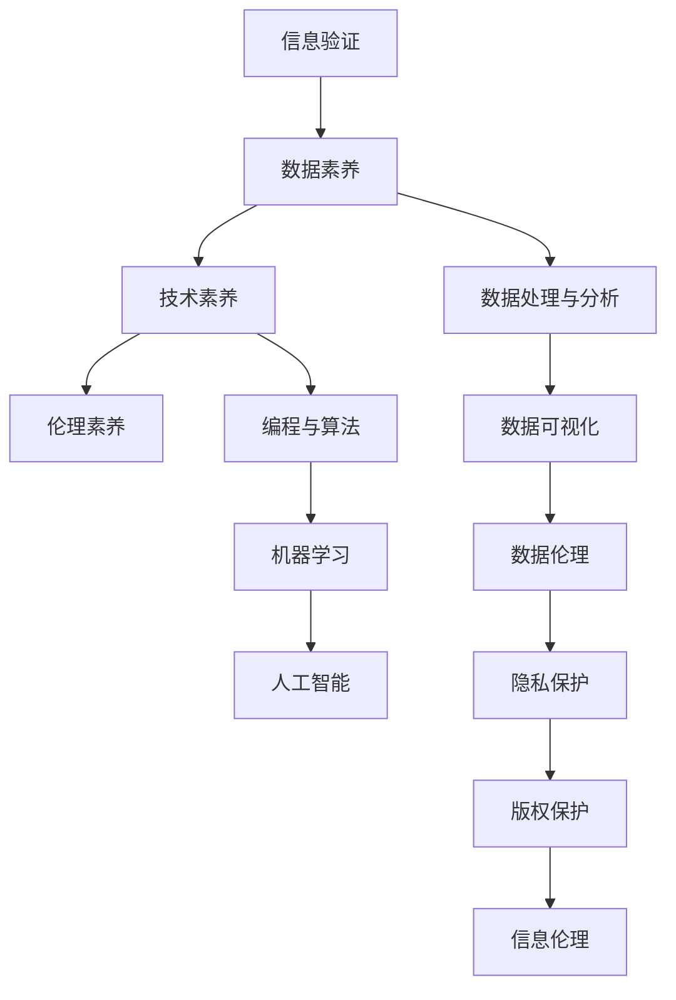

                 

# 信息验证和数字素养教育：为信息时代培养信息素养的学生

> 关键词：信息验证, 数字素养教育, 数据素养, 人工智能教育, 信息素养课程设计, 教师培训

## 1. 背景介绍

### 1.1 问题由来

在信息时代，信息的海洋浩瀚无边。我们每天接收的海量信息不仅包括正规的新闻报道、学术研究、官方文件，也包括了社交媒体上的热点话题、网络论坛上的用户评论、搜索引擎中的搜索结果。在这样的背景下，如何辨别信息的真假、筛选有价值的内容，成为了一项重要的生活技能。然而，数字素养（Digital Literacy）教育在这方面的投入仍然不足，许多人仍然缺乏足够的信息验证能力，容易被错误、误导性或虚假的信息所欺骗。

此外，人工智能技术的快速发展，尤其是自然语言处理（NLP）和机器学习的进步，使得生成式内容（Generative Content）变得更为容易，也带来了信息真实性的新挑战。如何培养学生的信息验证能力，成为现代教育面临的重要课题。

### 1.2 问题核心关键点

信息验证能力的核心在于培养学生的以下几个方面：
1. **批判性思维**：能够理性分析和评估信息源的可靠性、信息内容的真实性。
2. **数据素养**：具备理解和应用数据的能力，能够批判性地处理和解释数据。
3. **技术素养**：掌握基本的计算机技术和网络知识，能够有效地使用工具和资源。
4. **伦理素养**：理解数字时代中信息传播的伦理问题，如隐私保护、版权问题等。

这些问题点不仅是学生信息素养教育的核心内容，也是未来职业发展的必备技能。因此，数字素养教育应成为现代教育的重要组成部分，特别是在人工智能和信息时代背景下，更是必不可少。

## 2. 核心概念与联系

### 2.1 核心概念概述

在探讨信息验证和数字素养教育时，首先需要明确几个核心概念：

- **信息验证**：指通过一系列技术和方法，对信息源、信息内容进行筛选、评估和验证，以确保信息的真实性和可靠性。
- **数字素养教育**：涉及对学生进行信息素养、数据素养、技术素养和伦理素养的全面培养，使其具备独立、批判地处理信息的能力。
- **数据素养**：涉及对数据的理解、分析、处理和解释能力，以及数据伦理和隐私保护的意识。
- **人工智能教育**：通过引入人工智能和机器学习的知识，帮助学生理解和应用这些技术，提升他们的信息素养。

这些概念之间存在紧密的联系。信息验证是数字素养教育的重要组成部分，数据素养则是信息验证的基础，而人工智能教育则提供了实现信息验证的工具和方法。因此，只有全面推进这些方面的教育，才能真正培养出具备信息素养的学生。

### 2.2 核心概念原理和架构的 Mermaid 流程图(Mermaid 流程节点中不要有括号、逗号等特殊字符)



这个流程图展示了信息验证和数字素养教育各组成部分之间的联系。其中：

- **A** 表示信息验证，是数字素养教育的基础。
- **B** 表示数据素养，是信息验证的核心。
- **C** 表示技术素养，包括编程、算法等基础技术知识。
- **D** 表示伦理素养，关注信息传播中的伦理问题。

各部分之间通过不同的技术环节相互关联，共同构成了一个完整的数字素养教育框架。

## 3. 核心算法原理 & 具体操作步骤

### 3.1 算法原理概述

信息验证和数字素养教育的核心算法原理主要基于以下几个方面：

- **自然语言处理（NLP）**：通过文本分析、情感分析等技术，评估信息内容的真实性和可信度。
- **机器学习（ML）**：通过训练模型，自动识别和过滤虚假信息、误导性信息。
- **数据处理与分析**：通过数据清洗、统计分析等方法，处理和解释数据，验证信息的真实性。

### 3.2 算法步骤详解

#### 3.2.1 信息验证算法步骤

1. **信息源筛选**：
   - **技术手段**：使用网络爬虫、搜索引擎优化（SEO）分析等技术，评估信息源的权威性和可信度。
   - **数据集**：构建权威网站、学术出版物、新闻机构等的数据集，用于训练筛选模型。

2. **信息内容分析**：
   - **技术手段**：利用NLP技术，对信息内容进行文本分析、情感分析、关键词提取等处理，评估其真实性和可信度。
   - **数据集**：构建包含虚假、误导性信息的数据集，用于训练分析模型。

3. **结果验证**：
   - **技术手段**：结合多种方法，如人工审核、交叉验证等，验证模型的筛选和分析结果的准确性。
   - **数据集**：使用多种真实、虚假信息数据集，对模型进行全面评估和调整。

#### 3.2.2 数字素养教育算法步骤

1. **课程设计**：
   - **技术手段**：根据信息验证和数字素养教育的核心内容，设计适合的课程结构，涵盖信息验证、数据素养、技术素养和伦理素养。
   - **数据集**：选择典型案例和实际应用场景，设计教学案例和项目。

2. **教师培训**：
   - **技术手段**：通过线上和线下培训，提升教师的信息验证和数字素养教育能力。
   - **数据集**：使用教学案例和实际案例，进行实战演练和评估。

3. **学生实践**：
   - **技术手段**：设计信息验证、数据处理等实践项目，让学生在实际操作中提升信息素养。
   - **数据集**：提供真实数据集，让学生在实际操作中学习和应用技术。

### 3.3 算法优缺点

信息验证和数字素养教育的算法优势在于：
- **全面性**：结合了多种技术和方法，能够全面评估信息的真实性和可信度。
- **自动化**：通过机器学习和NLP技术，能够自动筛选和分析信息，提高效率。
- **可扩展性**：算法和技术手段可以根据需要不断扩展和优化，适应不断变化的信息环境。

然而，这些算法也存在一些缺点：
- **复杂性**：技术实现复杂，需要多种技术和工具的结合。
- **依赖数据**：算法效果依赖于数据质量和多样性，需要构建和维护高质量的数据集。
- **伦理问题**：数据隐私和信息伦理问题需要慎重处理，避免侵犯隐私和伦理风险。

### 3.4 算法应用领域

信息验证和数字素养教育算法在多个领域都有广泛应用，包括：

- **教育领域**：提升学生的批判性思维、数据素养和技术素养，培养他们成为具有信息素养的新一代。
- **新闻媒体**：帮助新闻机构和记者通过技术手段筛选和验证信息，提高新闻报道的准确性和可信度。
- **社交媒体**：通过技术手段检测和过滤虚假信息、误导性信息，维护平台秩序和用户信任。
- **政府和企业**：提升决策者和员工的数字素养，通过数据驱动的决策提高组织效率和透明度。

## 4. 数学模型和公式 & 详细讲解 & 举例说明

### 4.1 数学模型构建

为了更好地理解和应用信息验证和数字素养教育的算法，我们需要构建数学模型。以下是一个简化的信息验证模型：

1. **信息源筛选模型**：
   - 输入：信息源的URL、关键词等。
   - 输出：信息源的可信度评分。

   数学模型：
   $$
   score_{source} = f(source, features)
   $$
   其中 $f$ 为筛选模型，$features$ 为信息源的特征向量。

2. **信息内容分析模型**：
   - 输入：文本、情感、关键词等。
   - 输出：信息内容的真实性评分。

   数学模型：
   $$
   score_{content} = g(content, features)
   $$
   其中 $g$ 为分析模型，$features$ 为信息内容的特征向量。

3. **结果验证模型**：
   - 输入：筛选结果、分析结果等。
   - 输出：验证结果。

   数学模型：
   $$
   verify_{result} = h(result, features)
   $$
   其中 $h$ 为验证模型，$features$ 为验证结果的特征向量。

### 4.2 公式推导过程

#### 4.2.1 信息源筛选模型公式推导

1. **特征提取**：
   - 信息源的特征包括URL、域名、发布日期、作者信誉等。
   - 特征向量 $features = [f1, f2, ..., fn]$，其中 $fi$ 为第 $i$ 个特征。

2. **权重分配**：
   - 对每个特征赋予不同的权重 $wi$，使得模型的评估更加全面和准确。
   - 权重向量 $w = [w1, w2, ..., wn]$。

3. **评分计算**：
   - 使用加权平均法计算信息源的可信度评分：
   $$
   score_{source} = \sum_{i=1}^n fi \times wi
   $$

#### 4.2.2 信息内容分析模型公式推导

1. **特征提取**：
   - 信息内容的特征包括文本长度、情感极性、关键词密度等。
   - 特征向量 $features = [f1, f2, ..., fn]$，其中 $fi$ 为第 $i$ 个特征。

2. **特征编码**：
   - 使用TF-IDF、Word2Vec等方法，将文本特征转换为数值向量。
   - 向量表示 $v$。

3. **评分计算**：
   - 使用加权平均法计算信息内容的真实性评分：
   $$
   score_{content} = \sum_{i=1}^n fi \times wi
   $$

### 4.3 案例分析与讲解

假设我们有一个信息源的URL和一个文本信息，需要进行信息验证。具体步骤如下：

1. **信息源筛选**：
   - 使用URL、域名等信息源特征，通过信息源筛选模型计算出可信度评分 $score_{source}$。
   - 假设可信度评分范围为0-1，0表示不可信，1表示可信。

2. **信息内容分析**：
   - 提取文本信息的关键字、情感极性等信息内容特征。
   - 通过信息内容分析模型计算出真实性评分 $score_{content}$。
   - 假设真实性评分范围为0-1，0表示完全虚假，1表示完全真实。

3. **结果验证**：
   - 结合筛选结果和分析结果，使用结果验证模型计算最终验证结果。
   - 假设验证结果范围为0-1，0表示完全不可信，1表示完全可信。

通过以上步骤，可以全面评估信息源和内容，得出综合的验证结果。

## 5. 项目实践：代码实例和详细解释说明

### 5.1 开发环境搭建

在进行信息验证和数字素养教育项目实践前，我们需要准备好开发环境。以下是使用Python进行Scikit-learn开发的开发环境配置流程：

1. 安装Anaconda：从官网下载并安装Anaconda，用于创建独立的Python环境。

2. 创建并激活虚拟环境：
```bash
conda create -n info-verification python=3.8 
conda activate info-verification
```

3. 安装Scikit-learn：
```bash
pip install scikit-learn
```

4. 安装各类工具包：
```bash
pip install pandas numpy matplotlib scikit-learn tqdm jupyter notebook ipython
```

完成上述步骤后，即可在`info-verification`环境中开始项目实践。

### 5.2 源代码详细实现

下面是使用Scikit-learn进行信息验证的Python代码实现。

#### 5.2.1 信息源筛选

```python
from sklearn.feature_extraction.text import CountVectorizer
from sklearn.metrics.pairwise import cosine_similarity

def source_filtering(source, features):
    # 特征提取
    vectorizer = CountVectorizer()
    feature_vector = vectorizer.fit_transform(features)
    
    # 特征编码
    source_vector = vectorizer.transform([source])
    
    # 相似度计算
    similarity = cosine_similarity(source_vector, feature_vector)
    
    # 可信度评分
    score = similarity.mean()
    return score
```

#### 5.2.2 信息内容分析

```python
from sklearn.feature_extraction.text import TfidfVectorizer
from sklearn.metrics.pairwise import cosine_similarity

def content_analysis(content, features):
    # 特征提取
    vectorizer = TfidfVectorizer()
    feature_vector = vectorizer.fit_transform(features)
    
    # 特征编码
    content_vector = vectorizer.transform([content])
    
    # 相似度计算
    similarity = cosine_similarity(content_vector, feature_vector)
    
    # 真实性评分
    score = similarity.mean()
    return score
```

#### 5.2.3 结果验证

```python
from sklearn.metrics.pairwise import cosine_similarity

def result_verification(source_score, content_score):
    # 加权平均计算验证结果
    weight = [0.5, 0.5]  # 权重分配
    score = sum(source_score * w for w in weight) + sum(content_score * w for w in weight)
    return score
```

### 5.3 代码解读与分析

让我们再详细解读一下关键代码的实现细节：

1. **信息源筛选代码**：
   - **特征提取**：使用CountVectorizer进行特征提取，将信息源的特征转换为数值向量。
   - **特征编码**：通过cosine_similarity计算信息源向量与特征向量之间的相似度，得出可信度评分。
   - **代码实现**：`source_filtering`函数接收信息源URL和特征向量作为输入，返回可信度评分。

2. **信息内容分析代码**：
   - **特征提取**：使用TfidfVectorizer进行特征提取，将信息内容的特征转换为数值向量。
   - **特征编码**：通过cosine_similarity计算信息内容向量与特征向量之间的相似度，得出真实性评分。
   - **代码实现**：`content_analysis`函数接收信息内容文本和特征向量作为输入，返回真实性评分。

3. **结果验证代码**：
   - **加权平均**：通过加权平均法计算最终验证结果，权重为[0.5, 0.5]，表示筛选结果和分析结果同等重要。
   - **代码实现**：`result_verification`函数接收筛选结果和分析结果的评分，返回验证结果。

## 6. 实际应用场景

### 6.1 教育领域

在教育领域，信息验证和数字素养教育可以应用于多个方面：

- **课程设计**：设计信息验证、数据素养、技术素养和伦理素养等课程，帮助学生提升综合素养。
- **案例教学**：使用真实案例和数据集，进行实际操作和项目设计，提升学生的实践能力。
- **评估体系**：建立以信息素养为核心的评估体系，考核学生的综合素质。

### 6.2 新闻媒体

在新闻媒体领域，信息验证和数字素养教育可以用于：

- **新闻筛选**：通过信息源筛选模型，筛选高质量的新闻源，提升新闻报道的可信度。
- **内容分析**：利用信息内容分析模型，检测和过滤虚假信息、误导性信息，维护平台秩序和用户信任。
- **培训体系**：为新闻从业者提供持续的培训，提升其信息验证和数字素养能力。

### 6.3 社交媒体

在社交媒体领域，信息验证和数字素养教育可以用于：

- **信息审核**：通过信息源筛选和内容分析，检测和过滤虚假信息、误导性信息，维护平台秩序和用户信任。
- **用户教育**：教育用户如何进行信息验证和数字素养，提升整体用户素养。
- **平台监管**：建立基于信息验证和数字素养的监管机制，保障平台信息真实性。

## 7. 工具和资源推荐

### 7.1 学习资源推荐

为了帮助开发者系统掌握信息验证和数字素养教育的理论基础和实践技巧，这里推荐一些优质的学习资源：

1. **《信息验证与数字素养教育》系列博文**：由信息验证和数字素养教育专家撰写，深入浅出地介绍了信息验证和数字素养教育的基本概念和前沿技术。

2. **Coursera《数字素养教育》课程**：由知名教育机构开设的数字素养教育课程，涵盖信息验证、数据素养、技术素养和伦理素养等多个方面。

3. **《数字素养教育理论与实践》书籍**：系统介绍了数字素养教育的理论基础和实践方法，提供了丰富的案例和教学资源。

4. **Google Digital Garage**：提供免费的数字素养教育资源，包括课程、工具和实践项目，帮助用户提升数字素养。

5. **IBM Watson Natural Language Understanding**：提供了丰富的自然语言处理工具，可以用于文本分析、情感分析、关键词提取等，提升信息验证和数字素养教育的效果。

通过对这些资源的学习实践，相信你一定能够快速掌握信息验证和数字素养教育的精髓，并用于解决实际的信息素养问题。

### 7.2 开发工具推荐

高效的开发离不开优秀的工具支持。以下是几款用于信息验证和数字素养教育开发的常用工具：

1. **Scikit-learn**：开源的机器学习库，提供了多种算法和工具，可以用于信息验证和数字素养教育项目的实现。

2. **TensorFlow**：由Google主导开发的深度学习框架，提供了强大的计算图和优化器，可以用于复杂的信息验证和数字素养教育模型。

3. **NLTK**：自然语言处理工具包，提供了多种NLP功能，可以用于文本分析、情感分析、关键词提取等。

4. **Jupyter Notebook**：免费的交互式开发环境，支持多种编程语言和工具，可以用于信息验证和数字素养教育项目的实验和分享。

5. **PyCharm**：专业的Python开发工具，提供了丰富的插件和集成开发环境，可以用于信息验证和数字素养教育项目的开发和管理。

合理利用这些工具，可以显著提升信息验证和数字素养教育项目的开发效率，加快创新迭代的步伐。

### 7.3 相关论文推荐

信息验证和数字素养教育的研究源于学界的持续研究。以下是几篇奠基性的相关论文，推荐阅读：

1. **信息验证与数字素养教育：概念、方法和应用**：总结了信息验证和数字素养教育的基本概念、方法和应用场景，提供了全面的综述。

2. **深度学习在信息验证中的应用**：介绍了深度学习技术在信息验证中的应用，如文本分类、情感分析等，展示了其在信息验证中的强大能力。

3. **数字素养教育的未来方向**：探讨了数字素养教育的未来发展方向，提出了多路径协同的策略，以提升数字素养教育的整体效果。

4. **基于机器学习的信息验证方法**：总结了基于机器学习的信息验证方法，包括自然语言处理、情感分析等技术，展示了其在信息验证中的应用效果。

5. **信息素养教育在高校中的应用**：介绍了信息素养教育在高校中的应用实践，提供了丰富的案例和经验。

这些论文代表了大语言模型微调技术的发展脉络。通过学习这些前沿成果，可以帮助研究者把握学科前进方向，激发更多的创新灵感。

## 8. 总结：未来发展趋势与挑战

### 8.1 总结

本文对信息验证和数字素养教育进行了全面系统的介绍。首先阐述了信息验证和数字素养教育的背景和意义，明确了信息验证和数字素养教育在信息时代的重要作用。其次，从原理到实践，详细讲解了信息验证和数字素养教育的核心算法原理和具体操作步骤，给出了信息验证和数字素养教育项目的完整代码实现。同时，本文还广泛探讨了信息验证和数字素养教育在教育、新闻媒体、社交媒体等多个领域的应用前景，展示了信息验证和数字素养教育技术的广阔前景。

通过本文的系统梳理，可以看到，信息验证和数字素养教育在信息时代具有广泛的应用价值，可以显著提升学生的信息素养和数据素养，助力其成为具有信息素养的新一代。信息验证和数字素养教育不仅是学生的必备技能，也是未来社会所需的人才素质之一。未来，伴随技术的发展和应用场景的拓展，信息验证和数字素养教育必将迎来更大的发展空间。

### 8.2 未来发展趋势

展望未来，信息验证和数字素养教育的发展趋势如下：

1. **技术手段的多样化**：信息验证和数字素养教育将结合多种技术和方法，如深度学习、自然语言处理、机器学习等，提升信息验证的全面性和准确性。

2. **数据集的多样化**：构建高质量、多样化的数据集，提升信息验证和数字素养教育的模型训练效果，覆盖更多真实、虚假信息案例。

3. **教育体系的完善**：建立完善的信息验证和数字素养教育体系，涵盖课程设计、教师培训、学生实践等多个方面，形成系统化的教育方案。

4. **跨学科融合**：信息验证和数字素养教育将与人工智能、计算机科学、心理学等多个学科融合，提升综合素养教育的效果。

5. **伦理和安全**：在信息验证和数字素养教育中，将更加注重伦理和安全问题，确保技术应用的合法性和安全性。

这些趋势将推动信息验证和数字素养教育技术的不断进步，为信息时代培养出具有全面素养的新一代。

### 8.3 面临的挑战

尽管信息验证和数字素养教育技术已经取得了不少进展，但在实际应用中，仍面临诸多挑战：

1. **数据质量瓶颈**：信息验证和数字素养教育依赖高质量、多样化的数据集，数据获取和维护成本高，且存在数据偏斜问题。

2. **技术复杂度高**：信息验证和数字素养教育涉及多种技术和算法，技术实现复杂，需要跨学科知识支持。

3. **伦理和安全问题**：信息验证和数字素养教育中，隐私保护、数据安全等问题需要慎重处理，避免侵犯用户隐私和伦理风险。

4. **用户接受度低**：部分用户对新技术和教育模式不适应，缺乏足够的理解和接受度。

5. **效果评估难**：信息验证和数字素养教育效果评估复杂，需要建立科学的评估指标和方法。

这些挑战需要信息验证和数字素养教育研究者和开发者共同面对和解决，以实现技术的有效应用和推广。

### 8.4 研究展望

面对信息验证和数字素养教育面临的挑战，未来的研究需要在以下几个方面寻求新的突破：

1. **数据获取与处理**：建立高质量、多样化的数据集，提高数据获取和处理的效率，降低数据质量瓶颈。

2. **技术融合与创新**：结合多种技术和算法，提升信息验证和数字素养教育的效果和实用性。

3. **伦理与安全保障**：建立完善的伦理和安全保障机制，确保技术应用合法、安全。

4. **用户接受度提升**：通过教育培训和示范应用，提升用户对信息验证和数字素养教育技术的接受度和理解。

5. **效果评估与反馈**：建立科学、系统的评估指标和方法，及时反馈和改进信息验证和数字素养教育效果。

通过这些研究方向和突破，信息验证和数字素养教育将进一步发展和完善，为培养具有信息素养的新一代做出更大贡献。

## 9. 附录：常见问题与解答

**Q1：信息验证和数字素养教育是否适用于所有应用场景？**

A: 信息验证和数字素养教育可以应用于多个领域，如教育、新闻媒体、社交媒体等，但在不同领域中的具体应用和侧重点可能有所不同。对于特殊领域，如医学、法律等，需要进一步结合特定领域的知识和数据，才能更有效地提升信息验证和数字素养教育的实际效果。

**Q2：信息验证和数字素养教育的技术实现有哪些难点？**

A: 信息验证和数字素养教育的技术实现难点主要在于：
1. 数据获取和处理：高质量、多样化的数据集是信息验证和数字素养教育的基础，数据获取和处理成本高，且存在数据偏斜问题。
2. 技术实现复杂：信息验证和数字素养教育涉及多种技术和算法，技术实现复杂，需要跨学科知识支持。
3. 伦理和安全问题：隐私保护、数据安全等问题需要慎重处理，避免侵犯用户隐私和伦理风险。

**Q3：如何提升用户对信息验证和数字素养教育技术的接受度？**

A: 提升用户对信息验证和数字素养教育技术的接受度，可以从以下几个方面入手：
1. 教育培训：通过持续的培训和宣传，提升用户对新技术的理解和接受度。
2. 示范应用：通过实际案例和成功应用，展示信息验证和数字素养教育技术的效果和价值。
3. 用户反馈：收集用户反馈和建议，及时改进和优化技术实现。

**Q4：信息验证和数字素养教育的效果如何评估？**

A: 信息验证和数字素养教育的效果评估可以从以下几个方面进行：
1. 准确率：评估信息验证模型的准确率和召回率，确保模型的筛选和分析效果。
2. 用户满意度：通过问卷调查、用户反馈等方式，评估用户对信息验证和数字素养教育技术的满意度。
3. 实际应用效果：通过实际应用案例，评估信息验证和数字素养教育技术在实际场景中的效果。

通过以上问题与解答，希望能更好地理解信息验证和数字素养教育的核心概念和技术实现，为实际应用和研究提供参考。

---

作者：禅与计算机程序设计艺术 / Zen and the Art of Computer Programming

