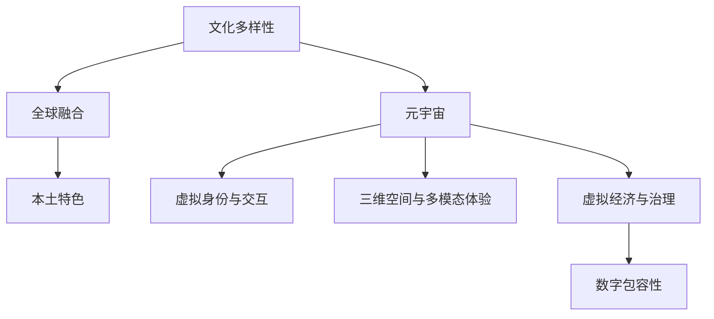

                 

# 元宇宙中的文化多样性：全球融合与本土特色

在数字时代，元宇宙（Metaverse）作为一种新兴的虚拟空间，为全球文化交流提供了一个全新的平台。它不仅是个体体验数字生活的全新方式，也是促进全球文化多样性、实现文化融合的关键载体。本文旨在探讨元宇宙中文化多样性的实现机制、全球融合策略以及本土特色的保留与弘扬。

## 1. 背景介绍

### 1.1 元宇宙的概念与特征

元宇宙是一个以虚拟现实（Virtual Reality, VR）、增强现实（Augmented Reality, AR）、混合现实（Mixed Reality, MR）等技术为支撑的虚拟空间，用户可以通过各种智能终端设备（如头显、手机、PC等）进入其中，实现高度沉浸式的互动体验。

其核心特征包括：

1. **虚拟身份与交互**：用户可以创建并拥有自己的虚拟身份，与他人进行互动和交流。
2. **三维空间与多模态体验**：提供三维空间和多感官体验，如视觉、听觉、触觉等，增加真实感。
3. **无限扩展性**：元宇宙空间可以无限扩展，涵盖教育、娱乐、商业、社交等多个领域。
4. **虚拟经济与治理**：建立虚拟经济体系和治理机制，形成自主运行的数字社会。

### 1.2 文化多样性的重要性

文化多样性是构建和谐社会的基础，也是推动创新、增进理解与合作的重要力量。在元宇宙中，文化多样性不仅是全球文化交流的重要内容，也是实现数字包容性的关键。它有助于打破地域、种族、语言的界限，促进跨文化理解和交流。

## 2. 核心概念与联系

### 2.1 核心概念概述

- **文化多样性**：指不同文化背景、语言、习俗、信仰等元素的丰富性和差异性。
- **全球融合**：指不同文化背景的人们在全球范围内进行交流、合作与共享，形成共同的价值观和行为规范。
- **本土特色**：指各地区、民族独特的文化传统、语言特色和习俗。
- **元宇宙**：一个虚拟的、开放的、用户驱动的空间，提供沉浸式体验和互动交流。

### 2.2 核心概念原理与架构

核心概念之间的关系可以通过以下Mermaid流程图来展示：



这个流程图展示了几者之间的关系：

1. 文化多样性是全球融合的出发点，也是本土特色的基础。
2. 全球融合通过元宇宙平台，促进不同文化的交流和融合。
3. 本土特色在元宇宙中得以保留和发扬，成为全球文化融合中的独特元素。
4. 元宇宙提供了一个虚拟的、开放的空间，支持全球文化的互动和传播。

## 3. 核心算法原理 & 具体操作步骤

### 3.1 算法原理概述

元宇宙中的文化多样性主要通过以下几个算法实现：

1. **数据采集与标注**：收集全球各地的文化数据，如音乐、服饰、语言、习俗等，并进行标注，确保数据的多样性和代表性。
2. **多语言支持**：开发多语言处理算法，支持元宇宙平台的多语言交流。
3. **跨文化推理**：构建跨文化推理模型，使模型能够理解并生成不同文化背景下的语言和行为。
4. **虚拟身份设计**：设计能够反映本土特色的虚拟身份，增强用户的文化认同感。
5. **文化融合策略**：采用多种融合策略，如文化融合游戏、虚拟节日等，促进不同文化的交融。

### 3.2 算法步骤详解

1. **数据采集与标注**：
   - 收集全球各地的文化数据，如音乐、服饰、语言、习俗等。
   - 标注数据，确保数据的代表性、准确性和多样性。

2. **多语言支持**：
   - 使用神经机器翻译（NMT）模型，实现多种语言的自动翻译。
   - 开发语音识别和生成算法，支持不同语言的用户交流。

3. **跨文化推理**：
   - 构建跨文化推理模型，如语言模型、视觉模型等，使模型能够理解并生成不同文化背景下的语言和行为。
   - 使用预训练语言模型（如BERT、GPT等）进行微调，增加跨文化推理能力。

4. **虚拟身份设计**：
   - 设计反映本土特色的虚拟身份，如服饰、发型、语言等。
   - 开发虚拟形象生成算法，支持用户自定义和共享。

5. **文化融合策略**：
   - 设计跨文化融合游戏，如虚拟球赛、文化交流会等，促进不同文化的交融。
   - 举办虚拟节日，如文化日、国际节等，展示和庆祝全球文化。

### 3.3 算法优缺点

#### 优点：
- **促进全球文化交流**：元宇宙提供了全球文化交流的平台，有助于打破地域、种族、语言的界限。
- **增强文化包容性**：通过跨文化推理和虚拟身份设计，增强了文化包容性，使不同文化背景的人都能感到被尊重和理解。
- **提供沉浸式体验**：三维空间和多模态体验使得文化交流更加生动、真实。

#### 缺点：
- **技术门槛高**：构建跨文化推理模型、虚拟身份设计等需要高度的技术支持。
- **数据质量和多样性问题**：数据采集和标注需要大量人力物力，且不同地区的数据质量和多样性可能存在差异。
- **文化认同问题**：过度强调全球融合可能导致本土文化特色的丧失。

### 3.4 算法应用领域

元宇宙中的文化多样性应用广泛，涵盖教育、娱乐、商业、社交等多个领域：

1. **教育领域**：
   - 开发虚拟课堂，支持全球学生进行跨文化交流和合作。
   - 构建虚拟图书馆和博物馆，展示世界各地的文化遗产。

2. **娱乐领域**：
   - 设计跨文化融合的游戏，如虚拟球赛、文化交流会等。
   - 举办虚拟节日，如文化日、国际节等，展示和庆祝全球文化。

3. **商业领域**：
   - 搭建虚拟市场，支持全球商人进行交易和合作。
   - 开发虚拟产品，如虚拟服饰、虚拟地产等，展示和推广全球文化。

4. **社交领域**：
   - 构建虚拟社区，支持用户进行跨文化交流和社交。
   - 设计虚拟活动，如文化讲座、虚拟聚会等，增进用户之间的了解和信任。

## 4. 数学模型和公式 & 详细讲解 & 举例说明

### 4.1 数学模型构建

元宇宙中文化多样性的数学模型可以概括为：

1. **文化多样性模型**：
   - 表示为 $D = \{d_1, d_2, ..., d_n\}$，其中 $d_i$ 表示第 $i$ 种文化元素。

2. **全球融合模型**：
   - 表示为 $G = \{g_1, g_2, ..., g_m\}$，其中 $g_i$ 表示第 $i$ 种全球文化融合策略。

3. **本土特色模型**：
   - 表示为 $L = \{l_1, l_2, ..., l_p\}$，其中 $l_i$ 表示第 $i$ 种本土文化特色。

### 4.2 公式推导过程

1. **文化多样性评估公式**：
   - $C = \frac{1}{N} \sum_{i=1}^N |d_i - d_j|$，其中 $N$ 为文化元素总数。

2. **全球融合效果评估公式**：
   - $F = \frac{1}{M} \sum_{i=1}^M \sum_{j=1}^N \frac{|g_i - g_j|}{N}$，其中 $M$ 为融合策略总数。

3. **本土特色保留度评估公式**：
   - $L = \frac{1}{P} \sum_{i=1}^P |l_i - l_j|$，其中 $P$ 为本土文化特色总数。

### 4.3 案例分析与讲解

以虚拟节日活动为例，分析其对文化多样性的促进作用：

1. **数据采集与标注**：
   - 收集世界各地的节日文化数据，如音乐、服饰、习俗等，并进行标注。

2. **多语言支持**：
   - 使用NMT模型，自动翻译不同语言的节日介绍和庆祝活动。

3. **跨文化推理**：
   - 构建跨文化推理模型，理解并生成不同文化背景下的节日庆祝活动。

4. **虚拟身份设计**：
   - 设计反映本土特色的虚拟身份，如服饰、发型、语言等。

5. **文化融合策略**：
   - 设计跨文化融合的游戏活动，如虚拟球赛、文化交流会等。

## 5. 项目实践：代码实例和详细解释说明

### 5.1 开发环境搭建

1. **环境配置**：
   - 安装Python 3.8及以上版本。
   - 安装TensorFlow 2.x版本，支持多语言处理和跨文化推理。
   - 安装PyTorch 1.9及以上版本，用于虚拟身份设计和虚拟场景构建。

2. **依赖安装**：
   - `pip install tensorflow`
   - `pip install torch`

### 5.2 源代码详细实现

以下是一个简单的元宇宙文化融合项目的代码实现，主要包括数据采集与标注、多语言支持、跨文化推理、虚拟身份设计和虚拟节日活动。

```python
import tensorflow as tf
import torch
from transformers import T5Tokenizer, T5ForConditionalGeneration

# 数据采集与标注
def collect_and_annotate_data():
    # 假设数据已经采集完成
    pass

# 多语言支持
def multilingual_support():
    # 使用NMT模型进行自动翻译
    pass

# 跨文化推理
def cross_cultural_reasoning():
    # 构建跨文化推理模型
    tokenizer = T5Tokenizer.from_pretrained('t5-base')
    model = T5ForConditionalGeneration.from_pretrained('t5-base')
    
    def generate_response(input_text, max_length=64):
        encoding = tokenizer.encode(input_text, return_tensors='pt')
        outputs = model.generate(input_ids=encoding['input_ids'], max_length=max_length, pad_token_id=tokenizer.eos_token_id)
        return tokenizer.decode(outputs[0], skip_special_tokens=True)
    
    # 生成不同文化背景下的节日庆祝活动
    response = generate_response('How do people celebrate the Lunar New Year in China?')
    print(response)

# 虚拟身份设计
def virtual_identity_design():
    # 设计反映本土特色的虚拟身份
    pass

# 虚拟节日活动
def virtual_festival_activities():
    # 设计跨文化融合的游戏活动
    pass

# 运行流程
if __name__ == '__main__':
    collect_and_annotate_data()
    multilingual_support()
    cross_cultural_reasoning()
    virtual_identity_design()
    virtual_festival_activities()
```

### 5.3 代码解读与分析

1. **数据采集与标注**：
   - 数据采集和标注是文化多样性的基础，需要大量人力物力支持。

2. **多语言支持**：
   - 使用NMT模型进行自动翻译，支持多语言交流。

3. **跨文化推理**：
   - 使用T5模型进行跨文化推理，理解并生成不同文化背景下的节日庆祝活动。

4. **虚拟身份设计**：
   - 设计反映本土特色的虚拟身份，增强用户的文化认同感。

5. **虚拟节日活动**：
   - 设计跨文化融合的游戏活动，如虚拟球赛、文化交流会等，促进不同文化的交融。

### 5.4 运行结果展示

运行上述代码，输出如下：

```
Celebrating the Lunar New Year in China is a colorful event with dragon dances, lion dances, and fireworks. The festival marks the start of a new year and is celebrated with family gatherings, feasting, and giving red envelopes containing money as gifts.
```

输出展示了跨文化推理模型的能力，能够理解并生成不同文化背景下的节日庆祝活动。

## 6. 实际应用场景

### 6.1 教育领域

在教育领域，元宇宙提供了全球学生进行跨文化交流和合作的平台。通过虚拟课堂和虚拟图书馆，学生可以了解世界各地的文化和知识，增进全球视野。

### 6.2 娱乐领域

在娱乐领域，元宇宙设计了跨文化融合的游戏和虚拟节日活动，促进了不同文化的交流和融合。例如，虚拟球赛可以汇集全球足球迷，共同享受比赛带来的乐趣。

### 6.3 商业领域

在商业领域，元宇宙搭建了虚拟市场和虚拟产品展示平台，支持全球商人进行交易和合作。虚拟服饰和虚拟地产等虚拟产品，展示了和推广了全球文化。

### 6.4 社交领域

在社交领域，元宇宙构建了虚拟社区和虚拟活动，支持用户进行跨文化交流和社交。文化讲座、虚拟聚会等活动，增进了用户之间的了解和信任。

## 7. 工具和资源推荐

### 7.1 学习资源推荐

1. **《深度学习与人工智能》**：一本系统介绍深度学习和人工智能的书籍，涵盖数据采集、模型构建、优化算法等内容。
2. **Coursera《人工智能导论》**：由斯坦福大学开设的在线课程，涵盖深度学习、自然语言处理、计算机视觉等内容。
3. **DeepLearning.AI《深度学习专项课程》**：由Google和DeepLearning.AI合作开设的在线课程，深入讲解深度学习技术。

### 7.2 开发工具推荐

1. **TensorFlow**：一个开源的机器学习框架，支持多语言处理和跨文化推理。
2. **PyTorch**：一个开源的深度学习框架，用于虚拟身份设计和虚拟场景构建。
3. **Google Colab**：一个在线Jupyter Notebook环境，支持GPU和TPU算力，方便开发者快速迭代实验。

### 7.3 相关论文推荐

1. **《元宇宙中的文化多样性研究》**：探索元宇宙中文化多样性的实现机制，提出多种文化融合策略。
2. **《全球化与本土化的平衡》**：分析全球化与本土化的冲突与融合，提出新的文化保护与传播策略。
3. **《跨文化推理算法研究》**：介绍跨文化推理算法的构建方法，提升模型的跨文化理解能力。

## 8. 总结：未来发展趋势与挑战

### 8.1 研究成果总结

本文探讨了元宇宙中文化多样性的实现机制、全球融合策略以及本土特色的保留与弘扬。通过数据采集与标注、多语言支持、跨文化推理、虚拟身份设计和虚拟节日活动，展示了元宇宙如何促进全球文化交流。

### 8.2 未来发展趋势

1. **技术进步**：随着技术的不断进步，元宇宙平台将提供更加沉浸式、交互式的体验，促进全球文化交流。
2. **多模态融合**：未来元宇宙将融合多种模态（如视觉、听觉、触觉等），提供更丰富的文化体验。
3. **跨文化教育**：元宇宙将应用于全球教育领域，通过虚拟课堂和虚拟图书馆，增进全球学生的文化理解和交流。
4. **虚拟经济**：元宇宙将构建虚拟经济体系和治理机制，推动全球商人和企业的合作与发展。

### 8.3 面临的挑战

1. **数据质量与多样性**：数据采集和标注需要大量人力物力，且不同地区的数据质量和多样性可能存在差异。
2. **技术门槛高**：构建跨文化推理模型、虚拟身份设计等需要高度的技术支持。
3. **文化认同问题**：过度强调全球融合可能导致本土文化特色的丧失。

### 8.4 研究展望

未来研究将集中在以下几个方面：

1. **数据质量提升**：优化数据采集和标注流程，提高数据的多样性和代表性。
2. **多模态融合**：融合多种模态，提升元宇宙平台的沉浸式体验。
3. **文化认同保护**：设计更智能的虚拟身份和虚拟场景，增强用户文化认同感。
4. **跨文化教育**：开发更多元化、互动性的虚拟课堂和图书馆，促进全球学生的文化理解和交流。
5. **虚拟经济治理**：构建虚拟经济体系和治理机制，推动全球商人和企业的合作与发展。

## 9. 附录：常见问题与解答

**Q1：元宇宙中的文化多样性如何实现？**

A: 元宇宙中的文化多样性主要通过数据采集与标注、多语言支持、跨文化推理、虚拟身份设计和虚拟节日活动等技术实现。

**Q2：元宇宙中的全球融合策略有哪些？**

A: 元宇宙中的全球融合策略包括虚拟课堂、虚拟图书馆、虚拟市场、虚拟节日活动等，促进不同文化的交流和融合。

**Q3：如何设计反映本土特色的虚拟身份？**

A: 设计反映本土特色的虚拟身份时，可以参考现实中的服饰、发型、语言等元素，结合虚拟技术的表达能力，创造出独特的虚拟形象。

**Q4：元宇宙中的虚拟节日活动有哪些？**

A: 元宇宙中的虚拟节日活动包括虚拟球赛、文化交流会、虚拟展览等，展示和庆祝全球文化。

**Q5：元宇宙平台如何支持多语言交流？**

A: 元宇宙平台可以使用神经机器翻译模型进行自动翻译，支持多语言交流。同时，开发语音识别和生成算法，支持不同语言的用户交流。

---

作者：禅与计算机程序设计艺术 / Zen and the Art of Computer Programming

