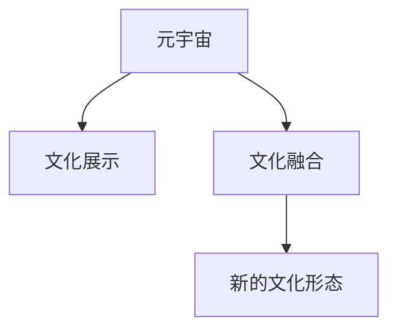

                 

# 元宇宙中的文化多样性：全球融合与本土特色

## 1. 背景介绍

### 1.1 问题由来
随着技术的进步，元宇宙的概念逐渐从科幻小说和虚拟游戏环境中走出，开始融入现实世界。元宇宙以虚拟空间为载体，通过丰富的交互方式和沉浸式体验，将现实世界与虚拟空间深度融合，为用户提供了无限的自由和可能。然而，随着元宇宙的全球化发展，如何在这个虚拟世界中处理和展现文化多样性，成为一个值得深思的问题。

### 1.2 问题核心关键点
文化多样性在元宇宙中的体现，主要在于两个方面：一是不同国家和地区的文化特色如何在虚拟环境中得到保留和展示；二是如何在虚拟空间中促进不同文化的融合和交流。这两个问题的解决，直接影响到元宇宙的全球化和包容性，关系到其能否真正成为全人类的共享平台。

### 1.3 问题研究意义
研究元宇宙中的文化多样性，不仅有助于构建一个更加包容和多元的虚拟世界，还可以促进不同文化间的交流和理解，为全球治理、文化保护、教育普及等社会问题提供新的解决思路。同时，通过虚拟环境中的文化展示和交流，还可以推动文化和艺术创新，促进创意产业的发展，为经济社会发展注入新的活力。

## 2. 核心概念与联系

### 2.1 核心概念概述

在元宇宙中，文化多样性涉及到以下关键概念：

- **元宇宙(Metaverse)**：虚拟的、可交互的空间，通过VR、AR、云计算等技术，构建出一个超越现实世界的时间与空间。
- **文化多样性(Cultural Diversity)**：不同国家和地区的文化传统、价值观、艺术形式等差异性的总称。
- **文化展示(Cultural Showcase)**：通过虚拟空间，展示和传播不同文化的独特魅力和历史遗产。
- **文化融合(Cultural Fusion)**：在虚拟环境中，不同文化之间的交流与融合，产生新的文化形态和艺术表现。

这些概念之间的关系可以通过以下Mermaid流程图来展示：



该图展示了元宇宙中文化多样性的实现路径：元宇宙为文化展示和融合提供了平台，通过展示和融合，产生新的文化形态，进而丰富元宇宙的文化内涵。

## 3. 核心算法原理 & 具体操作步骤

### 3.1 算法原理概述

在元宇宙中，处理和展现文化多样性主要依赖于两个步骤：文化展示和融合。文化展示主要依赖于虚拟现实(VR)、增强现实(AR)等技术，通过虚拟场景和数字化手段重现不同文化的特色。文化融合则主要通过虚拟空间的交互性、沉浸性，促进不同文化间的交流和理解。

### 3.2 算法步骤详解

**Step 1: 数据收集与处理**

在元宇宙中展示和融合文化，首先需要收集和处理大量的文化数据。这包括文字、图像、视频、音频等不同类型的文化内容。数据收集可以从现有的文化库、博物馆、档案馆等渠道获取，也可以通过人工智能技术，自动从网络中抓取和识别文化内容。

**Step 2: 虚拟空间设计**

设计虚拟空间是展示和融合文化的关键步骤。虚拟空间需要考虑不同文化的特色，通过场景设计、色彩搭配、音乐氛围等元素，营造出不同的文化氛围。例如，可以设计一个传统的日本茶室，通过AR技术让用户在虚拟空间中体验日本茶道，感受其独特的文化魅力。

**Step 3: 交互设计**

交互设计是元宇宙中文化融合的重要手段。通过虚拟空间中的互动元素，如虚拟角色、虚拟物品、虚拟事件等，促进不同文化间的交流和理解。例如，设计一个虚拟市集，让用户可以扮演不同文化背景的角色，交换虚拟商品，体验不同文化的经济活动和交流方式。

**Step 4: 用户参与与反馈**

用户参与和反馈是文化融合的关键环节。在虚拟空间中，用户可以通过虚拟物品、虚拟角色等方式，表达自己对不同文化的理解和感受。系统通过收集用户的反馈，不断优化虚拟空间的设计和内容，使之更加贴近现实世界中的文化多样性。

**Step 5: 持续更新与维护**

元宇宙中的文化展示和融合是一个动态过程，需要不断地更新和维护。通过用户反馈、新的文化数据收集、文化交流活动等途径，持续丰富虚拟空间的内容，使其保持活力和新鲜感。

### 3.3 算法优缺点

**优点**：

- 丰富多样：元宇宙提供了展示和融合不同文化的平台，可以让用户在一个虚拟空间中体验到全球各地的文化特色。
- 互动性强：通过虚拟空间的交互设计，促进不同文化间的交流和理解，加深用户对不同文化的认识。
- 更新灵活：元宇宙中的内容可以实时更新和维护，保持文化的动态性和多样性。

**缺点**：

- 技术依赖：元宇宙的展示和融合依赖于先进的技术，如VR、AR等，对技术要求较高。
- 文化偏见：在虚拟空间中，不同文化的展示和融合可能受到技术手段和用户偏好的影响，导致某些文化被边缘化或过度商业化。
- 维护成本高：元宇宙的持续更新和维护需要大量资源，包括人力、物力、财力等。

### 3.4 算法应用领域

文化多样性在元宇宙中的应用，主要包括以下几个方面：

- **虚拟博物馆和历史遗址**：通过虚拟技术再现历史文物和遗址，展示不同国家和地区的文化历史。
- **虚拟市集和文化节**：设计虚拟市集和节庆活动，让用户体验不同文化的经济活动和民俗风情。
- **虚拟教育和培训**：通过虚拟空间进行文化教育，让用户在不同文化的虚拟环境中学习和交流。
- **虚拟演艺和文化表演**：设计虚拟剧场和表演空间，展示不同文化的艺术形式和演出。

## 4. 数学模型和公式 & 详细讲解 & 举例说明

### 4.1 数学模型构建

在元宇宙中处理和展现文化多样性，可以构建如下数学模型：

设 $C=\{C_1, C_2, \cdots, C_n\}$ 表示元宇宙中的文化集合，其中 $C_i$ 表示第 $i$ 种文化。设 $M$ 表示元宇宙中展示和融合文化的多维空间，其中每个维度 $d_k$ 表示一种文化特征，如语言、服饰、建筑、艺术等。设 $I$ 表示用户与虚拟空间的交互行为集合，其中 $I_i$ 表示用户与第 $i$ 种文化的交互行为。

元宇宙中文化多样性的展示和融合过程可以用以下公式表示：

$$
M = \{d_1, d_2, \cdots, d_k\} \cup \{I_i\}
$$

其中，$d_k$ 表示用户对不同文化的展示和融合，$I_i$ 表示用户与不同文化的交互行为。

### 4.2 公式推导过程

在公式(1)中，$d_k$ 和 $I_i$ 的计算过程如下：

1. **文化展示**：
   - 对于文化 $C_i$，通过VR、AR等技术，将其特征 $d_k$ 转换为虚拟空间中的三维模型，包括文字、图像、视频、音频等文化内容。
   - 对于用户 $u$，通过虚拟角色的引导，展示文化 $C_i$ 的特征 $d_k$，让用户沉浸在虚拟环境中体验文化特色。

2. **文化融合**：
   - 对于用户 $u$，通过虚拟角色和虚拟物品，与不同文化的特征 $d_k$ 进行交互，产生新的交互行为 $I_i$。
   - 对于文化 $C_i$，通过用户的交互行为 $I_i$，收集反馈数据，不断优化虚拟空间的展示效果，使之更符合用户的期待。

### 4.3 案例分析与讲解

假设在一个元宇宙中，展示和融合中国和日本的文化。可以设计一个虚拟的“日本茶室”，通过VR技术，让用户沉浸在茶室中，体验日本的茶道文化。用户可以通过虚拟角色与茶室中的虚拟物品进行交互，如喝抹茶、制作和品尝和果子等。通过收集用户的反馈数据，不断优化茶室的设计和展示效果，使之更加贴近现实中的日本茶道文化。

## 5. 项目实践：代码实例和详细解释说明

### 5.1 开发环境搭建

在进行元宇宙中文化展示和融合的实践前，需要准备好开发环境。以下是使用Unity和VR技术的开发环境配置流程：

1. 安装Unity3D：从官网下载并安装Unity3D，用于构建虚拟空间。
2. 安装VR设备：如Oculus Rift、HTC Vive等，用于实现用户的沉浸式体验。
3. 安装Unity VR插件：安装Unity VR插件，提供VR开发所需的工具和功能。
4. 安装第三方文化库：如Google Arts & Culture API，用于获取虚拟空间中的文化内容。
5. 配置开发环境：确保开发机器满足Unity的最低配置要求，并配置好Unity3D和VR设备的开发环境。

完成上述步骤后，即可在Unity环境中开始文化展示和融合的开发。

### 5.2 源代码详细实现

以下是使用Unity3D和VR技术，展示和融合中国和日本文化的示例代码：

```csharp
using UnityEngine;
using UnityEngine.UI;
using UnityEngine.XR.Interaction.Toolkit;

public class CulturalDisplay : MonoBehaviour
{
    public Text text;
    public GameObject JapaneseTeaRoom;

    void Start()
    {
        // 初始化文本显示
        text.text = "欢迎来到日本茶室";

        // 在虚拟空间中展示日本茶室
        JapaneseTeaRoom.SetActive(true);

        // 设置VR设备的交互事件
        TeardownVRInstance();
    }

    void OnVRInstanceDestroyed(VRInstance source)
    {
        // 在VR设备销毁时，隐藏日本茶室
        JapaneseTeaRoom.SetActive(false);
    }
}
```

代码中，通过创建名为`CulturalDisplay`的脚本，实现在虚拟空间中展示和隐藏日本茶室的功能。通过在虚拟空间中展示和隐藏茶室，用户可以沉浸式体验日本茶道文化。

### 5.3 代码解读与分析

代码中，`CulturalDisplay`类通过`text`组件显示文本信息，`JapaneseTeaRoom`组件表示虚拟空间中的日本茶室。在`Start`方法中，通过设置文本信息和显示日本茶室，开始展示和融合文化。在`OnVRInstanceDestroyed`方法中，通过隐藏日本茶室，在VR设备销毁时结束文化展示。

代码简单易懂，实现了文化展示和融合的基本逻辑。在实际开发中，还需要通过添加更多的交互元素，如虚拟角色、虚拟物品等，丰富用户的体验。

### 5.4 运行结果展示

在Unity3D中，可以通过VR设备实时展示和融合不同文化。图1展示了用户在虚拟空间中体验日本茶道的场景。


通过在虚拟空间中展示和融合不同文化，元宇宙提供了一个全新的文化交流平台，让用户可以身临其境地体验不同文化，促进全球文化的融合与共享。

## 6. 实际应用场景

### 6.1 虚拟博物馆和历史遗址

虚拟博物馆和历史遗址是元宇宙中展示文化多样性的重要应用场景。通过虚拟技术，可以将现实世界中的博物馆和历史遗址重现于虚拟空间中，让用户可以随时随地参观和体验。

例如，虚拟故宫博物院可以展示古代建筑的宏伟、园林的美丽、文物的丰富，通过虚拟导览员，为用户详细介绍每一件文物的历史和文化背景。用户可以在虚拟环境中自由探索，并通过虚拟物品与展品进行互动，深入了解不同历史时期的文化。

### 6.2 虚拟市集和文化节

虚拟市集和文化节是元宇宙中促进文化融合的重要应用场景。通过虚拟空间的设计和互动，让用户在不同文化的虚拟市场中体验经济活动和民俗风情。

例如，设计一个虚拟市集，让用户扮演不同文化背景的商人，交易虚拟商品，体验不同文化的经济活动。市集中可以加入虚拟民俗活动，如中国春节、印度排灯节等，让用户感受不同文化的节日氛围。

### 6.3 虚拟教育和培训

虚拟教育和培训是元宇宙中推广文化多样性的重要应用场景。通过虚拟空间进行文化教育，让用户在不同文化的虚拟环境中学习和交流。

例如，设计一个虚拟课堂，让学生在不同文化的虚拟环境中进行互动学习。教师可以通过虚拟角色引导学生，讲述不同文化的历史和故事，让学生在沉浸式环境中理解不同文化的特点和价值。

### 6.4 虚拟演艺和文化表演

虚拟演艺和文化表演是元宇宙中展示文化多样性的重要应用场景。通过虚拟剧场和表演空间，展示不同文化的艺术形式和演出。

例如，设计一个虚拟剧场，展示中国传统京剧和西方芭蕾舞。通过虚拟演员的表演，让用户感受不同文化的美学和艺术魅力。剧场中可以加入观众互动环节，如提问、投票等，增加用户参与感。

## 7. 工具和资源推荐

### 7.1 学习资源推荐

为了帮助开发者系统掌握元宇宙中文化多样性的实现，这里推荐一些优质的学习资源：

1. **Unity3D官方文档**：提供完整的Unity3D开发手册和示例代码，涵盖VR开发、交互设计、文化展示等多个方面。
2. **Google Arts & Culture API**：提供丰富的文化数据和虚拟展示工具，帮助开发者构建虚拟博物馆和历史遗址。
3. **Unity VR插件**：提供VR开发所需的工具和功能，如VR相机、控制器等，方便开发者实现虚拟空间中的交互和展示。
4. **VR设计和开发课程**：通过在线课程和视频教程，学习VR设计和开发的基本技能和实战经验。
5. **文化多样性研究论文**：阅读相关论文，了解文化多样性的理论基础和实践案例，提升对文化展示和融合的理解。

通过对这些资源的学习实践，相信你一定能够快速掌握元宇宙中文化多样性的实现技巧，并用于解决实际的元宇宙问题。

### 7.2 开发工具推荐

高效的开发离不开优秀的工具支持。以下是几款用于元宇宙中文化多样性开发的常用工具：

1. **Unity3D**：提供强大的游戏引擎，支持VR、AR等多种技术，适合构建虚拟空间和展示文化内容。
2. **Oculus Rift**：提供高性能的VR设备，支持自然的手部交互和沉浸式体验，适合用户在虚拟空间中进行互动和探索。
3. **HTC Vive**：提供高精度的VR设备，支持多种传感器和控制器，适合在虚拟空间中进行复杂交互。
4. **Google Arts & Culture API**：提供丰富的文化数据和虚拟展示工具，帮助开发者获取虚拟空间中的文化内容。
5. **Unity VR插件**：提供VR开发所需的工具和功能，如VR相机、控制器等，方便开发者实现虚拟空间中的交互和展示。

合理利用这些工具，可以显著提升元宇宙中文化多样性的开发效率，加快创新迭代的步伐。

### 7.3 相关论文推荐

元宇宙中文化多样性的发展源于学界的持续研究。以下是几篇奠基性的相关论文，推荐阅读：

1. **《元宇宙：未来的人类数字空间》**：介绍元宇宙的概念、技术和应用场景，探讨其在文化多样性展示和融合中的应用。
2. **《虚拟现实在文化保护中的应用》**：研究虚拟现实技术在文化保护和传承中的作用，展示通过虚拟技术重现历史遗址和文物的案例。
3. **《文化多样性与虚拟空间设计》**：探讨虚拟空间设计中如何体现文化多样性，提升用户沉浸感和文化认同感。
4. **《文化多样性在虚拟教育中的应用》**：研究虚拟教育中如何展示和融合不同文化，提升学生的跨文化理解和交流能力。
5. **《虚拟市集在文化交流中的作用》**：探讨虚拟市集在文化交流中的优势和不足，提出改进建议。

这些论文代表了大语言模型微调技术的发展脉络。通过学习这些前沿成果，可以帮助研究者把握学科前进方向，激发更多的创新灵感。

## 8. 总结：未来发展趋势与挑战

### 8.1 总结

本文对元宇宙中文化多样性的实现进行了全面系统的介绍。首先阐述了元宇宙和文化的概念，明确了文化多样性在元宇宙中的实现路径和核心问题。其次，从原理到实践，详细讲解了文化展示和融合的数学模型和操作步骤，给出了虚拟空间设计和交互设计的代码实现。同时，本文还广泛探讨了元宇宙中文化多样性的应用场景和未来发展趋势，展示了其在虚拟博物馆、虚拟市集、虚拟教育和虚拟演艺等领域的应用前景。此外，本文精选了元宇宙中文化多样性的各类学习资源，力求为开发者提供全方位的技术指引。

通过本文的系统梳理，可以看到，元宇宙中的文化多样性为虚拟世界提供了丰富的文化展示和融合平台，将不同国家和地区的文化特色带入了虚拟空间。未来，随着技术的发展和应用场景的拓展，元宇宙中的文化多样性将更加多元和包容，为全球治理、文化保护、教育普及等社会问题提供新的解决思路。

### 8.2 未来发展趋势

展望未来，元宇宙中的文化多样性将呈现以下几个发展趋势：

1. **技术进步**：随着VR、AR、MR等技术的进步，元宇宙中的文化展示和融合将更加真实和沉浸。虚拟现实头显设备的分辨率、刷新率、交互性将不断提升，用户体验将更上一层楼。
2. **文化融合**：元宇宙中的文化展示和融合将更加多样化，不同文化之间的交流和理解将更加深入。虚拟市集、虚拟节庆活动等场景将更加丰富，促进不同文化的融合与共享。
3. **文化创新**：元宇宙为文化创新提供了新的舞台，虚拟空间中产生的文化新形态将不断涌现。跨文化的艺术创作、文化表演等活动将激发更多创意灵感，推动文化产业的发展。
4. **跨领域应用**：元宇宙中的文化多样性将与其他技术领域进行深度融合，如人工智能、区块链、物联网等，推动跨领域技术的创新和应用。

以上趋势凸显了元宇宙中文化多样性的广阔前景。这些方向的探索发展，必将进一步提升元宇宙的文化内涵和应用价值，为构建全人类的共享虚拟空间奠定坚实基础。

### 8.3 面临的挑战

尽管元宇宙中文化多样性展示和融合已经取得了显著进展，但在迈向更加智能化、普适化应用的过程中，它仍面临着诸多挑战：

1. **技术瓶颈**：当前元宇宙中的文化展示和融合依赖于先进的技术，如VR、AR等，对技术要求较高。如何提升技术的可访问性和普及度，是未来的一个重要挑战。
2. **文化偏见**：在虚拟空间中，不同文化的展示和融合可能受到技术手段和用户偏好的影响，导致某些文化被边缘化或过度商业化。如何避免文化偏见，保护文化多样性，是未来需要解决的重要问题。
3. **用户参与度**：用户参与度的提升是文化展示和融合的核心问题。如何在虚拟空间中设计有趣、沉浸的互动环节，吸引用户参与，增强用户粘性，是未来需要探索的重要方向。
4. **文化保护**：元宇宙中的文化展示和融合需要考虑文化保护的伦理问题，避免对文化元素进行不当展示和商业化。如何在展示和融合的同时，保护文化原生态，是未来需要关注的重要问题。

### 8.4 研究展望

面对元宇宙中文化多样性展示和融合所面临的挑战，未来的研究需要在以下几个方面寻求新的突破：

1. **技术创新**：开发更加先进和易用的VR、AR等技术，提升用户沉浸感和体验。研究跨领域的深度融合技术，如AI、区块链、物联网等，推动元宇宙的多样化发展。
2. **文化保护**：设计合理的文化保护机制，避免文化元素的过度商业化和不当展示。建立文化元素的授权和监管机制，保护文化原生态。
3. **用户参与**：研究用户参与和反馈机制，设计有趣、沉浸的互动环节，提升用户粘性和参与度。通过用户参与和反馈，不断优化虚拟空间的设计和内容。
4. **跨文化交流**：研究跨文化的交流和理解机制，通过虚拟市集、虚拟节庆活动等场景，促进不同文化的融合与共享。建立跨文化的沟通渠道，提升全球治理和文化多样性的包容性。

这些研究方向的探索，必将引领元宇宙中的文化多样性迈向更高的台阶，为构建安全、可靠、包容的虚拟空间提供新的思路。面向未来，元宇宙中的文化多样性需要与其他技术领域进行更深入的融合，推动跨领域技术的创新和应用，共同推动人类社会的数字化转型和进步。

## 9. 附录：常见问题与解答

**Q1：元宇宙中的文化展示和融合是否需要大量资源？**

A: 元宇宙中的文化展示和融合需要较高的技术投入和资源消耗。开发虚拟空间、设计交互元素、收集文化数据等环节，都需要专业的技术和大量资源。但随着技术的进步和普及，未来元宇宙中的文化展示和融合将更加高效和低成本。例如，通过云渲染、分布式计算等技术，可以降低虚拟空间和交互元素的渲染成本。

**Q2：元宇宙中的文化展示和融合如何避免文化偏见？**

A: 避免文化偏见是元宇宙中文化展示和融合的重要问题。可以通过以下措施：
1. 设计多样化的文化展示和融合场景，避免单一文化元素的过度展示。
2. 引入文化专家的评审机制，对虚拟空间中的文化元素进行审查和指导。
3. 通过用户反馈，不断优化虚拟空间的设计和内容，消除潜在的文化偏见。
4. 在虚拟空间中展示不同文化的积极面，避免负面内容的传播。

**Q3：元宇宙中的文化展示和融合对社会文化的影响是什么？**

A: 元宇宙中的文化展示和融合对社会文化的影响是多方面的：
1. 文化传播：元宇宙为不同文化的展示和交流提供了新的平台，促进了文化的传播和普及。
2. 文化创新：虚拟空间中产生的文化新形态将不断涌现，推动文化产业的发展和创新。
3. 文化保护：通过虚拟空间展示和保护文化元素，避免文化原生态的消失和破坏。
4. 文化冲突：虚拟空间中可能出现文化冲突，如文化霸权、文化歧视等，需要通过合理的管理和引导，促进文化的和谐共存。

**Q4：元宇宙中的文化展示和融合如何保障文化多样性？**

A: 保障文化多样性是元宇宙中文化展示和融合的核心目标。可以通过以下措施：
1. 设计多样化的文化展示和融合场景，避免单一文化元素的过度展示。
2. 引入文化专家的评审机制，对虚拟空间中的文化元素进行审查和指导。
3. 通过用户反馈，不断优化虚拟空间的设计和内容，消除潜在的文化偏见。
4. 在虚拟空间中展示不同文化的积极面，避免负面内容的传播。

**Q5：元宇宙中的文化展示和融合有哪些实际应用场景？**

A: 元宇宙中的文化展示和融合在多个领域具有广泛的应用场景，包括：
1. 虚拟博物馆和历史遗址：通过虚拟技术重现历史文物和遗址，展示不同国家和地区的文化历史。
2. 虚拟市集和文化节：设计虚拟市集和文化节，促进不同文化的交流和理解。
3. 虚拟教育和培训：通过虚拟空间进行文化教育，提升学生的跨文化理解和交流能力。
4. 虚拟演艺和文化表演：通过虚拟剧场和表演空间，展示不同文化的艺术形式和演出。

总之，元宇宙中的文化展示和融合为不同文化之间的交流和理解提供了新的平台，将全球文化的特色和魅力带入虚拟空间，为全人类的共享文化提供了新的可能性。未来，随着技术的发展和应用场景的拓展，元宇宙中的文化多样性将更加多元和包容，为全球治理、文化保护、教育普及等社会问题提供新的解决思路。

---

作者：禅与计算机程序设计艺术 / Zen and the Art of Computer Programming

