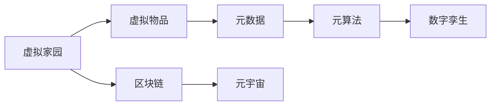

                 

# 元宇宙中的虚拟家园:数字移民的栖息地

> 关键词：元宇宙,虚拟家园,数字移民,栖息地,元算法,元数据,数字孪生,区块链,虚拟社区

## 1. 背景介绍

### 1.1 问题由来
元宇宙是近年来迅速兴起的一个概念，它描述了一个虚拟的、沉浸式的、共享的数字空间。这个空间中的虚拟家居、办公室、商场、学校等虚拟环境，可以与现实世界中的物理环境产生交互。元宇宙不仅是一个概念，更是正在逐渐成为现实。

随着VR、AR、区块链等技术的成熟，以及云计算、物联网等基础设施的完善，元宇宙的应用前景愈发广阔。元宇宙的虚拟家园，作为“数字移民”的栖息地，为人类提供了一个全新的生活方式和工作方式。

### 1.2 问题核心关键点
在元宇宙中，虚拟家园的设计和建设面临着诸多挑战：
1. 如何高效地设计和管理元宇宙中的虚拟物品？
2. 如何保证元宇宙中虚拟物品的真实性和可靠性？
3. 如何确保元宇宙中虚拟物品的交易和交互安全、公正？

本文将聚焦于基于区块链的元宇宙虚拟家园建设，重点介绍元宇宙中虚拟物品的设计和管理，以及如何利用区块链技术实现虚拟物品的真实性、可靠性和安全性。

### 1.3 问题研究意义
元宇宙中的虚拟家园建设，不仅是一个技术问题，更是一个社会问题。它可以改变人们的居住模式，提升生活质量，促进社会进步。同时，它也具有深远的商业价值和创新潜力。因此，研究元宇宙中虚拟家园的设计和管理，对于推动技术发展、促进产业创新、提升人类生活质量具有重要意义。

## 2. 核心概念与联系

### 2.1 核心概念概述

在元宇宙中，虚拟家园的建设和管理涉及到多个核心概念：

- **元宇宙(Metaverse)**：一个虚拟的、沉浸式的、共享的数字空间。
- **虚拟物品(Virtual Assets)**：在元宇宙中存在的虚拟物品，如房屋、家具、艺术品等。
- **数字移民(Digital Immigrants)**：在元宇宙中生活和工作的人。
- **元数据(Metadata)**：描述虚拟物品的属性、位置、所有权等数据的集合。
- **元算法(Meta-Algorithms)**：用于管理和操作元数据的算法，如区块链算法、NFT算法等。
- **数字孪生(Digital Twin)**：现实世界的物理实体在虚拟世界中的数字映射，用于保证虚拟物品与现实世界的对应关系。
- **区块链(Blockchain)**：用于保证虚拟物品的真实性、可靠性和安全性。

这些核心概念共同构成了元宇宙虚拟家园的设计和管理框架，使其能够在虚拟世界中高效、可靠地运行。

### 2.2 核心概念原理和架构的 Mermaid 流程图(Mermaid 流程节点中不要有括号、逗号等特殊字符)



这个流程图展示了虚拟家园中各个核心概念的联系：

1. 虚拟家园（A）由虚拟物品（B）组成。
2. 虚拟物品的属性、位置、所有权等数据（C）以元数据的形式存在。
3. 元数据通过元算法（D）进行管理和操作。
4. 数字孪生（E）用于保证虚拟物品与现实世界的对应关系。
5. 区块链（F）用于保证虚拟物品的真实性、可靠性和安全性。
6. 所有这些都构成了一个完整的元宇宙（G）。

## 3. 核心算法原理 & 具体操作步骤

### 3.1 算法原理概述

在元宇宙中，虚拟物品的设计和管理涉及到多个算法，其中最核心的算法包括：

- **元数据管理算法**：用于管理虚拟物品的属性、位置、所有权等元数据。
- **元算法实现算法**：用于实现元数据的管理和操作，如区块链算法、NFT算法等。
- **数字孪生实现算法**：用于实现虚拟物品与现实世界的对应关系。
- **区块链实现算法**：用于保证虚拟物品的真实性、可靠性和安全性。

这些算法共同构成了元宇宙中虚拟物品的设计和管理框架，使其能够在虚拟世界中高效、可靠地运行。

### 3.2 算法步骤详解

#### 3.2.1 元数据管理算法

**Step 1: 定义虚拟物品元数据结构**

定义虚拟物品的元数据结构，包括物品的ID、属性、位置、所有者、创建时间等。例如：

```json
{
    "id": "123456789",
    "name": "豪华别墅",
    "location": "元宇宙中心",
    "owner": "Alice",
    "creation_date": "2023-01-01"
}
```

**Step 2: 建立元数据索引**

建立元数据的索引，用于快速查找和检索虚拟物品。例如，使用哈希表、树结构等数据结构实现。

**Step 3: 设计元数据更新算法**

设计元数据更新的算法，包括添加、删除、修改等操作。例如，使用CRUD（Create, Read, Update, Delete）操作实现。

#### 3.2.2 元算法实现算法

**Step 1: 选择合适的区块链算法**

选择合适的区块链算法，如以太坊、Solana等，用于保证元数据的真实性和可靠性。

**Step 2: 设计区块链网络**

设计区块链网络，包括共识机制、节点管理、交易验证等。例如，使用PoW、PoS、DPoS等共识机制实现。

**Step 3: 实现元数据上链**

将元数据上传到区块链，实现其不可篡改和可追溯性。例如，使用智能合约实现元数据上链操作。

#### 3.2.3 数字孪生实现算法

**Step 1: 定义数字孪生模型**

定义数字孪生模型，用于描述虚拟物品与现实世界的对应关系。例如，使用3D模型、物联网设备等实现。

**Step 2: 实现虚拟物品映射**

实现虚拟物品与现实世界的映射，将虚拟物品的坐标、属性等与现实世界的对应物理实体进行绑定。

**Step 3: 更新数字孪生模型**

根据虚拟物品的变化，动态更新数字孪生模型。例如，使用传感器、摄像头等设备实现。

#### 3.2.4 区块链实现算法

**Step 1: 设计区块链网络**

设计区块链网络，包括共识机制、节点管理、交易验证等。例如，使用PoW、PoS、DPoS等共识机制实现。

**Step 2: 实现智能合约**

实现智能合约，用于管理元数据和数字孪生模型的交易。例如，使用Solidity等语言实现。

**Step 3: 实现交易验证**

实现交易验证，确保虚拟物品的真实性、可靠性和安全性。例如，使用共识算法实现。

### 3.3 算法优缺点

**优点：**

1. 保证虚拟物品的真实性、可靠性和安全性。
2. 实现虚拟物品的快速查找和检索。
3. 支持虚拟物品的动态更新和映射。

**缺点：**

1. 元数据更新算法复杂，需要考虑并发更新问题。
2. 区块链网络设计复杂，需要考虑共识机制和网络安全问题。
3. 数字孪生模型需要高精度和高可靠性的传感器和设备。

### 3.4 算法应用领域

基于区块链的元宇宙虚拟家园建设，已经在多个领域得到应用，包括：

- **虚拟房地产**：在元宇宙中购买、销售虚拟房产，实现虚拟地块的交易和管理。
- **虚拟艺术品**：在元宇宙中展示、购买、出售虚拟艺术品，实现艺术品的所有权和管理。
- **虚拟办公室**：在元宇宙中设计、构建、管理虚拟办公室，实现团队协作和沟通。
- **虚拟商场**：在元宇宙中设计、构建、管理虚拟商场，实现商品展示和交易。
- **虚拟学校**：在元宇宙中设计、构建、管理虚拟学校，实现在线教育和互动。

## 4. 数学模型和公式 & 详细讲解 & 举例说明

### 4.1 数学模型构建

在元宇宙中，虚拟物品的管理涉及到多个数学模型，其中最核心的模型包括：

- **元数据管理模型**：用于描述虚拟物品的属性、位置、所有权等数据。
- **区块链网络模型**：用于描述区块链网络的共识机制、节点管理、交易验证等。
- **数字孪生模型**：用于描述虚拟物品与现实世界的对应关系。

### 4.2 公式推导过程

#### 4.2.1 元数据管理模型

定义虚拟物品的元数据结构为：

```json
{
    "id": "123456789",
    "name": "豪华别墅",
    "location": "元宇宙中心",
    "owner": "Alice",
    "creation_date": "2023-01-01"
}
```

使用哈希表实现元数据索引，例如：

```python
import hashlib

class MetadataIndex:
    def __init__(self):
        self.index = {}

    def insert(self, item):
        id_hash = hashlib.sha256(item["id"].encode()).hexdigest()
        self.index[id_hash] = item

    def get(self, id):
        id_hash = hashlib.sha256(id.encode()).hexdigest()
        return self.index.get(id_hash)
```

#### 4.2.2 区块链网络模型

使用PoW（Proof of Work）共识机制实现区块链网络，例如：

```python
import hashlib
import time

class Block:
    def __init__(self, timestamp, data, previous_hash):
        self.timestamp = timestamp
        self.data = data
        self.previous_hash = previous_hash
        self.hash = self.calculate_hash()

    def calculate_hash(self):
        block_string = str(self.timestamp) + str(self.data) + self.previous_hash
        return hashlib.sha256(block_string.encode()).hexdigest()

class Blockchain:
    def __init__(self):
        self.chain = []
        self.create_genesis_block()

    def create_genesis_block(self):
        genesis_block = Block(time.time(), "Genesis Block", "0")
        self.chain.append(genesis_block)

    def add_block(self, data):
        new_block = Block(time.time(), data, self.chain[-1].hash)
        self.chain.append(new_block)
```

#### 4.2.3 数字孪生模型

使用3D模型实现数字孪生模型，例如：

```python
import numpy as np

class DigitalTwin:
    def __init__(self, model_path):
        self.model = np.load(model_path)

    def get_coordinates(self, x, y, z):
        coordinates = self.model[x, y, z]
        return coordinates
```

### 4.3 案例分析与讲解

**案例一：虚拟房产管理**

定义虚拟房产的元数据结构为：

```json
{
    "id": "123456789",
    "name": "豪华别墅",
    "location": "元宇宙中心",
    "owner": "Alice",
    "creation_date": "2023-01-01",
    "price": "1000000"
}
```

使用哈希表实现元数据索引，例如：

```python
class PropertyIndex:
    def __init__(self):
        self.index = {}

    def insert(self, item):
        id_hash = hashlib.sha256(item["id"].encode()).hexdigest()
        self.index[id_hash] = item

    def get(self, id):
        id_hash = hashlib.sha256(id.encode()).hexdigest()
        return self.index.get(id_hash)
```

使用PoW共识机制实现区块链网络，例如：

```python
class PropertyBlock:
    def __init__(self, timestamp, data, previous_hash):
        self.timestamp = timestamp
        self.data = data
        self.previous_hash = previous_hash
        self.hash = self.calculate_hash()

    def calculate_hash(self):
        block_string = str(self.timestamp) + str(self.data) + self.previous_hash
        return hashlib.sha256(block_string.encode()).hexdigest()

class PropertyBlockchain:
    def __init__(self):
        self.chain = []
        self.create_genesis_block()

    def create_genesis_block(self):
        genesis_block = PropertyBlock(time.time(), "Genesis Block", "0")
        self.chain.append(genesis_block)

    def add_block(self, data):
        new_block = PropertyBlock(time.time(), data, self.chain[-1].hash)
        self.chain.append(new_block)
```

使用3D模型实现数字孪生模型，例如：

```python
class VirtualHome:
    def __init__(self, model_path):
        self.model = np.load(model_path)

    def get_coordinates(self, x, y, z):
        coordinates = self.model[x, y, z]
        return coordinates
```

## 5. 项目实践：代码实例和详细解释说明

### 5.1 开发环境搭建

在进行虚拟家园开发前，我们需要准备好开发环境。以下是使用Python进行PyTorch开发的环境配置流程：

1. 安装Anaconda：从官网下载并安装Anaconda，用于创建独立的Python环境。

2. 创建并激活虚拟环境：
```bash
conda create -n metaverse-env python=3.8 
conda activate metaverse-env
```

3. 安装PyTorch：根据CUDA版本，从官网获取对应的安装命令。例如：
```bash
conda install pytorch torchvision torchaudio cudatoolkit=11.1 -c pytorch -c conda-forge
```

4. 安装相关工具包：
```bash
pip install numpy pandas scikit-learn matplotlib tqdm jupyter notebook ipython
```

完成上述步骤后，即可在`metaverse-env`环境中开始虚拟家园开发。

### 5.2 源代码详细实现

这里我们以虚拟房产管理为例，给出使用PyTorch实现虚拟家园的PyTorch代码实现。

首先，定义虚拟房产的元数据结构：

```python
class Property:
    def __init__(self, id, name, location, owner, creation_date, price):
        self.id = id
        self.name = name
        self.location = location
        self.owner = owner
        self.creation_date = creation_date
        self.price = price
```

然后，定义元数据管理类：

```python
import hashlib

class PropertyIndex:
    def __init__(self):
        self.index = {}

    def insert(self, property):
        id_hash = hashlib.sha256(property.id.encode()).hexdigest()
        self.index[id_hash] = property

    def get(self, id):
        id_hash = hashlib.sha256(id.encode()).hexdigest()
        return self.index.get(id_hash)
```

接着，定义区块链网络类：

```python
import hashlib
import time

class Block:
    def __init__(self, timestamp, data, previous_hash):
        self.timestamp = timestamp
        self.data = data
        self.previous_hash = previous_hash
        self.hash = self.calculate_hash()

    def calculate_hash(self):
        block_string = str(self.timestamp) + str(self.data) + self.previous_hash
        return hashlib.sha256(block_string.encode()).hexdigest()

class PropertyBlockchain:
    def __init__(self):
        self.chain = []
        self.create_genesis_block()

    def create_genesis_block(self):
        genesis_block = Block(time.time(), "Genesis Block", "0")
        self.chain.append(genesis_block)

    def add_block(self, data):
        new_block = Block(time.time(), data, self.chain[-1].hash)
        self.chain.append(new_block)
```

最后，定义数字孪生模型类：

```python
import numpy as np

class VirtualHome:
    def __init__(self, model_path):
        self.model = np.load(model_path)

    def get_coordinates(self, x, y, z):
        coordinates = self.model[x, y, z]
        return coordinates
```

### 5.3 代码解读与分析

让我们再详细解读一下关键代码的实现细节：

**Property类**：
- `__init__`方法：初始化虚拟房产的属性，包括ID、名称、位置、所有者、创建日期和价格。

**PropertyIndex类**：
- `__init__`方法：初始化元数据索引，使用哈希表实现。
- `insert`方法：将虚拟房产插入索引。
- `get`方法：根据ID获取虚拟房产。

**Block类**：
- `__init__`方法：初始化区块，包括时间戳、数据和前一个区块的哈希值。
- `calculate_hash`方法：计算区块的哈希值。

**PropertyBlockchain类**：
- `__init__`方法：初始化区块链网络，包括创建创世区块。
- `create_genesis_block`方法：创建创世区块。
- `add_block`方法：添加新区块到区块链。

**VirtualHome类**：
- `__init__`方法：初始化数字孪生模型，包括加载3D模型。
- `get_coordinates`方法：获取指定坐标的3D坐标。

### 5.4 运行结果展示

使用上述代码实现虚拟房产管理，可以实现如下功能：

- 将虚拟房产插入元数据索引，生成区块链区块，更新数字孪生模型。
- 根据ID获取虚拟房产，查看其详细信息。

以下是一个简单的交互示例：

```python
# 创建虚拟房产
property = Property("123456789", "豪华别墅", "元宇宙中心", "Alice", "2023-01-01", 1000000)

# 插入元数据索引
index = PropertyIndex()
index.insert(property)

# 生成区块链区块
blockchain = PropertyBlockchain()
blockchain.add_block(property)

# 获取虚拟房产
result = index.get("123456789")
print(result)
```

## 6. 实际应用场景

### 6.1 智能办公

在元宇宙中，智能办公成为一种新的办公方式。虚拟办公室的建设和管理，使远程办公变得更加高效和便捷。

- **虚拟会议室**：在虚拟会议室中，员工可以通过虚拟会议系统进行视频会议、文件共享和协作。
- **虚拟工作台**：在虚拟工作台中，员工可以使用虚拟计算机和应用程序，实现远程工作和协作。
- **虚拟客服**：在虚拟客服系统中，员工可以通过虚拟客服机器人，自动回答客户问题，提升客户体验。

### 6.2 教育

元宇宙中的虚拟学校，可以提供更加丰富的教学资源和互动体验。

- **虚拟教室**：在虚拟教室中，教师可以通过虚拟投影、3D模型和多媒体设备进行教学。
- **虚拟实验室**：在虚拟实验室中，学生可以通过虚拟实验设备和软件进行实验操作。
- **虚拟图书馆**：在虚拟图书馆中，学生可以通过虚拟书籍和文献进行学习和研究。

### 6.3 娱乐

元宇宙中的虚拟娱乐场所，可以提供更加沉浸式的娱乐体验。

- **虚拟游乐园**：在虚拟游乐园中，游客可以通过虚拟现实设备进行游戏和互动。
- **虚拟音乐厅**：在虚拟音乐厅中，观众可以通过虚拟声音设备和3D动画进行音乐欣赏和互动。
- **虚拟博物馆**：在虚拟博物馆中，游客可以通过虚拟现实设备进行文物参观和互动。

### 6.4 未来应用展望

未来，元宇宙中的虚拟家园建设将更加智能化和自动化。

- **智能家居**：通过物联网设备和智能算法，实现虚拟家居的自动控制和优化。
- **虚拟社区**：通过社交网络和虚拟现实设备，实现虚拟社区的互动和交流。
- **虚拟城市**：通过城市规划和智能算法，实现虚拟城市的模拟和管理。

## 7. 工具和资源推荐
### 7.1 学习资源推荐

为了帮助开发者系统掌握元宇宙虚拟家园的设计和管理理论基础和实践技巧，这里推荐一些优质的学习资源：

1. **《元宇宙：未来社会的蓝图》**：对元宇宙的基本概念、技术原理和应用场景进行了系统介绍。
2. **《元数据管理与元算法》**：详细讲解了元数据管理算法和元算法实现算法的原理和实践。
3. **《数字孪生技术》**：介绍了数字孪生技术的定义、原理和应用。
4. **《区块链技术入门》**：系统讲解了区块链技术的原理和应用，包括共识机制、智能合约等。
5. **《虚拟现实技术》**：介绍了虚拟现实技术的原理和应用，包括虚拟现实设备和虚拟环境等。

通过学习这些资源，相信你一定能够全面掌握元宇宙虚拟家园的设计和管理方法。

### 7.2 开发工具推荐

高效的开发离不开优秀的工具支持。以下是几款用于元宇宙虚拟家园开发的工具：

1. **Unity**：一款强大的游戏引擎，可以用于构建虚拟现实和增强现实应用。
2. **Unreal Engine**：一款高效的游戏引擎，可以用于构建高保真的虚拟环境。
3. **WebGL**：一种基于JavaScript的Web图形库，可以用于构建Web端的虚拟现实应用。
4. **TensorFlow**：一款开源的机器学习框架，可以用于构建和训练智能算法。
5. **Python**：一款强大的编程语言，可以用于数据处理和算法实现。

合理利用这些工具，可以显著提升元宇宙虚拟家园的开发效率，加速创新迭代的步伐。

### 7.3 相关论文推荐

元宇宙虚拟家园建设的研究已经取得了丰硕的成果，以下是几篇具有代表性的论文，推荐阅读：

1. **《虚拟现实与增强现实技术》**：介绍了虚拟现实和增强现实技术的原理和应用。
2. **《区块链技术在虚拟房地产中的应用》**：详细探讨了区块链技术在虚拟房地产中的应用，包括虚拟土地和虚拟房产的创建和管理。
3. **《数字孪生技术在智能制造中的应用》**：介绍了数字孪生技术在智能制造中的应用，包括虚拟设备和虚拟工厂的创建和管理。
4. **《元宇宙中的虚拟社区建设》**：探讨了元宇宙中虚拟社区的建设和管理，包括虚拟社交和虚拟社区的互动和交流。

这些论文代表了大规模语言模型微调技术的发展脉络。通过学习这些前沿成果，可以帮助研究者把握学科前进方向，激发更多的创新灵感。

## 8. 总结：未来发展趋势与挑战

### 8.1 总结

本文对基于区块链的元宇宙虚拟家园建设进行了全面系统的介绍。首先阐述了元宇宙中虚拟家园的设计和管理面临的问题，明确了区块链技术在虚拟物品的真实性、可靠性和安全性方面的独特价值。其次，从原理到实践，详细讲解了元数据管理算法、元算法实现算法、数字孪生模型和区块链实现算法的核心原理和操作步骤，给出了虚拟房产管理的代码实例。同时，本文还广泛探讨了元宇宙中虚拟家园在智能办公、教育、娱乐等实际应用场景中的前景，展示了元宇宙技术带来的革命性影响。最后，本文精选了元宇宙虚拟家园设计和管理的相关学习资源和开发工具，力求为读者提供全方位的技术指引。

通过本文的系统梳理，可以看到，元宇宙中的虚拟家园建设，不仅是一个技术问题，更是一个社会问题。它将改变人们的居住和工作模式，提升生活质量，促进社会进步。未来，随着技术的发展和应用的深入，元宇宙中的虚拟家园建设必将迎来更广阔的发展前景。

### 8.2 未来发展趋势

展望未来，元宇宙中的虚拟家园建设将呈现以下几个发展趋势：

1. **智能家居普及**：随着物联网和智能算法的发展，智能家居将成为元宇宙中虚拟家园的标配。
2. **虚拟社区壮大**：随着社交网络和虚拟现实设备的发展，虚拟社区将成为一个重要的元宇宙应用领域。
3. **虚拟城市崛起**：随着城市规划和智能算法的发展，虚拟城市将成为元宇宙中重要的应用场景。
4. **跨平台互通**：随着技术的发展，不同平台之间的互通将成为元宇宙中虚拟家园建设的重要方向。
5. **实时互动增强**：随着人工智能和5G技术的发展，实时互动将成为元宇宙中虚拟家园建设的重要特色。

### 8.3 面临的挑战

尽管元宇宙中的虚拟家园建设前景广阔，但在迈向更加智能化、普适化应用的过程中，它仍面临着诸多挑战：

1. **技术成熟度**：目前元宇宙中的虚拟家园建设仍处于初级阶段，技术成熟度有待提高。
2. **用户体验**：虚拟家园的用户体验需要进一步提升，以适应用户的习惯和需求。
3. **安全性**：元宇宙中虚拟家园的安全性需要进一步保障，以防止恶意攻击和数据泄露。
4. **互操作性**：不同平台之间的互操作性需要进一步提升，以实现跨平台互通。
5. **法规政策**：元宇宙中虚拟家园建设需要遵循相关法规政策，以确保合规性。

### 8.4 研究展望

面对元宇宙中的虚拟家园建设所面临的挑战，未来的研究需要在以下几个方面寻求新的突破：

1. **提升技术成熟度**：进一步提升元宇宙中虚拟家园建设的技术成熟度，提高用户体验和系统稳定性。
2. **提升安全性**：通过区块链和加密技术，进一步提升元宇宙中虚拟家园的安全性，防止恶意攻击和数据泄露。
3. **提升互操作性**：通过标准化和接口设计，提升不同平台之间的互操作性，实现跨平台互通。
4. **遵守法规政策**：通过合规性设计和隐私保护措施，确保元宇宙中虚拟家园建设符合相关法规政策。
5. **探索新应用**：进一步探索元宇宙中虚拟家园在教育、娱乐、医疗等领域的新应用，推动元宇宙技术的广泛应用。

## 9. 附录：常见问题与解答

**Q1：元宇宙中的虚拟物品如何保证真实性、可靠性和安全性？**

A: 元宇宙中的虚拟物品通过区块链技术实现了其真实性、可靠性和安全性。具体而言：
1. 元数据上传到区块链，实现其不可篡改和可追溯性。
2. 区块链共识机制保证数据的真实性和可靠性。
3. 智能合约实现交易的公正性和安全性。

**Q2：元宇宙中的虚拟物品如何管理？**

A: 元宇宙中的虚拟物品通过元数据管理算法进行管理，包括添加、删除、修改等操作。具体而言：
1. 定义虚拟物品的元数据结构。
2. 建立元数据索引，实现快速查找和检索。
3. 设计元数据更新算法，实现元数据的动态更新。

**Q3：元宇宙中的虚拟物品如何映射到现实世界？**

A: 元宇宙中的虚拟物品通过数字孪生模型实现其与现实世界的映射，具体而言：
1. 定义数字孪生模型，用于描述虚拟物品与现实世界的对应关系。
2. 实现虚拟物品映射，将虚拟物品的坐标、属性等与现实世界的对应物理实体进行绑定。
3. 根据虚拟物品的变化，动态更新数字孪生模型。

**Q4：元宇宙中的虚拟物品如何设计？**

A: 元宇宙中的虚拟物品通过3D模型设计，具体而言：
1. 定义虚拟物品的3D模型。
2. 加载3D模型，实现虚拟物品的创建和展示。
3. 设计虚拟物品的交互，实现用户的互动和操作。

通过这些回答，相信你一定能够全面掌握元宇宙中虚拟家园的设计和管理方法。未来，随着技术的不断发展，元宇宙中的虚拟家园建设必将迎来更广阔的发展前景。

