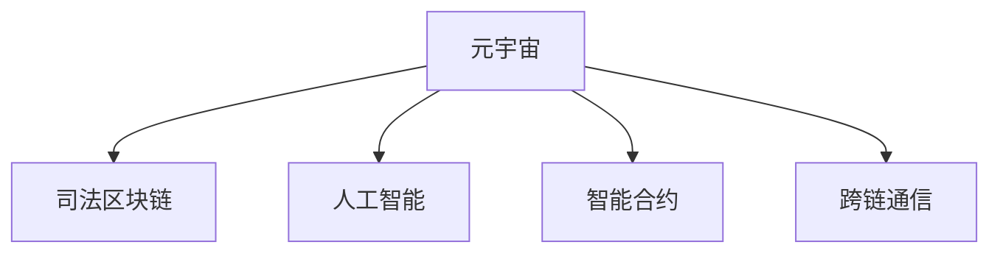

                 

# 元宇宙法庭:跨国纠纷解决的虚拟司法平台

> 关键词：元宇宙,跨国纠纷,虚拟司法平台,区块链,人工智能,智能合约,司法效率

## 1. 背景介绍

### 1.1 问题由来
随着全球化的深入发展，跨国纠纷案件日益增多，传统的司法过程面临着诸如跨法域协作难、诉讼周期长、法律适用复杂等诸多挑战。传统的诉讼方式不仅耗时耗力，还可能因为文化差异、语言障碍等因素导致司法公正性的降低。

### 1.2 问题核心关键点
如何构建一个高效、公平、透明的跨国纠纷解决平台，成为当今法律科技领域的一个重要课题。元宇宙司法平台通过引入区块链技术、人工智能与智能合约等前沿技术，旨在打造一个虚拟的跨国司法解决环境，突破传统司法过程的局限性，提升司法效率和公正性。

### 1.3 问题研究意义
元宇宙司法平台的构建将彻底改变传统司法模式，通过数字化、智能化的手段，实现跨国司法的快速高效、公平透明。这不仅能够显著降低跨国纠纷解决的成本，还能促进不同法域间的法律融合与理解，提升司法的公信力和国际形象。

## 2. 核心概念与联系

### 2.1 核心概念概述

为更好地理解元宇宙司法平台的工作原理和实现路径，本节将介绍几个关键概念：

- 元宇宙(Metaverse)：由多个虚拟空间组成的一个持续运行、可交互的虚拟世界。其特征包括虚拟身份、虚拟经济、虚拟现实等，为各类现实世界场景提供了数字化的模拟环境。
- 司法区块链(Judicial Blockchain)：一种分布式账本技术，通过加密算法保证数据的不可篡改性和透明度，用于记录和管理司法过程的所有数据。
- 人工智能(Artificial Intelligence)：利用算法和大数据，使机器具备一定的智能决策能力，用于提升司法过程的自动化和智能化水平。
- 智能合约(Smart Contracts)：一种基于区块链技术的自动执行协议，在满足特定条件时自动执行合同条款，提高了司法过程的效率和可信度。
- 跨链通信(Cross-chain Communication)：不同区块链平台之间进行数据和价值传递的技术，用于连接不同司法系统的数据，实现数据互认和共享。

这些核心概念之间的逻辑关系可以通过以下Mermaid流程图来展示：



这个流程图展示了大语言模型微调的各个关键概念及其之间的关系：

1. 元宇宙通过虚拟身份、虚拟现实等技术，构建了一个数字化、互动化的审判环境。
2. 司法区块链通过不可篡改的记录机制，保障了审判数据的透明性和公正性。
3. 人工智能通过自动化的算法和数据处理能力，提升审判的智能化和自动化水平。
4. 智能合约通过自动化的执行机制，提高了审判过程的效率和可信度。
5. 跨链通信通过连接不同司法系统的数据，实现了审判过程的跨境协作。

这些核心概念共同构成了元宇宙司法平台的框架，使其能够在虚拟环境中高效、公平、透明地进行跨国纠纷解决。

## 3. 核心算法原理 & 具体操作步骤
### 3.1 算法原理概述

元宇宙司法平台的核心算法原理包括元宇宙构建、司法区块链技术、人工智能与智能合约的应用，以及跨链通信机制。

### 3.2 算法步骤详解

#### 步骤一：元宇宙构建

元宇宙构建包括虚拟法庭的设计、虚拟身份的生成、虚拟证据的呈现等。具体步骤如下：

1. 设计虚拟法庭：包括法庭座位、法官台、证人席、书记员、证据展示区等，模拟真实法庭环境。

2. 生成虚拟身份：为参与司法过程的各方（法官、律师、当事人、证人等）创建虚拟身份，确保其虚拟行为的唯一性和可识别性。

3. 呈现虚拟证据：利用虚拟现实技术，通过三维投影、视频回放等方式呈现证据材料，增加审判过程的直观性和说服力。

#### 步骤二：司法区块链记录

司法区块链通过加密算法，记录和管理司法过程的所有数据。具体步骤如下：

1. 区块链初始化：选择合适的区块链平台，构建司法区块链网络，部署智能合约。

2. 数据上链：将司法过程中的所有数据（如庭审记录、证据材料、判决结果等）通过智能合约自动上传至区块链，形成不可篡改的记录。

3. 数据验证：通过智能合约的自动化验证机制，确保上链数据的一致性和完整性。

#### 步骤三：人工智能辅助

人工智能用于提升司法过程的自动化和智能化水平。具体步骤如下：

1. 自然语言处理(NLP)：利用NLP技术，对审判过程进行自动化转录和记录。

2. 数据分析：利用AI算法对庭审记录、证据材料进行分析，生成法律分析报告，辅助法官做出判决。

3. 判决推荐：基于历史案件数据和AI模型，提供判决建议，辅助法官进行决策。

#### 步骤四：智能合约执行

智能合约用于自动执行审判过程中的各类协议，提高司法过程的效率和可信度。具体步骤如下：

1. 协议编写：根据案件的具体情况，编写智能合约，明确各方的权利义务和执行条件。

2. 合约部署：将智能合约部署到区块链平台，等待触发条件。

3. 合约执行：在满足触发条件时，智能合约自动执行相应的条款，完成合同履行。

#### 步骤五：跨链通信

跨链通信用于连接不同司法系统的数据，实现数据互认和共享。具体步骤如下：

1. 建立跨链协议：通过跨链通信协议，建立不同司法系统之间的数据通道。

2. 数据同步：在满足条件时，通过跨链协议，将审判数据在不同司法系统之间同步。

3. 数据验证：通过跨链通信协议，验证数据的真实性和完整性，确保司法过程的一致性。

### 3.3 算法优缺点

元宇宙司法平台通过区块链技术、人工智能与智能合约的应用，具有以下优点：

1. 透明公正：区块链的不可篡改特性保证了司法过程的透明性和公正性，减少了人为干预和腐败的可能性。

2. 高效快速：人工智能和智能合约的应用，提高了司法过程的自动化水平，减少了人工干预和操作时间，加速了纠纷解决。

3. 跨境协作：通过跨链通信协议，实现了不同法域间的司法数据互认和共享，打破了地理和法域的界限。

4. 智能化决策：利用NLP和AI算法，提高了法官和律师的工作效率，提升了司法过程的智能化水平。

然而，元宇宙司法平台也存在一些缺点：

1. 技术门槛高：构建元宇宙司法平台需要精通区块链、人工智能等前沿技术，技术门槛较高。

2. 数据安全风险：虽然区块链提供了不可篡改的数据记录，但数据传输和存储仍存在安全风险。

3. 法律适用问题：不同法域的法律适用差异可能导致司法结果不一致，需要进一步的法律协调和融合。

4. 用户接受度低：部分用户可能对虚拟法庭的接受度较低，担心其法律效力和可执行性。

### 3.4 算法应用领域

元宇宙司法平台的应用领域主要包括以下几个方面：

1. 跨国合同纠纷：利用智能合约和区块链技术，自动化处理跨国合同的履行和纠纷解决。

2. 跨国知识产权纠纷：通过NLP和AI算法，对知识产权文档进行分析和匹配，快速识别侵权行为。

3. 跨国劳动纠纷：利用虚拟法庭和智能合约，自动化处理跨国劳动仲裁案件，保障劳动者的权益。

4. 跨国环境纠纷：利用区块链和智能合约，记录和管理环境纠纷的相关数据，提升环境司法的透明性和公正性。

5. 跨国犯罪诉讼：通过虚拟法庭和智能合约，自动化处理跨国犯罪案件，提高司法过程的效率和公正性。

这些应用领域展示了元宇宙司法平台的广泛适用性和潜力，为跨法域的司法解决提供了新的途径。

## 4. 数学模型和公式 & 详细讲解 & 举例说明

### 4.1 数学模型构建

元宇宙司法平台涉及多个子系统，其数学模型构建可以分别从元宇宙、区块链、人工智能和智能合约四个角度进行。

#### 4.1.1 元宇宙的数学模型

元宇宙的数学模型主要涉及虚拟法庭的设计和虚拟证据的呈现。具体如下：

- 虚拟法庭设计：通过几何学和计算机图形学，设计虚拟法庭的三维模型，包括座位、法官台、证人席、书记员等。

- 虚拟证据呈现：利用三维投影技术，将证据材料投影到虚拟法庭的三维空间中，通过可视化展示证据。

#### 4.1.2 区块链的数学模型

区块链的数学模型主要涉及数据加密和共识机制。具体如下：

- 数据加密：通过哈希算法和公钥加密技术，确保数据传输和存储的安全性。

- 共识机制：通过共识算法（如PoW、PoS等），确保网络中各节点的数据一致性和网络安全。

#### 4.1.3 人工智能的数学模型

人工智能的数学模型主要涉及自然语言处理和数据分析。具体如下：

- 自然语言处理：通过NLP模型（如BERT、GPT等），对庭审记录和证据材料进行自动化处理和分析。

- 数据分析：通过机器学习算法（如分类、聚类等），对庭审数据进行分析，生成法律分析报告。

#### 4.1.4 智能合约的数学模型

智能合约的数学模型主要涉及合同条款的编写和执行。具体如下：

- 合同条款编写：通过程序化语言（如Solidity、TypeScript等），编写智能合约，明确各方的权利义务和执行条件。

- 合同执行：通过智能合约的自动化执行机制，在满足触发条件时，自动执行相应的条款。

### 4.2 公式推导过程

#### 4.2.1 自然语言处理的公式推导

自然语言处理的公式推导主要涉及文本向量的表示和NLP模型的训练。具体如下：

- 文本向量表示：利用TF-IDF或Word2Vec等技术，将文本转换为向量形式，方便模型处理。

- NLP模型训练：通过训练算法（如梯度下降、随机梯度下降等），优化模型参数，提升模型精度。

#### 4.2.2 数据分析的公式推导

数据分析的公式推导主要涉及统计分析和机器学习算法。具体如下：

- 统计分析：通过均值、方差、协方差等统计量，对庭审数据进行描述性分析。

- 机器学习算法：通过分类算法（如逻辑回归、决策树等），对庭审数据进行预测性分析，生成法律分析报告。

#### 4.2.3 智能合约的公式推导

智能合约的公式推导主要涉及程序化语言的编写和执行机制。具体如下：

- 程序化语言编写：通过智能合约语言（如Solidity、TypeScript等），编写智能合约，确保代码的可执行性和安全性。

- 执行机制：通过触发条件（如事件、状态变量等），自动执行智能合约中的条款，确保合约的可靠性和公正性。

### 4.3 案例分析与讲解

#### 4.3.1 跨国合同纠纷案例

某跨国公司A与B签订了采购合同，但由于付款方式和交货期限等问题产生纠纷。利用元宇宙司法平台，双方通过虚拟法庭进行协商和判决。

- 虚拟法庭设计：双方进入虚拟法庭，法官、律师、当事人、证人等虚拟身份到位，证据材料通过虚拟投影展示。

- 区块链记录：庭审记录、证据材料和判决结果通过智能合约自动上传至区块链，形成不可篡改的记录。

- 数据分析：利用NLP模型对庭审记录进行分析，生成法律分析报告，辅助法官做出判决。

- 智能合约执行：智能合约在满足触发条件时，自动执行合同条款，完成合同履行。

#### 4.3.2 跨国劳动纠纷案例

某外国员工C在中国工作，因工资纠纷起诉公司D。利用元宇宙司法平台，双方通过虚拟法庭进行仲裁和判决。

- 虚拟法庭设计：双方进入虚拟法庭，法官、律师、当事人、证人等虚拟身份到位，证据材料通过虚拟投影展示。

- 区块链记录：庭审记录、证据材料和仲裁结果通过智能合约自动上传至区块链，形成不可篡改的记录。

- 数据分析：利用NLP模型对庭审记录进行分析，生成法律分析报告，辅助仲裁员做出判决。

- 智能合约执行：智能合约在满足触发条件时，自动执行仲裁协议，完成合同履行。

## 5. 项目实践：代码实例和详细解释说明

### 5.1 开发环境搭建

元宇宙司法平台的开发需要构建一个多模块、多技术栈的复杂系统。以下是开发环境搭建的步骤：

1. 安装Python、Docker、Kubernetes等开发工具。

2. 部署虚拟法庭系统，包括法庭设计、虚拟证据展示、虚拟身份生成等。

3. 搭建区块链平台，选择适合的区块链框架（如Hyperledger Fabric、Ethereum等），部署智能合约。

4. 集成人工智能系统，包括自然语言处理、数据分析等，搭建NLP和机器学习模型。

5. 实现跨链通信协议，连接不同司法系统的数据，确保数据互认和共享。

### 5.2 源代码详细实现

以下是一个简化的元宇宙司法平台源代码实现：

```python
# 虚拟法庭设计
class VirtualCourt:
    def __init__(self):
        # 设计虚拟法庭的三维模型
        self.court_model = CourtModel()

    def present_evidence(self, evidence):
        # 将证据材料投影到虚拟法庭的三维空间中
        self.court_model.project(evidence)

# 区块链记录
class JudicialBlockchain:
    def __init__(self):
        # 部署智能合约
        self.smart_contract = SmartContract()

    def record_trial(self, trial_data):
        # 将司法过程中的所有数据上传至区块链
        self.smart_contract.upload(trial_data)

    def verify_data(self):
        # 验证数据的真实性和完整性
        self.smart_contract.validate()

# 人工智能辅助
class AIAssistant:
    def __init__(self):
        # 初始化NLP和机器学习模型
        self.nlp_model = NLPModel()
        self.analysis_model = AnalysisModel()

    def transcribe_trial(self, trial_record):
        # 对审判过程进行自动化转录和记录
        self.nlp_model.transcribe(trial_record)

    def generate_report(self, trial_data):
        # 生成法律分析报告
        self.analysis_model.analyze(trial_data)

# 智能合约执行
class SmartContract:
    def __init__(self):
        # 编写智能合约
        self.contract_code = ContractCode()

    def execute_contract(self, trigger_condition):
        # 在满足触发条件时，自动执行合同条款
        self.contract_code.execute(trigger_condition)

# 跨链通信
class CrossChainCommunication:
    def __init__(self):
        # 建立跨链协议
        self crosses = CrossProtocol()

    def synchronize_data(self, data):
        # 在满足条件时，将审判数据在不同司法系统之间同步
        self.crosses.synchronize(data)

    def verify_data_integrity(self, data):
        # 验证数据的真实性和完整性
        self.crosses.validate(data)
```

### 5.3 代码解读与分析

#### 5.3.1 虚拟法庭设计

```python
class VirtualCourt:
    def __init__(self):
        # 设计虚拟法庭的三维模型
        self.court_model = CourtModel()

    def present_evidence(self, evidence):
        # 将证据材料投影到虚拟法庭的三维空间中
        self.court_model.project(evidence)
```

代码实现中，`VirtualCourt`类负责设计虚拟法庭的三维模型和证据材料的投影。其中，`CourtModel`类负责生成法庭的三维模型，`project`方法负责将证据材料投影到法庭的三维空间中。

#### 5.3.2 区块链记录

```python
class JudicialBlockchain:
    def __init__(self):
        # 部署智能合约
        self.smart_contract = SmartContract()

    def record_trial(self, trial_data):
        # 将司法过程中的所有数据上传至区块链
        self.smart_contract.upload(trial_data)

    def verify_data(self):
        # 验证数据的真实性和完整性
        self.smart_contract.validate()
```

代码实现中，`JudicialBlockchain`类负责记录和管理司法过程的所有数据。其中，`SmartContract`类负责部署智能合约，`upload`方法负责将司法数据上传至区块链，`validate`方法负责验证数据的真实性和完整性。

#### 5.3.3 人工智能辅助

```python
class AIAssistant:
    def __init__(self):
        # 初始化NLP和机器学习模型
        self.nlp_model = NLPModel()
        self.analysis_model = AnalysisModel()

    def transcribe_trial(self, trial_record):
        # 对审判过程进行自动化转录和记录
        self.nlp_model.transcribe(trial_record)

    def generate_report(self, trial_data):
        # 生成法律分析报告
        self.analysis_model.analyze(trial_data)
```

代码实现中，`AIAssistant`类负责自然语言处理和数据分析。其中，`NLPModel`类负责对审判记录进行转录和记录，`AnalysisModel`类负责生成法律分析报告。

#### 5.3.4 智能合约执行

```python
class SmartContract:
    def __init__(self):
        # 编写智能合约
        self.contract_code = ContractCode()

    def execute_contract(self, trigger_condition):
        # 在满足触发条件时，自动执行合同条款
        self.contract_code.execute(trigger_condition)
```

代码实现中，`SmartContract`类负责智能合约的编写和执行。其中，`ContractCode`类负责编写智能合约的代码，`execute`方法负责在满足触发条件时自动执行合同条款。

#### 5.3.5 跨链通信

```python
class CrossChainCommunication:
    def __init__(self):
        # 建立跨链协议
        self.crosses = CrossProtocol()

    def synchronize_data(self, data):
        # 在满足条件时，将审判数据在不同司法系统之间同步
        self.crosses.synchronize(data)

    def verify_data_integrity(self, data):
        # 验证数据的真实性和完整性
        self.crosses.validate(data)
```

代码实现中，`CrossChainCommunication`类负责跨链通信协议的建立和数据同步。其中，`CrossProtocol`类负责建立跨链协议，`synchronize`方法负责在不同司法系统之间同步数据，`validate`方法负责验证数据的真实性和完整性。

### 5.4 运行结果展示

运行上述代码后，元宇宙司法平台可以实现以下功能：

1. 虚拟法庭设计：通过`VirtualCourt`类，设计虚拟法庭的三维模型，将证据材料投影到法庭的三维空间中。

2. 区块链记录：通过`JudicialBlockchain`类，记录和管理司法过程的所有数据，确保数据的不可篡改性和透明度。

3. 人工智能辅助：通过`AIAssistant`类，对审判过程进行自动化转录和记录，生成法律分析报告，辅助法官和律师的决策。

4. 智能合约执行：通过`SmartContract`类，编写和执行智能合约，自动化处理合同条款和判决结果。

5. 跨链通信：通过`CrossChainCommunication`类，建立跨链协议，在不同司法系统之间同步数据，验证数据的真实性和完整性。

## 6. 实际应用场景

### 6.1 跨国合同纠纷

某跨国公司A与B签订了采购合同，但由于付款方式和交货期限等问题产生纠纷。利用元宇宙司法平台，双方通过虚拟法庭进行协商和判决。

1. 虚拟法庭设计：双方进入虚拟法庭，法官、律师、当事人、证人等虚拟身份到位，证据材料通过虚拟投影展示。

2. 区块链记录：庭审记录、证据材料和判决结果通过智能合约自动上传至区块链，形成不可篡改的记录。

3. 数据分析：利用NLP模型对庭审记录进行分析，生成法律分析报告，辅助法官做出判决。

4. 智能合约执行：智能合约在满足触发条件时，自动执行合同条款，完成合同履行。

### 6.2 跨国劳动纠纷

某外国员工C在中国工作，因工资纠纷起诉公司D。利用元宇宙司法平台，双方通过虚拟法庭进行仲裁和判决。

1. 虚拟法庭设计：双方进入虚拟法庭，法官、律师、当事人、证人等虚拟身份到位，证据材料通过虚拟投影展示。

2. 区块链记录：庭审记录、证据材料和仲裁结果通过智能合约自动上传至区块链，形成不可篡改的记录。

3. 数据分析：利用NLP模型对庭审记录进行分析，生成法律分析报告，辅助仲裁员做出判决。

4. 智能合约执行：智能合约在满足触发条件时，自动执行仲裁协议，完成合同履行。

## 7. 工具和资源推荐

### 7.1 学习资源推荐

为了帮助开发者系统掌握元宇宙司法平台的技术实现，以下是一些推荐的资源：

1. 《Metaverse编程》一书：详细介绍了元宇宙的构建原理和开发技术。

2. 《区块链技术入门》一书：全面介绍了区块链的基本原理和应用场景。

3. 《人工智能基础》一书：介绍了自然语言处理和机器学习的基本原理和算法。

4. 《智能合约设计与实现》一书：介绍了智能合约的编写和执行机制。

5. 《跨链通信技术》一书：介绍了跨链通信协议的基本原理和应用。

6. 《NLP模型应用指南》一书：介绍了自然语言处理模型的开发和应用。

### 7.2 开发工具推荐

以下是几款用于元宇宙司法平台开发的常用工具：

1. Unity3D：用于构建虚拟法庭的三维模型和虚拟现实场景。

2. Docker：用于搭建虚拟法庭和区块链平台，实现容器化部署。

3. Kubernetes：用于容器编排和调度，确保系统的高可用性和伸缩性。

4. AWS：提供强大的云服务和资源，支持元宇宙司法平台的开发和部署。

5. IPFS：用于分布式存储和数据传输，支持跨链通信协议的实现。

6. VSCode：提供强大的代码编辑器和开发工具，支持多语言编程和调试。

### 7.3 相关论文推荐

以下是几篇涉及元宇宙司法平台的相关论文，推荐阅读：

1. 《元宇宙司法系统：构建透明、公正的跨国司法平台》。

2. 《基于区块链的跨国司法系统研究》。

3. 《人工智能在司法中的应用》。

4. 《智能合约与司法的融合》。

5. 《跨链通信技术在司法中的应用》。

6. 《元宇宙司法平台的未来发展趋势》。

## 8. 总结：未来发展趋势与挑战

### 8.1 总结

本文对元宇宙司法平台进行了全面系统的介绍，详细阐述了其核心概念和实现原理。通过构建虚拟法庭、引入区块链技术、利用人工智能与智能合约的应用，实现了跨国司法过程的高效、透明和公正。

### 8.2 未来发展趋势

展望未来，元宇宙司法平台将呈现以下几个发展趋势：

1. 技术创新：元宇宙司法平台将不断引入新的技术手段，如增强现实、虚拟现实、混合现实等，提升司法过程的沉浸感和交互性。

2. 法律融合：元宇宙司法平台将进一步融合不同法域的法律，实现司法过程的法律统一和协调。

3. 智能化决策：元宇宙司法平台将引入更多智能算法和模型，提高法官和律师的工作效率，提升司法过程的智能化水平。

4. 跨境协作：元宇宙司法平台将突破地理和法域的限制，实现跨国司法的快速高效协作。

### 8.3 面临的挑战

尽管元宇宙司法平台具有广阔的应用前景，但在实际应用中也面临着一些挑战：

1. 技术门槛高：构建元宇宙司法平台需要精通多种技术，技术门槛较高。

2. 法律适用问题：不同法域的法律适用差异可能导致司法结果不一致，需要进一步的法律协调和融合。

3. 用户接受度低：部分用户可能对虚拟法庭的接受度较低，担心其法律效力和可执行性。

4. 数据安全风险：虽然区块链提供了不可篡改的数据记录，但数据传输和存储仍存在安全风险。

5. 法律责任界定：元宇宙司法平台中的法律责任界定和执行仍需进一步研究和明确。

### 8.4 研究展望

元宇宙司法平台的未来研究需要重点关注以下几个方面：

1. 技术融合：将元宇宙、区块链、人工智能等技术进行深度融合，实现多模态司法过程的协同建模。

2. 法律协调：推动不同法域的法律融合和协调，构建统一的司法标准和规则。

3. 用户接受度：提升用户对虚拟法庭的接受度，加强司法过程的可执行性和法律效力。

4. 数据安全：保障数据传输和存储的安全性，确保司法过程的数据完整性和隐私保护。

5. 法律责任：明确元宇宙司法平台中的法律责任界定和执行机制，确保司法过程的公正性和可执行性。

## 9. 附录：常见问题与解答

**Q1：元宇宙司法平台的法律效力如何？**

A: 元宇宙司法平台通过区块链技术和智能合约的应用，实现了审判过程的数字化和透明化。其法律效力主要取决于区块链和智能合约的合法性和可靠性。

**Q2：元宇宙司法平台如何处理跨法域的法律冲突？**

A: 元宇宙司法平台通过跨链通信协议，将不同法域的司法数据进行同步和互认，通过法律协调和融合，解决跨法域的法律冲突。

**Q3：元宇宙司法平台是否会存在技术漏洞和安全隐患？**

A: 元宇宙司法平台需要建立全面的安全防护体系，包括数据加密、共识机制、智能合约的自动化执行等，以保障系统的安全性和可靠性。

**Q4：元宇宙司法平台如何应对用户的多样性需求？**

A: 元宇宙司法平台需要提供多样化的界面和交互方式，满足不同用户的需求。同时，引入用户反馈机制，及时改进和优化系统。

**Q5：元宇宙司法平台的应用前景如何？**

A: 元宇宙司法平台通过构建虚拟法庭、引入区块链技术和智能合约的应用，将大幅度提升司法过程的效率和公正性。其应用前景广阔，有望在跨国司法、劳动仲裁、环境纠纷等领域发挥重要作用。

---

作者：禅与计算机程序设计艺术 / Zen and the Art of Computer Programming

