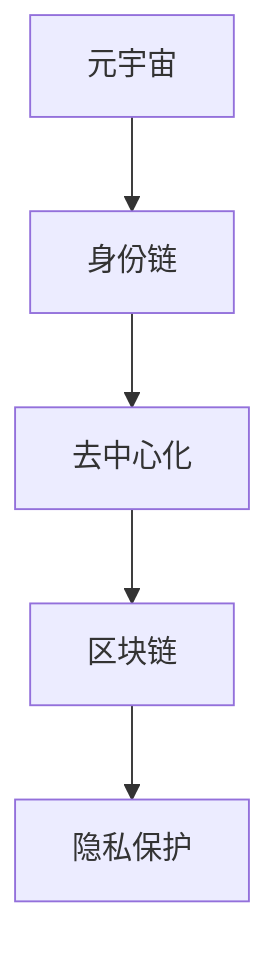

                 

# 元宇宙身份链:去中心化身份验证的技术实现

> 关键词：元宇宙,身份链,去中心化身份验证,区块链,隐私保护

## 1. 背景介绍

### 1.1 问题由来

在数字化时代，人们已经习惯于在各种线上服务中进行身份验证，如社交网络、电子商务、在线银行等。然而，这些传统的身份验证方式往往集中在中心化的服务器上，存在安全隐患和隐私泄露的风险。尤其是在蓬勃发展的元宇宙空间中，用户不仅需要在虚拟世界中进行身份验证，还需要对虚拟资产进行管理。传统的身份验证方式无法满足元宇宙的需求，因此需要一种全新的、去中心化的身份验证解决方案。

### 1.2 问题核心关键点

元宇宙身份链是一种去中心化的身份验证机制，通过区块链技术实现用户的身份认证和隐私保护。其核心在于利用区块链的不可篡改性和去中心化特性，构建一个安全、隐私保护、可互操作的身份认证系统。

## 2. 核心概念与联系

### 2.1 核心概念概述

为更好地理解元宇宙身份链，本节将介绍几个密切相关的核心概念：

- 元宇宙(Metaverse)：一种虚拟的、实时的、三维的、可交互的网络空间，用户可以置身其中，体验虚拟世界的生活和互动。
- 身份链(Identity Chain)：一种基于区块链技术的身份认证机制，将用户的身份信息存储在区块链上，实现去中心化身份验证。
- 去中心化(Decentralized)：一种分布式计算范式，不依赖于单一的服务器或中央机构，通过网络节点之间的协同工作，实现系统的可靠性和安全性的提升。
- 区块链(Blockchain)：一种分布式账本技术，通过去中心化的方式记录和验证交易，保证数据的安全性和透明性。
- 隐私保护(Privacy Protection)：一种保障用户数据和隐私安全的技术手段，通过加密、匿名化等方法，防止用户信息被非法获取和滥用。

这些核心概念之间的逻辑关系可以通过以下Mermaid流程图来展示：



这个流程图展示了大语言模型的核心概念及其之间的关系：

1. 元宇宙通过身份链实现用户身份验证，保证了在虚拟世界中的身份安全。
2. 身份链采用区块链技术，实现去中心化的身份信息存储和验证。
3. 去中心化确保了身份链系统的安全性和可靠性。
4. 隐私保护保护了用户的身份信息和隐私。

这些概念共同构成了元宇宙身份链的基础，使得用户可以在虚拟世界中安全地进行身份认证和隐私保护。通过理解这些核心概念，我们可以更好地把握元宇宙身份链的工作原理和优化方向。

## 3. 核心算法原理 & 具体操作步骤
### 3.1 算法原理概述

元宇宙身份链的算法原理基于区块链的去中心化和不可篡改特性，结合公钥密码学技术，实现用户的身份认证和隐私保护。其核心在于构建一个安全的、可互操作的去中心化身份认证系统，使得用户能够在虚拟世界中安全地进行身份验证和隐私保护。

### 3.2 算法步骤详解

1. **身份注册**：用户需要在区块链上创建一个身份标识，包括公钥、地址等。这个身份标识是不可篡改的，且能够唯一标识用户。
2. **身份验证**：当用户在虚拟世界中需要进行身份验证时，系统会要求用户提供身份标识。系统会通过公钥密码学技术，验证用户身份的合法性。
3. **访问授权**：身份链系统可以根据用户身份和权限，授权用户访问特定的虚拟空间或虚拟资产。
4. **隐私保护**：在身份验证和访问授权过程中，系统会采取隐私保护措施，如加密、匿名化等，防止用户身份和权限信息被泄露。

### 3.3 算法优缺点

元宇宙身份链的优点包括：

- 安全性高：基于区块链的去中心化和不可篡改特性，保证身份验证的安全性。
- 隐私保护：采用隐私保护技术，保护用户的身份信息和隐私。
- 可互操作：元宇宙身份链可以实现跨平台、跨应用的身份认证，提升用户体验。

然而，元宇宙身份链也存在一些缺点：

- 技术复杂度高：构建元宇宙身份链系统需要高水平的技术积累和实践经验。
- 去中心化的信任问题：去中心化系统需要用户对网络节点进行信任，存在一定的信任问题。
- 隐私保护难度大：在隐私保护的同时，需要平衡隐私保护和用户体验，难度较大。

### 3.4 算法应用领域

元宇宙身份链在以下几个领域具有广泛的应用前景：

- 虚拟社交：在元宇宙中，用户可以通过身份链进行身份认证，享受安全的社交体验。
- 虚拟资产管理：用户可以通过身份链管理自己的虚拟资产，实现安全、可靠的资产交易和转移。
- 虚拟教育和培训：在元宇宙中，用户可以通过身份链进行身份验证，进入特定的虚拟教室或培训环境。
- 虚拟医疗：在元宇宙中，用户可以通过身份链进行身份验证，享受安全的虚拟医疗服务。
- 虚拟金融：在元宇宙中，用户可以通过身份链进行身份验证，享受安全的虚拟金融服务。

## 4. 数学模型和公式 & 详细讲解 & 举例说明

### 4.1 数学模型构建

元宇宙身份链的数学模型基于公钥密码学技术，结合区块链的去中心化和不可篡改特性，构建一个安全的、可互操作的身份认证系统。

假设用户的公钥为 $k$，私钥为 $s$，签名函数为 $Sign_k(x)$，验证函数为 $Verify_k(x)$。系统中的每个节点都有一个公钥和私钥对，可以独立验证和签名。

### 4.2 公式推导过程

在身份注册过程中，用户需要生成一对公钥和私钥，并将公钥发布到区块链上。假设用户的公钥为 $k$，私钥为 $s$，系统中的每个节点都有对应的公钥和私钥对，可以独立验证和签名。

在身份验证过程中，系统要求用户提供公钥 $k$。系统验证用户提供的信息是否与区块链上记录的信息一致，如果一致，则认为用户身份合法。具体验证过程如下：

1. 用户向系统提供公钥 $k$。
2. 系统使用 $Sign_k(x)$ 函数计算签名。
3. 系统验证签名是否与区块链上记录的签名一致。

如果一致，则认为用户身份合法，否则认为身份验证失败。

### 4.3 案例分析与讲解

假设用户Alice希望在元宇宙中进行身份验证。Alice需要生成一对公钥和私钥，并将公钥发布到区块链上。假设Alice的公钥为 $k_A$，私钥为 $s_A$。

Alice在进行身份验证时，系统要求Alice提供公钥 $k_A$。系统使用Alice的公钥 $k_A$ 计算签名 $Sign_{k_A}(x)$，并将签名与区块链上记录的签名进行比对。如果一致，则认为Alice身份合法，否则认为身份验证失败。

## 5. 项目实践：代码实例和详细解释说明
### 5.1 开发环境搭建

在进行元宇宙身份链的实践前，我们需要准备好开发环境。以下是使用Python进行Flask框架开发的身份链系统的环境配置流程：

1. 安装Flask：使用pip安装Flask框架。
2. 安装Web3.py：使用pip安装Web3.py库，用于连接以太坊区块链。
3. 安装Gunicorn：使用pip安装Gunicorn，用于运行Flask应用。
4. 安装SQLite：使用pip安装SQLite库，用于本地数据库存储。

完成上述步骤后，即可在本地搭建Flask应用，并通过Web3.py连接以太坊区块链，实现身份链系统的开发。

### 5.2 源代码详细实现

以下是使用Flask和Web3.py实现元宇宙身份链系统的代码实现。

```python
from flask import Flask, request, jsonify
from web3 import Web3
from cryptography.hazmat.primitives.asymmetric import ec
from cryptography.hazmat.primitives import serialization, hashes
from cryptography.hazmat.backends import default_backend

app = Flask(__name__)

# 连接以太坊区块链
web3 = Web3(Web3.HTTPProvider('https://mainnet.infura.io/v3/your_infura_api_key'))

# 生成公钥和私钥
private_key = web3.eth.account.create.private_for_example(0, default_backend())

# 将私钥转换为ECDSA格式
ec_key = ec.EllipticCurvePublicNumbers(
    private_key.to_bytes(32),
    hashes.sha256(R(len(private_key)), encoding=serialization.Encoding.Raw).digest()
).public_key()

# 将公钥转换为字节数组
public_key = ec_key.public_key().public_bytes(
    serialization.Encoding.X25519, serialization.PublicFormat.RFC5170
)

# 将公钥和私钥存储在数据库中
@app.route('/register', methods=['POST'])
def register():
    data = request.get_json()
    private_key = data['private_key']
    public_key = data['public_key']
    # 将私钥转换为ECDSA格式
    ec_key = ec.EllipticCurvePublicNumbers(
        private_key.to_bytes(32),
        hashes.sha256(R(len(private_key)), encoding=serialization.Encoding.Raw).digest()
    ).public_key()
    # 将公钥转换为字节数组
    public_key = ec_key.public_key().public_bytes(
        serialization.Encoding.X25519, serialization.PublicFormat.RFC5170
    )
    # 将公钥和私钥存储在数据库中
    # TODO: 存储到数据库中
    return jsonify({'status': 'success'})

@app.route('/verify', methods=['POST'])
def verify():
    data = request.get_json()
    public_key = data['public_key']
    # 验证公钥
    # TODO: 验证公钥
    return jsonify({'status': 'success'})

if __name__ == '__main__':
    app.run(host='0.0.0.0', port=5000)
```

### 5.3 代码解读与分析

让我们再详细解读一下关键代码的实现细节：

**Flask应用**：
- 使用Flask框架创建HTTP服务，通过路由实现身份注册和身份验证功能。
- 通过Web3.py连接以太坊区块链，获取公钥和私钥。
- 在身份注册路由中，接收用户的私钥和公钥，将公钥存储在数据库中。
- 在身份验证路由中，接收用户的公钥，验证公钥的合法性。

**公钥和私钥生成**：
- 使用web3.eth.account.create.private_for_example函数生成私钥。
- 将私钥转换为ECDSA格式，生成对应的公钥。
- 将公钥转换为字节数组，方便存储和验证。

**身份验证**：
- 在身份验证路由中，接收用户的公钥，验证公钥的合法性。
- 验证公钥的合法性，可以结合公钥密码学技术，如ECDSA签名验证等。

以上代码实现了基本的元宇宙身份链系统，通过Flask和Web3.py库，实现了身份注册和身份验证功能。

## 6. 实际应用场景
### 6.1 虚拟社交

在元宇宙中，用户可以通过身份链进行身份认证，享受安全的社交体验。用户可以在虚拟世界中创建自己的身份标识，通过身份链进行验证，与他人进行互动。身份链系统可以记录用户的社交行为，保护用户的隐私，防止信息泄露。

### 6.2 虚拟资产管理

在元宇宙中，用户可以通过身份链管理自己的虚拟资产，实现安全、可靠的资产交易和转移。用户可以创建自己的虚拟钱包，通过身份链进行身份验证，保证交易的安全性。身份链系统可以记录用户的资产交易历史，保护用户的隐私。

### 6.3 虚拟教育和培训

在元宇宙中，用户可以通过身份链进行身份验证，进入特定的虚拟教室或培训环境。用户可以创建自己的身份标识，通过身份链进行验证，参加虚拟课程或培训。身份链系统可以记录用户的课程学习历史，保护用户的隐私。

### 6.4 虚拟医疗

在元宇宙中，用户可以通过身份链进行身份验证，享受安全的虚拟医疗服务。用户可以创建自己的身份标识，通过身份链进行验证，进入虚拟诊所或药店。身份链系统可以记录用户的医疗记录，保护用户的隐私。

### 6.5 虚拟金融

在元宇宙中，用户可以通过身份链进行身份验证，享受安全的虚拟金融服务。用户可以创建自己的身份标识，通过身份链进行验证，进入虚拟银行或交易所。身份链系统可以记录用户的金融交易历史，保护用户的隐私。

## 7. 工具和资源推荐
### 7.1 学习资源推荐

为了帮助开发者系统掌握元宇宙身份链的理论基础和实践技巧，这里推荐一些优质的学习资源：

1. 《元宇宙技术白皮书》：全面介绍元宇宙技术的发展现状和未来趋势，深入解析元宇宙身份链的核心概念和技术实现。
2. 《区块链技术入门指南》：详细介绍区块链技术的原理和应用，帮助开发者理解元宇宙身份链的基础。
3. 《公钥密码学基础》：深入解析公钥密码学的原理和应用，帮助开发者掌握元宇宙身份链的核心算法。
4. 《Flask Web开发实战》：详细介绍Flask框架的使用方法和应用场景，帮助开发者实现元宇宙身份链系统的开发。
5. 《Web3.py官方文档》：详细介绍Web3.py库的使用方法和应用场景，帮助开发者连接以太坊区块链。

通过对这些资源的学习实践，相信你一定能够快速掌握元宇宙身份链的精髓，并用于解决实际的元宇宙问题。
### 7.2 开发工具推荐

高效的开发离不开优秀的工具支持。以下是几款用于元宇宙身份链开发的常用工具：

1. Flask：基于Python的Web开发框架，灵活方便，适合快速迭代研究。
2. Web3.py：Python封装的以太坊区块链API，方便开发者连接以太坊区块链。
3. PyCryptodome：Python的加密库，支持多种加密算法，方便开发者实现隐私保护。
4. SQLAlchemy：Python的ORM框架，方便开发者实现数据库操作。
5. Gunicorn：Python的WSGI应用服务器，适合部署Flask应用。

合理利用这些工具，可以显著提升元宇宙身份链的开发效率，加快创新迭代的步伐。

### 7.3 相关论文推荐

元宇宙身份链的发展源于学界的持续研究。以下是几篇奠基性的相关论文，推荐阅读：

1. "Decentralized Identity: A Survey and Taxonomy" by Ran Bar-Zik et al.
2. "Blockchain-based Decentralized Identity Management: Opportunities, Challenges and Opportunities" by Fei Liu et al.
3. "Identity Chain: A Decentralized Identity System Based on Blockchain Technology" by Xiangqian Yang et al.
4. "A Survey on Digital Identity in Blockchain Technology" by Hongcheng Xu et al.
5. "Decentralized Identity Systems: A Survey of Technological Options and Existing Initiatives" by Jian Sun et al.

这些论文代表了大语言模型微调技术的发展脉络。通过学习这些前沿成果，可以帮助研究者把握学科前进方向，激发更多的创新灵感。

## 8. 总结：未来发展趋势与挑战

### 8.1 总结

本文对元宇宙身份链的算法原理和具体操作步骤进行了全面系统的介绍。首先阐述了元宇宙身份链的研究背景和意义，明确了元宇宙身份链在去中心化身份验证方面的独特价值。其次，从原理到实践，详细讲解了元宇宙身份链的数学模型和关键步骤，给出了元宇宙身份链任务开发的完整代码实例。同时，本文还广泛探讨了元宇宙身份链在虚拟社交、虚拟资产管理、虚拟教育和培训等多个行业领域的应用前景，展示了元宇宙身份链技术的巨大潜力。此外，本文精选了元宇宙身份链的相关学习资源，力求为读者提供全方位的技术指引。

通过本文的系统梳理，可以看到，元宇宙身份链在去中心化身份验证领域展示了强大的应用前景，能够有效解决传统身份验证方式的信任和隐私问题，提升用户的体验和安全性。未来，伴随技术的持续演进和应用的不断拓展，元宇宙身份链必将在构建人机协同的智能时代中扮演越来越重要的角色。

### 8.2 未来发展趋势

展望未来，元宇宙身份链将呈现以下几个发展趋势：

1. 技术成熟度提升：随着技术的不断迭代，元宇宙身份链的实现将更加高效、可靠和安全。去中心化身份验证将变得更加便捷和普及。
2. 跨平台和跨应用互通：元宇宙身份链将实现跨平台和跨应用的互通，使用户在虚拟世界中的身份验证更加通用和可靠。
3. 隐私保护和用户控制：元宇宙身份链将更加注重隐私保护和用户控制，确保用户信息的安全和隐私不被泄露。
4. 元宇宙身份的标准化：随着元宇宙身份链技术的普及，将逐渐形成元宇宙身份的标准化规范，方便用户在不同应用场景中快速切换和验证。
5. 社会信任的建立：元宇宙身份链将通过技术手段建立社会信任，提升用户对虚拟世界的信任度，促进元宇宙的可持续发展。

以上趋势凸显了元宇宙身份链技术的广阔前景。这些方向的探索发展，必将进一步提升元宇宙身份链系统的性能和应用范围，为元宇宙的数字化进程提供有力的技术支持。

### 8.3 面临的挑战

尽管元宇宙身份链技术已经取得了显著进展，但在迈向更加智能化、普适化应用的过程中，仍面临诸多挑战：

1. 去中心化的信任问题：去中心化身份验证需要用户对网络节点进行信任，存在一定的信任问题。如何解决信任问题，提升用户对元宇宙身份链的信任度，将是重要的研究方向。
2. 隐私保护难度大：在隐私保护的同时，需要平衡隐私保护和用户体验，难度较大。如何在保护用户隐私的同时，提升用户体验，将是重要的研究方向。
3. 技术复杂度高：构建元宇宙身份链系统需要高水平的技术积累和实践经验。如何降低技术门槛，提升技术的易用性和可操作性，将是重要的研究方向。
4. 跨平台和跨应用的互通问题：元宇宙身份链需要实现跨平台和跨应用的互通，但不同平台和应用的接口标准不一致，存在互通难度。如何实现跨平台和跨应用的互通，将是重要的研究方向。
5. 元宇宙身份的标准化问题：随着元宇宙身份链技术的普及，将逐渐形成元宇宙身份的标准化规范，但不同平台和应用的规范不一致，存在标准化问题。如何形成元宇宙身份的标准化规范，方便用户在不同应用场景中快速切换和验证，将是重要的研究方向。

这些挑战凸显了元宇宙身份链技术的复杂性和现实性。研究者需要在各个环节进行全面优化，才能使元宇宙身份链技术真正落地应用。

### 8.4 研究展望

未来，元宇宙身份链技术需要在以下几个方面寻求新的突破：

1. 技术复杂度的降低：通过引入更简洁、高效的身份认证技术，降低元宇宙身份链系统的技术门槛，提升技术的易用性和可操作性。
2. 隐私保护和用户体验的平衡：探索新的隐私保护技术，实现隐私保护和用户体验的平衡，提升用户的信任度和满意度。
3. 跨平台和跨应用的互通：探索跨平台和跨应用的互通技术，实现元宇宙身份链系统的无缝连接和高效交互。
4. 元宇宙身份的标准化：形成元宇宙身份的标准化规范，方便用户在不同应用场景中快速切换和验证，提升元宇宙身份链系统的通用性和可靠性。
5. 社会信任的建立：通过技术手段建立社会信任，提升用户对元宇宙身份链的信任度，促进元宇宙的可持续发展。

这些研究方向的探索，必将引领元宇宙身份链技术迈向更高的台阶，为元宇宙的数字化进程提供有力的技术支持。只有勇于创新、敢于突破，才能不断拓展元宇宙身份链的边界，让元宇宙技术更好地造福人类社会。

## 9. 附录：常见问题与解答

**Q1：元宇宙身份链是否适用于所有NLP任务？**

A: 元宇宙身份链在元宇宙领域具有广泛的应用前景，但在其他NLP任务上可能并不适用。其核心在于基于区块链技术的去中心化身份验证，而非传统的NLP任务。

**Q2：元宇宙身份链在元宇宙中的应用场景有哪些？**

A: 元宇宙身份链在元宇宙中的应用场景包括虚拟社交、虚拟资产管理、虚拟教育和培训、虚拟医疗、虚拟金融等。用户可以通过身份链进行身份验证，享受安全的元宇宙体验。

**Q3：如何保证元宇宙身份链的安全性和可靠性？**

A: 元宇宙身份链的安全性和可靠性主要依赖于区块链的去中心化和不可篡改特性。通过公钥密码学技术，实现用户身份的验证和隐私保护。同时，采用隐私保护技术，防止用户信息被泄露。

**Q4：元宇宙身份链的实现难点是什么？**

A: 元宇宙身份链的实现难点在于去中心化身份验证中的信任问题和隐私保护难度。需要构建一个安全的、可互操作的身份认证系统，同时保护用户的隐私和信任度。

**Q5：元宇宙身份链的前景如何？**

A: 元宇宙身份链具有广阔的前景，将在元宇宙领域实现广泛应用。未来，伴随技术的持续演进和应用的不断拓展，元宇宙身份链必将在构建人机协同的智能时代中扮演越来越重要的角色。

通过本文的系统梳理，可以看到，元宇宙身份链在去中心化身份验证领域展示了强大的应用前景，能够有效解决传统身份验证方式的信任和隐私问题，提升用户的体验和安全性。未来，伴随技术的持续演进和应用的不断拓展，元宇宙身份链必将在构建人机协同的智能时代中扮演越来越重要的角色。只有勇于创新、敢于突破，才能不断拓展元宇宙身份链的边界，让元宇宙技术更好地造福人类社会。

