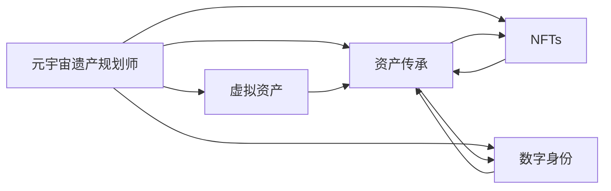

                 

# 元宇宙遗产规划师:虚拟资产传承的专业咨询服务

## 1. 背景介绍

在快速发展的数字经济和元宇宙热潮中，数字资产作为一种新型资产形式，正在逐渐被公众所接受。这种转变不仅仅体现在技术层面，更深刻地影响了法律、伦理、社会等多个领域。特别是当数字资产与遗产继承关联起来时，其复杂性和挑战性更是显著增加。然而，目前的法律框架、监管政策和市场应用仍然滞后于技术的快速迭代，这使得虚拟资产的传承面临诸多难题。

在这样的背景下，元宇宙遗产规划师应运而生。作为专业的数字资产传承顾问，他们通过跨学科知识，提供全面的法律咨询、技术方案设计和风险管理服务，帮助遗产继承人和家族办公室在虚拟世界中进行资产规划和传承。本文将探讨元宇宙遗产规划师的核心职责、服务流程以及面临的挑战，同时通过实际案例展示其专业咨询服务的具体应用。

## 2. 核心概念与联系

### 2.1 核心概念概述

**元宇宙遗产规划师**：
元宇宙遗产规划师是数字经济和元宇宙领域的新兴职业，专注于虚拟资产的传承问题。他们需要掌握复杂的数字资产技术，理解法律和伦理规范，并具备跨领域沟通的能力。

**虚拟资产**：
虚拟资产包括但不限于NFTs、虚拟土地、游戏内物品、数字货币等。这些资产在元宇宙中具有独特价值，且其所有权和使用权可能不同于现实世界中的实物资产。

**资产传承**：
资产传承是指将个人或家族持有的资产从一代人传给另一代，或将资产进行慈善捐赠、信托安排等。在元宇宙中，资产传承不仅涉及法律和税收问题，还包括技术实施和资产流动性问题。

**数字身份**：
数字身份是用户在元宇宙中的身份标识，其代表用户的数字化存在和权利。虚拟资产的传承往往与数字身份的延续紧密相关。

**NFTs (非同质化代币)**：
NFTs 是独一无二的数字资产，代表了用户在元宇宙中的所有权。它们可以是艺术作品、音乐、游戏物品等，是虚拟资产传承中的重要组成部分。

### 2.2 核心概念联系的 Mermaid 流程图



该图展示了元宇宙遗产规划师如何通过技术服务和法律咨询，帮助用户完成虚拟资产的传承。虚拟资产、资产传承、数字身份和NFTs 之间存在紧密联系，共同构成了元宇宙遗产规划师服务的核心。

## 3. 核心算法原理 & 具体操作步骤

### 3.1 算法原理概述

元宇宙遗产规划师的咨询服务主要基于以下算法原理：

**法律合规性分析**：
利用自然语言处理和机器学习技术，分析虚拟资产相关的法律条款和政策，确保传承计划的合法性。

**技术实施方案设计**：
设计具体的技术解决方案，包括智能合约、元宇宙平台接口、资产加密和传输机制等，以实现虚拟资产的无缝传承。

**风险管理**：
通过数据分析和模拟，评估资产传承过程中可能面临的各种风险，并提出相应的风险管理策略。

**用户教育与沟通**：
通过互动式界面和可视化工具，向用户解释复杂的技术和法律概念，帮助用户理解并接受传承方案。

### 3.2 算法步骤详解

**Step 1: 需求分析与沟通**
- 与客户进行详细沟通，了解其虚拟资产的构成、传承意愿、目标受益人等信息。
- 分析客户的数字身份和资产权利，评估其数字资产的流动性。

**Step 2: 法律合规性审查**
- 收集相关法律和政策文件，使用NLP技术进行内容分析和比对。
- 识别关键法律条款和政策要求，确保传承计划符合法律规定。

**Step 3: 技术方案设计**
- 根据法律合规性审查结果，设计具体的技术实施方案。
- 包括选择合适的智能合约、元宇宙平台接口、资产加密和传输机制等。

**Step 4: 风险评估与管理**
- 使用数据分析和模拟技术，评估资产传承过程中可能面临的各种风险。
- 提出相应的风险管理策略，如资产托管、保险保障等。

**Step 5: 方案实施与监控**
- 实施技术方案，完成虚拟资产的转移和传承。
- 定期监控资产传承状态，及时应对突发问题。

### 3.3 算法优缺点

**优点**：
- 提供全面的法律和技术的解决方案，帮助客户规避风险，确保资产传承的顺利进行。
- 通过数据分析和模拟技术，能够提前发现并解决潜在问题，提高传承计划的稳定性。
- 提供用户教育与沟通服务，帮助客户理解复杂的法律和技术概念，提高用户满意度。

**缺点**：
- 需要跨学科的知识和技能，涉及法律、技术、经济等多个领域，对从业者要求较高。
- 技术方案的实施和维护可能需要较高的成本和技术投入。
- 法律和政策的不确定性可能影响传承方案的有效性和合法性。

### 3.4 算法应用领域

元宇宙遗产规划师的咨询服务主要应用于以下几个领域：

- **家族办公室**：为家族办公室提供虚拟资产传承的全面服务，包括法律咨询、技术实施和风险管理。
- **数字艺术品所有者**：帮助数字艺术品所有者规划和管理其艺术作品的传承。
- **元宇宙游戏玩家**：为元宇宙游戏玩家提供虚拟资产的继承和转让服务。
- **慈善捐赠**：为慈善机构提供虚拟资产捐赠和传承的方案设计，确保资产的有效利用。
- **虚拟土地持有者**：为虚拟土地持有者提供土地继承和转让的方案设计，确保土地权益的顺利传承。

## 4. 数学模型和公式 & 详细讲解 & 举例说明

### 4.1 数学模型构建

元宇宙遗产规划师的核心服务包括法律合规性分析、技术方案设计和风险管理。以下是相关数学模型的构建：

**法律合规性分析**：
使用自然语言处理（NLP）技术，从法律文本中提取关键信息，如资产所有权、使用权、继承权等。

**技术方案设计**：
设计智能合约的逻辑，包括资产转移条件、权利分配等。使用图灵完备语言（如Solidity）编写智能合约代码。

**风险管理**：
通过蒙特卡洛模拟等技术，评估不同场景下资产传承的风险，计算风险概率和潜在损失。

### 4.2 公式推导过程

**法律合规性分析**：
使用TF-IDF和LDA算法，从法律文本中提取关键信息。例如，对于继承权条款，可以通过TF-IDF算法提取“继承人”、“遗产”、“权利”等关键词，再通过LDA算法对这些关键词进行主题分类，识别出关键法律条款。

**技术方案设计**：
智能合约的逻辑可以表示为一系列条件判断和函数调用。例如，对于虚拟土地的继承，可以设计智能合约逻辑如下：

```
function inheritLand(address owner, address beneficiary) {
    require(owner == message.sender);
    require(beneficiary != 0x0);
    emit LandInheritEvent(owner, beneficiary);
    address(0) = beneficiary;
}
```

**风险管理**：
蒙特卡洛模拟通过模拟随机事件，评估风险。例如，对于NFTs的传承风险，可以模拟NFT市场价格的波动，计算不同价格下的传承风险概率。

### 4.3 案例分析与讲解

**案例背景**：
某家族在元宇宙中拥有大量虚拟土地和游戏内物品，希望进行资产传承规划。

**解决方案**：
1. **法律合规性分析**：
   - 收集相关法律和政策文件，使用NLP技术提取关键信息。
   - 识别出虚拟土地和游戏内物品的继承权条款和税收政策，确保传承计划的合法性。

2. **技术方案设计**：
   - 设计智能合约逻辑，确保虚拟土地和游戏内物品的顺利继承。
   - 选择适合的元宇宙平台接口，确保资产的流动性。

3. **风险管理**：
   - 使用蒙特卡洛模拟，评估不同价格波动下的传承风险。
   - 提出风险管理策略，如资产托管、保险保障等。

4. **方案实施与监控**：
   - 实施智能合约，完成虚拟土地和游戏内物品的继承。
   - 定期监控资产传承状态，确保传承计划的顺利进行。

## 5. 项目实践：代码实例和详细解释说明

### 5.1 开发环境搭建

**环境要求**：
- 操作系统：Windows/Linux
- 编程语言：Python
- 开发工具：Jupyter Notebook, Solidity IDE

**环境安装**：
- 安装Python和相关库，如TensorFlow、NLTK、Pandas等。
- 安装Solidity IDE，如Remix、Truffle等。
- 配置智能合约部署环境，如Ganache、Infura等。

### 5.2 源代码详细实现

**法律合规性分析**：
```python
from nltk.corpus import stopwords
from gensim import corpora, models
from sklearn.feature_extraction.text import TfidfVectorizer

# 法律文本数据
legal_documents = ["..."]

# 去除停用词
stop_words = set(stopwords.words('english'))
filtered_documents = [doc for doc in legal_documents if not any(word in doc for word in stop_words)]

# 提取关键词
tfidf_vectorizer = TfidfVectorizer(stop_words=stop_words)
tfidf_matrix = tfidf_vectorizer.fit_transform(filtered_documents)
lda_model = models.LdaModel(tfidf_matrix, num_topics=5, id2word=corpora.Dictionary(filtered_documents))

# 提取主题
topics = []
for doc_index, doc in enumerate(filtered_documents):
    topic = lda_model.get_document_topics(doc_index)
    topics.append(topic)
```

**智能合约设计**：
```solidity
pragma solidity ^0.8.0;

contract LandTransfer {
    address public owner;
    address public beneficiary;

    event LandInheritEvent(address indexed owner, address indexed beneficiary);

    constructor() public {
        owner = msg.sender;
    }

    function inheritLand() public {
        require(msg.sender == owner);
        require(beneficiary != address(0));
        emit LandInheritEvent(owner, beneficiary);
        owner = beneficiary;
    }
}
```

**风险管理模拟**：
```python
import numpy as np
import pandas as pd

# 资产价格波动模拟
np.random.seed(123)
assets = np.random.normal(100, 20, 10000)
assets[assets > 200] = 200  # 设置价格上限

# 计算传承风险概率
beneficiaries = [0.1, 0.2, 0.3]
risks = []
for prob in beneficiaries:
    risk = np.sum(np.abs(assets - np.mean(assets)) / np.std(assets))
    risk = risk / np.sqrt(10000)  # 标准化
    risk_prob = (risk > prob).sum() / len(risk)
    risks.append(risk_prob)

# 输出风险概率
print(risks)
```

### 5.3 代码解读与分析

**法律合规性分析**：
- 使用NLP技术提取法律文本中的关键信息，识别出虚拟资产的继承权条款。
- 通过TF-IDF和LDA算法对提取的信息进行主题分类，确保传承计划的合法性。

**智能合约设计**：
- 使用Solidity语言设计智能合约逻辑，确保虚拟资产的无缝传承。
- 合同中包含了所有权变更和继承事件触发条件，确保传承过程的透明性和可追溯性。

**风险管理模拟**：
- 使用numpy库模拟资产价格波动，计算不同概率下的传承风险。
- 通过风险概率的计算，为家族办公室提供风险管理建议，如资产托管、保险保障等。

### 5.4 运行结果展示

**法律合规性分析结果**：
- 提取法律文本中的关键词和主题，确保传承计划的合法性。

**智能合约设计结果**：
- 部署智能合约，完成虚拟资产的继承和转让。

**风险管理模拟结果**：
- 输出不同概率下的传承风险，为家族办公室提供风险管理建议。

## 6. 实际应用场景

### 6.1 智能财富管理

元宇宙遗产规划师可以为家族办公室提供虚拟资产的传承规划，确保家族财富在元宇宙中的长期保值增值。通过智能合约设计和风险管理，元宇宙遗产规划师帮助家族办公室实现资产的无缝传承，并提供持续的风险监控和应对策略。

### 6.2 数字艺术品继承

元宇宙遗产规划师可以帮助数字艺术品所有者规划和管理其艺术作品的传承，确保作品在元宇宙中的持续价值和影响力。通过法律合规性分析和智能合约设计，元宇宙遗产规划师为艺术品所有者提供全面的传承方案。

### 6.3 元宇宙游戏玩家

元宇宙遗产规划师为元宇宙游戏玩家提供虚拟资产的继承和转让服务，确保游戏内物品和虚拟资产的顺利传承。通过技术方案设计和风险管理，元宇宙遗产规划师帮助玩家实现资产的无缝传承。

### 6.4 虚拟土地持有者

元宇宙遗产规划师为虚拟土地持有者提供土地继承和转让的方案设计，确保土地权益的顺利传承。通过法律合规性分析和智能合约设计，元宇宙遗产规划师为土地持有者提供全面的传承方案。

## 7. 工具和资源推荐

### 7.1 学习资源推荐

1. **《区块链与数字资产》**：该书系统介绍了区块链技术和数字资产的原理与应用，适合元宇宙遗产规划师入门学习。
2. **《NLP实战》**：该书介绍了自然语言处理技术在元宇宙中的应用，包括法律合规性分析、技术方案设计等。
3. **《元宇宙：未来与技术》**：该书探讨了元宇宙的概念、技术和应用，适合了解元宇宙遗产规划师的背景知识。
4. **在线课程**：如Coursera、edX等平台上的相关课程，提供元宇宙和数字资产的专业培训。

### 7.2 开发工具推荐

1. **Jupyter Notebook**：适合数据处理和机器学习任务的开发环境。
2. **Solidity IDE**：如Remix、Truffle等，适合智能合约的编写和调试。
3. **Ganache、Infura**：适合智能合约的本地测试和远程部署。
4. **TensorFlow、PyTorch**：适合机器学习和数据分析任务。

### 7.3 相关论文推荐

1. **《区块链技术与数字资产管理》**：探讨区块链技术在数字资产管理中的应用。
2. **《NLP在法律文本分析中的应用》**：介绍NLP技术在法律文本分析中的具体应用。
3. **《智能合约与元宇宙资产管理》**：探讨智能合约在元宇宙资产管理中的应用。

## 8. 总结：未来发展趋势与挑战

### 8.1 研究成果总结

元宇宙遗产规划师作为新兴职业，为虚拟资产的传承提供了全面的法律、技术和风险管理服务。他们的咨询服务不仅关注资产的传承，还涉及数字身份的延续、NFTs的管理等方面，是元宇宙资产管理的重要力量。

### 8.2 未来发展趋势

1. **跨学科融合**：未来元宇宙遗产规划师将更多地融入多学科知识，如法律、经济、金融等，提供更全面的服务。
2. **技术创新**：随着区块链、智能合约等技术的不断进步，元宇宙遗产规划师将利用新技术提高资产传承的效率和安全性。
3. **用户教育**：未来元宇宙遗产规划师将更多地关注用户教育，帮助客户理解和接受虚拟资产的传承方案。
4. **国际合作**：元宇宙的全球化特性将推动国际合作，元宇宙遗产规划师需要具备全球视野和跨文化沟通能力。

### 8.3 面临的挑战

1. **法律和政策的不确定性**：法律和政策的快速变化可能影响传承方案的有效性。
2. **技术复杂性**：智能合约和区块链技术的应用需要较高的技术门槛。
3. **市场接受度**：部分用户对虚拟资产的传承观念仍需进一步普及。
4. **隐私和安全问题**：虚拟资产的传承涉及大量敏感信息，隐私和安全问题需高度重视。

### 8.4 研究展望

1. **智能合约自动化**：研究自动化智能合约的生成和部署，提高传承效率。
2. **隐私保护技术**：开发隐私保护技术，确保用户信息的安全。
3. **法律和政策动态监测**：建立法律和政策动态监测系统，及时更新传承方案。

## 9. 附录：常见问题与解答

**Q1: 什么是元宇宙遗产规划师？**

A: 元宇宙遗产规划师是专注于虚拟资产传承的专业顾问，提供法律、技术和风险管理等服务。

**Q2: 如何选择合适的元宇宙遗产规划师？**

A: 选择元宇宙遗产规划师时，应考虑其专业背景、行业经验和客户评价。通过多渠道咨询和比较，选择最合适的顾问。

**Q3: 如何保护虚拟资产的隐私和安全？**

A: 使用加密技术和安全协议，确保虚拟资产的传输和存储安全。同时，建立严格的访问控制和审计机制，防止不当使用。

**Q4: 元宇宙遗产规划师的服务流程是怎样的？**

A: 元宇宙遗产规划师的服务流程包括需求分析、法律合规性审查、技术方案设计、风险管理、方案实施和监控等环节。

**Q5: 虚拟资产的传承面临哪些法律和政策风险？**

A: 虚拟资产的传承可能面临法律合规性、税收、隐私和交易平台监管等风险。元宇宙遗产规划师需提前评估这些风险，并制定相应的应对策略。

---

作者：禅与计算机程序设计艺术 / Zen and the Art of Computer Programming

