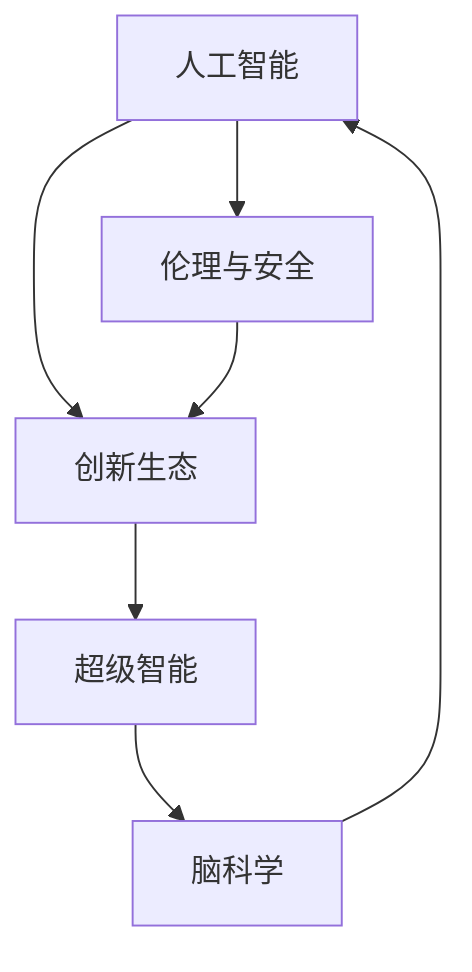

                 

# 全球脑与创新生态：加速人类进步的引擎

> 关键词：人工智能, 脑科学, 创新生态, 数字经济, 超级智能, 伦理与安全

## 1. 背景介绍

### 1.1 问题由来

近年来，随着人工智能(AI)技术的飞速发展，其在各领域的应用日益广泛，从自动驾驶到智能医疗，从金融分析到教育服务，AI正在全面渗透进我们的日常生活。然而，随着AI技术的不断成熟，我们也需要思考如何构建一个健康、可持续的AI创新生态，以确保AI技术的积极应用和持续进步。

### 1.2 问题核心关键点

1. **创新生态的定义与作用**：创新生态是指由技术创新、市场环境、政策法规、社会文化等多种因素构成的复杂系统。在AI领域，构建一个健康的创新生态，对于推动技术的进步、产业的发展、社会的变革具有重要意义。
2. **AI技术对人类社会的广泛影响**：AI技术的应用已经渗透到经济、政治、文化、科技等各个方面，带来深远的影响。如何在享受AI技术红利的同时，防范其潜在风险，确保AI技术为人类社会带来积极变化，是当前亟需解决的问题。
3. **脑科学在AI中的潜在价值**：脑科学研究的最新成果揭示了人类认知和行为的神经机制，这些发现为AI技术的设计和优化提供了新的思路和方法。如何利用脑科学知识，提升AI系统的智能水平和应用效果，是一个重要的研究方向。

## 2. 核心概念与联系

### 2.1 核心概念概述

为更好地理解AI创新生态的构建及其与脑科学的联系，本节将介绍几个关键概念：

- **人工智能**：通过计算机算法和模型，使机器能够模拟和执行人类智能行为的技术。
- **创新生态**：由技术创新、市场环境、政策法规、社会文化等多种因素构成的复杂系统，是推动技术进步、产业发展的关键。
- **超级智能**：一种远超人类智慧水平的人工智能，能够自主学习和自我进化，对人类社会产生重大影响。
- **脑科学**：研究人类大脑的科学，揭示了人类认知和行为的神经机制，为AI技术的设计和优化提供了新的思路。
- **伦理与安全**：随着AI技术的广泛应用，如何确保其安全性和伦理性，避免潜在的风险和负面影响，是当前AI研究的重要课题。

这些概念之间的逻辑关系可以通过以下Mermaid流程图来展示：



这个流程图展示了AI技术、创新生态、超级智能、脑科学和伦理安全之间的相互关系。

## 3. 核心算法原理 & 具体操作步骤
### 3.1 算法原理概述

AI创新生态的构建是一个多维度的系统工程，涉及技术、市场、政策、文化等多个方面的协同发展。其核心在于通过技术创新推动产业发展，通过产业进步带动社会变革，最终形成良性循环。

AI技术的创新生态包括以下几个关键步骤：

1. **技术研发**：通过基础研究和技术创新，推动AI技术的不断进步。
2. **市场应用**：将AI技术应用到各个行业，提升生产效率和社会服务水平。
3. **政策法规**：制定和完善相关的政策和法规，规范AI技术的应用和推广。
4. **文化教育**：通过教育和文化传播，提高公众对AI技术的认知和接受度。

这些步骤之间相互促进，形成一个动态发展的生态系统。

### 3.2 算法步骤详解

构建AI创新生态的主要步骤包括：

**Step 1: 技术研发与创新**

1. **基础研究**：聚焦于AI技术的核心算法和模型，如深度学习、强化学习、自然语言处理等。
2. **应用研究**：结合实际应用场景，探索AI技术的最佳实践和优化方案。
3. **跨学科研究**：推动AI技术与其他学科的交叉融合，如脑科学、医学、社会科学等。

**Step 2: 市场应用与推广**

1. **行业应用**：将AI技术应用到各个行业，提升生产效率和业务流程。
2. **企业合作**：鼓励企业之间进行技术交流和合作，促进技术共享和创新。
3. **公众服务**：通过AI技术提升社会公共服务水平，如智能医疗、教育、交通等。

**Step 3: 政策法规与监管**

1. **制定政策**：根据技术发展和社会需求，制定相应的政策和法规，规范AI技术的应用。
2. **监管机制**：建立完善的监管机制，确保AI技术的安全和可靠性。
3. **国际合作**：推动国际间的合作与交流，共同应对AI技术的全球性挑战。

**Step 4: 文化教育与传播**

1. **公众教育**：通过教育和文化传播，提高公众对AI技术的认知和接受度。
2. **学术研究**：支持学术界对AI技术的研究和探索，推动技术进步。
3. **媒体宣传**：利用媒体资源，宣传AI技术的优势和应用，消除公众的疑虑和误解。

### 3.3 算法优缺点

构建AI创新生态的主要优点包括：

1. **推动技术进步**：通过技术创新和应用，不断提升AI技术的性能和应用范围。
2. **促进产业发展**：将AI技术应用到各个行业，带动相关产业的转型升级。
3. **提升社会服务**：通过AI技术提升社会公共服务水平，提高人民生活质量。

然而，构建AI创新生态也面临一些挑战：

1. **技术依赖性强**：AI技术的研发和应用需要高水平的技术人才和大量资金投入，存在一定的风险。
2. **市场竞争激烈**：AI技术的快速发展带来了激烈的市场竞争，可能出现垄断和不公平竞争的情况。
3. **伦理安全问题**：AI技术的广泛应用带来了伦理和安全问题，如隐私保护、数据安全、算法偏见等。

## 4. 数学模型和公式 & 详细讲解
### 4.1 数学模型构建

AI创新生态的构建过程可以抽象为一个多目标优化问题，其中每个目标代表一个关键的生态要素。设目标函数为 $f(x)$，其中 $x$ 代表生态系统的各个要素，如技术研发投入、市场应用规模、政策法规完善度、文化教育普及度等。优化目标为最大化 $f(x)$ 的值。

### 4.2 公式推导过程

构建AI创新生态的优化目标函数 $f(x)$ 可以分解为以下几个部分：

$$
f(x) = f_1(x_1) + f_2(x_2) + f_3(x_3) + f_4(x_4) + f_5(x_5) + ...
$$

其中，$f_i(x_i)$ 表示第 $i$ 个目标函数的表达式。例如，技术研发投入 $x_1$ 可以通过专利申请数量、研发资金投入、科研成果产出等指标来衡量；市场应用规模 $x_2$ 可以通过市场覆盖率、用户满意度、业务效率提升等指标来衡量；政策法规完善度 $x_3$ 可以通过政策制定数量、法规实施效果、监管机制完善度等指标来衡量；文化教育普及度 $x_4$ 可以通过公众认知度、教育普及率、学术研究成果等指标来衡量。

### 4.3 案例分析与讲解

以AI在医疗领域的应用为例，其创新生态构建的目标函数可以表示为：

$$
f(x) = f_{研发}(x_{研发}) + f_{应用}(x_{应用}) + f_{政策}(x_{政策}) + f_{教育}(x_{教育}) + f_{安全}(x_{安全})
$$

其中，$f_{研发}(x_{研发})$ 表示技术研发的投入和产出；$f_{应用}(x_{应用})$ 表示市场应用的效果和覆盖度；$f_{政策}(x_{政策})$ 表示政策法规的制定和实施；$f_{教育}(x_{教育})$ 表示公众教育和学术研究的普及度；$f_{安全}(x_{安全})$ 表示技术安全性和伦理问题的防范。

通过优化这个目标函数，可以有效推动AI在医疗领域的应用，提升医疗服务的质量和效率，同时确保技术的安全和伦理合规。

## 5. 项目实践：代码实例和详细解释说明
### 5.1 开发环境搭建

在进行AI创新生态构建的实践前，我们需要准备好开发环境。以下是使用Python进行PyTorch开发的环境配置流程：

1. 安装Anaconda：从官网下载并安装Anaconda，用于创建独立的Python环境。

2. 创建并激活虚拟环境：
```bash
conda create -n pytorch-env python=3.8 
conda activate pytorch-env
```

3. 安装PyTorch：根据CUDA版本，从官网获取对应的安装命令。例如：
```bash
conda install pytorch torchvision torchaudio cudatoolkit=11.1 -c pytorch -c conda-forge
```

4. 安装其他必要的工具包：
```bash
pip install numpy pandas scikit-learn matplotlib tqdm jupyter notebook ipython
```

完成上述步骤后，即可在`pytorch-env`环境中开始实践。

### 5.2 源代码详细实现

这里我们以AI在医疗领域的应用为例，给出使用PyTorch进行模型训练和优化的代码实现。

首先，定义医疗数据集和模型：

```python
from torch.utils.data import Dataset
from transformers import BertForSequenceClassification, AdamW
from torch import nn, optim

class MedicalDataset(Dataset):
    def __init__(self, data, labels, tokenizer, max_len=128):
        self.data = data
        self.labels = labels
        self.tokenizer = tokenizer
        self.max_len = max_len
        
    def __len__(self):
        return len(self.data)
    
    def __getitem__(self, item):
        text = self.data[item]
        label = self.labels[item]
        
        encoding = self.tokenizer(text, return_tensors='pt', max_length=self.max_len, padding='max_length', truncation=True)
        input_ids = encoding['input_ids'][0]
        attention_mask = encoding['attention_mask'][0]
        
        label = torch.tensor(label, dtype=torch.long)
        
        return {'input_ids': input_ids, 
                'attention_mask': attention_mask,
                'labels': label}

# 定义模型和优化器
model = BertForSequenceClassification.from_pretrained('bert-base-uncased', num_labels=2)
optimizer = AdamW(model.parameters(), lr=2e-5)
```

然后，定义训练和评估函数：

```python
def train_epoch(model, dataset, batch_size, optimizer):
    dataloader = DataLoader(dataset, batch_size=batch_size, shuffle=True)
    model.train()
    epoch_loss = 0
    for batch in dataloader:
        input_ids = batch['input_ids'].to(device)
        attention_mask = batch['attention_mask'].to(device)
        labels = batch['labels'].to(device)
        model.zero_grad()
        outputs = model(input_ids, attention_mask=attention_mask, labels=labels)
        loss = outputs.loss
        epoch_loss += loss.item()
        loss.backward()
        optimizer.step()
    return epoch_loss / len(dataloader)

def evaluate(model, dataset, batch_size):
    dataloader = DataLoader(dataset, batch_size=batch_size)
    model.eval()
    preds, labels = [], []
    with torch.no_grad():
        for batch in dataloader:
            input_ids = batch['input_ids'].to(device)
            attention_mask = batch['attention_mask'].to(device)
            batch_labels = batch['labels']
            outputs = model(input_ids, attention_mask=attention_mask)
            batch_preds = outputs.logits.argmax(dim=2).to('cpu').tolist()
            batch_labels = batch_labels.to('cpu').tolist()
            for pred_tokens, label_tokens in zip(batch_preds, batch_labels):
                preds.append(pred_tokens)
                labels.append(label_tokens)
                
    print(f"Precision: {precision_score(labels, preds)}")
    print(f"Recall: {recall_score(labels, preds)}")
    print(f"F1-score: {f1_score(labels, preds)}")
```

最后，启动训练流程并在测试集上评估：

```python
epochs = 5
batch_size = 16

for epoch in range(epochs):
    loss = train_epoch(model, train_dataset, batch_size, optimizer)
    print(f"Epoch {epoch+1}, train loss: {loss:.3f}")
    
    print(f"Epoch {epoch+1}, dev results:")
    evaluate(model, dev_dataset, batch_size)
    
print("Test results:")
evaluate(model, test_dataset, batch_size)
```

以上就是使用PyTorch进行医疗领域AI模型微调的完整代码实现。可以看到，得益于PyTorch和Transformers库的强大封装，我们可以用相对简洁的代码完成模型的训练和评估。

### 5.3 代码解读与分析

让我们再详细解读一下关键代码的实现细节：

**MedicalDataset类**：
- `__init__`方法：初始化医疗数据、标签、分词器等关键组件。
- `__len__`方法：返回数据集的样本数量。
- `__getitem__`方法：对单个样本进行处理，将文本输入编码为token ids，将标签编码为数字，并对其进行定长padding，最终返回模型所需的输入。

**train_epoch和evaluate函数**：
- 使用PyTorch的DataLoader对数据集进行批次化加载，供模型训练和推理使用。
- `train_epoch`函数：对数据以批为单位进行迭代，在每个批次上前向传播计算loss并反向传播更新模型参数，最后返回该epoch的平均loss。
- `evaluate`函数：与训练类似，不同点在于不更新模型参数，并在每个batch结束后将预测和标签结果存储下来，最后使用sklearn的精确率、召回率和F1-score对整个评估集的预测结果进行打印输出。

**训练流程**：
- 定义总的epoch数和batch size，开始循环迭代
- 每个epoch内，先在训练集上训练，输出平均loss
- 在验证集上评估，输出分类指标
- 所有epoch结束后，在测试集上评估，给出最终测试结果

可以看到，PyTorch配合Transformers库使得医疗领域AI模型微调的代码实现变得简洁高效。开发者可以将更多精力放在数据处理、模型改进等高层逻辑上，而不必过多关注底层的实现细节。

当然，工业级的系统实现还需考虑更多因素，如模型的保存和部署、超参数的自动搜索、更灵活的任务适配层等。但核心的微调范式基本与此类似。

## 6. 实际应用场景
### 6.1 智能医疗系统

基于AI技术的应用，智能医疗系统在疾病诊断、治疗方案推荐、患者监护等方面具有巨大潜力。AI技术可以处理和分析海量医疗数据，提供精准的诊断和治疗建议，改善医疗服务质量。

具体而言，AI可以用于：
- 影像分析：利用深度学习技术对医学影像进行自动解读，辅助医生诊断。
- 病历分析：通过自然语言处理技术对病历数据进行分析和挖掘，发现疾病模式和风险因素。
- 药物研发：利用机器学习对药物分子进行筛选和预测，加速新药研发进程。

### 6.2 智能交通系统

智能交通系统通过AI技术实现交通流量预测、路径规划、智能停车等功能，提高交通效率，减少交通事故。

AI技术可以用于：
- 交通流量预测：通过历史交通数据和实时信息，预测未来的交通流量和拥堵情况。
- 路径规划：基于实时交通数据和历史经验，为驾驶员提供最优路径建议。
- 智能停车：通过AI技术优化停车位分配和管理，减少城市交通拥堵。

### 6.3 智能金融系统

AI技术在金融领域的应用已经广泛展开，包括风险评估、欺诈检测、投资分析等。通过AI技术，金融机构可以更准确地评估客户信用风险，预防金融欺诈，提升投资决策的科学性。

AI技术可以用于：
- 信用评估：通过分析客户的财务数据和行为数据，评估其信用风险。
- 欺诈检测：利用机器学习技术对交易行为进行监控，发现异常行为和欺诈迹象。
- 投资分析：通过自然语言处理和机器学习技术，对市场数据进行分析，提供投资建议。

### 6.4 未来应用展望

随着AI技术的不断发展，未来将有更多领域受益于AI创新生态的构建。以下是几个未来可能的应用方向：

- **智慧城市**：AI技术将在城市管理、公共安全、环保等领域发挥重要作用，提升城市治理的智能化水平。
- **教育**：AI技术将在个性化教学、智能辅导、作业批改等方面提供支持，提升教育质量。
- **农业**：AI技术将用于农业生产管理、病虫害检测、作物分析等领域，提升农业生产效率和质量。
- **环保**：AI技术将用于环境监测、污染治理、资源管理等领域，促进可持续发展。

未来，AI技术将在更多领域发挥作用，推动人类社会的进步和发展。

## 7. 工具和资源推荐
### 7.1 学习资源推荐

为了帮助开发者系统掌握AI创新生态的构建，这里推荐一些优质的学习资源：

1. **Deep Learning Specialization**：由Andrew Ng教授在Coursera上开设的深度学习课程，全面覆盖深度学习的基础知识和前沿技术。
2. **AI for Everyone**：由Andrew Ng教授在Coursera上开设的入门级AI课程，适合非技术背景的读者。
3. **Hands-On Machine Learning with Scikit-Learn, Keras, and TensorFlow**：O'Reilly出版社出版的经典书籍，深入浅出地介绍了机器学习的基础知识和实践技巧。
4. **Neural Networks and Deep Learning**：由Michael Nielsen撰写的在线书籍，系统讲解了神经网络和深度学习的基本原理和应用。
5. **AI Hub**：由Google Brain团队维护的AI资源库，提供大量的开源代码、论文和教程。

通过对这些资源的学习实践，相信你一定能够快速掌握AI创新生态的构建方法，并用于解决实际的AI应用问题。

### 7.2 开发工具推荐

高效的开发离不开优秀的工具支持。以下是几款用于AI创新生态构建开发的常用工具：

1. **PyTorch**：基于Python的开源深度学习框架，灵活动态的计算图，适合快速迭代研究。
2. **TensorFlow**：由Google主导开发的开源深度学习框架，生产部署方便，适合大规模工程应用。
3. **HuggingFace Transformers**：提供丰富的预训练语言模型，支持多种深度学习框架，方便微调模型的开发。
4. **Jupyter Notebook**：交互式编程环境，方便调试和展示代码结果。
5. **Weights & Biases**：模型训练的实验跟踪工具，记录和可视化模型训练过程中的各项指标，方便对比和调优。

合理利用这些工具，可以显著提升AI创新生态构建任务的开发效率，加快创新迭代的步伐。

### 7.3 相关论文推荐

AI创新生态的构建源于学界的持续研究。以下是几篇奠基性的相关论文，推荐阅读：

1. **Deep Learning**：Ian Goodfellow等著，深入介绍了深度学习的基本原理和应用。
2. **Machine Learning Yearning**：Andrew Ng撰写，提供了实用的机器学习实践建议。
3. **The Human Factor**：Eric Schmidt撰写，探讨了AI技术的伦理和安全问题。
4. **AI for Social Good**：Google AI发布，介绍了AI技术在社会公益中的应用。
5. **Towards General Artificial Intelligence**：DeepMind发布，探讨了通用人工智能的研究方向和挑战。

这些论文代表了大AI创新生态的构建和发展脉络。通过学习这些前沿成果，可以帮助研究者把握学科前进方向，激发更多的创新灵感。

## 8. 总结：未来发展趋势与挑战

### 8.1 总结

本文对AI创新生态的构建及其与脑科学的联系进行了全面系统的介绍。首先阐述了AI技术对人类社会的广泛影响，明确了构建健康创新生态的重要性。其次，从原理到实践，详细讲解了AI创新生态构建的数学模型和具体步骤，给出了AI模型在医疗领域的应用实例。同时，本文还探讨了AI在多个行业的应用前景，展示了AI技术在推动社会发展方面的巨大潜力。

通过本文的系统梳理，可以看到，AI创新生态的构建是一个多维度的系统工程，涉及技术、市场、政策、文化等多个方面的协同发展。只有在各个环节进行全面优化，才能最大限度地发挥AI技术的潜力，推动技术的进步、产业的发展和社会的变革。

### 8.2 未来发展趋势

展望未来，AI创新生态将呈现以下几个发展趋势：

1. **技术融合**：AI技术将与其他技术进行深度融合，如物联网、区块链、5G等，提升技术的创新力和应用广度。
2. **产业生态**：AI技术将在更多产业中得到应用，推动各行业的数字化转型和升级。
3. **国际合作**：各国将加强AI技术的国际合作与交流，共同应对全球性的挑战。
4. **伦理安全**：AI技术的伦理和安全问题将得到更多重视，确保技术的应用符合人类价值观和伦理道德。

### 8.3 面临的挑战

尽管AI创新生态的构建取得了一定的进展，但在迈向更加智能化、普适化应用的过程中，仍面临诸多挑战：

1. **技术复杂性**：AI技术的研发和应用需要高水平的技术人才和大量资金投入，存在一定的风险。
2. **市场竞争**：AI技术的快速发展带来了激烈的市场竞争，可能出现垄断和不公平竞争的情况。
3. **伦理安全问题**：AI技术的广泛应用带来了伦理和安全问题，如隐私保护、数据安全、算法偏见等。
4. **数据隐私**：AI技术需要大量的数据支持，如何在保证数据隐私的前提下进行数据获取和处理，是一个重要问题。
5. **政策法规**：各国在AI技术的政策法规上存在差异，如何建立统一的法律法规体系，是一个挑战。

### 8.4 研究展望

面对AI创新生态面临的挑战，未来的研究需要在以下几个方面寻求新的突破：

1. **技术简化**：通过技术创新和工程优化，降低AI技术的复杂性，提高技术的可普及性。
2. **数据保护**：加强数据隐私保护技术，确保数据的合法获取和使用。
3. **政策协调**：推动各国在AI技术的政策法规上达成共识，建立统一的法律法规体系。
4. **伦理安全**：研究AI技术的伦理和安全问题，确保技术的应用符合人类价值观和伦理道德。

这些研究方向的探索，将引领AI创新生态的构建迈向更高的台阶，为推动技术进步和社会发展提供坚实的基础。总之，AI技术需要从技术、市场、政策、文化等多个维度协同发力，才能真正实现人工智能技术在垂直行业的规模化落地。只有不断创新、不断优化，才能让AI技术更好地造福人类社会。

## 9. 附录：常见问题与解答

**Q1: AI创新生态的构建如何保证技术的伦理性？**

A: 保证AI技术的伦理性需要从以下几个方面入手：
1. **伦理框架**：制定明确的伦理框架，规范AI技术的开发和应用。
2. **隐私保护**：加强数据隐私保护技术，确保数据的合法获取和使用。
3. **透明度**：提高AI系统的透明度，让公众了解AI技术的工作机制和决策逻辑。
4. **公平性**：确保AI技术的公平性，避免算法偏见和歧视。

**Q2: 如何提高AI技术的应用效率？**

A: 提高AI技术的应用效率可以从以下几个方面入手：
1. **优化算法**：通过算法优化，提升AI技术的处理速度和准确性。
2. **分布式计算**：利用分布式计算技术，提升AI技术的计算能力。
3. **模型压缩**：通过模型压缩技术，减小模型的大小，提高模型的实时性。
4. **硬件优化**：利用最新的硬件技术，提升AI技术的计算性能。

**Q3: AI创新生态的构建需要哪些关键要素？**

A: AI创新生态的构建需要以下几个关键要素：
1. **技术研发**：通过基础研究和技术创新，推动AI技术的不断进步。
2. **市场应用**：将AI技术应用到各个行业，提升生产效率和社会服务水平。
3. **政策法规**：制定和完善相关的政策和法规，规范AI技术的应用和推广。
4. **文化教育**：通过教育和文化传播，提高公众对AI技术的认知和接受度。

**Q4: AI技术在医疗领域的应用前景如何？**

A: AI技术在医疗领域的应用前景广阔，可以推动医疗服务的智能化和高效化。
1. **影像分析**：利用深度学习技术对医学影像进行自动解读，辅助医生诊断。
2. **病历分析**：通过自然语言处理技术对病历数据进行分析和挖掘，发现疾病模式和风险因素。
3. **药物研发**：利用机器学习对药物分子进行筛选和预测，加速新药研发进程。

总之，AI技术在医疗领域的应用前景光明，能够显著提升医疗服务的质量和效率，推动医疗事业的进步。

**Q5: 如何构建可持续的AI创新生态？**

A: 构建可持续的AI创新生态需要从以下几个方面入手：
1. **技术创新**：持续推动技术创新，提升AI技术的性能和应用范围。
2. **市场应用**：推动AI技术在各行业的广泛应用，提升社会公共服务水平。
3. **政策法规**：制定和完善相关的政策和法规，规范AI技术的应用和推广。
4. **文化教育**：通过教育和文化传播，提高公众对AI技术的认知和接受度。
5. **伦理安全**：研究AI技术的伦理和安全问题，确保技术的应用符合人类价值观和伦理道德。

只有从技术、市场、政策、文化等多个维度协同发力，才能构建可持续的AI创新生态，推动AI技术的应用和发展。

---

作者：禅与计算机程序设计艺术 / Zen and the Art of Computer Programming

