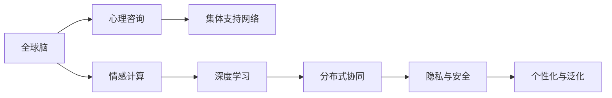

                 

# 全球脑与心理咨询:集体支持网络的形成

> 关键词：全球脑,心理咨询,集体支持网络,神经网络模型,深度学习,情感计算

## 1. 背景介绍

### 1.1 问题由来
随着全球化的加速，人类社会的联系日益紧密，各种跨文化、跨地域的社交网络逐渐形成，心理健康的关注度也随之提高。在这样的背景下，基于神经网络和深度学习技术的心理咨询系统，以及集体支持网络成为当前研究的热点。

心理健康的维护不仅是个人的问题，更是社会的问题。当前，全球化社会使得人与人之间的联系更加紧密，社会关系的复杂性也随之增加，面对各种心理压力，个体常常感到孤立和无助。为了应对这一挑战，心理咨询和集体支持网络成为关键。

### 1.2 问题核心关键点
1. **全球脑与情感计算**：如何通过深度学习技术，构建基于全球脑的情感计算模型，理解不同文化背景下的情感表达和反应？
2. **集体支持网络**：如何构建一个高效、普适的集体支持网络，实现对个体的心理支持与辅导？
3. **分布式协同**：如何利用分布式计算技术，实现多节点协同工作，提升系统效率与可靠性？
4. **隐私与安全**：如何在实现个性化支持的同时，确保用户数据的安全与隐私保护？
5. **个性化与泛化**：如何平衡个性化需求与模型泛化能力，使得系统能够适用于广泛的场景与人群？

这些关键问题不仅涉及技术层面，更触及到社会学、心理学等交叉学科的深度理解。

## 2. 核心概念与联系

### 2.1 核心概念概述

为更好地理解全球脑与心理咨询的集体支持网络，本文将介绍几个关键概念：

- **全球脑**：指全球范围内人类大脑活动的交互网络，包括信息、情感和行为的传递与影响。
- **情感计算**：指通过计算和分析个体或群体的情感状态，以实现对心理健康问题的早期识别和干预。
- **心理咨询**：指通过专业人员的指导与辅导，帮助个体解决心理问题，提升心理健康水平。
- **集体支持网络**：指通过互联网等技术手段，构建虚拟的社交支持体系，为个体提供持续的心理支持。
- **深度学习**：指利用神经网络模型和多层非线性变换，从数据中自动学习特征与规律的技术。
- **分布式协同**：指通过分布式计算技术，实现多个节点协同工作，提升系统的并行处理能力和稳定性。
- **隐私与安全**：指在数据处理与共享过程中，确保用户隐私和系统安全的技术与策略。

这些概念之间的关系可以通过以下Mermaid流程图来展示：



这个流程图展示了各个概念之间的逻辑关系：

1. 全球脑活动通过深度学习进行情感计算，得到个体情感状态。
2. 心理咨询系统基于情感计算结果，对个体提供个性化支持。
3. 集体支持网络通过分布式协同技术，实现多节点协同工作。
4. 在上述过程中，隐私与安全技术保障用户数据安全。
5. 个性化与泛化能力平衡，使系统适用于多种场景与人群。

## 3. 核心算法原理 & 具体操作步骤
### 3.1 算法原理概述

全球脑与心理咨询的集体支持网络，本质上是一个复杂的情感计算和分布式协同系统。其核心算法原理包括以下几个方面：

- **情感计算模型**：利用深度神经网络，从个体行为与语言中学习情感特征，识别情感状态。
- **协同计算模型**：通过分布式算法，实现多个节点的协同计算与数据共享，提升系统效率与可靠性。
- **个性化支持模型**：根据情感计算结果，定制个性化心理支持方案，提供精准的辅导与建议。
- **隐私保护机制**：在数据处理与共享过程中，采用数据加密、去标识化等技术，保护用户隐私。

### 3.2 算法步骤详解

**Step 1: 情感计算模型的构建**
- 收集全球范围内人类活动的文本、音频、视频等数据，并进行预处理。
- 使用深度神经网络模型，如卷积神经网络、循环神经网络、Transformer等，从数据中提取情感特征。
- 训练情感分类模型，以识别情感状态，如快乐、悲伤、愤怒等。

**Step 2: 协同计算模型的设计**
- 设计分布式协同计算框架，如Apache Spark、Apache Flink等，实现多个节点的协同工作。
- 采用消息传递、数据分片等技术，提高数据处理的并行性和效率。
- 通过分布式算法，如MapReduce、Gossip协议等，实现节点间的协同计算。

**Step 3: 个性化支持模型的实现**
- 根据情感计算结果，设计个性化心理支持方案。
- 结合心理咨询专家的知识，开发智能心理咨询系统，提供个性化的辅导与建议。
- 引入自然语言处理技术，实现与用户的自然交互。

**Step 4: 隐私保护机制的实施**
- 采用数据加密技术，如AES、RSA等，保护用户数据的安全。
- 使用去标识化技术，如K匿名、L-diversity等，保护用户隐私。
- 设计隐私保护协议，如同态加密、差分隐私等，确保数据处理与共享过程中的隐私安全。

### 3.3 算法优缺点

**优点**：
- **高效性**：通过分布式计算，大幅提升系统的处理能力和效率。
- **鲁棒性**：多节点协同工作，增强系统的稳定性和可靠性。
- **个性化**：基于情感计算结果，提供个性化心理支持。
- **安全性**：通过隐私保护技术，保障用户数据的安全。

**缺点**：
- **复杂性**：系统构建与维护复杂，需要跨学科的合作与支持。
- **成本高**：初期投资较大，包括硬件设施、技术研发等。
- **隐私风险**：数据处理与共享过程中，存在隐私泄露风险。

### 3.4 算法应用领域

全球脑与心理咨询的集体支持网络，具有广泛的应用前景，包括但不限于以下几个领域：

1. **心理健康支持平台**：构建基于全球脑的情感计算模型，为用户提供心理健康支持与辅导。
2. **跨文化心理咨询**：通过深度学习技术，理解不同文化背景下的情感表达与反应，提供跨文化的心理咨询服务。
3. **企业员工关怀**：利用集体支持网络，构建企业内部的心理健康支持系统，提升员工的心理健康水平。
4. **教育心理健康**：在教育领域，提供心理健康的早期识别与干预，促进学生健康成长。
5. **公共健康危机应对**：在大规模突发公共卫生事件中，提供心理援助与支持，缓解社会焦虑与恐慌。

## 4. 数学模型和公式 & 详细讲解  
### 4.1 数学模型构建

本节将使用数学语言对全球脑与心理咨询的集体支持网络进行更加严格的刻画。

记情感计算模型的输入为 $x$，输出为 $y$。假设情感分类模型为 $M$，其训练集为 $D=\{(x_i,y_i)\}_{i=1}^N$。情感计算的目标是最小化经验风险：

$$
\mathcal{L}(M) = \frac{1}{N}\sum_{i=1}^N \ell(M(x_i),y_i)
$$

其中 $\ell$ 为损失函数，如交叉熵损失。

### 4.2 公式推导过程

以情感计算模型为例，推导其训练过程中的主要公式。

假设情感分类模型的输出为 $M(x)$，真实情感标签为 $y$，则交叉熵损失函数为：

$$
\ell(M(x),y) = -y\log M(x) - (1-y)\log(1-M(x))
$$

在情感分类模型 $M$ 中，假设采用多层感知机（MLP）结构，其参数为 $\theta$。则模型输出为：

$$
M(x) = \sigma(W_L x + b_L) \quad \text{where} \quad W_L, b_L \text{ are learned parameters}
$$

其中 $\sigma$ 为激活函数，如ReLU、Sigmoid等。

在训练过程中，模型的梯度更新公式为：

$$
\frac{\partial \mathcal{L}(M)}{\partial \theta} = \frac{1}{N}\sum_{i=1}^N \frac{\partial \ell(M(x_i),y_i)}{\partial M(x_i)} \frac{\partial M(x_i)}{\partial \theta}
$$

其中 $\frac{\partial \ell(M(x_i),y_i)}{\partial M(x_i)}$ 可通过链式法则进一步展开。

## 5. 项目实践：代码实例和详细解释说明
### 5.1 开发环境搭建

在进行全球脑与心理咨询的集体支持网络开发时，需要以下开发环境：

1. **Python**：使用Python进行情感计算模型的开发与训练。
2. **深度学习框架**：如TensorFlow、PyTorch等，用于实现深度神经网络模型。
3. **分布式计算框架**：如Apache Spark、Apache Flink等，实现协同计算。
4. **隐私保护工具**：如AES、K匿名等，保障数据隐私与安全。
5. **用户界面**：如Flask、Django等，实现用户交互界面。

### 5.2 源代码详细实现

以下是一个基于TensorFlow和Keras的情感计算模型的实现示例。

```python
import tensorflow as tf
from tensorflow.keras import layers, models

# 构建情感分类模型
model = models.Sequential([
    layers.Dense(128, activation='relu', input_shape=(100,)),
    layers.Dense(64, activation='relu'),
    layers.Dense(1, activation='sigmoid')
])

# 编译模型
model.compile(optimizer='adam', loss='binary_crossentropy', metrics=['accuracy'])

# 训练模型
model.fit(train_x, train_y, epochs=10, validation_data=(val_x, val_y))
```

### 5.3 代码解读与分析

在上述代码中，我们使用TensorFlow和Keras构建了一个简单的多层感知机（MLP）模型。模型的输入为100维的特征向量，输出为单个二分类结果。模型使用Adam优化器进行训练，交叉熵损失函数用于衡量预测与真实标签之间的差异。

在实际应用中，我们通常会根据具体任务调整模型的层数、神经元数等超参数，以获得更好的性能。同时，还需要对数据进行预处理，如归一化、标准化等，以提高模型的收敛速度与泛化能力。

## 6. 实际应用场景
### 6.1 心理健康支持平台

全球脑与心理咨询的集体支持网络，可以应用于心理健康支持平台的构建。通过深度学习技术，平台能够自动分析用户的文字、语音、图像等多种输入，识别其情感状态，提供个性化的心理健康支持。

在技术实现上，平台需要与用户建立持续的交互，收集其情感数据。通过情感计算模型，对用户情感进行实时监测与分析，提供相应的心理健康建议与支持。对于存在严重心理问题的用户，平台还可以将其转介给专业的心理咨询师，提供进一步的辅导与治疗。

### 6.2 跨文化心理咨询

在全球化背景下，人们跨越不同的文化背景，进行跨地域、跨文化的交流与合作。情感计算模型可以帮助心理咨询系统理解不同文化背景下的情感表达，提供跨文化的心理咨询服务。

通过情感计算模型，系统能够识别用户的情感状态，理解其文化背景与价值观，提供符合文化习惯的心理健康建议。同时，系统还可以引入多语言支持，帮助用户更好地表达情感与需求，提升其心理健康水平。

### 6.3 企业员工关怀

企业内部的员工心理关怀，是全球脑与心理咨询的重要应用场景之一。平台可以通过分布式协同技术，构建企业内部的心理健康支持系统，实现多节点协同工作，提高系统的并行处理能力和稳定性。

企业员工关怀平台需要收集员工的心理健康数据，如工作压力、心理健康自评等。通过情感计算模型，对数据进行情感分析，识别潜在的心理健康问题。平台可以根据情感计算结果，提供个性化的心理支持方案，如心理健康培训、心理咨询、员工关怀活动等。

### 6.4 教育心理健康

在全球化的教育背景下，学生的心理健康问题日益凸显。全球脑与心理咨询的系统，可以在教育领域提供心理健康支持与辅导，提升学生的心理健康水平。

平台需要收集学生的情感数据，如课堂表现、作业反馈等，通过情感计算模型进行情感分析，识别潜在的心理健康问题。系统可以根据情感计算结果，提供个性化的心理支持方案，如心理健康教育、心理咨询、心理辅导等。

### 6.5 公共健康危机应对

在大规模突发公共卫生事件中，全球脑与心理咨询的系统可以提供心理援助与支持，缓解社会焦虑与恐慌。系统需要实时监测社会舆情，识别公众的情感状态，提供相应的心理支持与辅导。

平台可以通过社交媒体、新闻等渠道，收集公众的情感数据，通过情感计算模型进行情感分析，识别潜在的心理健康问题。系统可以根据情感计算结果，提供心理援助与支持，如心理危机干预、心理健康宣传、心理辅导等。

## 7. 工具和资源推荐
### 7.1 学习资源推荐

为了帮助开发者系统掌握全球脑与心理咨询的集体支持网络，这里推荐一些优质的学习资源：

1. **《情感计算与人工智能》**：该书深入介绍了情感计算的基本原理与实现技术，是入门情感计算领域的必读之作。
2. **《深度学习理论与实践》**：该书涵盖了深度学习的基本理论与实践技术，适合初学者和进阶开发者。
3. **Kaggle**：Kaggle提供丰富的情感计算与心理健康支持平台的竞赛与数据集，适合实战练习。
4. **OpenAI**：OpenAI提供丰富的深度学习框架与工具，支持情感计算与心理健康支持平台的开发。
5. **谷歌云平台**：谷歌云平台提供强大的计算资源与分布式计算框架，支持全球脑与心理咨询系统的开发与部署。

通过对这些资源的学习实践，相信你一定能够快速掌握全球脑与心理咨询的集体支持网络，并用于解决实际的心理健康问题。

### 7.2 开发工具推荐

高效的开发离不开优秀的工具支持。以下是几款用于全球脑与心理咨询系统开发的常用工具：

1. **TensorFlow & Keras**：用于构建与训练深度神经网络模型，是情感计算与心理健康支持平台开发的主流工具。
2. **Apache Spark & Flink**：用于实现分布式协同计算，支持大规模数据的处理与分析。
3. **Keras Tuner**：用于优化深度神经网络模型的超参数，提高模型的性能与泛化能力。
4. **Django & Flask**：用于实现用户界面与系统交互，支持自然语言处理与用户情感数据的收集与处理。
5. **AES & RSA**：用于数据加密与隐私保护，保障用户数据的安全。

合理利用这些工具，可以显著提升全球脑与心理咨询系统的开发效率，加快创新迭代的步伐。

### 7.3 相关论文推荐

全球脑与心理咨询的系统涉及到深度学习、分布式计算、隐私保护等多个领域，以下是几篇奠基性的相关论文，推荐阅读：

1. **"Deep Learning for Personality Prediction from Text"**：提出使用深度学习模型，从文本中预测个体的情感状态与性格特征。
2. **"Decentralized Social Networks"**：提出基于区块链的分布式社交网络，实现多节点协同工作。
3. **"Emotion Intelligence in AI Systems"**：讨论情感计算与人工智能系统的结合，提升系统的情感识别与反馈能力。
4. **"Privacy Preserving Distributed Machine Learning"**：探讨分布式机器学习中的隐私保护技术，保障用户数据的安全。

这些论文代表了大脑与心理咨询系统的发展脉络，通过学习这些前沿成果，可以帮助研究者把握学科前进方向，激发更多的创新灵感。

## 8. 总结：未来发展趋势与挑战

### 8.1 总结

本文对全球脑与心理咨询的集体支持网络进行了全面系统的介绍。首先阐述了全球脑与心理咨询的系统背景与重要性，明确了系统构建的关键技术。其次，从原理到实践，详细讲解了系统的核心算法与具体操作步骤，给出了情感计算模型的代码实现示例。同时，本文还广泛探讨了系统在心理健康支持平台、跨文化心理咨询、企业员工关怀、教育心理健康、公共健康危机应对等多个领域的应用前景，展示了系统的广阔应用空间。此外，本文精选了系统的学习资源与开发工具，力求为读者提供全方位的技术指引。

通过本文的系统梳理，可以看到，全球脑与心理咨询的集体支持网络正在成为心理健康领域的重要技术范式，极大地拓展了心理健康技术的边界，为构建人机协同的智能系统铺平道路。未来，伴随深度学习、分布式计算、隐私保护等技术的不断进步，系统必将在心理健康支持与辅导中发挥更加重要的作用。

### 8.2 未来发展趋势

展望未来，全球脑与心理咨询的系统将呈现以下几个发展趋势：

1. **模型精度提升**：通过更先进的深度学习算法与架构，提升系统的情感识别与预测能力，实现更准确的情感分析与支持。
2. **分布式协同优化**：采用更加高效的分布式算法与技术，提升系统的并行处理能力，实现更高效的协同计算。
3. **隐私保护强化**：引入更先进的隐私保护技术，如同态加密、差分隐私等，保障用户数据的安全与隐私。
4. **多模态数据融合**：引入多模态数据融合技术，如文本、语音、图像等，提升系统的情感理解与表达能力。
5. **跨文化支持增强**：引入跨文化支持技术，实现对不同文化背景下的情感理解与支持，提升系统的普适性。
6. **个性化需求满足**：结合心理学与人工智能技术，实现对个性化的情感支持与辅导，提升系统的服务质量。

这些趋势凸显了全球脑与心理咨询系统的巨大发展潜力，预示着未来在心理健康支持与辅导领域将有更多突破。

### 8.3 面临的挑战

尽管全球脑与心理咨询的系统已经取得了显著进展，但在迈向更加智能化、普适化应用的过程中，仍面临诸多挑战：

1. **数据质量瓶颈**：系统需要大量的高质量情感数据进行训练，而获取这些数据的过程往往面临数据收集、标注、处理等成本与挑战。
2. **隐私保护难题**：在数据共享与处理过程中，如何保障用户隐私与数据安全，防止数据泄露与滥用，仍是重要的难题。
3. **模型泛化能力不足**：系统在大规模跨文化、跨地域的情感分析与支持中，模型的泛化能力仍需进一步提升。
4. **技术复杂度高**：系统涉及深度学习、分布式计算、隐私保护等多个领域，技术实现复杂，需要跨学科的合作与支持。
5. **资源消耗大**：系统的训练与运行需要大量的计算资源与存储空间，如何实现资源的高效利用，降低成本，仍需进一步探索。

面对这些挑战，研究者与开发者需要不断探索与创新，才能使系统实现更大的应用价值。

### 8.4 未来突破

为了克服系统面临的挑战，未来研究需要在以下几个方面寻求新的突破：

1. **数据高效收集与标注**：引入自动标注技术，如半监督学习、弱监督学习等，降低数据标注成本，提高数据质量。
2. **隐私保护技术创新**：结合区块链、差分隐私等先进技术，实现更高效的隐私保护与数据安全。
3. **模型泛化能力提升**：引入跨文化、跨地域的情感数据，提升模型的泛化能力，实现更广泛的应用场景。
4. **多模态数据融合技术**：引入多模态数据融合技术，实现文本、语音、图像等数据的协同分析，提升情感理解与表达能力。
5. **分布式协同优化**：探索更高效的分布式算法与技术，提升系统的并行处理能力，实现更高效的协同计算。
6. **个性化支持技术**：结合心理学与人工智能技术，实现对个性化的情感支持与辅导，提升系统的服务质量。

这些研究方向将引领全球脑与心理咨询系统的不断进步，推动心理健康技术的进一步发展。面向未来，全球脑与心理咨询系统需要与其他人工智能技术进行更深入的融合，共同推动自然语言理解和智能交互系统的进步。只有勇于创新、敢于突破，才能不断拓展系统的边界，让智能技术更好地造福人类社会。

## 9. 附录：常见问题与解答

**Q1：全球脑与心理咨询的系统是否适用于所有人群？**

A: 全球脑与心理咨询的系统主要适用于有心理健康需求的人群，如学生、员工、老年人等。对于缺乏心理健康需求的人群，系统可以提供心理健康普及与知识传播服务，提升大众的心理健康意识。

**Q2：系统的隐私保护机制如何实现？**

A: 系统的隐私保护机制主要通过数据加密、去标识化、差分隐私等技术实现。数据在传输与存储过程中，采用AES、RSA等加密算法，保护数据安全。通过去标识化技术，如K匿名、L-diversity等，保护用户隐私。使用差分隐私技术，限制数据分析的统计精度，防止数据泄露。

**Q3：系统的个性化支持功能如何实现？**

A: 系统的个性化支持功能主要通过情感计算模型实现。情感计算模型从用户的文本、语音、图像等数据中提取情感特征，识别情感状态。根据情感计算结果，系统提供个性化的心理健康支持方案，如心理健康教育、心理咨询、心理辅导等。

**Q4：系统的数据高效收集与标注方法有哪些？**

A: 系统的数据高效收集与标注方法主要包括以下几种：
1. 使用自动标注技术，如半监督学习、弱监督学习，降低数据标注成本。
2. 引入社交媒体、新闻等数据源，丰富情感数据的收集渠道。
3. 利用众包平台，邀请用户参与数据标注，提高数据标注质量。
4. 采用数据增强技术，如回译、近义替换等，扩充情感数据集。

这些方法可以降低数据收集与标注的成本与难度，提高系统的数据质量与可用性。

**Q5：系统的分布式协同计算框架如何选择？**

A: 系统的分布式协同计算框架主要包括以下几种：
1. Apache Spark：适合大规模数据的分布式处理与分析。
2. Apache Flink：适合实时流数据的分布式处理与分析。
3. Storm：适合高吞吐量的实时数据处理。
4. Hadoop：适合大规模批处理任务。

开发者需要根据具体应用场景与需求，选择合适的分布式协同计算框架，以实现系统的高效协同计算。

---

作者：禅与计算机程序设计艺术 / Zen and the Art of Computer Programming

