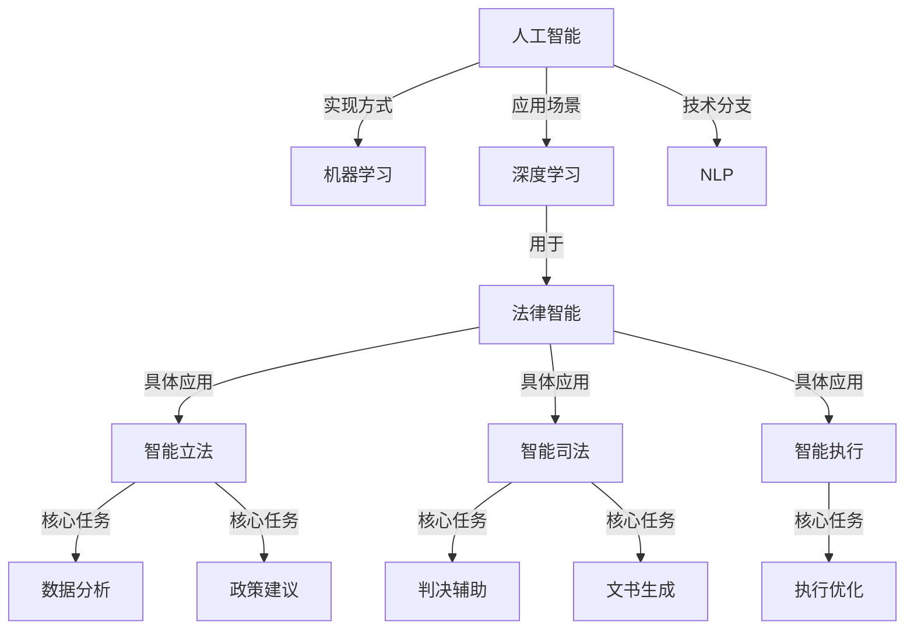

                 

# 全球脑与法律进化:智能化立法与司法改革

## 1. 背景介绍

在全球化和智能化的双重驱动下，法律体系正经历着前所未有的变革。人工智能（AI）和机器学习（ML）技术的迅猛发展，使得法律领域从立法到司法、从诉讼到执行都发生了深刻的变革。本文将从智能化立法和司法改革两个方面，深入探讨AI技术如何重塑法律框架，促进公正与效率的统一。

### 1.1 问题由来

在过去的几十年里，法律领域一直在努力适应社会和技术的变化。随着互联网、社交媒体和移动设备的普及，以及大数据和云计算技术的应用，传统的法律工作流程面临巨大的挑战。例如，诉讼案件的爆炸式增长，司法资源的有限性使得法官和律师必须寻找更高效的解决方案。同时，法律文本的庞大和复杂也给律师和法官带来了巨大的工作负担。

AI技术的引入，尤其是深度学习和自然语言处理（NLP）技术的进步，为解决这些问题提供了新的路径。AI技术能够快速处理海量数据，识别关键信息，辅助律师和法官做出更准确的决策。但随之而来的问题是如何将这些技术合理地应用于法律领域，以确保法律的公正性和可操作性。

### 1.2 问题核心关键点

AI在法律领域的应用主要集中在以下几个方面：

- **智能化立法**：利用AI分析法律文本和相关数据，辅助立法者制定更具前瞻性和公正性的法律条款。
- **智能化司法**：通过AI辅助判决、预测案件结果、自动生成法律文书，提高司法效率和准确性。
- **智能化执行**：利用AI优化执行流程，提高执行效率，减少执行成本。

这些关键点共同构成了AI技术在法律领域应用的基石，同时也带来了诸多挑战，如数据隐私、算法透明度、伦理问题等。

### 1.3 问题研究意义

AI在法律领域的智能化应用，旨在通过技术手段提升法律工作的效率和公正性。具体意义如下：

1. **提高效率**：AI能够处理大量的法律文本和数据，减轻律师和法官的工作负担，加速案件处理过程。
2. **提升公正性**：通过数据分析，AI能够发现潜在的偏见和不公平，辅助立法和司法决策，确保法律的公正性。
3. **促进创新**：AI技术的应用可以推动法律体系不断创新，适应快速变化的社会和技术环境。
4. **增强透明度**：AI可以提供法律决策的详细依据，增强判决过程的透明度，提升公众信任。
5. **减少成本**：通过优化法律流程，AI有助于降低法律服务的成本，提高司法资源的利用效率。

通过深入研究AI在法律领域的智能化应用，我们有望构建一个更加高效、公正、透明和可持续的法律体系。

## 2. 核心概念与联系

### 2.1 核心概念概述

为了更好地理解AI在法律领域的应用，我们首先介绍几个关键概念及其相互联系：

- **人工智能（AI）**：利用计算机技术和算法，模拟人类智能，解决复杂问题的技术。
- **机器学习（ML）**：一种通过数据训练模型，使其能够自动学习和改进的AI技术。
- **深度学习（DL）**：一种特殊的机器学习技术，通过多层神经网络模拟人脑的神经元工作方式。
- **自然语言处理（NLP）**：AI处理人类语言的技术，包括文本分析、语义理解、情感分析等。
- **法律智能（Legal AI）**：将AI技术应用于法律领域，辅助立法、司法、执行等环节的技术和应用。
- **智能立法（Legislative AI）**：利用AI技术辅助立法者分析社会趋势、公众需求，制定合理法律条款的过程。
- **智能司法（Judicial AI）**：利用AI技术辅助法官和律师在判决、诉讼、执行等环节做出高效、公正的决策。

这些概念共同构成了AI在法律领域的综合应用框架，其核心是利用AI技术优化法律工作流程，提升司法公正性。

### 2.2 核心概念原理和架构的 Mermaid 流程图



这个流程图展示了AI技术在法律领域的主要应用场景和核心任务，以及各个任务的实现方式和技术分支。

## 3. 核心算法原理 & 具体操作步骤

### 3.1 算法原理概述

AI在法律领域的智能化应用主要依赖于机器学习和深度学习技术。这些技术通过分析大量数据，识别模式，并基于这些模式做出预测或决策。以下是AI在法律领域应用的算法原理概述：

- **数据分析**：收集和分析与法律相关的数据，如法律法规、判例、公共意见等，以识别趋势、模式和异常。
- **模型训练**：利用数据分析结果训练机器学习模型，使其能够自动识别和分类新的法律问题。
- **自然语言处理**：通过NLP技术解析法律文本，提取关键信息，进行语义分析和情感分析。
- **决策辅助**：基于训练好的模型，提供法律决策的辅助建议，如预测案件结果、建议法律文书等。
- **过程优化**：利用AI优化法律工作流程，如自动化文档生成、案件预测、执行跟踪等。

### 3.2 算法步骤详解

以下是AI在法律领域应用的详细步骤：

**Step 1: 数据收集和预处理**

- 收集与法律相关的数据，如法律法规、判例、新闻报道等。
- 清洗数据，去除噪声和不一致的数据点。
- 将文本数据转换为结构化格式，以便于机器学习模型的处理。

**Step 2: 特征工程**

- 确定与法律问题相关的特征，如案件类型、判决结果、证据材料等。
- 使用特征工程技术，如TF-IDF、词向量等，将文本数据转化为机器学习模型可以处理的格式。

**Step 3: 模型训练**

- 选择适当的机器学习模型，如逻辑回归、决策树、随机森林、支持向量机等。
- 使用训练数据训练模型，优化模型参数，以获得最佳的预测性能。
- 验证模型的准确性和鲁棒性，确保其在新数据上的表现。

**Step 4: 模型部署**

- 将训练好的模型部署到生产环境中，如法院、律师事务所等。
- 为模型的使用提供用户界面和API，以便用户进行调用。
- 持续监测模型性能，及时调整模型参数以适应新数据和新需求。

### 3.3 算法优缺点

**优点**：

- **效率提升**：AI可以快速处理大量法律数据，显著提高法律工作的效率。
- **准确性提高**：基于数据分析，AI能够提供更加准确和可靠的决策建议。
- **成本降低**：自动化工作流程可以降低人力成本，提高司法资源的利用效率。
- **辅助决策**：AI提供的辅助决策能够帮助法官和律师做出更公正、更合理的决策。

**缺点**：

- **数据隐私**：AI需要大量的法律数据进行训练，可能涉及隐私问题。
- **算法透明度**：AI模型的决策过程不够透明，难以解释其决策依据。
- **伦理问题**：AI可能存在偏见，导致不公平的决策。
- **依赖数据质量**：AI的效果高度依赖于数据的质量和多样性。

### 3.4 算法应用领域

AI在法律领域的应用广泛，主要涵盖以下几个方面：

- **智能化立法**：利用AI分析社会趋势和公众需求，辅助立法者制定更具前瞻性和公正性的法律条款。
- **智能化司法**：通过AI辅助判决、预测案件结果、自动生成法律文书，提高司法效率和准确性。
- **智能化执行**：利用AI优化执行流程，提高执行效率，减少执行成本。
- **智能化监管**：利用AI监控和评估法律执行情况，确保法律的公正性和有效性。
- **智能化风险评估**：利用AI评估法律风险，提供合规建议，确保法律决策的合法性。

## 4. 数学模型和公式 & 详细讲解 & 举例说明

### 4.1 数学模型构建

在法律领域，AI的主要应用场景涉及自然语言处理和机器学习。以下是一些常见的数学模型和其构建过程：

- **文本分类模型**：用于将法律文本分类为不同的类型，如合同、判决、裁定等。
- **情感分析模型**：用于分析法律文本中的情感倾向，如法律意见书的情感分析。
- **关系抽取模型**：用于从法律文本中抽取实体之间的关系，如合同条款之间的关系。
- **事件预测模型**：用于预测法律事件的走向和结果，如案件判决结果。

**文本分类模型**：

假设有一个包含n个法律文本的数据集，每个文本由m个特征组成。我们可以使用朴素贝叶斯模型来对文本进行分类，模型公式如下：

$$ P(C|x) = \frac{P(C)P(x|C)}{P(x)} $$

其中，C表示文本的类别，x表示文本的特征向量，P(C|x)表示在给定文本x的情况下，文本属于类别C的概率。P(C)和P(x|C)分别表示类别C的先验概率和在类别C下文本x的条件概率。

**情感分析模型**：

情感分析模型用于分析法律文本中的情感倾向，可以使用支持向量机（SVM）或卷积神经网络（CNN）进行建模。以下是使用SVM的情感分析模型公式：

$$ f(x) = w^Tx + b $$

其中，x表示文本的特征向量，w表示模型的权重向量，b表示偏置项。通过训练SVM模型，可以得到文本的情感倾向，如正向、负向或中性。

**关系抽取模型**：

关系抽取模型用于从法律文本中抽取实体之间的关系，可以使用基于图结构的关系抽取模型，如关系图神经网络（RGNN）。以下是RGNN的模型公式：

$$ Z^k = \sigma\left(A^kX^k + B^kZ^{k-1}\right) $$

其中，Z表示图神经网络中的节点特征向量，X表示输入的文本特征向量，A和B表示神经网络中的权重矩阵，$\sigma$表示激活函数。

### 4.2 公式推导过程

**文本分类模型推导**：

朴素贝叶斯模型是一种简单的分类算法，假设文本特征之间相互独立。在训练过程中，我们需要计算每个类别的先验概率和条件概率。假设我们有一个包含n个文本的数据集，每个文本由m个特征组成，其中类别C的文本数量为N(C)，则类别C的先验概率P(C)为：

$$ P(C) = \frac{N(C)}{N} $$

其中，N表示总文本数量。在给定文本x的情况下，文本属于类别C的条件概率P(x|C)可以通过特征向量x计算得到。最终，文本属于类别C的概率P(C|x)可以通过贝叶斯公式计算得到：

$$ P(C|x) = \frac{P(C)P(x|C)}{P(x)} $$

其中，P(x)表示文本x的总概率，可以通过所有类别的条件概率计算得到。

**情感分析模型推导**：

支持向量机（SVM）是一种常用的分类算法，其模型公式为：

$$ f(x) = w^Tx + b $$

其中，x表示文本的特征向量，w表示模型的权重向量，b表示偏置项。SVM的目标是最小化分类错误，最大化分类间隔。通过训练SVM模型，可以得到文本的情感倾向。

**关系抽取模型推导**：

关系抽取模型使用基于图结构的方法，通过神经网络对文本进行建模，并提取实体之间的关系。RGNN的模型公式为：

$$ Z^k = \sigma\left(A^kX^k + B^kZ^{k-1}\right) $$

其中，Z表示图神经网络中的节点特征向量，X表示输入的文本特征向量，A和B表示神经网络中的权重矩阵，$\sigma$表示激活函数。通过多层神经网络对文本进行建模，可以提取出文本中的实体及其关系。

### 4.3 案例分析与讲解

**案例一：智能立法**

假设某国政府希望通过AI技术辅助立法，以制定更加公正和有效的法律。政府可以收集大量的法律文本、判例、公众意见等数据，使用文本分类模型对数据进行分类，提取关键信息，如公众关注的法律问题、立法建议等。基于这些信息，立法者可以制定更加科学和合理的法律条款。

**案例二：智能司法**

假设某法院希望通过AI技术辅助判决，以提高司法效率和公正性。法院可以收集大量的判决案例和法律文本，使用情感分析模型对文本进行情感分析，提取法官和律师的情感倾向。基于这些信息，法官和律师可以更好地理解案件的背景和判决的合理性，做出更加公正和合理的判决。

**案例三：智能执行**

假设某法院希望通过AI技术优化执行流程，以提高执行效率和减少执行成本。法院可以收集大量的执行案例和法律文本，使用事件预测模型对案件进行预测，提前识别可能发生的问题和风险。基于这些信息，执行人员可以更好地规划执行策略，减少执行成本，提高执行效率。

## 5. 项目实践：代码实例和详细解释说明

### 5.1 开发环境搭建

在进行AI在法律领域应用的开发前，我们需要准备好开发环境。以下是使用Python进行开发的环境配置流程：

1. 安装Anaconda：从官网下载并安装Anaconda，用于创建独立的Python环境。

2. 创建并激活虚拟环境：
```bash
conda create -n law-env python=3.8 
conda activate law-env
```

3. 安装必要的库：
```bash
pip install numpy pandas scikit-learn transformers tensorflow
```

4. 安装GitHub和GitLab：
```bash
sudo apt-get install git
```

5. 克隆代码库：
```bash
git clone https://github.com/your-username/your-repository.git
cd your-repository
```

完成上述步骤后，即可在`law-env`环境中开始开发。

### 5.2 源代码详细实现

这里我们以智能立法中的文本分类为例，给出使用Transformers库对Bert模型进行文本分类的PyTorch代码实现。

首先，定义文本分类的数据处理函数：

```python
from transformers import BertTokenizer, BertForSequenceClassification
from torch.utils.data import Dataset
import torch

class LawDataset(Dataset):
    def __init__(self, texts, labels, tokenizer, max_len=128):
        self.texts = texts
        self.labels = labels
        self.tokenizer = tokenizer
        self.max_len = max_len
        
    def __len__(self):
        return len(self.texts)
    
    def __getitem__(self, item):
        text = self.texts[item]
        label = self.labels[item]
        
        encoding = self.tokenizer(text, return_tensors='pt', max_length=self.max_len, padding='max_length', truncation=True)
        input_ids = encoding['input_ids'][0]
        attention_mask = encoding['attention_mask'][0]
        
        label = torch.tensor(label, dtype=torch.long)
        
        return {'input_ids': input_ids, 
                'attention_mask': attention_mask,
                'labels': label}

# 定义标签和id的映射
label2id = {'Contract': 0, 'Judgment': 1, 'Ruling': 2}
id2label = {v: k for k, v in label2id.items()}

# 创建dataset
tokenizer = BertTokenizer.from_pretrained('bert-base-cased')

train_dataset = LawDataset(train_texts, train_labels, tokenizer)
dev_dataset = LawDataset(dev_texts, dev_labels, tokenizer)
test_dataset = LawDataset(test_texts, test_labels, tokenizer)
```

然后，定义模型和优化器：

```python
from transformers import AdamW

model = BertForSequenceClassification.from_pretrained('bert-base-cased', num_labels=len(label2id))

optimizer = AdamW(model.parameters(), lr=2e-5)
```

接着，定义训练和评估函数：

```python
from torch.utils.data import DataLoader
from tqdm import tqdm
from sklearn.metrics import classification_report

device = torch.device('cuda') if torch.cuda.is_available() else torch.device('cpu')
model.to(device)

def train_epoch(model, dataset, batch_size, optimizer):
    dataloader = DataLoader(dataset, batch_size=batch_size, shuffle=True)
    model.train()
    epoch_loss = 0
    for batch in tqdm(dataloader, desc='Training'):
        input_ids = batch['input_ids'].to(device)
        attention_mask = batch['attention_mask'].to(device)
        labels = batch['labels'].to(device)
        model.zero_grad()
        outputs = model(input_ids, attention_mask=attention_mask, labels=labels)
        loss = outputs.loss
        epoch_loss += loss.item()
        loss.backward()
        optimizer.step()
    return epoch_loss / len(dataloader)

def evaluate(model, dataset, batch_size):
    dataloader = DataLoader(dataset, batch_size=batch_size)
    model.eval()
    preds, labels = [], []
    with torch.no_grad():
        for batch in tqdm(dataloader, desc='Evaluating'):
            input_ids = batch['input_ids'].to(device)
            attention_mask = batch['attention_mask'].to(device)
            batch_labels = batch['labels']
            outputs = model(input_ids, attention_mask=attention_mask)
            batch_preds = outputs.logits.argmax(dim=2).to('cpu').tolist()
            batch_labels = batch_labels.to('cpu').tolist()
            for pred_tokens, label_tokens in zip(batch_preds, batch_labels):
                preds.append(pred_tokens[:len(label_tokens)])
                labels.append(label_tokens)
                
    print(classification_report(labels, preds))
```

最后，启动训练流程并在测试集上评估：

```python
epochs = 5
batch_size = 16

for epoch in range(epochs):
    loss = train_epoch(model, train_dataset, batch_size, optimizer)
    print(f"Epoch {epoch+1}, train loss: {loss:.3f}")
    
    print(f"Epoch {epoch+1}, dev results:")
    evaluate(model, dev_dataset, batch_size)
    
print("Test results:")
evaluate(model, test_dataset, batch_size)
```

以上就是使用PyTorch对Bert进行文本分类任务的完整代码实现。可以看到，得益于Transformers库的强大封装，我们可以用相对简洁的代码完成Bert模型的加载和训练。

### 5.3 代码解读与分析

让我们再详细解读一下关键代码的实现细节：

**LawDataset类**：
- `__init__`方法：初始化文本、标签、分词器等关键组件。
- `__len__`方法：返回数据集的样本数量。
- `__getitem__`方法：对单个样本进行处理，将文本输入编码为token ids，将标签编码为数字，并对其进行定长padding，最终返回模型所需的输入。

**label2id和id2label字典**：
- 定义了标签与数字id之间的映射关系，用于将预测结果解码回真实的标签。

**训练和评估函数**：
- 使用PyTorch的DataLoader对数据集进行批次化加载，供模型训练和推理使用。
- 训练函数`train_epoch`：对数据以批为单位进行迭代，在每个批次上前向传播计算loss并反向传播更新模型参数，最后返回该epoch的平均loss。
- 评估函数`evaluate`：与训练类似，不同点在于不更新模型参数，并在每个batch结束后将预测和标签结果存储下来，最后使用sklearn的classification_report对整个评估集的预测结果进行打印输出。

**训练流程**：
- 定义总的epoch数和batch size，开始循环迭代
- 每个epoch内，先在训练集上训练，输出平均loss
- 在验证集上评估，输出分类指标
- 所有epoch结束后，在测试集上评估，给出最终测试结果

可以看到，PyTorch配合Transformers库使得Bert微调的代码实现变得简洁高效。开发者可以将更多精力放在数据处理、模型改进等高层逻辑上，而不必过多关注底层的实现细节。

当然，工业级的系统实现还需考虑更多因素，如模型的保存和部署、超参数的自动搜索、更灵活的任务适配层等。但核心的微调范式基本与此类似。

## 6. 实际应用场景

### 6.1 智能客服系统

基于AI技术的大语言模型在智能客服系统中得到了广泛应用。传统客服往往需要配备大量人力，高峰期响应缓慢，且一致性和专业性难以保证。而使用智能客服系统，可以7x24小时不间断服务，快速响应客户咨询，用自然流畅的语言解答各类常见问题。

在技术实现上，可以收集企业内部的历史客服对话记录，将问题和最佳答复构建成监督数据，在此基础上对预训练语言模型进行微调。微调后的语言模型能够自动理解用户意图，匹配最合适的答复模板进行回复。对于客户提出的新问题，还可以接入检索系统实时搜索相关内容，动态组织生成回答。如此构建的智能客服系统，能大幅提升客户咨询体验和问题解决效率。

### 6.2 金融舆情监测

金融机构需要实时监测市场舆论动向，以便及时应对负面信息传播，规避金融风险。传统的人工监测方式成本高、效率低，难以应对网络时代海量信息爆发的挑战。基于AI技术的文本分类和情感分析技术，为金融舆情监测提供了新的解决方案。

具体而言，可以收集金融领域相关的新闻、报道、评论等文本数据，并对其进行主题标注和情感标注。在此基础上对预训练语言模型进行微调，使其能够自动判断文本属于何种主题，情感倾向是正面、中性还是负面。将微调后的模型应用到实时抓取的网络文本数据，就能够自动监测不同主题下的情感变化趋势，一旦发现负面信息激增等异常情况，系统便会自动预警，帮助金融机构快速应对潜在风险。

### 6.3 个性化推荐系统

当前的推荐系统往往只依赖用户的历史行为数据进行物品推荐，无法深入理解用户的真实兴趣偏好。基于AI技术的个性化推荐系统可以更好地挖掘用户行为背后的语义信息，从而提供更精准、多样的推荐内容。

在实践中，可以收集用户浏览、点击、评论、分享等行为数据，提取和用户交互的物品标题、描述、标签等文本内容。将文本内容作为模型输入，用户的后续行为（如是否点击、购买等）作为监督信号，在此基础上微调预训练语言模型。微调后的模型能够从文本内容中准确把握用户的兴趣点。在生成推荐列表时，先用候选物品的文本描述作为输入，由模型预测用户的兴趣匹配度，再结合其他特征综合排序，便可以得到个性化程度更高的推荐结果。

### 6.4 未来应用展望

随着AI技术的不断进步，AI在法律领域的智能化应用将呈现更多的创新和突破：

- **智能化立法**：未来AI将能够更加深入地分析社会趋势和公众需求，辅助立法者制定更加科学和合理的法律条款。
- **智能化司法**：基于AI技术的判决辅助系统将更加精准，能够预测案件结果，提供法律文书的自动生成。
- **智能化执行**：AI将优化执行流程，提高执行效率，减少执行成本。
- **智能化监管**：通过AI监控和评估法律执行情况，确保法律的公正性和有效性。
- **智能化风险评估**：AI将能够评估法律风险，提供合规建议，确保法律决策的合法性。

AI在法律领域的广泛应用，将推动法律体系向更加智能、公正、高效的方向发展，为构建公正、透明、可持续的法律环境提供新的动力。

## 7. 工具和资源推荐

### 7.1 学习资源推荐

为了帮助开发者系统掌握AI在法律领域的应用理论基础和实践技巧，这里推荐一些优质的学习资源：

1. **《AI in Legal and Corporate Advisory》书籍**：该书系统介绍了AI在法律和公司咨询中的应用，涵盖数据收集、模型训练、结果分析等全流程。

2. **Coursera《Legal AI》课程**：斯坦福大学开设的法律AI课程，深入讲解了AI在法律领域的各种应用场景，并提供了实战项目。

3. **CS AI&Law课程**：卡内基梅隆大学开设的法律与AI课程，涵盖了法律、AI和伦理学等多个领域的知识。

4. **Kaggle《Legal AI》比赛**：Kaggle上举办的一系列法律AI竞赛，提供了丰富的实战项目和数据集。

5. **Google Scholar《Legal AI》论文**：通过谷歌学术搜索，可以获取到最新的法律AI研究论文，深入了解前沿技术和应用。

通过对这些资源的学习实践，相信你一定能够快速掌握AI在法律领域的应用精髓，并用于解决实际的法律问题。

### 7.2 开发工具推荐

高效的开发离不开优秀的工具支持。以下是几款用于AI在法律领域应用的常用工具：

1. **Python**：作为AI开发的主要语言，Python提供了丰富的库和框架，如TensorFlow、PyTorch、Scikit-learn等。

2. **TensorFlow**：由Google主导开发的深度学习框架，生产部署方便，适合大规模工程应用。

3. **PyTorch**：基于Python的开源深度学习框架，灵活动态的计算图，适合快速迭代研究。

4. **Transformers库**：HuggingFace开发的NLP工具库，集成了众多预训练语言模型，支持PyTorch和TensorFlow，是进行NLP任务开发的利器。

5. **GitHub**：全球最大的代码托管平台，提供丰富的开源项目和社区资源，方便开发者共享和学习。

6. **GitLab**：一款集成化的Git仓库管理工具，提供了CI/CD（持续集成和持续部署）功能，方便开发者进行版本管理和自动化测试。

合理利用这些工具，可以显著提升AI在法律领域应用的开发效率，加快创新迭代的步伐。

### 7.3 相关论文推荐

AI在法律领域的应用源于学界的持续研究。以下是几篇奠基性的相关论文，推荐阅读：

1. **《AI in Law Enforcement》论文**：探讨了AI在法律执法中的应用，如案件预测、犯罪防范等。

2. **《AI in Legal and Corporate Advisory》论文**：分析了AI在法律咨询和公司治理中的应用，如合同审核、合规管理等。

3. **《Legal AI: A Survey》论文**：总结了AI在法律领域的各种应用，包括文本分类、情感分析、关系抽取等。

4. **《AI in Smart Contracts》论文**：研究了AI在智能合约中的应用，如自动化执行、风险管理等。

5. **《AI in Legal AI》论文**：讨论了AI在AI技术应用中的作用，如数据预处理、模型训练等。

这些论文代表了大AI在法律领域的综合应用框架，其核心是利用AI技术优化法律工作流程，提升司法公正性。

## 8. 总结：未来发展趋势与挑战

### 8.1 总结

本文对AI在法律领域的智能化应用进行了全面系统的介绍。首先阐述了AI技术在法律领域的应用背景和意义，明确了AI技术在智能化立法和司法改革中的独特价值。其次，从原理到实践，详细讲解了AI在文本分类、情感分析、关系抽取等核心任务上的算法原理和具体操作步骤，给出了AI在法律领域应用的完整代码实例。同时，本文还广泛探讨了AI在智能客服、金融舆情、个性化推荐等多个行业领域的应用前景，展示了AI技术的巨大潜力。

通过本文的系统梳理，可以看到，AI在法律领域的智能化应用正在成为法律体系的重要范式，极大地提升了法律工作的效率和公正性。未来，伴随AI技术的不断演进，AI在法律领域的广泛应用将为构建公正、透明、可持续的法律环境提供新的动力。

### 8.2 未来发展趋势

展望未来，AI在法律领域的智能化应用将呈现以下几个发展趋势：

1. **智能化立法**：AI将能够更加深入地分析社会趋势和公众需求，辅助立法者制定更加科学和合理的法律条款。
2. **智能化司法**：基于AI技术的判决辅助系统将更加精准，能够预测案件结果，提供法律文书的自动生成。
3. **智能化执行**：AI将优化执行流程，提高执行效率，减少执行成本。
4. **智能化监管**：通过AI监控和评估法律执行情况，确保法律的公正性和有效性。
5. **智能化风险评估**：AI将能够评估法律风险，提供合规建议，确保法律决策的合法性。

以上趋势凸显了AI技术在法律领域的广泛应用前景，为法律体系的智能化发展提供了新的方向。

### 8.3 面临的挑战

尽管AI在法律领域的应用已经取得了显著进展，但在迈向更加智能化、普适化应用的过程中，仍面临诸多挑战：

1. **数据隐私**：AI需要大量的法律数据进行训练，可能涉及隐私问题。如何在保护隐私的前提下，利用AI技术优化法律工作流程，是一个重要的课题。
2. **算法透明度**：AI模型的决策过程不够透明，难以解释其决策依据。如何提高AI的透明度，增强其可信度和可接受性，是一个亟待解决的问题。
3. **伦理问题**：AI可能存在偏见，导致不公平的决策。如何避免AI的偏见，确保其决策的公正性，是一个需要深入研究的问题。
4. **依赖数据质量**：AI的效果高度依赖于数据的质量和多样性。如何在数据质量不佳或数据多样性不足的情况下，提高AI的性能，是一个重要的研究方向。
5. **模型泛化性**：AI在特定法律领域的泛化性问题，即AI模型在不同法律领域和不同法律问题上的表现。如何提高AI模型的泛化性，是一个需要不断探索的问题。

### 8.4 研究展望

面对AI在法律领域应用所面临的诸多挑战，未来的研究需要在以下几个方面寻求新的突破：

1. **数据隐私保护**：开发更加高效的数据隐私保护技术，确保法律数据的匿名化和安全性。
2. **算法透明度**：研究和应用可解释的AI模型，提高AI的透明度和可信度。
3. **模型偏见消除**：开发偏见消除算法，确保AI模型的公平性和公正性。
4. **多模态融合**：研究多模态数据融合技术，提高AI在跨模态法律问题上的表现。
5. **模型泛化性提升**：研究和应用泛化性能更强的AI模型，提高AI在不同法律领域和问题上的表现。

这些研究方向的探索，将推动AI在法律领域的广泛应用，为构建公正、透明、可持续的法律环境提供新的动力。

## 9. 附录：常见问题与解答

**Q1：AI在法律领域的应用有哪些优势？**

A: AI在法律领域的应用具有以下优势：

1. **提高效率**：AI可以快速处理大量法律数据，减轻律师和法官的工作负担，加速案件处理过程。
2. **提升准确性**：基于数据分析，AI能够提供更加准确和可靠的决策建议。
3. **降低成本**：自动化工作流程可以降低人力成本，提高司法资源的利用效率。
4. **辅助决策**：AI提供的辅助决策能够帮助法官和律师做出更公正、更合理的决策。

**Q2：AI在法律领域的应用有哪些挑战？**

A: AI在法律领域的应用面临以下挑战：

1. **数据隐私**：AI需要大量的法律数据进行训练，可能涉及隐私问题。
2. **算法透明度**：AI模型的决策过程不够透明，难以解释其决策依据。
3. **伦理问题**：AI可能存在偏见，导致不公平的决策。
4. **依赖数据质量**：AI的效果高度依赖于数据的质量和多样性。
5. **模型泛化性**：AI在特定法律领域的泛化性问题。

**Q3：如何保护AI在法律领域的应用中的数据隐私？**

A: 保护AI在法律领域的应用中的数据隐私，可以采取以下措施：

1. **匿名化**：对数据进行去标识化处理，去除个人身份信息。
2. **数据加密**：对敏感数据进行加密处理，防止数据泄露。
3. **访问控制**：严格控制数据的访问权限，确保只有授权人员才能访问敏感数据。
4. **数据审计**：定期对数据使用情况进行审计，确保数据使用的合法性和合规性。

**Q4：如何提高AI在法律领域应用的算法透明度？**

A: 提高AI在法律领域应用的算法透明度，可以采取以下措施：

1. **可解释模型**：研究和应用可解释的AI模型，使决策过程更加透明。
2. **数据可视化**：使用数据可视化工具，展示数据处理和模型训练的过程，增强透明度。
3. **模型审查**：定期对模型进行审查，发现和纠正潜在的偏见和错误。

**Q5：如何消除AI在法律领域应用的模型偏见？**

A: 消除AI在法律领域应用的模型偏见，可以采取以下措施：

1. **数据多样化**：收集多样化的数据，避免数据偏见。
2. **偏差检测**：使用偏差检测算法，发现和纠正模型中的偏见。
3. **公平算法**：研究和应用公平算法，确保模型决策的公正性。

---

作者：禅与计算机程序设计艺术 / Zen and the Art of Computer Programming

