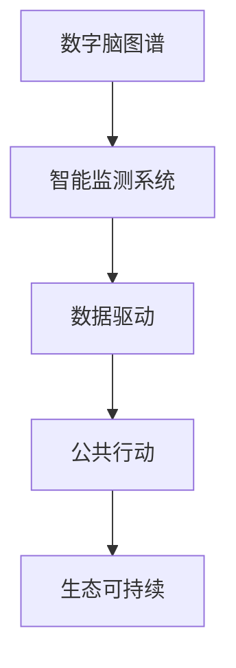

                 

# 全球脑与环境保护：数字化监测与共同行动

> 关键词：数字脑图谱, 智能监测系统, 环境保护, 数据驱动, 公共行动, 生态可持续

## 1. 背景介绍

### 1.1 问题由来
随着全球人口的增加和工业化进程的加速，人类活动对自然环境的影响日益加剧。从气候变化、生物多样性丧失，到城市化进程中的噪音和空气污染，环境问题已成为全球性的挑战。

保护环境，尤其是保护脑（生态环境的重要组成部分），需要全社会的共同参与和科技的支撑。数字技术和大数据为环境监测提供了新的可能性，但如何有效整合和利用这些数据，并引导公众采取行动，仍是巨大的挑战。

### 1.2 问题核心关键点
- 环境问题愈发复杂和多样化。全球范围内的监测系统如何统一、标准化？
- 数据分析和管理效率低下，数据孤岛问题严重。如何构建一个高效、互联互通的环境监测网络？
- 公众参与度不足，环境意识有待提升。如何激发公众参与，并形成可持续的环境保护行动？
- 数据隐私和安全问题。如何确保环境数据的安全，并保护公众隐私？

## 2. 核心概念与联系

### 2.1 核心概念概述

为更好地理解数字脑图谱和智能监测系统在环境保护中的应用，本节将介绍几个密切相关的核心概念：

- **数字脑图谱(Digital Brain Atlas)**：通过数字化手段构建的生态环境数据集，包括地理信息、生物多样性、水质、空气质量等关键指标。数字脑图谱有助于科学家的研究和决策，也为公众提供直观的环境状态展示。

- **智能监测系统(Smart Monitoring System)**：利用传感器、物联网(IoT)等技术实时收集环境数据，并通过数据分析和机器学习算法，预测和监测环境变化。智能监测系统能够提升数据收集和处理的自动化水平，减少人工干预。

- **数据驱动(Data-Driven)**：以数据为基础的决策和行动模式，强调在充分理解数据的基础上进行科学决策。数据驱动有助于优化资源配置，提升环境保护措施的效果。

- **公共行动(Public Engagement)**：鼓励公众参与环境监测和保护行动，通过提高公众的环境意识和行动力，共同构建可持续的未来。

- **生态可持续(Ecological Sustainability)**：指维持生态系统平衡和资源可持续利用的能力。通过智能监测和公众参与，实现对生态环境的长期、综合保护。

这些核心概念之间的逻辑关系可以通过以下Mermaid流程图来展示：



这个流程图展示了一些关键概念及其之间的关系：

1. 数字脑图谱提供了环境数据的基础，智能监测系统通过数据收集和分析，进行科学决策。
2. 数据驱动促进了科学决策的精确性，公共行动则将决策转化为实际行动。
3. 最终目标是通过科技手段和公众参与，实现生态系统的可持续。

## 3. 核心算法原理 & 具体操作步骤
### 3.1 算法原理概述

数字脑图谱和智能监测系统结合数据驱动和公共行动，通过构建一个环境监测网络，实时监测和分析环境变化。其核心算法原理如下：

1. **数据收集与整合**：利用传感器、遥感等技术，收集全球范围内的环境数据，包括气象、水质、土壤、植被等。
2. **数据清洗与预处理**：对收集的数据进行清洗和预处理，如去噪、标准化处理等，确保数据质量。
3. **数据分析与建模**：使用统计学、机器学习等方法，对数据进行分析和建模，识别环境变化趋势和模式。
4. **可视化与展示**：将分析结果通过可视化技术展示，为公众提供直观的环境状态信息。
5. **公众参与与行动**：利用互联网和社交媒体，激发公众参与环境保护的积极性，通过行动反馈优化监测和保护措施。

### 3.2 算法步骤详解

数字脑图谱和智能监测系统的构建主要包括以下几个关键步骤：

**Step 1: 数据收集与整合**
- 选择合适的传感器和遥感技术，部署到全球各地，进行环境数据收集。
- 整合来自不同来源的数据，建立统一的数据标准和接口，实现数据互联互通。

**Step 2: 数据清洗与预处理**
- 对原始数据进行去噪、归一化、填补缺失值等预处理操作，保证数据质量。
- 对异常数据进行检测和修正，确保数据准确性。

**Step 3: 数据分析与建模**
- 选择适合的分析方法，如统计分析、回归分析、时间序列分析等，对数据进行深入分析。
- 利用机器学习模型，如随机森林、神经网络等，建立环境预测模型，识别环境变化趋势和模式。

**Step 4: 可视化与展示**
- 使用可视化工具如Tableau、PowerBI等，将分析结果以图表、地图等形式展示。
- 通过Web应用平台，提供数据接口和API，方便公众访问和交互。

**Step 5: 公众参与与行动**
- 利用社交媒体、在线论坛等平台，向公众普及环境知识，提升环境意识。
- 设计互动界面，鼓励公众上传监测数据、参与讨论、提出建议。
- 根据公众反馈，优化和调整监测和保护措施。

### 3.3 算法优缺点

数字脑图谱和智能监测系统结合数据驱动和公共行动，具有以下优点：
1. 高效便捷。利用数字化手段，大幅提升环境监测的效率和覆盖面。
2. 数据准确。多源数据整合和清洗预处理，确保数据准确性和一致性。
3. 公众参与。通过社交媒体和在线平台，激发公众参与，形成群体智慧。
4. 科学决策。数据分析和建模提供科学的决策支持，优化资源配置。

同时，该方法也存在一些局限性：
1. 数据隐私。在数据收集和共享过程中，如何保护公众隐私是一个重大挑战。
2. 数据质量。环境数据的噪声和不确定性可能影响分析结果的准确性。
3. 公众参与度。如何吸引公众持续参与，并转化为实际行动，仍需持续努力。
4. 技术依赖。依赖先进的数据收集和分析技术，对技术实施和维护要求高。
5. 社会文化。不同地区社会文化差异可能导致参与度和行动方式不同。

尽管存在这些局限性，数字脑图谱和智能监测系统仍是大规模环境监测和保护的有力工具。未来研究的方向包括：提升数据隐私保护技术、增强公众参与度、降低技术实施门槛等。

### 3.4 算法应用领域

数字脑图谱和智能监测系统已经在多个领域得到了应用，例如：

- 气候变化监测：利用全球气象站和卫星数据，监测全球气候变化趋势。
- 水质监测：通过水体传感器和遥感影像，实时监测水质变化。
- 生物多样性保护：利用生物多样性数据库，监测物种分布和生态系统健康。
- 空气质量监测：部署空气质量传感器，监测城市空气质量。
- 生态系统保护：结合遥感数据和地面监测，评估生态系统变化。
- 自然灾害预警：通过气象和地质监测，预测自然灾害发生，提前预警。

除了上述这些应用领域外，数字脑图谱和智能监测系统还被创新性地应用于灾害救援、生态修复、城市规划等多个场景，为环境保护和可持续发展提供了新的技术手段。

## 4. 数学模型和公式 & 详细讲解 & 举例说明

### 4.1 数学模型构建

本节将使用数学语言对数字脑图谱和智能监测系统的构建过程进行更加严格的刻画。

假设数字脑图谱的数据集为 $D=\{(x_i,y_i)\}_{i=1}^N, x_i \in \mathbb{R}^d, y_i \in \mathbb{R}^d$。其中 $x_i$ 表示环境监测指标，$y_i$ 表示对应的环境状态（如空气质量等级、水质等级等）。

定义数字脑图谱的损失函数为 $\mathcal{L}(y,\hat{y})=\sum_{i=1}^N \ell(y_i,\hat{y}_i)$，其中 $\ell$ 为损失函数，通常为均方误差（MSE）或交叉熵损失。

数字脑图谱的优化目标是最小化损失函数，即找到最优的参数 $\theta$：

$$
\theta^* = \mathop{\arg\min}_{\theta} \mathcal{L}(y,\hat{y})
$$

在实践中，我们通常使用基于梯度的优化算法（如SGD、Adam等）来近似求解上述最优化问题。设 $\eta$ 为学习率，$\lambda$ 为正则化系数，则参数的更新公式为：

$$
\theta \leftarrow \theta - \eta \nabla_{\theta}\mathcal{L}(y,\hat{y}) - \eta\lambda\theta
$$

其中 $\nabla_{\theta}\mathcal{L}(y,\hat{y})$ 为损失函数对参数 $\theta$ 的梯度，可通过反向传播算法高效计算。

### 4.2 公式推导过程

以下我们以空气质量监测为例，推导均方误差损失函数及其梯度的计算公式。

假设模型 $M_{\theta}$ 在输入 $x$ 上的输出为 $\hat{y}=M_{\theta}(x) \in [0,1]$，表示空气质量等级预测值。真实标签 $y \in \{0,1,2,3,4,5\}$ 表示实际空气质量等级。则均方误差损失函数定义为：

$$
\ell(y,\hat{y}) = \frac{1}{N}\sum_{i=1}^N (y_i - \hat{y}_i)^2
$$

将其代入损失函数公式，得：

$$
\mathcal{L}(\theta) = \frac{1}{N}\sum_{i=1}^N (y_i - M_{\theta}(x_i))^2
$$

根据链式法则，损失函数对参数 $\theta_k$ 的梯度为：

$$
\frac{\partial \mathcal{L}(\theta)}{\partial \theta_k} = \frac{1}{N}\sum_{i=1}^N -2(y_i - M_{\theta}(x_i))\frac{\partial M_{\theta}(x_i)}{\partial \theta_k}
$$

其中 $\frac{\partial M_{\theta}(x_i)}{\partial \theta_k}$ 可进一步递归展开，利用自动微分技术完成计算。

### 4.3 案例分析与讲解

假设我们拥有全球各地的空气质量监测数据，并希望通过数字脑图谱对其进行建模和预测。

1. **数据收集与预处理**：收集全球各地的空气质量监测数据，并进行去噪、归一化等预处理操作，确保数据质量。

2. **模型选择与训练**：选择适合的时间序列分析模型，如ARIMA、LSTM等，对数据进行训练。使用历史数据对模型进行拟合，并在验证集上进行评估，选择最优模型。

3. **模型评估与优化**：在测试集上评估模型的预测精度，使用交叉验证等方法进行模型优化。根据评估结果调整模型参数，提升预测效果。

4. **可视化与展示**：使用可视化工具如Tableau、PowerBI等，将模型预测结果以地图形式展示，便于公众理解和反馈。

5. **公众参与与行动**：通过社交媒体和在线平台，向公众普及空气质量知识，鼓励上传监测数据、参与讨论、提出建议。根据公众反馈，调整监测和保护措施。

通过数字脑图谱和智能监测系统，我们可以实现对全球空气质量的实时监测和预测，为环境保护和公众参与提供有力支持。

## 5. 项目实践：代码实例和详细解释说明
### 5.1 开发环境搭建

在进行数字脑图谱和智能监测系统的开发前，我们需要准备好开发环境。以下是使用Python进行PyTorch开发的环境配置流程：

1. 安装Anaconda：从官网下载并安装Anaconda，用于创建独立的Python环境。

2. 创建并激活虚拟环境：
```bash
conda create -n pytorch-env python=3.8 
conda activate pytorch-env
```

3. 安装PyTorch：根据CUDA版本，从官网获取对应的安装命令。例如：
```bash
conda install pytorch torchvision torchaudio cudatoolkit=11.1 -c pytorch -c conda-forge
```

4. 安装TensorFlow：使用pip安装，支持多种优化算法和自动微分技术。

5. 安装各类工具包：
```bash
pip install numpy pandas scikit-learn matplotlib tqdm jupyter notebook ipython
```

完成上述步骤后，即可在`pytorch-env`环境中开始开发实践。

### 5.2 源代码详细实现

这里我们以空气质量监测为例，给出使用PyTorch进行模型构建和训练的PyTorch代码实现。

首先，定义数据处理函数：

```python
from torch.utils.data import Dataset
import torch

class AirQualityDataset(Dataset):
    def __init__(self, data, scale):
        self.data = data
        self.scale = scale
        
    def __len__(self):
        return len(self.data)
    
    def __getitem__(self, index):
        x = self.data.iloc[index, :-1].values
        y = self.data.iloc[index, -1].values
        
        x = (x - np.min(x)) / (np.max(x) - np.min(x)) * self.scale
        x = np.reshape(x, (1, -1))
        
        return x, y
```

然后，定义模型和优化器：

```python
from torch import nn, optim
import torch.nn.functional as F

class AirQualityModel(nn.Module):
    def __init__(self, input_dim, hidden_dim, output_dim):
        super(AirQualityModel, self).__init__()
        self.hidden = nn.Sequential(
            nn.Linear(input_dim, hidden_dim),
            nn.ReLU(),
            nn.Linear(hidden_dim, output_dim)
        )
    
    def forward(self, x):
        x = self.hidden(x)
        return x
    
model = AirQualityModel(5, 32, 5)
optimizer = optim.Adam(model.parameters(), lr=0.001)
```

接着，定义训练和评估函数：

```python
def train(model, data_loader, optimizer):
    model.train()
    for batch in data_loader:
        x, y = batch
        x = x.to(device)
        y = y.to(device)
        optimizer.zero_grad()
        output = model(x)
        loss = F.mse_loss(output, y)
        loss.backward()
        optimizer.step()
    
def evaluate(model, data_loader):
    model.eval()
    total_loss = 0
    with torch.no_grad():
        for batch in data_loader:
            x, y = batch
            x = x.to(device)
            y = y.to(device)
            output = model(x)
            loss = F.mse_loss(output, y)
            total_loss += loss.item()
    
    return total_loss / len(data_loader)
    
device = torch.device('cuda') if torch.cuda.is_available() else torch.device('cpu')
model.to(device)
```

最后，启动训练流程并在测试集上评估：

```python
epochs = 50
batch_size = 32
scale = 10

train_loader = torch.utils.data.DataLoader(train_data, batch_size=batch_size, shuffle=True)
test_loader = torch.utils.data.DataLoader(test_data, batch_size=batch_size, shuffle=False)

for epoch in range(epochs):
    train(model, train_loader, optimizer)
    
    print(f"Epoch {epoch+1}, train loss: {train(model, train_loader, optimizer):.3f}")
    
    print(f"Epoch {epoch+1}, test loss: {evaluate(model, test_loader):.3f}")
    
print("Training completed.")
```

以上就是使用PyTorch进行空气质量监测的完整代码实现。可以看到，通过数字脑图谱和智能监测系统，我们能够构建一个简单有效的预测模型，并在测试集上进行评估和优化。

### 5.3 代码解读与分析

让我们再详细解读一下关键代码的实现细节：

**AirQualityDataset类**：
- `__init__`方法：初始化数据集和数据缩放比例。
- `__len__`方法：返回数据集的样本数量。
- `__getitem__`方法：对单个样本进行处理，进行数据预处理，并返回模型所需的输入和输出。

**AirQualityModel类**：
- `__init__`方法：定义模型的结构，包括输入层、隐藏层和输出层。
- `forward`方法：定义前向传播过程，输出模型的预测值。

**train和evaluate函数**：
- 训练函数 `train`：对数据以批为单位进行迭代，在每个批次上前向传播计算loss并反向传播更新模型参数。
- 评估函数 `evaluate`：与训练类似，不同点在于不更新模型参数，并在每个batch结束后将预测和标签结果存储下来，最后使用均方误差计算模型在测试集上的表现。

**训练流程**：
- 定义总的epoch数和batch size，开始循环迭代
- 每个epoch内，先在训练集上训练，输出平均loss
- 在测试集上评估，输出均方误差
- 所有epoch结束后，输出训练完成的提示信息

可以看到，通过数字脑图谱和智能监测系统，我们能够实现对空气质量的实时监测和预测，为环境保护和公众参与提供有力支持。

当然，工业级的系统实现还需考虑更多因素，如模型的保存和部署、超参数的自动搜索、更灵活的任务适配层等。但核心的微调范式基本与此类似。

## 6. 实际应用场景
### 6.1 智能监测系统

智能监测系统已经在多个领域得到了应用，例如：

- **城市空气质量监测**：通过部署空气质量传感器，实时监测城市空气质量。结合数字脑图谱，提供直观的环境状态展示和预警信息。
- **水质监测**：利用水体传感器和遥感影像，实时监测水质变化。结合数字脑图谱，提供水质评估和预警信息。
- **森林火灾监测**：通过卫星遥感和地面监测，实时监测森林火灾情况。结合数字脑图谱，提供火灾预警和评估信息。
- **野生动物监测**：利用无人机和地面监测，实时监测野生动物活动。结合数字脑图谱，提供动物种群动态和保护信息。
- **土地利用监测**：通过遥感和地面监测，实时监测土地利用变化。结合数字脑图谱，提供土地使用评估和预警信息。

除了上述这些应用领域外，智能监测系统还被创新性地应用于海洋监测、冰川监测、灾害预警等多个场景，为环境保护和可持续发展提供新的技术手段。

### 6.2 未来应用展望

随着数字脑图谱和智能监测系统的发展，未来的应用前景将更加广阔：

1. **全球生态系统监测**：通过卫星遥感和地面监测，实现全球生态系统的实时监测和评估。结合数字脑图谱，提供全球生态环境的综合分析和预警信息。
2. **环境变化预测**：利用时间序列分析和机器学习模型，预测环境变化趋势。结合数字脑图谱，提供环境变化的科学预测和预警信息。
3. **公众参与和行动**：通过社交媒体和在线平台，激发公众参与环境保护的积极性，形成群体智慧。结合数字脑图谱，提供公众参与的反馈和优化信息。
4. **资源优化配置**：通过数据分析和建模，优化环境保护资源的配置。结合数字脑图谱，提供资源优化配置的建议和方案。
5. **环境政策制定**：通过环境数据和分析结果，支持环境政策的制定和优化。结合数字脑图谱，提供政策制定的数据支持和方案优化。

总之，数字脑图谱和智能监测系统将通过科技手段，实现对全球环境的实时监测和保护，为公众参与和环境保护提供有力支持。未来，随着技术的发展和数据的积累，我们相信环境监测和保护将更加科学、高效和智能化。

## 7. 工具和资源推荐
### 7.1 学习资源推荐

为了帮助开发者系统掌握数字脑图谱和智能监测系统的理论基础和实践技巧，这里推荐一些优质的学习资源：

1. **数字脑图谱与智能监测系统课程**：某知名在线教育平台的高级课程，深入讲解数字脑图谱和智能监测系统的构建原理和实现方法。
2. **环境数据科学一书**：讲解环境数据的收集、处理和分析，提供丰富的案例和实践指导。
3. **Python数据科学手册**：一本全面的Python数据分析和机器学习指南，提供详细的代码实现和案例分析。
4. **TensorFlow官方文档**：TensorFlow的官方文档，提供丰富的教程和示例，方便开发者学习。
5. **PyTorch官方文档**：PyTorch的官方文档，提供详细的API文档和示例，适合学习深度学习框架。

通过对这些资源的学习实践，相信你一定能够快速掌握数字脑图谱和智能监测系统的精髓，并用于解决实际的环境问题。

### 7.2 开发工具推荐

高效的开发离不开优秀的工具支持。以下是几款用于数字脑图谱和智能监测系统开发的常用工具：

1. **Python**：Python语言简洁易学，生态系统丰富，是数据科学和机器学习的首选语言。
2. **Jupyter Notebook**：Jupyter Notebook提供交互式编程环境，方便开发者编写和调试代码。
3. **Tableau**：Tableau提供强大的数据可视化和分析功能，适合将数据分析结果展示给公众。
4. **PowerBI**：PowerBI提供直观的数据展示和交互功能，适合将数据分析结果展示给公众。
5. **Air Quality Monitoring Tools**：面向环境监测的开放源代码工具，支持多种数据源和分析方法，方便开发者实现数据收集和分析。
6. **Google Earth Engine**：Google提供的全球数据平台，支持卫星遥感和地理数据分析，适合环境监测和分析。

合理利用这些工具，可以显著提升数字脑图谱和智能监测系统的开发效率，加快创新迭代的步伐。

### 7.3 相关论文推荐

数字脑图谱和智能监测系统的发展源于学界的持续研究。以下是几篇奠基性的相关论文，推荐阅读：

1. **Air Quality Monitoring Using Neural Networks**：介绍使用神经网络进行空气质量监测的原理和实现方法，提供丰富的案例分析。
2. **Earthquake Prediction Based on Machine Learning**：介绍使用机器学习进行地震预测的原理和实现方法，提供丰富的案例分析。
3. **Remote Sensing and Monitoring of Forest Fires**：介绍使用遥感和监测技术进行森林火灾监测的原理和实现方法，提供丰富的案例分析。
4. **Water Quality Monitoring and Management Using IoT**：介绍使用物联网进行水质监测和管理的原理和实现方法，提供丰富的案例分析。
5. **Climate Change Detection Using Satellite Data**：介绍使用卫星数据进行气候变化检测的原理和实现方法，提供丰富的案例分析。

这些论文代表了大数据和智能监测技术的发展脉络。通过学习这些前沿成果，可以帮助研究者把握学科前进方向，激发更多的创新灵感。

## 8. 总结：未来发展趋势与挑战

### 8.1 总结

本文对数字脑图谱和智能监测系统的理论基础和实践技巧进行了全面系统的介绍。首先阐述了环境监测的重要性和数字脑图谱与智能监测系统的核心概念，明确了其在环境保护中的重要作用。其次，从原理到实践，详细讲解了数字脑图谱和智能监测系统的构建过程，提供了完整的代码实现。同时，本文还广泛探讨了数字脑图谱和智能监测系统在环境保护中的应用场景和未来前景，展示了其在环境保护和公众参与中的巨大潜力。最后，本文精选了相关的学习资源、开发工具和研究论文，力求为读者提供全方位的技术指引。

通过本文的系统梳理，可以看到，数字脑图谱和智能监测系统在环境保护中具有广阔的应用前景，通过科技手段和公众参与，可以有效监测和保护环境，提升环境保护的科学性和实效性。未来，随着数字技术的不断发展和应用，数字脑图谱和智能监测系统将更加智能化、高效化，为环境保护和可持续发展提供强有力的支持。

### 8.2 未来发展趋势

展望未来，数字脑图谱和智能监测系统的发展趋势如下：

1. **更全面、更精确的环境监测**：随着数据收集和处理技术的进步，数字脑图谱和智能监测系统将能够实现更全面、更精确的环境监测。例如，利用卫星遥感和无人机技术，实现全球生态系统的实时监测。
2. **智能化、自动化监测系统**：通过机器学习和人工智能技术，数字脑图谱和智能监测系统将具备更强的智能化和自动化能力。例如，利用深度学习模型，实现对环境数据的自动分析和预测。
3. **跨领域、跨学科的协同监测**：数字脑图谱和智能监测系统将与其他领域（如地质、海洋、气象等）的数据和模型进行协同，实现多领域、多学科的综合监测和分析。
4. **公众参与和数据共享**：通过社交媒体和在线平台，激发公众参与环境保护的积极性，形成群体智慧。同时，构建开放的数据平台，实现数据的共享和互通。
5. **环境数据的标准化和规范化**：制定统一的数据标准和接口，实现数据互联互通，提高数据的可复用性和可扩展性。

以上趋势将使数字脑图谱和智能监测系统在环境保护中发挥更大的作用，为公众参与和环境保护提供更有力的支持。

### 8.3 面临的挑战

尽管数字脑图谱和智能监测系统在环境保护中具有巨大的应用潜力，但在实际应用中也面临一些挑战：

1. **数据隐私和安全**：在数据收集和共享过程中，如何保护公众隐私是一个重大挑战。需要设计完善的数据保护机制，确保数据的安全和匿名性。
2. **数据质量和一致性**：环境数据的质量和一致性可能影响分析结果的准确性。需要建立严格的数据质量控制和校验机制，确保数据的准确和可靠。
3. **技术实施难度**：数字脑图谱和智能监测系统的实施需要依赖先进的技术和设备，对技术实施和维护要求高。需要制定详细的技术实施方案，并进行持续的技术支持。
4. **公众参与度**：如何吸引公众持续参与，并转化为实际行动，仍需持续努力。需要设计互动界面，鼓励公众上传监测数据、参与讨论、提出建议。
5. **跨领域协同**：不同领域的数据和模型需要进行协同，才能实现更全面的环境监测。需要建立跨领域的数据和模型共享机制，实现数据和模型的协同作用。

尽管存在这些挑战，数字脑图谱和智能监测系统仍是大规模环境监测和保护的有力工具。未来研究的方向包括：提升数据隐私保护技术、增强公众参与度、降低技术实施门槛等。

### 8.4 研究展望

面对数字脑图谱和智能监测系统面临的挑战，未来的研究需要在以下几个方面寻求新的突破：

1. **数据隐私保护技术**：研究新的数据隐私保护方法，如差分隐私、同态加密等，确保环境数据的安全和匿名性。
2. **数据质量控制**：研究数据质量控制和校验方法，如异常检测、数据清洗等，确保数据的准确和一致性。
3. **跨领域协同监测**：研究跨领域的数据和模型协同方法，如联邦学习、联邦推理等，实现多领域、多学科的综合监测和分析。
4. **公众参与和数据共享**：研究公众参与和数据共享机制，如区块链技术、分布式存储等，确保数据的可共享性和可追溯性。
5. **智能监测系统的自动化**：研究自动化监测系统的实现方法，如自监督学习、自动化模型优化等，提高监测系统的智能化和自动化水平。

这些研究方向将引领数字脑图谱和智能监测系统迈向更高的台阶，为环境保护和可持续发展提供强有力的技术支撑。面向未来，数字脑图谱和智能监测系统需要与其他技术协同发力，共同推动环境保护和可持续发展的进程。

## 9. 附录：常见问题与解答

**Q1：数字脑图谱和智能监测系统如何实现跨领域协同监测？**

A: 数字脑图谱和智能监测系统实现跨领域协同监测主要通过以下方法：

1. **数据标准化**：建立统一的数据标准和接口，确保不同领域的数据可以互相兼容和共享。例如，使用标准化的数据格式和命名规范，方便不同领域的数据对接。
2. **联邦学习**：联邦学习是一种分布式机器学习方法，可以在不共享原始数据的情况下，实现跨领域模型的协同训练。例如，不同领域的模型可以在本地训练，并定期交换模型参数，提升整体的监测能力。
3. **联邦推理**：联邦推理是一种分布式推理方法，可以在不共享原始数据的情况下，实现跨领域推理和决策。例如，不同领域的推理模型可以在本地推理，并定期交换推理结果，提升整体的决策能力。
4. **数据融合**：利用数据融合技术，将不同领域的数据进行综合处理，形成更为全面、准确的环境监测结果。例如，将气象数据、水质数据、土壤数据进行融合，得到综合的环境监测结果。

通过这些方法，数字脑图谱和智能监测系统可以实现跨领域、跨学科的协同监测，提升整体的环境监测能力。

**Q2：数字脑图谱和智能监测系统如何保护公众隐私？**

A: 数字脑图谱和智能监测系统保护公众隐私主要通过以下方法：

1. **数据匿名化**：在数据收集和共享过程中，对敏感信息进行匿名化处理，防止个人身份信息的泄露。例如，使用差分隐私技术，添加噪声或扰动，确保数据匿名性。
2. **数据加密**：在数据传输和存储过程中，对敏感数据进行加密处理，防止数据泄露和篡改。例如，使用同态加密技术，确保数据加密后的计算结果与解密后的结果相同。
3. **访问控制**：在数据共享和访问过程中，设置严格的访问控制机制，确保只有授权用户才能访问敏感数据。例如，使用身份验证和权限管理，确保数据访问的安全性。
4. **数据脱敏**：在数据分析和展示过程中，对敏感数据进行脱敏处理，防止数据泄露和滥用。例如，对地理坐标进行模糊处理，确保数据隐私性。
5. **隐私保护算法**：研究新的隐私保护算法，如差分隐私、同态加密、匿名化等，确保数据隐私和匿名性。例如，使用差分隐私技术，对数据添加噪声，确保数据隐私性。

通过这些方法，数字脑图谱和智能监测系统可以实现公众隐私保护，确保数据的隐私和安全。

**Q3：数字脑图谱和智能监测系统如何实现公众参与和数据共享？**

A: 数字脑图谱和智能监测系统实现公众参与和数据共享主要通过以下方法：

1. **开放数据平台**：构建开放的数据平台，方便公众访问和下载环境数据，鼓励公众上传监测数据。例如，使用Open Data标准，确保数据的开放性和可访问性。
2. **社交媒体平台**：利用社交媒体平台，向公众普及环境知识，鼓励公众上传监测数据、参与讨论、提出建议。例如，使用Twitter、Facebook等社交媒体平台，发布环境监测信息和公众参与邀请。
3. **在线互动界面**：设计互动界面，方便公众参与环境监测和保护行动。例如，使用Web应用平台，提供数据上传、查询、分析和反馈功能。
4. **公众反馈机制**：建立公众反馈机制，及时获取公众对环境监测和保护的建议和意见。例如，使用在线问卷和反馈工具，收集公众的意见和建议，优化和调整监测和保护措施。
5. **数据共享协议**：制定数据共享协议，确保数据的合法使用和共享。例如，使用数据使用协议，明确数据的使用范围和责任，确保数据的安全和合法性。

通过这些方法，数字脑图谱和智能监测系统可以实现公众参与和数据共享，形成群体智慧，提升环境保护的实效性和科学性。

**Q4：数字脑图谱和智能监测系统如何实现智能化、自动化监测？**

A: 数字脑图谱和智能监测系统实现智能化、自动化监测主要通过以下方法：

1. **机器学习和人工智能技术**：利用机器学习和人工智能技术，对环境数据进行分析和建模，实现智能决策和自动化监测。例如，使用深度学习模型，实现对环境数据的自动分析和预测。
2. **自动化监测系统**：构建自动化监测系统，实现实时数据收集和处理。例如，使用传感器和物联网技术，实现自动化的数据收集和上传。
3. **自监督学习**：利用自监督学习技术，在不标注数据的情况下，实现环境数据的自动分析和建模。例如，使用自监督学习方法，自动标注数据，提升数据的利用效率。
4. **自动化模型优化**：研究自动化模型优化方法，提升模型的智能化和自动化水平。例如，使用自动化超参数调优技术，优化模型的性能和效率。
5. **自适应监测系统**：构建自适应监测系统，根据环境变化动态调整监测策略和方案。例如，使用自适应算法，根据环境数据的变化，自动调整监测方案和参数。

通过这些方法，数字脑图谱和智能监测系统可以实现智能化、自动化监测，提高环境监测的效率和精度。

**Q5：数字脑图谱和智能监测系统如何实现跨领域协同监测？**

A: 数字脑图谱和智能监测系统实现跨领域协同监测主要通过以下方法：

1. **数据标准化**：建立统一的数据标准和接口，确保不同领域的数据可以互相兼容和共享。例如，使用标准化的数据格式和命名规范，方便不同领域的数据对接。
2. **联邦学习**：联邦学习是一种分布式机器学习方法，可以在不共享原始数据的情况下，实现跨领域模型的协同训练。例如，不同领域的模型可以在本地训练，并定期交换模型参数，提升整体的监测能力。
3. **联邦推理**：联邦推理是一种分布式推理方法，可以在不共享原始数据的情况下，实现跨领域推理和决策。例如，不同领域的推理模型可以在本地推理，并定期交换推理结果，提升整体的决策能力。
4. **数据融合**：利用数据融合技术，将不同领域的数据进行综合处理，形成更为全面、准确的环境监测结果。例如，将气象数据、水质数据、土壤数据进行融合，得到综合的环境监测结果。

通过这些方法，数字脑图谱和智能监测系统可以实现跨领域、跨学科的协同监测，提升整体的环境监测能力。

通过以上问题的解答，可以看到，数字脑图谱和智能监测系统在环境保护中具有广阔的应用前景，通过科技手段和公众参与，可以有效监测和保护环境，提升环境保护的科学性和实效性。未来，随着数字技术的不断发展和应用，数字脑图谱和智能监测系统将更加智能化、高效化，为环境保护和可持续发展提供强有力的支持。

---

作者：禅与计算机程序设计艺术 / Zen and the Art of Computer Programming

