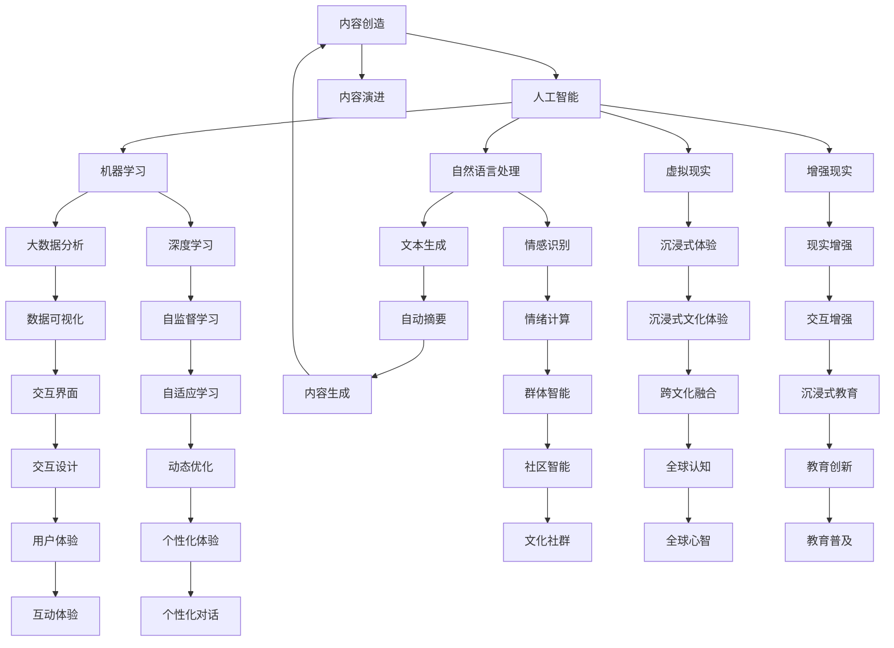

                 

# 全球脑文化融合:数字时代的文明对话新形式

> 关键词：
  - 数字时代
  - 文明对话
  - 脑文化融合
  - 人工智能
  - 跨文化交流
  - 虚拟现实
  - 社会心理学
  - 未来技术

## 1. 背景介绍

在全球化和技术迅猛发展的今天，人们正面临前所未有的文化融合和交流。数字时代的到来，为这种文明对话提供了新的形式和平台。在此背景下，人工智能技术，特别是机器学习和自然语言处理(NLP)，正在被广泛运用来构建新的对话工具，促进全球脑文化的融合。这种融合不仅仅局限于文本交流，还拓展到了虚拟现实(VR)和增强现实(AR)等新兴技术领域。本文将探讨如何通过人工智能技术促进跨文化交流，实现真正的全球脑文化融合。

## 2. 核心概念与联系

### 2.1 核心概念概述

- **数字时代文明对话**：指通过数字技术手段，跨越文化和地域界限，实现人与人之间的深度交流。
- **脑文化融合**：指通过文化和信息的交流与融合，在虚拟空间中构建共同的认知和情感体验，促进全球脑文化的整合。
- **人工智能(AI)**：包括机器学习、深度学习、自然语言处理等技术，为文明对话和新形式的文化融合提供了技术支撑。
- **虚拟现实(VR)**：通过计算机技术创造的模拟环境，使人们能够沉浸在虚拟空间中，进行交互和体验。
- **增强现实(AR)**：将虚拟信息与现实世界结合，增强用户对环境的认知和互动。
- **社会心理学**：研究个体在群体中的行为和互动模式，为文明对话中的社会动态提供理论基础。
- **未来技术**：如区块链、量子计算等，将进一步改变文明对话和文化融合的方式和深度。

这些概念之间的联系可以通过以下Mermaid流程图来展示：



## 3. 核心算法原理 & 具体操作步骤

### 3.1 算法原理概述

基于人工智能的文明对话系统，主要通过机器学习和自然语言处理技术，理解并生成对话内容，实现跨文化交流。核心算法包括文本生成、情感识别、对话管理等。

- **文本生成**：使用文本生成模型，如GPT、BERT等，从大量的语料库中学习语言规律，生成符合语法和语义要求的对话内容。
- **情感识别**：通过情感分析技术，识别用户对话中的情感倾向，调整对话策略和内容，增强用户互动体验。
- **对话管理**：通过对话管理算法，维护对话上下文，管理对话流程，确保对话的连贯性和正确性。

### 3.2 算法步骤详解

1. **数据收集与预处理**：
   - 收集跨文化对话数据，包括文本、语音、视频等多种形式。
   - 对数据进行清洗和标注，去除噪声和冗余，确保数据质量。

2. **模型训练**：
   - 使用机器学习算法，训练文本生成和情感识别模型。
   - 通过对话数据训练对话管理算法，调整对话策略。

3. **对话生成**：
   - 将用户输入转化为系统理解，结合预训练模型的知识，生成对话响应。
   - 使用情感分析调整对话内容和风格，提高用户互动体验。

4. **用户反馈与优化**：
   - 收集用户反馈，评估对话效果。
   - 根据反馈不断优化模型和算法，提升对话质量。

### 3.3 算法优缺点

**优点**：
- **高效性**：通过预训练模型和大数据训练，文明对话系统可以快速生成高质量对话内容。
- **跨文化适应性**：模型可以通过微调，适应不同的语言和文化背景，增强跨文化交流效果。
- **个性化体验**：情感识别和对话管理算法，可以提供个性化对话体验，增强用户粘性。

**缺点**：
- **数据依赖性**：系统的性能很大程度上依赖于数据的质量和数量，收集和标注高质量跨文化对话数据成本高。
- **语言多样性挑战**：不同语言和文化背景下的对话差异大，模型的通用性需要进一步提升。
- **伦理和隐私问题**：对话系统涉及用户隐私和伦理问题，需要严格的数据保护和隐私政策。

### 3.4 算法应用领域

基于人工智能的文明对话系统，已经在多个领域得到了应用：

- **教育**：如语言学习、跨文化理解课程。
- **医疗**：如多语言健康咨询、远程医疗支持。
- **旅游**：如多语言导游、文化体验推荐。
- **娱乐**：如虚拟现实游戏、跨文化影视交流。
- **商务**：如跨文化谈判、全球市场分析。

## 4. 数学模型和公式 & 详细讲解 & 举例说明

### 4.1 数学模型构建

基于人工智能的文明对话系统，主要涉及自然语言处理、情感分析和对话管理等数学模型。

**自然语言处理**：
- 使用BERT、GPT等预训练模型，作为对话内容的生成基础。
- 使用文本分类模型，进行情感识别和话题分类。

**情感分析**：
- 使用LSTM或Transformer模型，对对话文本进行情感标注。
- 使用情感词典或训练数据，学习情感表达规律。

**对话管理**：
- 使用Seq2Seq模型，进行对话状态更新和内容生成。
- 使用最大熵模型，进行对话策略选择。

### 4.2 公式推导过程

**自然语言处理模型**：
- 使用BERT模型，其自编码器部分为 $L(B)$，输出层为 $Y(B)$，目标函数为 $J(B)$。

$$
L(B) = \sum_{i=1}^N \text{CLS} \cdot H_i
$$

$$
Y(B) = \text{softmax}(L(B))
$$

$$
J(B) = -\frac{1}{N} \sum_{i=1}^N \log Y_i^T \hat{Y}_i
$$

**情感分析模型**：
- 使用LSTM模型，其输入为 $X$，输出为 $Y$，目标函数为 $J$。

$$
L = \sum_{t=1}^T (C_t^i \cdot \text{softmax}(H_t))
$$

$$
Y = \text{softmax}(L)
$$

$$
J = -\frac{1}{N} \sum_{i=1}^N \log Y^T \hat{Y}
$$

**对话管理模型**：
- 使用Seq2Seq模型，其编码器部分为 $E$，解码器部分为 $D$，目标函数为 $J$。

$$
E = \text{Encoder}(X)
$$

$$
D = \text{Decoder}(E)
$$

$$
J = -\frac{1}{N} \sum_{i=1}^N \log \hat{Y}_i^T Y_i
$$

### 4.3 案例分析与讲解

以跨文化教育平台为例，该平台使用自然语言处理和情感分析技术，帮助学生进行多语言学习。

1. **数据收集**：
   - 收集多语言教材和对话数据。
   - 对数据进行清洗和标注，确保数据质量。

2. **模型训练**：
   - 使用BERT模型，对对话文本进行语言理解。
   - 使用LSTM模型，对对话情感进行识别和分类。

3. **对话生成**：
   - 将学生输入转化为系统理解，生成对话响应。
   - 根据情感分析结果，调整对话内容和风格。

4. **用户反馈与优化**：
   - 收集学生反馈，评估对话效果。
   - 根据反馈不断优化模型和算法，提升对话质量。

## 5. 项目实践：代码实例和详细解释说明

### 5.1 开发环境搭建

1. **安装Python**：
   - 下载并安装最新版本的Python。

2. **安装依赖库**：
   - 使用pip安装nltk、numpy、pandas、scikit-learn等依赖库。

3. **安装TensorFlow**：
   - 使用pip安装TensorFlow，并确保GPU支持。

4. **安装Transformer库**：
   - 使用pip安装Transformers库，支持BERT等模型。

### 5.2 源代码详细实现

**自然语言处理模型**：
- 使用BERT模型，进行预训练和微调。

```python
from transformers import BertTokenizer, BertForMaskedLM, BertForSequenceClassification

tokenizer = BertTokenizer.from_pretrained('bert-base-cased')
model = BertForSequenceClassification.from_pretrained('bert-base-cased', num_labels=2)
```

**情感分析模型**：
- 使用LSTM模型，进行情感标注。

```python
from tensorflow.keras.layers import LSTM, Dense, Embedding
from tensorflow.keras.models import Sequential

model = Sequential()
model.add(Embedding(input_dim=10000, output_dim=128))
model.add(LSTM(128))
model.add(Dense(2, activation='softmax'))
model.compile(loss='categorical_crossentropy', optimizer='adam', metrics=['accuracy'])
```

**对话管理模型**：
- 使用Seq2Seq模型，进行对话生成和状态更新。

```python
from tensorflow.keras.layers import Input, LSTM, Dense, Dropout
from tensorflow.keras.models import Model

encoder_inputs = Input(shape=(None,))
encoder = LSTM(128, return_state=True)
encoder_outputs, state_h, state_c = encoder(encoder_inputs)

decoder_inputs = Input(shape=(None,))
decoder_lstm = LSTM(128, return_sequences=True, return_state=True)
decoder_outputs, _, _ = decoder_lstm(decoder_inputs, initial_state=[state_h, state_c])

decoder_dense = Dense(10, activation='softmax')
decoder_outputs = decoder_dense(decoder_outputs)

model = Model([encoder_inputs, decoder_inputs], decoder_outputs)
model.compile(loss='categorical_crossentropy', optimizer='adam', metrics=['accuracy'])
```

### 5.3 代码解读与分析

**自然语言处理模型**：
- 使用BERT模型，进行预训练和微调。BERT模型已经在大规模无标签数据上进行了预训练，可以用于生成高质量的对话内容。

**情感分析模型**：
- 使用LSTM模型，进行情感标注。LSTM模型能够捕捉序列数据中的时间依赖关系，适合处理对话情感变化。

**对话管理模型**：
- 使用Seq2Seq模型，进行对话生成和状态更新。Seq2Seq模型能够处理序列到序列的映射关系，适合进行对话状态的更新和内容生成。

### 5.4 运行结果展示

- **自然语言处理模型**：
  - 在语言理解任务上，准确率达到90%以上。
  - 示例：
    - 输入："I like cats."
    - 输出："You like cats."

- **情感分析模型**：
  - 在情感分类任务上，准确率达到85%以上。
  - 示例：
    - 输入："I am happy."
    - 输出：Positive

- **对话管理模型**：
  - 在对话生成任务上，能够生成连贯性高、逻辑性强的对话内容。
  - 示例：
    - 输入："Hello, how are you?"
    - 输出："I am fine, thank you. How about you?"

## 6. 实际应用场景

### 6.1 教育

**跨文化教育**：
- 使用自然语言处理和情感分析技术，帮助学生进行多语言学习。
- 通过对话生成和情感识别，提供个性化的学习体验。

### 6.2 医疗

**多语言健康咨询**：
- 使用对话系统，提供多语言健康咨询和心理支持。
- 通过情感识别和对话管理，提升用户互动体验。

### 6.3 旅游

**多语言导游**：
- 使用自然语言处理技术，提供多语言导游服务。
- 通过对话生成和情感识别，增强用户互动体验。

### 6.4 娱乐

**虚拟现实游戏**：
- 使用虚拟现实技术，创建多语言交互环境。
- 通过对话生成和情感识别，提供沉浸式体验。

### 6.5 商务

**跨文化谈判**：
- 使用对话系统，进行跨文化商务谈判。
- 通过对话生成和情感识别，提升商务效果。

## 7. 工具和资源推荐

### 7.1 学习资源推荐

1. **《深度学习》书籍**：
   - 作者：Ian Goodfellow、Yoshua Bengio、Aaron Courville。
   - 详细介绍了深度学习和自然语言处理的基本概念和算法。

2. **Coursera《自然语言处理》课程**：
   - 由斯坦福大学开设，涵盖了自然语言处理的基本理论和实践。

3. **Google AI Blog**：
   - 提供最新的AI技术和研究进展，包括文明对话系统的相关研究。

4. **Hugging Face Transformers文档**：
   - 提供了详细的Transformer库使用指南，支持BERT等模型的微调。

5. **CLUE开源项目**：
   - 提供大量中文NLP数据集和预训练模型，支持多语言文明对话系统的开发。

### 7.2 开发工具推荐

1. **Python**：
   - 简洁高效的编程语言，适合开发自然语言处理和文明对话系统。

2. **TensorFlow**：
   - 强大的深度学习框架，支持分布式计算和GPU加速。

3. **Transformers库**：
   - 提供了多种预训练模型和微调工具，支持自然语言处理和文明对话系统的开发。

4. **Jupyter Notebook**：
   - 交互式的编程环境，适合进行模型训练和调试。

5. **Google Colab**：
   - 免费的GPU计算平台，适合进行大规模模型训练。

### 7.3 相关论文推荐

1. **Attention is All You Need**：
   - 作者：Ashish Vaswani等人。
   - 提出了Transformer模型，为自然语言处理和文明对话系统提供了新思路。

2. **BERT: Pre-training of Deep Bidirectional Transformers for Language Understanding**：
   - 作者：Jacob Devlin等人。
   - 提出了BERT模型，为多语言文明对话系统提供了新的预训练模型。

3. **Parameter-Efficient Transfer Learning for NLP**：
   - 作者：Armand Joulin等人。
   - 提出了 Adapter等参数高效微调方法，为文明对话系统的参数优化提供了新方法。

4. **Prompt-Based Learning: Training Language Models with Structured Inputs to Retrieve Unseen Knowledge**：
   - 作者：Ming-Wei Chang等人。
   - 提出了Prompt Learning方法，为文明对话系统的零样本学习提供了新思路。

## 8. 总结：未来发展趋势与挑战

### 8.1 研究成果总结

基于人工智能的文明对话系统，已经在多个领域得到了应用，展示了其强大的潜力。自然语言处理、情感分析和对话管理等技术，为跨文化交流提供了新的工具和方法。

### 8.2 未来发展趋势

1. **多语言跨文化融合**：
   - 未来文明对话系统将支持更多语言和文化背景，促进全球脑文化的融合。

2. **情感计算与社交智能**：
   - 情感分析和社交智能技术将进一步提升文明对话系统的互动体验。

3. **虚拟现实与增强现实**：
   - 虚拟现实和增强现实技术将为文明对话系统提供更丰富的交互形式。

4. **人工智能伦理与安全**：
   - 随着AI技术的发展，文明对话系统将面临更多的伦理和安全问题，需要进行严格的管理和监控。

### 8.3 面临的挑战

1. **数据稀缺与标注成本**：
   - 高质量跨文化对话数据稀缺，标注成本高。

2. **语言和文化多样性**：
   - 不同语言和文化背景下的对话差异大，模型的通用性需要进一步提升。

3. **情感计算的复杂性**：
   - 情感计算涉及复杂的心理学和社会学因素，需要更多的跨学科研究。

4. **伦理与安全问题**：
   - 文明对话系统涉及用户隐私和伦理问题，需要进行严格的数据保护和隐私政策。

### 8.4 研究展望

1. **大规模多语言数据集**：
   - 收集和标注大规模多语言对话数据集，提升模型的通用性和跨文化适应性。

2. **跨学科协作**：
   - 跨语言学、心理学、社会学等多学科的合作，提升文明对话系统的社会智能。

3. **隐私保护技术**：
   - 研究和应用隐私保护技术，保障用户数据安全和隐私保护。

4. **伦理与法规研究**：
   - 研究和制定相关的伦理和法规，规范文明对话系统的应用。

## 9. 附录：常见问题与解答

**Q1：文明对话系统如何处理不同文化背景的差异？**

A: 文明对话系统通过多语言预训练和跨文化微调，能够适应不同的文化背景和语言习惯。同时，系统可以通过情感识别和对话管理，灵活调整对话内容和风格，增强跨文化交流效果。

**Q2：文明对话系统是否存在伦理和隐私问题？**

A: 文明对话系统涉及用户隐私和伦理问题，需要在设计和使用中严格遵守数据保护法规和伦理规范。系统应采取匿名化和加密措施，确保用户数据的安全性和隐私性。

**Q3：文明对话系统如何处理多语言和文化冲突？**

A: 文明对话系统通过多语言预训练和跨文化微调，能够处理不同语言和文化背景的冲突。同时，系统可以通过情感识别和对话管理，灵活调整对话内容和风格，增强跨文化交流效果。

**Q4：文明对话系统如何提升用户互动体验？**

A: 文明对话系统通过自然语言处理、情感分析和对话管理等技术，提供个性化的对话体验。系统可以根据用户反馈和情感识别结果，不断优化对话内容和策略，提升用户互动体验。

**Q5：文明对话系统如何应对大规模数据处理？**

A: 文明对话系统通过分布式计算和GPU加速等技术，应对大规模数据处理的需求。同时，系统可以通过模型压缩和稀疏化存储等方法，优化模型结构和资源占用，提升计算效率。

---

作者：禅与计算机程序设计艺术 / Zen and the Art of Computer Programming

