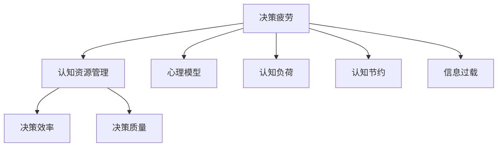

                 

# 决策fatigue：认知资源的管理

> 关键词：决策疲劳, 认知资源管理, 心理模型, 认知负荷, 认知节约

## 1. 背景介绍

### 1.1 问题由来

决策疲劳（Decision Fatigue）是指在连续决策过程中，个体认知资源逐渐耗竭，导致决策准确性下降、错误率增加的一种现象。在各种领域中，从商业管理、政策制定到医疗健康、人机交互，决策疲劳都普遍存在。

### 1.2 问题核心关键点

决策疲劳的核心在于，随着决策次数的增加，个体认知资源的供应变得不足，认知负荷累积，从而影响决策的质量和速度。决策疲劳的成因包括但不限于生理因素（如睡眠不足）、心理因素（如焦虑、压力）和认知因素（如信息过载）。

### 1.3 问题研究意义

理解并应对决策疲劳，对提升个体和组织的决策效率、减少错误决策具有重要意义。通过认知资源管理，可以有效减少决策疲劳，提高决策的准确性和速度，从而提升工作效率和生活质量。

## 2. 核心概念与联系

### 2.1 核心概念概述

- **决策疲劳（Decision Fatigue）**：指个体在连续决策过程中，随着决策次数的增加，认知资源逐渐耗竭，决策准确性下降的现象。
- **认知资源管理（Cognitive Resource Management）**：指通过合理分配和管理认知资源，减少认知负荷，提升决策效率和质量。
- **心理模型（Psychological Model）**：个体在决策过程中使用的心理图式，用于指导决策行为。
- **认知负荷（Cognitive Load）**：个体在执行任务时所承受的认知负担。
- **认知节约（Cognitive Conservatism）**：为避免认知资源耗竭，个体在决策时倾向于保持一致性，避免改变原有的判断。
- **信息过载（Information Overload）**：当信息量超过个体处理能力时，个体认知负荷增加，决策效率下降。

这些核心概念之间的逻辑关系可以通过以下Mermaid流程图来展示：



这个流程图展示了大语言模型的核心概念及其之间的关系：

1. 决策疲劳导致认知资源消耗。
2. 认知资源管理通过调整认知负荷，提高决策效率和质量。
3. 心理模型影响决策过程，是决策的重要依据。
4. 认知节约机制保护决策者不受信息过载影响。
5. 信息过载增加认知负荷，导致决策疲劳。

## 3. 核心算法原理 & 具体操作步骤

### 3.1 算法原理概述

认知资源管理是一种通过优化个体认知过程，减少决策疲劳的技术。其核心思想是，通过识别并管理个体的认知资源，在决策过程中有效地分配和管理这些资源，以提高决策效率和质量。

具体而言，认知资源管理涉及以下几个关键步骤：

1. **认知资源评估**：评估个体当前可用认知资源的水平，包括注意力、记忆力和问题解决能力等。
2. **认知负荷优化**：通过调整任务复杂度、信息呈现方式等，优化认知负荷，减少认知资源消耗。
3. **决策支持系统**：利用算法和规则，辅助个体进行决策，减少认知资源的消耗。
4. **反馈与调整**：根据决策结果和反馈信息，调整决策策略和资源管理方案，提高决策效率和质量。

### 3.2 算法步骤详解

以下详细介绍认知资源管理的详细步骤：

**Step 1: 认知资源评估**

使用心理测评工具，如Rokeach价值观问卷、自我报告问卷等，评估个体当前的认知资源水平。重点关注个体的注意力、记忆力和问题解决能力等。

**Step 2: 认知负荷优化**

调整任务的复杂度和信息呈现方式，以优化认知负荷。例如：

- **简化任务**：将复杂任务拆解为多个简单任务，逐步完成。
- **视觉设计**：使用清晰的布局、对比色差、合理的字体大小等，降低视觉疲劳。
- **信息筛选**：使用摘要、关键字、信息过滤等技术，减少信息过载。
- **交互设计**：设计直观的用户界面，减少用户操作和思考负担。

**Step 3: 决策支持系统**

引入算法和规则，辅助个体进行决策。例如：

- **专家系统**：利用规则库和专家知识，提供决策建议。
- **决策树**：通过条件分支和决策节点，帮助个体制定决策方案。
- **贝叶斯网络**：利用概率推理，提供决策参考。
- **优化算法**：如遗传算法、粒子群算法等，优化决策方案。

**Step 4: 反馈与调整**

根据决策结果和反馈信息，调整决策策略和资源管理方案。例如：

- **结果评估**：利用决策树和反馈机制，评估决策结果。
- **学习机制**：通过反馈和调整，优化决策模型。
- **动态调整**：根据环境变化，动态调整认知资源管理策略。

### 3.3 算法优缺点

认知资源管理算法具有以下优点：

1. **提高决策效率**：通过优化认知负荷，减少决策疲劳，提高决策效率。
2. **提升决策质量**：通过算法和规则辅助，减少认知资源的消耗，提升决策质量。
3. **适应性强**：适用于各种决策场景，包括商业管理、政策制定、医疗健康等。

同时，该算法也存在一定的局限性：

1. **复杂度高**：算法设计和实现较为复杂，需要丰富的心理学和计算机科学知识。
2. **数据依赖**：决策支持系统的有效运行，依赖于高质量的数据和规则库。
3. **用户接受度**：个体对算法的接受度和使用习惯，影响算法效果。
4. **隐私风险**：算法可能涉及敏感数据，需要考虑隐私保护问题。

尽管存在这些局限性，但认知资源管理算法在决策过程中显示了显著的潜力，值得进一步研究和应用。

### 3.4 算法应用领域

认知资源管理算法在多个领域中具有广泛的应用前景，例如：

- **商业管理**：通过优化决策流程，减少管理者的决策疲劳，提高决策效率和质量。
- **政策制定**：利用决策支持系统，减少政策制定者的决策负担，提高政策质量。
- **医疗健康**：帮助医生减少诊断疲劳，提高诊断准确性和效率。
- **人机交互**：优化用户界面和交互设计，减少用户认知负荷，提升用户体验。

这些领域的应用展示了认知资源管理算法的强大潜力，未来还有更多可能的应用场景等待挖掘。

## 4. 数学模型和公式 & 详细讲解  
### 4.1 数学模型构建

本节将使用数学语言对认知资源管理的核心模型进行更加严格的刻画。

记认知资源为 $R$，初始资源为 $R_0$，每次决策消耗资源为 $C$。假设决策次数为 $n$，则资源消耗为 $nC$。如果 $R_0 - nC \geq R_{min}$，则个体能够继续进行决策；否则，个体将进入决策疲劳状态，决策质量下降。

### 4.2 公式推导过程

假设决策疲劳阈值为 $R_{min}$，每次决策消耗资源为 $C$，初始资源为 $R_0$，决策次数为 $n$，则决策疲劳的判断公式为：

$$
R_{fatigue} = R_0 - nC
$$

当 $R_{fatigue} \geq R_{min}$ 时，个体能够继续决策；当 $R_{fatigue} < R_{min}$ 时，个体进入疲劳状态。

### 4.3 案例分析与讲解

**案例分析**：一家大型企业需要制定年度预算计划。由于预算涉及的决策次数众多，决策者容易产生决策疲劳。通过认知资源管理，企业可以：

1. **资源评估**：评估决策者当前的认知资源水平，确定可用资源总量。
2. **负荷优化**：简化预算制定流程，减少决策者信息过载，优化信息呈现方式。
3. **决策支持**：引入预算制定规则库和专家系统，提供预算分配建议。
4. **反馈调整**：根据预算执行情况和反馈信息，调整预算制定策略，提高决策质量。

通过以上步骤，企业可以有效减少决策疲劳，提升预算制定效率和质量。

## 5. 项目实践：代码实例和详细解释说明
### 5.1 开发环境搭建

在进行认知资源管理实践前，我们需要准备好开发环境。以下是使用Python进行开发的简单流程：

1. 安装Python和必要的库，如numpy、pandas、scikit-learn等。
2. 搭建决策支持系统的框架，如Flask、Django等。
3. 引入认知资源管理的算法库，如scikit-learn、TensorFlow等。
4. 配置数据库和存储系统，用于保存决策结果和反馈信息。

### 5.2 源代码详细实现

这里我们以一个简单的决策支持系统为例，展示认知资源管理的代码实现。

首先，定义认知资源管理的类，包括资源评估、负荷优化、决策支持等功能模块：

```python
class CognitiveResourceManager:
    def __init__(self, resource_capacity):
        self.resource_capacity = resource_capacity
        self.resource_balance = resource_capacity
        self.decision_counter = 0
        self._rule_base = []
        
    def evaluate_resource(self):
        return self.resource_balance
    
    def optimize_load(self, data):
        # 简化任务、优化信息呈现、筛选信息等
        pass
    
    def provide_support(self, decision):
        # 提供决策建议、规则匹配、优化算法等
        pass
    
    def adjust_resource(self, feedback):
        # 根据反馈信息，调整资源管理策略
        pass
    
    def make_decision(self, data, feedback):
        if self.evaluate_resource() >= R_min:
            decision = self.provide_support(data)
            self.resource_balance -= C
            self.decision_counter += 1
            return decision
        else:
            raise DecisionFatigueError("Cognitive resource exhausted.")
```

接着，定义决策疲劳异常类：

```python
class DecisionFatigueError(Exception):
    pass
```

然后，实现具体的决策支持算法和规则库。例如，使用决策树或贝叶斯网络提供决策建议：

```python
class DecisionTree:
    def __init__(self):
        self.tree = {}
    
    def add_node(self, feature, threshold, left_outcome, right_outcome):
        self.tree[feature] = (threshold, left_outcome, right_outcome)
    
    def predict(self, data):
        # 根据决策树，预测决策结果
        pass

class NaiveBayes:
    def __init__(self):
        self.model = {}
    
    def train(self, data, outcomes):
        # 训练朴素贝叶斯模型
        pass
    
    def predict(self, data):
        # 根据朴素贝叶斯模型，预测决策结果
        pass
```

最后，实现认知资源管理的流程：

```python
def cognitive_resource_management():
    resource_manager = CognitiveResourceManager(R_min)
    while True:
        data = get_data()
        feedback = get_feedback()
        try:
            decision = resource_manager.make_decision(data, feedback)
            print(f"Decision: {decision}")
        except DecisionFatigueError as e:
            print(e)
```

### 5.3 代码解读与分析

让我们再详细解读一下关键代码的实现细节：

**CognitiveResourceManager类**：
- `__init__`方法：初始化认知资源管理器的资源容量、可用资源和决策计数器。
- `evaluate_resource`方法：评估当前可用资源。
- `optimize_load`方法：优化认知负荷，简化任务、优化信息呈现等。
- `provide_support`方法：提供决策支持，调用规则库和算法。
- `adjust_resource`方法：根据反馈信息，调整资源管理策略。
- `make_decision`方法：根据可用资源和决策建议，进行决策。

**DecisionTree类**：
- `__init__`方法：初始化决策树节点。
- `add_node`方法：添加决策树节点。
- `predict`方法：根据决策树，预测决策结果。

**NaiveBayes类**：
- `__init__`方法：初始化朴素贝叶斯模型。
- `train`方法：训练朴素贝叶斯模型。
- `predict`方法：根据朴素贝叶斯模型，预测决策结果。

**认知资源管理流程**：
- 循环读取数据和反馈，进行决策。
- 如果资源充足，调用`make_decision`方法进行决策。
- 如果资源不足，抛出决策疲劳异常，提示决策者休息或调整策略。

可以看到，认知资源管理通过将复杂的心理学原理转化为算法实现，简化了决策过程，提高了决策效率和质量。

## 6. 实际应用场景
### 6.1 医疗诊断系统

认知资源管理在医疗诊断系统中具有重要应用。医生在诊断过程中需要处理大量复杂信息，容易产生决策疲劳。通过认知资源管理，医疗系统可以：

1. **资源评估**：评估医生的认知资源水平，确定可用资源总量。
2. **负荷优化**：优化诊断流程，减少医生信息过载，优化信息呈现方式。
3. **决策支持**：引入诊断规则库和专家系统，提供诊断建议。
4. **反馈调整**：根据诊断结果和反馈信息，调整诊断策略，提高诊断质量。

通过以上步骤，医疗系统可以有效减少医生决策疲劳，提高诊断效率和质量。

### 6.2 智能客服系统

在智能客服系统中，认知资源管理可以帮助客服系统提升服务效率和客户满意度。客服系统可以通过认知资源管理，合理分配客服人员的认知资源，减少决策疲劳，提高服务质量。例如：

1. **资源评估**：评估客服人员的认知资源水平，确定可用资源总量。
2. **负荷优化**：优化服务流程，减少客服人员信息过载，优化信息呈现方式。
3. **决策支持**：引入知识库和规则库，提供问题解决建议。
4. **反馈调整**：根据服务结果和反馈信息，调整服务策略，提高服务质量。

通过以上步骤，智能客服系统可以有效减少客服人员决策疲劳，提升服务效率和客户满意度。

### 6.3 金融投资系统

在金融投资系统中，认知资源管理可以帮助投资者制定更合理的投资决策。投资者在做出投资决策时，容易受到情绪和信息过载的影响。通过认知资源管理，金融投资系统可以：

1. **资源评估**：评估投资者的认知资源水平，确定可用资源总量。
2. **负荷优化**：优化投资决策流程，减少投资者信息过载，优化信息呈现方式。
3. **决策支持**：引入投资规则库和专家系统，提供投资建议。
4. **反馈调整**：根据投资结果和反馈信息，调整投资策略，提高投资质量。

通过以上步骤，金融投资系统可以有效减少投资者决策疲劳，提升投资决策质量。

### 6.4 未来应用展望

随着认知资源管理算法的不断完善和普及，其在更多领域中具有广泛的应用前景。

在智慧城市治理中，认知资源管理可以应用于智能交通管理、环境监测、公共安全等环节，提高城市管理的自动化和智能化水平，构建更安全、高效的未来城市。

在智慧工业生产中，认知资源管理可以帮助工人减少决策疲劳，提高生产效率和质量。例如，通过优化生产流程，减少工人信息过载，提供生产指导建议。

在智慧教育领域，认知资源管理可以帮助教师减少备课疲劳，提高教学质量。例如，通过优化教学流程，减少教师信息过载，提供教学指导建议。

此外，在智慧农业、智慧旅游等更多领域，认知资源管理也有广阔的应用前景。未来，随着认知资源管理算法的进一步发展，其在更多场景中的应用将带来新的变革。

## 7. 工具和资源推荐
### 7.1 学习资源推荐

为了帮助开发者系统掌握认知资源管理的理论基础和实践技巧，这里推荐一些优质的学习资源：

1. 《认知心理学与认知资源管理》系列课程：由著名认知心理学家开设，深入浅出地介绍了认知资源管理的基本概念和前沿研究。
2. 《认知心理学》书籍：系统介绍了认知心理学的基本原理，包括决策疲劳、认知负荷等关键概念。
3. 《决策分析与认知资源管理》论文集：汇集了多篇关于决策分析与认知资源管理的研究论文，提供丰富的学术资源。
4. 《人工智能与认知负荷》书籍：详细探讨了认知负荷在人工智能中的应用，提供了实用的认知负荷管理策略。
5. 《认知资源管理算法》在线教程：提供全面的算法实现代码和详细解释，适合初学者和进阶开发者。

通过对这些资源的学习实践，相信你一定能够快速掌握认知资源管理的精髓，并用于解决实际的认知负荷问题。

### 7.2 开发工具推荐

高效的开发离不开优秀的工具支持。以下是几款用于认知资源管理开发的常用工具：

1. Python：功能强大的编程语言，丰富的库和框架，适合各种认知资源管理算法实现。
2. R语言：统计分析领域的主流语言，适合数据分析和建模。
3. Excel：简单易用的电子表格工具，适合进行数据可视化和简单统计分析。
4. Jupyter Notebook：交互式编程环境，支持多种语言和库，适合数据科学和机器学习任务。
5. Weights & Biases：模型训练的实验跟踪工具，可以记录和可视化模型训练过程中的各项指标，方便对比和调优。

合理利用这些工具，可以显著提升认知资源管理任务的开发效率，加快创新迭代的步伐。

### 7.3 相关论文推荐

认知资源管理的研究源于学界的持续研究。以下是几篇奠基性的相关论文，推荐阅读：

1. **《Cognitive Load in Learning: The Role of Problem-Solving》**：探讨了认知负荷在学习和问题解决中的作用，提供了减少认知负荷的策略。
2. **《Cognitive Resource Management in Decision Making》**：系统介绍了认知资源管理的理论基础和应用方法，提供了详细的决策支持算法。
3. **《Decision Fatigue and Cognitive Resource Management》**：研究了决策疲劳和认知资源管理的关联，提供了认知资源管理的实证研究和案例分析。
4. **《The Impact of Cognitive Load on Decision Making》**：探讨了认知负荷对决策的影响，提供了减少认知负荷的策略和方法。
5. **《Cognitive Resource Allocation in Complex Systems》**：研究了复杂系统中的认知资源分配问题，提供了系统化的认知资源管理方案。

这些论文代表了大语言模型微调技术的发展脉络。通过学习这些前沿成果，可以帮助研究者把握学科前进方向，激发更多的创新灵感。

## 8. 总结：未来发展趋势与挑战

### 8.1 总结

本文对认知资源管理进行了全面系统的介绍。首先阐述了认知资源管理的背景和意义，明确了认知资源管理在提升决策效率、减少决策疲劳方面的独特价值。其次，从原理到实践，详细讲解了认知资源管理的数学模型和核心算法，给出了认知资源管理任务开发的完整代码实例。同时，本文还广泛探讨了认知资源管理在医疗、金融、智能客服等多个行业领域的应用前景，展示了认知资源管理算法的强大潜力。最后，本文精选了认知资源管理的各类学习资源，力求为读者提供全方位的技术指引。

通过本文的系统梳理，可以看到，认知资源管理通过优化认知过程，有效减少了决策疲劳，提升了决策效率和质量。未来，伴随认知资源管理算法的不断演进，其在更多领域中的应用将带来新的变革。

### 8.2 未来发展趋势

展望未来，认知资源管理算法将呈现以下几个发展趋势：

1. **智能化**：结合人工智能技术，提供更智能、更个性化的认知资源管理方案。例如，引入机器学习算法，动态调整认知负荷，优化决策策略。
2. **普适化**：开发更加通用、易用的认知资源管理工具，适用于各种行业和场景。例如，开发跨平台、跨设备的认知资源管理应用。
3. **实时化**：实现实时动态的认知资源管理，及时调整认知负荷，应对环境变化。例如，通过传感器和数据监控，实时采集个体的认知负荷信息。
4. **情感化**：结合情感计算技术，提供情感感知和调节的认知资源管理方案。例如，通过情感分析，调整决策策略，减少情感对决策的影响。
5. **社交化**：引入社交网络分析技术，提供基于社交关系的认知资源管理方案。例如，通过社交网络分析，优化团队决策流程，提高团队决策效率。

以上趋势凸显了认知资源管理算法的广阔前景。这些方向的探索发展，必将进一步提升决策系统的智能化和自动化水平，为人类决策行为带来新的突破。

### 8.3 面临的挑战

尽管认知资源管理算法已经取得了一定的进展，但在迈向更加智能化、普适化应用的过程中，仍面临诸多挑战：

1. **算法复杂度**：认知资源管理算法的实现较为复杂，需要整合心理学、计算机科学等多个领域的知识。
2. **数据依赖**：算法效果依赖于高质量的数据和规则库，需要投入大量时间和资源进行数据采集和规则设计。
3. **用户接受度**：个体对算法的接受度和使用习惯，影响算法效果。需要设计易用、直观的用户界面，提高用户接受度。
4. **隐私风险**：算法可能涉及敏感数据，需要考虑隐私保护问题。
5. **伦理问题**：认知资源管理算法的应用，需要考虑伦理问题，避免算法偏见和歧视。

尽管存在这些挑战，但认知资源管理算法的潜力不可忽视。未来，通过多学科合作和跨领域研究，有望克服这些挑战，实现认知资源管理技术的全面应用。

### 8.4 研究展望

未来的研究需要在以下几个方面寻求新的突破：

1. **多模态认知资源管理**：结合视觉、听觉、触觉等多模态数据，提供更全面、更精准的认知资源管理方案。例如，结合情感识别技术，优化决策支持系统。
2. **自适应认知资源管理**：通过机器学习算法，实现动态调整认知资源管理策略。例如，通过自适应算法，实时优化决策流程。
3. **跨领域认知资源管理**：开发跨行业、跨领域的认知资源管理工具，支持更多场景的应用。例如，开发医疗、金融、工业等多个领域的认知资源管理应用。
4. **情感认知资源管理**：结合情感计算技术，提供基于情感的认知资源管理方案。例如，通过情感分析，优化决策策略，减少情感对决策的影响。
5. **伦理认知资源管理**：研究认知资源管理算法的伦理问题，提供公平、公正的决策支持系统。例如，引入伦理约束，避免算法偏见和歧视。

这些研究方向的探索，必将引领认知资源管理技术迈向更高的台阶，为人类决策行为带来新的变革。

## 9. 附录：常见问题与解答

**Q1：认知资源管理算法是否适用于所有决策场景？**

A: 认知资源管理算法在大部分决策场景中都能取得较好的效果，尤其是对于信息过载、任务复杂度高的场景。但对于一些简单、直接的决策任务，算法可能显得过于复杂。因此，需要根据具体任务进行灵活选择。

**Q2：如何选择合适的资源管理策略？**

A: 选择合适的资源管理策略，需要综合考虑以下几个因素：
1. **任务复杂度**：任务越复杂，资源管理越重要。
2. **数据质量**：高质量的数据和规则库是认知资源管理的基础。
3. **用户接受度**：用户对算法的接受度和使用习惯，影响算法效果。
4. **资源限制**：算法实现需要考虑资源限制，如计算资源、存储资源等。
5. **效果评估**：通过实证研究，评估不同策略的效果，选择最合适的策略。

**Q3：认知资源管理算法的应用有哪些？**

A: 认知资源管理算法在以下领域具有广泛的应用前景：
1. **医疗诊断**：帮助医生减少决策疲劳，提高诊断质量。
2. **智能客服**：提升客服人员的服务效率和客户满意度。
3. **金融投资**：帮助投资者制定更合理的投资决策。
4. **智能制造**：提高生产效率和质量，减少工人决策疲劳。
5. **教育培训**：提高教师的教学效率和质量，减少备课疲劳。
6. **城市管理**：提高城市管理的自动化和智能化水平，构建更安全、高效的未来城市。

**Q4：如何处理认知资源管理算法的复杂度问题？**

A: 处理认知资源管理算法的复杂度问题，可以从以下几个方面入手：
1. **简化算法**：简化算法的实现，减少算法复杂度。例如，引入简化版的决策树、朴素贝叶斯等。
2. **优化数据**：优化数据采集和处理方式，减少数据过载。例如，采用数据压缩、信息过滤等技术。
3. **并行计算**：利用并行计算技术，提高算法的计算效率。例如，使用GPU、TPU等加速计算。
4. **模型集成**：结合多种算法，提供更全面、更精准的认知资源管理方案。例如，结合决策树、贝叶斯网络等。
5. **用户参与**：引入用户反馈机制，优化算法策略。例如，通过用户反馈，调整认知资源管理方案。

**Q5：如何保证认知资源管理算法的公平性？**

A: 保证认知资源管理算法的公平性，可以从以下几个方面入手：
1. **数据平衡**：确保训练数据集的多样性和代表性，避免算法偏见。例如，采用多样化的数据来源。
2. **算法设计**：在设计算法时，引入公平性约束和惩罚机制。例如，引入公平性损失函数。
3. **模型监督**：对模型进行监督，及时发现和修正算法偏见。例如，引入人工审核机制。
4. **透明性**：提高算法的透明性和可解释性，让用户了解算法的工作机制。例如，通过解释模型决策过程，提高用户信任度。
5. **伦理审查**：引入伦理审查机制，评估算法的伦理影响。例如，通过伦理委员会审查算法应用。

这些措施可以确保认知资源管理算法的公平性和公正性，提升算法在实际应用中的可靠性和可信度。

---

作者：禅与计算机程序设计艺术 / Zen and the Art of Computer Programming

