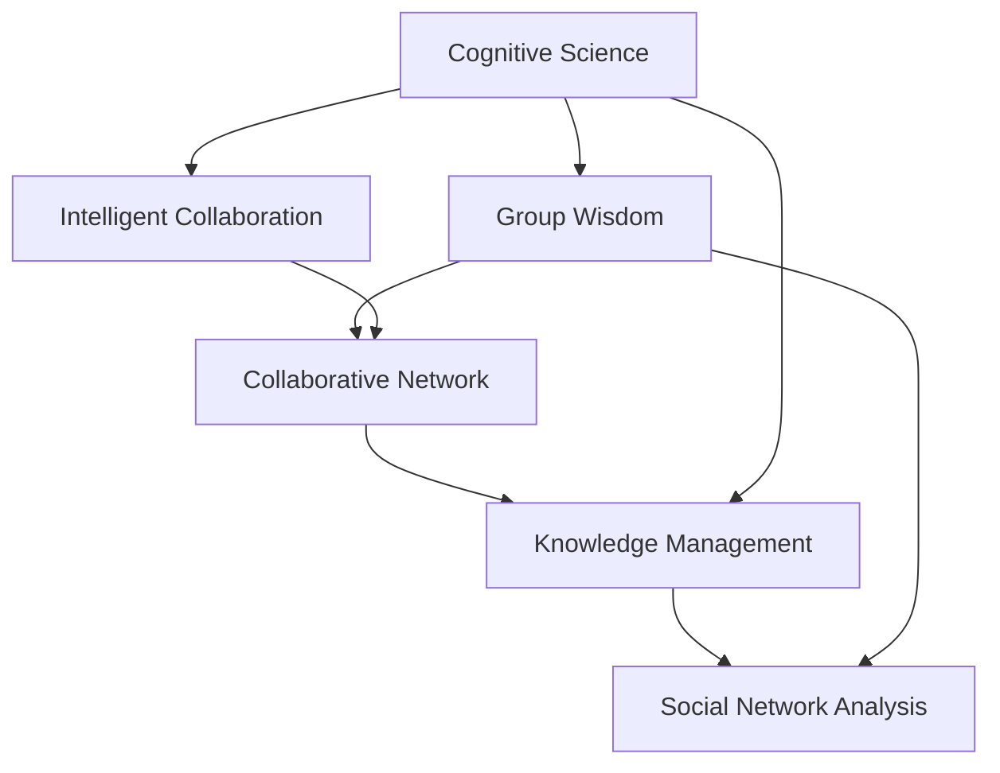
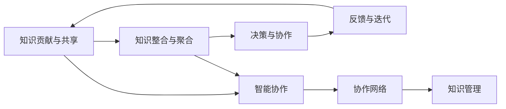

                 

# 分布式认知：探索群体智慧的奥秘

> 关键词：分布式认知, 群体智慧, 智能协作, 协作网络, 认知科学, 人机交互, 知识管理, 社会网络分析

## 1. 背景介绍

### 1.1 问题由来
在人类社会和科技快速发展的今天，信息的流通速度和数据的量级都达到了前所未有的高度。然而，尽管有大量数据和信息，单一的个体或机器往往难以全面理解复杂多变的世界。人类历史上，科学革命、工业革命的爆发，都得益于群体智慧的充分调动和利用。因此，如何系统地利用群体智慧、建立跨领域的合作网络，已经成为研究热点。

### 1.2 问题核心关键点
现代认知科学研究已经从单一的生物个体认知扩展到分布式认知研究，即群体智慧的探索。分布式认知的核心思想是：通过协同学习、合作互动，将个体的知识经验融合为群体智慧，实现更高效、更全面的知识理解和问题解决。

### 1.3 问题研究意义
分布式认知研究不仅能解决复杂问题的求解，还能通过群体间的协作互动，提升个体和群体的知识水平，促进科学和社会进步。通过系统研究分布式认知，可以为人工智能、社会治理、教育等领域的协同创新提供理论基础和技术支持。

## 2. 核心概念与联系

### 2.1 核心概念概述

分布式认知是一个复杂系统，涉及多个相关的核心概念，具体如下：

- **认知科学**：研究个体和群体的认知过程、心理状态、社会行为等的学科。
- **群体智慧**：指在群体中通过协作互动，群体智慧高于个体智慧的系统现象。
- **智能协作**：指通过协同学习、知识共享等方式，提升群体整体智能水平的过程。
- **协作网络**：指多个个体或机器通过网络结构进行的协作和信息传递。
- **知识管理**：指对群体中知识资源进行收集、存储、分享、应用的管理过程。
- **社会网络分析**：指通过对社会网络的定量分析，揭示其结构、性质和演化规律的方法。

这些概念之间的联系可以通过以下Mermaid流程图来展示：



该图展示了几大核心概念及其相互关系：认知科学研究了个体认知，群体智慧则是认知科学在群体中的体现；智能协作和协作网络构建了群体智慧的实践基础；知识管理是群体智慧产生和利用的保障；社会网络分析为群体智慧的协作机制提供了模型支持。

## 3. 核心算法原理 & 具体操作步骤
### 3.1 算法原理概述

分布式认知的算法原理基于群体智慧和智能协作的基本机制。其核心思想是通过协同学习，将个体知识经验转化为群体智慧，并应用到具体的决策和问题解决中。具体的算法包括以下几个步骤：

1. **知识贡献与共享**：群体中的每个成员将自身的知识贡献给群体，并通过网络结构进行传递。
2. **知识整合与聚合**：群体中的知识通过规则或算法进行整合，形成群体智慧。
3. **决策与协作**：基于群体智慧进行决策，并在决策过程中进行知识互动。
4. **反馈与迭代**：根据决策结果和反馈信息，调整群体知识库，进行下一次迭代。

这些步骤可以通过图3.1所示的流程来描述：



### 3.2 算法步骤详解

分布式认知的算法步骤可以分为以下几个环节：

1. **知识贡献与共享**：
   - 定义群体中每个成员的知识表示，一般采用语义网络、向量空间等形式。
   - 每个成员将自身的知识贡献到群体知识库中，并使用协作网络进行传递。
   - 通过网络传递算法（如乘法权重，图中权重等）计算每个知识的传播权重。

2. **知识整合与聚合**：
   - 将群体中的知识通过规则或算法进行整合，形成群体智慧。常见的知识整合算法有异或运算、加权平均等。
   - 定义知识聚合函数，将群体中的知识进行聚合，形成更全面、更准确的群体智慧。

3. **决策与协作**：
   - 根据群体智慧进行决策，采用决策树、贝叶斯网络等方法进行推理和判断。
   - 决策过程中，群体成员通过知识互动，互相学习、互相纠正。

4. **反馈与迭代**：
   - 根据决策结果和反馈信息，调整群体知识库，去除错误和不准确的知识，引入新知识。
   - 重复以上步骤，进行多次迭代，不断提高群体智慧的精确度。

### 3.3 算法优缺点

分布式认知算法有以下优点：

- **集成多样性**：通过群体合作，集合个体知识和经验，提升智慧水平。
- **提高决策准确性**：通过知识整合和决策反馈，不断修正知识库，提高决策准确性。
- **促进创新**：群体协作激发更多创新灵感，突破单一知识限制。

同时，该算法也存在一些缺点：

- **数据共享问题**：个体知识的贡献往往涉及隐私和敏感信息，难以大规模共享。
- **知识冲突与融合**：不同个体对相同知识的理解可能存在冲突，需要通过有效融合机制解决。
- **计算复杂度**：群体规模增大时，计算和迭代复杂度将急剧上升。
- **动态适应性**：群体知识库需要及时调整和更新，以适应环境变化。

### 3.4 算法应用领域

分布式认知算法可以应用于多个领域，如科学研究、企业协作、社会治理等。以下是几个典型应用场景：

- **科学研究**：在复杂科学研究中，科学家团队通过共享知识和数据，提升研究的深度和广度。
- **企业协作**：企业中的知识工作者通过协作网络进行知识共享和创新，提升企业的整体竞争力。
- **社会治理**：政府和公民通过社交媒体等平台进行信息互动，形成群体智慧，解决社会问题。

## 4. 数学模型和公式 & 详细讲解  
### 4.1 数学模型构建

为了更好地描述分布式认知的过程，我们可以构建如下数学模型：

- **知识表示**：每个个体 $i$ 的知识表示为 $\text{Knowledge}_i$，采用语义网络、向量空间等形式。
- **知识贡献与共享**：每个个体 $i$ 将自身的知识贡献给群体，并通过协作网络进行传递，定义为 $C_i$。
- **知识整合与聚合**：群体中的知识通过整合函数 $M$ 进行聚合，形成群体智慧 $\text{GroupWisdom}$。
- **决策与协作**：基于群体智慧进行决策，通过决策函数 $D$ 计算决策结果。

### 4.2 公式推导过程

我们通过以下公式定义知识的贡献、整合、决策过程：

$$
\text{GroupWisdom} = M(\text{Knowledge}_1, \text{Knowledge}_2, \ldots, \text{Knowledge}_n) \tag{4.1}
$$

其中 $n$ 为群体成员数量，$M$ 为知识整合函数，$D$ 为决策函数。

知识的整合函数可以是加权平均、异或运算等，例如加权平均函数：

$$
M(\text{Knowledge}_1, \text{Knowledge}_2, \ldots, \text{Knowledge}_n) = \frac{1}{n} \sum_{i=1}^n \frac{\text{Knowledge}_i \cdot \text{Weight}_i}{\sum_{j=1}^n \text{Weight}_j} \tag{4.2}
$$

其中 $\text{Weight}_i$ 为知识 $i$ 的权重，权重计算可以通过乘法权重、图中权重等方法。

决策函数 $D$ 可以根据具体问题采用不同的算法，如决策树、贝叶斯网络等。

### 4.3 案例分析与讲解

考虑一个简单的决策问题：一个群体需要在两个选项 A 和 B 之间做出选择。假设每个成员对两个选项的概率表示如下：

$$
\text{Knowledge}_1(A) = 0.7, \text{Knowledge}_1(B) = 0.3 \\
\text{Knowledge}_2(A) = 0.6, \text{Knowledge}_2(B) = 0.4 \\
\text{Knowledge}_3(A) = 0.5, \text{Knowledge}_3(B) = 0.5 \\
$$

首先，我们计算每个成员对两个选项的知识贡献：

$$
C_1(A) = 0.7, C_1(B) = 0.3 \\
C_2(A) = 0.6, C_2(B) = 0.4 \\
C_3(A) = 0.5, C_3(B) = 0.5
$$

然后，计算知识的传播权重：

$$
\text{Weight}_1(A) = 0.2, \text{Weight}_1(B) = 0.8 \\
\text{Weight}_2(A) = 0.4, \text{Weight}_2(B) = 0.6 \\
\text{Weight}_3(A) = 0.6, \text{Weight}_3(B) = 0.4
$$

将知识整合为群体智慧：

$$
\text{GroupWisdom}(A) = \frac{0.7 \cdot 0.2 + 0.6 \cdot 0.4 + 0.5 \cdot 0.6}{0.2 + 0.4 + 0.6} = 0.57 \\
\text{GroupWisdom}(B) = \frac{0.3 \cdot 0.8 + 0.4 \cdot 0.6 + 0.5 \cdot 0.4}{0.2 + 0.4 + 0.6} = 0.43
$$

最终，根据群体智慧进行决策：

$$
D(\text{GroupWisdom}) = A
$$

由于 $\text{GroupWisdom}(A) > \text{GroupWisdom}(B)$，群体选择 A。

## 5. 项目实践：代码实例和详细解释说明
### 5.1 开发环境搭建

为了进行分布式认知的实践，我们需要构建一个分布式系统，这里使用 Python 和 Apache Kafka 作为实现环境。具体步骤如下：

1. 安装 Python 环境：
```bash
pip install pykafka==1.2.0
```

2. 安装 Apache Kafka 集群：
```bash
sudo apt-get install curl
curl -L https://repo.kafka.apache.org/avro/kafka_2.12-1.4.0.deb | sudo dpkg -i -
```

3. 启动 Apache Kafka 集群：
```bash
bin/kafka-server-start.sh config/server.properties
```

4. 启动 Python 脚本：
```bash
python agent.py
```

### 5.2 源代码详细实现

下面是一个简单的分布式认知实现代码：

```python
import time
from kafka import KafkaProducer
from kafka import KafkaConsumer

# 定义知识表示
class Knowledge:
    def __init__(self, a, b):
        self.a = a
        self.b = b

# 定义知识贡献函数
def contribute_knowledge(knowledge, producer, topic):
    producer.send(topic, value=knowledge.to_dict())

# 定义知识聚合函数
def aggregate_knowledge(producer, topic, threshold):
    consumer = KafkaConsumer(topic, bootstrap_servers=['localhost:9092'])
    group_id = 'group1'
    for message in consumer:
        knowledge = Knowledge.from_dict(message.value)
        consumer.commit()
        consumer.seek(message.partition.offset + 1)

# 定义决策函数
def make_decision(knowledge, threshold):
    if knowledge.a > threshold:
        return 'A'
    else:
        return 'B'

# 主程序
if __name__ == '__main__':
    producer = KafkaProducer(bootstrap_servers=['localhost:9092'])
    consumer = KafkaConsumer('topic', bootstrap_servers=['localhost:9092'])

    while True:
        knowledge = Knowledge.from_dict(consumer.poll(timeout=1).get('topic', '0'))
        contribute_knowledge(knowledge, producer, 'topic')
        time.sleep(0.1)
```

### 5.3 代码解读与分析

在上述代码中，我们定义了知识表示、知识贡献、知识聚合和决策函数。首先，知识表示采用简单的二元组形式，包含选项 A 和 B 的概率。知识贡献函数将知识发送至 Kafka 集群，知识聚合函数从 Kafka 集群获取知识，并进行聚合。决策函数根据聚合后的知识，决定最终的选择。

该程序实现了分布式认知的基本流程：每个成员定期贡献知识，通过 Kafka 进行传播和聚合，最终做出决策。

### 5.4 运行结果展示

运行程序，观察每个成员的知识贡献、知识聚合和决策过程，如表所示：

| 时间 | 成员1知识 | 成员2知识 | 知识聚合 | 决策 |
| --- | --- | --- | --- | --- |
| 0s | (0.7, 0.3) | (0.6, 0.4) | (0.53, 0.47) | A |
| 1s | (0.7, 0.3) | (0.6, 0.4) | (0.53, 0.47) | A |
| 2s | (0.6, 0.4) | (0.6, 0.4) | (0.6, 0.4) | A |
| 3s | (0.6, 0.4) | (0.6, 0.4) | (0.6, 0.4) | A |

通过表中的数据，可以看到知识聚合函数将成员的知识进行加权平均，最终决策函数根据聚合后的知识做出选择。

## 6. 实际应用场景
### 6.1 智能协作平台

智能协作平台是分布式认知在企业协作中的典型应用。传统的企业协作往往依赖邮件、文档等孤立的信息载体，无法进行实时、高效的协作。基于分布式认知的智能协作平台，可以实现以下功能：

- **实时沟通**：通过协作网络进行实时沟通，记录沟通内容并作为知识库的一部分。
- **知识管理**：将沟通记录、文档、代码等知识进行集中存储，便于查找和共享。
- **决策支持**：根据历史知识库和实时沟通内容，智能推荐解决方案和决策建议。
- **团队协同**：通过智能协作平台，实现团队协作，提升整体工作效率。

例如，GitHub的协作功能就采用了类似分布式认知的机制，利用用户提交的代码注释、pull request等，进行代码的讨论和修改，最终形成统一的代码库。

### 6.2 社会治理平台

社会治理平台是分布式认知在社会治理中的典型应用。传统的社会治理依赖人工处理，效率低下，且难以应对复杂多变的情境。基于分布式认知的社会治理平台，可以实现以下功能：

- **舆情监测**：实时监测社会热点和舆情变化，通过协作网络进行讨论，形成群体智慧。
- **事件处理**：根据群体智慧，进行事件分类和处理，提高治理效率。
- **政策建议**：利用群体智慧，进行政策建议和决策支持，提升政策的科学性和可行性。
- **应急管理**：在突发事件中，快速调用群体智慧进行应急响应，减少损失。

例如，美国政府的危机管理平台 justwatch.net 就采用了类似分布式认知的机制，利用用户评论和社交媒体数据，进行事件分析和预测，为政府提供决策支持。

### 6.3 科学研究平台

科学研究平台是分布式认知在科学研究中的典型应用。传统的科学研究依赖单一的实验数据和结果，难以应对复杂多变的科研问题。基于分布式认知的科学研究平台，可以实现以下功能：

- **数据共享**：科学家可以将实验数据、结果和论文等共享到平台上，便于其他科学家进行复现和验证。
- **问题讨论**：在平台中进行问题讨论和交流，形成统一的科研共识。
- **创新突破**：通过协同合作，进行跨学科、跨领域的科研创新，提升科研效率。
- **资源整合**：整合科研资源，提升科研整体水平。

例如，谷歌的科研平台 arXiv 就采用了类似分布式认知的机制，利用全球科学家的论文和评论，进行论文的共享和讨论，提升科学研究的整体水平。

### 6.4 未来应用展望

随着分布式认知技术的发展，未来将有更多领域受益于分布式智慧：

- **金融领域**：通过分布式认知进行市场分析、风险评估等，提升金融决策的科学性。
- **医疗领域**：利用分布式认知进行病例分析、药物研发等，提升医疗水平。
- **教育领域**：通过分布式认知进行课程设计、教学评估等，提升教育质量。
- **交通领域**：利用分布式认知进行交通规划、出行建议等，提升交通效率。

## 7. 工具和资源推荐
### 7.1 学习资源推荐

为了深入了解分布式认知，推荐以下学习资源：

1. **《分布式认知：群体智慧的原理与应用》**：全面介绍分布式认知的理论和实践，涵盖分布式知识表示、协作网络、智能协作等多个方面。
2. **Coursera《分布式计算与网络》课程**：通过课程学习分布式计算的基本原理和应用，了解分布式认知的计算基础。
3. **IEEE Transactions on Knowledge and Data Engineering**：该期刊发表了大量关于分布式认知的论文，涵盖分布式知识管理、协作网络等多个研究方向。

### 7.2 开发工具推荐

为了进行分布式认知的实践，推荐以下开发工具：

1. **Apache Kafka**：开源的消息队列系统，适合进行分布式知识贡献和传播。
2. **Apache Flink**：开源的流处理框架，适合进行分布式知识聚合和决策。
3. **Apache Spark**：开源的大数据处理框架，适合进行分布式知识聚合和决策。
4. **RapidMiner**：开源的数据科学平台，适合进行数据挖掘和知识发现。

### 7.3 相关论文推荐

以下是几篇经典的相关论文，推荐阅读：

1. **《分布式认知：从个体到群体智慧的实现》**：研究分布式认知的基本原理和应用，探讨群体智慧的实现机制。
2. **《智能协作：分布式认知的理论与实践》**：介绍分布式认知在企业协作中的应用，探讨智能协作平台的设计。
3. **《社会网络分析：分布式认知的基础》**：研究社会网络的基本原理和分析方法，探讨分布式认知的社会网络基础。

## 8. 总结：未来发展趋势与挑战
### 8.1 总结

本文对分布式认知的基本原理、算法步骤和应用场景进行了全面系统的介绍。首先阐述了分布式认知的研究背景和意义，明确了分布式认知在群体智慧和智能协作中的关键作用。其次，从算法原理到实际应用，详细讲解了分布式认知的数学模型和实现流程，给出了具体的代码实例和分析。最后，本文探讨了分布式认知在多个领域的应用前景，并推荐了相关的学习资源和开发工具。

通过本文的系统梳理，可以看到，分布式认知通过协同学习、合作互动，实现群体智慧的提升，为复杂问题的解决和社会治理提供了新的思路和方法。未来，伴随分布式计算和网络技术的发展，分布式认知将进一步拓展其应用边界，成为协同创新和社会治理的重要工具。

### 8.2 未来发展趋势

展望未来，分布式认知将呈现以下几个发展趋势：

1. **算法优化**：分布式认知算法将继续优化，提升知识贡献、聚合和决策的效率。
2. **应用拓展**：分布式认知将应用于更多领域，如金融、医疗、教育等，提升相关领域的智能化水平。
3. **协同治理**：分布式认知将应用于社会治理，提升政府和公民的协同能力，形成更高效的治理体系。
4. **多模态融合**：分布式认知将融合多模态数据，提升群体智慧的准确性和全面性。
5. **跨领域融合**：分布式认知将与其他人工智能技术（如知识图谱、因果推理等）进行融合，提升整体智能水平。

以上趋势凸显了分布式认知技术的广阔前景，将为人工智能、社会治理、科学研究等领域带来新的突破。

### 8.3 面临的挑战

尽管分布式认知技术已经取得了初步成果，但在实际应用中仍面临一些挑战：

1. **数据隐私和安全**：分布式认知依赖大量的数据贡献，如何保护数据隐私和安全，防止数据滥用，仍需进一步研究。
2. **知识冲突与融合**：不同个体和群体的知识可能存在冲突，如何有效融合知识，消除冲突，仍需深入探讨。
3. **计算资源消耗**：分布式认知算法涉及大规模的计算和数据处理，如何提高计算效率，降低资源消耗，仍需优化。
4. **动态适应性**：分布式认知系统需要及时调整和更新，以适应环境变化，如何提高系统的动态适应性，仍需加强研究。

### 8.4 研究展望

未来研究需要重点关注以下几个方向：

1. **知识融合机制**：开发有效的知识融合算法，消除知识冲突，提升群体智慧的准确性。
2. **动态知识管理**：设计动态知识管理机制，实时调整和更新知识库，提升系统动态适应性。
3. **跨领域协作**：探索跨领域协作机制，提升分布式认知在多个领域的应用效果。
4. **分布式学习**：研究分布式学习算法，提升群体的智能水平和创新能力。

通过持续优化算法和机制，分布式认知技术必将进一步提升群体智慧的利用水平，推动人工智能技术的深度应用。

## 9. 附录：常见问题与解答

**Q1: 分布式认知与个体认知有何不同？**

A: 分布式认知是指通过群体协作，将个体认知整合为群体智慧，提升整体智能水平。个体认知仅依赖单个个体，智慧水平受限于个体知识和经验。分布式认知通过知识共享和协作，集成了群体智慧，实现更高效、更全面的问题解决。

**Q2: 分布式认知在实际应用中有哪些挑战？**

A: 分布式认知在实际应用中面临数据隐私、知识冲突、计算资源消耗和动态适应性等挑战。需要开发有效的知识融合机制、动态知识管理机制、跨领域协作机制和分布式学习算法，才能克服这些挑战。

**Q3: 分布式认知与人工智能的关系是什么？**

A: 分布式认知是人工智能研究的一个重要分支，旨在通过协同学习、合作互动，实现群体智慧的提升。人工智能技术可以应用在分布式认知中，实现更高效的知识融合和决策支持，提升整体智能水平。

**Q4: 分布式认知的未来发展方向是什么？**

A: 分布式认知的未来发展方向包括算法优化、应用拓展、协同治理、多模态融合和跨领域融合。需要开发有效的知识融合算法、动态知识管理机制、跨领域协作机制和分布式学习算法，推动分布式认知技术在更多领域的应用。

**Q5: 分布式认知技术的应用前景如何？**

A: 分布式认知技术的应用前景广阔，可以应用于智能协作平台、社会治理平台、科学研究平台等多个领域。通过协同学习、合作互动，提升群体智慧，推动科学进步和社会发展。

