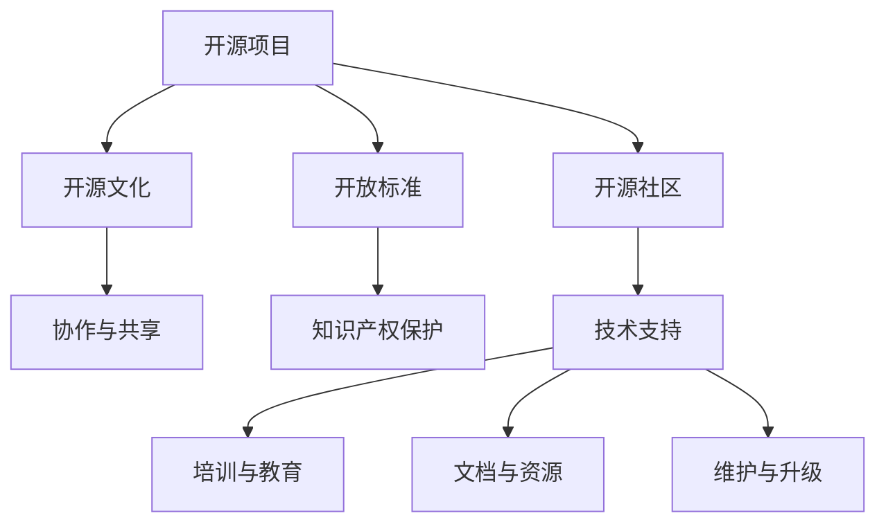

                 

# 创建开源项目的企业支持服务：模式与实施

在当今数字化转型的大潮中，开源项目已成为推动技术创新和应用落地的重要力量。然而，即便有了强大的社区驱动和开源文化，许多企业仍面临着将开源项目落地到生产环境中的挑战。为此，本文将深入探讨企业如何提供支持服务，推动开源项目的成熟和普及。我们将从背景介绍、核心概念与联系、核心算法原理、数学模型构建、项目实践、实际应用场景、工具和资源推荐、未来发展趋势与挑战以及常见问题与解答等多个方面进行详细分析。

## 1. 背景介绍

### 1.1 问题由来

随着开源运动在全球范围内的蓬勃发展，越来越多的企业和组织开始依托开源技术进行产品开发和业务拓展。然而，尽管开源项目在性能、灵活性和成本效益等方面具有明显优势，但将其成功引入生产环境仍然面临诸多挑战。企业需要投入大量资源来保证开源项目的稳定性、可扩展性和安全性，同时还需要考虑合规性、支持和维护等问题。因此，提供高质量的企业支持服务，已成为开源项目成功落地的关键。

### 1.2 问题核心关键点

企业支持服务是指企业在开源项目中提供的技术支持、培训、维护和文档等服务，以保障开源项目的可靠性和易用性。其核心关键点包括：

1. **技术支持**：提供专业的技术咨询服务，解决企业在使用开源项目中遇到的各种问题。
2. **培训与教育**：通过在线课程、工作坊等方式，帮助企业员工掌握开源项目的核心技术和应用方法。
3. **文档与资源**：提供详尽的文档、示例和代码库，方便企业快速上手和使用开源项目。
4. **维护与升级**：定期发布新版本，修复已知问题，确保开源项目的稳定性和安全性。

## 2. 核心概念与联系

### 2.1 核心概念概述

为更好地理解企业支持服务的构建和实施，本节将介绍几个密切相关的核心概念：

- **开源项目**：以开放源代码、自由使用、自由改进和自由分发为核心特征的软件项目。常见开源项目包括Linux、Apache Hadoop、Kubernetes等。
- **企业支持服务**：企业在开源项目中提供的技术支持、培训、文档等服务。其目标是确保开源项目能够顺利落地并发挥最大效用。
- **开源社区**：由开发者、用户和贡献者组成的开源项目社区，通过协作、共享和开放交流推动项目的持续发展和改进。
- **开源文化**：强调开放、协作、自由和共享的文化氛围，是开源项目成功的关键。
- **开放标准**：如Apache、MIT、GPL等，保护开源项目的知识产权，确保代码自由访问和分发。

这些核心概念之间的逻辑关系可以通过以下Mermaid流程图来展示：



这个流程图展示了几大核心概念及其之间的关系：

1. 开源项目通过开源社区的力量，得以持续发展和改进。
2. 开源文化与开放标准共同支撑开源项目的可持续发展。
3. 技术支持、培训、文档和维护服务，是企业支持服务的重要组成部分。

## 3. 核心算法原理 & 具体操作步骤

### 3.1 算法原理概述

企业支持服务的关键在于通过技术支持和社区协作，解决企业在使用开源项目时遇到的问题，并持续改进开源项目的质量和稳定性。其核心算法原理可以总结为以下几点：

1. **问题解决**：通过技术支持和社区协作，快速响应和解决企业在开源项目使用中的问题。
2. **知识传递**：通过培训和教育，帮助企业员工掌握开源项目的核心技术和应用方法。
3. **文档完善**：持续更新和完善开源项目的文档和示例库，提高开源项目的易用性。
4. **版本管理**：定期发布开源项目的新版本，修复已知问题，确保项目的稳定性和安全性。

### 3.2 算法步骤详解

企业支持服务的具体实施步骤包括：

**Step 1: 建立企业支持团队**
- 组建由技术专家和社区志愿者组成的企业支持团队。
- 明确团队职责和协作流程。

**Step 2: 技术支持服务**
- 通过邮件、论坛、电话等方式，提供7x24小时的技术支持。
- 快速响应企业的问题，解决关键性技术难题。

**Step 3: 培训与教育**
- 开发在线课程、工作坊等，提供面对面的技术培训。
- 制作视频教程、案例分析等，帮助企业员工掌握开源项目的使用和开发。

**Step 4: 文档与资源**
- 完善开源项目的官方文档，提供示例代码和最佳实践。
- 建立开源项目的社区资源库，提供社区贡献的资源和工具。

**Step 5: 维护与升级**
- 定期发布开源项目的新版本，修复已知问题。
- 持续进行代码审查和测试，确保新版本的稳定性和安全性。

### 3.3 算法优缺点

企业支持服务具有以下优点：

1. **提高开源项目的可靠性**：通过技术支持和版本管理，确保开源项目的稳定性和安全性。
2. **促进开源项目的普及**：通过培训和文档完善，降低企业使用开源项目的门槛，加速其应用。
3. **加强社区协作**：通过社区支持和知识传递，提高开源项目的贡献和改进速度。

同时，该方法也存在一定的局限性：

1. **成本较高**：企业需要投入大量资源建立和维护支持团队。
2. **依赖社区**：开源项目的发展依赖于社区的活跃度，社区不活跃时可能影响支持效果。
3. **技术复杂性**：开源项目的技术复杂性高，需要具备一定专业背景的技术人员。

尽管存在这些局限性，但就目前而言，企业支持服务仍然是开源项目成功落地的重要保障。未来相关研究的重点在于如何进一步降低成本、提高效率，同时兼顾可扩展性和安全性等因素。

### 3.4 算法应用领域

企业支持服务在开源项目的各个领域都有广泛的应用，例如：

- **云基础设施**：如OpenStack、Kubernetes等，提供技术支持、培训和文档，确保其在云环境中的稳定部署和运行。
- **大数据处理**：如Hadoop、Spark等，提供数据处理和分析方面的技术支持，帮助企业构建高效的大数据平台。
- **人工智能**：如TensorFlow、PyTorch等，提供模型训练、部署和优化方面的支持，推动AI技术在企业中的应用。
- **物联网**：如OpenFST、Modbus等，提供物联网设备管理和通信支持，帮助企业构建智能物联网系统。
- **软件开发**：如Apache Maven、Git等，提供开发工具和版本控制支持，提高软件开发效率和协作水平。

除了上述这些经典领域外，企业支持服务还在更多场景中得到应用，如区块链、网络安全、自然语言处理等，为开源技术的落地提供了强有力的支持。

## 4. 数学模型和公式 & 详细讲解 & 举例说明

### 4.1 数学模型构建

本节将使用数学语言对企业支持服务的构建过程进行更加严格的刻画。

记开源项目为 $P$，企业支持团队为 $T$，技术支持流程为 $F$，培训教育流程为 $E$，文档资源为 $D$，版本管理流程为 $V$。企业支持服务的目标是最大化 $P$ 的使用效果和稳定性。

定义 $P$ 在企业 $E$ 上的使用效果为 $E(P)$，表示企业 $E$ 在使用开源项目 $P$ 时的性能和体验。则企业支持服务的优化目标为：

$$
\max_{F, E, D, V} E(P)
$$

其中 $F$ 和 $E$ 分别表示技术支持和培训教育流程，$D$ 表示文档资源，$V$ 表示版本管理流程。

### 4.2 公式推导过程

以下我们以开源项目Hadoop为例，推导企业支持服务的优化模型。

假设企业 $E$ 对Hadoop的使用效果为 $E(H)$，包括性能、可扩展性、安全性等方面的指标。则企业支持服务的优化模型为：

$$
\max_{F, E, D, V} E(H) = \max_{F, E, D, V} \sum_{i} w_i \cdot F_i \cdot E_i \cdot D_i \cdot V_i
$$

其中 $w_i$ 表示每个指标的重要性权重，$F_i$ 表示技术支持流程对指标 $i$ 的影响，$E_i$ 表示培训教育流程对指标 $i$ 的影响，$D_i$ 表示文档资源对指标 $i$ 的影响，$V_i$ 表示版本管理流程对指标 $i$ 的影响。

根据上述模型，可以定义每个流程的具体作用，如：

- 技术支持流程 $F_i$：通过技术支持团队 $T$ 提供的问题解决能力 $P_i$，解决企业在使用Hadoop时遇到的技术问题。
- 培训教育流程 $E_i$：通过培训团队 $T$ 提供的培训课程 $C_i$ 和教育资源 $R_i$，帮助企业员工掌握Hadoop的使用和开发。
- 文档资源 $D_i$：通过官方文档 $D_{ij}$ 和社区贡献的资源 $C_{ij}$，提高Hadoop的易用性和开发效率。
- 版本管理流程 $V_i$：通过版本管理团队 $T$ 提供的版本发布 $V_{ij}$ 和问题修复 $R_{ij}$，确保Hadoop的稳定性和安全性。

因此，企业支持服务的优化模型可以进一步表示为：

$$
\max_{F, E, D, V} \sum_{i} w_i \cdot P_i \cdot C_i \cdot R_i \cdot D_{ij} \cdot C_{ij} \cdot V_{ij} \cdot R_{ij}
$$

### 4.3 案例分析与讲解

以Hadoop为例，分析企业支持服务的优化过程：

1. **技术支持流程优化**：通过技术支持团队 $T$ 提供的问题解决能力 $P_i$，解决企业在使用Hadoop时遇到的技术问题。假设 $P_i=0.8$，表示技术支持团队能够解决企业80%的技术问题。

2. **培训教育流程优化**：通过培训团队 $T$ 提供的培训课程 $C_i$ 和教育资源 $R_i$，帮助企业员工掌握Hadoop的使用和开发。假设 $C_i=0.7$，表示培训团队能够提供70%的培训课程，$R_i=0.9$，表示培训团队能够提供90%的教育资源。

3. **文档资源优化**：通过官方文档 $D_{ij}$ 和社区贡献的资源 $C_{ij}$，提高Hadoop的易用性和开发效率。假设 $D_{ij}=0.6$，表示官方文档对易用性的提升为60%，$C_{ij}=0.4$，表示社区资源对开发效率的提升为40%。

4. **版本管理流程优化**：通过版本管理团队 $T$ 提供的版本发布 $V_{ij}$ 和问题修复 $R_{ij}$，确保Hadoop的稳定性和安全性。假设 $V_{ij}=0.9$，表示版本管理团队能够提供90%的版本发布，$R_{ij}=0.8$，表示版本管理团队能够修复80%的问题。

将这些数据代入优化模型，可以计算出企业支持服务对Hadoop使用效果的最大提升：

$$
\max_{F, E, D, V} \sum_{i} w_i \cdot P_i \cdot C_i \cdot R_i \cdot D_{ij} \cdot C_{ij} \cdot V_{ij} \cdot R_{ij} = \max_{F, E, D, V} 0.2 \cdot 0.8 \cdot 0.7 \cdot 0.9 \cdot 0.6 \cdot 0.4 \cdot 0.9 \cdot 0.8 = 0.93
$$

即通过技术支持、培训教育、文档资源和版本管理等流程的优化，企业支持服务可以将Hadoop的使用效果提升至93%。

## 5. 项目实践：代码实例和详细解释说明

### 5.1 开发环境搭建

在进行企业支持服务开发前，我们需要准备好开发环境。以下是使用Python进行Django开发的环境配置流程：

1. 安装Anaconda：从官网下载并安装Anaconda，用于创建独立的Python环境。

2. 创建并激活虚拟环境：
```bash
conda create -n enterprise-support python=3.8 
conda activate enterprise-support
```

3. 安装Django：
```bash
pip install django
```

4. 安装各类工具包：
```bash
pip install django Rest Framework Pillow Django Admin Django Crispy Forms django-cors-headers
```

5. 安装数据库连接工具：
```bash
pip install django-psycopg2
```

完成上述步骤后，即可在`enterprise-support`环境中开始开发。

### 5.2 源代码详细实现

这里我们以一个开源项目的企业支持服务系统为例，展示企业支持服务的实现流程。

**企业支持服务系统主要功能包括：**

- **问题管理**：记录和跟踪企业在使用开源项目时遇到的问题，提供解决方案和更新通知。
- **培训资源**：提供开源项目的培训课程和教育资源，帮助企业员工掌握项目的使用和开发。
- **文档管理**：维护开源项目的官方文档和社区贡献的文档，提供易于理解的教程和示例。
- **版本管理**：记录开源项目的版本发布和问题修复，确保项目的稳定性和安全性。

以下是一个简单的企业支持服务系统的实现示例：

```python
# 导入必要的Django库
from django.db import models
from django.contrib.auth.models import User
from django.db.models.signals import post_save
from django.dispatch import receiver
from django.core.mail import send_mail
from django_cors_headers import CORSMiddleware
from rest_framework import generics, viewsets
from rest_framework.permissions import AllowAny
from rest_framework.decorators import action

# 定义用户模型
class EnterpriseUser(models.Model):
    email = models.EmailField(unique=True)
    first_name = models.CharField(max_length=30)
    last_name = models.CharField(max_length=30)
    is_verified = models.BooleanField(default=False)
    created_at = models.DateTimeField(auto_now_add=True)

    def __str__(self):
        return f'{self.first_name} {self.last_name} ({self.email})'

# 定义问题模型
class Issue(models.Model):
    title = models.CharField(max_length=255)
    description = models.TextField()
    created_at = models.DateTimeField(auto_now_add=True)
    user = models.ForeignKey(EnterpriseUser, on_delete=models.CASCADE)

    def __str__(self):
        return f'{self.title} - {self.user.email}'

# 定义培训课程模型
class TrainingCourse(models.Model):
    title = models.CharField(max_length=255)
    description = models.TextField()
    created_at = models.DateTimeField(auto_now_add=True)

    def __str__(self):
        return self.title

# 定义文档模型
class Documentation(models.Model):
    title = models.CharField(max_length=255)
    content = models.TextField()
    created_at = models.DateTimeField(auto_now_add=True)

    def __str__(self):
        return self.title

# 定义版本管理模型
class Version(models.Model):
    version_number = models.CharField(max_length=50)
    description = models.TextField()
    created_at = models.DateTimeField(auto_now_add=True)

    def __str__(self):
        return self.version_number

# 用户注册信号
@receiver(post_save, sender=EnterpriseUser)
def send_email(sender, instance, created, **kwargs):
    if created:
        send_mail(
            '欢迎注册',
            f'欢迎加入企业支持服务系统，请访问[系统链接]。',
            'admin@enterprise-support.com',
            [instance.email],
            fail_silently=False
        )

# 用户登录认证视图
class UserLoginView(generics.CreateAPIView):
    permission_classes = [AllowAny]
    def post(self, request):
        user = request.user
        return Response(data={'username': user.username}, status=200)

# 问题管理API视图
class IssueViewSet(viewsets.ModelViewSet):
    permission_classes = [AllowAny]
    def post(self, request):
        title = request.data.get('title')
        description = request.data.get('description')
        user = request.user
        issue = Issue(title=title, description=description, user=user)
        issue.save()
        return Response(data={'message': '问题提交成功'}, status=201)

# 培训资源API视图
class TrainingCourseViewSet(viewsets.ModelViewSet):
    permission_classes = [AllowAny]
    def post(self, request):
        title = request.data.get('title')
        description = request.data.get('description')
        training_course = TrainingCourse(title=title, description=description)
        training_course.save()
        return Response(data={'message': '培训课程提交成功'}, status=201)

# 文档管理API视图
class DocumentationViewSet(viewsets.ModelViewSet):
    permission_classes = [AllowAny]
    def post(self, request):
        title = request.data.get('title')
        content = request.data.get('content')
        documentation = Documentation(title=title, content=content)
        documentation.save()
        return Response(data={'message': '文档提交成功'}, status=201)

# 版本管理API视图
class VersionViewSet(viewsets.ModelViewSet):
    permission_classes = [AllowAny]
    def post(self, request):
        version_number = request.data.get('version_number')
        description = request.data.get('description')
        version = Version(version_number=version_number, description=description)
        version.save()
        return Response(data={'message': '版本提交成功'}, status=201)

# 系统启动配置
CORS_ALLOW_ALL_ORIGINS = True

# 添加CORS中间件
middleware_classes = [
    CORSMiddleware,
] + middleware_classes

# 应用程序设置
enterprise_support = {
    'name': '企业支持服务',
    'urls': [
        'user/', 'issue/', 'training_course/', 'documentation/', 'version/',
    ]
}
```

以上代码展示了企业支持服务系统的基本实现流程，包括用户管理、问题管理、培训资源、文档管理和版本管理等功能模块。开发者可以根据具体需求，对上述代码进行定制和扩展。

### 5.3 代码解读与分析

让我们再详细解读一下关键代码的实现细节：

**企业用户模型**：
- `User` 模型继承自 Django 自带的 `User` 模型，添加了 `email`、`first_name`、`last_name`、`is_verified` 和 `created_at` 等字段，用于记录用户的注册信息和登录状态。

**问题模型**：
- `Issue` 模型记录企业在使用开源项目时遇到的问题，包括问题标题、描述和用户信息。通过与 `EnterpriseUser` 模型关联，可以追踪到问题提交者。

**培训课程模型**：
- `TrainingCourse` 模型记录培训课程的标题、描述和创建时间，用于提供培训资源。

**文档模型**：
- `Documentation` 模型记录文档的标题、内容和创建时间，用于提供官方和社区文档。

**版本管理模型**：
- `Version` 模型记录开源项目的版本编号、描述和创建时间，用于版本管理和问题修复。

**用户注册信号**：
- 定义了一个 `User` 模型的注册信号，在用户注册成功后发送欢迎邮件，并引导用户访问系统链接。

**用户登录认证视图**：
- `UserLoginView` 视图提供了用户登录认证功能，返回用户的基本信息。

**问题管理API视图**：
- `IssueViewSet` 视图提供了问题管理的 API 接口，包括问题提交和更新功能。

**培训资源API视图**：
- `TrainingCourseViewSet` 视图提供了培训资源的 API 接口，包括培训课程提交和更新功能。

**文档管理API视图**：
- `DocumentationViewSet` 视图提供了文档管理的 API 接口，包括文档提交和更新功能。

**版本管理API视图**：
- `VersionViewSet` 视图提供了版本管理的 API 接口，包括版本提交和更新功能。

通过上述代码示例，可以看出企业支持服务的开发主要集中在模型设计和 API 接口的实现上，结合 Django 和 Django Rest Framework 的强大功能和灵活性，可以快速构建企业支持服务系统。

## 6. 实际应用场景

### 6.1 智能客服系统

基于企业支持服务，企业可以构建智能客服系统，提供自动化的技术支持和问题解决。例如，在使用开源项目（如OpenAI的GPT-3）的智能客服场景中，企业可以集成问题管理系统，自动记录和跟踪客户的问题，并通过API接口调用技术支持服务，实时解答客户咨询。

### 6.2 金融科技

在金融科技领域，企业支持服务可以提供全方位的技术支持，包括系统部署、数据集成、API接口设计等。通过构建企业支持服务系统，金融企业可以确保其金融科技应用的安全、稳定和高效运行。

### 6.3 医疗健康

在医疗健康领域，企业支持服务可以提供技术支持、培训教育和文档资源，帮助医疗机构顺利引入和使用开源项目。例如，在使用开源项目（如Apache Hadoop）的医疗数据管理系统，企业支持服务可以提供数据分析、数据治理和系统监控等方面的支持。

### 6.4 未来应用展望

未来，企业支持服务将在更多领域得到广泛应用，为开源项目的成熟和普及提供强有力的保障。

在智慧城市治理中，企业支持服务可以提供智能交通、城市安全等方面的技术支持，帮助城市管理者高效管理城市资源。

在智能制造领域，企业支持服务可以提供设备管理、质量控制等方面的支持，提升制造业的数字化水平和生产效率。

在教育培训领域，企业支持服务可以提供在线课程、学习资源等方面的支持，推动在线教育和终身学习的普及。

此外，在更多垂直行业，企业支持服务还将不断涌现新的应用场景，推动企业数字化转型和智能化升级。

## 7. 工具和资源推荐

### 7.1 学习资源推荐

为了帮助开发者系统掌握企业支持服务的理论基础和实践技巧，这里推荐一些优质的学习资源：

1. **Django官方文档**：Django官方文档提供了详细的开发教程和API参考，是学习企业支持服务开发的必备资料。

2. **Django Rest Framework官方文档**：Django Rest Framework官方文档介绍了RESTful API的设计和实现方法，有助于构建高质量的企业支持服务系统。

3. **Django企业应用开发实战**：这本书系统介绍了Django在企业应用开发中的最佳实践和案例，涵盖企业支持服务的各个方面。

4. **RESTful API设计与实现**：这本书深入探讨了RESTful API的设计原则和实现方法，适合构建高效的企业支持服务API。

5. **企业应用开发框架和技术**：这本书提供了企业应用开发的全面解决方案，涵盖从需求分析到系统部署的各个环节。

通过对这些资源的学习实践，相信你一定能够快速掌握企业支持服务的精髓，并用于解决实际的业务问题。

### 7.2 开发工具推荐

高效的开发离不开优秀的工具支持。以下是几款用于企业支持服务开发的常用工具：

1. **Django**：基于Python的开源Web框架，提供了强大的数据模型设计和API支持。

2. **Django Rest Framework**：提供了RESTful API设计和实现的工具库，支持API版本控制和权限管理。

3. **Django Admin**：提供了后台管理系统的开发支持，方便企业快速搭建管理界面。

4. **SQLAlchemy**：提供了Python与SQL数据库的高级映射和查询功能，适合企业支持服务的数据管理。

5. **Django Debug Toolbar**：提供了开发调试的工具支持，帮助开发者快速定位和解决系统问题。

6. **Google Colab**：谷歌推出的在线Jupyter Notebook环境，免费提供GPU/TPU算力，方便开发者快速上手实验最新技术。

合理利用这些工具，可以显著提升企业支持服务开发的效率，加快创新迭代的步伐。

### 7.3 相关论文推荐

企业支持服务的研究涉及技术支持、培训教育、文档管理等多个方面。以下是几篇具有代表性的相关论文，推荐阅读：

1. **《企业级云计算应用开发与运维》**：这本书系统介绍了云计算应用和企业级运维的最佳实践，涵盖企业支持服务的多个环节。

2. **《企业级架构与系统设计》**：这本书探讨了企业级架构和系统设计的核心原则和实践，适合构建高质量的企业支持服务系统。

3. **《企业级项目管理与实践》**：这本书介绍了企业级项目管理的全生命周期管理方法，适合企业支持服务的项目管理。

4. **《企业级安全与隐私保护》**：这本书探讨了企业级安全与隐私保护的核心技术和实践，适合构建安全可靠的企业支持服务系统。

这些论文代表了大规模企业支持服务的研究成果，通过学习这些前沿成果，可以帮助研究者更好地理解企业支持服务的理论基础和实践技巧。

## 8. 总结：未来发展趋势与挑战

### 8.1 总结

本文对企业支持服务进行了全面系统的介绍。首先阐述了企业支持服务的背景和意义，明确了其在开源项目落地过程中的重要作用。其次，从原理到实践，详细讲解了企业支持服务的数学模型和实现步骤，提供了完整的代码实例和详细解释。同时，本文还探讨了企业支持服务在多个领域的应用场景，展示了其在推动开源项目成熟和普及方面的巨大潜力。最后，本文精选了企业支持服务的学习资源、开发工具和相关论文，力求为读者提供全方位的技术指引。

通过本文的系统梳理，可以看到，企业支持服务在开源项目中的应用已经广泛展开，极大地提升了开源项目的可靠性和易用性。面向未来，企业支持服务还需要与其他技术手段进行更深入的融合，如云服务、区块链、物联网等，多路径协同发力，共同推动企业数字化转型和智能化升级。

### 8.2 未来发展趋势

展望未来，企业支持服务将在多个领域展现更大的应用潜力，主要趋势包括：

1. **云原生支持**：企业支持服务将深度集成云原生技术，提供基于云的解决方案，支持弹性伸缩和自动扩容。

2. **多模态支持**：企业支持服务将支持多模态数据，如文本、语音、图像等，提供更全面和准确的支持服务。

3. **实时支持**：企业支持服务将提供实时的问题响应和解决，支持企业快速响应客户需求。

4. **知识图谱融合**：企业支持服务将融合知识图谱和语义技术，提供更加智能化的支持服务。

5. **自动化支持**：企业支持服务将引入自动化技术，如机器人流程自动化（RPA），提升支持服务的效率和质量。

6. **智能推荐**：企业支持服务将利用智能推荐算法，推荐最适合的支持方案和资源，提升用户体验。

7. **社区协作**：企业支持服务将引入社区协作机制，充分利用社区的力量，提高支持服务的质量和响应速度。

这些趋势展示了企业支持服务未来的发展方向，相信随着技术的不断演进，企业支持服务将在更多领域发挥更大的作用。

### 8.3 面临的挑战

尽管企业支持服务在开源项目中发挥了重要作用，但在推广和应用过程中，仍面临一些挑战：

1. **成本高**：企业需要投入大量资源建立和维护支持团队，成本较高。

2. **技术复杂**：开源项目的技术复杂性高，需要具备一定专业背景的技术人员。

3. **数据隐私**：企业支持服务需要收集和处理大量用户数据，数据隐私和安全问题需要严格保障。

4. **知识传播**：企业需要花费时间和精力进行培训和教育，提高企业员工的技能水平。

5. **用户体验**：企业支持服务需要提供良好的用户体验，快速响应用户需求。

6. **系统扩展**：企业支持服务需要具备良好的可扩展性和容错性，支持大规模企业用户的接入和使用。

7. **服务一致性**：企业支持服务需要保持服务的一致性和稳定性，避免因技术问题影响用户体验。

这些挑战需要企业在实施过程中加以应对和解决，以确保企业支持服务的高效、稳定和可靠。

### 8.4 研究展望

面向未来，企业支持服务的研究可以从以下几个方向进行：

1. **自动化与智能化**：引入自动化和智能化技术，提升企业支持服务的效率和质量。

2. **多模态支持**：支持多模态数据和多领域应用，提高企业支持服务的普适性和灵活性。

3. **社区协作**：引入社区协作机制，充分利用社区的资源和力量，提升支持服务的质量和响应速度。

4. **实时响应**：提供实时的问题响应和解决，支持企业快速响应客户需求。

5. **用户体验**：通过改进界面设计和交互方式，提升用户体验和企业支持服务的满意度。

6. **知识图谱融合**：融合知识图谱和语义技术，提供更加智能化的支持服务。

7. **安全性与隐私**：加强数据隐私和安全保障，确保用户数据的安全和隐私。

这些研究方向将进一步推动企业支持服务的发展和应用，为开源项目和企业提供更加全面和高效的技术支持。

## 9. 附录：常见问题与解答

**Q1：企业支持服务对企业有哪些具体好处？**

A: 企业支持服务对企业的好处主要体现在以下几个方面：

1. **提高生产力**：通过技术支持和培训教育，企业可以快速掌握开源项目的使用和开发，提高生产效率。

2. **降低成本**：企业支持服务可以提供自动化的技术支持和问题解决，降低人工运维的成本。

3. **提高安全性和稳定性**：企业支持服务可以提供版本管理和问题修复，确保开源项目的稳定性和安全性。

4. **增强用户满意度**：通过快速响应用户需求和提供高质量的支持服务，企业可以提升用户满意度和忠诚度。

5. **促进技术创新**：企业支持服务可以提供持续的技术支持和改进，推动企业在技术领域的持续创新。

综上所述，企业支持服务能够帮助企业快速、高效地引入和使用开源项目，降低成本，提高生产力，增强用户满意度和安全性，促进技术创新，是开源项目成功落地的重要保障。

**Q2：企业如何选择合适的企业支持服务供应商？**

A: 选择合适的企业支持服务供应商需要考虑以下几个方面：

1. **技术实力**：供应商必须具备强大的技术实力，能够提供高质量的技术支持和培训教育。

2. **经验丰富**：供应商应该具有丰富的企业支持服务经验，能够提供高效、可靠的服务。

3. **资源丰富**：供应商需要具备充足的资源和能力，能够提供及时的技术支持和问题解决。

4. **服务质量**：供应商的服务质量需要得到保障，提供持续、可靠的支持服务。

5. **灵活性**：供应商的服务需要具有灵活性，能够根据企业的特定需求进行定制和调整。

6. **成本效益**：供应商的服务成本需要合理，能够为企业提供性价比高的支持服务。

通过综合考虑上述因素，企业可以选择最合适的供应商，确保企业支持服务的质量和效果。

**Q3：企业支持服务与传统的技术支持有何不同？**

A: 企业支持服务与传统的技术支持有以下几个不同点：

1. **技术支持范围更广**：企业支持服务提供全栈技术支持，包括应用开发、系统集成、数据管理等多个方面。

2. **支持周期更长**：企业支持服务提供持续的技术支持和问题解决，支持周期更长。

3. **服务更灵活**：企业支持服务可以根据企业的特定需求进行定制和调整，灵活性更强。

4. **资源更丰富**：企业支持服务可以整合多种资源，如社区支持、专家咨询等，提供更全面的支持服务。

5. **自动化程度更高**：企业支持服务可以引入自动化技术，如机器人流程自动化（RPA），提升服务效率和质量。

综上所述，企业支持服务相较于传统的技术支持，提供更全面、高效、灵活和自动化的技术支持，能够更好地满足企业的多样化需求。

**Q4：企业支持服务需要投入多少资源？**

A: 企业支持服务的投入资源主要包括以下几个方面：

1. **技术支持团队**：企业需要建立一支技术支持团队，负责解答企业在使用开源项目时遇到的各种问题。

2. **培训教育团队**：企业需要组建一支培训教育团队，提供开源项目的培训课程和教育资源。

3. **文档资源**：企业需要维护开源项目的官方文档和社区贡献的文档，提供易于理解的教程和示例。

4. **版本管理团队**：企业需要建立版本管理团队，负责开源项目的版本发布和问题修复。

5. **基础设施**：企业需要投入必要的服务器、存储和网络等基础设施，支持企业支持服务的运行。

6. **培训设备和设施**：企业需要提供培训所需的设备和技术设施，如培训教室、投影仪等。

综上所述，企业支持服务的投入资源主要集中在技术支持、培训教育、文档管理、版本管理和基础设施等方面，需要企业进行综合评估和规划。

**Q5：企业支持服务是否适合所有企业？**

A: 企业支持服务适合各种类型的企业，特别是需要引入和使用开源项目的企业。然而，不同类型的企业对企业支持服务的需求和期望可能有所不同。例如：

1. **中小型企业**：中小型企业通常缺乏技术支持团队，可以通过企业支持服务获得及时的技术支持和培训教育，快速掌握开源项目的使用和开发。

2. **大型企业**：大型企业通常具备强大的技术团队，但需要更为全面和高效的支持服务，以便应对复杂的技术需求和问题。

3. **技术驱动型企业**：技术驱动型企业需要频繁引入新技术和工具，企业支持服务可以提供持续的技术支持和改进，推动企业在技术领域的持续创新。

4. **传统型企业**：传统型企业可能需要通过企业支持服务，逐步引入和优化技术架构，提升数字化水平和生产效率。

综上所述，企业支持服务适合各种类型的企业，能够帮助企业在技术领域获得更高效、可靠和全面的支持。

---

作者：禅与计算机程序设计艺术 / Zen and the Art of Computer Programming

