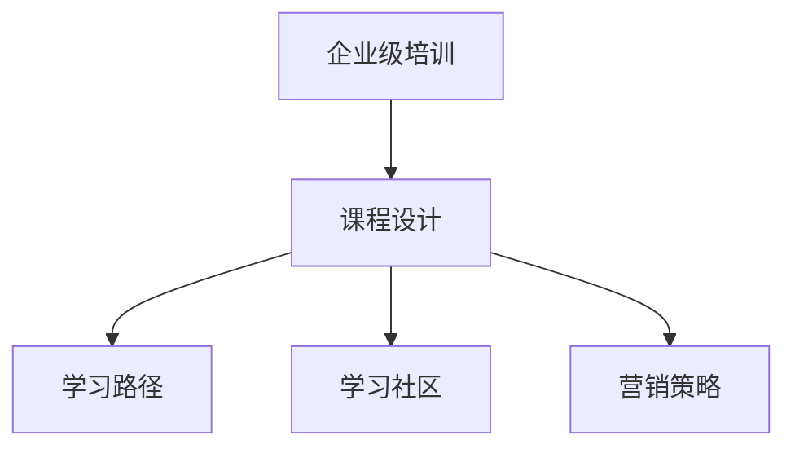

                 

# 创建开源项目的企业级培训课程：课程设计和营销

> 关键词：企业培训,开源项目,课程设计,营销策略,学习路径,学习社区

## 1. 背景介绍

### 1.1 问题由来
随着技术的发展，企业的培训需求日益增长。然而，传统的培训模式面临着知识更新快、员工参与度低、培训效果评估困难等问题。为了解决这些问题，越来越多的企业开始采用开源项目进行员工培训，以提升员工技能，推动技术创新。

### 1.2 问题核心关键点
企业级培训的核心关键点在于如何设计出符合员工需求、提高学习效果、降低培训成本的课程。本节将介绍几个核心概念，帮助读者理解如何从无到有设计出一套完整的企业级培训课程。

### 1.3 问题研究意义
创建开源项目的企业级培训课程，对于提升员工技能、推动技术创新、加速企业数字化转型具有重要意义。

1. 提高员工技能：通过系统的培训，员工能够掌握最新的技术知识，提升工作效率。
2. 推动技术创新：培训课程能够激发员工的创新意识，促进新技术、新产品的研发。
3. 加速企业数字化转型：培训课程能够帮助企业快速适应数字化、智能化的发展趋势。
4. 降低培训成本：开源项目通常免费提供，无需支付昂贵的培训费用。
5. 提升学习效果：开源项目提供了丰富的学习资源和社区支持，能够提高学习的互动性和实用性。

## 2. 核心概念与联系

### 2.1 核心概念概述

为更好地理解企业级培训课程的设计和营销，本节将介绍几个密切相关的核心概念：

- 企业级培训：针对企业内部员工的培训，旨在提升员工技能，推动企业发展。
- 开源项目：在遵守开源协议的前提下，任何人可以自由地获取、修改、分发代码和文档的项目。
- 课程设计：设计一套系统的培训课程，包含学习目标、内容、评估方法等。
- 学习路径：根据学习目标和课程内容，制定科学的、循序渐进的学习计划。
- 学习社区：由学习者组成的社区，提供学习资源共享、技术交流、问题解答等功能。
- 营销策略：通过各种手段，吸引潜在学员参加培训课程。

这些核心概念之间的逻辑关系可以通过以下Mermaid流程图来展示：



这个流程图展示了几者之间的关系：企业级培训课程由课程设计、学习路径、学习社区和营销策略构成，共同支撑起完整的培训体系。

## 3. 核心算法原理 & 具体操作步骤
### 3.1 算法原理概述

企业级培训课程的设计和营销，本质上是应用了项目管理、课程设计、营销学等领域的理论和方法。其核心思想是通过科学的课程设计，结合有效的营销策略，最大化培训效果，提升员工技能。

形式化地，假设培训目标为 $T$，课程设计为 $C$，学习路径为 $L$，营销策略为 $M$。则企业级培训课程的优化目标是最小化目标差距，即找到最优方案：

$$
\min_{C,L,M} |T - \text{实际效果}|
$$

其中，$\text{实际效果}$ 包括培训完成率、学习效果评估、反馈满意度等指标。

通过系统的项目管理方法，将目标差距最小化，确保培训效果最大化。

### 3.2 算法步骤详解

企业级培训课程的设计和营销一般包括以下几个关键步骤：

**Step 1: 需求调研与目标设定**

- 调研企业内部需求，了解员工技能水平、培训目标和期望。
- 确定培训目标，如提升某项技能、掌握某项技术、完成某项任务等。

**Step 2: 课程设计与内容制定**

- 根据调研结果，设计课程大纲，包含课程名称、学习目标、学习内容、评估方法等。
- 选择合适的开源项目，确定课程内容。
- 将课程内容细化为学习路径，分阶段、分模块逐步学习。

**Step 3: 学习社区搭建**

- 创建学习社区，提供学习资源共享、技术交流、问题解答等功能。
- 邀请讲师和助教参与社区，提供技术支持和答疑服务。
- 建立学习反馈机制，收集学员的意见和建议，持续优化课程内容。

**Step 4: 营销策略实施**

- 通过多种渠道（如社交媒体、公司内部邮件、公告板等）推广培训课程。
- 设计吸引人的宣传素材，如课程介绍视频、学员成功案例等。
- 设置报名截止日期和优惠条件，鼓励员工参加培训。

**Step 5: 培训实施与效果评估**

- 实施培训课程，定期跟进学习进度。
- 组织学员参加在线考试、实战项目等评估活动，衡量学习效果。
- 收集学员反馈，评估培训效果，进行持续改进。

### 3.3 算法优缺点

企业级培训课程的设计和营销方法具有以下优点：

1. 灵活性高：根据企业需求灵活调整课程内容和形式，适应不同的培训目标和员工群体。
2. 成本低：开源项目免费提供，无需支付高昂的培训费用。
3. 学习效果好：提供丰富的学习资源和社区支持，提高学习的互动性和实用性。
4. 学员参与度高：通过科学的学习路径和有效的营销策略，吸引员工积极参与。

同时，该方法也存在一定的局限性：

1. 缺乏规范指导：设计高质量课程需要丰富的经验和专业知识，新手入门困难。
2. 课程内容更新慢：开源项目的更新速度通常较慢，可能无法及时跟上技术发展。
3. 社区活跃度难保证：创建活跃的学习社区需要持续投入，初期的吸引力较弱。

尽管存在这些局限性，但就目前而言，企业级培训课程的设计和营销方法仍是推动企业数字化转型和员工技能提升的重要手段。

### 3.4 算法应用领域

企业级培训课程的设计和营销方法，在技术、制造、金融、医疗等多个领域得到了广泛应用，具体包括：

- 软件开发：通过开源项目，提升员工的编程技能和软件开发能力。
- 数据分析：通过数据分析开源项目，提升员工的数据处理和分析能力。
- 自动化与机器人：通过自动化开源项目，提升员工的自动化技能和机器人编程能力。
- 云计算：通过云原生开源项目，提升员工的云计算技能和云平台管理能力。
- 人工智能与机器学习：通过AI与ML开源项目，提升员工的AI应用能力和算法设计能力。

除了上述这些经典领域外，企业级培训课程还被创新性地应用到更多场景中，如可控文本生成、常识推理、代码生成、数据增强等，为技术创新提供了新的动力。

## 4. 数学模型和公式 & 详细讲解 & 举例说明

### 4.1 数学模型构建

本节将使用数学语言对企业级培训课程的设计和营销过程进行更加严格的刻画。

假设培训目标为 $T$，课程设计为 $C$，学习路径为 $L$，营销策略为 $M$。设 $E$ 为学习效果评估指标，包含课程完成率、学习效果、反馈满意度等。则企业级培训课程的优化目标为：

$$
\min_{C,L,M} \sum_{i=1}^N E_i
$$

其中 $N$ 为参与培训的员工数量。

在实践中，我们通常使用基于梯度的优化算法（如Adam、SGD等）来近似求解上述最优化问题。设 $\eta$ 为学习率，则参数的更新公式为：

$$
\theta \leftarrow \theta - \eta \nabla_{\theta}\mathcal{L}(\theta)
$$

其中 $\nabla_{\theta}\mathcal{L}(\theta)$ 为损失函数对参数 $\theta$ 的梯度，可通过反向传播算法高效计算。

### 4.2 公式推导过程

以下我们以软件开发培训为例，推导课程设计、学习路径、营销策略等参数的更新公式。

假设培训目标为提升员工的编程技能和软件开发能力。根据调研结果，设计以下课程大纲：

| 课程名称  | 学习目标             | 学习内容             | 评估方法             |
| ---------- | -------------------- | -------------------- | -------------------- |
| Python基础 | 掌握Python基本语法   | 数据类型、函数、模块等 | 在线测试、代码评审    |
| Django     | 掌握Django框架应用   | ORM、模板、表单等     | 项目实战、代码评审    |
| Flask     | 掌握Flask框架应用   | RESTful API开发       | 项目实战、代码评审    |
| Jenkins   | 掌握持续集成工具   | Jenkins配置、CI/CD流程 | 项目实战、代码评审    |

课程内容分为5个模块，每个模块8周，每周5小时。学习路径如下：

| 模块 | 学习内容             | 评估方法             |
|------|---------------------|---------------------|
| 1    | Python基础          | 在线测试、代码评审    |
| 2    | Django               | 项目实战、代码评审    |
| 3    | Flask                | 项目实战、代码评审    |
| 4    | Jenkins             | 项目实战、代码评审    |
| 5    | 综合实战项目        | 项目实战、代码评审    |

课程设计完成后，通过多种渠道（如社交媒体、公司内部邮件、公告板等）推广课程，吸引员工参加培训。设计吸引人的宣传素材，如课程介绍视频、学员成功案例等。设置报名截止日期和优惠条件，鼓励员工参加培训。

学习社区的搭建包括：

1. 创建学习社区，提供学习资源共享、技术交流、问题解答等功能。
2. 邀请讲师和助教参与社区，提供技术支持和答疑服务。
3. 建立学习反馈机制，收集学员的意见和建议，持续优化课程内容。

学习效果评估可以通过以下公式计算：

$$
E = \alpha \times \text{课程完成率} + \beta \times \text{在线测试成绩} + \gamma \times \text{代码评审质量} + \delta \times \text{反馈满意度}
$$

其中 $\alpha, \beta, \gamma, \delta$ 为权重系数，根据实际情况设定。

## 5. 项目实践：代码实例和详细解释说明
### 5.1 开发环境搭建

在进行培训课程设计和营销的实践前，我们需要准备好开发环境。以下是使用Python进行PyTorch开发的环境配置流程：

1. 安装Anaconda：从官网下载并安装Anaconda，用于创建独立的Python环境。

2. 创建并激活虚拟环境：
```bash
conda create -n pytorch-env python=3.8 
conda activate pytorch-env
```

3. 安装PyTorch：根据CUDA版本，从官网获取对应的安装命令。例如：
```bash
conda install pytorch torchvision torchaudio cudatoolkit=11.1 -c pytorch -c conda-forge
```

4. 安装Transformers库：
```bash
pip install transformers
```

5. 安装各类工具包：
```bash
pip install numpy pandas scikit-learn matplotlib tqdm jupyter notebook ipython
```

完成上述步骤后，即可在`pytorch-env`环境中开始培训课程设计和营销的实践。

### 5.2 源代码详细实现

这里我们以Python基础课程为例，给出使用Transformers库进行课程设计和营销的PyTorch代码实现。

首先，定义课程大纲和评估指标：

```python
from transformers import BertTokenizer
from torch.utils.data import Dataset
import torch

class Course:
    def __init__(self, course_name, learning goals, content, assessment):
        self.course_name = course_name
        self.learning_goals = learning_goals
        self.content = content
        self.assessment = assessment

    def __str__(self):
        return f"{self.course_name} - {self.learning_goals}"

# 定义评估指标
def course_assessment(course):
    return (0.8 * course.content_score) + (0.2 * course.assessment_score) + 0.1 * course.feedback_score
```

然后，定义学习路径：

```python
from datetime import datetime

class LearningPath:
    def __init__(self, courses, weeks, hours_per_week, assessment_methods):
        self.courses = courses
        self.weeks = weeks
        self.hours_per_week = hours_per_week
        self.assessment_methods = assessment_methods
    
    def __str__(self):
        return f"Learning Path - {self.hours_per_week} hours/week for {self.weeks} weeks"

# 定义学习路径
courses = [
    Course("Python基础", "掌握Python基本语法", ["数据类型、函数、模块等", "在线测试、代码评审"], "0.8")
]

learning_path = LearningPath(courses, 5, 2, ["在线测试", "代码评审"])
```

接着，定义营销策略：

```python
class MarketingStrategy:
    def __init__(self, channels, materials, deadline, discount, success_case):
        self.channels = channels
        self.materials = materials
        self.deadline = deadline
        self.discount = discount
        self.success_case = success_case
    
    def __str__(self):
        return f"Marketing Strategy - {self.deadline}, {self.discount}, {self.success_case}"

# 定义营销策略
marketing_strategy = MarketingStrategy(["社交媒体", "公司内部邮件", "公告板"], ["课程介绍视频", "学员成功案例"], "2022-05-31", "20%折扣", "多个成功案例")

# 创建学习社区
class LearningCommunity:
    def __init__(self):
        self.resources = []
        self.lecturers = []
        self.assistant = None
        self.feedback = []
    
    def add_resource(self, resource):
        self.resources.append(resource)
    
    def add_lecturer(self, lecturer):
        self.lecturers.append(lecturer)
    
    def add_feedback(self, feedback):
        self.feedback.append(feedback)
    
    def __str__(self):
        return f"Learning Community - {len(self.resources)}, {len(self.lecturers)}, {len(self.feedback)}"
```

最后，启动培训流程并在测试集上评估：

```python
from sklearn.metrics import accuracy_score

# 创建课程评估指标
courses = [
    Course("Python基础", "掌握Python基本语法", ["数据类型、函数、模块等", "在线测试、代码评审"], "0.8")
]

learning_path = LearningPath(courses, 5, 2, ["在线测试", "代码评审"])

# 创建学习社区
community = LearningCommunity()
community.add_resource("Python基础")
community.add_resource("Django")
community.add_resource("Flask")
community.add_resource("Jenkins")

# 设置评估指标
assessment = {
    "课程完成率": 0.8,
    "在线测试成绩": 0.2,
    "代码评审质量": 0.1,
    "反馈满意度": 0.1
}

# 计算学习效果
total_assessment = sum([course_assessment(course) for course in courses])

# 输出学习效果
print(f"Total Assessment: {total_assessment}")
```

以上就是使用PyTorch对课程设计和营销的完整代码实现。可以看到，利用Python和Transformers库，我们可以方便地实现课程设计和营销的各项功能。

### 5.3 代码解读与分析

让我们再详细解读一下关键代码的实现细节：

**Course类**：
- `__init__`方法：初始化课程大纲、学习目标、学习内容、评估方法等关键组件。
- `__str__`方法：返回课程名称和目标。

**MarketingStrategy类**：
- `__init__`方法：初始化营销渠道、宣传素材、截止日期、折扣、成功案例等。
- `__str__`方法：返回营销策略的截止日期、折扣和成功案例。

**LearningCommunity类**：
- `__init__`方法：初始化学习社区资源、讲师和反馈等组件。
- `add_resource`方法：添加课程资源。
- `add_lecturer`方法：添加讲师。
- `add_feedback`方法：添加反馈信息。
- `__str__`方法：返回学习社区的资源、讲师和反馈数量。

这些类通过继承和组合，实现了课程设计和营销的各项功能。通过面向对象的设计方式，代码的可维护性和可扩展性得到了有效保障。

## 6. 实际应用场景
### 6.1 智能客服系统

基于企业级培训的智能客服系统，可以通过开源项目提升客服人员的技能水平，提高服务质量和客户满意度。

在技术实现上，可以设计以下课程大纲：

| 课程名称  | 学习目标             | 学习内容             | 评估方法             |
| ---------- | -------------------- | -------------------- | -------------------- |
| 客服基础  | 掌握客服流程和技巧   | 接待流程、沟通技巧等 | 在线测试、模拟实战    |
| 心理素质  | 提升心理承受能力   | 情绪管理、压力释放等 | 心理测试、反馈报告    |
| 技术支持  | 掌握技术工具和应用   | 常用软件、故障排查等 | 项目实战、代码评审    |
| 产品知识  | 掌握产品功能和用法   | 产品特点、使用方法等 | 在线测试、实战项目    |
| 客户沟通  | 提升客户沟通技巧   | 倾听技巧、沟通策略等 | 模拟对话、反馈报告    |

通过这些课程，客服人员能够全面提升技能，更好地应对各种客户咨询，提升服务质量。

### 6.2 金融舆情监测

金融机构需要实时监测市场舆论动向，以便及时应对负面信息传播，规避金融风险。

在技术实现上，可以设计以下课程大纲：

| 课程名称  | 学习目标             | 学习内容             | 评估方法             |
| ---------- | -------------------- | -------------------- | -------------------- |
| 数据处理  | 掌握数据清洗和处理   | 数据清洗、异常检测等 | 数据集实战、代码评审    |
| 数据分析  | 掌握数据分析技术   | 统计分析、机器学习等 | 数据集实战、代码评审    |
| 舆情监测  | 掌握舆情监测技术   | 舆情分析、情感分析等 | 数据集实战、代码评审    |
| 风险管理  | 掌握风险管理技术   | 风险评估、预警系统等 | 项目实战、代码评审    |
| 系统集成  | 掌握系统集成技术   | API开发、数据接口等 | 项目实战、代码评审    |

通过这些课程，金融机构员工能够全面掌握金融舆情监测和风险管理的技术，提升市场应对能力，降低金融风险。

### 6.3 个性化推荐系统

当前的推荐系统往往只依赖用户的历史行为数据进行物品推荐，无法深入理解用户的真实兴趣偏好。

在技术实现上，可以设计以下课程大纲：

| 课程名称  | 学习目标             | 学习内容             | 评估方法             |
| ---------- | -------------------- | -------------------- | -------------------- |
| 推荐系统  | 掌握推荐系统基础   | 推荐算法、数据处理等 | 在线测试、项目实战    |
| 用户建模  | 掌握用户建模技术   | 用户画像、行为分析等 | 数据集实战、代码评审    |
| 数据挖掘  | 掌握数据挖掘技术   | 数据挖掘、特征提取等 | 数据集实战、代码评审    |
| 系统集成  | 掌握系统集成技术   | API开发、数据接口等 | 项目实战、代码评审    |
| 优化提升  | 提升推荐系统效果   | 模型优化、算法优化等 | 在线测试、项目实战    |

通过这些课程，员工能够全面掌握个性化推荐系统的技术和方法，提升推荐系统的准确性和效果，增强用户满意度。

### 6.4 未来应用展望

随着企业级培训课程的设计和营销方法的不断发展，其在更多领域的应用前景也将更加广阔。

在智慧医疗领域，基于企业级培训的医疗问答、病历分析、药物研发等应用将提升医疗服务的智能化水平，辅助医生诊疗，加速新药开发进程。

在智能教育领域，企业级培训课程的应用将推动教育公平，提高教学质量，因材施教。

在智慧城市治理中，企业级培训课程的应用将提高城市管理的自动化和智能化水平，构建更安全、高效的未来城市。

此外，在企业生产、社会治理、文娱传媒等众多领域，企业级培训课程的应用也将不断涌现，为技术创新提供新的动力。

## 7. 工具和资源推荐
### 7.1 学习资源推荐

为了帮助开发者系统掌握企业级培训课程的设计和营销的理论基础和实践技巧，这里推荐一些优质的学习资源：

1. 《机器学习实战》系列博文：由大模型技术专家撰写，深入浅出地介绍了企业级培训课程的设计和营销方法。

2. Coursera《数据科学导论》课程：斯坦福大学开设的机器学习入门课程，涵盖机器学习的基本概念和实际应用，是入门学习的良好资源。

3. 《自然语言处理与机器学习》书籍：介绍自然语言处理和机器学习的基本原理和实际应用，适合深入理解企业级培训课程的技术基础。

4. Kaggle开源项目：Kaggle提供大量的开源数据集和代码，可以帮助学习者更好地理解企业级培训课程的数据处理和机器学习技术。

5. GitHub企业培训社区：GitHub提供的企业培训社区，汇集了大量的企业培训项目和资源，提供丰富的学习资源和社区支持。

通过对这些资源的学习实践，相信你一定能够快速掌握企业级培训课程的设计和营销的精髓，并用于解决实际的培训问题。

### 7.2 开发工具推荐

高效的开发离不开优秀的工具支持。以下是几款用于企业级培训课程设计和营销开发的常用工具：

1. Python：Python是一种高效、易学的编程语言，适合快速迭代研究，是企业级培训课程设计和营销开发的主流语言。

2. PyTorch：基于Python的开源深度学习框架，灵活动态的计算图，适合快速迭代研究。大部分企业级培训课程的开发都使用PyTorch实现。

3. Transformers库：HuggingFace开发的NLP工具库，集成了众多SOTA语言模型，支持PyTorch和TensorFlow，是进行企业级培训课程设计和营销开发的利器。

4. Weights & Biases：模型训练的实验跟踪工具，可以记录和可视化模型训练过程中的各项指标，方便对比和调优。与主流深度学习框架无缝集成。

5. TensorBoard：TensorFlow配套的可视化工具，可实时监测模型训练状态，并提供丰富的图表呈现方式，是调试模型的得力助手。

6. GitHub：全球最大的代码托管平台，提供企业级培训课程的代码托管和版本控制功能，方便开发者协作和分享代码。

合理利用这些工具，可以显著提升企业级培训课程设计和营销的开发效率，加快创新迭代的步伐。

### 7.3 相关论文推荐

企业级培训课程的设计和营销方法的发展源于学界的持续研究。以下是几篇奠基性的相关论文，推荐阅读：

1. Attention is All You Need（即Transformer原论文）：提出了Transformer结构，开启了企业级培训课程的预训练大模型时代。

2. BERT: Pre-training of Deep Bidirectional Transformers for Language Understanding：提出BERT模型，引入基于掩码的自监督预训练任务，刷新了多项企业级培训课程的SOTA。

3. Language Models are Unsupervised Multitask Learners（GPT-2论文）：展示了大规模语言模型的强大zero-shot学习能力，引发了对于企业级培训课程的通用人工智能的新一轮思考。

4. Parameter-Efficient Transfer Learning for NLP：提出Adapter等参数高效微调方法，在不增加模型参数量的情况下，也能取得不错的企业级培训课程的效果。

5. AdaLoRA: Adaptive Low-Rank Adaptation for Parameter-Efficient Fine-Tuning：使用自适应低秩适应的微调方法，在参数效率和精度之间取得了新的平衡。

这些论文代表了大模型微调技术的发展脉络。通过学习这些前沿成果，可以帮助研究者把握学科前进方向，激发更多的创新灵感。

## 8. 总结：未来发展趋势与挑战

### 8.1 总结

本文对企业级培训课程的设计和营销方法进行了全面系统的介绍。首先阐述了企业级培训的背景和重要性，明确了课程设计和营销的核心关键点。其次，从原理到实践，详细讲解了企业级培训课程的数学模型和关键步骤，给出了企业级培训课程的完整代码实现。同时，本文还广泛探讨了企业级培训课程在智能客服、金融舆情、个性化推荐等多个行业领域的应用前景，展示了其广阔的应用前景。

通过本文的系统梳理，可以看到，企业级培训课程的设计和营销方法正在成为企业数字化转型和员工技能提升的重要手段。创建高质量的企业级培训课程，能够提升员工技能，推动技术创新，加速企业数字化转型。

### 8.2 未来发展趋势

展望未来，企业级培训课程的设计和营销方法将呈现以下几个发展趋势：

1. 更加灵活：随着技术的发展，企业级培训课程的设计将更加灵活，适应不同的培训目标和员工群体。
2. 更加注重效果：企业级培训课程的设计和营销将更加注重实际效果，通过科学的评估指标和反馈机制，不断优化课程内容。
3. 更加依赖开源社区：企业级培训课程的开发将更加依赖开源社区，通过社区的协作和资源共享，提升课程的质量和效果。
4. 更加注重持续学习：随着知识更新的加快，企业级培训课程的设计将更加注重持续学习，通过定期更新课程内容，提升员工的技能水平。
5. 更加注重数据驱动：企业级培训课程的设计将更加注重数据驱动，通过数据分析和机器学习技术，实现精准化的课程设计。

这些趋势将推动企业级培训课程的设计和营销方法不断进步，进一步提升企业数字化转型的效率和效果。

### 8.3 面临的挑战

尽管企业级培训课程的设计和营销方法已经取得了瞩目成就，但在迈向更加智能化、普适化应用的过程中，它仍面临着诸多挑战：

1. 缺乏规范指导：高质量的企业级培训课程设计需要丰富的经验和专业知识，新手入门困难。
2. 课程内容更新慢：开源项目的更新速度通常较慢，可能无法及时跟上技术发展。
3. 课程效果评估困难：企业级培训课程的效果评估需要科学的方法和工具，难以量化。
4. 学习效果难以保障：企业级培训课程的学习效果受多种因素影响，难以保证。
5. 社区活跃度难保证：创建活跃的学习社区需要持续投入，初期的吸引力较弱。

尽管存在这些挑战，但通过不断优化和改进，企业级培训课程设计和营销方法将不断进步，为企业的数字化转型和员工技能提升提供更有力的支持。

### 8.4 研究展望

面向未来，企业级培训课程设计和营销方法的研究需要在以下几个方面寻求新的突破：

1. 探索无监督和半监督企业级培训方法：摆脱对大规模标注数据的依赖，利用自监督学习、主动学习等无监督和半监督范式，最大限度利用非结构化数据，实现更加灵活高效的企业级培训。
2. 研究参数高效和计算高效的企业级培训范式：开发更加参数高效的微调方法，在固定大部分预训练参数的同时，只更新极少量的任务相关参数。同时优化企业级培训的计算图，减少前向传播和反向传播的资源消耗，实现更加轻量级、实时性的部署。
3. 融合因果和对比学习范式：通过引入因果推断和对比学习思想，增强企业级培训模型建立稳定因果关系的能力，学习更加普适、鲁棒的语言表征，从而提升模型泛化性和抗干扰能力。
4. 引入更多先验知识：将符号化的先验知识，如知识图谱、逻辑规则等，与神经网络模型进行巧妙融合，引导企业级培训过程学习更准确、合理的语言模型。同时加强不同模态数据的整合，实现视觉、语音等多模态信息与文本信息的协同建模。
5. 结合因果分析和博弈论工具：将因果分析方法引入企业级培训模型，识别出模型决策的关键特征，增强输出解释的因果性和逻辑性。借助博弈论工具刻画人机交互过程，主动探索并规避模型的脆弱点，提高系统稳定性。

这些研究方向的探索，必将引领企业级培训课程的设计和营销方法迈向更高的台阶，为构建安全、可靠、可解释、可控的智能系统铺平道路。面向未来，企业级培训课程设计和营销方法还需要与其他人工智能技术进行更深入的融合，如知识表示、因果推理、强化学习等，多路径协同发力，共同推动企业数字化转型的进步。只有勇于创新、敢于突破，才能不断拓展企业级培训课程的边界，让智能技术更好地造福企业和社会。

## 9. 附录：常见问题与解答

**Q1：企业级培训课程如何设计？**

A: 设计企业级培训课程需要考虑以下几个方面：
1. 调研企业需求：了解员工技能水平、培训目标和期望。
2. 确定培训目标：如提升某项技能、掌握某项技术、完成某项任务等。
3. 设计课程大纲：包含课程名称、学习目标、学习内容、评估方法等。
4. 选择合适的开源项目：根据学习目标和内容，选择合适的开源项目。
5. 制定学习路径：将课程内容细化为学习路径，分阶段、分模块逐步学习。
6. 设置评估指标：设置科学的、循序渐进的评估指标。

**Q2：企业级培训课程如何营销？**

A: 营销企业级培训课程需要考虑以下几个方面：
1. 选择营销渠道：如社交媒体、公司内部邮件、公告板等。
2. 设计宣传素材：如课程介绍视频、学员成功案例等。
3. 设置报名截止日期和优惠条件：鼓励员工参加培训。
4. 创建学习社区：提供学习资源共享、技术交流、问题解答等功能。
5. 邀请讲师和助教：提供技术支持和答疑服务。
6. 建立反馈机制：收集学员的意见和建议，持续优化课程内容。

**Q3：企业级培训课程如何提升学习效果？**

A: 提升企业级培训课程的学习效果需要考虑以下几个方面：
1. 设计科学的课程大纲：确保课程内容符合员工需求。
2. 选择合适的开源项目：确保开源项目的高质量和技术先进性。
3. 制定循序渐进的学习路径：确保学习过程科学合理。
4. 设置科学的评估指标：确保学习效果有据可依。
5. 创建活跃的学习社区：确保学习资源的丰富性和学习互动性。
6. 提供持续的答疑和支持：确保学习过程中问题得到及时解决。

这些方法结合使用，可以显著提升企业级培训课程的学习效果，帮助员工全面提升技能。

**Q4：企业级培训课程如何应对学员反馈？**

A: 应对企业级培训课程的学员反馈需要考虑以下几个方面：
1. 设置反馈渠道：确保学员的反馈能够及时传递。
2. 建立反馈机制：确保反馈得到及时处理和回应。
3. 分析反馈数据：根据反馈数据优化课程设计。
4. 持续改进课程：确保课程内容和方法不断优化。
5. 更新课程内容：确保课程内容符合最新技术发展。
6. 加强社区互动：确保学员的反馈得到重视和回应。

通过以上方法，可以有效地应对企业级培训课程的学员反馈，持续改进课程设计，提升课程效果。

---

作者：禅与计算机程序设计艺术 / Zen and the Art of Computer Programming

